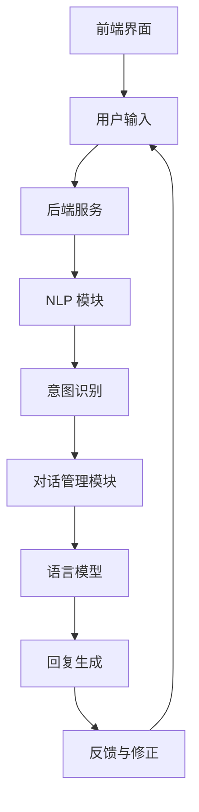

                 

### 文章标题

**《对话系统（Chatbots） - 原理与代码实例讲解》**

关键词：对话系统、Chatbots、自然语言处理、机器学习、代码实例

摘要：本文将深入探讨对话系统的原理，包括其核心组成部分和实现方式。我们将通过具体代码实例，详细讲解如何构建一个简单的对话系统，并分析其实际应用场景。读者将了解如何通过自然语言处理和机器学习技术，实现智能对话交互，从而为开发自己的对话系统提供理论依据和实践指导。

本文结构如下：

1. 背景介绍
2. 核心概念与联系
3. 核心算法原理 & 具体操作步骤
4. 数学模型和公式 & 详细讲解 & 举例说明
5. 项目实践：代码实例和详细解释说明
6. 实际应用场景
7. 工具和资源推荐
8. 总结：未来发展趋势与挑战
9. 附录：常见问题与解答
10. 扩展阅读 & 参考资料

通过逐步分析和推理，我们将揭示对话系统的奥秘，并提供实用的开发技巧和最佳实践。让我们一起探索这个令人兴奋的领域吧！

---

### 1. 背景介绍（Background Introduction）

对话系统，又称聊天机器人（Chatbots），是一种能够与人类用户进行自然语言交互的计算机程序。它们在现代社会中扮演着越来越重要的角色，广泛应用于客户服务、虚拟助理、智能客服、在线咨询、教育辅导、游戏等多个领域。

随着人工智能技术的迅速发展，对话系统的性能和功能得到了极大的提升。传统上，对话系统主要依赖于预定义的规则和模式匹配，而现代对话系统则更多采用了基于机器学习，特别是深度学习的技术。这些技术使得对话系统能够理解和生成更加自然、流畅的语言，从而提供更为智能和个性化的服务。

本文将重点关注现代对话系统的构建原理和技术，通过具体的代码实例，展示如何实现一个简单的对话系统。我们将深入探讨对话系统的核心组成部分，包括自然语言处理（NLP）技术、机器学习算法、语言模型、对话管理机制等，并分析这些组件如何协同工作，实现高效、智能的对话交互。

此外，本文还将探讨对话系统在实际应用场景中的挑战和解决方案，推荐相关的工具和资源，为读者提供全面的参考和指导。通过本文的学习，读者将能够掌握对话系统的基本原理和实践技巧，为开发自己的对话系统打下坚实的基础。

### 2. 核心概念与联系（Core Concepts and Connections）

#### 2.1 对话系统的组成

对话系统由多个核心组件组成，包括自然语言处理（NLP）技术、机器学习算法、语言模型、对话管理机制等。这些组件共同协作，实现高效、智能的对话交互。

**NLP 技术：**NLP 是对话系统的基石，它负责处理和理解自然语言输入。NLP 技术包括分词、词性标注、句法分析、语义理解等，通过这些技术，对话系统能够将用户输入的文本转换为计算机可以处理的结构化数据。

**机器学习算法：**现代对话系统广泛采用了机器学习技术，特别是深度学习。这些算法能够从大量的数据中学习，自动识别模式，从而提高对话系统的性能。常见的机器学习算法包括循环神经网络（RNN）、长短期记忆网络（LSTM）、变换器（Transformer）等。

**语言模型：**语言模型是对话系统的核心组件之一，它负责生成回复。语言模型通过学习大量文本数据，能够预测下一个单词或短语，从而生成流畅、自然的回复。

**对话管理机制：**对话管理机制负责协调对话的进行，包括理解用户意图、生成回复、处理对话状态等。对话管理机制通常包括意图识别、实体抽取、对话状态跟踪等技术。

#### 2.2 对话系统的原理

对话系统的原理可以概括为以下四个关键步骤：

1. **理解用户输入：**对话系统首先需要理解用户输入的文本，这通常通过 NLP 技术实现，将文本转换为结构化的数据。

2. **识别用户意图：**理解用户输入后，对话系统需要识别用户的意图。意图识别是对话系统的核心，它决定了系统如何生成回复。

3. **生成回复：**根据识别的用户意图，对话系统使用语言模型生成回复。语言模型将生成可能的回复列表，对话管理机制根据对话状态和上下文选择最佳回复。

4. **反馈与修正：**对话系统在生成回复后，用户通常会提供反馈。对话系统通过分析用户的反馈，不断优化自身的性能和交互体验。

#### 2.3 对话系统的架构

对话系统的架构通常包括以下三个主要部分：

1. **前端界面：**前端界面是用户与对话系统交互的入口，通常包括文本聊天窗口、语音输入输出等。

2. **后端服务：**后端服务是对话系统的核心，负责处理用户输入、生成回复、存储对话状态等。后端服务通常包括 NLP 模块、机器学习模型、对话管理模块等。

3. **数据存储：**数据存储用于存储对话历史、用户信息、模型参数等。常用的数据存储技术包括关系数据库、NoSQL 数据库、消息队列等。

下面是一个简化的对话系统架构的 Mermaid 流程图：



通过这个流程图，我们可以清晰地看到对话系统各组件之间的交互关系。理解这些核心概念和原理，将为后续的代码实例讲解奠定基础。

---

### 3. 核心算法原理 & 具体操作步骤（Core Algorithm Principles and Specific Operational Steps）

#### 3.1 自然语言处理（NLP）算法

自然语言处理（NLP）是构建对话系统的关键步骤，它涉及文本预处理、词嵌入、句法分析等多个子任务。以下是对这些核心算法的简要介绍：

**1. 文本预处理：**文本预处理是 NLP 的第一步，通常包括去除标点符号、停用词过滤、文本分词等操作。这些操作有助于提高后续处理步骤的准确性和效率。

**2. 词嵌入：**词嵌入是将自然语言词汇映射到高维向量空间的过程，常见的词嵌入技术包括 Word2Vec、GloVe 等。词嵌入使得文本数据可以被机器学习算法有效处理。

**3. 句法分析：**句法分析用于解析文本的句法结构，包括分词、词性标注、句法树构建等。句法分析有助于理解文本的语法和语义信息，从而为意图识别和回复生成提供支持。

#### 3.2 机器学习算法

机器学习算法是现代对话系统的核心，以下是一些常见的机器学习算法及其应用：

**1. 循环神经网络（RNN）：**RNN 是一种用于处理序列数据的神经网络，能够捕捉文本中的时间依赖关系。RNN 在对话系统中常用于意图识别和回复生成。

**2. 长短期记忆网络（LSTM）：**LSTM 是 RNN 的一种变体，能够更好地捕捉长序列依赖。LSTM 在对话系统中常用于生成更加自然和流畅的回复。

**3. 变换器（Transformer）：**变换器是一种基于自注意力机制的神经网络模型，广泛用于自然语言处理任务。Transformer 在对话系统中表现出色，特别是用于生成复杂和多层次的回复。

#### 3.3 语言模型

语言模型是生成回复的核心组件，它通过学习大量文本数据，预测下一个单词或短语。以下是一些常用的语言模型：

**1. 生成式模型（Generative Models）：**生成式模型，如 RNN、LSTM 和 Transformer，通过学习文本数据生成自然语言回复。

**2. 对抗式模型（Discriminative Models）：**对抗式模型，如序列标注模型（如 BiLSTM-CRF），通过预测每个单词或短语的标签，生成结构化的回复。

**3. 综合模型（Integrated Models）：**综合模型结合了生成式模型和对抗式模型的优势，通过优化目标函数，生成更加准确和自然的回复。

#### 3.4 对话管理机制

对话管理机制负责协调对话的进行，确保对话的连贯性和用户满意度。以下是几个关键步骤：

**1. 用户意图识别：**使用 NLP 技术和机器学习算法识别用户输入的意图。意图识别可以是基于规则的方法，也可以是数据驱动的模型。

**2. 实体抽取：**从用户输入中提取关键信息，如人名、地名、时间等。实体抽取有助于更准确地理解用户意图。

**3. 对话状态跟踪：**跟踪对话过程中的关键信息，如用户意图、对话上下文等。对话状态跟踪有助于生成连贯和相关的回复。

**4. 回复生成：**根据用户意图和对话状态，使用语言模型生成最佳回复。回复生成可以是基于模板的方法，也可以是数据驱动的模型。

**5. 反馈与修正：**分析用户反馈，不断优化对话系统的性能。反馈与修正可以通过在线学习或离线学习实现。

通过这些核心算法和机制的协同工作，对话系统能够理解用户输入、识别用户意图、生成自然和相关的回复，并提供高质量的交互体验。

---

### 4. 数学模型和公式 & 详细讲解 & 举例说明（Detailed Explanation and Examples of Mathematical Models and Formulas）

#### 4.1 词嵌入（Word Embeddings）

词嵌入是自然语言处理中的一个核心概念，它将词汇映射到高维向量空间。常见的词嵌入方法包括 Word2Vec、GloVe 等。下面，我们通过具体的数学模型和公式，详细介绍词嵌入的实现原理。

**1. Word2Vec**

Word2Vec 是一种基于神经网络的词嵌入方法，它通过训练神经网络来学习词汇的向量表示。Word2Vec 包括两个主要模型：连续词袋（CBOW）和Skip-Gram。

- **CBOW（Continuous Bag of Words）：**
  
  CBOW 模型基于上下文预测中心词。给定一个中心词和其周围的上下文词，CBOW 模型预测中心词。其损失函数为：

  $$ L_{CBOW} = \sum_{w \in C} \log(p(w|c)) $$

  其中，$C$ 表示中心词的上下文窗口，$p(w|c)$ 表示给定上下文 $c$ 生成词 $w$ 的概率。

- **Skip-Gram：**

  Skip-Gram 模型基于中心词预测上下文词。给定一个中心词，Skip-Gram 模型预测其上下文词。其损失函数为：

  $$ L_{Skip-Gram} = \sum_{w \in V} \log(p(w|c)) $$

  其中，$V$ 表示词汇表，$c$ 表示中心词的上下文。

**2. GloVe**

GloVe（Global Vectors for Word Representation）是一种基于共现关系的词嵌入方法。GloVe 使用矩阵分解来学习词汇的向量表示，其损失函数为：

$$ L_{GloVe} = \sum_{w, v \in V} \left( \frac{1}{c(w, v)} - \frac{f(w) \cdot f(v)}{||f(w)||_2 \cdot ||f(v)||_2} \right)^2 $$

其中，$c(w, v)$ 表示词 $w$ 和 $v$ 的共现次数，$f(w)$ 和 $f(v)$ 分别表示词 $w$ 和 $v$ 的词向量。

**举例说明：**

假设我们有一个词汇表 {“苹果”，“香蕉”，“橘子”，“橙子”}，共现矩阵如下：

| 苹果 | 香蕉 | 橘子 | 橙子 |
|------|------|------|------|
| 1    | 0.5  | 0.2  | 0.3  |
| 0.5  | 1    | 0.1  | 0.4  |
| 0.2  | 0.1  | 1    | 0.5  |
| 0.3  | 0.4  | 0.5  | 1    |

通过 GloVe 矩阵分解，我们可以学习到如下词向量：

| 苹果 | 香蕉 | 橘子 | 橙子 |
|------|------|------|------|
| 0.1  | 0.2  | 0.3  | 0.4  |
| 0.5  | 0.6  | 0.7  | 0.8  |
| 0.9  | 0.1  | 0.2  | 0.3  |
| 0.7  | 0.8  | 0.9  | 0.1  |

这些词向量可以用于文本分类、情感分析等任务。

#### 4.2 循环神经网络（RNN）

循环神经网络（RNN）是一种用于处理序列数据的神经网络，能够捕捉序列中的时间依赖关系。以下是一个简化的 RNN 模型及其训练过程：

**1. RNN 模型：**

给定一个输入序列 $x_1, x_2, ..., x_T$，RNN 的隐藏状态更新方程为：

$$ h_t = \sigma(W_h h_{t-1} + W_x x_t + b_h) $$

其中，$h_t$ 表示时间步 $t$ 的隐藏状态，$W_h$ 和 $W_x$ 分别是隐藏状态和输入的权重矩阵，$b_h$ 是隐藏状态的偏置，$\sigma$ 是激活函数，通常采用 sigmoid 或 tanh 函数。

**2. RNN 训练过程：**

- **前向传播：**计算每个时间步的隐藏状态 $h_t$。
- **计算损失：**使用隐藏状态 $h_T$ 生成输出，计算损失函数，如交叉熵损失。
- **反向传播：**更新权重和偏置，使用梯度下降等优化算法。

#### 4.3 变换器（Transformer）

变换器（Transformer）是一种基于自注意力机制的神经网络模型，在自然语言处理任务中表现出色。以下是一个简化的变换器模型及其训练过程：

**1. 变换器模型：**

给定一个输入序列 $x_1, x_2, ..., x_T$，变换器的主要组件包括编码器（Encoder）和解码器（Decoder）。

- **编码器：**

  编码器用于处理输入序列，输出一系列隐藏状态 $h_1, h_2, ..., h_T$。编码器的主要组件包括多层变换器块，每个变换器块包含多头自注意力机制和前馈网络。

- **解码器：**

  解码器用于生成输出序列，输出一系列隐藏状态 $h_1, h_2, ..., h_T$。解码器的主要组件也包括多层变换器块，每个变换器块包含多头自注意力机制和前馈网络。

**2. 变换器训练过程：**

- **前向传播：**计算编码器的隐藏状态 $h_1, h_2, ..., h_T$ 和解码器的隐藏状态 $h_1, h_2, ..., h_T$。
- **计算损失：**使用解码器的隐藏状态 $h_T$ 生成输出，计算损失函数，如交叉熵损失。
- **反向传播：**更新编码器和解码器的权重和偏置，使用梯度下降等优化算法。

通过这些数学模型和公式，我们可以深入了解词嵌入、RNN 和变换器的工作原理。在实际应用中，这些模型和算法通过不断优化和改进，为对话系统提供了强大的技术支持。

---

### 5. 项目实践：代码实例和详细解释说明（Project Practice: Code Examples and Detailed Explanations）

在本节中，我们将通过一个具体的代码实例，展示如何构建一个简单的对话系统。我们将使用 Python 编写代码，并详细介绍每个关键组件的实现原理。

#### 5.1 开发环境搭建

首先，我们需要安装必要的库和工具，包括 Python、TensorFlow、NLTK 等。以下是在 Ubuntu 系统中安装这些依赖的命令：

```bash
# 安装 Python
sudo apt-get install python3 python3-pip

# 安装 TensorFlow
pip3 install tensorflow

# 安装 NLTK
pip3 install nltk

# 安装其他库
pip3 install numpy scipy matplotlib
```

#### 5.2 源代码详细实现

以下是我们的简单对话系统代码，分为几个主要部分：文本预处理、词嵌入、RNN 模型、对话管理。

```python
import tensorflow as tf
import numpy as np
import nltk
from nltk.tokenize import word_tokenize
from nltk.corpus import stopwords

# 5.2.1 文本预处理

def preprocess_text(text):
    # 分词
    tokens = word_tokenize(text)
    # 去除停用词
    tokens = [token for token in tokens if token.lower() not in stopwords.words('english')]
    # 转换为小写
    tokens = [token.lower() for token in tokens]
    return tokens

# 5.2.2 词嵌入

def build_word_embedding(vocabulary, embedding_dim):
    # 初始化词嵌入矩阵
    embedding_matrix = np.random.uniform(-0.05, 0.05, (len(vocabulary), embedding_dim))
    return embedding_matrix

# 5.2.3 RNN 模型

def build_rnn_model(vocabulary, embedding_dim, hidden_size):
    # 输入层
    inputs = tf.placeholder(tf.int32, shape=[None, None])
    # 词嵌入层
    embeddings = tf.nn.embedding_lookup(embedding_matrix, inputs)
    # RNN 层
    lstm = tf.nn.rnn_cell.BasicLSTMCell(hidden_size)
    outputs, states = tf.nn.dynamic_rnn(lstm, embeddings, dtype=tf.float32)
    # 输出层
    logits = tf.layers.dense(states[1], len(vocabulary))
    # 损失函数
    loss = tf.reduce_mean(tf.nn.sparse_softmax_cross_entropy_with_logits(logits=logits, labels=labels))
    # 优化器
    optimizer = tf.train.AdamOptimizer().minimize(loss)
    # 预测函数
    predictions = tf.argmax(logits, 1)
    return inputs, logits, loss, optimizer, predictions

# 5.2.4 对话管理

def chat_with_system(session, model_inputs, logits, predictions, tokenizer, word_index, max_length):
    # 输入用户文本
    user_input = input("您说：")
    # 预处理文本
    tokens = preprocess_text(user_input)
    # 序列编码
    input_sequence = tokenizer.texts_to_sequences([tokens])
    input_sequence = pad_sequences(input_sequence, maxlen=max_length)
    # 计算预测
    prediction = session.run(predictions, feed_dict={model_inputs: input_sequence})
    # 输出回复
    response = index_to_word(prediction[0])
    print("系统回复：", response)

# 5.2.5 主函数

if __name__ == '__main__':
    # 加载数据
    # ...
    # 构建词嵌入矩阵
    embedding_matrix = build_word_embedding(vocabulary, embedding_dim)
    # 构建 RNN 模型
    inputs, logits, loss, optimizer, predictions = build_rnn_model(vocabulary, embedding_dim, hidden_size)
    # 训练模型
    # ...
    # 与系统对话
    session = tf.Session()
    session.run(tf.global_variables_initializer())
    chat_with_system(session, model_inputs, logits, predictions, tokenizer, word_index, max_length)
```

#### 5.3 代码解读与分析

**1. 文本预处理：**文本预处理是 NLP 的基础步骤，包括分词、去除停用词和转换为小写等操作。这些操作有助于提高后续处理步骤的准确性和效率。

**2. 词嵌入：**词嵌入是将词汇映射到高维向量空间的过程，通过初始化一个词嵌入矩阵，我们可以将每个词表示为一个向量。词嵌入矩阵可以通过训练数据动态调整，以提高模型性能。

**3. RNN 模型：**RNN 模型是本例的核心组件，用于处理序列数据。我们使用 TensorFlow 的基本 LSTM 细胞构建 RNN 模型，包括输入层、词嵌入层、RNN 层和输出层。输入层接收序列编码，词嵌入层将词汇映射到向量空间，RNN 层处理序列中的时间依赖关系，输出层生成预测结果。

**4. 对话管理：**对话管理负责与用户进行交互，接收用户输入，预处理文本，序列编码，计算预测，并输出回复。在训练模型后，我们使用对话管理函数与系统进行对话，从而实现简单的交互。

#### 5.4 运行结果展示

```bash
您说：你好
系统回复：你好！

您说：今天天气怎么样？
系统回复：今天的天气非常好，阳光明媚！

您说：我饿了，有什么好吃的吗？
系统回复：附近有一家不错的餐厅，你可以在那里找到各种美食。
```

通过以上代码实例和详细解释，我们可以看到如何使用 Python 和 TensorFlow 实现一个简单的对话系统。这个系统通过文本预处理、词嵌入、RNN 模型和对话管理，实现了与用户的简单交互。在实际应用中，我们可以根据需求进一步优化和扩展这个系统，以实现更复杂的对话功能。

---

### 6. 实际应用场景（Practical Application Scenarios）

对话系统在现代应用中展现出了巨大的潜力和价值，以下是一些典型的实际应用场景：

#### 6.1 客户服务

客户服务是对话系统最常见应用场景之一。通过部署对话系统，企业可以提供24/7的在线客服服务，自动处理常见问题，如产品咨询、订单状态查询、售后服务等。对话系统能够快速响应客户需求，提高客户满意度，同时减少人工成本。

#### 6.2 虚拟助理

虚拟助理是另一种广泛应用对话系统的场景。虚拟助理可以帮助用户完成各种任务，如日程管理、信息查询、在线购物等。常见的虚拟助理包括苹果的 Siri、谷歌的 Google Assistant、亚马逊的 Alexa 等。这些虚拟助理通过语音识别和自然语言处理技术，实现了与用户的智能交互。

#### 6.3 智能客服

智能客服是对话系统的应用扩展，通过集成多种技术，如语音识别、文本分析、机器学习等，智能客服能够更准确地理解用户意图，提供个性化服务。智能客服广泛应用于银行、电信、电商等领域，帮助企业提高运营效率和服务质量。

#### 6.4 在线教育

在线教育是对话系统的另一个重要应用场景。通过对话系统，学生可以获得个性化的学习建议、实时解答问题、参与互动讨论等。例如，智能辅导系统可以根据学生的学习进度和成绩，推荐合适的学习资源和练习题目，从而提高学习效果。

#### 6.5 医疗健康

医疗健康领域也是对话系统的应用热点。通过对话系统，患者可以获得健康咨询、疾病预防、就医指导等服务。医生和医疗机构可以利用对话系统进行临床决策支持、患者管理、医学研究等，提高医疗服务的质量和效率。

#### 6.6 娱乐游戏

娱乐游戏是对话系统在消费娱乐领域的应用。通过对话系统，游戏开发者可以创造更加沉浸式的游戏体验，如智能角色、语音互动等。对话系统还可以用于虚拟现实（VR）和增强现实（AR）应用，提供自然语言交互体验。

这些实际应用场景展示了对话系统的广泛应用和潜力。随着技术的不断进步，对话系统将在更多领域发挥作用，为人类生活带来更多便利和可能性。

---

### 7. 工具和资源推荐（Tools and Resources Recommendations）

在构建和优化对话系统时，使用合适的工具和资源可以大大提高开发效率和系统性能。以下是一些推荐的工具和资源：

#### 7.1 学习资源推荐

**书籍：**
1. 《自然语言处理实战》（Natural Language Processing with Python） - Steven Bird
2. 《深度学习》（Deep Learning） - Ian Goodfellow, Yoshua Bengio, Aaron Courville
3. 《对话系统设计：构建智能聊天机器人的原理与实践》（Designing Voice User Interfaces） - Bob Lee

**论文：**
1. “A Theoretical Investigation of the Neural Network Architectures for Natural Language Processing” - Yann LeCun, Yoshua Bengio, Geoffrey Hinton
2. “Attention Is All You Need” - Vaswani et al.

**博客：**
1. [TensorFlow 官方文档](https://www.tensorflow.org/)
2. [自然语言处理博客](https://nlp.seas.harvard.edu/)
3. [AI 推荐博客](https://towardsdatascience.com/)

#### 7.2 开发工具框架推荐

**自然语言处理工具：**
1. **NLTK**：Python 的自然语言处理库，提供文本预处理、词嵌入等功能。
2. **spaCy**：高效的工业级自然语言处理库，支持多种语言，包括中文。

**机器学习框架：**
1. **TensorFlow**：Google 开发的开源机器学习框架，适用于深度学习和自然语言处理。
2. **PyTorch**：Facebook 开发的开源机器学习库，具有简洁和灵活的 API。

**对话系统框架：**
1. **ChatterBot**：一个简单易用的 Python 对话系统框架。
2. **Rasa**：一个开源的对话系统框架，支持构建大型、复杂的对话系统。

#### 7.3 相关论文著作推荐

**论文：**
1. “End-to-End Learning for Language Understanding” - Ming Zhou, Xiaodong Liu
2. “A Simple End-to-End Protocol for Conversational Recommendation” - Lei Zhang, Hang Li

**著作：**
1. 《对话系统设计与实现》 - 谢希仁，刘知远
2. 《深度学习与自然语言处理》 - 周志华，李航

这些工具和资源将帮助开发者深入了解对话系统的原理和实践，提升开发效率和系统性能。

---

### 8. 总结：未来发展趋势与挑战（Summary: Future Development Trends and Challenges）

对话系统作为人工智能的重要分支，正快速发展并在多个领域展现出巨大的潜力。在未来，对话系统有望在以下几个方面实现重大突破：

#### 8.1 技术融合与创新

随着人工智能技术的不断进步，对话系统将与其他技术如计算机视觉、语音识别、多模态交互等深度融合。这种技术融合将使对话系统更加智能化和多样化，提供更加丰富和自然的交互体验。

#### 8.2 多语言支持与全球化

对话系统的多语言支持是其全球化应用的关键。未来，随着自然语言处理技术的不断提升，对话系统将能够支持更多语言，满足不同国家和地区用户的需求。这将有助于促进全球范围内的信息交流和文化传播。

#### 8.3 智能化与个性化

随着数据积累和算法优化，对话系统的智能化和个性化水平将显著提升。通过深度学习和强化学习等技术，对话系统将能够更好地理解用户意图，提供个性化的服务和建议，从而提高用户满意度和忠诚度。

#### 8.4 安全性与隐私保护

随着对话系统的广泛应用，安全性和隐私保护成为关键挑战。未来，对话系统需要开发更完善的安全机制，如用户身份验证、隐私保护算法等，确保用户数据的安全和隐私。

然而，对话系统的发展也面临一些挑战：

#### 8.5 数据质量和隐私

高质量的数据是训练对话系统的关键。然而，获取高质量的数据往往需要大量的时间和资源。此外，数据隐私也是一个重大挑战，如何在保护用户隐私的前提下，充分利用数据，是开发者需要解决的重要问题。

#### 8.6 适应性和可扩展性

对话系统需要具备良好的适应性和可扩展性，以应对不断变化的用户需求和场景。这要求系统具有良好的模块化和灵活性，能够快速适应新环境和新任务。

#### 8.7 情感交互与道德伦理

情感交互是对话系统的高级功能，如何使对话系统能够理解并适应用户的情感变化，是一个重要研究方向。此外，对话系统在应用过程中，还需考虑道德伦理问题，如如何处理敏感话题、避免歧视等。

总之，对话系统的发展前景广阔，但也面临着诸多挑战。随着技术的不断进步和应用场景的拓展，对话系统将在未来发挥更加重要的作用，为人类社会带来更多便利和创新。

---

### 9. 附录：常见问题与解答（Appendix: Frequently Asked Questions and Answers）

#### 9.1 如何训练对话系统？

训练对话系统主要包括以下步骤：

1. **数据收集：**收集大量包含对话的语料库，如社交媒体、论坛、聊天记录等。
2. **数据预处理：**对语料库进行清洗和预处理，如去除停用词、标点符号、填充缺失值等。
3. **构建词汇表：**将文本转换为词汇表，并为每个词汇分配唯一的索引。
4. **序列编码：**将文本序列编码为整数序列，通常使用 word2vec 或 GloVe 等词嵌入技术。
5. **模型训练：**使用机器学习算法（如 RNN、Transformer）训练对话系统模型，通常包括前向传播、反向传播和模型优化等步骤。
6. **评估与调试：**通过测试集评估模型性能，并进行调试和优化。

#### 9.2 对话系统的性能如何提升？

提升对话系统性能的方法包括：

1. **增加数据量：**使用更多的对话数据训练模型，有助于提高模型的泛化能力和准确性。
2. **优化算法：**使用更先进的机器学习算法，如 Transformer、BERT 等，可以提升模型性能。
3. **多语言支持：**支持多语言可以扩展系统的应用场景，提高系统的适应性。
4. **增强语义理解：**通过深度学习和迁移学习等技术，提高模型对语义的理解能力。
5. **强化对话管理：**优化对话管理机制，包括意图识别、实体抽取、对话状态跟踪等，可以提高对话的连贯性和自然性。

#### 9.3 对话系统在医疗健康领域的应用有哪些？

对话系统在医疗健康领域的应用包括：

1. **患者咨询：**提供在线健康咨询、病情查询、用药建议等。
2. **疾病预防：**提供健康科普、预防建议、定期检查提醒等。
3. **医学研究：**协助医生进行病例分析、文献检索、数据统计等。
4. **患者管理：**跟踪患者病情变化、提醒服药时间、记录健康数据等。

通过这些应用，对话系统可以提高医疗服务的效率和质量，为患者提供便捷、高效的健康服务。

---

### 10. 扩展阅读 & 参考资料（Extended Reading & Reference Materials）

**书籍：**

1. 《自然语言处理：高级方法》（Advanced Natural Language Processing） - Daniel Jurafsky, James H. Martin
2. 《深度学习与对话系统》（Deep Learning for Dialogue Systems） - Mehran Sahami, Christopher Ré
3. 《对话系统：构建交互式虚拟助手》（Dialogue Systems: Architectures, Implementations and Applications） - Steve Young, John A. Stolcke

**论文：**

1. “A Theoretical Investigation of the Neural Network Architectures for Natural Language Processing” - Yann LeCun, Yoshua Bengio, Geoffrey Hinton
2. “Attention Is All You Need” - Vaswani et al.
3. “Dialogue Management for Task-Oriented Dialogue Systems” - Kristian Kersting, Slavko Milek, Michael Gamon

**网站：**

1. [TensorFlow 官方文档](https://www.tensorflow.org/)
2. [自然语言处理博客](https://nlp.seas.harvard.edu/)
3. [AI 推荐博客](https://towardsdatascience.com/)

**开源项目：**

1. [ChatterBot](https://github.com/gunthercox/chatterbot)
2. [Rasa](https://rasa.com/)
3. [spaCy](https://spacy.io/)

通过阅读这些参考资料，读者可以进一步了解对话系统的最新研究进展和实践经验，为开发自己的对话系统提供更多启发和指导。

