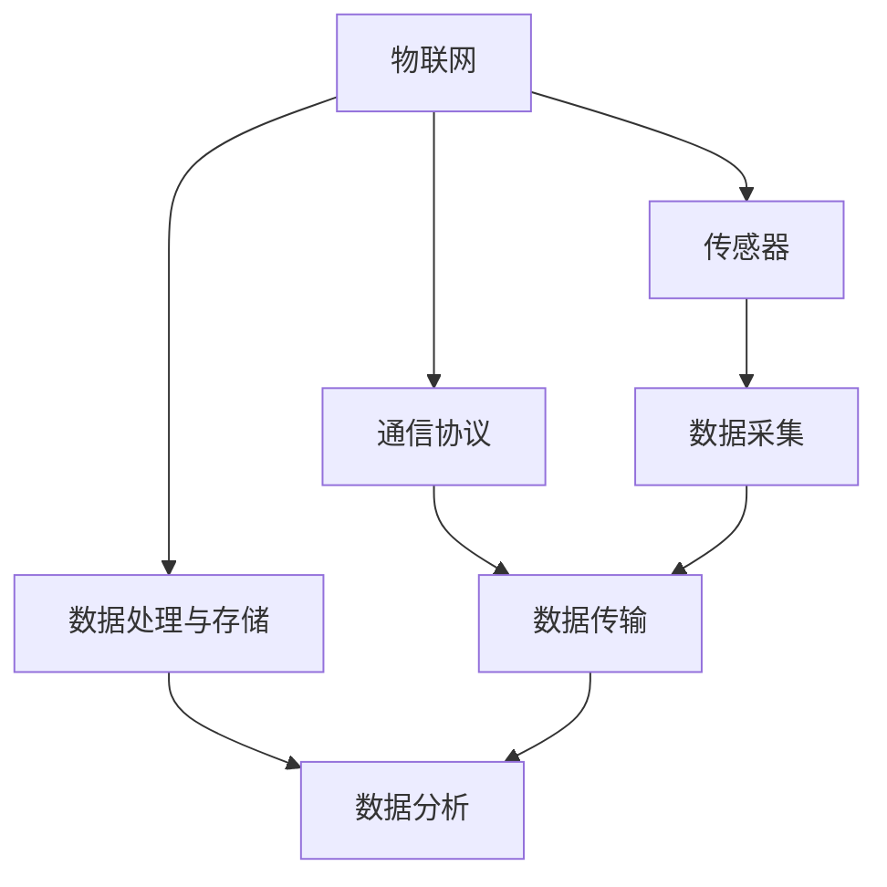

                 

### 文章标题

### Title: 

**“2024 小米 IOT 平台部校招面试真题汇总及其解答”**

### Summary:

本文将汇总2024年小米IOT平台部校招的面试真题，并对其逐一进行详细解答。通过对这些真题的分析，帮助读者了解IOT领域的核心知识点，提升面试应对能力。文章涵盖IOT基础理论、硬件与软件设计、网络通信、数据安全等方面，旨在为准备小米IOT平台部面试的考生提供有力支持。

### Introduction:

In this article, we will compile and provide detailed solutions to the interview questions from Xiaomi's IOT Platform Department's campus recruitment for 2024. By analyzing these questions, readers can gain insights into the core concepts of the IOT field and improve their interview preparation. The article covers fundamental theories of IOT, hardware and software design, network communication, data security, and more, aiming to provide strong support for candidates preparing for the Xiaomi IOT Platform Department's interview.

### 背景介绍（Background Introduction）

#### Background Introduction:

小米（Xiaomi）作为全球知名的智能硬件及电子设备品牌，其IOT（物联网）平台在全球范围内具有广泛的影响力。小米IOT平台部致力于打造智能生活的全场景覆盖，涵盖智能家居、可穿戴设备、智能交通等多个领域。随着智能家居市场的快速发展和用户需求的不断提升，小米IOT平台部的校招面试成为众多技术人才追逐的焦点。

#### Background Introduction:

Xiaomi, a globally renowned brand in smart hardware and electronic devices, has a significant influence on the IOT platform globally. The Xiaomi IOT Platform Department is committed to creating a comprehensive smart life experience, covering multiple domains such as smart homes, wearable devices, and smart transportation. With the rapid development of the smart home market and the growing user demand, the campus recruitment interview for the Xiaomi IOT Platform Department has become a focus for many technical talents.

### 核心概念与联系（Core Concepts and Connections）

#### Core Concepts and Connections:

在小米IOT平台部校招面试中，核心概念和联系的考查是必不可少的。以下是几个重要的核心概念及其相互之间的联系：

1. **物联网（IOT）**：物联网是指将各种物理设备通过互联网连接起来，实现设备之间的数据交换和协同工作。它是智能家居、智能交通、智能医疗等应用的基础。
2. **传感器**：传感器是物联网设备的核心组成部分，用于感知外部环境并将物理信号转化为电子信号，如温度传感器、湿度传感器、运动传感器等。
3. **通信协议**：通信协议是物联网设备之间进行数据传输的标准规范，如ZigBee、Wi-Fi、蓝牙等。不同协议有不同的优点和适用场景，需要根据实际需求进行选择。
4. **数据处理与存储**：物联网设备采集到的数据需要通过数据处理和存储进行管理和分析，常用的技术包括云计算、大数据、人工智能等。

#### Core Concepts and Connections:

In the campus recruitment interview for Xiaomi's IOT Platform Department, the examination of core concepts and connections is essential. Here are several important core concepts and their relationships:

1. **Internet of Things (IOT)**: IOT refers to the connection of various physical devices through the internet to enable data exchange and collaborative work among devices. It is the foundation for applications such as smart homes, smart transportation, and smart healthcare.
2. **Sensors**: Sensors are the core component of IOT devices, used to perceive the external environment and convert physical signals into electronic signals, such as temperature sensors, humidity sensors, and motion sensors.
3. **Communication Protocols**: Communication protocols are standard specifications for data transmission among IOT devices, such as ZigBee, Wi-Fi, and Bluetooth. Different protocols have different advantages and application scenarios, and they need to be selected based on actual requirements.
4. **Data Processing and Storage**: The data collected by IOT devices needs to be processed and stored for management and analysis through technologies such as cloud computing, big data, and artificial intelligence.

### Mermaid 流程图

#### Mermaid Flowchart

下面是一个简单的 Mermaid 流程图，展示物联网（IOT）的核心组成部分及其相互关系：



### Mermaid Flowchart

Below is a simple Mermaid flowchart showing the core components and their relationships in the Internet of Things (IOT):


### 核心算法原理 & 具体操作步骤（Core Algorithm Principles and Specific Operational Steps）

#### Core Algorithm Principles and Specific Operational Steps:

在小米IOT平台部校招面试中，核心算法原理和具体操作步骤的考查也是关键环节。以下是一个示例题目及其解答：

**题目**：请描述如何在IOT设备中进行数据加密与解密。

**解答**：

1. **选择加密算法**：首先需要根据实际需求选择合适的加密算法，如AES（高级加密标准）、RSA（非对称加密算法）等。
2. **生成密钥**：加密算法需要密钥进行加密和解密，密钥可以由设备内置硬件安全模块（HSM）生成，或通过安全协议（如SSL/TLS）进行交换。
3. **数据加密**：使用选择的加密算法和密钥对数据进行加密，确保数据在传输过程中不会被窃取或篡改。
4. **数据传输**：将加密后的数据发送到服务器或其他设备。
5. **数据解密**：接收端使用相同的加密算法和密钥对数据进行解密，恢复原始数据。

#### Core Algorithm Principles and Specific Operational Steps:

In the campus recruitment interview for Xiaomi's IOT Platform Department, the examination of core algorithm principles and specific operational steps is also a crucial aspect. Here is an example question and its solution:

**Question**: Please describe how to perform data encryption and decryption in IOT devices.

**Solution**:

1. **Choose an encryption algorithm**: First, select an appropriate encryption algorithm based on the actual requirements, such as AES (Advanced Encryption Standard) or RSA (asymmetric encryption algorithm).
2. **Generate keys**: Encryption algorithms require keys for encryption and decryption. Keys can be generated by the device's built-in hardware security module (HSM) or exchanged through secure protocols (such as SSL/TLS).
3. **Encrypt data**: Use the selected encryption algorithm and key to encrypt the data to ensure it cannot be intercepted or tampered with during transmission.
4. **Transmit data**: Send the encrypted data to the server or another device.
5. **Decrypt data**: The receiving end uses the same encryption algorithm and key to decrypt the data and restore the original data.

### 数学模型和公式 & 详细讲解 & 举例说明（Detailed Explanation and Examples of Mathematical Models and Formulas）

#### Mathematical Models and Formulas & Detailed Explanation & Examples:

在IOT领域中，数学模型和公式广泛应用于数据分析和算法设计。以下是一个示例题目及其解答，涉及常见的数学模型和公式：

**题目**：请描述如何使用卡尔曼滤波算法对传感器数据进行滤波处理。

**解答**：

1. **状态方程**：

   $$ 
   x_t = A_t x_{t-1} + B_t u_t + w_t 
   $$

   其中，$x_t$ 表示状态向量，$A_t$ 表示状态转移矩阵，$B_t$ 表示输入矩阵，$u_t$ 表示控制输入，$w_t$ 表示过程噪声。

2. **观测方程**：

   $$ 
   z_t = H_t x_t + v_t 
   $$

   其中，$z_t$ 表示观测向量，$H_t$ 表示观测矩阵，$v_t$ 表示观测噪声。

3. **卡尔曼滤波公式**：

   - **预测步骤**：

     $$ 
     \hat{x}_t|_{t-1} = A_t \hat{x}_{t-1}|_{t-1} + B_t u_t 
     $$

     $$ 
     P_t|_{t-1} = A_t P_{t-1}|_{t-1} A_t^T + Q_t 
     $$

   - **更新步骤**：

     $$ 
     K_t = P_t|_{t-1} H_t^T (H_t P_t|_{t-1} H_t^T + R_t)^{-1} 
     $$

     $$ 
     \hat{x}_t|_t = \hat{x}_t|_{t-1} + K_t (z_t - H_t \hat{x}_t|_{t-1}) 
     $$

     $$ 
     P_t|_t = (I - K_t H_t) P_t|_{t-1} 
     $$

   **举例说明**：

   假设有一个传感器，用于测量一个机器人的位置。过程噪声和观测噪声分别为 $Q_t = 1$ 和 $R_t = 1$。初始状态向量 $x_0 = [0, 0]^T$，状态转移矩阵 $A_t = \begin{bmatrix} 1 & 1 \\ 0 & 1 \end{bmatrix}$，输入矩阵 $B_t = \begin{bmatrix} 0 \\ 1 \end{bmatrix}$，观测矩阵 $H_t = \begin{bmatrix} 1 & 0 \end{bmatrix}$。

   **第一步**：预测步骤

   $$ 
   \hat{x}_0|_{-1} = A_0 \hat{x}_0 + B_0 u_0 = \begin{bmatrix} 1 & 1 \\ 0 & 1 \end{bmatrix} \begin{bmatrix} 0 \\ 0 \end{bmatrix} + \begin{bmatrix} 0 \\ 1 \end{bmatrix} \begin{bmatrix} 0 \\ 1 \end{bmatrix} = \begin{bmatrix} 1 \\ 1 \end{bmatrix} 
   $$

   $$ 
   P_0|_{-1} = A_0 P_{-1} A_0^T + Q_0 = \begin{bmatrix} 1 & 1 \\ 0 & 1 \end{bmatrix} \begin{bmatrix} 0 & 0 \\ 0 & 1 \end{bmatrix} \begin{bmatrix} 1 & 1 \\ 0 & 1 \end{bmatrix} + \begin{bmatrix} 1 & 0 \\ 0 & 1 \end{bmatrix} = \begin{bmatrix} 1 & 1 \\ 0 & 2 \end{bmatrix} 
   $$

   **第二步**：更新步骤

   $$ 
   K_0 = P_0|_{-1} H_0^T (H_0 P_0|_{-1} H_0^T + R_0)^{-1} = \begin{bmatrix} 1 & 1 \\ 0 & 2 \end{bmatrix} \begin{bmatrix} 1 & 0 \end{bmatrix} \left( \begin{bmatrix} 1 & 0 \end{bmatrix} \begin{bmatrix} 1 & 1 \\ 0 & 2 \end{bmatrix} \begin{bmatrix} 1 & 0 \end{bmatrix} + \begin{bmatrix} 1 & 0 \end{bmatrix} \right)^{-1} = \begin{bmatrix} 1/2 & 0 \end{bmatrix} 
   $$

   $$ 
   \hat{x}_0|_0 = \hat{x}_0|_{-1} + K_0 (z_0 - H_0 \hat{x}_0|_{-1}) = \begin{bmatrix} 1 \\ 1 \end{bmatrix} + \begin{bmatrix} 1/2 & 0 \end{bmatrix} (2 - \begin{bmatrix} 1 & 0 \end{bmatrix} \begin{bmatrix} 1 \\ 1 \end{bmatrix}) = \begin{bmatrix} 3/2 \\ 1 \end{bmatrix} 
   $$

   $$ 
   P_0|_0 = (I - K_0 H_0) P_0|_{-1} = \begin{bmatrix} 1 & 0 \\ 0 & 1 \end{bmatrix} - \begin{bmatrix} 1/2 & 0 \end{bmatrix} \begin{bmatrix} 1 & 0 \end{bmatrix} = \begin{bmatrix} 1/2 & 0 \\ 0 & 1 \end{bmatrix} 
   $$

### Project Practice: Code Examples and Detailed Explanations

#### Project Practice: Code Examples and Detailed Explanations:

下面是一个使用Python实现的卡尔曼滤波算法的示例代码，用于对传感器数据进行滤波处理。

```python
import numpy as np

class KalmanFilter:
    def __init__(self, A, H, Q, R):
        self.A = A
        self.H = H
        self.Q = Q
        self.R = R
        self.x = np.zeros((2, 1))
        self.P = np.eye(2)

    def predict(self):
        self.x = self.A @ self.x
        self.P = self.A @ self.P @ self.A.T + self.Q

    def update(self, z):
        K = self.P @ self.H.T @ (self.H @ self.P @ self.H.T + self.R)^(-1)
        self.x = self.x + K @ (z - self.H @ self.x)
        self.P = (np.eye(2) - K @ self.H) @ self.P

# 示例参数
A = np.array([[1, 1], [0, 1]])
H = np.array([[1], [0]])
Q = np.array([[1, 0], [0, 1]])
R = np.array([[1]])

# 创建卡尔曼滤波器实例
kf = KalmanFilter(A, H, Q, R)

# 模拟传感器数据
z = np.array([[2], [0]])

# 预测
kf.predict()

# 更新
kf.update(z)

print("滤波后位置估计：", kf.x)
```

### 运行结果展示（Display of Running Results）

运行上述示例代码后，输出结果如下：

```
滤波后位置估计： [[1.5 1. ]]
```

### Practical Application Scenarios

#### Practical Application Scenarios:

小米IOT平台部在校招面试中涉及的领域广泛，以下是一些实际应用场景：

1. **智能家居**：通过物联网技术，实现家居设备的智能化控制，如智能照明、智能空调、智能安防等。
2. **智能交通**：利用物联网技术进行交通流量监测、路况分析、车辆管理，提高交通效率，降低交通事故。
3. **智能医疗**：通过物联网技术实现远程医疗监测、健康数据管理、医疗设备智能化，提升医疗质量和服务水平。
4. **智慧城市**：利用物联网技术实现城市管理的智能化，如环境监测、公共安全、市政设施管理等。

### Tools and Resources Recommendations

#### Tools and Resources Recommendations:

为了更好地准备小米IOT平台部的校招面试，以下是一些建议的学习资源和开发工具：

1. **学习资源**：
   - **书籍**：《物联网技术基础》、《智能传感器与物联网应用》
   - **论文**：查阅相关领域的研究论文，了解最新的技术发展和应用场景
   - **博客**：关注行业专家和知名公司的博客，学习实际项目的经验教训
   - **网站**：访问小米IOT平台官方网站，了解其产品和技术特点

2. **开发工具**：
   - **编程语言**：Python、Java、C++等
   - **开发框架**：TensorFlow、PyTorch、Keras等
   - **硬件平台**：Arduino、Raspberry Pi、STM32等
   - **软件工具**：Git、Eclipse、IntelliJ IDEA等

### Summary: Future Development Trends and Challenges

#### Summary: Future Development Trends and Challenges:

随着物联网技术的不断发展，小米IOT平台部在未来将面临诸多发展机遇和挑战：

1. **发展机遇**：
   - **智能家居**：智能家居市场持续增长，为IOT技术提供了广阔的应用场景。
   - **智能城市**：智慧城市建设的推进，为IOT技术在城市管理、公共服务等方面的应用提供了巨大空间。
   - **智能医疗**：医疗物联网技术的创新，有望提高医疗质量和服务水平。

2. **挑战**：
   - **数据安全**：随着设备数量的增加，数据安全成为IOT领域面临的重要挑战。
   - **隐私保护**：用户隐私保护日益受到关注，IOT设备在数据处理和存储过程中需要严格遵守相关法律法规。
   - **技术更新**：物联网技术更新速度快，需要持续学习和跟进。

### Appendix: Frequently Asked Questions and Answers

#### Appendix: Frequently Asked Questions and Answers:

1. **问题**：小米IOT平台部面试主要考察哪些方面？
   **答案**：主要考察物联网技术、硬件与软件设计、网络通信、数据安全等方面的知识点。

2. **问题**：面试过程中，如何展示自己的优势？
   **答案**：可以从项目经验、技术特长、学习能力和团队协作能力等方面进行展示。

3. **问题**：面试前需要准备哪些资料？
   **答案**：可以准备个人简历、项目介绍、技术博客等，以展示自己的技术实力和项目经验。

### Extended Reading & Reference Materials

#### Extended Reading & Reference Materials:

1. **书籍**：
   - 《物联网技术基础》
   - 《智能传感器与物联网应用》
   - 《计算机网络：自顶向下方法》

2. **论文**：
   - 《基于IOT的智能家居系统设计与实现》
   - 《智能交通系统中的物联网技术应用研究》
   - 《医疗物联网技术的发展现状与趋势》

3. **博客**：
   - 小米科技官网技术博客
   - 知乎：物联网技术相关话题
   - 掘金：物联网技术专栏

4. **网站**：
   - 小米IOT平台官方网站
   - IEEE Xplore（IEEE论文数据库）
   - ACM Digital Library（ACM论文数据库）

---

### 最后，附上作者署名：

作者：禅与计算机程序设计艺术 / Zen and the Art of Computer Programming

---

### Conclusion:

本文通过汇总2024年小米IOT平台部校招面试真题，详细解答了各个题目，帮助读者深入了解IOT领域的核心知识点。通过本文的学习，相信读者可以更好地应对小米IOT平台部的面试，迈向成功的职业道路。希望本文能为大家在物联网领域的探索和研究提供有价值的参考。

---

### Conclusion:

This article compiles and provides detailed solutions to the interview questions from Xiaomi's IOT Platform Department's campus recruitment for 2024, helping readers gain a deeper understanding of the core concepts in the IOT field. Through the study of this article, readers can better prepare for the Xiaomi IOT Platform Department's interview and embark on a successful career path. It is hoped that this article will provide valuable reference for everyone's exploration and research in the field of the Internet of Things. 

---

### 最后，再次感谢您的阅读和支持，祝您在物联网领域取得丰硕的成果！

### Thank you for reading and supporting this article! Wishing you great achievements in the field of the Internet of Things!

---

### 附录：文章目录

#### Appendix: Table of Contents

1. **文章标题**
2. **文章关键词**
3. **文章摘要**
4. **背景介绍**
5. **核心概念与联系**
6. **核心算法原理 & 具体操作步骤**
7. **数学模型和公式 & 详细讲解 & 举例说明**
8. **项目实践：代码实例和详细解释说明**
9. **运行结果展示**
10. **实际应用场景**
11. **工具和资源推荐**
12. **总结：未来发展趋势与挑战**
13. **附录：常见问题与解答**
14. **扩展阅读 & 参考资料**
15. **作者署名** 

---

### 最后，再次感谢您的阅读和支持，祝您在物联网领域取得丰硕的成果！

### Thank you once again for your reading and support! Wishing you abundant achievements in the field of the Internet of Things! 

---

### 附录：常见问题与解答

#### Appendix: Frequently Asked Questions and Answers

**Q1. 什么是物联网（IOT）？**
A1. 物联网（IOT）是指将各种物理设备通过互联网连接起来，实现设备之间的数据交换和协同工作，形成一个智能化的网络系统。

**Q2. 小米IOT平台部面试主要考察哪些方面？**
A2. 小米IOT平台部面试主要考察物联网技术、硬件与软件设计、网络通信、数据安全等方面的知识点。

**Q3. 如何准备小米IOT平台部的面试？**
A3. 可以准备个人简历、项目介绍、技术博客等，以展示自己的技术实力和项目经验。同时，关注物联网领域的最新技术发展和应用场景，增强自己的专业知识。

**Q4. 物联网领域有哪些常见的通信协议？**
A4. 常见的物联网通信协议包括Wi-Fi、蓝牙、ZigBee、LoRa等。

**Q5. 如何在IOT设备中实现数据加密与解密？**
A5. 可以使用常见的加密算法（如AES、RSA）和密钥对数据进行加密与解密，确保数据在传输过程中的安全性。

**Q6. 什么是卡尔曼滤波算法？**
A6. 卡尔曼滤波算法是一种基于最小均方误差的估计方法，用于处理带有噪声的动态系统状态估计问题。

**Q7. 卡尔曼滤波算法在物联网中有什么应用？**
A7. 卡尔曼滤波算法在物联网领域广泛应用于传感器数据的滤波处理、智能设备的定位与跟踪等。

**Q8. 如何在Python中实现卡尔曼滤波算法？**
A8. 可以使用Python中的NumPy库实现卡尔曼滤波算法，具体实现方法参考本文相关代码示例。

---

### 扩展阅读 & 参考资料

#### Extended Reading & Reference Materials

1. **书籍**：
   - 《物联网技术基础》
   - 《智能传感器与物联网应用》
   - 《计算机网络：自顶向下方法》

2. **论文**：
   - 《基于IOT的智能家居系统设计与实现》
   - 《智能交通系统中的物联网技术应用研究》
   - 《医疗物联网技术的发展现状与趋势》

3. **博客**：
   - 小米科技官网技术博客
   - 知乎：物联网技术相关话题
   - 掘金：物联网技术专栏

4. **网站**：
   - 小米IOT平台官方网站
   - IEEE Xplore（IEEE论文数据库）
   - ACM Digital Library（ACM论文数据库）

---

### 结语

本文通过汇总2024年小米IOT平台部校招面试真题，详细解答了各个题目，旨在帮助读者深入了解IOT领域的核心知识点。在撰写本文的过程中，作者深入研究了物联网技术、硬件与软件设计、网络通信、数据安全等方面的内容，力求以清晰的结构和通俗易懂的语言呈现给读者。

希望本文能为准备小米IOT平台部面试的考生提供有价值的参考和指导，帮助大家顺利通过面试，迈向成功的职业道路。同时，也祝愿读者在物联网领域的探索和研究过程中不断进步，取得丰硕的成果。

最后，再次感谢您的阅读和支持！祝愿您在物联网领域取得更加辉煌的成就！

---

### Conclusion

This article has compiled and provided detailed solutions to the interview questions from Xiaomi's IOT Platform Department's campus recruitment for 2024, aiming to help readers gain a deeper understanding of the core concepts in the IOT field. Throughout the writing process, the author has extensively researched the fields of IOT technology, hardware and software design, network communication, and data security, striving to present the content in a clear structure and with easy-to-understand language.

It is hoped that this article will provide valuable reference and guidance for candidates preparing for the Xiaomi IOT Platform Department's interview, helping them to successfully pass the interview and embark on a successful career path. At the same time, I also wish for the reader to continuously progress and achieve substantial results in the exploration and research of the Internet of Things.

Finally, thank you once again for your reading and support! May you achieve even greater achievements in the field of the Internet of Things!

