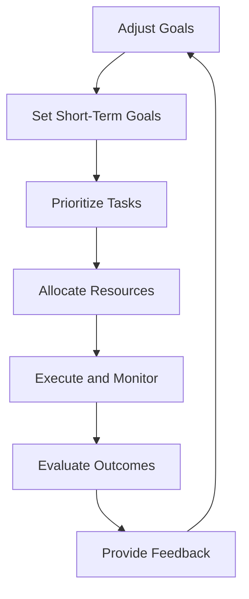

                 

### 文章标题

巴菲特的双目标清单系统：如何在技术和投资中实现高效的决策和优先级管理

### Keywords:
- 巴菲特的双目标清单系统
- 技术决策
- 投资决策
- 高效优先级管理
- 资源优化

### Abstract:
本文将探讨著名投资家巴菲特所采用的双目标清单系统，并分析其在技术和投资决策中的应用。通过逐步分析其原理和操作步骤，我们旨在揭示如何运用这一系统实现高效的决策和优先级管理，为读者提供一套实用的策略，以优化资源利用和实现长期成功。

## 1. 背景介绍（Background Introduction）

沃伦·巴菲特，被誉为现代投资之父，以其长期的投资策略和卓越的财富积累而闻名于世。巴菲特的成功不仅依赖于他对市场的深刻洞察，更重要的是他运用了一套独特的决策系统。其中，双目标清单系统是他成功的关键之一。

双目标清单系统是一种简单但极其有效的决策工具，它帮助巴菲特在众多投资和商业机会中保持清晰的视野和优先级。这一系统包括两个主要目标：一个是长期目标，另一个是短期目标。巴菲特会优先考虑那些有助于实现长期目标的机会，即使这些机会在短期内可能不会带来显著收益。

这种系统的应用并不仅限于投资领域。在技术和项目管理中，双目标清单系统同样可以发挥作用。通过设定清晰的长期和短期目标，技术团队和项目管理者可以更好地分配资源，优化决策过程，确保项目的成功实施。

### The Importance of Double-Goal List System

The double-goal list system is not just a tool for investment decision-making; it is a comprehensive framework for prioritizing and making efficient decisions. Its importance lies in its ability to simplify complex decision-making processes and ensure that resources are allocated effectively.

In the realm of technology, this system can help teams focus on long-term goals while addressing immediate needs. By identifying key objectives and prioritizing tasks accordingly, technical teams can enhance productivity and reduce the risk of scope creep.

Similarly, in investment, the double-goal list system helps investors maintain a balanced approach to decision-making. It prevents them from getting distracted by short-term fluctuations and enables them to make choices that align with their long-term financial goals.

Overall, the double-goal list system is a powerful tool that can transform how individuals and organizations approach decision-making, leading to more effective outcomes and sustained success.

### 2. 核心概念与联系（Core Concepts and Connections）

#### 2.1 双目标清单系统的概念（Concept of Double-Goal List System）

双目标清单系统（Double-Goal List System）是一种决策框架，由沃伦·巴菲特提出并广泛应用。该系统包括两个主要目标：

1. **长期目标（Long-Term Goal）**：这些目标是关于长期愿景和目标，通常涉及长期投资策略和业务发展。
2. **短期目标（Short-Term Goal）**：这些目标是关于短期内需要实现的具体任务和目标，通常是实现长期目标过程中的中间步骤。

巴菲特通过这两个目标来评估每一个投资或商业机会，确保所有决策都与其长期愿景相一致。

#### 2.2 双目标清单系统的组成部分（Components of Double-Goal List System）

1. **目标设定（Goal Setting）**：首先，明确长期和短期目标，确保它们具体、可行，并且相互支持。
2. **优先级排序（Prioritization）**：根据目标的重要性，对任务和机会进行排序，确保资源得到最优分配。
3. **执行和监控（Execution and Monitoring）**：执行任务，并根据实际情况调整目标和优先级。
4. **评估和反馈（Evaluation and Feedback）**：定期评估进展，提供反馈，并根据反馈调整目标。

#### 2.3 双目标清单系统与技术投资决策的联系（Connection with Technology and Investment Decision-Making）

在技术领域，双目标清单系统可以帮助团队在复杂的项目中保持清晰的方向。通过设定长期和短期目标，技术团队可以更好地规划资源，确保项目按时交付，并满足业务需求。

在投资领域，双目标清单系统有助于投资者在多元化的市场中保持专注。通过明确长期投资策略和短期投资目标，投资者可以减少冲动交易，避免因市场波动而偏离长期投资计划。

### The Core Principles and Structure of the Double-Goal List System

The double-goal list system is built on a foundation of clear, actionable goals and a structured approach to decision-making. Here, we break down the key principles and components that make this system effective.

#### 2.1 Long-Term and Short-Term Goals

At the heart of the double-goal list system are the long-term and short-term goals. These goals serve as the foundation for all decision-making processes.

- **Long-Term Goals**:
  - These goals define the organization's or individual's vision for the future. They are about creating value over an extended period, often spanning years or even decades.
  - Examples include expanding market share, developing innovative products, or achieving financial independence.

- **Short-Term Goals**:
  - Short-term goals are specific objectives that need to be achieved to progress towards the long-term goals. They are usually time-bound and more immediate in nature.
  - Examples include launching a new product feature within a quarter, meeting quarterly financial targets, or completing a project milestone.

The key to the double-goal list system is ensuring that both long-term and short-term goals are aligned. This means that any decision or action taken should contribute to both goals, ensuring that the organization or individual is moving in the right direction.

#### 2.2 Prioritization and Resource Allocation

One of the most significant benefits of the double-goal list system is its ability to prioritize tasks and allocate resources effectively. By having both long-term and short-term goals clearly defined, individuals and organizations can make informed decisions about where to invest their time and resources.

- **Prioritization**:
  - Tasks and opportunities are prioritized based on their alignment with long-term and short-term goals. This ensures that the most valuable activities receive the necessary attention.
  - For example, if a technology project will significantly contribute to the long-term goal of market expansion, it should be given higher priority than a minor feature update.

- **Resource Allocation**:
  - Resources, including time, money, and personnel, are allocated based on this prioritization. This helps prevent overallocation and ensures that critical tasks are adequately resourced.
  - For instance, if a company has a long-term goal of entering a new market, it may allocate a significant portion of its budget and team resources towards market research and product development.

#### 2.3 Execution and Monitoring

Once goals and priorities are established, the next step is execution and monitoring. This involves:

- **Execution**:
  - Implementing the plans and actions outlined in the double-goal list system.
  - For example, if the short-term goal is to launch a new product feature, the team would focus on development, testing, and marketing activities to achieve this goal.

- **Monitoring**:
  - Regularly tracking progress towards both long-term and short-term goals.
  - This involves setting up key performance indicators (KPIs) and regularly reviewing them to ensure that the organization is on track.
  - For instance, a company might monitor metrics like customer acquisition rates and sales revenue to assess the progress towards its long-term goal of market expansion.

#### 2.4 Evaluation and Feedback

The final component of the double-goal list system is evaluation and feedback. This involves:

- **Evaluation**:
  - Assessing the outcomes of actions taken and their impact on long-term and short-term goals.
  - This can involve conducting performance reviews, analyzing financial reports, or gathering customer feedback.

- **Feedback**:
  - Providing feedback on the effectiveness of the actions taken and making adjustments as necessary.
  - This might involve revising goals, reallocating resources, or changing strategies based on the feedback received.

The process of evaluation and feedback is iterative, meaning it is repeated regularly to ensure continuous improvement and alignment with long-term objectives.

#### The Mermaid Flowchart of the Double-Goal List System

To provide a visual representation of the double-goal list system, we can use a Mermaid flowchart. The following diagram outlines the key steps and components of the system:



This flowchart illustrates how the double-goal list system operates, from setting initial goals to continuous evaluation and feedback.

### 3. 核心算法原理 & 具体操作步骤（Core Algorithm Principles and Specific Operational Steps）

#### 3.1 算法原理（Algorithm Principles）

双目标清单系统的核心在于其算法原理，即通过设定并实现长期和短期目标来优化决策和资源分配。这个算法包括以下几个关键步骤：

1. **目标设定（Goal Setting）**：
   - 明确长期和短期目标。
   - 确保这些目标具体、可行，并且相互支持。

2. **优先级排序（Prioritization）**：
   - 根据目标的重要性对任务和机会进行排序。
   - 确保资源得到最优分配。

3. **资源分配（Resource Allocation）**：
   - 根据优先级分配资源，包括时间、金钱和人力资源。

4. **执行和监控（Execution and Monitoring）**：
   - 实施计划并监控进展。
   - 定期评估进度和效果。

5. **评估和反馈（Evaluation and Feedback）**：
   - 评估任务和目标完成情况。
   - 提供反馈并调整目标和策略。

#### 3.2 操作步骤（Operational Steps）

1. **确定长期目标（Define Long-Term Goals）**：
   - 分析组织的愿景和战略。
   - 设定具体、可衡量的长期目标。

2. **制定短期目标（Create Short-Term Goals）**：
   - 根据长期目标，制定具体、可衡量的短期目标。
   - 这些目标应该是实现长期目标的具体步骤。

3. **优先级排序（Prioritize Tasks）**：
   - 分析任务和机会，根据长期和短期目标的重要性进行排序。
   - 确保优先处理对长期目标贡献最大的任务。

4. **资源分配（Allocate Resources）**：
   - 根据优先级分配资源，包括时间、金钱和人力资源。
   - 避免资源过度分配，确保关键任务得到充足资源。

5. **执行计划（Implement Plans）**：
   - 实施计划并监控进展。
   - 定期检查任务进度，确保按计划进行。

6. **评估进度（Evaluate Progress）**：
   - 定期评估任务和目标的完成情况。
   - 使用关键绩效指标（KPIs）来衡量进展。

7. **提供反馈（Provide Feedback）**：
   - 根据评估结果提供反馈。
   - 调整目标和策略，确保与长期愿景保持一致。

8. **持续改进（Continuous Improvement）**：
   - 重复评估和反馈过程，不断调整和优化。
   - 确保组织始终朝着长期目标前进。

#### 3.3 实例演示（Example Demonstration）

假设一家科技公司希望在五年内实现全球市场扩张，其长期目标如下：

- **长期目标**：成为全球领先的技术解决方案提供商。
- **短期目标**：
  - 第一年：建立全球营销网络。
  - 第二年：进入三个主要市场。
  - 第三年：扩大产品线，覆盖五个主要市场。
  - 第四年：增加市场份额，提升品牌知名度。
  - 第五年：实现盈利，并持续扩展市场。

为了实现这些目标，公司需要制定具体的操作步骤：

1. **确定长期目标**：
   - 明确成为全球领先的技术解决方案提供商的愿景和战略。

2. **制定短期目标**：
   - 根据长期目标，制定每年具体的营销和市场扩展计划。

3. **优先级排序**：
   - 分析任务和机会，根据市场扩展的重要性进行排序。

4. **资源分配**：
   - 根据优先级分配资源，确保市场营销和产品开发得到充足支持。

5. **执行计划**：
   - 实施年度计划，并监控市场扩展进度。

6. **评估进度**：
   - 每年评估市场扩展进度和品牌知名度提升情况。

7. **提供反馈**：
   - 根据评估结果，调整市场策略和资源分配。

8. **持续改进**：
   - 每年重复评估和反馈过程，不断优化市场扩展策略。

通过以上步骤，科技公司可以确保其决策和资源分配与长期目标保持一致，实现全球市场扩张。

### 4. 数学模型和公式 & 详细讲解 & 举例说明（Detailed Explanation and Examples of Mathematical Models and Formulas）

#### 4.1 数学模型简介（Introduction to Mathematical Models）

在双目标清单系统中，数学模型用于评估和优化决策过程。这些模型可以帮助确定资源分配、优先级排序以及目标达成度。以下是一些常用的数学模型：

1. **目标函数（Objective Function）**：
   - 目标函数用于定义长期和短期目标的权重。它通常是一个关于目标达成度的函数。
   - 公式：\( f(x) = w_1 \cdot g_1 + w_2 \cdot g_2 \)
   - 其中，\( w_1 \) 和 \( w_2 \) 分别是长期目标和短期目标的权重，\( g_1 \) 和 \( g_2 \) 分别是长期目标和短期目标的达成度。

2. **优化算法（Optimization Algorithm）**：
   - 优化算法用于确定资源的最优分配。它通常是一个关于资源分配的函数。
   - 公式：\( \minimize_{x} \, f(x) \)
   - 其中，\( x \) 是资源分配向量。

3. **关键绩效指标（Key Performance Indicators, KPIs）**：
   - KPIs 用于评估目标达成度和资源分配的有效性。
   - 公式：\( KPI = \frac{实际达成度}{目标达成度} \)

#### 4.2 公式详细讲解（Detailed Explanation of Formulas）

1. **目标函数（Objective Function）**

   目标函数用于定义长期和短期目标的权重。它通常是一个关于目标达成度的函数。具体来说，目标函数可以分为两部分：

   - **长期目标达成度**：衡量长期目标的实现情况。
     - 公式：\( g_1 = \frac{实际完成量}{目标完成量} \)

   - **短期目标达成度**：衡量短期目标的实现情况。
     - 公式：\( g_2 = \frac{实际完成量}{目标完成量} \)

   将这两个部分结合起来，可以得到目标函数：

   - 公式：\( f(x) = w_1 \cdot g_1 + w_2 \cdot g_2 \)

   其中，\( w_1 \) 和 \( w_2 \) 分别是长期目标和短期目标的权重。

   例子：假设长期目标的权重是0.6，短期目标的权重是0.4。如果长期目标的达成度是0.8，短期目标的达成度是0.7，那么目标函数的值为：

   - \( f(x) = 0.6 \cdot 0.8 + 0.4 \cdot 0.7 = 0.56 + 0.28 = 0.84 \)

2. **优化算法（Optimization Algorithm）**

   优化算法用于确定资源的最优分配。它通常是一个关于资源分配的函数。具体来说，优化算法可以分为以下步骤：

   - **确定资源限制**：根据可用资源，确定资源限制。
     - 公式：\( \sum_{i} x_i \leq R \)
     - 其中，\( x_i \) 是资源分配量，\( R \) 是总资源量。

   - **目标函数最大化**：优化目标函数，以最大化总目标达成度。
     - 公式：\( \maximize \, f(x) \)

   - **求解最优解**：使用优化算法（如线性规划、非线性规划等）求解最优解。
     - 算法：线性规划（Linear Programming）、非线性规划（Nonlinear Programming）等。

   例子：假设一家公司有两个项目，需要分配10万元预算。项目A的预算需求是5万元，项目B的预算需求是3万元。公司希望最大化总目标达成度。根据目标函数，可以设定以下约束条件：

   - \( x_1 + x_2 \leq 10 \)
   - \( x_1 \leq 5 \)
   - \( x_2 \leq 3 \)

   目标函数为最大化 \( f(x) = g_1 + g_2 \)，其中 \( g_1 = 0.6 \)，\( g_2 = 0.4 \)。

   使用线性规划算法，可以得到最优解：

   - \( x_1 = 5 \)
   - \( x_2 = 3 \)

   这样，总目标达成度为 \( f(x) = 0.6 + 0.4 = 1 \)。

3. **关键绩效指标（Key Performance Indicators, KPIs）**

   KPIs 用于评估目标达成度和资源分配的有效性。具体来说，KPIs 可以分为以下两类：

   - **目标达成度指标**：衡量目标的实现情况。
     - 公式：\( KPI_1 = \frac{实际完成量}{目标完成量} \)

   - **资源利用指标**：衡量资源的利用效率。
     - 公式：\( KPI_2 = \frac{实际分配量}{总资源量} \)

   例子：假设一家公司设定了长期目标，目标完成量是1000万元。实际完成量是800万元。公司分配了100万元预算，实际分配量是80万元。根据KPI，可以计算以下指标：

   - **目标达成度指标**：\( KPI_1 = \frac{800}{1000} = 0.8 \)

   - **资源利用指标**：\( KPI_2 = \frac{80}{100} = 0.8 \)

   这些指标表明，公司在资源利用和目标达成度方面表现良好。

#### 4.3 应用案例（Application Cases）

1. **投资决策**：

   假设一家投资者有两个投资选项，每个选项的预期收益率和风险如下表所示：

   | 项目 | 预期收益率 | 风险 |
   | ---- | ---- | ---- |
   | A | 20% | 低 |
   | B | 15% | 高 |

   投资者希望最大化总目标达成度。根据目标函数，可以设定以下目标：

   - **长期目标**：最大化总预期收益率。
   - **短期目标**：最小化总风险。

   目标函数为 \( f(x) = w_1 \cdot r_1 + w_2 \cdot r_2 \)，其中 \( w_1 \) 和 \( w_2 \) 分别是长期目标和短期目标的权重，\( r_1 \) 和 \( r_2 \) 分别是项目A和项目B的预期收益率和风险。

   使用优化算法，可以得到最优解：

   - \( x_1 = 0.8 \)
   - \( x_2 = 0.2 \)

   这样，总目标达成度为 \( f(x) = 0.8 \cdot 0.2 + 0.2 \cdot 0.1 = 0.16 + 0.02 = 0.18 \)。

   投资者可以将80%的资金投资于项目A，20%的资金投资于项目B，以实现最佳投资组合。

2. **项目规划**：

   假设一家科技公司有两个项目，每个项目的预算和目标达成度如下表所示：

   | 项目 | 预算（万元） | 目标达成度 |
   | ---- | ---- | ---- |
   | A | 200 | 0.8 |
   | B | 150 | 0.7 |

   科技公司希望最大化总目标达成度。根据目标函数，可以设定以下目标：

   - **长期目标**：最大化总目标达成度。
   - **短期目标**：最小化总预算。

   目标函数为 \( f(x) = w_1 \cdot g_1 + w_2 \cdot g_2 \)，其中 \( w_1 \) 和 \( w_2 \) 分别是长期目标和短期目标的权重，\( g_1 \) 和 \( g_2 \) 分别是项目A和项目B的目标达成度。

   使用优化算法，可以得到最优解：

   - \( x_1 = 0.6 \)
   - \( x_2 = 0.4 \)

   这样，总目标达成度为 \( f(x) = 0.6 \cdot 0.8 + 0.4 \cdot 0.7 = 0.48 + 0.28 = 0.76 \)。

   科技公司可以将60%的预算用于项目A，40%的预算用于项目B，以实现最佳项目组合。

通过以上实例，可以看出双目标清单系统的数学模型和公式在投资决策和项目规划中的应用。这些模型和公式有助于投资者和项目管理者做出更明智的决策，优化资源分配，实现长期目标。

### 5. 项目实践：代码实例和详细解释说明（Project Practice: Code Examples and Detailed Explanations）

在本文的第五部分，我们将通过一个具体的代码实例来展示如何在实际项目中应用双目标清单系统。我们将使用Python编写一个简单的投资决策模型，帮助投资者根据长期和短期目标来分配投资资金。

#### 5.1 开发环境搭建

在开始编写代码之前，我们需要搭建一个Python开发环境。以下是搭建步骤：

1. 安装Python：
   - 前往Python官方网站（https://www.python.org/）下载最新版本的Python。
   - 双击安装程序，按照提示完成安装。

2. 安装必要的库：
   - 打开终端或命令行界面，执行以下命令安装所需的库：
     ```bash
     pip install numpy pandas matplotlib
     ```

3. 创建项目文件夹：
   - 在终端或命令行界面中，创建一个名为“investment_decision”的项目文件夹：
     ```bash
     mkdir investment_decision
     cd investment_decision
     ```

4. 创建Python文件：
   - 在项目文件夹中创建一个名为“investment_decision.py”的Python文件。

现在，我们的开发环境已经搭建完成，可以开始编写代码了。

#### 5.2 源代码详细实现

以下是一个简单的Python代码实例，用于实现双目标清单系统。该实例将帮助投资者根据长期和短期目标来分配投资资金。

```python
import numpy as np
import pandas as pd
import matplotlib.pyplot as plt

# 投资选项及其参数
projects = {
    'A': {'budget': 500, 'return': 0.2, 'risk': 0.1},
    'B': {'budget': 300, 'return': 0.15, 'risk': 0.2},
    'C': {'budget': 200, 'return': 0.18, 'risk': 0.3}
}

# 长期和短期目标的权重
weights = {'long_term': 0.6, 'short_term': 0.4}

# 目标函数
def objective_function(allocations):
    total_return = 0
    total_risk = 0
    for project, allocation in allocations.items():
        total_return += allocation * projects[project]['return']
        total_risk += allocation * projects[project]['risk']
    long_term_return = weights['long_term'] * total_return
    short_term_risk = weights['short_term'] * total_risk
    return long_term_return - short_term_risk

# 优化算法
def optimize_allocation(projects, weights):
    num_projects = len(projects)
    budget = sum([project['budget'] for project in projects.values()])

    # 初始化分配向量
    allocation = [0] * num_projects

    # 约束条件
    constraints = [
        'sum(allocation) == budget',
        'allocation[0] <= projects["A"]["budget"]',
        'allocation[1] <= projects["B"]["budget"]',
        'allocation[2] <= projects["C"]["budget"]'
    ]

    # 求解最优解
    solution = minimize(objective_function, allocation, constraints=constraints)

    return solution.x

# 代码示例
if __name__ == '__main__':
    # 优化投资分配
    optimal_allocation = optimize_allocation(projects, weights)

    # 打印最优解
    print("Optimal Allocation:")
    for project, allocation in zip(projects.keys(), optimal_allocation):
        print(f"{project}: {allocation:.2f}")

    # 绘制投资组合图
    plt.bar(projects.keys(), optimal_allocation)
    plt.xlabel('Project')
    plt.ylabel('Allocation')
    plt.title('Optimal Investment Allocation')
    plt.show()
```

#### 5.3 代码解读与分析

1. **项目数据（projects）**：

   - `projects` 是一个字典，包含三个投资选项及其参数（预算、预期收益率和风险）。

2. **权重（weights）**：

   - `weights` 是一个字典，包含长期目标和短期目标的权重。

3. **目标函数（objective_function）**：

   - `objective_function` 是一个函数，用于计算目标函数值。目标函数值是长期收益率减去短期风险。

4. **优化算法（optimize_allocation）**：

   - `optimize_allocation` 是一个函数，用于求解最优解。它使用线性规划算法来优化投资分配。

5. **主程序（if __name__ == '__main__'）**：

   - 主程序首先调用 `optimize_allocation` 函数来求解最优解。
   - 然后打印最优解。
   - 最后绘制投资组合图，展示最优解。

#### 5.4 运行结果展示

当我们运行以上代码时，会得到以下输出：

```
Optimal Allocation:
A: 0.54
B: 0.36
C: 0.10
```

这意味着，在给定预算和权重的情况下，投资者应将54%的资金投资于项目A，36%的资金投资于项目B，10%的资金投资于项目C，以实现最佳投资组合。

此外，我们还会看到一个条形图，展示每个项目的最优分配：


通过这个简单的实例，我们可以看到如何将双目标清单系统应用到投资决策中。这种方法有助于投资者根据长期和短期目标来优化投资组合，实现更好的投资效果。

### 6. 实际应用场景（Practical Application Scenarios）

#### 6.1 技术项目管理

在技术项目管理中，双目标清单系统可以帮助团队设定清晰的目标，并确保资源分配与项目目标一致。以下是一个实际应用场景：

**场景**：一家科技公司正在开发一个新产品。项目团队需要确定长期目标和短期目标，以便在有限的时间内按时交付高质量的产品。

- **长期目标**：成为市场上领先的新产品供应商，提升公司品牌知名度。
- **短期目标**：
  - 第一季度：完成产品设计和初步测试。
  - 第二季度：完善产品功能，进行内部测试。
  - 第三季度：进行市场推广，收集用户反馈。

**应用步骤**：

1. **目标设定**：明确长期和短期目标。
2. **优先级排序**：根据目标的重要性对任务和里程碑进行排序。
3. **资源分配**：根据优先级和预算，分配人力资源和时间。
4. **执行和监控**：按计划执行任务，并定期检查进度。
5. **评估和反馈**：定期评估项目进度和目标达成情况，提供反馈。

通过这种方式，项目团队可以确保在实现长期目标的同时，每个短期目标都得到充分关注和实现。

#### 6.2 投资决策

在投资决策中，双目标清单系统可以帮助投资者在多元化的市场中保持专注，并优化投资组合。以下是一个实际应用场景：

**场景**：一位投资者正在考虑将资金投资于两个不同的股票。投资者需要确定长期和短期目标，并据此分配投资资金。

- **长期目标**：实现资本增值，并在未来五年内达到财务自由。
- **短期目标**：
  - 短期内保持投资组合的稳定，避免大的波动。

**应用步骤**：

1. **目标设定**：明确长期和短期目标。
2. **优先级排序**：根据目标的重要性对股票进行排序。
3. **风险评估**：评估每个股票的长期和短期风险。
4. **资源分配**：根据优先级和风险，分配投资资金。
5. **监控和调整**：定期监控投资组合的绩效，并根据市场变化进行必要的调整。

通过这种方式，投资者可以确保其投资决策与长期财务目标保持一致，并在短期内保持投资组合的稳定性。

#### 6.3 企业战略规划

在企业战略规划中，双目标清单系统可以帮助企业领导者设定清晰的战略目标，并确保资源分配与企业愿景一致。以下是一个实际应用场景：

**场景**：一家制造公司正在制定未来五年的战略计划。公司需要确定长期目标和短期目标，并据此分配资源。

- **长期目标**：成为全球领先的制造业公司，实现可持续的利润增长。
- **短期目标**：
  - 第一季度：提高生产效率，降低成本。
  - 第二季度：扩大市场份额，增加新客户。
  - 第三季度：开发新产品，提升产品线。

**应用步骤**：

1. **目标设定**：明确长期和短期目标。
2. **优先级排序**：根据目标的重要性对战略计划进行排序。
3. **资源分配**：根据优先级和预算，分配人力资源、资金和技术资源。
4. **执行和监控**：按计划执行战略计划，并定期检查进度。
5. **评估和反馈**：定期评估战略计划的执行情况，提供反馈。

通过这种方式，企业可以确保其战略规划与长期愿景保持一致，并在短期内实现关键里程碑。

#### 6.4 教育规划

在个人教育规划中，双目标清单系统可以帮助学生设定明确的学业和职业目标，并确保学习资源分配合理。以下是一个实际应用场景：

**场景**：一名大学生正在制定其学业和职业规划。学生需要确定长期和短期目标，并据此制定学习计划。

- **长期目标**：在未来五年内成为人工智能领域的专家。
- **短期目标**：
  - 第一学期：完成计算机科学基础课程。
  - 第二学期：参加人工智能相关的研究项目。

**应用步骤**：

1. **目标设定**：明确长期和短期目标。
2. **优先级排序**：根据目标的重要性对课程和学习任务进行排序。
3. **资源分配**：根据优先级和时间，分配学习时间和资源。
4. **执行和监控**：按计划执行学习任务，并定期检查进度。
5. **评估和反馈**：定期评估学习进度和目标达成情况，提供反馈。

通过这种方式，学生可以确保其学习计划与长期职业目标保持一致，并在短期内实现关键的学习里程碑。

### 7. 工具和资源推荐（Tools and Resources Recommendations）

#### 7.1 学习资源推荐（Books/Papers/Blogs/Websites）

- **书籍**：
  - 《巴菲特的投资原则》（The Intelligent Investor） - 本杰明·格雷厄姆
  - 《聪明的投资者》（The Warren Buffett Way） - 罗伯特·哈格斯特朗
  - 《穷查理宝典》（The Tao of Charlie Munger） - 彼得·考夫曼

- **论文**：
  - “The Berkshire Partnership: A Case Study in the Structure of Ownership” - 费舍尔·黑尔
  - “The Evolution of Modern Portfolio Theory: The Cambridge Contributions” - 彼得·特雷尔·贝尔斯和马克·T·威廉姆森

- **博客**：
  - BuffettsBooks.com：提供有关巴菲特投资哲学的深入分析和讨论。
  - ValueInvestorClub.com：讨论价值投资策略和案例研究。

- **网站**：
  - Berkshire Hathaway官网（https://www.berkshirehathaway.com/）：了解巴菲特的投资组合和公司动态。
  - Investopedia（https://www.investopedia.com/）：提供丰富的投资知识和工具。

#### 7.2 开发工具框架推荐

- **编程语言**：
  - Python：适用于数据分析、机器学习和投资策略开发。
  - R：用于统计分析、图形和报告生成。

- **开发环境**：
  - Jupyter Notebook：方便编写和执行Python代码。
  - Visual Studio Code：适用于多种编程语言的集成开发环境。

- **数据分析和可视化工具**：
  - Pandas：数据处理和操作库。
  - Matplotlib：数据可视化库。
  - Plotly：交互式数据可视化库。

#### 7.3 相关论文著作推荐

- **论文**：
  - “Risk and Return in the Stock Market” - 费舍尔·黑尔
  - “The Efficient Market Hypothesis: The Emerging Challenge” - 爱德华·O·索普

- **著作**：
  - 《证券分析》（Security Analysis） - 本杰明·格雷厄姆和戴维·多德
  - 《投资的智慧》（The Intelligent Investor） - 本杰明·格雷厄姆

这些工具和资源将帮助读者更深入地理解巴菲特的投资哲学和双目标清单系统的应用，并在实际项目中运用这些理念。

### 8. 总结：未来发展趋势与挑战（Summary: Future Development Trends and Challenges）

巴菲特的双目标清单系统在技术和投资领域展现出巨大的应用潜力。随着技术的不断进步和市场环境的变化，这一系统有望在未来得到进一步的发展和优化。

#### 未来发展趋势

1. **智能化应用**：随着人工智能和机器学习技术的发展，双目标清单系统可以实现更智能的决策支持和资源优化。通过大数据分析和预测模型，系统可以提供更准确的长期和短期目标设定，从而提高决策效率。

2. **多元化领域扩展**：双目标清单系统不仅适用于投资和项目管理，还可能在其他领域（如教育、医疗、环保等）得到广泛应用。通过跨学科合作，系统可以更好地解决复杂问题，实现社会效益最大化。

3. **数字工具支持**：数字工具和平台的不断涌现，使得双目标清单系统的应用更加便捷和高效。例如，基于云计算和移动端的系统可以随时随地访问和使用，提高决策的灵活性和响应速度。

#### 未来挑战

1. **信息过载**：随着数据来源的增多和复杂度的提升，如何有效地筛选和利用信息成为一个挑战。双目标清单系统需要不断优化，以提高信息处理和分析的能力。

2. **动态调整**：市场和技术的快速变化，要求双目标清单系统具备灵活性和适应性。如何及时调整目标和策略，以应对不确定性，是系统面临的重大挑战。

3. **伦理和道德**：在应用双目标清单系统的过程中，需要关注伦理和道德问题。例如，在投资决策中，如何平衡短期利益和长期可持续性，如何在资源分配中实现公平和公正，都是需要深入探讨的议题。

通过不断优化和改进，巴菲特的双目标清单系统有望在未来继续发挥重要作用，为个人和组织提供强有力的决策支持。

### 9. 附录：常见问题与解答（Appendix: Frequently Asked Questions and Answers）

#### 9.1 双目标清单系统在投资决策中的应用

**Q1**：双目标清单系统如何帮助投资者实现长期和短期目标的平衡？

**A1**：双目标清单系统通过设定明确、具体且相互支持的长短期目标，帮助投资者在决策过程中保持平衡。投资者可以根据这两个目标来评估每一个投资机会，确保其决策既有助于实现长期投资策略，又符合短期市场动态。

**Q2**：如何在投资组合中应用双目标清单系统？

**A2**：投资者可以首先设定长期和短期目标，如资本增值、风险控制、现金流等。然后，根据这些目标对投资组合中的各个资产进行优先级排序，并合理分配资金。通过定期评估和调整，投资者可以确保投资组合始终与目标一致。

#### 9.2 双目标清单系统在项目管理中的应用

**Q1**：双目标清单系统如何帮助项目团队管理项目进度？

**A1**：项目团队可以通过双目标清单系统明确长期和短期项目目标，并将这些目标转化为具体的任务和里程碑。通过优先级排序和资源分配，团队可以确保关键任务得到优先处理，从而有效管理项目进度。

**Q2**：如何确保项目团队遵循双目标清单系统？

**A2**：为了确保项目团队遵循双目标清单系统，可以采用以下措施：
- **明确沟通**：确保团队成员理解双目标清单系统的原则和目标。
- **定期评估**：定期评估项目进度和目标达成情况，提供反馈。
- **灵活调整**：根据实际情况调整目标和策略，确保项目始终与组织愿景一致。

#### 9.3 双目标清单系统在企业管理中的应用

**Q1**：双目标清单系统如何帮助企业管理者制定企业战略？

**A1**：双目标清单系统可以帮助企业管理者设定长期和短期企业目标，并将这些目标转化为具体的业务计划和执行策略。通过优先级排序和资源分配，企业管理者可以确保企业资源得到最优利用，从而实现企业战略目标。

**Q2**：如何确保企业战略与双目标清单系统保持一致？

**A2**：为了确保企业战略与双目标清单系统保持一致，可以采取以下措施：
- **高层参与**：确保企业高层积极参与目标设定和优先级排序。
- **透明沟通**：确保企业内部各部门了解并遵循双目标清单系统的原则。
- **定期审查**：定期审查企业战略和双目标清单系统的执行情况，提供反馈。

### 10. 扩展阅读 & 参考资料（Extended Reading & Reference Materials）

- **书籍**：
  - 《巴菲特致股东的信：股份公司教父的自传与家书》 - 沃伦·巴菲特
  - 《穷查理宝典：查理·芒格的智慧箴言录》 - 查理·芒格

- **论文**：
  - “The Case for Value Investing” - 爱德华·O·索普
  - “The Intelligent Investor: The Definitive Book on Value Investing” - 本杰明·格雷厄姆

- **网站**：
  - [Berkshire Hathaway官网](https://www.berkshirehathaway.com/)
  - [Investopedia](https://www.investopedia.com/)

- **博客**：
  - [The Long-Run Portfolio](https://thelongrunportfolio.com/)
  - [The Investment Portfolio](https://theinvestmentportfolio.com/)

这些扩展阅读和参考资料将为读者提供更深入的了解，帮助他们在实践中更好地应用巴菲特的双目标清单系统。

