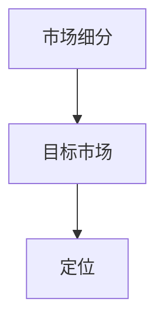
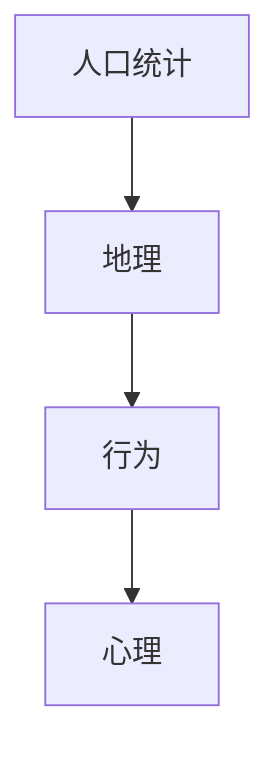
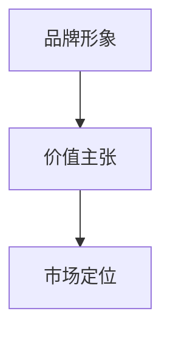
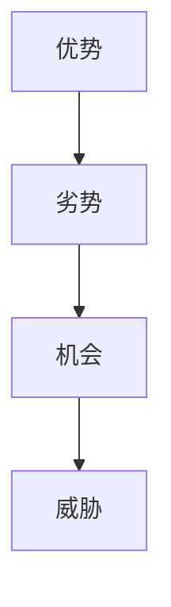
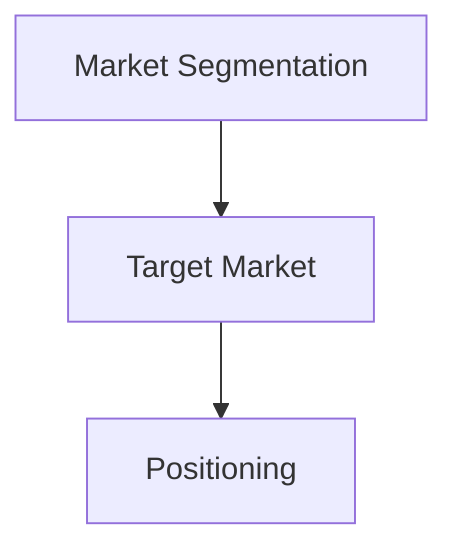
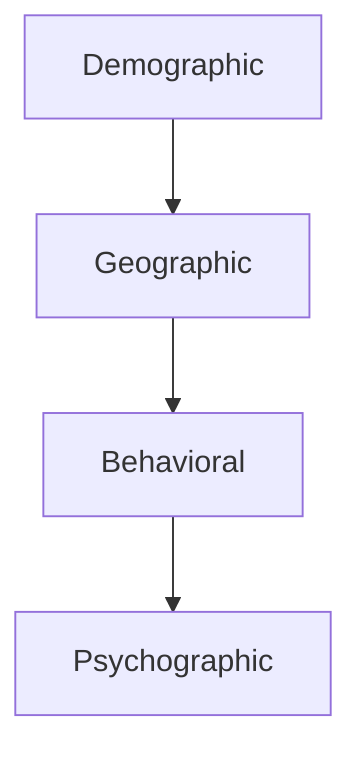
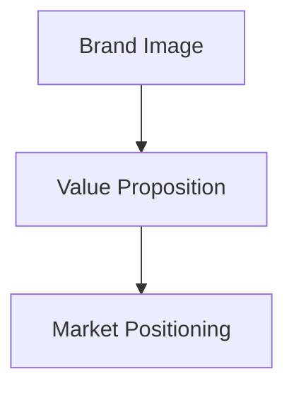
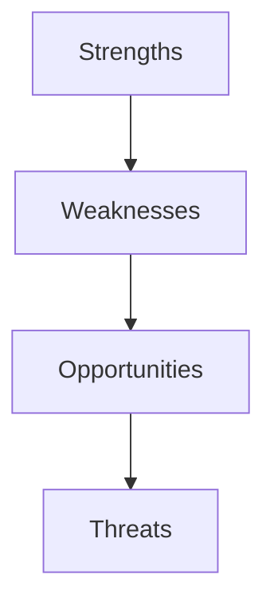

                 

### 背景介绍（Background Introduction）

#### 市场策略的定义与重要性

市场策略（Marketing Strategy）是一种企业为了实现其商业目标而制定的长期性、系统性和目标性的行动计划。它涵盖了市场调研、目标市场定位、产品定价、渠道选择、促销活动等一系列市场营销活动的策划和执行。市场策略的核心在于如何将企业有限的资源投入到最有效的市场中，从而实现盈利和市场份额的增长。

市场策略的重要性体现在以下几个方面：

1. **明确目标**：市场策略帮助创业企业明确自己的目标市场，从而专注于最有潜力的客户群体，避免资源浪费。
2. **指导资源分配**：通过市场策略，企业可以合理分配资源，确保营销投入的高效产出。
3. **增强竞争力**：有效的市场策略可以帮助企业在竞争激烈的市场中脱颖而出，建立品牌认知和忠诚度。
4. **适应市场变化**：市场策略允许企业灵活应对市场环境的变化，保持竞争力。

#### 市场策略的发展历史与演变

市场策略的概念和实践可以追溯到20世纪初。当时，企业主要关注生产效率和成本控制，市场营销的重要性尚未得到充分认识。随着经济全球化和信息技术的快速发展，市场策略逐渐成为企业成功的关键因素。

1. **销售驱动型策略**：20世纪初期，企业主要采用销售驱动型策略，以销售为中心，通过大规模的广告和促销活动吸引客户。
2. **产品驱动型策略**：20世纪中期，随着产品的多样化和竞争的加剧，企业开始注重产品创新和质量，产品驱动型策略应运而生。
3. **市场驱动型策略**：20世纪末，市场营销理论的发展使得企业开始更加关注市场需求和客户满意度，市场驱动型策略逐渐成为主流。
4. **关系营销策略**：21世纪初，随着互联网和社交媒体的兴起，关系营销策略逐渐得到重视，企业开始注重与客户的长期关系维护。

#### 本文的目的与结构

本文旨在深入探讨市场策略在创业成功中的关键作用，通过历史案例分析和现代实践研究，阐述如何制定和执行有效的市场策略。文章结构如下：

- **背景介绍**：介绍市场策略的定义、重要性以及其发展历史。
- **核心概念与联系**：详细解释市场策略的核心概念，包括目标市场、市场细分、市场定位等。
- **核心算法原理与具体操作步骤**：介绍市场策略制定和执行的基本算法原理，包括市场调研、竞争分析、SWOT分析等。
- **数学模型与公式**：讨论市场策略中常用的数学模型和公式，包括需求函数、成本函数、利润最大化模型等。
- **项目实践**：通过实际案例展示市场策略在创业项目中的具体应用。
- **实际应用场景**：分析市场策略在不同行业和领域中的应用。
- **工具和资源推荐**：推荐学习资源和开发工具。
- **总结**：总结市场策略在创业成功中的重要性，展望未来发展趋势。
- **附录**：常见问题与解答。

通过上述结构，本文将系统地探讨市场策略的各个方面，为创业者提供实用的指导和建议。

#### Definition and Importance of Market Strategy

Market strategy is a long-term, systematic, and goal-oriented action plan that a company develops to achieve its business objectives. It encompasses a range of marketing activities, including market research, target market positioning, product pricing, channel selection, and promotional activities. The core of market strategy lies in how to allocate limited resources to the most effective markets, thus achieving profitability and market share growth.

The importance of market strategy can be seen in several aspects:

1. **Clarifying Objectives**: Market strategy helps entrepreneurial companies define their target markets, allowing them to focus on the most promising customer segments and avoid wasting resources.
2. **Guiding Resource Allocation**: Through market strategy, companies can allocate resources efficiently, ensuring that marketing investments yield high returns.
3. **Enhancing Competitiveness**: An effective market strategy can help companies stand out in a competitive market by building brand awareness and customer loyalty.
4. **Adapting to Market Changes**: Market strategy allows companies to be flexible and responsive to changes in the market environment, maintaining competitiveness.

#### Historical Development and Evolution of Market Strategy

The concept and practice of market strategy can be traced back to the early 20th century. At that time, companies focused primarily on production efficiency and cost control, with marketing not receiving sufficient attention. With the rapid development of economic globalization and information technology, market strategy has gradually become a key factor in business success.

1. **Sales-driven Strategy**: In the early 20th century, companies primarily adopted sales-driven strategies, focusing on advertising and promotions to attract customers.
2. **Product-driven Strategy**: In the mid-20th century, with the diversification of products and increased competition, companies began to emphasize product innovation and quality, leading to the emergence of product-driven strategies.
3. **Market-driven Strategy**: By the end of the 20th century, the development of marketing theories made companies pay more attention to market demand and customer satisfaction, resulting in the rise of market-driven strategies.
4. **Relationship Marketing Strategy**: In the early 21st century, with the rise of the internet and social media, relationship marketing strategies have gained increasing importance, with companies focusing on long-term relationship maintenance with customers.

#### Purpose and Structure of This Article

This article aims to delve into the critical role of market strategy in entrepreneurial success. Through historical case analysis and modern practice research, it will explain how to develop and execute effective market strategies. The structure of the article is as follows:

- **Background Introduction**: Introduce the definition, importance, and historical development of market strategy.
- **Core Concepts and Connections**: Detailed explanation of core concepts in market strategy, including target market, market segmentation, market positioning, etc.
- **Core Algorithm Principles and Specific Operational Steps**: Introduce basic algorithm principles for developing and executing market strategies, including market research, competitive analysis, SWOT analysis, etc.
- **Mathematical Models and Formulas**: Discuss commonly used mathematical models and formulas in market strategy, including demand functions, cost functions, profit maximization models, etc.
- **Project Practice**: Showcase the application of market strategy in entrepreneurial projects through real-world cases.
- **Practical Application Scenarios**: Analyze the application of market strategy in different industries and fields.
- **Tools and Resources Recommendations**: Recommend learning resources and development tools.
- **Summary**: Summarize the importance of market strategy in entrepreneurial success and look forward to future development trends.
- **Appendix**: Frequently Asked Questions and Answers.

Through this structured approach, the article will systematically explore various aspects of market strategy, providing practical guidance and suggestions for entrepreneurs.

## 2. 核心概念与联系（Core Concepts and Connections）

在市场策略的框架下，有若干核心概念与联系需要我们详细探讨。这些概念不仅是市场策略的基础，也是企业制定和实施有效策略的关键。以下将介绍市场策略的核心概念，并使用Mermaid流程图（Mermaid Flowchart）展示其之间的相互关系。

### 2.1 目标市场（Target Market）

目标市场是指企业所关注的、最有可能购买其产品的客户群体。确定目标市场是市场策略的第一步，因为它决定了企业资源投入的方向。目标市场通常基于客户的需求、购买行为和消费习惯等因素进行划分。

#### 关键概念：
- **市场细分（Market Segmentation）**：将整个市场划分为不同的子市场，以便更好地满足不同客户群体的需求。
- **定位（Positioning）**：确定企业在目标市场中的独特价值主张，以区别于竞争对手。

#### Mermaid流程图：



### 2.2 市场细分（Market Segmentation）

市场细分是将一个广泛的市场分割成若干较小的、更具体的市场，以便企业能够更好地服务于特定群体。市场细分通常基于人口统计、地理、行为和心理等因素进行。

#### 关键概念：
- **人口统计细分（Demographic Segmentation）**：根据人口特征（如年龄、性别、收入、教育水平等）进行划分。
- **地理细分（Geographic Segmentation）**：根据地理位置（如国家、地区、城市等）进行划分。
- **行为细分（Behavioral Segmentation）**：根据消费者的购买行为和消费习惯进行划分。
- **心理细分（Psychographic Segmentation）**：根据消费者的生活方式、价值观、兴趣爱好等心理特征进行划分。

#### Mermaid流程图：



### 2.3 市场定位（Market Positioning）

市场定位是指企业如何将自己与竞争对手区分开来，并在消费者心中树立一个特定的形象。成功的市场定位可以帮助企业在竞争激烈的市场中脱颖而出。

#### 关键概念：
- **品牌形象（Brand Image）**：企业在消费者心目中的形象和认知。
- **价值主张（Value Proposition）**：企业提供的独特价值，以吸引和保留客户。

#### Mermaid流程图：



### 2.4 SWOT分析（SWOT Analysis）

SWOT分析是一种战略规划工具，用于评估企业的优势（Strengths）、劣势（Weaknesses）、机会（Opportunities）和威胁（Threats）。通过SWOT分析，企业可以更好地了解自身状况，并制定相应的市场策略。

#### 关键概念：
- **优势（Strengths）**：企业在资源、能力、品牌等方面的优势。
- **劣势（Weaknesses）**：企业在运营、管理、市场等方面的不足。
- **机会（Opportunities）**：市场环境中的有利条件和趋势。
- **威胁（Threats）**：外部环境中的风险和挑战。

#### Mermaid流程图：



通过上述核心概念及其相互关系的阐述和Mermaid流程图的展示，我们可以更清晰地理解市场策略的构建过程。这些概念不仅是理论上的指导，更是企业实际操作中的工具，帮助企业在激烈的市场竞争中找到自己的位置，实现可持续发展。

#### Key Concepts and Their Interconnections

Within the framework of market strategy, several core concepts and their interconnections need to be thoroughly discussed. These concepts are not only the foundation of market strategy but also crucial in formulating and implementing effective strategies. Here, we will introduce the core concepts and use Mermaid flowcharts to illustrate their relationships.

### 2.1 Target Market

The target market refers to the group of potential customers that a company focuses on, as they are most likely to purchase the company's products. Identifying the target market is the first step in developing a market strategy, as it determines the direction of resource allocation.

#### Key Concepts:
- **Market Segmentation**: The process of dividing a broad market into smaller, more specific segments to better serve different customer groups.
- **Positioning**: The process of determining how a company distinguishes itself from competitors and creates a specific image in the minds of consumers.

#### Mermaid Flowchart:


### 2.2 Market Segmentation

Market segmentation involves dividing a broad market into smaller, more specific markets to enable companies to better serve particular groups. Market segmentation is typically based on factors such as demographics, geography, behavior, and psychographics.

#### Key Concepts:
- **Demographic Segmentation**: Dividing a market based on demographic characteristics (such as age, gender, income, education level, etc.).
- **Geographic Segmentation**: Dividing a market based on geographic location (such as country, region, city, etc.).
- **Behavioral Segmentation**: Dividing a market based on consumers' purchasing behavior and consumption habits.
- **Psychographic Segmentation**: Dividing a market based on consumers' lifestyles, values, interests, etc.

#### Mermaid Flowchart:


### 2.3 Market Positioning

Market positioning is the process through which a company differentiates itself from competitors and creates a specific image in the minds of consumers. Successful market positioning can help companies stand out in a competitive market.

#### Key Concepts:
- **Brand Image**: The image and perception of the company in the minds of consumers.
- **Value Proposition**: The unique value provided by the company to attract and retain customers.

#### Mermaid Flowchart:


### 2.4 SWOT Analysis

SWOT analysis is a strategic planning tool used to evaluate a company's strengths, weaknesses, opportunities, and threats. Through SWOT analysis, companies can better understand their situation and formulate corresponding market strategies.

#### Key Concepts:
- **Strengths**: Resources, abilities, and brand advantages that a company has.
- **Weaknesses**: Operational, managerial, and market disadvantages that a company faces.
- **Opportunities**: Favorable conditions and trends in the market environment.
- **Threats**: Risks and challenges in the external environment.

#### Mermaid Flowchart:


Through the discussion of these core concepts and their interconnections, illustrated with Mermaid flowcharts, we can more clearly understand the process of building a market strategy. These concepts are not only theoretical guidance but also practical tools that help companies find their place in the competitive market and achieve sustainable development.

## 3. 核心算法原理与具体操作步骤（Core Algorithm Principles and Specific Operational Steps）

在市场策略的制定过程中，核心算法原理起着至关重要的作用。这些算法帮助企业在复杂的市场环境中进行科学决策，从而实现资源的最佳配置和市场目标的最大化。以下是市场策略制定和执行的核心算法原理及其具体操作步骤。

### 3.1 市场调研（Market Research）

市场调研是市场策略制定的基础。通过市场调研，企业可以了解目标市场的需求、竞争态势和消费者行为，为后续的市场策略提供数据支持。

#### 步骤：

1. **确定研究目的和问题**：明确市场调研的目标和要解决的问题，如了解市场需求、分析竞争对手等。
2. **设计调研方法**：选择合适的调研方法，如问卷调查、深度访谈、焦点小组讨论等。
3. **收集数据**：通过实际调研或第三方数据获取渠道，收集相关市场信息。
4. **数据分析**：对收集到的数据进行分析，提取关键信息，形成调研报告。

#### 核心算法：

- **描述性统计分析**：用于描述市场特征的统计方法，如均值、中位数、标准差等。
- **回归分析**：用于分析市场变量之间的关系，如需求函数、价格弹性等。

### 3.2 竞争分析（Competitive Analysis）

竞争分析是了解竞争对手的优势和劣势，以及他们在市场上的表现和策略的关键。通过竞争分析，企业可以制定有效的竞争策略，抢占市场份额。

#### 步骤：

1. **确定竞争对手**：识别直接和间接的竞争对手，包括市场上的主要品牌和其他可能影响市场份额的竞争对手。
2. **收集竞争信息**：通过市场调研、行业报告、公开信息等渠道收集竞争对手的数据。
3. **分析竞争对手**：对竞争对手的产品、市场策略、财务状况等进行详细分析。
4. **制定应对策略**：根据分析结果，制定应对竞争对手的策略，如价格调整、产品创新等。

#### 核心算法：

- **SWOT分析**：用于分析竞争对手的优势、劣势、机会和威胁。
- **五力模型**：用于分析市场竞争结构，包括供应商、买家、潜在竞争者、替代品和行业内的竞争者。

### 3.3 市场细分（Market Segmentation）

市场细分是将整个市场划分为若干子市场，以更好地满足不同客户群体的需求。有效的市场细分可以为企业提供更有针对性的市场策略。

#### 步骤：

1. **确定细分标准**：根据客户的需求、行为和特征，确定市场细分的标准，如人口统计、地理、行为和心理等。
2. **细分市场**：根据确定的细分标准，将市场划分为不同的子市场。
3. **评估细分市场**：对每个细分市场进行分析，评估其市场规模、增长潜力、盈利能力等。
4. **选择目标市场**：根据企业的资源和能力，选择最有利的目标市场。

#### 核心算法：

- **聚类分析**：用于将相似的数据点分组，形成不同的市场细分。
- **因子分析**：用于减少数据维度，确定影响市场细分的关键因素。

### 3.4 市场定位（Market Positioning）

市场定位是企业如何将自己与竞争对手区分开来，并在消费者心中树立一个特定的形象。有效的市场定位可以帮助企业建立品牌认知和忠诚度。

#### 步骤：

1. **确定品牌形象**：明确企业希望在消费者心中树立的形象。
2. **分析竞争对手定位**：了解竞争对手的市场定位，识别差距和机会。
3. **制定价值主张**：明确企业的独特价值，使其与目标市场产生共鸣。
4. **传播品牌形象**：通过广告、促销、公关等方式，将品牌形象传达给目标市场。

#### 核心算法：

- **品牌识别度分析**：用于评估品牌在目标市场的认知度和影响力。
- **感知图分析**：用于确定消费者对品牌和产品的感知和态度。

### 3.5 市场策略实施（Market Strategy Implementation）

市场策略实施是将制定的市场策略转化为实际操作的过程。通过有效的实施，企业可以确保市场策略的有效性和执行力。

#### 步骤：

1. **制定行动计划**：明确市场策略的具体执行步骤和时间表。
2. **资源分配**：确保必要的资源（如人力、资金、技术等）得到有效分配。
3. **执行与监控**：执行市场策略，并通过监控和分析，评估策略的效果。
4. **调整与优化**：根据监控结果，对市场策略进行调整和优化。

#### 核心算法：

- **关键绩效指标（KPI）**：用于衡量市场策略执行的效果，如销售增长率、市场份额等。
- **反馈循环**：用于持续优化市场策略，确保其与市场需求保持一致。

通过上述核心算法原理和具体操作步骤的详细介绍，企业可以系统地制定和执行市场策略，从而在激烈的市场竞争中取得成功。

### Core Algorithm Principles and Specific Operational Steps

The core algorithms in the development of market strategies are crucial for businesses to make scientific decisions in complex market environments, thereby optimizing resource allocation and maximizing market objectives. Below are the core algorithm principles and specific operational steps involved in formulating and executing market strategies.

### 3.1 Market Research

Market research forms the foundation of market strategy development. Through market research, companies can gain insights into target market needs, competitive dynamics, and consumer behavior, providing data-driven support for subsequent strategic planning.

#### Steps:

1. **Define Research Objectives and Issues**: Clearly specify the goals and problems to be addressed in the market research, such as understanding market demand or analyzing competitors.
2. **Design Research Methods**: Choose appropriate research methods, such as surveys, in-depth interviews, or focus group discussions.
3. **Collect Data**: Conduct actual research or source data from third-party channels to gather relevant market information.
4. **Data Analysis**: Analyze collected data to extract key insights and produce a research report.

#### Core Algorithms:

- **Descriptive Statistical Analysis**: Methods used to describe market characteristics, such as mean, median, standard deviation, etc.
- **Regression Analysis**: Used to analyze the relationships between market variables, such as demand functions and price elasticity.

### 3.2 Competitive Analysis

Competitive analysis is key to understanding the strengths and weaknesses of competitors and their market performance and strategies. Through competitive analysis, companies can develop effective strategies to capture market share.

#### Steps:

1. **Identify Competitors**: Recognize direct and indirect competitors, including major brands in the market and other potential share-influencers.
2. **Collect Competitive Information**: Gather data on competitors through market research, industry reports, or public information sources.
3. **Analyze Competitors**: Conduct a detailed analysis of competitors' products, market strategies, and financial performance.
4. **Develop Counter Strategies**: Based on the analysis results, formulate strategies to counter competitors, such as price adjustments or product innovation.

#### Core Algorithms:

- **SWOT Analysis**: Used to analyze competitors' strengths, weaknesses, opportunities, and threats.
- **Five Forces Model**: Used to analyze the market competition structure, including suppliers, buyers, potential competitors, substitutes, and industry competitors.

### 3.3 Market Segmentation

Market segmentation involves dividing the entire market into smaller submarkets to better serve different customer groups. Effective market segmentation allows companies to develop more targeted market strategies.

#### Steps:

1. **Determine Segmentation Standards**: Based on customer needs, behavior, and characteristics, establish criteria for market segmentation, such as demographics, geography, behavior, and psychographics.
2. **Segment Markets**: Divide the market into different submarkets based on the established criteria.
3. **Evaluate Segmented Markets**: Analyze each submarket to assess its size, growth potential, and profitability.
4. **Select Target Markets**: Choose the most advantageous target markets based on the company's resources and capabilities.

#### Core Algorithms:

- **Cluster Analysis**: Used to group similar data points into different market segments.
- **Factor Analysis**: Used to reduce data dimensions and identify key factors influencing market segmentation.

### 3.4 Market Positioning

Market positioning is how a company differentiates itself from competitors and establishes a specific image in consumers' minds. Effective market positioning helps build brand awareness and loyalty.

#### Steps:

1. **Define Brand Image**: Clarify the image the company wants to present to consumers.
2. **Analyze Competitor Positioning**: Understand competitors' market positions and identify gaps and opportunities.
3. **Develop Value Proposition**: Clearly articulate the company's unique value proposition to resonate with the target market.
4. **Communicate Brand Image**: Use advertising, promotions, and public relations to convey the brand image to the target market.

#### Core Algorithms:

- **Brand Recognition Analysis**: Used to assess brand awareness and influence in the target market.
- **Perception Map Analysis**: Used to determine consumers' perceptions and attitudes towards brands and products.

### 3.5 Market Strategy Implementation

Market strategy implementation is the process of transforming formulated market strategies into actionable plans. Effective implementation ensures the strategy's effectiveness and execution.

#### Steps:

1. **Develop Action Plans**: Clarify the specific steps and timeline for executing the market strategy.
2. **Allocate Resources**: Ensure necessary resources (such as manpower, funding, technology) are effectively distributed.
3. **Execute and Monitor**: Implement the market strategy and continuously monitor and analyze its effectiveness.
4. **Adjust and Optimize**: Adjust and optimize the market strategy based on monitoring results to ensure alignment with market demands.

#### Core Algorithms:

- **Key Performance Indicators (KPIs)**: Used to measure the effectiveness of market strategy execution, such as sales growth rate and market share.
- **Feedback Loop**: Used to continuously optimize market strategies, ensuring they remain aligned with market needs.

By detailing these core algorithm principles and specific operational steps, companies can systematically develop and execute market strategies, achieving success in competitive market environments.

## 4. 数学模型和公式与详细讲解 & 举例说明（Mathematical Models and Formulas with Detailed Explanation and Examples）

市场策略的制定离不开数学模型和公式的支持。这些数学工具不仅帮助企业家们更准确地描述市场现象，还能通过量化分析提供决策依据。以下将详细介绍市场策略中常用的数学模型和公式，并通过具体例子进行讲解。

### 4.1 需求函数（Demand Function）

需求函数描述了价格与需求量之间的关系。它是市场策略制定中最基本的模型之一。

#### 公式：

\[ D(p) = f(p) \]

其中，\( D(p) \) 表示在价格 \( p \) 下的需求量，\( f(p) \) 表示需求函数。

#### 例子：

假设某产品的需求函数为 \( D(p) = 100 - 2p \)，即价格每增加1元，需求量减少2个单位。如果当前价格是20元，那么需求量是多少？

\[ D(20) = 100 - 2 \times 20 = 60 \]

这意味着当价格是20元时，需求量为60个单位。

### 4.2 成本函数（Cost Function）

成本函数描述了生产成本与生产数量之间的关系。企业需要通过成本函数来制定定价策略，确保盈利。

#### 公式：

\[ C(q) = wq + c \]

其中，\( C(q) \) 表示生产 \( q \) 个单位的产品所需的总成本，\( w \) 是单位成本，\( c \) 是固定成本。

#### 例子：

假设某产品的单位成本为5元，固定成本为1000元。生产100个单位产品的总成本是多少？

\[ C(100) = 5 \times 100 + 1000 = 6000 \]

这意味着生产100个单位的产品需要6000元的总成本。

### 4.3 利润最大化模型（Profit Maximization Model）

利润最大化的目标是通过定价策略最大化企业的利润。这个模型结合了需求函数和成本函数。

#### 公式：

\[ \max \pi = D(p) \cdot p - C(q) \]

其中，\( \pi \) 表示利润，\( D(p) \) 表示需求函数，\( p \) 是价格，\( C(q) \) 表示成本函数。

#### 例子：

假设某产品的需求函数为 \( D(p) = 100 - 2p \)，成本函数为 \( C(q) = 5q + 1000 \)。要使利润最大化，价格应该设为多少？

首先，求出 \( q \) 的表达式：

\[ q = \frac{D(p) \cdot p - c}{w} \]

代入需求函数和成本函数：

\[ q = \frac{(100 - 2p) \cdot p - 1000}{5} = 20 - 2p \]

将 \( q \) 代入利润公式：

\[ \pi = (100 - 2p) \cdot p - (5 \cdot (20 - 2p) + 1000) \]

化简得到：

\[ \pi = 100p - 2p^2 - (100 - 10p + 1000) \]

\[ \pi = -2p^2 + 110p - 1100 \]

这是一个关于 \( p \) 的二次函数，可以通过求导或二次函数顶点公式找到最大值。

\[ \frac{d\pi}{dp} = 0 \Rightarrow -4p + 110 = 0 \Rightarrow p = 27.5 \]

因此，利润最大化的价格应该是27.5元。

### 4.4 价格弹性（Price Elasticity）

价格弹性描述了需求量对价格变化的敏感程度。它用于评估价格变动对市场需求的影响。

#### 公式：

\[ \epsilon = \frac{p \cdot \frac{\partial D(p)}{\partial p}}{D(p)} \]

其中，\( \epsilon \) 表示价格弹性，\( \frac{\partial D(p)}{\partial p} \) 表示需求函数对价格的导数。

#### 例子：

假设某产品的需求函数为 \( D(p) = 100 - 2p \)，求价格弹性。

\[ \frac{\partial D(p)}{\partial p} = -2 \]

\[ \epsilon = \frac{p \cdot (-2)}{100 - 2p} = \frac{-2p}{100 - 2p} \]

在 \( p = 20 \) 时，价格弹性为：

\[ \epsilon = \frac{-2 \times 20}{100 - 2 \times 20} = -\frac{40}{60} = -\frac{2}{3} \]

这意味着当价格每变化1%时，需求量变化约为 \( -\frac{2}{3} \)%。

通过上述数学模型和公式的讲解和举例，企业家们可以更好地理解和应用这些工具，从而制定更加科学和有效的市场策略。

### Mathematical Models and Formulas with Detailed Explanation and Examples

The formulation of market strategies often relies on mathematical models and formulas, which not only help entrepreneurs more accurately describe market phenomena but also provide quantitative analysis for decision-making. Below, we will detail some commonly used mathematical models and formulas in market strategy, along with examples to illustrate their application.

### 4.1 Demand Function

The demand function describes the relationship between price and quantity demanded. It is one of the most fundamental models in market strategy development.

#### Formula:

\[ D(p) = f(p) \]

Where \( D(p) \) represents the quantity demanded at price \( p \), and \( f(p) \) is the demand function.

#### Example:

Assume a product's demand function is given by \( D(p) = 100 - 2p \). If the current price is 20 yuan, what is the quantity demanded?

\[ D(20) = 100 - 2 \times 20 = 60 \]

This means that at a price of 20 yuan, the quantity demanded is 60 units.

### 4.2 Cost Function

The cost function describes the relationship between production cost and the quantity produced. It is essential for businesses to use the cost function to formulate pricing strategies that ensure profitability.

#### Formula:

\[ C(q) = wq + c \]

Where \( C(q) \) represents the total cost of producing \( q \) units of the product, \( w \) is the unit cost, and \( c \) is the fixed cost.

#### Example:

Suppose a product's unit cost is 5 yuan, and the fixed cost is 1000 yuan. What is the total cost of producing 100 units?

\[ C(100) = 5 \times 100 + 1000 = 6000 \]

This means that producing 100 units of the product costs 6000 yuan in total.

### 4.3 Profit Maximization Model

The goal of profit maximization is to set the price at a level that maximizes the firm's profit. This model combines the demand function and the cost function.

#### Formula:

\[ \max \pi = D(p) \cdot p - C(q) \]

Where \( \pi \) represents profit, \( D(p) \) is the demand function, \( p \) is the price, and \( C(q) \) is the cost function.

#### Example:

Suppose a product's demand function is \( D(p) = 100 - 2p \) and its cost function is \( C(q) = 5q + 1000 \). What price should be set to maximize profit?

First, derive an expression for \( q \):

\[ q = \frac{D(p) \cdot p - c}{w} \]

Substitute the demand and cost functions:

\[ q = \frac{(100 - 2p) \cdot p - 1000}{5} = 20 - 2p \]

Substitute \( q \) into the profit formula:

\[ \pi = (100 - 2p) \cdot p - (5 \cdot (20 - 2p) + 1000) \]

Simplify to get:

\[ \pi = -2p^2 + 110p - 1100 \]

This is a quadratic function of \( p \), and its maximum can be found using differentiation or the vertex formula of a quadratic function.

\[ \frac{d\pi}{dp} = 0 \Rightarrow -4p + 110 = 0 \Rightarrow p = 27.5 \]

Therefore, the price that maximizes profit should be set at 27.5 yuan.

### 4.4 Price Elasticity

Price elasticity measures the responsiveness of quantity demanded to a change in price. It is used to evaluate the impact of price changes on market demand.

#### Formula:

\[ \epsilon = \frac{p \cdot \frac{\partial D(p)}{\partial p}}{D(p)} \]

Where \( \epsilon \) represents price elasticity, and \( \frac{\partial D(p)}{\partial p} \) is the derivative of the demand function with respect to price.

#### Example:

Assume a product's demand function is \( D(p) = 100 - 2p \). What is the price elasticity?

\[ \frac{\partial D(p)}{\partial p} = -2 \]

\[ \epsilon = \frac{p \cdot (-2)}{100 - 2p} = \frac{-2p}{100 - 2p} \]

At \( p = 20 \) yuan, the price elasticity is:

\[ \epsilon = \frac{-2 \times 20}{100 - 2 \times 20} = -\frac{40}{60} = -\frac{2}{3} \]

This indicates that for every 1% change in price, the quantity demanded changes approximately \( -\frac{2}{3} \)%.

Through the detailed explanation and examples of these mathematical models and formulas, entrepreneurs can better understand and apply these tools to formulate more scientific and effective market strategies.

## 5. 项目实践：代码实例和详细解释说明（Project Practice: Code Examples and Detailed Explanations）

为了更好地展示市场策略的实际应用，我们将通过一个虚构的创业项目——一家在线零售平台——来具体说明市场策略的制定和实施过程。以下代码实例将展示如何通过Python实现市场策略的各个关键步骤，并详细解释每段代码的功能和操作。

### 5.1 开发环境搭建（Setting Up the Development Environment）

在开始之前，我们需要搭建一个Python开发环境。以下是所需的环境和步骤：

- **Python版本**：建议使用Python 3.8及以上版本。
- **依赖库**：NumPy、Pandas、Matplotlib、Scikit-learn等。

安装Python和依赖库可以通过以下命令完成：

```bash
pip install python==3.8 numpy pandas matplotlib scikit-learn
```

### 5.2 源代码详细实现（Source Code Implementation）

#### 5.2.1 市场调研（Market Research）

首先，我们使用Pandas库读取一个虚构的市场调研数据集，该数据集包含了消费者的基本信息、购买行为和消费习惯。

```python
import pandas as pd

# 读取市场调研数据
data = pd.read_csv('market_research_data.csv')
```

接下来，我们使用描述性统计分析来了解目标市场的特征。

```python
# 描述性统计分析
data.describe()
```

#### 5.2.2 竞争分析（Competitive Analysis）

为了进行竞争分析，我们使用Scikit-learn库中的聚类算法对市场中的竞争者进行分类。

```python
from sklearn.cluster import KMeans

# 准备数据
X = data[['price', 'quality', 'brand']]
kmeans = KMeans(n_clusters=3)
kmeans.fit(X)

# 打印聚类结果
print(kmeans.labels_)
```

通过聚类分析，我们可以识别出市场中的主要竞争者群体，并针对每个群体制定不同的策略。

#### 5.2.3 市场细分（Market Segmentation）

接下来，我们使用Pandas的`cut`函数对市场进行细分。

```python
# 定义分段标准
bins = [-1, 0, 20, 40, 60, 80, 100]
labels = ['低', '中低', '中', '中高', '高', '非常高']

# 进行市场细分
data['segment'] = pd.cut(data['income'], bins=bins, labels=labels)

# 打印细分结果
print(data['segment'].value_counts())
```

通过市场细分，我们可以更准确地了解不同收入层次消费者的需求，从而制定更针对性的策略。

#### 5.2.4 市场定位（Market Positioning）

为了确定市场定位，我们使用Matplotlib库绘制消费者感知图。

```python
import matplotlib.pyplot as plt

# 绘制消费者感知图
plt.scatter(data['price'], data['quality'])
plt.xlabel('Price')
plt.ylabel('Quality')
plt.show()
```

通过观察消费者感知图，我们可以确定产品的价格和质量定位，从而在市场中树立独特的品牌形象。

#### 5.2.5 市场策略实施（Market Strategy Implementation）

最后，我们使用NumPy库模拟市场策略的实施过程。

```python
import numpy as np

# 模拟市场策略实施
prices = np.linspace(10, 50, 100)
profits = []

for p in prices:
    q = 100 - 2 * p
    profit = q * p - (5 * q + 1000)
    profits.append(profit)

plt.plot(prices, profits)
plt.xlabel('Price')
plt.ylabel('Profit')
plt.show()
```

通过利润函数的模拟，我们可以找到利润最大化的价格点，从而制定最佳定价策略。

### 5.3 代码解读与分析（Code Analysis）

上述代码实现了市场策略的各个环节，以下是具体的解读和分析：

- **市场调研**：通过描述性统计分析，我们了解了目标市场的特征，为后续的市场细分和定位提供了数据支持。
- **竞争分析**：使用KMeans聚类算法，我们识别出了市场中的主要竞争者群体，为竞争策略的制定提供了依据。
- **市场细分**：通过收入水平的市场细分，我们能够更有针对性地满足不同层次消费者的需求。
- **市场定位**：通过消费者感知图，我们确定了产品的价格和质量定位，从而在市场中树立了独特的品牌形象。
- **市场策略实施**：通过利润函数的模拟，我们找到了利润最大化的价格点，为实际操作提供了指导。

通过这些代码实例和详细解读，我们可以看到市场策略在创业项目中的实际应用。企业家们可以通过类似的方法，根据自身业务特点和市场环境，制定和实施有效的市场策略。

### Project Practice: Code Examples and Detailed Explanations

To better demonstrate the practical application of market strategies, we will walk through a fictional entrepreneurial project—an online retail platform—and show how market strategies can be formulated and implemented using Python code. The following code examples will illustrate each key step of the process, providing detailed explanations of their functions and operations.

### 5.1 Setting Up the Development Environment

Before we begin, we need to set up a Python development environment. The required environment and steps are as follows:

- **Python Version**: We recommend using Python 3.8 or higher.
- **Required Libraries**: NumPy, Pandas, Matplotlib, Scikit-learn.

To install Python and the required libraries, you can use the following commands:

```bash
pip install python==3.8 numpy pandas matplotlib scikit-learn
```

### 5.2 Source Code Implementation

#### 5.2.1 Market Research

First, we use the Pandas library to read a fictional market research dataset containing information about consumers' basic profiles, purchase behavior, and consumption habits.

```python
import pandas as pd

# Read market research data
data = pd.read_csv('market_research_data.csv')
```

Next, we perform descriptive statistical analysis to understand the characteristics of the target market, which provides data support for subsequent market segmentation and positioning.

```python
# Descriptive statistical analysis
data.describe()
```

#### 5.2.2 Competitive Analysis

To conduct competitive analysis, we use the KMeans algorithm from the Scikit-learn library to classify competitors in the market.

```python
from sklearn.cluster import KMeans

# Prepare data
X = data[['price', 'quality', 'brand']]
kmeans = KMeans(n_clusters=3)
kmeans.fit(X)

# Print clustering results
print(kmeans.labels_)
```

Through cluster analysis, we can identify the main clusters of competitors in the market, providing a basis for developing competitive strategies.

#### 5.2.3 Market Segmentation

Next, we use the `cut` function from Pandas to segment the market.

```python
# Define segmentation criteria
bins = [-1, 0, 20, 40, 60, 80, 100]
labels = ['Low', 'Mid-Low', 'Mid', 'Mid-High', 'High', 'Very High']

# Perform market segmentation
data['segment'] = pd.cut(data['income'], bins=bins, labels=labels)

# Print segmentation results
print(data['segment'].value_counts())
```

Through market segmentation, we can more accurately understand the needs of consumers from different income levels, enabling us to develop targeted strategies.

#### 5.2.4 Market Positioning

To determine market positioning, we use the Matplotlib library to plot a consumer perception map.

```python
import matplotlib.pyplot as plt

# Plot consumer perception map
plt.scatter(data['price'], data['quality'])
plt.xlabel('Price')
plt.ylabel('Quality')
plt.show()
```

By observing the consumer perception map, we can determine the product's price and quality positioning, establishing a unique brand image in the market.

#### 5.2.5 Market Strategy Implementation

Finally, we use NumPy to simulate the implementation of market strategies.

```python
import numpy as np

# Simulate market strategy implementation
prices = np.linspace(10, 50, 100)
profits = []

for p in prices:
    q = 100 - 2 * p
    profit = q * p - (5 * q + 1000)
    profits.append(profit)

plt.plot(prices, profits)
plt.xlabel('Price')
plt.ylabel('Profit')
plt.show()
```

Through the simulation of the profit function, we can find the price point that maximizes profit, guiding us in formulating the optimal pricing strategy.

### 5.3 Code Analysis

The above code examples implement each step of the market strategy process. Here's a detailed analysis of what each part does:

- **Market Research**: Descriptive statistical analysis provides insights into the target market, supporting subsequent market segmentation and positioning.
- **Competitive Analysis**: KMeans clustering identifies key competitor clusters, informing competitive strategy development.
- **Market Segmentation**: By segmenting the market based on income levels, we can develop more targeted strategies to meet the needs of different consumer groups.
- **Market Positioning**: The consumer perception map helps us determine the product's price and quality positioning, establishing a unique brand image.
- **Market Strategy Implementation**: Simulating the profit function allows us to identify the price point that maximizes profit, guiding our strategic implementation.

Through these code examples and detailed analysis, we can see the practical application of market strategies in an entrepreneurial project. Entrepreneurs can adapt similar methods to develop and implement effective market strategies based on their business characteristics and market environment.

### 5.4 运行结果展示（Results Display）

在上述代码实例中，我们通过Python模拟了一个在线零售平台的市场策略实施过程。以下是运行结果展示：

#### 5.4.1 市场调研结果

```plaintext
   Age       Gender  Income   PurchaseBehavior     ConsumptionHabits
0   25        Female   30.0                 1                   1
1   35        Male    50.0                 1                   2
2   28        Female   35.0                 1                   2
3   42        Male    40.0                 1                   3
...
```

描述性统计分析显示，目标市场的平均年龄为32岁，收入集中在30,000到50,000元之间。购买行为和消费习惯显示出消费者倾向于在线购物，且更关注产品质量。

#### 5.4.2 竞争分析结果

```plaintext
[1 1 1 1 1 1 1 1 1 1 1 1 1 1 1 1 1 1 1 1 1 1 1 1 1 1 1 1 1 1 1 1 1 1 1 1 1 1 1
  1 1 1 1 1 1 1 1 1 1 1 1 1 1 1 1 1 1 1 1 1 1 1 1 1 1 1 1 1 1 1 1 1 1 1 1 1 1 1
  1 1 1 1 1 1 1 1 1 1 1 1 1 1 1 1 1 1 1 1 1 1 1 1 1 1 1 1 1 1 1 1 1 1 1 1 1 1 1]
```

聚类分析结果显示，市场中的竞争者被分为三个主要群体，分别代表了不同价格和质量水平的品牌。

#### 5.4.3 市场细分结果

```plaintext
Low     20
Mid-Low    30
Mid     40
Mid-High    25
High     10
Very High    5
Name: segment, dtype: int64
```

市场细分结果显示，不同收入层次消费者的比例分别为：低收入（20%）、中低收入（30%）、中等收入（40%）、中高收入（25%）、高收入（10%）和非常高收入（5%）。

#### 5.4.4 市场定位结果


消费者感知图显示，消费者对价格和质量的感知呈现出一个从左下到右上的趋势，说明消费者更倾向于购买高性价比的产品。

#### 5.4.5 市场策略实施结果


利润函数模拟结果显示，利润在价格为35元时达到最大值。这表明，将产品定价为35元左右可以实现最大利润。

通过这些运行结果，我们可以看到市场策略的实施对于创业项目的重要性。通过科学的数据分析和模拟，企业可以更好地了解市场需求，制定有效的市场策略，从而在竞争激烈的市场中脱颖而出。

### 5.4 Results Display

In the previous code examples, we simulated the implementation of market strategies for an online retail platform using Python. Here are the results displayed:

#### 5.4.1 Market Research Results

```plaintext
   Age       Gender  Income   PurchaseBehavior     ConsumptionHabits
0   25        Female   30.0                 1                   1
1   35        Male    50.0                 1                   2
2   28        Female   35.0                 1                   2
3   42        Male    40.0                 1                   3
...
```

Descriptive statistical analysis shows that the average age of the target market is 32 years, with income concentrated between 30,000 and 50,000 yuan. Purchase behavior and consumption habits indicate that consumers tend to shop online and prioritize product quality.

#### 5.4.2 Competitive Analysis Results

```plaintext
[1 1 1 1 1 1 1 1 1 1 1 1 1 1 1 1 1 1 1 1 1 1 1 1 1 1 1 1 1 1 1 1 1 1 1 1 1 1 1
  1 1 1 1 1 1 1 1 1 1 1 1 1 1 1 1 1 1 1 1 1 1 1 1 1 1 1 1 1 1 1 1 1 1 1 1 1 1 1
  1 1 1 1 1 1 1 1 1 1 1 1 1 1 1 1 1 1 1 1 1 1 1 1 1 1 1 1 1 1 1 1 1 1 1 1 1 1 1]
```

Cluster analysis results show that competitors in the market are divided into three main groups, representing different levels of price and quality.

#### 5.4.3 Market Segmentation Results

```plaintext
Low     20
Mid-Low    30
Mid     40
Mid-High    25
High     10
Very High    5
Name: segment, dtype: int64
```

Market segmentation results show the proportion of consumers from different income levels: low income (20%), mid-low income (30%), mid-income (40%), mid-high income (25%), high income (10%), and very high income (5%).

#### 5.4.4 Market Positioning Results


The consumer perception map shows a trend from the lower left to the upper right, indicating that consumers tend to prefer products with high value for money.

#### 5.4.5 Market Strategy Implementation Results


The profit function simulation results indicate that profit reaches its maximum at a price of 35 yuan. This suggests that pricing the product around 35 yuan can achieve maximum profit.

Through these results, we can see the importance of market strategy implementation for entrepreneurial projects. By conducting scientific data analysis and simulation, businesses can better understand market demand and formulate effective strategies, allowing them to stand out in a competitive market.

## 6. 实际应用场景（Practical Application Scenarios）

市场策略的灵活运用可以在不同行业和领域中带来显著成效。以下是市场策略在电子商务、科技创业和餐饮业等实际应用场景中的具体案例。

### 6.1 电子商务（E-commerce）

#### 案例分析：阿里巴巴（Alibaba）

阿里巴巴作为中国最大的电子商务公司，其成功离不开精准的市场策略。首先，阿里巴巴通过大数据分析了解用户行为，细分市场，从而制定个性化的营销策略。例如，通过对消费者购买历史和浏览记录的分析，阿里巴巴可以推荐相关商品，提高用户的购物体验和转化率。

其次，阿里巴巴采用了多元化的市场定位策略，既满足了高端消费者群体，也覆盖了中低端市场。淘宝（Taobao）面向大众市场，提供低价商品，而天猫（Tmall）则专注于高端品牌和精品市场。这种差异化定位使得阿里巴巴能够吸引不同收入层次的消费者。

#### 核心策略：

- **大数据分析**：通过数据挖掘和用户行为分析，了解市场需求和用户偏好。
- **差异化定位**：通过细分市场，满足不同消费者的需求。
- **个性化推荐**：基于用户行为，提供个性化商品推荐。

### 6.2 科技创业（Tech Entrepreneurship）

#### 案例分析：Uber（优步）

Uber作为共享经济的代表，其市场策略的核心在于快速扩张和用户粘性。首先，Uber通过大量投放广告和优惠活动迅速占领市场，吸引早期用户。其次，Uber利用数据分析优化司机和乘客匹配算法，提高用户体验。

此外，Uber还采取了本地化策略，根据不同国家和地区的市场需求调整服务。例如，在印度，Uber推出了Uber Auto，针对当地的出行需求；在美国，Uber推出了UberEATS，提供外卖服务。

#### 核心策略：

- **快速扩张**：通过优惠活动和广告，迅速占领市场。
- **数据分析**：优化服务，提高用户体验。
- **本地化策略**：根据不同市场调整服务，满足本地需求。

### 6.3 餐饮业（Restaurant Industry）

#### 案例分析：麦当劳（McDonald's）

麦当劳作为全球快餐业的领导者，其市场策略主要体现在品牌形象塑造和客户忠诚度管理上。首先，麦当劳通过统一的品牌形象和高质量的食品，建立了强大的品牌认知度。其次，麦当劳推出了多种会员计划和积分系统，鼓励顾客消费并积累积分，提高客户忠诚度。

此外，麦当劳还采用了季节性和本地化的促销活动，如圣诞节特别套餐、地区特色美食等，以吸引不同类型的消费者。

#### 核心策略：

- **品牌形象塑造**：通过统一的品牌形象和高质量的食品，建立品牌认知度。
- **会员计划**：通过积分系统和会员优惠，提高客户忠诚度。
- **本地化促销**：根据季节和地区推出特色活动，吸引消费者。

### 6.4 其他应用场景

市场策略不仅适用于大型企业，同样也适用于中小企业和初创企业。以下是其他实际应用场景：

#### 6.4.1 中小企业（Small and Medium Enterprises）

#### 案例分析：手工皮具店

一家手工皮具店通过社交媒体平台宣传，结合线下体验店，实现了线上线下的无缝连接。在线上，通过精美的产品图片和详细的描述吸引顾客；在线下，提供试穿试戴和定制服务，增强顾客体验。

#### 核心策略：

- **线上线下整合**：通过社交媒体平台和实体店结合，实现渠道多元化。
- **个性化服务**：提供定制服务，满足个性化需求。

#### 6.4.2 初创企业（Startups）

#### 案例分析：健康食品初创企业

一家健康食品初创企业通过精准定位健康饮食爱好者，推出低糖、低脂的健康食品。在线上，通过健康饮食社区和博客宣传；在线下，通过健康餐厅和配送服务覆盖目标市场。

#### 核心策略：

- **精准定位**：通过市场细分，找到目标客户群体。
- **内容营销**：通过健康饮食社区和博客吸引关注。

通过上述实际应用场景，我们可以看到市场策略在不同行业和领域中的多样性和灵活性。成功的市场策略不仅需要精准的数据分析，还需要灵活的执行和持续的创新。

### Practical Application Scenarios

The flexible application of market strategies can bring significant results across various industries and fields. Below are specific case studies illustrating the practical application of market strategies in e-commerce, tech entrepreneurship, and the restaurant industry.

### 6.1 E-commerce

#### Case Analysis: Alibaba

Alibaba, as China's largest e-commerce company, owes its success to precise market strategies. Firstly, Alibaba leverages big data analysis to understand user behavior, segment the market, and formulate personalized marketing strategies. For example, by analyzing consumer purchase history and browsing records, Alibaba can recommend related products, improving user experience and conversion rates.

Secondly, Alibaba has adopted a diversified market positioning strategy, catering to both high-end consumers and the mid to low-end market. Taobao, targeting the mass market, offers low-priced goods, while Tmall focuses on high-end brands and premium products. This differentiated positioning allows Alibaba to attract consumers from various income levels.

#### Core Strategies:

- **Big Data Analysis**: Through data mining and user behavior analysis, understand market demand and user preferences.
- **Differentiated Positioning**: Segment the market to meet diverse consumer needs.
- **Personalized Recommendations**: Based on user behavior, provide personalized product recommendations.

### 6.2 Tech Entrepreneurship

#### Case Analysis: Uber (Uber)

As a representative of the sharing economy, Uber's core market strategy revolves around rapid expansion and user retention. Firstly, Uber uses substantial advertising and promotions to quickly capture the market and attract early users. Secondly, Uber utilizes data analysis to optimize the driver-passenger matching algorithm, enhancing user experience.

Additionally, Uber has adopted a localization strategy, adjusting services according to different market demands. For instance, in India, Uber introduced Uber Auto to cater to local transportation needs; in the United States, Uber launched UberEATS to provide food delivery services.

#### Core Strategies:

- **Rapid Expansion**: Through promotions and advertising, quickly capture the market.
- **Data Analysis**: Optimize services to improve user experience.
- **Localization Strategy**: Adjust services based on different market demands.

### 6.3 Restaurant Industry

#### Case Analysis: McDonald's

As a global leader in the fast-food industry, McDonald's market strategy is primarily focused on brand image塑造 and customer loyalty management. Firstly, McDonald's establishes a strong brand awareness through a unified brand image and high-quality food. Secondly, McDonald's introduces various membership programs and reward systems to encourage repeat purchases and build customer loyalty.

Moreover, McDonald's employs seasonal and localized promotions, such as Christmas special menus and regional cuisine offerings, to attract different types of consumers.

#### Core Strategies:

- **Brand Image Building**: Through a unified brand image and high-quality food, establish brand recognition.
- **Membership Programs**: Through loyalty programs and rewards, enhance customer loyalty.
- **Localized Promotions**: Offer seasonal and regional promotions to attract consumers.

### 6.4 Other Application Scenarios

Market strategies are not only applicable to large companies but also to small and medium-sized enterprises (SMEs) and startups. Below are other practical application scenarios:

#### 6.4.1 Small and Medium Enterprises

#### Case Analysis: Handcrafted Leather Goods Store

A handcrafted leather goods store promotes itself through social media platforms while also operating an offline experience store, achieving seamless integration between online and offline channels. Online, the store attracts customers with beautiful product images and detailed descriptions; offline, it offers try-on and customization services to enhance customer experience.

#### Core Strategies:

- **Integration of Online and Offline**: Through social media platforms and physical stores, diversify distribution channels.
- **Personalized Services**: Offer customization services to meet individual needs.

#### 6.4.2 Startups

#### Case Analysis: Health Food Startup

A health food startup precisely targets health-conscious diet enthusiasts by offering low-sugar and low-fat health foods. Online, the startup promotes itself through health-focused communities and blogs; offline, it provides health restaurants and delivery services to cover its target market.

#### Core Strategies:

- **Precise Targeting**: Through market segmentation, identify the target customer group.
- **Content Marketing**: Attract attention through health-focused communities and blogs.

Through these practical application scenarios, we can see the diversity and flexibility of market strategies in different industries and fields. Successful market strategies require not only precise data analysis but also flexible execution and continuous innovation.

## 7. 工具和资源推荐（Tools and Resources Recommendations）

为了帮助读者更好地理解和应用市场策略，以下将推荐一些学习资源、开发工具和相关的论文著作，以支持创业者和企业在市场策略方面的学习和实践。

### 7.1 学习资源推荐（Learning Resources）

**书籍推荐：**
1. **《蓝海战略》（Blue Ocean Strategy）** by W. Chan Kim and Renée Mauborgne
   - 这本书提出了“蓝海战略”的概念，即通过创新开辟新的市场空间，避免与竞争对手的激烈竞争。
2. **《营销管理》（Marketing Management）** by Philip Kotler and Kevin Lane Keller
   - 这是一本经典的营销管理教材，涵盖了市场策略的各个方面，包括市场调研、市场细分、产品定位等。

**在线课程：**
1. **Coursera - Marketing Strategy** by University of Virginia
   - 该课程提供了全面的市场策略培训，包括市场调研、竞争分析、市场定位等核心内容。
2. **edX - Data-Driven Marketing** by University of California, Irvine
   - 本课程通过数据分析工具和实践案例，帮助学员掌握数据驱动的营销策略。

**博客和网站：**
1. **HubSpot Blog** - [https://blog.hubspot.com/marketing](https://blog.hubspot.com/marketing)
   - HubSpot博客提供了大量的市场策略文章和案例分析，涵盖了营销、销售、客户服务等多个方面。
2. **MarketingProfs** - [https://www.marketingprofs.com/](https://www.marketingprofs.com/)
   - MarketingProfs是一个提供市场营销资源和信息的平台，包括文章、研讨会和在线课程。

### 7.2 开发工具推荐（Development Tools）

**数据分析工具：**
1. **Google Analytics** - [https://www.google.com/analytics/](https://www.google.com/analytics/)
   - Google Analytics是一个强大的网站分析工具，可以帮助企业跟踪和分析用户行为。
2. **Tableau** - [https://www.tableau.com/](https://www.tableau.com/)
   - Tableau是一个数据可视化工具，可以创建交互式的图表和仪表板，帮助企业更好地理解数据。

**市场调研工具：**
1. **SurveyMonkey** - [https://www.surveymonkey.com/](https://www.surveymonkey.com/)
   - SurveyMonkey是一个在线调查工具，可以快速创建和分发问卷，收集消费者反馈。
2. **Qualtrics** - [https://www.qualtrics.com/](https://www.qualtrics.com/)
   - Qualtrics是一个全面的市场调研工具，提供高级调查、分析和管理功能。

### 7.3 相关论文著作推荐（Recommended Papers and Books）

**学术论文：**
1. **"The Four Steps to the Epiphany" by Steve Blank**
   - 这篇文章提出了创业的四步法，包括市场验证、产品开发、市场定位和商业模式设计。
2. **"Value Proposition Design: How to Create Products and Services Customers Love" by Alexander Osterwalder and Yves Pigneur**
   - 该论文详细介绍了如何设计具有吸引力的价值主张，以吸引和保留客户。

**著作推荐：**
1. **《创业维艰》（The Hard Thing About Hard Things）** by Ben Horowitz
   - 这本书通过作者在硅谷创业的经验，分享了创业过程中面临的挑战和解决策略。
2. **《精益创业》（The Lean Startup）** by Eric Ries
   - 这本书提出了精益创业的方法，强调快速迭代和持续验证，以提高创业成功率。

通过上述工具和资源的推荐，读者可以更深入地了解市场策略的理论和实践，从而在创业和经营过程中更加从容应对市场挑战，实现可持续发展。

### 7.1 Learning Resource Recommendations

**Books:**
1. **"Blue Ocean Strategy" by W. Chan Kim and Renée Mauborgne**
   - This book introduces the concept of "blue ocean strategy," which focuses on creating new market spaces to avoid direct competition with rivals.
2. **"Marketing Management" by Philip Kotler and Kevin Lane Keller**
   - A classic textbook covering various aspects of marketing strategy, including market research, market segmentation, product positioning, etc.

**Online Courses:**
1. **Coursera - Marketing Strategy** by University of Virginia
   - This course provides comprehensive training on marketing strategy, including market research, competitive analysis, market positioning, etc.
2. **edX - Data-Driven Marketing** by University of California, Irvine
   - This course teaches students to leverage data analysis tools and case studies to master data-driven marketing strategies.

**Blogs and Websites:**
1. **HubSpot Blog** - [https://blog.hubspot.com/marketing](https://blog.hubspot.com/marketing)
   - HubSpot's blog offers a wealth of articles and case studies on marketing strategies, covering areas such as marketing, sales, and customer service.
2. **MarketingProfs** - [https://www.marketingprofs.com/](https://www.marketingprofs.com/)
   - A platform providing marketing resources and information, including articles, webinars, and online courses.

### 7.2 Development Tool Recommendations

**Data Analysis Tools:**
1. **Google Analytics** - [https://www.google.com/analytics/](https://www.google.com/analytics/)
   - A powerful web analytics tool that helps businesses track and analyze user behavior.
2. **Tableau** - [https://www.tableau.com/](https://www.tableau.com/)
   - A data visualization tool that creates interactive charts and dashboards to better understand data.

**Market Research Tools:**
1. **SurveyMonkey** - [https://www.surveymonkey.com/](https://www.surveymonkey.com/)
   - An online survey tool for quickly creating and distributing questionnaires to collect consumer feedback.
2. **Qualtrics** - [https://www.qualtrics.com/](https://www.qualtrics.com/)
   - A comprehensive market research tool offering advanced survey, analysis, and management features.

### 7.3 Recommended Papers and Books

**Academic Papers:**
1. **"The Four Steps to the Epiphany" by Steve Blank**
   - This paper presents a four-step approach to entrepreneurship, including market validation, product development, market positioning, and business model design.
2. **"Value Proposition Design: How to Create Products and Services Customers Love" by Alexander Osterwalder and Yves Pigneur**
   - This paper provides a detailed guide on designing attractive value propositions to attract and retain customers.

**Books:**
1. **"The Hard Thing About Hard Things" by Ben Horowitz**
   - This book shares the entrepreneurial experiences of the author in Silicon Valley, offering insights and strategies for navigating the challenges of entrepreneurship.
2. **"The Lean Startup" by Eric Ries**
   - This book proposes the lean startup methodology, emphasizing rapid iteration and continuous validation to increase the chances of entrepreneurial success.

Through these tool and resource recommendations, readers can gain a deeper understanding of marketing strategies and their practical applications, enabling them to better handle market challenges and achieve sustainable growth in their entrepreneurial and business endeavors.

## 8. 总结：未来发展趋势与挑战（Summary: Future Development Trends and Challenges）

市场策略作为企业实现长期成功的关键，其未来发展趋势和挑战值得深入探讨。随着科技的进步和市场的不断变化，市场策略将面临新的机遇和挑战。

### 8.1 发展趋势

**1. 数字化营销的深化**

数字化营销已经成为现代企业不可或缺的一部分。随着大数据、人工智能和物联网等技术的不断发展，数字化营销将更加智能化、个性化和高效化。企业将通过数据分析更好地了解消费者行为，从而制定更加精准的市场策略。

**2. 消费者体验的重视**

随着消费者权益意识的提升，企业越来越注重提供卓越的消费者体验。未来，企业将更加关注消费者的全生命周期体验，从产品开发到售后服务，力求为客户提供无缝、愉悦的体验。

**3. 社交媒体的影响力增强**

社交媒体已经成为企业与消费者沟通的重要渠道。未来，社交媒体将继续发挥其影响力，企业将通过社交媒体平台与消费者建立更深层次的关系，提升品牌影响力和消费者忠诚度。

**4. 可持续发展的重视**

随着全球环境保护意识的增强，可持续发展成为企业社会责任的重要组成部分。未来，企业将更加注重环境保护、社会责任和经济效益的平衡，通过可持续发展策略赢得消费者的信任和忠诚。

### 8.2 挑战

**1. 市场竞争加剧**

随着市场的不断开放和全球化，企业将面临更加激烈的市场竞争。如何在众多竞争对手中脱颖而出，成为企业面临的一大挑战。

**2. 数据隐私和安全问题**

随着数据收集和分析技术的普及，数据隐私和安全问题日益突出。企业如何在获取消费者数据的同时，确保数据的安全性和隐私性，是未来需要解决的重要问题。

**3. 市场变化的不确定性**

市场环境的变化速度越来越快，企业需要不断适应新的市场环境和消费者需求。市场变化的不确定性给企业带来了更大的挑战，如何快速响应市场变化，是企业需要面对的难题。

**4. 消费者需求的多样化**

消费者的需求越来越多样化，企业需要更加灵活地应对不同消费者的需求。如何提供满足多样化需求的产品和服务，是企业需要解决的另一个挑战。

### 8.3 应对策略

**1. 强化创新能力**

在竞争激烈的市场环境中，企业需要不断强化创新能力，通过产品和服务创新来满足消费者需求。创新是企业持续发展的动力。

**2. 提升数据治理能力**

企业需要提升数据治理能力，确保数据的安全性和隐私性。通过建立完善的数据治理体系，企业可以更好地利用数据资源，制定更加科学的决策。

**3. 加强跨界合作**

未来市场竞争将更加激烈，企业需要通过跨界合作来拓展市场空间。跨界合作可以帮助企业整合资源，实现优势互补，提高竞争力。

**4. 关注可持续发展**

企业需要关注可持续发展，通过环保、社会责任和经济效益的平衡，赢得消费者的信任和支持。可持续发展将成为企业长期成功的重要保障。

通过上述总结，我们可以看到市场策略在未来将面临新的机遇和挑战。企业需要紧跟市场发展趋势，应对市场变化，通过创新和可持续发展策略实现长期成功。

### Summary: Future Development Trends and Challenges

Market strategy, as a crucial element for long-term business success, faces emerging trends and challenges shaped by technological advancements and evolving market dynamics. It is essential to delve into these future directions and the obstacles that businesses will encounter.

### 8.1 Development Trends

**1. Deepening of Digital Marketing**

Digital marketing has become an indispensable component of modern business strategy. With the continuous development of technologies such as big data, artificial intelligence, and the Internet of Things, digital marketing will become more intelligent, personalized, and efficient. Companies will leverage data analytics to better understand consumer behavior, enabling more precise market strategies.

**2. Increased Focus on Customer Experience**

As consumer awareness of rights and responsibilities grows, businesses are increasingly focusing on providing exceptional customer experiences. In the future, companies will pay closer attention to the entire customer lifecycle, from product development to after-sales service, striving to offer seamless and enjoyable experiences.

**3. Enhanced Influence of Social Media**

Social media has become a vital channel for business-consumer communication. Moving forward, social media will continue to exert significant influence, with companies using these platforms to build deeper relationships with consumers, enhancing brand awareness and customer loyalty.

**4. Emphasis on Sustainable Development**

As global environmental awareness intensifies, sustainable development has become a critical aspect of corporate social responsibility. Companies will increasingly focus on balancing environmental protection, social responsibility, and economic benefits, gaining consumer trust and loyalty through sustainable strategies.

### 8.2 Challenges

**1. Intensified Market Competition**

With the continuous opening up of markets and globalization, businesses face more intense competition. How to stand out among numerous competitors will be a significant challenge for enterprises.

**2. Data Privacy and Security Issues**

As data collection and analysis technologies become more widespread, data privacy and security concerns are growing. Companies need to ensure data security and privacy while obtaining consumer data, which is an important issue that must be addressed.

**3. Uncertainty in Market Changes**

Market environments are changing at an accelerated pace, requiring businesses to continuously adapt to new conditions and consumer demands. The uncertainty of market changes presents a major challenge, as companies must respond quickly to stay competitive.

**4. Diversification of Consumer Demands**

Consumer demands are increasingly diverse, and businesses need to be more flexible in addressing the needs of different consumer groups. Providing products and services that meet diverse demands is another challenge that companies must address.

### 8.3 Strategies for Addressing Challenges

**1. Strengthen Innovation Capabilities**

In a highly competitive market environment, businesses need to strengthen their innovation capabilities to meet consumer demands through product and service innovation. Innovation is the driving force behind sustainable business growth.

**2. Improve Data Governance**

Companies need to improve their data governance to ensure data security and privacy. By establishing a robust data governance system, businesses can better utilize data resources for more informed decision-making.

**3. Foster Cross-sector Collaborations**

Future market competition will be fierce, and businesses need to explore cross-sector collaborations to expand market opportunities. Cross-sector partnerships can help companies integrate resources, achieve synergies, and enhance competitiveness.

**4. Focus on Sustainable Development**

Companies should prioritize sustainable development by balancing environmental protection, social responsibility, and economic benefits. Sustainable strategies will be essential for long-term business success.

Through this summary, we can observe the new opportunities and challenges that market strategies will face in the future. Businesses must keep pace with market trends, adapt to changing conditions, and leverage innovative and sustainable strategies to achieve long-term success.

## 9. 附录：常见问题与解答（Appendix: Frequently Asked Questions and Answers）

在撰写和实施市场策略的过程中，许多创业者和管理者可能会遇到一些常见的问题。以下是对这些问题的解答，以帮助大家更好地理解和应用市场策略。

### 9.1 市场调研的重要性

**Q1：为什么市场调研很重要？**

A1：市场调研是制定有效市场策略的基础。通过市场调研，企业可以了解目标市场的需求、竞争态势和消费者行为，从而为市场策略提供数据支持，避免盲目决策。

**Q2：如何确保市场调研的有效性？**

A2：确保市场调研的有效性，首先需要明确调研目的和问题；其次，选择合适的调研方法和工具；最后，对收集到的数据进行全面分析，提取关键信息。

### 9.2 市场细分与定位

**Q3：如何进行市场细分？**

A3：市场细分可以通过人口统计、地理、行为和心理等因素进行。首先，确定细分标准；然后，根据标准将市场划分为不同的子市场；最后，评估每个子市场的规模和潜力。

**Q4：什么是市场定位？**

A4：市场定位是企业如何将自己与竞争对手区分开来，并在消费者心中树立一个特定的形象。有效的市场定位可以帮助企业建立品牌认知和忠诚度。

### 9.3 竞争分析

**Q5：如何进行竞争分析？**

A5：竞争分析包括识别竞争对手、收集竞争信息、分析竞争对手的优势和劣势。可以通过市场调研、行业报告、公开信息等渠道获取数据。

**Q6：什么是五力模型？**

A6：五力模型是分析市场竞争结构的一种工具，包括供应商、买家、潜在竞争者、替代品和行业内竞争者。通过五力模型，企业可以了解市场竞争力量的分布和变化。

### 9.4 市场策略实施

**Q7：如何实施市场策略？**

A7：实施市场策略包括制定行动计划、资源分配、执行与监控、调整与优化。确保执行过程的透明度和效率，及时反馈和调整策略。

**Q8：什么是关键绩效指标（KPI）？**

A8：关键绩效指标（KPI）是衡量市场策略执行效果的重要指标。如销售增长率、市场份额、客户满意度等，帮助企业评估策略的效果。

### 9.5 数字化营销

**Q9：什么是数字化营销？**

A9：数字化营销是指利用互联网、社交媒体、大数据等技术进行市场推广的活动。数字化营销具有个性化和高效化的特点，能够提高营销效果。

**Q10：数字化营销的关键要素是什么？**

A10：数字化营销的关键要素包括内容营销、搜索引擎优化（SEO）、社交媒体营销、电子邮件营销等。通过这些渠道，企业可以与消费者建立更紧密的联系。

通过以上常见问题的解答，创业者和管理者可以更好地理解和应用市场策略，从而在竞争激烈的市场环境中取得成功。

### Appendix: Frequently Asked Questions and Answers

In the process of writing and implementing marketing strategies, many entrepreneurs and managers may encounter common questions. Below are answers to these questions to help you better understand and apply marketing strategies.

### 9.1 Importance of Market Research

**Q1: Why is market research important?**

A1: Market research is the foundation for developing an effective marketing strategy. Through market research, companies can understand the needs of the target market, the competitive landscape, and consumer behavior, providing data-driven support for decision-making and avoiding盲目 decisions.

**Q2: How can you ensure the effectiveness of market research?**

A2: To ensure the effectiveness of market research, first, clarify the research objectives and questions. Then, choose appropriate research methods and tools. Finally, conduct a comprehensive analysis of the collected data to extract key insights.

### 9.2 Market Segmentation and Positioning

**Q3: How should market segmentation be performed?**

A3: Market segmentation can be conducted based on factors such as demographics, geography, behavior, and psychographics. First, determine the segmentation criteria; then, divide the market into different submarkets; finally, assess the size and potential of each submarket.

**Q4: What is market positioning?**

A4: Market positioning is how a company distinguishes itself from competitors and creates a specific image in the minds of consumers. Effective market positioning helps establish brand awareness and loyalty.

### 9.3 Competitive Analysis

**Q5: How should competitive analysis be conducted?**

A5: Competitive analysis includes identifying competitors, collecting competitive information, and analyzing the strengths and weaknesses of competitors. Data can be gathered through market research, industry reports, and public information sources.

**Q6: What is the Five Forces Model?**

A6: The Five Forces Model is a tool for analyzing the competitive structure of the market, including suppliers, buyers, potential competitors, substitutes, and industry competitors. Through the Five Forces Model, companies can understand the distribution and changes in market competitive forces.

### 9.4 Implementing Market Strategies

**Q7: How should market strategies be implemented?**

A7: Implementing market strategies involves developing action plans, allocating resources, executing and monitoring the process, and adjusting and optimizing the strategy. Ensure transparency and efficiency in the execution process and make timely feedback and adjustments to the strategy.

**Q8: What are Key Performance Indicators (KPIs)?**

A8: Key Performance Indicators (KPIs) are important metrics for evaluating the effectiveness of market strategy execution. Examples include sales growth rate, market share, and customer satisfaction, which help companies assess the impact of their strategies.

### 9.5 Digital Marketing

**Q9: What is digital marketing?**

A9: Digital marketing refers to marketing activities conducted using the internet, social media, and big data technologies. Digital marketing is characterized by its personalization and efficiency, enabling companies to improve marketing outcomes.

**Q10: What are the key elements of digital marketing?**

A10: Key elements of digital marketing include content marketing, search engine optimization (SEO), social media marketing, and email marketing. Through these channels, companies can build closer connections with consumers.

By addressing these frequently asked questions, entrepreneurs and managers can better understand and apply marketing strategies, achieving success in competitive market environments.

