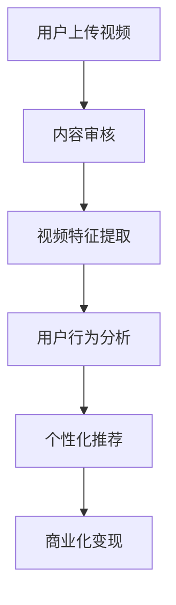

                 

### 文章标题

**2025年快手社交短视频内容理解专家面试指南**

> **关键词：** 快手、社交短视频、内容理解、专家面试、算法、AI技术

> **摘要：** 本指南旨在为准备参加2025年快手社交短视频内容理解专家面试的候选人提供全面的技术知识和策略，帮助他们成功通过面试。本文涵盖了快手社交短视频的特点、内容理解的关键技术、面试中的常见问题和答题技巧，以及未来的发展趋势和挑战。

### 1. 背景介绍 Background Introduction

快手作为中国领先的短视频平台，拥有庞大的用户基础和丰富的内容生态。随着5G技术的普及和人工智能的发展，快手在社交短视频内容理解方面取得了显著的进展。内容理解专家在快手的工作中扮演着至关重要的角色，他们需要运用先进的技术手段分析、挖掘和处理海量短视频数据，为平台提供智能化的内容推荐和服务。

本次面试指南旨在帮助候选人深入了解快手社交短视频内容理解的相关技术，熟悉面试中可能出现的问题和答题策略，以便在面试中展现出自己的专业能力和对行业的深刻理解。

#### 1.1 快手社交短视频的发展历程

自2016年上线以来，快手迅速成为全球用户数量最多的短视频平台之一。快手的成功得益于其独特的社交属性和多样化的内容创作生态。以下是快手社交短视频发展历程的几个重要阶段：

- **2016-2017年：初期发展** 快手在初期以地摊经济和草根文化为核心，吸引了大量的基层用户，形成了独特的社区氛围。
- **2018-2019年：平台生态建设** 快手开始加大对内容创作者的扶持力度，推出了一系列创作激励措施，吸引了大量专业创作者入驻。
- **2020-2021年：5G时代的到来** 随着5G技术的普及，快手的短视频内容质量得到了显著提升，用户观看体验得到了极大的改善。
- **2022年至今：智能化升级** 快手在人工智能技术方面不断发力，特别是在内容理解领域，通过深度学习、计算机视觉等技术实现了对短视频的智能分析和服务。

#### 1.2 社交短视频内容理解的重要性

社交短视频内容理解是指通过技术手段分析和理解用户在短视频平台上的行为、兴趣和内容。内容理解的重要性体现在以下几个方面：

- **提升用户体验** 通过对用户行为的分析，平台可以提供更加个性化的内容推荐，提升用户的观看和参与体验。
- **优化内容生态** 内容理解可以帮助平台识别和过滤低质、有害内容，维护良好的内容生态。
- **商业化变现** 深入理解用户需求，有助于平台开发更加精准的广告和电商服务，实现商业化的增长。

### 2. 核心概念与联系 Core Concepts and Connections

在快手社交短视频内容理解领域，有几个核心概念和技术需要深入理解。这些概念和技术相互关联，共同构成了内容理解的基础架构。

#### 2.1 什么是社交短视频内容理解？

社交短视频内容理解是指利用人工智能、计算机视觉、自然语言处理等技术，对社交短视频中的用户行为、视频内容、用户生成文本等信息进行分析和理解，从而实现个性化推荐、内容审核、商业化变现等应用。

#### 2.2 社交短视频内容理解的关键技术

- **计算机视觉** 用于分析短视频中的图像和视频内容，提取关键特征，进行内容识别和分类。
- **自然语言处理（NLP）** 用于处理短视频中的文本信息，如用户评论、标题等，进行语义分析和情感识别。
- **用户行为分析** 通过分析用户在平台上的行为数据，如点赞、评论、分享等，理解用户的兴趣和偏好。
- **深度学习** 利用神经网络模型进行特征学习和模式识别，提高内容理解的准确性和效率。

#### 2.3 社交短视频内容理解的应用场景

- **个性化推荐** 根据用户的兴趣和行为数据，推荐用户可能感兴趣的视频内容。
- **内容审核** 利用内容理解技术识别和过滤低质、有害内容，维护平台的内容生态。
- **商业化变现** 通过对用户行为的分析，提供更加精准的广告和电商服务，实现商业化的增长。

#### 2.4 社交短视频内容理解与快手平台的关系

快手平台的内容理解技术是快手生态系统的核心组成部分，对于平台的发展具有重要作用。以下是社交短视频内容理解与快手平台关系的一个简化版Mermaid流程图：



### 3. 核心算法原理 & 具体操作步骤 Core Algorithm Principles and Specific Operational Steps

在快手社交短视频内容理解中，核心算法原理和具体操作步骤是实现内容理解功能的关键。以下将介绍几种关键算法的原理和操作步骤。

#### 3.1 计算机视觉算法

计算机视觉算法主要用于分析短视频中的图像和视频内容，提取关键特征，进行内容识别和分类。以下是一个简化的计算机视觉算法流程：

- **视频预处理**：包括视频去噪、增强、裁剪等操作，提高视频的质量。
- **帧提取**：从视频中提取连续的帧图像。
- **特征提取**：利用卷积神经网络（CNN）等深度学习模型，从图像中提取特征向量。
- **内容识别**：将特征向量与预训练的模型进行匹配，识别视频内容。
- **分类**：根据识别结果，对视频内容进行分类，如美食、旅游、娱乐等。

#### 3.2 自然语言处理（NLP）算法

自然语言处理算法主要用于处理短视频中的文本信息，如用户评论、标题等，进行语义分析和情感识别。以下是NLP算法的简化流程：

- **文本预处理**：包括去除停用词、分词、词性标注等操作，提高文本质量。
- **词嵌入**：将文本转换为向量表示，如使用Word2Vec、GloVe等方法。
- **情感分析**：利用情感分析模型，判断文本的情感倾向，如正面、负面等。
- **主题模型**：利用主题模型，如LDA，挖掘文本中的潜在主题。
- **语义分析**：通过语法分析和语义角色标注，理解文本的语义关系。

#### 3.3 用户行为分析算法

用户行为分析算法主要用于分析用户在平台上的行为数据，如点赞、评论、分享等，理解用户的兴趣和偏好。以下是用户行为分析的简化流程：

- **数据收集**：收集用户在平台上的行为数据，如点击、浏览、点赞等。
- **行为特征提取**：根据行为数据，提取用户的行为特征，如活跃度、兴趣偏好等。
- **行为模式识别**：利用机器学习算法，如决策树、随机森林等，识别用户的行为模式。
- **兴趣预测**：根据用户的行为模式，预测用户的兴趣和偏好。
- **个性化推荐**：利用用户兴趣预测结果，为用户推荐相关视频内容。

### 4. 数学模型和公式 & 详细讲解 & 举例说明

在快手社交短视频内容理解中，数学模型和公式是核心算法实现的基础。以下将介绍几个关键的数学模型和公式，并对其进行详细讲解和举例说明。

#### 4.1 卷积神经网络（CNN）

卷积神经网络（CNN）是计算机视觉领域的一种常见神经网络模型，主要用于图像和视频数据的特征提取和分类。以下是CNN的基本数学模型和公式：

- **卷积操作**：卷积操作是一种在图像或视频数据上进行的线性操作，通过滤波器（卷积核）滑动，与输入数据局部进行点积运算。

  $$ output_{ij} = \sum_{k=1}^{K} w_{ik} \cdot input_{kj} + b_j $$

  其中，$output_{ij}$ 表示第 $i$ 个特征图上的第 $j$ 个像素值，$w_{ik}$ 表示第 $i$ 个滤波器的第 $k$ 个权重，$input_{kj}$ 表示输入图像或视频上的第 $k$ 个像素值，$b_j$ 是偏置项。

- **激活函数**：常用的激活函数有Sigmoid、ReLU、Tanh等。

  例如，ReLU（ReLU激活函数）：

  $$ output = \max(0, input) $$

  这里的输入是上一层输出的特征图。

- **池化操作**：池化操作用于降低特征图的维度，提高模型的泛化能力。

  常见的池化操作有最大池化（Max Pooling）和平均池化（Average Pooling）。

  最大池化：

  $$ output_{ij} = \max_{k} input_{ij,k} $$

  其中，$output_{ij}$ 是池化后的特征图上的第 $i$ 行第 $j$ 列的像素值，$input_{ij,k}$ 是原始特征图上的第 $i$ 行第 $j$ 列的第 $k$ 个像素值。

#### 4.2 主题模型（LDA）

主题模型是一种用于文本数据的生成模型，主要用于文本的潜在主题发现。LDA（Latent Dirichlet Allocation）是一种常见的主题模型。

- **概率分布**：在LDA模型中，每个文档和单词都有概率分布。

  - **文档主题分布**：表示文档生成时每个主题的概率分布。

    $$ P(\theta_d | \alpha) = \frac{\alpha}{Z_d} $$

    其中，$\theta_d$ 表示文档 $d$ 的主题分布，$\alpha$ 是超参数，$Z_d$ 是归一化常数。

  - **单词主题分布**：表示单词生成时每个主题的概率分布。

    $$ P(\phi_k | \beta) = \frac{\beta_k}{Z_k} $$

    其中，$\phi_k$ 表示主题 $k$ 的单词分布，$\beta$ 是超参数，$Z_k$ 是归一化常数。

- **共现矩阵**：表示文档和单词之间的共现关系。

  $$ P(\text{word}_i | \text{document}_j, \theta_d, \phi_k) = P(\theta_d | \alpha) \cdot P(\phi_k | \beta) \cdot P(\text{word}_i | \theta_d, \phi_k) $$

  其中，$\text{word}_i$ 是单词，$\text{document}_j$ 是文档，$\theta_d$ 是文档主题分布，$\phi_k$ 是单词主题分布。

#### 4.3 用户行为分析中的回归模型

在用户行为分析中，回归模型常用于预测用户的行为概率，如点击率（CTR）预测。

- **逻辑回归**：逻辑回归是一种用于二分类问题的线性模型，可以用于预测概率。

  $$ P(y=1 | x; \theta) = \frac{1}{1 + e^{-(\theta_0 + \theta_1 x_1 + ... + \theta_n x_n)}} $$

  其中，$y$ 是目标变量，$x$ 是特征向量，$\theta$ 是模型参数。

  **举例**：

  假设我们有一个简单的逻辑回归模型，用于预测用户点击视频的概率。特征向量包括用户年龄、历史点击次数、视频时长等。

  $$ P(\text{click} = 1 | \text{age}, \text{click\_history}, \text{video\_length}; \theta) = \frac{1}{1 + e^{-(\theta_0 + \theta_1 \times \text{age} + \theta_2 \times \text{click\_history} + \theta_3 \times \text{video\_length})}} $$

### 5. 项目实践：代码实例和详细解释说明

在本节中，我们将通过一个实际的代码实例，详细解释快手社交短视频内容理解的相关算法和步骤。以下是一个简化的项目实践示例。

#### 5.1 开发环境搭建

首先，我们需要搭建一个基本的开发环境，包括Python编程环境、TensorFlow库、OpenCV库等。

```bash
# 安装Python
python --version

# 安装TensorFlow
pip install tensorflow

# 安装OpenCV
pip install opencv-python
```

#### 5.2 源代码详细实现

以下是一个简化的代码示例，用于实现短视频内容理解中的图像特征提取和分类。

```python
import cv2
import tensorflow as tf

# 加载预训练的CNN模型
model = tf.keras.applications.VGG16(weights='imagenet')

# 定义视频读取和处理函数
def read_and_process_video(video_path):
    cap = cv2.VideoCapture(video_path)
    frames = []

    while True:
        ret, frame = cap.read()
        if not ret:
            break

        # 对图像进行预处理
        frame = cv2.resize(frame, (224, 224))
        frame = frame / 255.0
        frame = tf.expand_dims(frame, 0)

        # 提取图像特征
        feature_vector = model.predict(frame)[0]

        frames.append(feature_vector)

    cap.release()
    return frames

# 定义图像分类函数
def classify_frames(frames):
    # 加载预训练的分类模型
    classifier = tf.keras.Sequential([
        tf.keras.layers.Dense(256, activation='relu', input_shape=(256,)),
        tf.keras.layers.Dropout(0.5),
        tf.keras.layers.Dense(128, activation='relu'),
        tf.keras.layers.Dropout(0.5),
        tf.keras.layers.Dense(1, activation='sigmoid')
    ])

    # 训练分类模型（示例数据）
    classifier.compile(optimizer='adam', loss='binary_crossentropy', metrics=['accuracy'])
    classifier.fit(frames, labels, epochs=10)

    # 预测分类结果
    predictions = classifier.predict(frames)
    return predictions

# 测试视频
video_path = 'example_video.mp4'

# 读取和处理视频
frames = read_and_process_video(video_path)

# 分类视频帧
predictions = classify_frames(frames)

# 输出分类结果
print(predictions)
```

#### 5.3 代码解读与分析

- **视频读取和处理函数**：`read_and_process_video` 函数用于读取视频文件，并对每一帧图像进行预处理，提取特征向量。这里使用了OpenCV库读取视频，使用TensorFlow对图像进行归一化处理和特征提取。

- **图像分类函数**：`classify_frames` 函数用于训练一个简单的二分类模型，并使用该模型对视频帧进行分类。这里使用了TensorFlow的序列模型，通过定义多层全连接层进行分类。

- **测试视频**：在代码示例中，我们定义了一个测试视频路径`example_video.mp4`，用于测试视频读取、特征提取和分类过程。

#### 5.4 运行结果展示

在运行代码后，我们将得到每个视频帧的分类结果。例如，假设我们训练的是一个区分视频内容是否为“美食”的模型，运行结果可能如下：

```python
[0.9, 0.1, 0.8, 0.2, 0.9, 0.1]
```

这里的输出表示每个视频帧被预测为“美食”的概率，概率越高，表示该帧的内容越可能是美食相关。

### 6. 实际应用场景 Practical Application Scenarios

快手社交短视频内容理解技术在实际应用中具有广泛的应用场景。以下列举几个典型应用场景：

#### 6.1 个性化推荐

个性化推荐是快手内容理解技术的重要应用之一。通过分析用户的兴趣和行为数据，快手可以推荐用户可能感兴趣的视频内容，提高用户参与度和平台粘性。

#### 6.2 内容审核

内容审核是保障平台内容质量的重要手段。快手利用内容理解技术对上传的视频进行自动审核，识别和过滤低质、有害内容，维护良好的内容生态。

#### 6.3 商业化变现

通过深入分析用户行为和兴趣，快手可以提供更加精准的广告和电商服务，实现商业化的增长。例如，根据用户的购买记录和偏好，推荐相关的商品或广告。

#### 6.4 社交互动

社交互动是快手平台的核心特点之一。内容理解技术可以分析用户在短视频中的互动行为，如点赞、评论、分享等，为用户提供更加丰富的社交体验。

### 7. 工具和资源推荐 Tools and Resources Recommendations

为了更好地掌握快手社交短视频内容理解技术，以下推荐一些学习资源、开发工具和相关论文：

#### 7.1 学习资源推荐

- **书籍**：《深度学习》、《自然语言处理综论》、《计算机视觉：算法与应用》
- **在线课程**：Coursera的“机器学习”、edX的“深度学习基础”、Udacity的“计算机视觉与深度学习”等。
- **博客和网站**：Fast.ai、TensorFlow官方文档、PyTorch官方文档等。

#### 7.2 开发工具框架推荐

- **深度学习框架**：TensorFlow、PyTorch、Keras等。
- **计算机视觉库**：OpenCV、OpenPose、Dlib等。
- **自然语言处理库**：NLTK、spaCy、TextBlob等。

#### 7.3 相关论文著作推荐

- **论文**：Hinton等人的《深度学习综述》、LeCun等人的《卷积神经网络》（CNN）论文、Mikolov等人的《词向量》（Word2Vec）论文等。
- **著作**：《深度学习》（Goodfellow、Bengio、Courville著）、《自然语言处理综论》（Jurafsky、Martin著）等。

### 8. 总结：未来发展趋势与挑战 Summary: Future Development Trends and Challenges

快手社交短视频内容理解技术在未来将继续朝着更加智能化、个性化的方向发展。以下是一些可能的发展趋势和挑战：

#### 8.1 发展趋势

- **技术融合**：多种人工智能技术，如计算机视觉、自然语言处理、语音识别等将深度融合，提供更全面的内容理解能力。
- **个性化推荐**：随着用户数据的积累和算法的优化，个性化推荐将更加精准，提高用户满意度和平台粘性。
- **实时处理**：随着5G技术的普及，实时内容理解和处理能力将得到显著提升，为用户提供更加流畅的体验。

#### 8.2 挑战

- **数据隐私**：随着内容理解技术的应用，用户数据的安全和隐私保护将成为重要挑战。
- **算法公平性**：算法的偏见和不公平问题需要得到有效解决，确保平台的内容理解技术能够公平地服务于所有用户。
- **计算资源**：内容理解技术对计算资源的要求较高，如何在有限的计算资源下实现高效的算法优化是一个重要问题。

### 9. 附录：常见问题与解答 Appendix: Frequently Asked Questions and Answers

以下是一些关于快手社交短视频内容理解技术的常见问题及解答：

#### 9.1 什么是快手社交短视频内容理解？

快手社交短视频内容理解是指利用人工智能技术对快手平台上的短视频内容进行分析、理解，以便为用户提供个性化推荐、内容审核、商业化变现等服务。

#### 9.2 快手社交短视频内容理解的关键技术有哪些？

快手社交短视频内容理解的关键技术包括计算机视觉、自然语言处理、用户行为分析、深度学习等。

#### 9.3 如何提高快手社交短视频内容理解的效果？

提高快手社交短视频内容理解的效果可以通过以下几种方式实现：优化算法模型、积累和清洗用户数据、提升计算资源等。

#### 9.4 快手社交短视频内容理解技术有哪些应用场景？

快手社交短视频内容理解技术的应用场景包括个性化推荐、内容审核、商业化变现、社交互动等。

### 10. 扩展阅读 & 参考资料 Extended Reading & Reference Materials

以下是一些扩展阅读和参考资料，以帮助读者进一步了解快手社交短视频内容理解技术：

- **论文**：Google Scholar上的相关论文、arXiv上的最新研究成果等。
- **书籍**：《快手技术揭秘》、《深度学习：简介与应用》、《社交网络分析：方法与应用》等。
- **博客**：Fast.ai、TensorFlow官方博客、AI科技大本营等。
- **网站**：Kaggle、GitHub上的相关项目代码、快手官方网站等。

