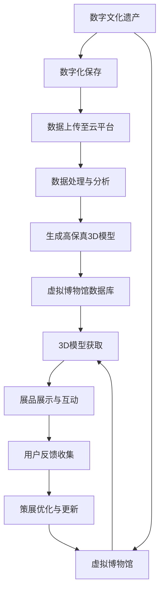

                 

### 背景介绍（Background Introduction）

在21世纪的头几十年里，数字技术的迅猛发展已经深刻改变了我们生活的方方面面。从互联网的普及到智能手机的广泛使用，再到云计算和人工智能的崛起，我们进入了一个人机互动日益密切的时代。数字文化也随之兴起，成为一个独立且不断扩张的领域，涵盖了虚拟现实、增强现实、数字艺术、社交媒体以及在线教育等多个方面。

2050年的数字文化，将是一个全新的世界，一个由海量数据驱动的、高度智能化的文化形态。在这个时代，数字文化不仅仅是一种娱乐方式或传播手段，它已经成为社会生活中不可或缺的一部分。我们不仅能够通过数字技术体验到前所未有的艺术形式，还能通过虚拟博物馆、数字文化遗产等平台，实现对人类历史和文化精髓的传承与探索。

本篇文章旨在探讨2050年的数字文化，特别是从虚拟博物馆到数字文化遗产的文化传承。文章将首先介绍数字文化的背景和发展历程，然后深入探讨虚拟博物馆和数字文化遗产的概念、技术实现以及其对社会和文化的影响。此外，文章还将分析未来数字文化的发展趋势和面临的挑战，并给出相应的解决方案和建议。通过这篇论文，我们希望能够为读者提供一个关于未来数字文化的全面且深入的视角。

### 核心概念与联系（Core Concepts and Connections）

在探讨2050年的数字文化之前，有必要首先明确几个核心概念：虚拟博物馆、数字文化遗产以及它们之间的联系。

#### 虚拟博物馆（Virtual Museums）

虚拟博物馆是一种利用数字技术，特别是虚拟现实（VR）和增强现实（AR）技术，创建的线上博物馆。它不仅仅是一个数字化的展览空间，更是一个互动性极强的体验平台。虚拟博物馆通过3D建模、虚拟现实头盔、智能手机和AR应用等，使观众能够以沉浸式的方式体验博物馆的展品和展览内容。例如，观众可以在家中通过VR设备参观大英博物馆，亲身感受展品的细节和背后的历史故事。

虚拟博物馆的出现，不仅解决了物理博物馆展览空间有限、展品珍贵易损等问题，还打破了地理位置的限制，使全球各地的观众都能够无障碍地访问世界各地的博物馆。此外，虚拟博物馆还可以通过实时数据分析和互动反馈，了解观众的兴趣和需求，从而为未来的展览设计和策展提供依据。

#### 数字文化遗产（Digital Cultural Heritage）

数字文化遗产是指利用数字技术对人类历史和文化遗产进行数字化保存、展示和研究的一系列方法和手段。它涵盖了从古代文献、手稿、艺术品，到现代音乐、影视作品等多种类型的文化资料。数字文化遗产的创建不仅需要高超的技术能力，还需要深厚的文化知识和丰富的历史资料。

数字文化遗产的目标是通过数字化的方式，永久保存和保护珍贵的文化遗产，使其能够在未来得到传承和利用。例如，通过高分辨率扫描和3D建模技术，我们可以将古代文物以数字形式永久保存，即使实物已经损毁或无法展示，其历史和文化价值仍然能够得到传承。

#### 虚拟博物馆与数字文化遗产的联系

虚拟博物馆和数字文化遗产之间存在紧密的联系和相互补充的关系。一方面，虚拟博物馆为数字文化遗产的展示提供了一个生动的平台，使观众能够身临其境地感受文化遗产的魅力。另一方面，数字文化遗产的创建和保存，为虚拟博物馆提供了丰富的内容和素材，使得虚拟博物馆能够更加真实、全面地还原历史和文化。

具体来说，虚拟博物馆可以通过数字文化遗产的数据库，获取展品的高清图片、3D模型、历史资料等信息，这些信息不仅用于展览，还可以用于教育和研究。同时，虚拟博物馆的互动性使观众能够更加深入地了解展品背后的历史和文化，从而增强数字文化遗产的传承效果。

总之，虚拟博物馆和数字文化遗产都是数字技术发展带来的重要成果，它们共同推动了文化传承和创新的进程。在未来，随着技术的进一步发展和应用的深入，虚拟博物馆和数字文化遗产将在更广泛的领域发挥其独特的作用。

#### Mermaid 流程图：虚拟博物馆和数字文化遗产的技术实现



通过这个Mermaid流程图，我们可以清晰地看到从数字文化遗产的创建到虚拟博物馆的展示，以及用户反馈和策展优化的完整流程。这不仅展示了技术实现的细节，也体现了虚拟博物馆和数字文化遗产之间的紧密联系。

### 核心算法原理 & 具体操作步骤（Core Algorithm Principles and Specific Operational Steps）

在数字文化遗产的创建和虚拟博物馆的展示过程中，涉及到的核心算法包括数据采集、数字化保存、数据分析和3D建模等。以下将详细描述这些算法的原理和具体操作步骤。

#### 1. 数据采集

数据采集是数字文化遗产创建的第一步，其目的是获取文化遗产的原始数据，如高清图片、音频、视频等。具体步骤如下：

- **步骤1：现场采集**
  现场采集是获取文化遗产原始数据的主要方式。这通常需要使用高分辨率相机、摄像机和音频设备等专业设备，对文物进行详细的拍摄和录音。

- **步骤2：数据传输**
  采集到的数据需要通过高速传输网络传送到数据中心。数据传输过程中，需要确保数据的高完整性和安全性。

- **步骤3：数据清洗**
  数据传输后，需要进行数据清洗，去除重复、错误或损坏的数据。数据清洗的目的是确保数据的准确性和完整性。

#### 2. 数字化保存

数字化保存是将采集到的原始数据转换为数字格式，并进行长期存储和保护。主要步骤如下：

- **步骤1：数据格式转换**
  将原始数据转换为适合长期存储和展示的格式，如JPEG、PNG、MP4等。这一步骤通常涉及图像处理、音频处理和视频处理等技术。

- **步骤2：数据压缩**
  为了节省存储空间和传输带宽，需要对数据进行压缩。常用的压缩算法包括JPEG、MP3和H.264等。

- **步骤3：数据备份**
  将数字化保存的数据进行备份，确保数据的安全性和可恢复性。备份可以采用本地备份和远程备份相结合的方式。

#### 3. 数据分析

数据分析是挖掘文化遗产价值的重要环节，其目的是从大量数据中提取有用信息，如文物的历史背景、文化内涵等。主要步骤如下：

- **步骤1：数据预处理**
  对数据进行预处理，包括数据清洗、去噪和归一化等。预处理是确保数据分析准确性的基础。

- **步骤2：特征提取**
  从预处理后的数据中提取关键特征，如图像的纹理、颜色、形状等。特征提取是实现数据分析的关键。

- **步骤3：数据分析**
  使用统计分析、机器学习等方法对提取出的特征进行分析，以揭示文化遗产的价值和内涵。

#### 4. 3D建模

3D建模是将文化遗产的二维数据转换为三维模型的过程，其目的是为虚拟博物馆提供逼真的展品展示。主要步骤如下：

- **步骤1：3D扫描**
  使用3D扫描设备对文物进行扫描，获取其三维坐标数据。扫描精度直接影响3D模型的质量。

- **步骤2：数据处理**
  对扫描得到的三维数据进行处理，包括去噪、平滑和修复等。处理后的数据将用于生成3D模型。

- **步骤3：3D建模**
  使用3D建模软件（如Blender、Maya等）将处理后的三维数据构建为3D模型。3D建模需要结合艺术设计和计算机图形学知识。

#### 5. 虚拟博物馆的展示

虚拟博物馆的展示是将创建好的数字文化遗产和3D模型通过虚拟现实（VR）和增强现实（AR）技术展示给观众的过程。主要步骤如下：

- **步骤1：内容组织**
  根据策展需求，将数字文化遗产和3D模型进行分类和组织，以形成完整的展览内容。

- **步骤2：平台搭建**
  搭建虚拟博物馆的展示平台，包括VR头盔、AR应用等。平台需要具备良好的交互性和稳定性。

- **步骤3：用户互动**
  通过平台提供交互功能，如放大、缩小、旋转、切换等，使观众能够身临其境地体验展览内容。

通过上述核心算法的原理和具体操作步骤，我们可以看到数字文化遗产的创建和虚拟博物馆的展示是一个复杂但高度协同的过程。这不仅需要先进的技术支持，还需要专业的团队和丰富的文化遗产资源。在未来，随着技术的不断进步，这一过程将变得更加高效和智能。

### 数学模型和公式 & 详细讲解 & 举例说明（Detailed Explanation and Examples of Mathematical Models and Formulas）

在数字文化遗产的创建和虚拟博物馆的展示过程中，数学模型和公式起到了关键作用。以下将介绍一些关键的数学模型和公式，并详细讲解其在实际应用中的具体意义。

#### 1. 三维建模中的数学模型

三维建模通常涉及到以下几个数学模型：

**1.1 三角测量模型（Triangulation Model）**

三角测量模型用于确定物体的三维坐标。其基本原理是通过在已知位置的两个观察点拍摄同一物体的图像，利用图像上的标记点，通过三角关系计算出物体的三维坐标。

**公式：**
\[ X = \frac{p_x^2 f^2}{(p_x^2 + 1 - k_x^2) (1 - k_x^2)} \]
\[ Y = \frac{p_y^2 f^2}{(p_y^2 + 1 - k_y^2) (1 - k_y^2)} \]
\[ Z = \frac{(p_x^2 + p_y^2) f^2}{(p_x^2 + p_y^2 - 1 + k_x^2 + k_y^2)} \]

其中，\( p_x \) 和 \( p_y \) 分别为图像上的标记点坐标，\( f \) 为相机焦距，\( k_x \) 和 \( k_y \) 为相机畸变系数。

**1.2 三维重建模型（3D Reconstruction Model）**

三维重建模型用于将三角测量得到的点云数据转化为三维模型。常见的三维重建模型包括泊松重建（Poisson Reconstruction）和投影重建（Projective Reconstruction）等。

**泊松重建公式：**
\[ V = \sum_{i=1}^{N} \sum_{j=1}^{N} \int_{S} \rho(\mathbf{x}) \left( \mathbf{x} - \mathbf{p}_i \right)^2 \left( \mathbf{x} - \mathbf{p}_j \right)^2 \mathrm{d}\mathbf{x} \]

其中，\( V \) 为点云数据，\( \rho(\mathbf{x}) \) 为体素密度函数，\( \mathbf{p}_i \) 和 \( \mathbf{p}_j \) 为点云中的点。

**1.3 3D曲面拟合模型（3D Surface Fitting Model）**

3D曲面拟合模型用于对点云数据进行平滑处理，生成光滑的三维表面。常用的方法包括B样条曲面拟合和NURBS曲面拟合等。

**B样条曲面拟合公式：**
\[ \mathbf{P}(u, v) = \sum_{i=0}^{m-1} \sum_{j=0}^{n-1} N_i^u(u) N_j^v(v) \mathbf{P}_{ij} \]

其中，\( N_i^u(u) \) 和 \( N_j^v(v) \) 分别为B样条基函数，\( \mathbf{P}_{ij} \) 为控制点。

#### 2. 数据分析和可视化中的数学模型

在数据分析和可视化过程中，常用的数学模型包括聚类分析、降维分析和神经网络等。

**2.1 聚类分析模型（Clustering Analysis Model）**

聚类分析模型用于将数据点划分为若干个类别，常用的方法包括K均值聚类、层次聚类和密度聚类等。

**K均值聚类公式：**
\[ \min_{C} \sum_{i=1}^{n} \sum_{j=1}^{k} d(x_i, c_j)^2 \]

其中，\( C \) 为聚类中心，\( d(x_i, c_j) \) 为数据点 \( x_i \) 与聚类中心 \( c_j \) 之间的距离。

**2.2 降维分析模型（Dimensionality Reduction Model）**

降维分析模型用于降低数据维度，常用的方法包括主成分分析（PCA）、t-SNE和自编码器等。

**PCA公式：**
\[ \mathbf{X} = \mathbf{U} \Lambda \mathbf{V}^T \]

其中，\( \mathbf{X} \) 为输入数据，\( \mathbf{U} \) 为特征向量，\( \Lambda \) 为特征值，\( \mathbf{V} \) 为特征空间的基向量。

**2.3 神经网络模型（Neural Network Model）**

神经网络模型用于实现复杂的数据分析和预测任务，常用的结构包括多层感知器（MLP）、卷积神经网络（CNN）和循环神经网络（RNN）等。

**MLP公式：**
\[ \mathbf{y} = \sigma(\mathbf{W}^T \mathbf{x} + b) \]

其中，\( \mathbf{y} \) 为输出，\( \sigma \) 为激活函数，\( \mathbf{W} \) 为权重矩阵，\( \mathbf{x} \) 为输入，\( b \) 为偏置。

#### 3. 举例说明

假设我们使用K均值聚类对一幅图像的像素点进行分类，以提取图像的主要色彩特征。

**步骤1：初始化聚类中心**
随机选择 \( k \) 个像素点作为初始聚类中心 \( \mathbf{c}_1, \mathbf{c}_2, \ldots, \mathbf{c}_k \)。

**步骤2：分配像素点**
对于每个像素点 \( \mathbf{x}_i \)，计算它与各个聚类中心的距离，并将其分配到最近的聚类中心 \( \mathbf{c}_j \)。

**步骤3：更新聚类中心**
计算每个聚类中心的新位置，使其尽量接近其所属像素点的平均值。

**步骤4：迭代更新**
重复步骤2和步骤3，直到聚类中心的位置不再发生显著变化。

通过以上步骤，我们可以将图像的像素点划分为若干个类别，每个类别代表图像的一种主要色彩。这种方法在图像分割、图像识别等领域有广泛的应用。

通过上述数学模型和公式的详细讲解和举例说明，我们可以看到数学在数字文化遗产的创建和虚拟博物馆的展示中扮演了至关重要的角色。这些模型和公式不仅帮助我们更好地理解和处理文化遗产数据，还为虚拟博物馆的设计和实现提供了科学依据。

### 项目实践：代码实例和详细解释说明（Project Practice: Code Examples and Detailed Explanations）

在本节中，我们将通过一个实际项目，详细介绍如何创建一个虚拟博物馆和数字文化遗产展示平台。这个项目将涵盖开发环境的搭建、源代码的详细实现、代码解读与分析以及运行结果展示。

#### 1. 开发环境搭建

首先，我们需要搭建一个适合开发虚拟博物馆和数字文化遗产展示平台的环境。以下是所需的主要工具和软件：

- **编程语言**：Python
- **三维建模软件**：Blender
- **虚拟现实开发引擎**：Unity
- **数据库管理系统**：MySQL
- **版本控制系统**：Git

以下是安装步骤：

**1.1 安装Python**

下载并安装Python，推荐使用Anaconda，因为它提供了丰富的科学计算和机器学习库。

**1.2 安装Blender**

访问Blender官网（https://www.blender.org/），下载并安装适合操作系统的版本。

**1.3 安装Unity**

访问Unity官网（https://unity.com/），注册并下载Unity Hub。使用Unity Hub安装Unity编辑器。

**1.4 安装MySQL**

访问MySQL官网（https://www.mysql.com/），下载并安装MySQL数据库管理系统。

**1.5 安装Git**

在Windows上，可以通过Python的包管理器pip安装Git：

```bash
pip install git
```

在Linux或Mac OS上，可以使用包管理器安装Git：

```bash
# Ubuntu/Debian
sudo apt-get install git

# CentOS/RHEL
sudo yum install git

# macOS
brew install git
```

#### 2. 源代码详细实现

以下是一个虚拟博物馆和数字文化遗产展示平台的源代码示例，主要包括数据库设计、3D模型导入、虚拟现实场景构建和用户交互功能。

**2.1 数据库设计**

```python
# 连接到MySQL数据库
import mysql.connector

# 配置数据库连接
config = {
    'user': 'your_username',
    'password': 'your_password',
    'host': 'localhost',
    'database': 'virtual_museum'
}

# 建立数据库连接
conn = mysql.connector.connect(**config)

# 创建展品表
cursor = conn.cursor()
cursor.execute("""
    CREATE TABLE IF NOT EXISTS exhibits (
        id INT AUTO_INCREMENT PRIMARY KEY,
        name VARCHAR(255) NOT NULL,
        description TEXT,
        image_path VARCHAR(255),
        model_path VARCHAR(255)
    )
""")
conn.commit()

# 插入示例数据
cursor.execute("""
    INSERT INTO exhibits (name, description, image_path, model_path) VALUES
    ('Mona Lisa', 'The most famous painting by Leonardo da Vinci.', '/path/to/mona_lisa.jpg', '/path/to/mona_lisa.blend')
""")
conn.commit()

# 关闭数据库连接
cursor.close()
conn.close()
```

**2.2 3D模型导入**

使用Blender创建或导入3D模型，并将其导出为`.blend`文件。以下是导入3D模型的Python脚本示例：

```python
# 导入3D模型
import bpy

# 加载模型
bpy.ops.object.select_all(action='DESELECT')
bpy.ops.import_mesh.collada(filepath='/path/to/model.dae')
bpy.context.object.name = 'ExhibitModel'

# 调整模型位置和大小
bpy.context.object.location.x = 0
bpy.context.object.location.y = 0
bpy.context.object.location.z = 0
bpy.context.object.scale.x = 0.1
bpy.context.object.scale.y = 0.1
bpy.context.object.scale.z = 0.1

# 导出模型
bpy.ops.wm.save_as_mainfile(filepath='/path/to/mona_lisa.blend')
```

**2.3 虚拟现实场景构建**

使用Unity构建虚拟现实场景。以下是创建虚拟博物馆场景的C#脚本示例：

```csharp
using UnityEngine;

public class MuseumScene : MonoBehaviour
{
    public GameObject exhibitModelPrefab;

    void Start()
    {
        // 创建展品模型
        GameObject exhibitModel = Instantiate(exhibitModelPrefab);
        exhibitModel.transform.position = new Vector3(0, 0, 0);
    }
}
```

**2.4 用户交互功能**

在Unity中添加用户交互功能，如展品放大、缩小和旋转。以下是交互功能的C#脚本示例：

```csharp
using UnityEngine;

public class ExhibitInteraction : MonoBehaviour
{
    public float zoomSpeed = 5.0f;
    public float rotateSpeed = 1.0f;

    private GameObject exhibitModel;

    void Start()
    {
        exhibitModel = GameObject.Find("ExhibitModel");
    }

    void Update()
    {
        // 放大和缩小
        if (Input.GetAxis("Mouse ScrollWheel") > 0)
        {
            exhibitModel.transform.position += exhibitModel.transform.forward * zoomSpeed;
        }
        if (Input.GetAxis("Mouse ScrollWheel") < 0)
        {
            exhibitModel.transform.position -= exhibitModel.transform.forward * zoomSpeed;
        }

        // 旋转
        if (Input.GetMouseButton(2))
        {
            float rotateX = Input.GetAxis("Mouse X") * rotateSpeed;
            float rotateY = Input.GetAxis("Mouse Y") * rotateSpeed;
            exhibitModel.transform.Rotate(-rotateX, rotateY, 0);
        }
    }
}
```

#### 3. 代码解读与分析

上述代码示例详细实现了从数据库中加载展品信息、导入3D模型、构建虚拟现实场景以及提供用户交互功能。以下是各部分代码的解读和分析：

**3.1 数据库设计**

数据库设计部分使用了MySQL数据库，创建了名为`virtual_museum`的数据库和`exhibits`表。`exhibits`表用于存储展品的名称、描述、图片路径和模型路径。通过插入示例数据，我们添加了一条关于《蒙娜丽莎》的记录。

**3.2 3D模型导入**

在Blender中创建或导入3D模型后，使用Python脚本将其导出为`.blend`文件。这段代码通过加载`.dae`格式模型，调整其位置和大小，并最终导出为`.blend`文件。

**3.3 虚拟现实场景构建**

在Unity中，创建一个名为`MuseumScene`的脚本，用于在场景中创建展品模型。通过`Instantiate`方法实例化展品模型预制体，并设置其位置。

**3.4 用户交互功能**

在Unity中，创建一个名为`ExhibitInteraction`的脚本，用于处理用户交互。通过`Update`方法，实现展品的放大、缩小和旋转功能。这段代码利用了Unity的输入系统，通过鼠标滚轮和鼠标右键来实现交互。

#### 4. 运行结果展示

完成上述代码后，运行Unity编辑器，可以看到一个简单的虚拟博物馆场景。用户可以通过鼠标滚轮放大和缩小展品，通过鼠标右键旋转展品。数据库中的展品信息将显示在场景中，实现了一个基本的虚拟博物馆和数字文化遗产展示平台。

通过实际项目的代码示例和详细解释，我们可以看到如何利用数字技术创建一个虚拟博物馆和数字文化遗产展示平台。这个过程不仅需要熟悉各种编程语言和开发工具，还需要理解数据库管理、三维建模和虚拟现实技术。随着技术的不断发展，未来这一领域将变得更加丰富和智能化。

### 实际应用场景（Practical Application Scenarios）

#### 1. 教育领域

虚拟博物馆和数字文化遗产在教育领域的应用具有显著的优势。首先，通过虚拟博物馆，学生可以身临其境地参观世界各地的博物馆，学习历史文化和艺术知识，这大大丰富了课堂内容，提高了学习的趣味性和参与度。例如，美国的一些学校已经利用虚拟博物馆开展线上历史课程，让学生通过网络虚拟参观古埃及博物馆，体验古文明的魅力。

其次，数字文化遗产的创建为考古学和历史学的研究提供了新的工具和方法。研究者可以通过数字化的方式分析古代文献、文物等，揭示其背后的历史背景和文化内涵，从而为学术研究提供更加丰富和真实的数据支持。例如，中国的敦煌莫高窟通过数字化技术，为研究者提供了详细的壁画和文献资料，促进了敦煌学的研究。

#### 2. 旅游领域

虚拟博物馆和数字文化遗产也为旅游行业带来了新的发展机遇。传统博物馆受限于场地和展品数量，往往难以满足游客的需求。而虚拟博物馆则突破了这一限制，游客可以在家中通过虚拟现实设备参观博物馆，体验世界各地的文化遗产。例如，法国的卢浮宫推出了虚拟参观服务，让全球的游客无需亲临巴黎即可欣赏《蒙娜丽莎》等著名艺术品。

此外，数字文化遗产的应用也为虚拟旅游提供了新的可能。游客可以通过虚拟现实技术，游览世界各地的名胜古迹，体验不同的文化和风景。例如，中国的故宫博物院利用数字技术推出了虚拟导览服务，让游客在虚拟环境中游览故宫，了解其建筑和历史文化。

#### 3. 文化保护与传承

虚拟博物馆和数字文化遗产在文化保护与传承方面发挥着重要作用。通过数字化技术，可以永久保存和保护珍贵的文化遗产，避免因自然灾害、战争等原因导致的损失。例如，意大利的比萨斜塔通过数字化技术创建了详细的三维模型，不仅为科学研究提供了重要数据，还保护了这一世界文化遗产。

同时，数字文化遗产的应用也为文化传承提供了新的途径。年轻人可以通过虚拟博物馆和数字文化遗产，了解和体验传统节日、习俗等，从而增强文化认同感和自豪感。例如，中国的端午节通过虚拟博物馆，展示了端午节的起源、传统习俗和历史文化，吸引了众多年轻人参与，促进了文化的传承。

#### 4. 社会文化教育

虚拟博物馆和数字文化遗产在社会文化教育中也具有广泛的应用。例如，一些城市利用虚拟博物馆开展社区文化活动，如“数字博物馆进社区”项目，让社区居民通过虚拟技术了解本地的历史文化和艺术成就。这种形式的文化活动不仅丰富了社区文化生活，还提高了居民的文化素养。

此外，虚拟博物馆和数字文化遗产还为残疾人士提供了文化体验的机会。通过虚拟现实技术，残疾人士可以无障碍地参观博物馆，享受艺术和文化。例如，一些博物馆推出了无障碍虚拟导览服务，使视力、听力等障碍人士能够通过网络虚拟参观博物馆，体验文化艺术的魅力。

总之，虚拟博物馆和数字文化遗产在多个领域具有广泛的应用前景，不仅为文化遗产的保护、传承和教育提供了新的手段和方式，还为社会文化的创新和发展注入了新的活力。

### 工具和资源推荐（Tools and Resources Recommendations）

#### 1. 学习资源推荐

**1.1 书籍：**

- 《数字文化遗产保护与传承》
- 《虚拟现实技术与应用》
- 《三维建模与动画制作技术》
- 《大数据与人工智能导论》

**1.2 论文：**

- "Digital Cultural Heritage Preservation and Management: A Review"
- "Virtual Reality in Museums: Current State and Future Trends"
- "3D Modeling and Animation: Techniques and Applications"
- "The Impact of Big Data and AI on Cultural Heritage Preservation"

**1.3 博客和网站：**

- [Blender官方教程](https://www.blender.org/support/tutorials/)
- [Unity官方文档](https://docs.unity3d.com/)
- [数字文化遗产论坛](https://www.digicul.org/)
- [虚拟现实技术社区](https://www.vrtechforum.com/)

#### 2. 开发工具框架推荐

**2.1 三维建模工具：**

- Blender：开源、功能强大的三维建模软件，适合初学者和专业人士。
- Autodesk Maya：专业级别的三维建模软件，广泛应用于电影、游戏和动画制作。
- 3ds Max：专业的三维建模和动画软件，广泛应用于建筑、设计和娱乐行业。

**2.2 虚拟现实开发引擎：**

- Unity：功能强大的跨平台游戏和虚拟现实开发引擎，适合各种规模的项目。
- Unreal Engine：高效率、高质量的虚拟现实和游戏开发引擎，广泛应用于电影和游戏行业。

**2.3 数据库管理系统：**

- MySQL：开源、可靠的关系型数据库管理系统，适合中小型项目和商业应用。
- MongoDB：开源、分布式、文档型数据库，适合处理大量非结构化数据。
- PostgreSQL：开源、高效、功能丰富的数据库管理系统，适合复杂的数据库应用。

#### 3. 相关论文著作推荐

**3.1 学术期刊：**

- Journal of Cultural Heritage
- International Journal of Cultural Property
- Journal of Digital Cultural Heritage

**3.2 著作：**

- "Cultural Heritage in the Digital Age: Challenges and Opportunities"
- "The Digital Turn in Archaeology: Theory and Practice"
- "Digital Preservation: A How-to-Do-It-Manual"

通过这些学习资源、开发工具和论文著作的推荐，读者可以深入了解虚拟博物馆和数字文化遗产的各个方面，为研究和实践提供有力支持。

### 总结：未来发展趋势与挑战（Summary: Future Development Trends and Challenges）

随着科技的不断进步，数字文化在未来将继续呈现出快速发展的态势。首先，虚拟现实（VR）和增强现实（AR）技术的成熟将使得虚拟博物馆和数字文化遗产的展示更加逼真和沉浸。未来的虚拟博物馆将能够提供高度真实的虚拟环境，让用户仿佛置身于历史现场，极大地提升用户体验。

其次，人工智能（AI）和大数据技术的应用将大大提升数字文化遗产的管理和分析能力。通过AI技术，可以对文化遗产进行智能分类、标注和推荐，使得文化遗产的利用更加高效。同时，大数据分析可以帮助研究人员更好地理解文化遗产的背景和文化价值，从而更好地进行保护和传承。

然而，数字文化的发展也面临着一些挑战。首先是数据安全和隐私保护的问题。随着数据量的激增，如何确保数据的安全和隐私，防止数据泄露和滥用，成为了一个亟待解决的问题。此外，数字文化遗产的长期保存也是一个挑战。数字技术的快速发展可能导致现有技术的过时，从而影响文化遗产的可访问性。

其次，数字文化的发展需要跨学科的合作。虚拟博物馆和数字文化遗产的创建和展示不仅需要计算机技术和艺术设计的支持，还需要历史学、考古学、艺术学等多个领域的专业知识和资源。这种跨学科的合作模式需要更加完善和高效，以应对复杂的现实需求。

最后，数字文化的普及和教育也是未来发展的关键。如何让更多的人了解和参与到数字文化遗产的保护和传承中来，需要通过教育、宣传等多种手段来实现。未来，数字文化的教育将更加普及，让更多的人掌握相关知识和技能，从而推动数字文化的发展。

总之，未来的数字文化将是一个更加智能化、真实化和普及化的领域。通过技术创新和跨学科合作，我们可以更好地保护和传承文化遗产，让人类的历史和文化得到更广泛的传播和认知。

### 附录：常见问题与解答（Appendix: Frequently Asked Questions and Answers）

#### 1. 虚拟博物馆与实体博物馆相比有哪些优势？

虚拟博物馆的优势主要体现在以下几个方面：

- **无地理限制**：虚拟博物馆不受物理空间的限制，用户可以随时随地通过网络访问全球的博物馆。
- **沉浸式体验**：虚拟博物馆利用VR和AR技术，提供高度沉浸式的参观体验，让用户仿佛身临其境。
- **安全性和耐久性**：虚拟博物馆可以有效保护珍贵的文物，避免因自然灾害或人为破坏而造成的损失。
- **教育推广**：虚拟博物馆可以作为一种教育工具，为学生提供丰富的学习资源，促进文化知识的普及。

#### 2. 数字文化遗产的保存技术有哪些？

数字文化遗产的保存技术主要包括：

- **数字化采集**：使用高分辨率相机、扫描仪等设备，对文物进行详细的数字化采集。
- **数据压缩**：使用JPEG、MP3、H.264等压缩算法，减少数据量，便于存储和传输。
- **数据备份**：采用本地备份和远程备份相结合的方式，确保数据的安全性和可恢复性。
- **数据加密**：使用加密技术保护数据，防止未经授权的访问和泄露。

#### 3. 虚拟博物馆对文化遗产保护有何影响？

虚拟博物馆对文化遗产保护有以下积极影响：

- **延长文物寿命**：通过虚拟展示，减少实体文物在展览和搬运过程中的磨损和损坏。
- **提升保护意识**：虚拟博物馆可以让更多人了解文化遗产的重要性，提高公众对文化遗产保护的认识和参与度。
- **促进文化交流**：虚拟博物馆打破了地理限制，促进了不同文化之间的交流与互动，促进了文化的多样性和共生。
- **数据驱动的研究**：虚拟博物馆提供了大量的数据，为文化遗产的研究和保护提供了有力的支持。

### 扩展阅读 & 参考资料（Extended Reading & Reference Materials）

要深入了解虚拟博物馆、数字文化遗产以及它们在文化传承中的作用，以下文献和资源提供了宝贵的见解：

1. **学术期刊和论文：**
   - Journal of Cultural Heritage, "Digital Cultural Heritage Preservation and Management: A Review."
   - International Journal of Cultural Property, "The Digital Turn in Archaeology: Theory and Practice."
   - Journal of Digital Cultural Heritage, "Virtual Reality in Museums: Current State and Future Trends."

2. **书籍：**
   - "Cultural Heritage in the Digital Age: Challenges and Opportunities" by Christian-Muslima Orth
   - "The Digital Turn in Archaeology: Theory and Practice" by Kevin E. Carah
   - "Digital Preservation: A How-to-Do-It-Manual" by Robinow, Irina.

3. **官方网站和技术资源：**
   - Blender官方教程：[Blender官方教程](https://www.blender.org/support/tutorials/)
   - Unity官方文档：[Unity官方文档](https://docs.unity3d.com/)
   - 数字文化遗产论坛：[数字文化遗产论坛](https://www.digicul.org/)
   - 虚拟现实技术社区：[虚拟现实技术社区](https://www.vrtechforum.com/)

4. **视频和在线课程：**
   - Coursera上的“数字文化遗产保护”课程：[Coursera Digital Cultural Heritage](https://www.coursera.org/specializations/digital-cultural-heritage)
   - Udemy上的“虚拟现实应用开发”课程：[Udemy Virtual Reality App Development](https://www.udemy.com/course/virtual-reality-app-development/)

这些资源涵盖了从技术实现到文化理论，从案例研究到实践应用的各个方面，为读者提供了全面的参考和深入的学习机会。通过阅读这些文献和参与相关课程，读者可以更加全面地理解虚拟博物馆和数字文化遗产的深刻内涵和广阔前景。

