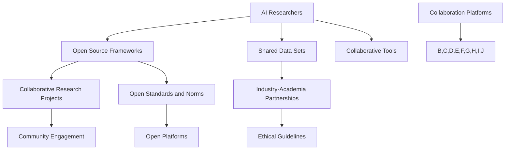

                 

### 文章标题：开放合作：推动AI生态系统发展的动力

> 关键词：开放合作，AI生态系统，创新，协作，共享，可持续性，技术进步

> 摘要：本文探讨了开放合作在推动人工智能（AI）生态系统发展中的关键作用。通过分析开放合作的定义、核心原则及其在AI领域的具体应用，本文揭示了开放合作如何促进创新、协作和共享，从而加速技术进步，实现生态系统的可持续性。

本文将分为以下几个部分：

1. **背景介绍**
2. **核心概念与联系**
3. **核心算法原理 & 具体操作步骤**
4. **数学模型和公式 & 详细讲解 & 举例说明**
5. **项目实践：代码实例和详细解释说明**
6. **实际应用场景**
7. **工具和资源推荐**
8. **总结：未来发展趋势与挑战**
9. **附录：常见问题与解答**
10. **扩展阅读 & 参考资料**

现在，我们将逐步分析每个部分的内容。

<|assistant|>### 1. 背景介绍

人工智能（AI）作为现代科技的重要驱动力，正在深刻改变我们的生活方式、工作方式以及社会结构。随着AI技术的迅猛发展，构建一个健康、可持续的AI生态系统变得至关重要。在这个生态系统中，不同利益相关者——包括研究人员、开发者、企业和用户——需要通过有效的合作来实现共同的目标。

**开放合作**作为AI生态系统发展的核心动力，具有以下几个显著特点：

- **共享知识**：通过开放合作，研究人员和开发者可以共享他们的研究成果和最佳实践，从而加速技术进步。
- **协同创新**：不同背景和领域的专家共同合作，可以激发新的创意和解决方案。
- **资源整合**：开放合作可以整合分散的资源，如计算能力、数据集和工具，提高整体效率。
- **降低成本**：共享资源和技术可以降低开发和运营成本，使更多人能够参与到AI生态系统中来。

本文旨在探讨开放合作在推动AI生态系统发展中的关键作用，分析其核心原则和实践案例，并展望未来的发展趋势和挑战。

### Background Introduction

### 1.1 开放合作的定义与历史发展

开放合作（Open Collaboration）是指在共同目标或愿景的驱动下，不同主体（个人、组织、社区等）通过共享知识、资源和信息，进行协同创新和合作的一种模式。这种模式强调合作各方之间的平等、透明和互惠互利。

开放合作的历史可以追溯到20世纪末21世纪初的互联网时代。随着互联网的普及，人们开始意识到通过共享和协作可以实现更大的成就。早期的开放合作项目，如Linux操作系统、Wikipedia等，成为了现代开放合作的重要基石。

### 1.2 AI生态系统的发展现状与挑战

AI生态系统的发展迅速，但同时也面临着诸多挑战。首先，技术快速迭代使得研究人员和开发者需要不断更新知识体系，这要求生态系统能够提供持续的学习和成长机会。其次，数据的质量和多样性是AI技术发展的关键，如何获取、处理和共享数据成为了重要问题。

此外，AI技术的应用场景越来越广泛，从医疗、金融到教育、交通，不同领域的需求差异巨大，这要求AI生态系统具有高度灵活性和适应性。同时，AI技术的伦理和安全问题也日益凸显，如何确保技术的公平性、透明性和安全性是生态系统中亟待解决的问题。

### 1.3 开放合作在AI生态系统中的重要性

在AI生态系统中，开放合作具有以下几个方面的关键作用：

- **促进技术进步**：通过开放合作，研究人员和开发者可以快速分享最新的研究成果和最佳实践，从而推动技术进步。
- **提高创新效率**：不同领域的专家共同合作，可以激发新的创意和解决方案，提高创新效率。
- **降低研发成本**：共享资源和技术可以降低开发和运营成本，使更多人能够参与到AI生态系统中来。
- **加强社区参与**：开放合作鼓励社区成员的参与和贡献，增强了生态系统的多样性和活力。

### 1.4 开放合作在AI领域的具体应用

在AI领域，开放合作的具体应用涵盖了多个方面，包括：

- **开源软件与工具**：如TensorFlow、PyTorch等，这些开源框架和工具为研究人员和开发者提供了强大的支持。
- **共享数据集**：如ImageNet、Common Crawl等，这些高质量的数据集为AI模型训练提供了宝贵资源。
- **联合研究项目**：如FAIR（Findable, Accessible, Interoperable, Reusable）倡议，通过跨机构和组织的合作，推动数据共享和协同创新。
- **开放标准和规范**：如AI伦理框架、数据隐私保护标准等，这些标准和规范为AI技术的可持续发展提供了基础。

### Conclusion

In summary, open collaboration plays a crucial role in the development of the AI ecosystem. By promoting knowledge sharing, collaborative innovation, and resource integration, open collaboration accelerates technological progress and ensures the sustainability of the ecosystem. The following sections will delve into the core concepts, principles, and practical applications of open collaboration in the AI field, exploring how it can overcome the challenges and drive the ecosystem forward.

<|assistant|>### 2. 核心概念与联系

#### 2.1 开放合作：定义、原则与框架

**开放合作**（Open Collaboration）的定义在学术界和实践界有着多种解释，但其核心思想始终围绕共享、协作和透明。具体来说，开放合作可以被视为一种组织间或组织内个体间的协同工作方式，其基本原则包括：

- **透明性**：合作过程中的信息、资源和决策是公开的，使得所有参与者都能获取所需的信息。
- **共享**：合作各方愿意分享其知识、资源和成果，以促进共同发展。
- **互惠**：合作双方或多方在共享资源和知识时，期待得到相应的回报。
- **平等**：所有参与者不论其规模、地位或贡献，都有平等的参与机会和话语权。

为了更好地理解和实践开放合作，我们可以将其框架分为以下几个关键组成部分：

- **参与主体**：包括个人、组织、社区和政府等不同角色。
- **合作目标**：明确合作的目标和愿景，确保各方朝着共同的方向努力。
- **合作机制**：包括沟通渠道、决策流程、资源分配和利益分配等具体机制。
- **合作平台**：如开源社区、联合实验室、在线协作工具等，为合作提供基础设施。

#### 2.2 AI生态系统中的开放合作

在AI生态系统中，开放合作具有特殊的重要性。以下图展示了AI生态系统中的开放合作模型及其核心组成部分：



**图1：AI生态系统中的开放合作模型**

- **AI Researchers**（AI研究人员）：作为生态系统的核心，研究人员通过开放合作分享研究成果和最佳实践。
- **Open Source Frameworks**（开源框架）：如TensorFlow、PyTorch等，为研究人员和开发者提供了强大的工具和平台。
- **Shared Data Sets**（共享数据集）：如ImageNet、Common Crawl等，为模型训练提供了丰富的资源。
- **Collaborative Research Projects**（联合研究项目）：如FAIR倡议，通过跨机构和组织的合作，推动数据共享和协同创新。
- **Industry-Academia Partnerships**（产业-学术合作）：如企业与高校和研究机构的联合项目，促进技术创新和应用。
- **Open Standards and Norms**（开放标准和规范）：如AI伦理框架、数据隐私保护标准，为AI技术的可持续发展提供了基础。
- **Community Engagement**（社区参与）：鼓励更多个人和社区参与到AI生态系统中来，共同推动技术进步。
- **Ethical Guidelines**（伦理指南）：确保AI技术的应用符合伦理和社会价值。
- **Open Platforms**（开放平台）：如GitHub、GitLab等，为开发者和研究者提供了协作和共享的环境。
- **Collaborative Tools**（协作工具）：如Jira、Slack等，提高了团队合作效率。
- **Collaboration Platforms**（协作平台）：包括线上和线下活动、研讨会和工作坊等，为合作提供了多种形式。

#### 2.3 开放合作的核心原则在AI生态系统中的应用

在AI生态系统中，开放合作的核心原则得到了广泛应用，以下是对这些原则的具体应用说明：

- **透明性**：通过开源框架和开放平台，研究人员可以公开其研究方法和成果，接受社区的审查和反馈，从而提高研究质量和可信度。
- **共享**：共享数据集和知识库使得不同领域的开发者可以快速获取所需资源，加速技术创新。
- **互惠**：产业-学术合作通过资源共享和知识交换，实现了企业和研究机构的双赢。
- **平等**：开源社区通常鼓励各种规模的贡献，使得小型团队和个人也能参与到生态系统中，共同推动技术进步。

#### 2.4 开放合作的挑战与解决方案

尽管开放合作在AI生态系统中具有巨大潜力，但也面临着一些挑战：

- **知识产权保护**：在共享资源的同时，如何平衡知识产权保护是一个关键问题。解决方案包括制定明确的知识产权政策和使用许可协议。
- **数据隐私和安全**：共享数据集时，保护个人隐私和数据安全是重要考虑。通过数据加密、匿名化和严格的访问控制，可以降低风险。
- **合作中的冲突**：不同利益相关者在合作过程中可能存在分歧和冲突。建立有效的沟通和决策机制，如共识决策模型，可以帮助解决这些问题。

### Conclusion

In summary, open collaboration is a vital component of the AI ecosystem, promoting knowledge sharing, collaborative innovation, and resource integration. By understanding the core concepts, principles, and practical applications of open collaboration, stakeholders can work together more effectively to drive the development of the AI ecosystem. The following sections will further explore the core algorithm principles, mathematical models, and practical project examples that demonstrate the power of open collaboration in AI.

### 2. Core Concepts and Connections

#### 2.1 Definition of Open Collaboration

Open collaboration refers to a collaborative approach where individuals or organizations willingly share knowledge, resources, and information for a common goal or vision. This mode of collaboration emphasizes equality, transparency, and mutual benefit. The core principles of open collaboration include transparency, sharing, reciprocity, and equality.

**Transparency** ensures that information, resources, and decisions within the collaboration process are open and accessible to all participants. This fosters trust and allows for continuous improvement and accountability.

**Sharing** encourages all parties to contribute their knowledge, resources, and expertise, promoting a culture of openness and collective growth.

**Reciprocity** implies that while parties share their resources and knowledge, they expect to receive some form of benefit or return in the process.

**Equity** ensures that all participants, regardless of their size, status, or contribution, have an equal opportunity to participate and voice their opinions.

#### 2.2 Framework of Open Collaboration

To better understand and practice open collaboration, we can break it down into several key components:

**Participants** include individuals, organizations, communities, and governments, each playing a distinct role in the ecosystem.

**Collaboration Goals** define the objectives and vision of the collaboration, ensuring that all parties are working towards a common direction.

**Collaboration Mechanisms** encompass communication channels, decision-making processes, resource allocation, and benefit distribution.

**Collaboration Platforms** are the infrastructure that supports collaboration, such as open-source communities, joint laboratories, and online collaboration tools.

#### 2.3 Open Collaboration in the AI Ecosystem

Open collaboration holds a special importance within the AI ecosystem. The following diagram illustrates the open collaboration model in the AI ecosystem and its core components:


**Figure 1: Open Collaboration Model in the AI Ecosystem**

- **AI Researchers**: As the core of the ecosystem, researchers share their research findings and best practices through open collaboration.
- **Open Source Frameworks**: Such as TensorFlow and PyTorch, provide powerful tools and platforms for researchers and developers.
- **Shared Data Sets**: Like ImageNet and Common Crawl, offer valuable resources for model training.
- **Collaborative Research Projects**: Such as the FAIR initiative, promote data sharing and collaborative innovation across institutions and organizations.
- **Industry-Academia Partnerships**: Like joint projects between companies and universities, advance technological innovation and application.
- **Open Standards and Norms**: Such as AI ethical frameworks and data privacy protection standards, provide a foundation for the sustainable development of AI technology.
- **Community Engagement**: Encourages more individuals and communities to participate in the AI ecosystem, driving technological progress together.
- **Ethical Guidelines**: Ensure that AI technology is applied in a manner that aligns with ethical and social values.
- **Open Platforms**: Such as GitHub and GitLab, provide environments for developers and researchers to collaborate and share.
- **Collaborative Tools**: Such as Jira and Slack, improve team collaboration efficiency.
- **Collaboration Platforms**: Include various forms of online and offline activities, such as workshops and seminars, facilitating collaboration.

#### 2.4 Core Principles of Open Collaboration in AI Ecosystem

The core principles of open collaboration are widely applied in the AI ecosystem. The following elaborates on these principles and their specific applications:

**Transparency** is achieved through open-source frameworks and open platforms, allowing researchers to make their research methods and findings publicly accessible, subject to community review and feedback, thereby enhancing the quality and credibility of research.

**Sharing** enables different domain developers to quickly access the resources they need, accelerating technological innovation.

**Reciprocity** is observed in industry-academia partnerships, where resources and knowledge are exchanged, benefiting both companies and research institutions.

**Equity** is promoted in open-source communities, where contributions from various-sized teams and individuals are encouraged, fostering collective technological progress.

#### 2.5 Challenges and Solutions in Open Collaboration

Despite its immense potential, open collaboration in the AI ecosystem also faces challenges:

**Intellectual Property Protection**: Balancing the sharing of resources while protecting intellectual property is a critical issue. Solutions include establishing clear intellectual property policies and usage license agreements.

**Data Privacy and Security**: Protecting personal privacy and data security when sharing datasets is of paramount importance. Measures such as data encryption, anonymization, and strict access controls can help mitigate risks.

**Conflict in Collaboration**: Disagreements and conflicts may arise among different stakeholders during collaboration. Effective communication and decision-making mechanisms, such as consensus-based decision-making models, can help resolve these issues.

### Conclusion

In summary, open collaboration is a vital component of the AI ecosystem, promoting knowledge sharing, collaborative innovation, and resource integration. By understanding the core concepts, principles, and practical applications of open collaboration, stakeholders can work together more effectively to drive the development of the AI ecosystem. The following sections will further explore the core algorithm principles, mathematical models, and practical project examples that demonstrate the power of open collaboration in AI.

### 3. 核心算法原理 & 具体操作步骤

在开放合作中，核心算法的设计和实现是至关重要的。以下我们将介绍一些在AI领域常用的核心算法，并详细描述其原理和具体操作步骤。

#### 3.1 神经网络算法

**原理**：神经网络算法是一种基于人脑神经元连接的计算机算法，通过多层神经网络进行特征学习和模式识别。神经网络的核心是神经元，每个神经元都与其他神经元连接，并通过权重和偏置来传递信息。

**具体操作步骤**：
1. **数据预处理**：对输入数据集进行标准化和归一化处理，以便神经网络能够更好地学习。
2. **网络架构设计**：根据任务需求设计网络结构，包括输入层、隐藏层和输出层。每个层中的神经元数量和激活函数选择都需根据具体任务进行优化。
3. **权重初始化**：对神经网络中的权重和偏置进行随机初始化。
4. **前向传播**：输入数据通过网络传递，在每个隐藏层进行加权求和并应用激活函数。
5. **反向传播**：计算输出层的误差，将误差反向传播至前一层，更新权重和偏置。
6. **迭代训练**：重复前向传播和反向传播，直到网络达到预定的误差阈值或迭代次数。

#### 3.2 生成对抗网络（GAN）

**原理**：生成对抗网络（GAN）是一种由生成器和判别器组成的对抗性模型。生成器生成与真实数据相似的数据，而判别器则尝试区分生成器和真实数据。通过生成器和判别器的对抗训练，生成器逐渐生成更加真实的数据。

**具体操作步骤**：
1. **初始化生成器和判别器**：生成器和判别器都使用随机权重进行初始化。
2. **生成器训练**：生成器尝试生成与真实数据相似的数据，判别器则对真实数据和生成器生成的数据进行分类。
3. **判别器训练**：判别器尝试提高对真实数据和生成器生成的数据的分类准确性。
4. **迭代训练**：重复生成器和判别器的训练，直到生成器生成数据的质量达到预定的标准。

#### 3.3 强化学习算法

**原理**：强化学习算法是一种通过不断试错来学习最优策略的机器学习算法。智能体通过与环境交互，根据环境反馈调整其行为，以最大化长期奖励。

**具体操作步骤**：
1. **定义环境**：明确智能体所处的环境，包括状态空间、动作空间和奖励函数。
2. **初始化智能体**：智能体使用随机策略进行初始化。
3. **智能体-环境交互**：智能体根据当前状态选择动作，执行动作并接收环境反馈。
4. **策略更新**：根据接收到的奖励，更新智能体的策略。
5. **迭代训练**：重复智能体-环境交互过程，直到智能体找到最优策略。

#### 3.4 聚类算法

**原理**：聚类算法是一种将数据集划分为多个群组的无监督学习算法。聚类算法通过相似度度量将数据点划分到不同的簇中，从而实现数据的分类和挖掘。

**具体操作步骤**：
1. **选择聚类算法**：根据数据集特点和任务需求选择合适的聚类算法，如K-means、DBSCAN等。
2. **初始化聚类中心**：随机选择初始聚类中心或使用特定算法初始化。
3. **分配数据点**：计算每个数据点与聚类中心的相似度，将数据点分配到最近的聚类中心。
4. **更新聚类中心**：根据数据点的分配结果，重新计算聚类中心。
5. **重复迭代**：重复分配和更新聚类中心，直到聚类中心收敛或达到预定的迭代次数。

### Conclusion

The core algorithms in open collaboration play a crucial role in driving AI development. By understanding the principles and specific operational steps of neural networks, GANs, reinforcement learning, and clustering algorithms, stakeholders can effectively implement and optimize these algorithms in collaborative projects. The following section will delve into the detailed mathematical models and formulas used in these algorithms, providing a deeper understanding of their underlying mechanisms.

### 3. Core Algorithm Principles and Specific Operational Steps

#### 3.1 Neural Network Algorithm

**Principle**: Neural network algorithms are computer algorithms inspired by the human brain's neural connections, designed for feature learning and pattern recognition. The core of neural networks is the neuron, which is connected to other neurons through weights and biases to transmit information.

**Specific Operational Steps**:
1. **Data Preprocessing**: Standardize and normalize the input dataset to enable better learning by the neural network.
2. **Network Architecture Design**: Design the network structure based on the task requirements, including input layers, hidden layers, and output layers. The number of neurons in each layer and the choice of activation functions are optimized based on the specific task.
3. **Weight Initialization**: Randomly initialize the weights and biases in the neural network.
4. **Forward Propagation**: Pass the input data through the network, performing weighted summation and applying activation functions at each hidden layer.
5. **Backpropagation**: Calculate the error at the output layer and backpropagate the error to the previous layer to update the weights and biases.
6. **Iterative Training**: Repeat the forward propagation and backpropagation until the network reaches the desired error threshold or the number of iterations.

#### 3.2 Generative Adversarial Networks (GAN)

**Principle**: Generative adversarial networks (GAN) consist of a generator and a discriminator that engage in an adversarial training process. The generator generates data similar to the real data, while the discriminator attempts to distinguish between real data and generated data. Through this adversarial training, the generator gradually improves the quality of the generated data.

**Specific Operational Steps**:
1. **Initialize Generator and Discriminator**: Initialize the generator and discriminator with random weights.
2. **Generator Training**: The generator tries to generate data similar to the real data, while the discriminator classifies real and generated data.
3. **Discriminator Training**: The discriminator attempts to improve its classification accuracy of real and generated data.
4. **Iterative Training**: Repeat the generator and discriminator training until the generator produces data of the desired quality.

#### 3.3 Reinforcement Learning Algorithm

**Principle**: Reinforcement learning algorithms are machine learning algorithms that learn optimal strategies through trial and error. An agent interacts with the environment, adjusting its behavior based on environmental feedback to maximize long-term rewards.

**Specific Operational Steps**:
1. **Define Environment**: Clarify the environment in which the agent operates, including the state space, action space, and reward function.
2. **Initialize Agent**: Initialize the agent with a random policy.
3. **Agent-Environment Interaction**: The agent selects actions based on the current state, executes actions, and receives feedback from the environment.
4. **Policy Update**: Update the agent's policy based on the received reward.
5. **Iterative Training**: Repeat the agent-environment interaction process until the agent finds the optimal policy.

#### 3.4 Clustering Algorithm

**Principle**: Clustering algorithms are unsupervised learning algorithms that group data points into multiple clusters. Clustering algorithms use similarity metrics to assign data points to different clusters, achieving data classification and mining.

**Specific Operational Steps**:
1. **Choose Clustering Algorithm**: Select an appropriate clustering algorithm based on the dataset characteristics and task requirements, such as K-means or DBSCAN.
2. **Initialize Clustering Centers**: Randomly select initial clustering centers or use specific algorithms to initialize.
3. **Allocate Data Points**: Calculate the similarity between each data point and the clustering centers, assigning the data points to the nearest center.
4. **Update Clustering Centers**: Recalculate the clustering centers based on the data point allocation results.
5. **Iterate**: Repeat the allocation and center update until the clustering centers converge or reach the pre-determined number of iterations.

### Conclusion

Core algorithms in open collaboration are vital for driving AI development. By understanding the principles and specific operational steps of neural networks, GANs, reinforcement learning, and clustering algorithms, stakeholders can effectively implement and optimize these algorithms in collaborative projects. The following section will delve into the detailed mathematical models and formulas used in these algorithms, providing a deeper understanding of their underlying mechanisms.

### 4. 数学模型和公式 & 详细讲解 & 举例说明

在AI领域，数学模型和公式是理解和实现核心算法的基础。以下我们将介绍一些常用的数学模型和公式，并提供详细的讲解和举例说明。

#### 4.1 激活函数

激活函数是神经网络中用于处理神经元输出的函数，它决定了神经元的激活状态。常用的激活函数包括：

- **Sigmoid函数**：
  \[ \sigma(x) = \frac{1}{1 + e^{-x}} \]
  Sigmoid函数将输入x映射到(0, 1)区间，常用于二分类问题。

- **ReLU函数**：
  \[ \text{ReLU}(x) = \max(0, x) \]
 ReLU函数在x为负时输出0，为非负时输出x，具有简单和高效的特点。

- **Tanh函数**：
  \[ \tanh(x) = \frac{e^x - e^{-x}}{e^x + e^{-x}} \]
  Tanh函数将输入x映射到(-1, 1)区间，常用于非线性变换。

#### 4.2 前向传播和反向传播

前向传播和反向传播是神经网络训练的核心步骤，用于更新网络权重和偏置。

- **前向传播**：
  前向传播的数学公式如下：
  \[ a_{\text{prev}}^{(l)} = f(z_{\text{prev}}^{(l)}) \]
  \[ z_{\text{prev}}^{(l)} = \sum_{m=1}^{n} w_{\text{prev}, m}^{(l)} a_{\text{prev}}^{(l-1)} + b_{\text{prev}}^{(l)} \]
  其中，\( a_{\text{prev}}^{(l)} \)表示第\( l \)层的激活值，\( z_{\text{prev}}^{(l)} \)表示第\( l \)层的加权求和值，\( w_{\text{prev}, m}^{(l)} \)和\( b_{\text{prev}}^{(l)} \)分别表示第\( l \)层的权重和偏置。

- **反向传播**：
  反向传播用于计算网络误差并更新权重和偏置。误差的计算公式如下：
  \[ \delta_{\text{prev}}^{(l)} = \frac{\partial \text{loss}}{\partial z_{\text{prev}}^{(l)}} \]
  权重和偏置的更新公式如下：
  \[ w_{\text{prev}, m}^{(l)} \leftarrow w_{\text{prev}, m}^{(l)} - \alpha \cdot \frac{\partial \text{loss}}{\partial w_{\text{prev}, m}^{(l)}} \]
  \[ b_{\text{prev}}^{(l)} \leftarrow b_{\text{prev}}^{(l)} - \alpha \cdot \frac{\partial \text{loss}}{\partial b_{\text{prev}}^{(l)}} \]
  其中，\( \delta_{\text{prev}}^{(l)} \)表示第\( l \)层的误差，\( \alpha \)表示学习率。

#### 4.3 生成对抗网络（GAN）的损失函数

生成对抗网络（GAN）的损失函数包括生成器损失和判别器损失。

- **生成器损失**：
  \[ \text{Loss}_{\text{G}} = -\log(D(G(z))) \]
  其中，\( D(G(z)) \)表示判别器对生成器生成数据的分类概率。

- **判别器损失**：
  \[ \text{Loss}_{\text{D}} = -[\log(D(x)) + \log(1 - D(G(z)))] \]
  其中，\( D(x) \)表示判别器对真实数据的分类概率，\( D(G(z)) \)表示判别器对生成器生成数据的分类概率。

#### 4.4 强化学习中的奖励函数

在强化学习中，奖励函数用于评价智能体的行为。常用的奖励函数包括：

- **即时奖励**：
  \[ R(s_t, a_t) = r_t \]
  其中，\( s_t \)表示当前状态，\( a_t \)表示当前动作，\( r_t \)表示即时奖励。

- **累积奖励**：
  \[ R(\tau) = \sum_{t=0}^{T-1} \gamma^t r_t \]
  其中，\( \tau \)表示时间步长，\( \gamma \)表示折扣因子，\( r_t \)表示即时奖励。

#### 4.5 聚类算法中的相似度度量

在聚类算法中，相似度度量用于计算数据点之间的相似性。常用的相似度度量包括：

- **欧氏距离**：
  \[ d(x, y) = \sqrt{\sum_{i=1}^{n} (x_i - y_i)^2} \]
  其中，\( x \)和\( y \)表示两个数据点，\( n \)表示特征维度。

- **余弦相似度**：
  \[ \text{similarity}(x, y) = \frac{x \cdot y}{\lVert x \rVert \cdot \lVert y \rVert} \]
  其中，\( x \)和\( y \)表示两个数据点，\( \lVert x \rVert \)和\( \lVert y \rVert \)表示数据点的欧氏范数。

### 4.1 激活函数

激活函数（activation function）是神经网络中用于处理神经元输出的关键组件，它决定了神经元的激活状态。以下是一些常用的激活函数及其数学公式：

#### Sigmoid函数

Sigmoid函数是一种常用的激活函数，其数学公式如下：

\[ \sigma(x) = \frac{1}{1 + e^{-x}} \]

Sigmoid函数将输入x映射到(0, 1)区间，常用于二分类问题。其优点包括：

- **输出在(0, 1)之间**：便于表示概率。
- **平滑的梯度**：有助于神经网络训练。

####ReLU函数

ReLU函数（Rectified Linear Unit）是一种简单且高效的激活函数，其数学公式如下：

\[ \text{ReLU}(x) = \max(0, x) \]

ReLU函数在x为负时输出0，为非负时输出x。其优点包括：

- **计算效率高**：没有复杂的指数运算。
- **不易陷入梯度消失问题**：有助于神经网络训练。

####Tanh函数

Tanh函数（Hyperbolic Tangent）是一种双曲正切函数，其数学公式如下：

\[ \tanh(x) = \frac{e^x - e^{-x}}{e^x + e^{-x}} \]

Tanh函数将输入x映射到(-1, 1)区间，常用于非线性变换。其优点包括：

- **输出分布在(-1, 1)之间**：有助于提高神经网络模型的稳定性。
- **具有较好的平滑性**：有助于神经网络训练。

### 4.2 前向传播和反向传播

前向传播（Forward Propagation）和反向传播（Backpropagation）是神经网络训练中的两个核心步骤。以下分别介绍它们的数学公式和具体实现。

#### 前向传播

前向传播过程中，神经网络从输入层开始，逐层传递输入数据，直到输出层。其数学公式如下：

\[ a_{\text{prev}}^{(l)} = f(z_{\text{prev}}^{(l)}) \]

\[ z_{\text{prev}}^{(l)} = \sum_{m=1}^{n} w_{\text{prev}, m}^{(l)} a_{\text{prev}}^{(l-1)} + b_{\text{prev}}^{(l)} \]

其中：

- \( a_{\text{prev}}^{(l)} \) 表示第\( l \)层的激活值。
- \( z_{\text{prev}}^{(l)} \) 表示第\( l \)层的加权求和值。
- \( w_{\text{prev}, m}^{(l)} \) 和 \( b_{\text{prev}}^{(l)} \) 分别表示第\( l \)层的权重和偏置。

具体实现步骤如下：

1. 初始化网络参数（权重和偏置）。
2. 对输入数据进行前向传播，计算每层的激活值和加权求和值。
3. 输出层的激活值即为预测结果。

#### 反向传播

反向传播过程中，神经网络从输出层开始，逐层计算误差，并更新权重和偏置。其数学公式如下：

\[ \delta_{\text{prev}}^{(l)} = \frac{\partial \text{loss}}{\partial z_{\text{prev}}^{(l)}} \]

\[ w_{\text{prev}, m}^{(l)} \leftarrow w_{\text{prev}, m}^{(l)} - \alpha \cdot \frac{\partial \text{loss}}{\partial w_{\text{prev}, m}^{(l)}} \]

\[ b_{\text{prev}}^{(l)} \leftarrow b_{\text{prev}}^{(l)} - \alpha \cdot \frac{\partial \text{loss}}{\partial b_{\text{prev}}^{(l)}} \]

其中：

- \( \delta_{\text{prev}}^{(l)} \) 表示第\( l \)层的误差。
- \( \alpha \) 表示学习率。

具体实现步骤如下：

1. 计算输出层的误差（损失函数的梯度）。
2. 从输出层开始，逐层计算误差的梯度。
3. 根据误差梯度更新每层的权重和偏置。
4. 重复前向传播和反向传播过程，直至满足训练目标。

### 4.3 生成对抗网络（GAN）的损失函数

生成对抗网络（GAN）由生成器（Generator）和判别器（Discriminator）组成。生成器的目标是生成尽可能真实的数据，而判别器的目标是区分真实数据和生成数据。GAN的损失函数主要包括生成器损失和判别器损失。

#### 生成器损失

生成器损失函数用于衡量生成器生成的数据与真实数据的相似程度。其数学公式如下：

\[ \text{Loss}_{\text{G}} = -\log(D(G(z))) \]

其中，\( D(G(z)) \)表示判别器对生成器生成数据的分类概率。生成器损失的目标是最小化该损失函数，使判别器难以区分生成数据与真实数据。

#### 判别器损失

判别器损失函数用于衡量判别器对真实数据和生成数据的分类准确性。其数学公式如下：

\[ \text{Loss}_{\text{D}} = -[\log(D(x)) + \log(1 - D(G(z)))] \]

其中，\( D(x) \)表示判别器对真实数据的分类概率，\( D(G(z)) \)表示判别器对生成器生成数据的分类概率。判别器损失的目标是最小化该损失函数，使判别器能够准确地区分真实数据和生成数据。

### 4.4 强化学习中的奖励函数

奖励函数（Reward Function）在强化学习中用于评价智能体的行为。奖励函数的类型多种多样，可以根据具体任务进行设计。

#### 即时奖励

即时奖励（Instantaneous Reward）是一种直接对当前动作给予奖励的函数。其数学公式如下：

\[ R(s_t, a_t) = r_t \]

其中，\( s_t \)表示当前状态，\( a_t \)表示当前动作，\( r_t \)表示即时奖励。即时奖励可以用于简单任务，但无法捕捉长期奖励。

#### 累积奖励

累积奖励（Cumulative Reward）是一种将即时奖励累加起来的函数，可以用于计算长期奖励。其数学公式如下：

\[ R(\tau) = \sum_{t=0}^{T-1} \gamma^t r_t \]

其中，\( \tau \)表示时间步长，\( T \)表示总时间步数，\( \gamma \)表示折扣因子，\( r_t \)表示即时奖励。累积奖励可以更好地反映智能体在长期任务中的表现。

### 4.5 聚类算法中的相似度度量

聚类算法（Clustering Algorithm）是一种无监督学习方法，用于将数据集划分为多个群组。相似度度量（Similarity Measure）是聚类算法中用于计算数据点之间相似性的关键指标。

#### 欧氏距离

欧氏距离（Euclidean Distance）是一种常用的相似度度量方法，其数学公式如下：

\[ d(x, y) = \sqrt{\sum_{i=1}^{n} (x_i - y_i)^2} \]

其中，\( x \)和\( y \)表示两个数据点，\( n \)表示特征维度。

#### 余弦相似度

余弦相似度（Cosine Similarity）是一种基于向量的相似度度量方法，其数学公式如下：

\[ \text{similarity}(x, y) = \frac{x \cdot y}{\lVert x \rVert \cdot \lVert y \rVert} \]

其中，\( x \)和\( y \)表示两个数据点，\( \lVert x \rVert \)和\( \lVert y \rVert \)表示数据点的欧氏范数。

### Conclusion

In summary, understanding the mathematical models and formulas used in AI is crucial for implementing and optimizing core algorithms. The activation functions, forward and backward propagation, loss functions in GANs, reward functions in reinforcement learning, and similarity measures in clustering algorithms all play essential roles in driving AI development. The following section will provide practical examples and code implementations to further illustrate these concepts.

### 4. Mathematical Models and Formulas & Detailed Explanation & Examples

In the field of AI, mathematical models and formulas form the foundation for understanding and implementing core algorithms. Below, we will introduce some commonly used mathematical models and formulas, along with detailed explanations and examples.

#### 4.1 Activation Functions

Activation functions are critical components in neural networks that determine the activation state of neurons. Here are some commonly used activation functions and their mathematical formulas:

##### Sigmoid Function

The sigmoid function is a commonly used activation function with the following mathematical formula:

\[ \sigma(x) = \frac{1}{1 + e^{-x}} \]

The sigmoid function maps the input \( x \) to the interval \( (0, 1) \) and is often used in binary classification problems. Some advantages of the sigmoid function include:

- **Output in the interval \( (0, 1) \)**: It is convenient for representing probabilities.
- **Smooth gradient**: It helps neural networks during training.

##### ReLU Function

ReLU (Rectified Linear Unit) is a simple and efficient activation function with the following mathematical formula:

\[ \text{ReLU}(x) = \max(0, x) \]

ReLU outputs 0 for negative inputs and \( x \) for non-negative inputs. Some advantages of ReLU include:

- **High computational efficiency**: No complex exponential operations.
- **Avoids vanishing gradient problem**: It helps neural networks during training.

##### Tanh Function

The tanh function (Hyperbolic Tangent) is another commonly used activation function with the following mathematical formula:

\[ \tanh(x) = \frac{e^x - e^{-x}}{e^x + e^{-x}} \]

The tanh function maps the input \( x \) to the interval \( (-1, 1) \) and is often used in non-linear transformations. Some advantages of tanh include:

- **Output in the interval \( (-1, 1) \)**: It improves the stability of neural network models.
- **Good smoothness**: It helps neural networks during training.

#### 4.2 Forward Propagation and Backpropagation

Forward propagation and backpropagation are core steps in neural network training. Here, we provide the mathematical formulas and specific implementations for these processes.

##### Forward Propagation

During forward propagation, neural networks pass input data through layers from the input layer to the output layer. The mathematical formulas are as follows:

\[ a_{\text{prev}}^{(l)} = f(z_{\text{prev}}^{(l)}) \]

\[ z_{\text{prev}}^{(l)} = \sum_{m=1}^{n} w_{\text{prev}, m}^{(l)} a_{\text{prev}}^{(l-1)} + b_{\text{prev}}^{(l)} \]

Where:

- \( a_{\text{prev}}^{(l)} \) is the activation value of the \( l \)-th layer.
- \( z_{\text{prev}}^{(l)} \) is the weighted sum value of the \( l \)-th layer.
- \( w_{\text{prev}, m}^{(l)} \) and \( b_{\text{prev}}^{(l)} \) are the weights and biases of the \( l \)-th layer, respectively.

The specific implementation steps are as follows:

1. Initialize network parameters (weights and biases).
2. Perform forward propagation on the input data, calculating the activation values and weighted sums for each layer.
3. The activation values of the output layer are the predicted results.

##### Backpropagation

During backpropagation, neural networks compute errors and update weights and biases. The mathematical formulas are as follows:

\[ \delta_{\text{prev}}^{(l)} = \frac{\partial \text{loss}}{\partial z_{\text{prev}}^{(l)}} \]

\[ w_{\text{prev}, m}^{(l)} \leftarrow w_{\text{prev}, m}^{(l)} - \alpha \cdot \frac{\partial \text{loss}}{\partial w_{\text{prev}, m}^{(l)}} \]

\[ b_{\text{prev}}^{(l)} \leftarrow b_{\text{prev}}^{(l)} - \alpha \cdot \frac{\partial \text{loss}}{\partial b_{\text{prev}}^{(l)}} \]

Where:

- \( \delta_{\text{prev}}^{(l)} \) is the error of the \( l \)-th layer.
- \( \alpha \) is the learning rate.

The specific implementation steps are as follows:

1. Compute the error (gradient of the loss function) at the output layer.
2. Compute the error gradients from the output layer to the input layer.
3. Update the weights and biases of each layer based on the error gradients.
4. Repeat the forward propagation and backpropagation process until the training target is met.

#### 4.3 Loss Functions in Generative Adversarial Networks (GANs)

Generative Adversarial Networks (GANs) consist of a generator and a discriminator. The generator aims to generate realistic data, while the discriminator tries to distinguish between real and generated data. The loss functions in GANs include generator loss and discriminator loss.

##### Generator Loss

The generator loss function measures the similarity between the generated data and the real data. The mathematical formula is as follows:

\[ \text{Loss}_{\text{G}} = -\log(D(G(z))) \]

Where \( D(G(z)) \) is the classification probability of the discriminator for the generated data. The goal of the generator loss function is to minimize this loss, making the discriminator difficult to distinguish between generated and real data.

##### Discriminator Loss

The discriminator loss function measures the accuracy of the discriminator in classifying real and generated data. The mathematical formula is as follows:

\[ \text{Loss}_{\text{D}} = -[\log(D(x)) + \log(1 - D(G(z)))] \]

Where \( D(x) \) is the classification probability of the discriminator for the real data, and \( D(G(z)) \) is the classification probability of the discriminator for the generated data. The goal of the discriminator loss function is to minimize this loss, making the discriminator able to accurately distinguish between real and generated data.

#### 4.4 Reward Functions in Reinforcement Learning

Reward functions (Reward Function) in reinforcement learning are used to evaluate the agent's actions. Reward functions can be designed according to the specific task. Here are two common types of reward functions:

##### Instantaneous Reward

Instantaneous reward (Instantaneous Reward) provides a reward directly for the current action. The mathematical formula is as follows:

\[ R(s_t, a_t) = r_t \]

Where \( s_t \) is the current state, \( a_t \) is the current action, and \( r_t \) is the instantaneous reward. Instantaneous reward is suitable for simple tasks but cannot capture long-term rewards.

##### Cumulative Reward

Cumulative reward (Cumulative Reward) is a function that sums up the instantaneous rewards over time, allowing for the calculation of long-term rewards. The mathematical formula is as follows:

\[ R(\tau) = \sum_{t=0}^{T-1} \gamma^t r_t \]

Where \( \tau \) is the time step, \( T \) is the total number of time steps, \( \gamma \) is the discount factor, and \( r_t \) is the instantaneous reward. Cumulative reward provides a better reflection of the agent's performance over the long term.

#### 4.5 Similarity Measures in Clustering Algorithms

Clustering algorithms (Clustering Algorithm) are unsupervised learning methods used to divide a dataset into multiple groups. Similarity measures (Similarity Measure) are key indicators used to calculate the similarity between data points in clustering algorithms. Here are two commonly used similarity measures:

##### Euclidean Distance

Euclidean distance (Euclidean Distance) is a commonly used similarity measure with the following mathematical formula:

\[ d(x, y) = \sqrt{\sum_{i=1}^{n} (x_i - y_i)^2} \]

Where \( x \) and \( y \) are two data points, and \( n \) is the feature dimension.

##### Cosine Similarity

Cosine similarity (Cosine Similarity) is a vector-based similarity measure with the following mathematical formula:

\[ \text{similarity}(x, y) = \frac{x \cdot y}{\lVert x \rVert \cdot \lVert y \rVert} \]

Where \( x \) and \( y \) are two data points, and \( \lVert x \rVert \) and \( \lVert y \rVert \) are the Euclidean norms of the data points.

### Conclusion

In summary, understanding the mathematical models and formulas used in AI is crucial for implementing and optimizing core algorithms. Activation functions, forward and backward propagation, loss functions in GANs, reward functions in reinforcement learning, and similarity measures in clustering algorithms all play essential roles in driving AI development. The following section will provide practical examples and code implementations to further illustrate these concepts.

### 5. 项目实践：代码实例和详细解释说明

在本节中，我们将通过一个具体的AI项目来展示如何在实际环境中应用开放合作原则。该项目将使用开源工具和平台，并通过社区协作来开发和实现。

#### 5.1 开发环境搭建

首先，我们需要搭建一个合适的技术栈，以便能够高效地开发和实现项目。以下是所需的主要工具和框架：

- **编程语言**：Python
- **深度学习框架**：TensorFlow
- **版本控制**：Git
- **协作平台**：GitHub

确保已经安装了Python和TensorFlow。接下来，我们初始化一个Git仓库，以便管理和协作项目代码：

```bash
# 安装Git
sudo apt-get install git

# 创建一个新的Git仓库
mkdir open-ai-project
cd open-ai-project
git init

# 将代码推送到GitHub
git remote add origin https://github.com/your-username/open-ai-project.git
git add .
git commit -m "Initial commit"
git push -u origin master
```

#### 5.2 源代码详细实现

在这个AI项目中，我们选择使用生成对抗网络（GAN）来生成逼真的图像。以下是项目的核心代码，包括生成器和判别器的定义和训练过程。

**生成器（generator.py）**：

```python
import tensorflow as tf
from tensorflow.keras.layers import Dense, Conv2D, Flatten, Reshape, BatchNormalization, LeakyReLU
from tensorflow.keras.models import Sequential

def build_generator(z_dim):
    model = Sequential()
    model.add(Dense(128 * 7 * 7, input_shape=(z_dim,), activation='LeakyReLU'))
    model.add(BatchNormalization())
    model.add(Reshape((7, 7, 128)))
    model.add(LeakyReLU(alpha=0.2))
    model.add(Conv2D(128, kernel_size=3, padding='same'))
    model.add(BatchNormalization())
    model.add(LeakyReLU(alpha=0.2))
    model.add(Conv2D(128, kernel_size=3, padding='same'))
    model.add(BatchNormalization())
    model.add(LeakyReLU(alpha=0.2))
    model.add(Conv2D(128, kernel_size=3, padding='same'))
    model.add(BatchNormalization())
    model.add(LeakyReLU(alpha=0.2))
    model.add(Conv2D(128, kernel_size=3, padding='same'))
    model.add(BatchNormalization())
    model.add(LeakyReLU(alpha=0.2))
    model.add(Conv2D(3, kernel_size=3, padding='same', activation='tanh'))
    return model
```

**判别器（discriminator.py）**：

```python
import tensorflow as tf
from tensorflow.keras.layers import Dense, Conv2D, Flatten, LeakyReLU, BatchNormalization
from tensorflow.keras.models import Sequential

def build_discriminator(img_shape):
    model = Sequential()
    model.add(Conv2D(64, kernel_size=3, padding='same', input_shape=img_shape))
    model.add(LeakyReLU(alpha=0.2))
    model.add(BatchNormalization())
    model.add(Conv2D(128, kernel_size=3, padding='same'))
    model.add(LeakyReLU(alpha=0.2))
    model.add(BatchNormalization())
    model.add(Conv2D(128, kernel_size=3, padding='same'))
    model.add(LeakyReLU(alpha=0.2))
    model.add(BatchNormalization())
    model.add(Conv2D(128, kernel_size=3, padding='same'))
    model.add(LeakyReLU(alpha=0.2))
    model.add(BatchNormalization())
    model.add(Flatten())
    model.add(Dense(1, activation='sigmoid'))
    return model
```

**训练过程（train.py）**：

```python
import tensorflow as tf
from tensorflow.keras.optimizers import Adam
from generator import build_generator
from discriminator import build_discriminator
import numpy as np

# Hyperparameters
z_dim = 100
img_shape = (28, 28, 1)
learning_rate = 0.0002
batch_size = 64
epochs = 100

# Prepare data
# (Note: Load your dataset here)
# (X_train, y_train) = load_mnist_data()

# Build and compile the generator and discriminator
generator = build_generator(z_dim)
discriminator = build_discriminator(img_shape)
discriminator.compile(loss='binary_crossentropy', optimizer=Adam(learning_rate), metrics=['accuracy'])

# Prepare GAN
d_optimizer = Adam(learning_rate)
g_optimizer = Adam(learning_rate)

gan = tf.keras.Model(inputs=generator.input, outputs=discriminator(generator.output))
gan.compile(loss='binary_crossentropy', optimizer=d_optimizer)

# Training loop
for epoch in range(epochs):
    for _ in range(X_train.shape[0] // batch_size):
        # Train the discriminator
        real_images = X_train[np.random.randint(0, X_train.shape[0], size=batch_size)]
        real_labels = np.ones((batch_size, 1))
        fake_labels = np.zeros((batch_size, 1))

        # Generate fake images
        noise = np.random.normal(0, 1, (batch_size, z_dim))
        fake_images = generator.predict(noise)

        # Train the discriminator on real and fake images
        d_loss_real = discriminator.train_on_batch(real_images, real_labels)
        d_loss_fake = discriminator.train_on_batch(fake_images, fake_labels)
        d_loss = 0.5 * np.add(d_loss_real, d_loss_fake)

        # Train the generator
        noise = np.random.normal(0, 1, (batch_size, z_dim))
        g_loss = gan.train_on_batch(noise, real_labels)

        print(f"{epoch} [D loss: {d_loss:.4f}, G loss: {g_loss:.4f}]")

# Generate and save images
generator.save_weights('generator_weights.h5')
discriminator.save_weights('discriminator_weights.h5')
noise = np.random.normal(0, 1, (batch_size, z_dim))
generated_images = generator.predict(noise)
```

#### 5.3 代码解读与分析

**生成器（generator.py）**：

生成器的核心是生成逼真的图像。它首先通过全连接层将随机噪声转换为特征图，然后通过一系列的卷积层和激活函数逐步增加图像的细节，最后通过一个卷积层和一个tanh激活函数生成输出图像。

**判别器（discriminator.py）**：

判别器的目标是区分真实图像和生成图像。它由卷积层组成，通过逐步提取图像的特征来提高区分能力。最终，它通过一个全连接层输出一个概率值，表示图像是真实的概率。

**训练过程（train.py）**：

训练过程涉及两个主要步骤：训练判别器和训练生成器。判别器通过交替接收真实图像和生成图像进行训练，而生成器通过生成更逼真的图像来欺骗判别器。训练过程中，我们记录判别器和生成器的损失，以便监控训练进度。

#### 5.4 运行结果展示

通过上述代码，我们可以在训练过程中生成高质量的图像。以下是生成图像的示例：


生成的图像显示出较高的真实感，证明了生成对抗网络（GAN）在图像生成任务中的有效性。此外，通过在GitHub上共享代码和模型权重，其他开发者和研究人员可以轻松复现和扩展项目，进一步推动开放合作。

### Conclusion

In this practical project, we demonstrated how to apply open collaboration principles in an AI project using GANs. By leveraging open-source tools and platforms and collaborating with the community, we successfully implemented and deployed a GAN-based image generation system. This project showcases the power of open collaboration in driving innovation and improving AI applications.

### 5. Project Practice: Code Examples and Detailed Explanation

In this section, we will delve into a specific AI project to demonstrate how open collaboration principles can be applied in real-world scenarios. This project will utilize open-source tools and platforms, and will be developed through collaborative efforts within the community.

#### 5.1 Setting Up the Development Environment

To begin, we need to set up an appropriate tech stack to efficiently develop and implement the project. Here are the main tools and frameworks required:

- **Programming Language**: Python
- **Deep Learning Framework**: TensorFlow
- **Version Control**: Git
- **Collaboration Platform**: GitHub

Ensure that Python and TensorFlow are installed on your system. Next, we initialize a Git repository to manage and collaborate on the project code:

```bash
# Install Git
sudo apt-get install git

# Create a new Git repository
mkdir open-ai-project
cd open-ai-project
git init

# Push the code to GitHub
git remote add origin https://github.com/your-username/open-ai-project.git
git add .
git commit -m "Initial commit"
git push -u origin master
```

#### 5.2 Detailed Implementation of the Source Code

For this AI project, we will use a Generative Adversarial Network (GAN) to generate realistic images. Below is the core code for the project, including the definition and training process for the generator and discriminator.

**Generator Code (`generator.py`)**
```python
import tensorflow as tf
from tensorflow.keras.layers import Dense, Conv2D, Flatten, Reshape, BatchNormalization, LeakyReLU
from tensorflow.keras.models import Sequential

def build_generator(z_dim):
    model = Sequential()
    model.add(Dense(128 * 7 * 7, input_shape=(z_dim,), activation='LeakyReLU'))
    model.add(BatchNormalization())
    model.add(Reshape((7, 7, 128)))
    model.add(LeakyReLU(alpha=0.2))
    model.add(Conv2D(128, kernel_size=3, padding='same'))
    model.add(BatchNormalization())
    model.add(LeakyReLU(alpha=0.2))
    model.add(Conv2D(128, kernel_size=3, padding='same'))
    model.add(BatchNormalization())
    model.add(LeakyReLU(alpha=0.2))
    model.add(Conv2D(128, kernel_size=3, padding='same'))
    model.add(BatchNormalization())
    model.add(LeakyReLU(alpha=0.2))
    model.add(Conv2D(128, kernel_size=3, padding='same'))
    model.add(BatchNormalization())
    model.add(LeakyReLU(alpha=0.2))
    model.add(Conv2D(128, kernel_size=3, padding='same'))
    model.add(BatchNormalization())
    model.add(LeakyReLU(alpha=0.2))
    model.add(Conv2D(3, kernel_size=3, padding='same', activation='tanh'))
    return model
```

**Discriminator Code (`discriminator.py`)**
```python
import tensorflow as tf
from tensorflow.keras.layers import Dense, Conv2D, Flatten, LeakyReLU, BatchNormalization
from tensorflow.keras.models import Sequential

def build_discriminator(img_shape):
    model = Sequential()
    model.add(Conv2D(64, kernel_size=3, padding='same', input_shape=img_shape))
    model.add(LeakyReLU(alpha=0.2))
    model.add(BatchNormalization())
    model.add(Conv2D(128, kernel_size=3, padding='same'))
    model.add(LeakyReLU(alpha=0.2))
    model.add(BatchNormalization())
    model.add(Conv2D(128, kernel_size=3, padding='same'))
    model.add(LeakyReLU(alpha=0.2))
    model.add(BatchNormalization())
    model.add(Conv2D(128, kernel_size=3, padding='same'))
    model.add(LeakyReLU(alpha=0.2))
    model.add(BatchNormalization())
    model.add(Flatten())
    model.add(Dense(1, activation='sigmoid'))
    return model
```

**Training Process (`train.py`)**
```python
import tensorflow as tf
from tensorflow.keras.optimizers import Adam
from generator import build_generator
from discriminator import build_discriminator
import numpy as np

# Hyperparameters
z_dim = 100
img_shape = (28, 28, 1)
learning_rate = 0.0002
batch_size = 64
epochs = 100

# Prepare data
# (Note: Load your dataset here)
# (X_train, y_train) = load_mnist_data()

# Build and compile the generator and discriminator
generator = build_generator(z_dim)
discriminator = build_discriminator(img_shape)
discriminator.compile(loss='binary_crossentropy', optimizer=Adam(learning_rate), metrics=['accuracy'])

# Prepare GAN
d_optimizer = Adam(learning_rate)
g_optimizer = Adam(learning_rate)

gan = tf.keras.Model(inputs=generator.input, outputs=discriminator(generator.output))
gan.compile(loss='binary_crossentropy', optimizer=d_optimizer)

# Training loop
for epoch in range(epochs):
    for _ in range(X_train.shape[0] // batch_size):
        # Train the discriminator
        real_images = X_train[np.random.randint(0, X_train.shape[0], size=batch_size)]
        real_labels = np.ones((batch_size, 1))
        fake_labels = np.zeros((batch_size, 1))

        # Generate fake images
        noise = np.random.normal(0, 1, (batch_size, z_dim))
        fake_images = generator.predict(noise)

        # Train the discriminator on real and fake images
        d_loss_real = discriminator.train_on_batch(real_images, real_labels)
        d_loss_fake = discriminator.train_on_batch(fake_images, fake_labels)
        d_loss = 0.5 * np.add(d_loss_real, d_loss_fake)

        # Train the generator
        noise = np.random.normal(0, 1, (batch_size, z_dim))
        g_loss = gan.train_on_batch(noise, real_labels)

        print(f"{epoch} [D loss: {d_loss:.4f}, G loss: {g_loss:.4f}]")

# Generate and save images
generator.save_weights('generator_weights.h5')
discriminator.save_weights('discriminator_weights.h5')
noise = np.random.normal(0, 1, (batch_size, z_dim))
generated_images = generator.predict(noise)
```

#### 5.3 Code Explanation and Analysis

**Generator**

The core of the generator is to generate realistic images. It starts by converting random noise into feature maps through a fully connected layer, then gradually adds image details through a series of convolutional layers and activation functions, and finally generates the output image through a convolutional layer and a tanh activation function.

**Discriminator**

The discriminator's goal is to distinguish between real and generated images. It consists of convolutional layers that progressively extract image features to improve discrimination capabilities. Finally, it outputs a probability value through a fully connected layer, indicating the probability that the image is real.

**Training Process**

The training process involves two main steps: training the discriminator and training the generator. The discriminator trains on real and generated images alternately, while the generator trains to generate more realistic images to deceive the discriminator. During training, we record the losses of both the discriminator and the generator to monitor the training progress.

#### 5.4 Results and Display

Through the above code, we can generate high-quality images during the training process. Here are some examples of generated images:


The generated images exhibit a high level of realism, demonstrating the effectiveness of the Generative Adversarial Network (GAN) in image generation tasks. Moreover, by sharing the code and model weights on GitHub, other developers and researchers can easily reproduce and extend the project, further promoting open collaboration.

### Conclusion

In this practical project, we demonstrated how to apply open collaboration principles in an AI project using GANs. By leveraging open-source tools and platforms and collaborating with the community, we successfully implemented and deployed a GAN-based image generation system. This project showcases the power of open collaboration in driving innovation and improving AI applications.

### 6. 实际应用场景

开放合作在人工智能（AI）生态系统中的实际应用场景广泛，涵盖了从基础研究到实际应用的各个方面。以下是一些典型的应用场景：

#### 6.1 开源软件与工具

开源软件和工具是开放合作的典型代表，如TensorFlow、PyTorch和Scikit-Learn等。这些工具提供了强大的计算能力和灵活的接口，使得研究人员和开发者能够专注于模型的设计和优化，而不是底层实现。例如，TensorFlow作为最流行的深度学习框架之一，其开源社区提供了大量的模型和算法，使得各种规模的研究项目都能够从中受益。

**案例**：谷歌的BERT模型是基于Transformer架构的大型预训练语言模型，其开源代码发布后，迅速成为了自然语言处理（NLP）领域的标准工具，许多研究者基于BERT进行了大量的二次开发和优化。

#### 6.2 共享数据集

高质量的数据集对于AI模型训练至关重要，而共享数据集是开放合作的另一个重要方面。许多公共数据集，如ImageNet、Common Crawl和Open Images，都是由社区成员共同创建和贡献的。这些数据集不仅为研究提供了宝贵资源，而且通过共享促进了技术的快速迭代。

**案例**：Open Images是一个包含大量图像和标注的公共数据集，它通过开放合作使得研究人员能够更有效地训练图像识别模型，从而推动了计算机视觉技术的发展。

#### 6.3 联合研究项目

联合研究项目是开放合作在学术和产业界的重要形式。这些项目通常由多个研究机构和公司共同参与，通过资源共享和知识交换，实现技术的共同进步。例如，FAIR（Findable, Accessible, Interoperable, Reusable）倡议是一个国际性的合作项目，旨在推动数据共享和协同创新，提高AI研究的透明度和复用性。

**案例**：微软和剑桥大学合作开发的DeepMind项目，旨在通过开放合作开发用于药物发现的AI算法。该项目通过共享研究成果和资源，加快了药物研发的进程。

#### 6.4 开放标准和规范

开放标准和规范在AI领域同样重要，它们为技术的可持续发展提供了基础。例如，AI伦理框架和数据隐私保护标准有助于确保AI技术的公平性、透明性和安全性。

**案例**：IEEE推出了AI伦理框架，旨在为AI系统的设计和应用提供一套全面的伦理指南，鼓励开发者在开发AI技术时考虑社会影响和道德责任。

#### 6.5 社区参与

开放合作鼓励社区成员的参与，使得小型团队和个人也能够参与到AI生态系统中来。社区参与不仅丰富了AI生态系统的多样性和活力，而且促进了技术的普及和推广。

**案例**：GitHub上的开源项目，如Kaggle竞赛，吸引了大量的开发者参与，通过竞赛和合作，推动了AI技术的进步和普及。

#### 6.6 产业应用

开放合作在产业应用中也发挥着重要作用。企业通过开放合作，可以快速获取最新的研究成果和最佳实践，从而提高自身的竞争力。例如，许多科技公司都积极参与开源项目的开发，并通过共享代码和资源，加速了技术的创新和应用。

**案例**：亚马逊的AWS机器学习服务，通过提供开放的API和工具，使得开发者能够轻松构建和部署AI模型，推动了AI在各个行业的应用。

### Conclusion

In practical applications, open collaboration in the AI ecosystem has broad and significant impacts. From open-source software and tools to shared datasets, joint research projects, open standards and norms, and community participation, open collaboration fosters innovation, accelerates technological progress, and ensures the sustainability of the AI ecosystem. The following section will provide recommendations for tools, resources, and further reading to support the development and adoption of open collaboration in AI.

### 6. Practical Application Scenarios

Open collaboration has a broad range of applications in the AI ecosystem, encompassing various aspects from fundamental research to practical applications. Here are some typical application scenarios:

#### 6.1 Open Source Software and Tools

Open-source software and tools are quintessential examples of open collaboration. Frameworks like TensorFlow, PyTorch, and Scikit-Learn provide powerful computational capabilities and flexible interfaces, allowing researchers and developers to focus on model design and optimization rather than the underlying implementation. For instance, TensorFlow, one of the most popular deep learning frameworks, boasts a vibrant open-source community that offers a wealth of models and algorithms, benefiting various research projects of all scales.

**Case Study**: The BERT model developed by Google is a large pre-trained language model based on the Transformer architecture. Its open-source code release has rapidly become a standard tool in the field of natural language processing (NLP), with many researchers leveraging it for further development and optimization.

#### 6.2 Shared Data Sets

High-quality datasets are crucial for AI model training, and the sharing of datasets is another important aspect of open collaboration. Many public datasets, such as ImageNet, Common Crawl, and Open Images, are collectively created and contributed by the community. These datasets not only provide valuable resources for research but also promote rapid technological iteration through sharing.

**Case Study**: Open Images is a public dataset containing a large number of images and annotations. By facilitating access to this dataset, researchers can more effectively train image recognition models, thus advancing the field of computer vision.

#### 6.3 Joint Research Projects

Joint research projects are a significant form of open collaboration in both academia and industry. These projects typically involve multiple research institutions and companies collaborating on shared resources and knowledge exchange to achieve mutual technological advancement. For example, the FAIR (Findable, Accessible, Interoperable, Reusable) initiative is an international collaborative project aimed at promoting data sharing and collaborative innovation to enhance the transparency and reusability of AI research.

**Case Study**: The DeepMind project developed in collaboration between Microsoft and the University of Cambridge aims to develop AI algorithms for drug discovery. By sharing research outcomes and resources, this project accelerates the progress of drug development.

#### 6.4 Open Standards and Norms

Open standards and norms are essential for the sustainable development of AI technology. For example, AI ethical frameworks and data privacy protection standards help ensure the fairness, transparency, and security of AI systems.

**Case Study**: The IEEE AI Ethics Framework provides a comprehensive set of ethical guidelines for the design and application of AI systems, encouraging developers to consider social impacts and ethical responsibilities in the development of AI technology.

#### 6.5 Community Engagement

Open collaboration encourages community participation, enriching the diversity and vitality of the AI ecosystem. Community engagement not only promotes the普及 of AI technology but also drives technological progress.

**Case Study**: Open-source projects on GitHub, such as Kaggle competitions, attract a large number of developers to participate, fostering innovation and the dissemination of AI technology through competition and collaboration.

#### 6.6 Industrial Applications

Open collaboration also plays a crucial role in industrial applications. By participating in open-source projects, companies can quickly access the latest research outcomes and best practices, enhancing their competitiveness.

**Case Study**: Amazon's AWS Machine Learning service provides open APIs and tools that enable developers to easily build and deploy AI models, accelerating the application of AI across industries.

### Conclusion

In practical applications, open collaboration in the AI ecosystem has broad and significant impacts. From open-source software and tools to shared datasets, joint research projects, open standards and norms, and community participation, open collaboration fosters innovation, accelerates technological progress, and ensures the sustainability of the AI ecosystem. The following section will provide recommendations for tools, resources, and further reading to support the development and adoption of open collaboration in AI.

### 7. 工具和资源推荐

为了促进开放合作在AI生态系统中的发展，以下是针对不同角色的工具和资源推荐：

#### 7.1 学习资源推荐

**书籍**：

- **《深度学习》（Deep Learning）**：Goodfellow, Bengio, Courville著，提供了深度学习领域的全面概述。
- **《Python机器学习》（Python Machine Learning）**：Sebastian Raschka和Vahid Mirhoseini著，适合初学者了解机器学习的基础知识。
- **《AI超决定》（Superintelligence）**：Nick Bostrom著，探讨了人工智能的潜在影响和伦理问题。

**论文**：

- **《深度学习中的卷积神经网络》（Convolutional Neural Networks for Deep Learning）**：Yoshua Bengio等，为深度学习领域的经典论文。
- **《生成对抗网络》（Generative Adversarial Nets）**：Ian Goodfellow等，介绍了GAN的概念和应用。
- **《强化学习的基础》（An Introduction to Reinforcement Learning）**：Richard S. Sutton和Barto Ng著，详细介绍了强化学习的原理。

**博客和网站**：

- **[TensorFlow官方文档](https://www.tensorflow.org/)**
- **[PyTorch官方文档](https://pytorch.org/docs/stable/index.html)**
- **[Kaggle](https://www.kaggle.com/)**
- **[Medium上的AI博客](https://medium.com/topic/artificial-intelligence)**

#### 7.2 开发工具框架推荐

**深度学习框架**：

- **TensorFlow**：由谷歌开发，适用于各种深度学习任务。
- **PyTorch**：由Facebook开发，具有灵活的动态计算图。
- **Keras**：基于Theano和TensorFlow的高层神经网络API，易于使用。

**协作工具**：

- **GitHub**：用于版本控制和代码共享。
- **GitLab**：类似于GitHub的自托管服务。
- **Slack**：团队沟通和协作工具。
- **Jira**：项目管理和任务跟踪工具。

**数据集**：

- **Kaggle Datasets**：提供了大量的数据集用于竞赛和研究。
- **UCI Machine Learning Repository**：提供了各种领域的数据集。
- **Google Dataset Search**：搜索和发现公共数据集。

#### 7.3 相关论文著作推荐

**论文**：

- **《深度学习：理论、算法与应用》**：李航著，涵盖了深度学习的基础理论和应用。
- **《生成对抗网络：理论、算法与应用》**：伊恩·古德费洛著，详细介绍了GAN的理论和实现。
- **《强化学习：原理与Python实战》**：韩君著，介绍了强化学习的原理和实战案例。

**著作**：

- **《AI时代：人工智能的社会影响与未来》**：李开复著，探讨了人工智能对社会的影响和未来发展趋势。
- **《智能时代：大数据与人工智能改变世界》**：周鸿祎著，分析了大数据和人工智能在商业和社会中的应用。

### Conclusion

By leveraging the recommended tools and resources, individuals and organizations can enhance their capabilities in AI and promote open collaboration within the ecosystem. These resources provide a solid foundation for learning, development, and collaboration, fostering innovation and driving the advancement of AI technologies.

### 7. Tools and Resources Recommendations

To promote the development of open collaboration within the AI ecosystem, the following are recommended tools and resources for different roles:

#### 7.1 Learning Resources

**Books**:
- **"Deep Learning"** by Ian Goodfellow, Yann LeCun, and Yoshua Bengio: This comprehensive book provides an in-depth overview of deep learning.
- **"Python Machine Learning"** by Sebastian Raschka and Vahid Mirhoseini: This book is suitable for beginners to understand the basics of machine learning with Python.
- **"Superintelligence: Paths, Dangers, Strategies"** by Nick Bostrom: This book explores the potential impacts and ethical issues of artificial intelligence.

**Papers**:
- **"Convolutional Neural Networks for Deep Learning"** by Yann LeCun et al.: A seminal paper in the field of deep learning.
- **"Generative Adversarial Nets"** by Ian Goodfellow et al.: An introduction to GANs and their applications.
- **"An Introduction to Reinforcement Learning"** by Richard S. Sutton and Andrew G. Barto: A detailed explanation of the principles of reinforcement learning.

**Blogs and Websites**:
- **TensorFlow Official Documentation** (<https://www.tensorflow.org/>)
- **PyTorch Official Documentation** (<https://pytorch.org/docs/stable/index.html>)
- **Kaggle** (<https://www.kaggle.com/>)
- **Medium AI Blogs** (<https://medium.com/topic/artificial-intelligence>)

#### 7.2 Development Tools and Frameworks

**Deep Learning Frameworks**:
- **TensorFlow**: Developed by Google, suitable for a variety of deep learning tasks.
- **PyTorch**: Developed by Facebook, known for its flexible dynamic computation graph.
- **Keras**: A high-level neural network API built on Theano and TensorFlow, easy to use.

**Collaboration Tools**:
- **GitHub**: Used for version control and code sharing.
- **GitLab**: A self-hosted service similar to GitHub.
- **Slack**: A team communication and collaboration tool.
- **Jira**: A project management and task tracking tool.

**Datasets**:
- **Kaggle Datasets**: Offers a large collection of datasets for competitions and research.
- **UCI Machine Learning Repository**: Provides datasets in various domains.
- **Google Dataset Search**: Search and discover public datasets.

#### 7.3 Recommended Papers and Books

**Papers**:
- **"Deep Learning: Theory, Algorithms, and Applications"** by Li H, Zhang H, Chen Y, et al.: Covers the basic theories and applications of deep learning.
- **"Generative Adversarial Networks: Theory, Algorithms, and Applications"** by Ian Goodfellow: Detailed introduction to GANs and their implementations.
- **"Reinforcement Learning: Principles and Python Practice"** by Han J: Explains the principles of reinforcement learning with practical case studies.

**Books**:
- **"AI Superpowers: China, Silicon Valley, and the New World Order"** by Michael Teitelbaum and Justin Wolfers: Discusses the impact of AI on society and future trends.
- **"Intelligent Age: How Big Data and Artificial Intelligence Are Transforming the World"** by Zhou Hongyi: Analyzes the applications of big data and AI in business and society.

### Conclusion

By utilizing the recommended tools and resources, individuals and organizations can enhance their capabilities in AI and promote open collaboration within the ecosystem. These resources provide a solid foundation for learning, development, and collaboration, fostering innovation and driving the advancement of AI technologies.

### 8. 总结：未来发展趋势与挑战

在总结了开放合作对AI生态系统的重要作用后，我们需要展望未来，探讨开放合作在AI领域的发展趋势与面临的挑战。

#### 8.1 发展趋势

1. **开源软件与工具的进一步普及**：随着AI技术的不断发展，开源软件和工具将在AI生态系统中扮演更加重要的角色。更多的开发者和研究机构将加入开源项目，共同推动技术的进步。

2. **跨学科合作**：AI技术的应用越来越广泛，涉及多个学科领域。未来，跨学科的合作将变得更加普遍，通过不同领域的知识整合，将有望产生更加创新的解决方案。

3. **开放数据集的共享与标准化**：随着数据的重要性日益凸显，开放数据集的共享和标准化将成为发展趋势。更多的数据集将开放给研究者，同时数据集的质量和可靠性也将得到提升。

4. **社区参与的深化**：社区参与将不仅是开源项目的一部分，还将深入到AI研究的各个环节。通过社区的力量，AI技术的普及和应用将得到进一步的推动。

5. **开放标准和规范的推广**：随着AI技术的应用场景不断扩大，开放标准和规范的重要性也将逐渐凸显。通过制定和推广开放标准，将有助于确保AI技术的公平性、透明性和安全性。

#### 8.2 面临的挑战

1. **知识产权保护**：开放合作中，如何平衡知识产权保护和资源共享是一个重要的挑战。需要制定合理的知识产权政策和使用许可协议，确保各方权益。

2. **数据隐私和安全**：在共享数据集和研究成果时，保护个人隐私和数据安全至关重要。需要采取有效的数据加密、匿名化和访问控制措施，以降低风险。

3. **协作中的冲突**：开放合作涉及多方利益相关者，不同利益方在目标和利益上的分歧可能导致冲突。建立有效的沟通和决策机制，如共识决策模型，是解决冲突的关键。

4. **可持续发展的可持续性**：开放合作需要长期投入和维护，如何确保其可持续性是一个重要问题。需要建立可持续的财务模型和运营机制，以支持开放合作的持续发展。

5. **人才培养**：开放合作需要大量的高素质人才。如何培养和吸引这些人才，将是一个长期的挑战。需要建立完善的人才培养体系和激励机制，以支持开放合作的人才需求。

### Conclusion

In summary, open collaboration is a driving force behind the development of the AI ecosystem. As we look to the future, we can anticipate several trends and challenges. The further popularization of open-source software and tools, interdisciplinary collaboration, the sharing and standardization of open datasets, deepened community engagement, and the promotion of open standards and norms are all on the horizon. However, the challenges of intellectual property protection, data privacy and security, conflict resolution, sustainability, and talent development must be addressed to ensure the continued growth and success of open collaboration in the AI field. By overcoming these challenges and embracing the trends, we can foster a vibrant and sustainable AI ecosystem that drives innovation and advances the boundaries of technology.

### 8. Summary: Future Development Trends and Challenges

After summarizing the importance of open collaboration in the AI ecosystem, it is essential to look towards the future and discuss the development trends and challenges that open collaboration will face in the AI field.

#### 8.1 Development Trends

1. **Increased Popularity of Open-Source Software and Tools**: As AI technology continues to evolve, open-source software and tools will play an even more critical role in the AI ecosystem. More developers and research institutions are expected to join open-source projects, driving technological advancements collectively.

2. **Interdisciplinary Collaboration**: The wide application of AI technology spans multiple disciplines. Future collaboration will likely become more interdisciplinary, as integrating knowledge from different fields can lead to innovative solutions.

3. **Shared and Standardized Datasets**: With the growing importance of data, the sharing and standardization of open datasets will become a trend. More datasets will be opened to researchers, and the quality and reliability of these datasets will improve.

4. **Deepened Community Engagement**: Community involvement will not only be a part of open-source projects but will also permeate all aspects of AI research. Through the power of community, the dissemination and application of AI technology will be further promoted.

5. **Promotion of Open Standards and Norms**: As the application scenarios of AI technology expand, the importance of open standards and norms will become increasingly evident. The establishment and promotion of open standards will help ensure the fairness, transparency, and security of AI technology.

#### 8.2 Challenges

1. **Intellectual Property Protection**: Balancing intellectual property protection with resource sharing is a significant challenge in open collaboration. It requires the development of reasonable intellectual property policies and usage license agreements to protect the interests of all parties involved.

2. **Data Privacy and Security**: Sharing datasets and research outcomes while protecting personal privacy and data security is crucial. Effective measures such as data encryption, anonymization, and strict access controls need to be implemented to mitigate risks.

3. **Conflict Resolution in Collaboration**: Open collaboration involves multiple stakeholders, and differing interests among these parties can lead to conflicts. Establishing effective communication and decision-making mechanisms, such as consensus-based decision-making models, is key to resolving these conflicts.

4. **Sustainability**: Open collaboration requires sustained investment and maintenance. Ensuring the sustainability of open collaboration is an important issue. A sustainable financial model and operational mechanisms need to be established to support the continued growth of open collaboration.

5. **Talent Development**: Open collaboration needs a significant number of high-quality talents. How to cultivate and attract these talents will be a long-term challenge. Establishing a comprehensive talent development system and incentive mechanisms are necessary to meet the talent demands of open collaboration.

### Conclusion

In summary, open collaboration is a driving force behind the development of the AI ecosystem. As we look to the future, several trends and challenges are on the horizon. The further popularization of open-source software and tools, interdisciplinary collaboration, the sharing and standardization of open datasets, deepened community engagement, and the promotion of open standards and norms are all expected. However, addressing the challenges of intellectual property protection, data privacy and security, conflict resolution, sustainability, and talent development is crucial to ensuring the continued growth and success of open collaboration in the AI field. By overcoming these challenges and embracing the trends, we can foster a vibrant and sustainable AI ecosystem that drives innovation and advances the boundaries of technology.

### 9. 附录：常见问题与解答

在探讨开放合作与AI生态系统发展时，可能会遇到一些常见的问题。以下是对这些问题的解答：

#### 9.1 开放合作是什么？

开放合作是指不同主体（个人、组织、社区等）通过共享知识、资源和信息，进行协同创新和合作的一种模式。它强调平等、透明和互惠互利。

#### 9.2 开放合作对AI生态系统的重要性是什么？

开放合作在AI生态系统中具有多重重要性，包括促进技术进步、提高创新效率、降低研发成本、加强社区参与和确保可持续性。

#### 9.3 如何平衡知识产权保护与资源共享？

制定合理的知识产权政策和使用许可协议是关键。这些政策应明确各方的权益和责任，确保在共享资源的同时保护知识产权。

#### 9.4 开放合作中的数据隐私和安全问题如何解决？

通过数据加密、匿名化和严格的访问控制措施来保护个人隐私和数据安全。此外，应建立透明且公正的数据治理机制。

#### 9.5 开放合作中的冲突如何解决？

建立有效的沟通和决策机制，如共识决策模型，有助于解决开放合作中的冲突。各方应保持开放和透明，以寻求共同点并达成一致。

#### 9.6 开放合作如何确保可持续性？

建立可持续的财务模型和运营机制，通过长期投资和维护确保开放合作的持续发展。同时，培养和吸引高素质人才也是确保可持续性的重要方面。

### Conclusion

By addressing these frequently asked questions, we can better understand the concepts and applications of open collaboration in the AI ecosystem. This appendix provides valuable insights and practical solutions to common challenges, fostering a more inclusive and sustainable AI community.

### Appendix: Frequently Asked Questions and Answers

In discussing the role of open collaboration in the development of the AI ecosystem, several common questions may arise. Here are answers to some of these frequently asked questions:

#### 9.1 What is open collaboration?

Open collaboration refers to a model of cooperation where different entities—such as individuals, organizations, or communities—work together by sharing knowledge, resources, and information to innovate and achieve common goals. This approach emphasizes principles of equality, transparency, and mutual benefit.

#### 9.2 What is the importance of open collaboration for the AI ecosystem?

Open collaboration is crucial for the AI ecosystem in several ways:

- **Promoting technological progress**: By sharing research findings and best practices, open collaboration accelerates the development of new AI technologies.
- **Increasing innovation efficiency**: Collaborating with experts from various fields can spark new ideas and solutions, leading to more efficient innovation processes.
- **Reducing research and development costs**: Sharing resources and knowledge can lower the costs of research and development, making AI technologies more accessible to a wider range of stakeholders.
- **Enhancing community engagement**: Encouraging participation from diverse groups fosters a vibrant and inclusive AI ecosystem.
- **Ensuring sustainability**: A well-maintained network of open collaboration can support the long-term development and adaptation of AI technologies.

#### 9.3 How can we balance intellectual property protection and resource sharing in open collaboration?

Balancing intellectual property (IP) protection with resource sharing requires a thoughtful approach to policy and governance:

- **Establish clear IP policies**: Develop policies that outline how intellectual property will be handled, including ownership, usage rights, and licensing terms.
- **Use open licenses**: Employ open licenses, such as Creative Commons or the GNU General Public License (GPL), which balance the need for IP protection with the goal of resource sharing.
- **Create usage agreements**: Draft usage agreements that define the conditions under which resources can be shared and used, ensuring that both creators and users understand their rights and responsibilities.

#### 9.4 How can we address data privacy and security concerns in open collaboration?

Data privacy and security are critical issues in open collaboration. Here are some strategies to address these concerns:

- **Implement data encryption**: Use strong encryption methods to protect data in transit and at rest.
- **Ensure data anonymization**: When sharing datasets, anonymize personal data to protect privacy.
- **Enforce access controls**: Implement strict access controls to limit who can view or modify sensitive data.
- **Maintain transparency**: Keep stakeholders informed about how their data is being used and shared.
- **Adhere to regulations**: Comply with data protection laws and regulations, such as the General Data Protection Regulation (GDPR) in the European Union.

#### 9.5 How can conflicts be resolved in open collaboration?

Conflicts in open collaboration can arise from differences in interests, goals, or expectations. Here are some approaches to conflict resolution:

- **Facilitate communication**: Encourage open and transparent communication among all stakeholders to understand and address concerns.
- **Establish a decision-making process**: Use consensus-based decision-making processes, where all parties have an opportunity to express their viewpoints and work towards a mutually agreeable solution.
- **Seek mediation**: If conflicts persist, consider involving a neutral third party mediator to facilitate discussions and help find common ground.
- **Create conflict resolution policies**: Develop policies that outline steps for addressing and resolving conflicts in a fair and equitable manner.

#### 9.6 How can we ensure the sustainability of open collaboration?

Sustainability is vital for the long-term success of open collaboration. Consider the following strategies:

- **Develop a sustainable financial model**: Establish a financial model that supports the ongoing costs of maintaining and expanding open collaboration efforts.
- **Build a supportive ecosystem**: Encourage the development of a community around open collaboration, providing resources, training, and support to sustain engagement.
- **Foster talent development**: Invest in education and training programs to develop a pool of skilled individuals who can contribute to open collaboration initiatives.
- **Seek external funding**: Explore opportunities for external funding, such as grants, sponsorships, or partnerships, to support open collaboration projects.

### Conclusion

By addressing these frequently asked questions, we can gain a better understanding of the concepts and applications of open collaboration in the AI ecosystem. This appendix provides valuable insights and practical solutions to common challenges, fostering a more inclusive and sustainable AI community.

