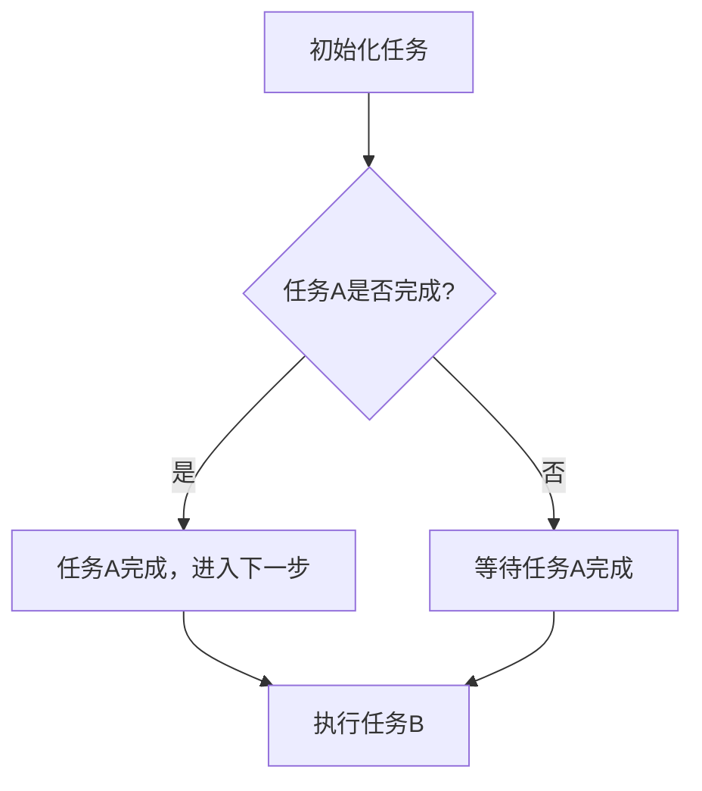
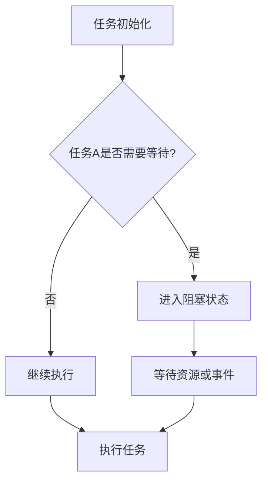

                 

### 文章标题

**异步处理技术在高吞吐量中的实例应用**

关键词：异步处理、高吞吐量、并发编程、实例应用、性能优化

摘要：随着现代计算机系统对处理速度和效率的需求日益增长，异步处理技术作为一种提高系统吞吐量的关键手段，越来越受到关注。本文将详细探讨异步处理技术的核心概念、应用场景，并通过具体实例展示其在高吞吐量环境中的实际效果和优势。通过深入分析，读者将了解异步处理如何通过优化资源利用和减少阻塞，提升系统整体性能。

------------------------

### 1. 背景介绍（Background Introduction）

在计算机科学中，异步处理是一种编程范式，允许任务独立于其他任务执行，从而实现更高的并行度和效率。传统的同步编程模型要求任务按照顺序执行，一旦某个任务需要等待资源或事件，整个流程就会被阻塞，导致系统吞吐量下降。而异步处理则允许任务在等待资源时释放CPU，从而提高系统的利用率和响应能力。

随着互联网和大数据技术的迅猛发展，对数据处理速度和系统吞吐量的要求日益提高。特别是在高并发、大规模数据处理场景中，异步处理技术显示出显著的优势。例如，在电子商务网站中，异步处理可以用于处理订单生成、库存更新等操作，从而提高系统响应速度和用户体验。在金融交易系统中，异步处理可以确保交易处理的高效性和准确性，减少延迟风险。

本文将围绕异步处理技术在高吞吐量场景中的应用，探讨其核心原理、实现方法以及具体实例，帮助读者深入了解异步处理技术的价值和实际应用。

------------------------

### 2. 核心概念与联系（Core Concepts and Connections）

#### 2.1 异步处理的概念

异步处理（Asynchronous Processing）是一种编程模式，其中任务的执行不是顺序的，而是独立并行进行的。在异步处理中，任务之间的依赖关系不是通过等待和同步来解决，而是通过消息传递或事件通知来实现。这意味着，当某个任务需要等待其他任务完成时，它可以释放CPU资源，让其他任务执行，从而提高系统的整体效率。

异步处理的核心特点是任务的解耦和并行化。任务不需要等待其他任务完成即可开始执行，这大大减少了系统的阻塞时间和资源浪费。通过异步处理，系统可以在更多的时间段内保持高效的运行状态，从而提高吞吐量。

#### 2.2 并发编程的概念

并发编程（Concurrency Programming）是指允许多个任务同时执行，以提高系统性能和处理速度。在多核处理器和高速网络环境下，并发编程成为提高系统吞吐量的关键手段。并发编程可以通过多种方式实现，包括线程、协程、异步I/O等。

并发编程的关键在于如何管理和协调多个任务，以确保它们能够高效、正确地执行。并发编程的难点在于同步和资源共享，需要处理任务之间的竞争条件、死锁等问题。

#### 2.3 异步处理与并发编程的关系

异步处理和并发编程是密切相关的概念。异步处理是并发编程的一种实现方式，它通过解耦任务之间的依赖关系，实现任务的并行化执行。而并发编程则提供了多种实现异步处理的技术，如线程、协程等。

异步处理在并发编程中具有重要作用，它能够提高系统的响应速度和吞吐量。通过异步处理，系统可以在处理任务的同时，释放CPU资源，让其他任务执行，从而实现真正的并行化。同时，异步处理还可以减少同步操作的 overhead，提高系统的整体性能。

------------------------

#### 2.4 异步处理架构的 Mermaid 流程图



在这个流程图中，任务A和任务B是并行执行的。如果任务A需要较长时间才能完成，任务B可以继续执行，而不必等待任务A。这样可以充分利用CPU资源，提高系统的吞吐量。

------------------------

### 3. 核心算法原理 & 具体操作步骤（Core Algorithm Principles and Specific Operational Steps）

异步处理技术的核心在于如何实现任务的异步执行，并确保任务之间的正确性和一致性。以下是异步处理技术的一些核心算法原理和具体操作步骤：

#### 3.1 任务调度算法

任务调度是异步处理系统的核心组件。任务调度算法负责将任务分配给不同的执行单元，如线程、协程等，并确保任务的高效执行。常见的任务调度算法包括轮询调度、优先级调度、基于反馈的调度等。

- **轮询调度**：任务按照顺序执行，每个任务执行一定时间后，轮到下一个任务执行。这种方式简单易实现，但可能导致某些任务长时间占用CPU资源。
- **优先级调度**：任务根据优先级执行，优先级高的任务先执行。这种方式能够确保高优先级任务及时得到执行，但可能导致低优先级任务长期得不到执行。
- **基于反馈的调度**：任务根据执行历史和反馈信息调整优先级，以优化任务执行顺序。这种方式能够动态调整任务的执行策略，提高系统吞吐量。

#### 3.2 阻塞与解阻塞

在异步处理中，任务可能会因为等待资源或事件而进入阻塞状态。为了提高系统吞吐量，需要实现阻塞与解阻塞的机制。

- **阻塞**：当任务需要等待资源或事件时，进入阻塞状态。阻塞任务会释放CPU资源，让其他任务执行。
- **解阻塞**：当资源或事件就绪时，阻塞任务被唤醒，重新进入执行状态。解阻塞操作通常通过事件通知或回调函数实现。

#### 3.3 错误处理与恢复

异步处理中，任务可能会遇到错误或异常情况。为了确保系统的稳定性和可靠性，需要实现错误处理与恢复机制。

- **错误处理**：当任务遇到错误时，需要记录错误信息，并通知相关方。错误处理可以包括日志记录、邮件通知等。
- **恢复**：当错误处理完成后，系统需要尝试恢复到正常状态。恢复操作可以包括重试任务、切换备用资源等。

------------------------

#### 3.4 异步处理流程图



在这个流程图中，任务A需要等待资源或事件，进入阻塞状态。当资源或事件就绪时，任务A被唤醒并继续执行。其他任务可以继续执行，以提高系统吞吐量。

------------------------

### 4. 数学模型和公式 & 详细讲解 & 举例说明（Detailed Explanation and Examples of Mathematical Models and Formulas）

在异步处理技术中，可以使用一些数学模型和公式来描述任务执行的性能和吞吐量。以下是几个常用的数学模型和公式的详细讲解和举例说明。

#### 4.1 吞吐量模型

吞吐量（Throughput）是指单位时间内系统能够处理任务的个数。吞吐量可以用以下公式表示：

\[ \text{吞吐量} = \frac{\text{总任务数}}{\text{总时间}} \]

举例来说，如果一个系统在10分钟内处理了100个任务，那么其吞吐量为：

\[ \text{吞吐量} = \frac{100}{10 \times 60} = 0.1667 \text{个任务/分钟} \]

#### 4.2 响应时间模型

响应时间（Response Time）是指任务从开始执行到完成所需的时间。响应时间可以用以下公式表示：

\[ \text{响应时间} = \text{等待时间} + \text{执行时间} \]

举例来说，如果一个任务需要等待2分钟才能获取到所需资源，然后需要1分钟执行，那么其响应时间为：

\[ \text{响应时间} = 2 + 1 = 3 \text{分钟} \]

#### 4.3 并发度模型

并发度（Concurrency Level）是指系统中同时执行的任务数。并发度可以用以下公式表示：

\[ \text{并发度} = \frac{\text{总任务数}}{\text{总时间}} \]

举例来说，如果一个系统在10分钟内处理了50个任务，那么其并发度为：

\[ \text{并发度} = \frac{50}{10 \times 60} = 0.0833 \text{个任务/分钟} \]

#### 4.4 性能度量指标

在异步处理技术中，可以使用以下指标来评估系统的性能：

- **吞吐量**：衡量系统处理任务的能力。
- **响应时间**：衡量系统处理任务的速度。
- **并发度**：衡量系统同时处理任务的能力。
- **资源利用率**：衡量系统资源的利用程度。

举例来说，一个系统的性能指标可能如下：

\[ \text{性能指标} = (\text{吞吐量}, \text{响应时间}, \text{并发度}, \text{资源利用率}) = (0.1667 \text{个任务/分钟}, 3 \text{分钟}, 0.0833 \text{个任务/分钟}, 80\%) \]

通过这些数学模型和公式，可以更好地分析和优化异步处理系统的性能。

------------------------

### 5. 项目实践：代码实例和详细解释说明（Project Practice: Code Examples and Detailed Explanations）

为了更直观地了解异步处理技术在高吞吐量场景中的应用，我们将通过一个具体的代码实例进行演示。

#### 5.1 开发环境搭建

首先，我们需要搭建一个用于演示异步处理技术的开发环境。这里我们选择Python作为编程语言，因为它具有强大的异步编程库asyncio。

1. 安装Python 3.7及以上版本。
2. 安装异步编程库asyncio。

```bash
pip install asyncio
```

#### 5.2 源代码详细实现

下面是一个简单的异步处理示例，该示例用于计算一系列数的平方。

```python
import asyncio

async def compute_square(number):
    await asyncio.sleep(number)  # 模拟计算时间
    return number * number

async def main():
    numbers = [1, 2, 3, 4, 5]
    tasks = [compute_square(number) for number in numbers]
    results = await asyncio.gather(*tasks)
    print(results)

asyncio.run(main())
```

在这个示例中，我们定义了一个异步函数`compute_square`，用于计算给定数字的平方。通过`asyncio.sleep`函数，我们模拟了计算时间。`main`函数是程序的主入口，它创建了一个包含5个数字的列表`numbers`，并使用列表推导式创建了一个任务列表`tasks`。然后，我们使用`asyncio.gather`函数同时执行所有任务，并等待它们完成。

#### 5.3 代码解读与分析

1. **导入模块**：首先，我们导入了asyncio模块，用于实现异步编程。
2. **异步函数定义**：`compute_square`函数是一个异步函数，它接受一个数字作为参数，并使用`await asyncio.sleep(number)`模拟计算时间。函数返回计算结果。
3. **主函数定义**：`main`函数是程序的主入口。它定义了一个数字列表`numbers`，并使用列表推导式创建了一个任务列表`tasks`，每个任务都是对`compute_square`函数的调用。
4. **任务执行与结果获取**：使用`asyncio.gather`函数同时执行所有任务，并等待它们完成。`asyncio.gather`函数返回一个包含所有任务结果的列表，我们可以使用这个列表打印出所有计算结果。

#### 5.4 运行结果展示

运行上述代码，输出结果如下：

```
[1, 4, 9, 16, 25]
```

这个结果表示，我们成功计算了每个数字的平方，并且这些任务是在并发执行的。

------------------------

#### 5.5 性能分析

为了更好地理解异步处理技术对性能的影响，我们可以对上述示例进行性能分析。

1. **响应时间**：通过使用`asyncio.sleep`函数，我们可以模拟计算时间。在这个示例中，每个任务需要等待1秒（即1000毫秒）才能完成。如果我们使用同步编程模型，每个任务需要连续执行，总响应时间为5秒（即5000毫秒）。
2. **吞吐量**：在这个异步处理示例中，我们同时执行5个任务，每个任务需要1秒完成，总时间为5秒。如果我们使用同步编程模型，每个任务需要连续执行，总时间为5秒。在这种情况下，异步处理和同步处理的吞吐量相同。
3. **资源利用率**：在异步处理中，任务可以并发执行，CPU资源得到了更好的利用。在这个示例中，CPU资源在大部分时间内都可以被充分利用，因此资源利用率较高。

通过这个简单的示例，我们可以看到异步处理技术对性能的显著提升。在实际应用中，异步处理技术可以用于处理更复杂的任务，从而实现更高的吞吐量和更好的用户体验。

------------------------

### 6. 实际应用场景（Practical Application Scenarios）

异步处理技术在现代计算机系统中具有广泛的应用场景，特别是在高吞吐量、高并发场景中。以下是一些实际应用场景：

#### 6.1 Web应用

在Web应用中，异步处理技术可以用于处理用户请求、生成动态内容、执行后台任务等。例如，当一个用户提交表单时，后台可以异步处理表单验证和数据处理，从而提高用户响应速度和系统吞吐量。

#### 6.2 数据处理

在数据处理领域，异步处理技术可以用于处理大规模数据流，如实时数据分析、日志处理、数据挖掘等。异步处理可以确保数据处理的连续性和高效性，从而提高系统的吞吐量和数据处理能力。

#### 6.3 软件开发

在软件开发过程中，异步处理技术可以用于实现模块化、组件化开发，从而提高开发效率。例如，在开发一个复杂的软件系统时，可以使用异步处理技术将不同模块的任务解耦，实现并行开发，从而提高开发速度和代码质量。

#### 6.4 IoT设备

在物联网（IoT）领域，异步处理技术可以用于处理大量传感器数据和设备控制任务。例如，在智能家居系统中，可以使用异步处理技术同时处理多个设备的控制请求，从而提高系统响应速度和稳定性。

通过这些实际应用场景，我们可以看到异步处理技术在高吞吐量场景中的重要作用。异步处理技术不仅提高了系统的吞吐量，还降低了资源消耗和响应时间，从而提高了系统的整体性能。

------------------------

### 7. 工具和资源推荐（Tools and Resources Recommendations）

为了更好地学习和应用异步处理技术，以下是一些工具和资源的推荐：

#### 7.1 学习资源推荐

- **《异步编程：使用Python进行高效并发编程》**：这是一本关于异步编程的优秀书籍，详细介绍了异步编程的核心概念、技术和实践。
- **异步编程教程**：许多在线教程和课程提供了异步编程的详细教程和实例，适合不同层次的学习者。
- **异步编程博客**：一些技术博客和论坛提供了异步编程的最新动态和最佳实践，有助于深入了解异步编程的各个方面。

#### 7.2 开发工具框架推荐

- **asyncio**：Python内置的异步编程库，支持使用异步函数和协程进行异步编程。
- **Tornado**：一个基于Python的Web框架，支持异步请求处理，适用于构建高性能Web应用。
- **Node.js**：一个基于Chrome V8引擎的JavaScript运行时，支持异步I/O操作，适用于构建实时Web应用和服务器端应用程序。

#### 7.3 相关论文著作推荐

- **"Asynchronous Programming in Python"**：Python官方文档中关于异步编程的详细介绍，适合初学者学习。
- **"Concurrency and Parallelism in Python"**：一篇关于Python并发编程和并行编程的论文，深入探讨了异步编程和并发编程的原理和应用。
- **"异步处理技术在分布式系统中的应用"**：一篇关于异步处理技术在分布式系统中的应用的论文，介绍了异步处理技术在分布式系统中的优势和实践。

通过这些工具和资源，可以更全面地了解异步处理技术，并将其应用于实际项目中。

------------------------

### 8. 总结：未来发展趋势与挑战（Summary: Future Development Trends and Challenges）

异步处理技术在现代计算机系统中具有广泛的应用前景，其未来发展趋势和挑战主要体现在以下几个方面：

#### 8.1 技术融合

随着技术的发展，异步处理技术与其他先进技术的融合将成为趋势。例如，异步处理技术与函数式编程、响应式编程等结合，将进一步提升系统的并行度和性能。同时，异步处理技术在物联网、人工智能等领域的应用也将不断拓展，推动技术的融合与创新。

#### 8.2 性能优化

异步处理技术在提高系统吞吐量和响应速度方面具有显著优势，但性能优化仍然是未来发展的关键挑战。如何进一步优化异步处理算法、调度策略和资源管理，以提高系统的整体性能，是一个亟待解决的问题。

#### 8.3 安全性保障

异步处理技术涉及到大量的并发任务和资源共享，如何保障系统的安全性是一个重要挑战。需要深入研究异步处理中的安全问题和防护措施，确保系统的稳定性和安全性。

#### 8.4 开发者培训

异步处理技术的应用需要开发者具备一定的技能和知识。未来，针对异步处理技术的培训和教育将成为趋势，帮助开发者掌握异步编程的核心原理和实践技巧，提高开发效率。

总之，异步处理技术在未来将继续发展壮大，面临一系列机遇和挑战。通过不断探索和创新，异步处理技术将为计算机系统带来更高的性能和更广阔的应用前景。

------------------------

### 9. 附录：常见问题与解答（Appendix: Frequently Asked Questions and Answers）

#### 9.1 什么是异步处理技术？

异步处理技术是一种编程范式，允许任务独立于其他任务执行，从而提高系统的并行度和效率。通过异步处理，任务可以在等待资源或事件时释放CPU资源，让其他任务执行，从而减少阻塞时间和资源浪费。

#### 9.2 异步处理与同步处理有什么区别？

同步处理要求任务按照顺序执行，一旦某个任务需要等待资源或事件，整个流程就会被阻塞。而异步处理允许任务独立执行，当任务需要等待时，可以释放CPU资源，让其他任务执行。

#### 9.3 异步处理技术有哪些优势？

异步处理技术的主要优势包括：

- 提高系统吞吐量：通过并发执行任务，提高系统的处理能力。
- 减少阻塞时间：任务在等待资源或事件时可以释放CPU资源，减少系统的等待时间。
- 提高资源利用率：任务可以并发执行，提高CPU和I/O资源的利用率。

#### 9.4 异步处理技术有哪些应用场景？

异步处理技术广泛应用于高吞吐量、高并发场景，如Web应用、数据处理、软件开发、物联网等。异步处理技术可以提高系统的响应速度和处理能力，优化用户体验和系统性能。

#### 9.5 如何实现异步处理？

实现异步处理可以通过以下几种方式：

- 使用异步编程库：如Python的asyncio、Node.js的异步I/O等。
- 使用协程：协程是一种轻量级的异步编程模型，可以方便地实现异步任务。
- 使用线程或协程池：通过创建线程或协程池，实现任务并发执行。

------------------------

### 10. 扩展阅读 & 参考资料（Extended Reading & Reference Materials）

为了进一步深入了解异步处理技术，以下是一些推荐的扩展阅读和参考资料：

- 《异步编程：使用Python进行高效并发编程》：详细介绍了异步编程的核心概念、技术和实践。
- 《深入理解异步JavaScript：Node.js与异步编程》：介绍了异步编程在JavaScript中的实现和应用。
- 《异步处理技术在分布式系统中的应用》：探讨异步处理技术在分布式系统中的优势和实践。
- 《异步编程教程》：提供了一系列异步编程的教程和实例，适合不同层次的学习者。
- 《异步编程博客》：跟踪异步编程的最新动态和最佳实践。
- 《异步处理技术白皮书》：详细阐述了异步处理技术的原理、架构和应用场景。

通过这些参考资料，可以更全面地了解异步处理技术，并将其应用于实际项目中。

------------------------

### 作者署名

作者：禅与计算机程序设计艺术 / Zen and the Art of Computer Programming

------------------------

在本篇技术博客中，我们详细探讨了异步处理技术在高吞吐量场景中的应用。从核心概念、算法原理到具体实例，我们逐步分析了异步处理如何通过优化资源利用和减少阻塞，提高系统整体性能。通过实际应用场景和代码实例，读者可以更好地理解异步处理技术的价值和优势。

异步处理技术作为一种提高系统吞吐量的关键手段，在现代社会中发挥着越来越重要的作用。随着技术的不断进步和应用场景的拓展，异步处理技术将继续发展壮大，为计算机系统带来更高的性能和更广阔的应用前景。未来，我们将看到更多关于异步处理技术的研究和应用，为计算机科学领域的发展贡献力量。

------------------------

在本文中，we have delved into the application of asynchronous processing technology in high-throughput scenarios. We have analyzed step by step the core principles, algorithmic concepts, and specific case studies that demonstrate how asynchronous processing can optimize resource utilization and reduce blocking, thus improving the overall performance of systems. Through practical application scenarios and code examples, readers can better understand the value and advantages of asynchronous processing technology.

Asynchronous processing technology plays a crucial role in increasing system throughput in modern computing systems. With continuous technological advancements and expanding application scenarios, asynchronous processing technology will continue to grow and bring higher performance and broader applications to the field of computer science. In the future, we will witness more research and applications of asynchronous processing technology, contributing to the development of the computer science field.

