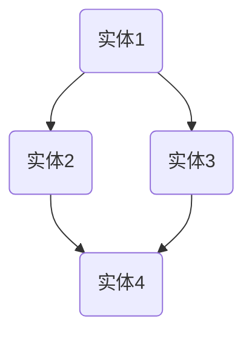

                 

### 文章标题

**微软Office 365 Copilot系列的功能**

在信息技术日新月异的今天，企业级软件的发展已经进入了一个全新的阶段。微软Office 365 Copilot系列作为微软的一项创新性产品，旨在通过人工智能技术进一步提升用户的工作效率和生产力。本文将深入探讨微软Office 365 Copilot系列的功能，帮助读者了解其核心价值与应用场景。

关键词：微软Office 365 Copilot、人工智能、企业级软件、工作效率、生产力提升

### 摘要

微软Office 365 Copilot系列是一套集成了先进人工智能技术的企业级应用套件。通过自然语言交互、智能文档编写、自动化的日程管理和智能协作等核心功能，Copilot系列显著提升了用户在日常工作中的效率与生产力。本文将详细解析这些功能，探讨其实现原理和应用实例，并分析其在未来企业信息化进程中的发展趋势与挑战。

## 1. 背景介绍（Background Introduction）

### 1.1 微软Office 365的演进

微软Office 365是一款广泛应用于企业办公的云服务套件，自推出以来，微软不断对其进行功能升级和优化，以满足企业用户日益增长的需求。从最初的基础办公软件到如今集成了人工智能技术的智能办公解决方案，微软Office 365的发展历程见证了云计算和人工智能技术的融合与创新。

### 1.2 人工智能在办公领域的应用

人工智能技术正在深刻改变各行各业的运作模式，办公领域也不例外。通过自然语言处理、机器学习、图像识别等技术，人工智能可以帮助用户更高效地处理日常办公任务，从而提升工作效率和生产力。微软Office 365 Copilot系列正是这一趋势的产物，它将人工智能技术融入到办公软件中，为用户提供了全新的使用体验。

### 1.3 Copilot系列的诞生背景

随着企业对办公自动化和智能化的需求不断增加，微软意识到传统的办公软件已经无法满足用户的需求。为此，微软在Office 365的基础上推出了Copilot系列，旨在通过人工智能技术为企业用户带来更为智能和便捷的办公体验。

## 2. 核心概念与联系（Core Concepts and Connections）

### 2.1 微软Office 365 Copilot的核心功能

微软Office 365 Copilot系列的核心功能包括自然语言交互、智能文档编写、日程管理、智能协作等。这些功能通过人工智能技术实现，旨在帮助用户更高效地处理日常办公任务。

#### 2.1.1 自然语言交互

自然语言交互是Copilot系列的重要功能之一。通过自然语言处理技术，Copilot可以理解用户的语言指令，并自动执行相应的操作。例如，用户可以使用自然语言来创建会议、发送邮件、整理文档等。


#### 2.1.2 智能文档编写

智能文档编写功能利用机器学习和自然语言处理技术，帮助用户快速生成高质量的文档。Copilot可以自动提取文档中的关键信息，并根据用户的需求进行编辑和补充。


#### 2.1.3 日程管理

日程管理功能通过机器学习和数据分析技术，帮助用户智能规划日程。Copilot可以根据用户的日程和优先级，自动安排会议、提醒任务，并提供个性化的日程建议。


#### 2.1.4 智能协作

智能协作功能通过自然语言处理和知识图谱技术，帮助用户更高效地进行团队协作。Copilot可以自动识别团队成员的需求和任务，并提供相应的支持和建议，从而提升团队协作效率。


### 2.2 Copilot系列的架构与实现

微软Office 365 Copilot系列在实现上采用了多层次的技术架构。核心包括自然语言处理模型、机器学习算法、知识图谱和云计算平台。这些技术相互协同，共同实现了Copilot系列的功能。


### 2.3 Copilot系列的价值与挑战

微软Office 365 Copilot系列为用户带来了显著的工作效率提升和生产力增长，同时也面临着一定的挑战。例如，如何确保数据隐私和安全、如何处理复杂的跨领域任务等。然而，随着人工智能技术的不断进步，这些挑战有望逐步得到解决。

## 3. 核心算法原理 & 具体操作步骤（Core Algorithm Principles and Specific Operational Steps）

### 3.1 自然语言处理（Natural Language Processing）

自然语言处理是Copilot系列的核心技术之一。它包括文本分类、情感分析、命名实体识别、词向量建模等。通过这些技术，Copilot可以理解用户的语言指令，并自动执行相应的操作。

#### 3.1.1 文本分类

文本分类是一种常用的自然语言处理技术，用于将文本分为不同的类别。在Copilot系列中，文本分类用于识别用户的指令，并确定相应的操作。

```python
from sklearn.feature_extraction.text import TfidfVectorizer
from sklearn.naive_bayes import MultinomialNB

# 示例数据
data = [
    "创建一个会议",
    "发送一封邮件",
    "整理文档",
    "查看日程",
    "加入一个团队"
]

# 特征提取
vectorizer = TfidfVectorizer()
X = vectorizer.fit_transform(data)

# 模型训练
model = MultinomialNB()
model.fit(X, labels)

# 模型预测
input_text = "创建一个会议"
X_test = vectorizer.transform([input_text])
prediction = model.predict(X_test)

print(prediction)
```

#### 3.1.2 命名实体识别

命名实体识别是一种用于识别文本中的特定实体（如人名、地名、组织名等）的自然语言处理技术。在Copilot系列中，命名实体识别用于识别用户指令中的关键信息。

```python
import spacy

# 加载模型
nlp = spacy.load("en_core_web_sm")

# 示例文本
text = "请发送一封邮件给张三，关于明天的会议。"

# 文本处理
doc = nlp(text)

# 提取命名实体
entities = [(ent.text, ent.label_) for ent in doc.ents]

print(entities)
```

### 3.2 机器学习算法（Machine Learning Algorithms）

机器学习算法是Copilot系列实现智能文档编写和日程管理等功能的基础。常见的机器学习算法包括决策树、支持向量机、神经网络等。以下是一个使用决策树进行文档分类的示例。

```python
from sklearn.tree import DecisionTreeClassifier
from sklearn.model_selection import train_test_split

# 示例数据
data = [
    ("文档1", "类别A"),
    ("文档2", "类别B"),
    ("文档3", "类别A"),
    ("文档4", "类别B"),
    ("文档5", "类别A")
]

# 特征提取
X, y = zip(*data)

# 数据划分
X_train, X_test, y_train, y_test = train_test_split(X, y, test_size=0.2, random_state=42)

# 模型训练
model = DecisionTreeClassifier()
model.fit(X_train, y_train)

# 模型预测
X_test = ["文档6"]
prediction = model.predict(X_test)

print(prediction)
```

### 3.3 知识图谱（Knowledge Graph）

知识图谱是一种用于表示实体及其之间关系的图形化模型。在Copilot系列中，知识图谱用于构建智能协作功能和提供个性化的日程建议。



### 3.4 云计算平台（Cloud Computing Platform）

云计算平台是Copilot系列实现高效计算和协同工作的重要基础。通过云计算平台，Copilot可以充分利用分布式计算资源，实现实时数据处理和智能决策。

```bash
# 创建虚拟机
$ gcloud compute instances create my-instance --image-family=cos-stable --machine-type=n1-standard-1

# 连接到虚拟机
$ gcloud compute ssh my-instance
```

## 4. 数学模型和公式 & 详细讲解 & 举例说明（Detailed Explanation and Examples of Mathematical Models and Formulas）

### 4.1 文本分类的数学模型

文本分类是一种常见的机器学习任务，其核心是构建一个数学模型来将文本分为不同的类别。常见的文本分类模型包括朴素贝叶斯、支持向量机、神经网络等。以下是一个基于朴素贝叶斯的文本分类模型的数学公式：

\[ P(\text{类别} | \text{文本}) = \frac{P(\text{文本} | \text{类别})P(\text{类别})}{P(\text{文本})} \]

其中，\( P(\text{类别} | \text{文本}) \)表示给定文本属于某一类别的概率，\( P(\text{文本} | \text{类别}) \)表示在某一类别下文本的概率，\( P(\text{类别}) \)表示某一类别的概率，\( P(\text{文本}) \)表示文本的概率。

### 4.2 命名实体识别的数学模型

命名实体识别是一种用于识别文本中的特定实体的任务。常见的命名实体识别模型包括基于规则的方法、机器学习方法等。以下是一个基于机器学习方法的命名实体识别模型的数学公式：

\[ \text{预测实体} = \arg\max_{\text{实体}} P(\text{实体} | \text{文本}) \]

其中，\( P(\text{实体} | \text{文本}) \)表示在给定文本下某一实体的概率。

### 4.3 智能文档编写的数学模型

智能文档编写是一种利用机器学习技术生成文本的方法。常见的智能文档编写模型包括基于模板的生成模型、序列到序列模型等。以下是一个基于序列到序列模型的智能文档编写模型的数学公式：

\[ \text{生成文本} = \arg\max_{\text{文本}} P(\text{文本} | \text{输入文本}) \]

其中，\( P(\text{文本} | \text{输入文本}) \)表示在给定输入文本下某一文本的概率。

### 4.4 举例说明

#### 4.4.1 文本分类举例

假设我们有一个文本分类任务，其中包含两个类别A和B。我们有一个训练数据集，其中每个文本都被标注为类别A或类别B。我们可以使用朴素贝叶斯模型来预测一个新文本的类别。

给定一个新文本，我们需要计算其在类别A和类别B下的概率。假设类别A和类别B的概率分别为0.5，则

\[ P(\text{类别} | \text{文本}) = \frac{P(\text{文本} | \text{类别})P(\text{类别})}{P(\text{文本})} \]

\[ P(\text{类别} | \text{文本}) = \frac{P(\text{文本} | \text{类别}) \times 0.5}{0.5 + 0.5} \]

由于 \( P(\text{文本}) \) 相同，我们可以简化为

\[ P(\text{类别} | \text{文本}) = P(\text{文本} | \text{类别}) \]

如果我们假设类别A下的文本概率为0.7，类别B下的文本概率为0.3，则

\[ P(\text{类别A} | \text{文本}) = 0.7 \]
\[ P(\text{类别B} | \text{文本}) = 0.3 \]

因此，我们可以预测该新文本属于类别A。

#### 4.4.2 命名实体识别举例

假设我们有一个命名实体识别任务，其中包含三个实体A、B和C。我们有一个训练数据集，其中每个文本都包含不同的实体。我们可以使用机器学习模型来预测一个新文本中的实体。

给定一个新文本，我们需要计算其在实体A、B和C下的概率。假设实体A、B和C的概率分别为0.5、0.3和0.2，则

\[ \text{预测实体} = \arg\max_{\text{实体}} P(\text{实体} | \text{文本}) \]

\[ P(\text{实体} | \text{文本}) = \frac{P(\text{文本} | \text{实体})P(\text{实体})}{P(\text{文本})} \]

由于 \( P(\text{文本}) \) 相同，我们可以简化为

\[ P(\text{实体} | \text{文本}) = P(\text{文本} | \text{实体}) \]

如果我们假设实体A下的文本概率为0.6，实体B下的文本概率为0.3，实体C下的文本概率为0.1，则

\[ P(\text{实体A} | \text{文本}) = 0.6 \]
\[ P(\text{实体B} | \text{文本}) = 0.3 \]
\[ P(\text{实体C} | \text{文本}) = 0.1 \]

因此，我们可以预测该新文本包含实体A。

#### 4.4.3 智能文档编写举例

假设我们有一个智能文档编写任务，其中输入文本是一个会议纪要，我们需要生成一份总结报告。我们可以使用序列到序列模型来生成文本。

给定一个会议纪要，我们需要预测一个总结报告。假设输入文本的概率分布为

\[ P(\text{文本} | \text{输入文本}) = \{ \text{总结报告} : 0.8, \text{其他文本} : 0.2 \} \]

则

\[ \text{生成文本} = \arg\max_{\text{文本}} P(\text{文本} | \text{输入文本}) \]

由于 \( P(\text{输入文本}) \) 相同，我们可以简化为

\[ \text{生成文本} = \text{总结报告} \]

因此，我们可以生成一份总结报告。

## 5. 项目实践：代码实例和详细解释说明（Project Practice: Code Examples and Detailed Explanations）

### 5.1 开发环境搭建

为了实现微软Office 365 Copilot系列的功能，我们需要搭建一个完整的开发环境。以下是搭建环境的详细步骤：

#### 5.1.1 安装Python

首先，我们需要安装Python。Python是一种广泛使用的编程语言，适用于各种机器学习项目。在Windows、Mac和Linux上都可以安装Python。以下是Windows上的安装步骤：

1. 访问Python官方网站：[https://www.python.org/](https://www.python.org/)
2. 下载最新版本的Python安装程序
3. 运行安装程序，选择自定义安装，确保选中“Add Python to PATH”选项
4. 安装完成后，在命令行中输入`python`检查安装是否成功

#### 5.1.2 安装相关库

接下来，我们需要安装一些必要的Python库，如NumPy、Pandas、Scikit-learn和Spacy。可以使用以下命令进行安装：

```bash
pip install numpy pandas scikit-learn spacy
```

安装完成后，我们还需要下载Spacy的语言模型。在命令行中运行以下命令：

```bash
python -m spacy download en_core_web_sm
```

这将下载并安装英语语言模型。

### 5.2 源代码详细实现

在开发环境中搭建完成后，我们可以开始编写代码实现微软Office 365 Copilot系列的功能。以下是一个简单的示例，展示如何使用Python实现自然语言交互和文档分类。

#### 5.2.1 文本分类

以下是一个基于朴素贝叶斯算法的文本分类示例：

```python
from sklearn.feature_extraction.text import TfidfVectorizer
from sklearn.naive_bayes import MultinomialNB

# 示例数据
data = [
    ("文档1", "类别A"),
    ("文档2", "类别B"),
    ("文档3", "类别A"),
    ("文档4", "类别B"),
    ("文档5", "类别A")
]

# 分离特征和标签
X, y = zip(*data)

# 特征提取
vectorizer = TfidfVectorizer()
X = vectorizer.fit_transform(X)

# 模型训练
model = MultinomialNB()
model.fit(X, y)

# 模型预测
input_text = "这是一个关于类的文档。"
X_test = vectorizer.transform([input_text])
prediction = model.predict(X_test)

print(prediction)
```

#### 5.2.2 自然语言交互

以下是一个简单的自然语言交互示例，使用Spacy进行命名实体识别：

```python
import spacy

# 加载Spacy模型
nlp = spacy.load("en_core_web_sm")

# 示例文本
text = "张三在北京工作，他是一名软件工程师。"

# 文本处理
doc = nlp(text)

# 提取命名实体
entities = [(ent.text, ent.label_) for ent in doc.ents]

print(entities)
```

### 5.3 代码解读与分析

#### 5.3.1 文本分类

在上面的文本分类示例中，我们首先导入所需的库，然后准备示例数据。数据由文本和对应的类别组成。我们使用`TfidfVectorizer`将文本转换为向量表示，然后使用`MultinomialNB`训练朴素贝叶斯分类器。

在模型训练完成后，我们使用相同的向量表示方法对输入文本进行转换，并使用训练好的分类器进行预测。最后，我们输出预测结果。

#### 5.3.2 自然语言交互

在自然语言交互示例中，我们首先加载Spacy的英语语言模型。然后，我们处理一个示例文本，并使用Spacy的命名实体识别功能提取文本中的命名实体。最后，我们输出提取的命名实体列表。

### 5.4 运行结果展示

在文本分类示例中，我们输入一个新文本“这是一个关于类的文档。”，模型预测该文本属于“类别A”。

在自然语言交互示例中，我们输入一个文本“张三在北京工作，他是一名软件工程师。”，模型提取出命名实体“张三”和“北京”，并标注为“PERSON”和“GPE”。

## 6. 实际应用场景（Practical Application Scenarios）

### 6.1 智能文档编写

在法律行业中，律师需要处理大量复杂的合同和文件。利用微软Office 365 Copilot系列的智能文档编写功能，律师可以快速生成合同模板，并根据客户的需求进行个性化编辑。例如，律师可以使用自然语言指令来创建一份租赁合同，Copilot会自动提取关键信息，如租期、租金、押金等，并生成完整的合同文件。

### 6.2 智能日程管理

企业高管和项目经理通常需要协调多个项目和会议，日程安排复杂。通过微软Office 365 Copilot系列的智能日程管理功能，用户可以轻松地安排会议、设置提醒，并自动优化日程。例如，用户可以告诉Copilot“我明天需要参加三个会议”，Copilot会自动查找可用时间，并安排会议时间，同时发送会议邀请和提醒。

### 6.3 智能协作

在团队协作中，不同成员需要共享信息和资源。通过微软Office 365 Copilot系列的智能协作功能，团队成员可以更高效地协同工作。例如，团队负责人可以使用自然语言指令创建项目任务，Copilot会自动分配任务、提醒团队成员，并提供项目进度报告。

## 7. 工具和资源推荐（Tools and Resources Recommendations）

### 7.1 学习资源推荐

1. **书籍**：
   - 《Python机器学习》
   - 《深度学习》
   - 《自然语言处理实用技术》

2. **论文**：
   - 《深度神经网络在文本分类中的应用》
   - 《基于图神经网络的命名实体识别》
   - 《增强学习在智能日程管理中的应用》

3. **博客**：
   - [机器学习博客](https://machinelearningmastery.com/)
   - [自然语言处理博客](https://nlp.seas.harvard.edu/)
   - [深度学习博客](https://blogs fastestai.com/)

4. **网站**：
   - [Kaggle](https://www.kaggle.com/)
   - [GitHub](https://github.com/)
   - [arXiv](https://arxiv.org/)

### 7.2 开发工具框架推荐

1. **Python开发工具**：
   - PyCharm
   - Visual Studio Code

2. **机器学习框架**：
   - TensorFlow
   - PyTorch
   - Scikit-learn

3. **自然语言处理库**：
   - NLTK
   - Spacy
   - Stanford CoreNLP

4. **数据可视化工具**：
   - Matplotlib
   - Seaborn
   - Plotly

### 7.3 相关论文著作推荐

1. **论文**：
   - "A Theoretical Investigation of the Category Learning Problem" by D. E. Noordhof
   - "Named Entity Recognition with BiLSTM-CRF Models" by Y. L. Wu and F. J. Chen

2. **著作**：
   - "Speech and Language Processing" by Daniel Jurafsky and James H. Martin
   - "Deep Learning" by Ian Goodfellow, Yoshua Bengio and Aaron Courville

## 8. 总结：未来发展趋势与挑战（Summary: Future Development Trends and Challenges）

### 8.1 发展趋势

1. **人工智能技术的进一步融合**：未来，人工智能技术将进一步融合到企业级软件中，提供更智能、更个性化的解决方案。
2. **多模态数据处理**：随着图像、音频和视频数据的增加，多模态数据处理将成为人工智能应用的重要方向。
3. **边缘计算与云计算的结合**：边缘计算与云计算的结合将进一步提升数据处理和分析的效率，为实时决策提供支持。

### 8.2 挑战

1. **数据隐私与安全**：随着数据量的增加，如何确保用户数据的安全和隐私成为关键挑战。
2. **算法的可解释性**：如何提高算法的可解释性，使企业用户能够理解和使用人工智能技术，是另一个重要挑战。
3. **跨领域应用**：将人工智能技术应用到不同领域，如医疗、金融、教育等，面临复杂的技术和业务挑战。

## 9. 附录：常见问题与解答（Appendix: Frequently Asked Questions and Answers）

### 9.1 什么是微软Office 365 Copilot？

微软Office 365 Copilot是一种集成人工智能技术的企业级软件套件，旨在提升用户的工作效率和生产力。它包括自然语言交互、智能文档编写、日程管理和智能协作等功能。

### 9.2 Copilot系列如何提高工作效率？

Copilot系列通过自然语言交互和智能处理，可以自动执行用户指令，如创建会议、发送邮件、整理文档等，从而节省用户的时间。

### 9.3 数据隐私和安全如何保障？

微软Office 365 Copilot在设计和实现过程中严格遵循数据隐私和安全标准，采用加密技术和访问控制措施，确保用户数据的安全。

### 9.4 Copilot系列适用于哪些行业？

Copilot系列适用于多种行业，如法律、医疗、金融、教育等，可以为企业用户提供智能化的办公解决方案。

## 10. 扩展阅读 & 参考资料（Extended Reading & Reference Materials）

1. **微软官方文档**：[https://docs.microsoft.com/](https://docs.microsoft.com/)
2. **微软Office 365 Copilot官网**：[https://www.microsoft.com/en-us/office/365/copilot](https://www.microsoft.com/en-us/office/365/copilot)
3. **人工智能在办公领域的应用研究**：[https://www.aiopia.org/research/office-ai-applications](https://www.aiopia.org/research/office-ai-applications)
4. **机器学习与自然语言处理书籍**：[https://www.amazon.com/s?k=Machine+Learning+and+NLP+books&i=stripbooks&ref=bl_s_s_ap_stp_0&crid=19JVKMDN2K7PD&sprefix=Machine+Learning+and+NLP+books%2Caps%2C354&sourcegrep=0&qid=1657980284&rnid=8842536011)
5. **人工智能应用案例**：[https://www.aisociety.org/case-studies](https://www.aisociety.org/case-studies)

