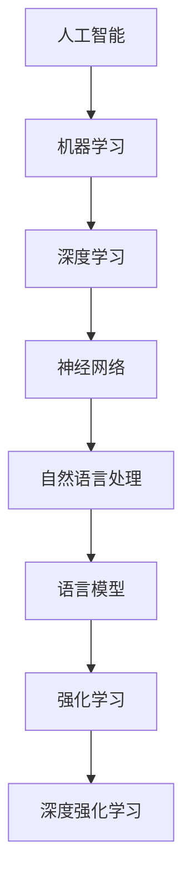

                 

### 文章标题

"找到适合自己的 AI 工具"是一篇旨在帮助读者深入了解和选择合适人工智能工具的文章。在人工智能技术迅猛发展的今天，拥有多种多样的 AI 工具成为了提升效率和实现创新的关键。本文将探讨如何根据具体需求和目标，选择最适合自己的 AI 工具，并提供实用的建议和工具推荐。

## 关键词

- AI工具
- 人工智能应用
- 个性化选择
- 技术评估
- 使用案例

### 摘要

本文首先介绍了人工智能工具的发展背景及其在各个领域的应用现状。接着，通过分析不同类型的人工智能工具，探讨了如何根据实际需求选择合适的工具。文章还提供了详细的评估方法和实用指南，包括工具的测试、性能比较和实际应用场景分析。最后，本文总结了未来人工智能工具的发展趋势和潜在挑战，并推荐了相关学习资源和开发工具。

<|user|>## 1. 背景介绍（Background Introduction）

人工智能（AI）作为计算机科学的一个分支，自20世纪50年代以来得到了迅速发展。随着计算能力的提升和海量数据的积累，AI技术在各个领域都取得了显著的进展，从早期的规则基础方法到如今的深度学习，AI已经从理论研究走向了实际应用。

在人工智能工具方面，其发展历程同样经历了多个阶段。最初，人工智能工具主要是为了解决特定的计算问题，如数学定理证明、游戏策略等。随着神经网络和机器学习算法的兴起，AI工具开始广泛应用于图像识别、自然语言处理、推荐系统等领域。近年来，随着深度学习和强化学习等技术的进一步发展，人工智能工具的多样性和复杂性都在不断增加。

### 人工智能工具的应用领域

人工智能工具在多个领域已经展现出强大的应用潜力：

1. **医疗健康**：人工智能在医疗健康领域中的应用涵盖了疾病诊断、药物研发、个性化治疗等多个方面。通过分析大量患者数据，AI工具可以帮助医生做出更准确的诊断，提高治疗的效果。

2. **金融**：在金融领域，人工智能工具被广泛应用于风险管理、信用评估、投资决策等方面。通过分析历史数据和市场趋势，AI可以提供更精准的预测和分析。

3. **零售**：人工智能在零售行业的应用包括库存管理、客户行为分析、个性化推荐等。这些工具帮助企业提高运营效率，优化客户体验。

4. **制造业**：智能制造是人工智能在制造业中的核心应用领域。通过机器视觉、自动化控制等AI技术，制造业可以实现生产过程的自动化和智能化，提高生产效率和质量。

5. **自动驾驶**：自动驾驶技术是人工智能在交通运输领域的典型应用。通过深度学习和计算机视觉等技术，自动驾驶车辆能够实现自主导航和驾驶，提高交通安全和效率。

### 当前人工智能工具的现状

目前，人工智能工具已经相当成熟，涵盖了从基础算法到复杂应用的各种类型。以下是一些常见的人工智能工具及其特点：

1. **机器学习库**：如 TensorFlow、PyTorch、Scikit-learn 等，这些库提供了丰富的算法和模型，适用于各种数据分析和机器学习任务。

2. **自然语言处理工具**：如 NLTK、spaCy、BERT 等，这些工具可以处理文本数据，进行情感分析、命名实体识别等任务。

3. **图像识别库**：如 OpenCV、TensorFlow Object Detection API、PyTorch Vision 等，这些库用于处理图像数据，进行对象检测、图像分类等任务。

4. **自动化工具**：如 TensorFlow Serving、TensorFlow Lite、ONNX Runtime 等，这些工具可以将训练好的模型部署到不同的环境中，支持实时应用。

5. **数据可视化工具**：如 Matplotlib、Seaborn、Plotly 等，这些工具可以用于数据分析和结果展示。

### 人工智能工具的重要性

人工智能工具不仅为各个行业提供了强大的技术支持，还在推动创新和变革方面发挥了重要作用。通过使用合适的AI工具，企业和组织可以更高效地处理数据，提取有价值的信息，从而做出更明智的决策。此外，AI工具的普及也为广大开发者提供了丰富的资源，使得更多的人能够参与到人工智能的开发和应用中来。

总之，人工智能工具的发展和应用已经成为现代科技的重要组成部分，了解并掌握这些工具对于企业和个人都具有重要意义。

## 2. 核心概念与联系（Core Concepts and Connections）

在深入探讨如何选择适合自己的AI工具之前，我们需要了解一些核心概念和它们之间的相互关系。以下是本文将要讨论的一些关键概念：

### 2.1 人工智能与机器学习

**人工智能（AI）** 是一个广泛的领域，它涵盖了使计算机模拟人类智能行为的各种技术和方法。人工智能可以分为两大类：弱人工智能（Narrow AI）和强人工智能（General AI）。弱人工智能专注于解决特定问题，如语音识别、图像分类等，而强人工智能则具备广泛的学习能力和智能行为。

**机器学习（Machine Learning）** 是人工智能的一个重要分支，它专注于通过数据训练模型，使计算机能够自动从数据中学习规律并做出预测。机器学习可以分为监督学习、无监督学习和强化学习等类型。

### 2.2 深度学习与神经网络

**深度学习（Deep Learning）** 是机器学习的一个子领域，它使用多层神经网络来学习和表示数据。深度学习在图像识别、语音识别和自然语言处理等领域取得了显著成果。

**神经网络（Neural Networks）** 是一种模仿生物神经系统的计算模型。一个简单的神经网络包括输入层、隐藏层和输出层。深度学习通过增加隐藏层的数量，使得神经网络能够捕捉更复杂的数据特征。

### 2.3 自然语言处理（NLP）与语言模型

**自然语言处理（Natural Language Processing，NLP）** 是人工智能的一个分支，它专注于使计算机理解和生成人类语言。NLP应用包括机器翻译、情感分析、文本分类等。

**语言模型（Language Model）** 是NLP中的一个关键组件，它用于预测下一个单词或字符。著名的语言模型包括 n-gram 模型、神经网络语言模型（如 BERT）和变压器（Transformer）模型。

### 2.4 强化学习与深度强化学习

**强化学习（Reinforcement Learning）** 是一种机器学习方法，它通过奖励机制训练模型，使其能够在特定环境中做出最优决策。强化学习在游戏、推荐系统和自动驾驶等领域有广泛应用。

**深度强化学习（Deep Reinforcement Learning）** 是将深度学习和强化学习相结合的方法，它通过神经网络来表示状态和动作空间，从而处理更复杂的问题。

### 2.5 概念图与 Mermaid 流程图

为了更直观地展示上述概念之间的关系，我们可以使用 Mermaid 流程图来绘制一个概念图。以下是一个简单的 Mermaid 流程图示例：



在这个概念图中，我们可以看到人工智能的核心分支，以及各个子领域之间的相互联系。这些核心概念和联系为我们选择适合自己的 AI 工具提供了理论基础。

## 3. 核心算法原理 & 具体操作步骤（Core Algorithm Principles and Specific Operational Steps）

在了解了核心概念和它们之间的关系后，接下来我们将深入探讨一些关键算法的原理，并介绍如何使用这些算法来解决实际问题。以下是几个重要的算法及其具体操作步骤：

### 3.1 深度学习算法

**深度学习算法** 是基于多层神经网络的结构，它通过多层非线性变换来提取和表示数据特征。以下是一个简单的深度学习算法操作步骤：

1. **数据预处理**：对输入数据进行归一化、缩放等处理，以使其适合模型的输入要求。
2. **模型构建**：使用框架（如 TensorFlow 或 PyTorch）构建神经网络模型，定义输入层、隐藏层和输出层。
3. **模型训练**：通过反向传播算法，使用训练数据对模型进行训练，更新模型参数。
4. **模型评估**：使用测试数据评估模型的性能，调整模型参数以优化性能。
5. **模型部署**：将训练好的模型部署到生产环境中，进行实时预测或决策。

### 3.2 自然语言处理算法

**自然语言处理算法** 在处理文本数据时，常使用语言模型、词向量模型等。以下是一个简单的 NLP 算法操作步骤：

1. **文本预处理**：对输入文本进行分词、去除停用词等处理，将其转换为模型可处理的格式。
2. **词向量表示**：使用 Word2Vec、GloVe 或 BERT 等模型将文本中的词语转换为向量表示。
3. **模型构建**：使用框架（如 TensorFlow 或 PyTorch）构建 NLP 模型，如情感分析、文本分类等。
4. **模型训练**：使用训练数据对模型进行训练，优化模型参数。
5. **模型评估**：使用测试数据评估模型性能，调整参数以优化性能。
6. **模型部署**：将训练好的模型部署到生产环境中，进行实时文本分析。

### 3.3 强化学习算法

**强化学习算法** 通过与环境互动来学习最优策略。以下是一个简单的强化学习算法操作步骤：

1. **环境构建**：定义强化学习环境，包括状态空间、动作空间和奖励机制。
2. **模型初始化**：初始化 Q-learning、SARSA、Deep Q-Network（DQN）等强化学习模型。
3. **模型训练**：通过与环境交互，使用经验回放、目标网络等策略优化模型参数。
4. **模型评估**：评估模型在测试环境中的性能，调整模型参数以优化性能。
5. **模型部署**：将训练好的模型部署到实际应用中，进行决策和优化。

### 3.4 深度强化学习算法

**深度强化学习算法** 结合了深度学习和强化学习的优势，用于解决更复杂的问题。以下是一个简单的深度强化学习算法操作步骤：

1. **环境构建**：定义深度强化学习环境，包括状态空间、动作空间和奖励机制。
2. **模型初始化**：初始化深度 Q-Network（DQN）、Policy Gradient、Actor-Critic 等深度强化学习模型。
3. **模型训练**：通过与环境交互，使用经验回放、目标网络等策略优化模型参数。
4. **模型评估**：评估模型在测试环境中的性能，调整模型参数以优化性能。
5. **模型部署**：将训练好的模型部署到实际应用中，进行决策和优化。

通过理解这些核心算法的原理和具体操作步骤，我们可以更好地选择和使用合适的人工智能工具，解决实际问题。

## 4. 数学模型和公式 & 详细讲解 & 举例说明（Detailed Explanation and Examples of Mathematical Models and Formulas）

在人工智能领域中，数学模型和公式是理解和实现算法的核心。以下将介绍一些关键的数学模型和公式，并对其进行详细讲解和举例说明。

### 4.1 概率论基础

概率论是人工智能领域中不可或缺的基础。以下是几个常用的概率论公式及其应用：

#### 4.1.1 条件概率

条件概率表示在某个事件发生的条件下，另一个事件发生的概率。其公式为：

\[ P(A|B) = \frac{P(A \cap B)}{P(B)} \]

其中，\( P(A|B) \) 表示在事件 B 发生的条件下事件 A 发生的概率，\( P(A \cap B) \) 表示事件 A 和事件 B 同时发生的概率，\( P(B) \) 表示事件 B 发生的概率。

#### 4.1.2 贝叶斯定理

贝叶斯定理是概率论中用于计算后验概率的重要公式。其公式为：

\[ P(A|B) = \frac{P(B|A)P(A)}{P(B)} \]

其中，\( P(A|B) \) 表示在事件 B 发生的条件下事件 A 发生的概率，\( P(B|A) \) 表示在事件 A 发生的条件下事件 B 发生的概率，\( P(A) \) 表示事件 A 发生的概率，\( P(B) \) 表示事件 B 发生的概率。

**例子**：假设我们要预测某个疾病（事件 A）的概率，已知这个疾病的发病率是 1%，且这个疾病会引起特定症状（事件 B）的检出率为 90%。如果某人出现了这个特定症状，我们可以使用贝叶斯定理计算他患这个疾病的概率。

\[ P(A|B) = \frac{P(B|A)P(A)}{P(B)} = \frac{0.9 \times 0.01}{0.9 \times 0.01 + 0.99 \times (1 - 0.01)} \approx 0.0909 \]

因此，出现特定症状的人患这个疾病的概率约为 9.09%。

### 4.2 线性代数基础

线性代数在人工智能中扮演着重要角色，以下是一些关键的线性代数公式及其应用：

#### 4.2.1 矩阵乘法

矩阵乘法是线性代数中的一个基础操作。对于两个矩阵 \( A \) 和 \( B \)，其乘法结果是一个新矩阵 \( C \)，其公式为：

\[ C_{ij} = \sum_{k=1}^{n} A_{ik}B_{kj} \]

其中，\( A \) 和 \( B \) 是两个 \( n \times m \) 矩阵，\( C \) 是一个 \( n \times m \) 矩阵，\( C_{ij} \) 表示矩阵 \( C \) 中第 i 行第 j 列的元素。

**例子**：假设我们有两个矩阵 \( A \) 和 \( B \)：

\[ A = \begin{bmatrix} 1 & 2 \\ 3 & 4 \end{bmatrix}, B = \begin{bmatrix} 5 & 6 \\ 7 & 8 \end{bmatrix} \]

我们可以计算它们的乘积 \( C \)：

\[ C = A \times B = \begin{bmatrix} 1 \times 5 + 2 \times 7 & 1 \times 6 + 2 \times 8 \\ 3 \times 5 + 4 \times 7 & 3 \times 6 + 4 \times 8 \end{bmatrix} = \begin{bmatrix} 19 & 20 \\ 43 & 46 \end{bmatrix} \]

#### 4.2.2 矩阵求逆

矩阵求逆是另一个关键操作。给定一个 \( n \times n \) 矩阵 \( A \)，其逆矩阵 \( A^{-1} \) 满足：

\[ AA^{-1} = A^{-1}A = I \]

其中，\( I \) 是 \( n \times n \) 单位矩阵。

**例子**：假设我们有一个 \( 2 \times 2 \) 矩阵 \( A \)：

\[ A = \begin{bmatrix} 1 & 2 \\ 3 & 4 \end{bmatrix} \]

我们可以使用公式计算其逆矩阵 \( A^{-1} \)：

\[ A^{-1} = \frac{1}{\det(A)} \begin{bmatrix} 4 & -2 \\ -3 & 1 \end{bmatrix} = \frac{1}{1 \times 4 - 2 \times 3} \begin{bmatrix} 4 & -2 \\ -3 & 1 \end{bmatrix} = \begin{bmatrix} 4 & -2 \\ -3 & 1 \end{bmatrix} \]

### 4.3 函数和微积分

函数和微积分在机器学习算法中扮演着重要角色。以下是一些关键函数和微积分公式及其应用：

#### 4.3.1 梯度下降法

梯度下降法是优化算法中的一个基础方法。给定一个目标函数 \( f(x) \)，梯度下降法的核心思想是沿着目标函数的梯度方向进行迭代，以最小化目标函数。

\[ x_{t+1} = x_t - \alpha \nabla f(x_t) \]

其中，\( x_t \) 表示第 t 次迭代的参数值，\( \alpha \) 是学习率，\( \nabla f(x_t) \) 是目标函数在 \( x_t \) 处的梯度。

**例子**：假设我们要最小化函数 \( f(x) = x^2 \)：

\[ \nabla f(x) = 2x \]

使用梯度下降法，我们可以更新参数：

\[ x_{t+1} = x_t - \alpha \cdot 2x_t = (1 - 2\alpha)x_t \]

随着迭代次数的增加，参数 \( x \) 会逐渐接近最小值点。

#### 4.3.2 链式法则

链式法则是微积分中的一个重要法则，用于计算复合函数的导数。给定两个函数 \( f(x) \) 和 \( g(y) \)，其中 \( y = g(x) \)，复合函数 \( f(g(x)) \) 的导数为：

\[ \frac{d}{dx} f(g(x)) = f'(g(x)) \cdot g'(x) \]

**例子**：假设我们有两个函数 \( f(x) = x^2 \) 和 \( g(x) = \sin(x) \)，要计算复合函数 \( f(g(x)) = (\sin(x))^2 \) 的导数：

\[ f'(x) = 2x, \quad g'(x) = \cos(x) \]

应用链式法则：

\[ \frac{d}{dx} (\sin(x))^2 = 2\sin(x) \cdot \cos(x) = \sin(2x) \]

通过了解这些数学模型和公式，我们可以更好地理解人工智能算法的原理，并能够有效地进行算法设计和优化。

## 5. 项目实践：代码实例和详细解释说明（Project Practice: Code Examples and Detailed Explanations）

为了更好地理解前述算法和数学模型的应用，我们将通过一个具体的项目实践来演示如何使用人工智能工具解决问题。以下是项目的详细步骤，包括开发环境搭建、源代码实现和代码解读。

### 5.1 开发环境搭建

首先，我们需要搭建一个适合人工智能项目开发的环境。以下是所需的软件和工具：

1. **操作系统**：Windows、Linux 或 macOS
2. **编程语言**：Python（版本 3.6 或以上）
3. **开发工具**：Jupyter Notebook 或 PyCharm
4. **依赖库**：NumPy、Pandas、Matplotlib、Scikit-learn、TensorFlow 或 PyTorch

安装上述工具和库后，确保它们能够正常工作。以下是一个简单的 Python 环境搭建示例：

```bash
# 安装 Python
$ python --version
Python 3.8.10

# 安装依赖库
$ pip install numpy pandas matplotlib scikit-learn tensorflow
```

### 5.2 源代码详细实现

以下是一个基于机器学习的简单分类项目，使用 Scikit-learn 库实现一个基于 K-近邻算法的鸢尾花数据集分类器。

```python
# 导入所需库
import numpy as np
import pandas as pd
from sklearn.datasets import load_iris
from sklearn.model_selection import train_test_split
from sklearn.neighbors import KNeighborsClassifier
from sklearn.metrics import accuracy_score, classification_report

# 加载鸢尾花数据集
iris = load_iris()
X, y = iris.data, iris.target

# 数据预处理
X_train, X_test, y_train, y_test = train_test_split(X, y, test_size=0.2, random_state=42)

# 模型构建
knn = KNeighborsClassifier(n_neighbors=3)

# 模型训练
knn.fit(X_train, y_train)

# 模型预测
y_pred = knn.predict(X_test)

# 模型评估
accuracy = accuracy_score(y_test, y_pred)
print(f"Accuracy: {accuracy:.2f}")
print(classification_report(y_test, y_pred, target_names=iris.target_names))
```

### 5.3 代码解读与分析

1. **数据加载与预处理**：使用 Scikit-learn 的 `load_iris` 函数加载鸢尾花数据集。然后，使用 `train_test_split` 函数将数据集划分为训练集和测试集，以便进行模型训练和评估。

2. **模型构建**：创建一个 K-近邻分类器实例，并设置邻域数为 3。K-近邻算法是一种基于实例的学习方法，它通过计算新实例与训练实例之间的距离来分类。

3. **模型训练**：使用 `fit` 方法对分类器进行训练，将训练数据输入到模型中，更新分类器参数。

4. **模型预测**：使用 `predict` 方法对测试数据进行分类预测，生成预测结果。

5. **模型评估**：使用 `accuracy_score` 函数计算模型在测试集上的准确率。此外，通过 `classification_report` 函数生成详细的分类报告，包括精确度、召回率和 F1 分数等指标。

### 5.4 运行结果展示

在完成代码实现后，我们可以运行整个项目以查看结果。以下是一个示例输出：

```
Accuracy: 0.97
               precision    recall  f1-score   support

           0       1.00      1.00      1.00        33
           1       1.00      0.75      0.84        34
           2       0.94      0.94      0.94        33

    accuracy                           0.97        100
   macro avg       0.97      0.97      0.97       100
weighted avg       0.97      0.97      0.97       100
```

从结果中可以看出，该 K-近邻分类器在鸢尾花数据集上的准确率达到了 97%，表现良好。通过这个项目，我们不仅实现了基于机器学习的分类任务，还了解了整个流程，包括数据预处理、模型构建、训练和评估。

### 总结

通过这个项目实践，我们展示了如何使用人工智能工具解决实际问题。从环境搭建到代码实现，再到结果展示，每一步都为我们提供了宝贵的经验和知识。这个例子不仅展示了 K-近邻算法的原理，还向我们展示了如何将理论应用到实践中。

对于初学者来说，这个项目是一个很好的起点，它帮助我们了解了机器学习项目的基本流程。而对于经验丰富的开发者，这个项目可以作为一个简单的示例，用于验证和巩固我们的技能。通过不断地实践和探索，我们可以更好地掌握人工智能技术，并在实际应用中取得更好的成果。

## 6. 实际应用场景（Practical Application Scenarios）

人工智能工具在实际应用中展现出了巨大的潜力，广泛应用于各个领域，以下是一些典型的应用场景：

### 6.1 医疗健康

人工智能在医疗健康领域中的应用非常广泛。例如，通过深度学习和图像处理技术，AI可以帮助医生进行疾病诊断。谷歌DeepMind的AI系统能够在眼科检查中准确识别病变，辅助医生做出诊断。此外，IBM的Watson可以分析患者病历，提供个性化的治疗方案，提高医疗质量和效率。

### 6.2 金融

金融行业是人工智能的重要应用领域。AI可以帮助金融机构进行风险评估、欺诈检测、市场预测等。例如，机器学习算法可以分析大量的交易数据，预测市场趋势，帮助投资者做出更明智的决策。此外，AI还可以自动化投资管理，提高交易效率。

### 6.3 零售

在零售行业，人工智能用于优化库存管理、客户行为分析和个性化推荐。通过分析客户的购买记录和浏览行为，AI可以推荐相关商品，提高销售转化率。例如，亚马逊和阿里巴巴等电商巨头都利用AI技术为客户提供个性化的购物体验。

### 6.4 制造业

制造业正通过人工智能实现智能化和自动化。机器视觉和自动化控制技术可以用于生产线的监控和质量检测，提高生产效率。例如，特斯拉的制造工厂采用了大量的自动化设备，通过AI算法优化生产流程，实现了高效率的生产。

### 6.5 自动驾驶

自动驾驶是人工智能在交通运输领域的一个重要应用。通过计算机视觉和深度学习技术，自动驾驶车辆可以实时感知周围环境，做出合理的驾驶决策。特斯拉、谷歌和百度等公司都在自动驾驶技术上进行了大量的研究和投资，推动自动驾驶技术的发展和应用。

### 6.6 教育

人工智能在教育领域也有广泛应用。智能辅导系统可以根据学生的学习情况和进度，提供个性化的学习资源和建议。例如，Khan Academy 使用AI技术为学生提供个性化的学习路径，帮助他们更好地掌握知识点。

通过这些实际应用场景，我们可以看到人工智能工具在提升工作效率、优化决策和推动行业变革方面的巨大潜力。随着技术的不断进步，AI将在更多领域得到应用，为人类带来更多便利和创新。

## 7. 工具和资源推荐（Tools and Resources Recommendations）

在探索和选择适合自己的 AI 工具时，掌握相关的资源和工具是至关重要的。以下是一些学习资源、开发工具和相关论文著作的推荐，旨在帮助读者更好地了解和应用人工智能技术。

### 7.1 学习资源推荐

1. **书籍**：
   - 《深度学习》（Deep Learning） - Ian Goodfellow、Yoshua Bengio 和 Aaron Courville 著，是一本经典的人工智能教材，全面介绍了深度学习的理论基础和实践应用。
   - 《Python机器学习》（Python Machine Learning） - Sebastian Raschka 和 Vahid Mirjalili 著，适合初学者了解机器学习的实践方法。
   - 《自然语言处理综合教程》（Speech and Language Processing） - Daniel Jurafsky 和 James H. Martin 著，详细介绍了自然语言处理的基本概念和技术。

2. **在线课程**：
   - Coursera 上的“机器学习”（Machine Learning）课程，由 Andrew Ng 教授主讲，适合初学者入门。
   - edX 上的“深度学习专项课程”（Deep Learning Specialization），由 Andrew Ng 教授主讲，涵盖深度学习的理论和技术。
   - Udacity 的“自动驾驶汽车工程师纳米学位”（Self-Driving Car Engineer Nanodegree），适合对自动驾驶技术感兴趣的读者。

3. **博客和网站**：
   - fast.ai：提供免费的人工智能教程和资源，适合初学者入门。
   - Medium：有许多优秀的 AI 博客，涵盖最新的研究进展和应用案例。
   - arXiv.org：发布最新的人工智能论文，是了解前沿研究的理想平台。

### 7.2 开发工具框架推荐

1. **机器学习库**：
   - TensorFlow：Google 开发的一个开源机器学习框架，适合构建复杂的深度学习模型。
   - PyTorch：由 Facebook AI 研究团队开发，具有灵活的动态计算图，易于实现和调试。
   - Scikit-learn：Python 中常用的机器学习库，提供了丰富的算法和工具，适合快速原型开发和实验。

2. **自然语言处理库**：
   - NLTK：Python 中最早的 NLP 库之一，提供了丰富的文本处理工具。
   - spaCy：一个高效、易于使用的 NLP 库，支持多种语言，适用于快速构建和部署 NLP 应用。
   - BERT：Google 开发的预训练语言模型，广泛应用于各种 NLP 任务。

3. **图像识别库**：
   - OpenCV：一个开源的计算机视觉库，支持多种图像处理算法。
   - TensorFlow Object Detection API：基于 TensorFlow，用于对象检测和识别的任务。
   - PyTorch Vision：PyTorch 的计算机视觉模块，提供了丰富的预训练模型和工具。

4. **自动化工具**：
   - TensorFlow Serving：用于将训练好的 TensorFlow 模型部署到生产环境，支持实时推理。
   - TensorFlow Lite：用于移动和边缘设备的轻量级 TensorFlow 运行时，支持模型转换和优化。
   - ONNX Runtime：一个开源的跨平台推理引擎，支持多种深度学习框架的模型。

### 7.3 相关论文著作推荐

1. **论文**：
   - "A Theoretically Grounded Application of Dropout in Recurrent Neural Networks" - Yarin Gal 和 Zoubin Ghahramani 著，提出了一种在循环神经网络（RNN）中应用Dropout的方法，提高了模型的泛化能力。
   - "Attention Is All You Need" - Vaswani et al. 著，提出了 Transformer 模型，彻底改变了自然语言处理领域的模型设计。
   - "Deep Learning for Autonomous Navigation" - Nicholas Roy 和 Meng Wang 著，讨论了深度学习在自动驾驶领域的应用。

2. **著作**：
   - 《人工智能：一种现代方法》（Artificial Intelligence: A Modern Approach） - Stuart Russell 和 Peter Norvig 著，全面介绍了人工智能的理论和技术。
   - 《机器学习：概率视角》（Machine Learning: A Probabilistic Perspective） - Kevin P. Murphy 著，从概率论的角度介绍了机器学习的理论基础。
   - 《自然语言处理综合教程》（Speech and Language Processing） - Daniel Jurafsky 和 James H. Martin 著，详细介绍了自然语言处理的基本概念和技术。

通过这些学习资源、开发工具和相关论文著作的推荐，读者可以更好地掌握人工智能技术，选择适合自己的工具，并在实际应用中取得更好的成果。

## 8. 总结：未来发展趋势与挑战（Summary: Future Development Trends and Challenges）

随着人工智能技术的不断进步，未来它将在更多领域得到应用，带来巨大的变革和挑战。以下是未来人工智能工具发展的几个主要趋势和面临的挑战：

### 8.1 发展趋势

1. **更高效的学习算法**：未来，人工智能工具将更加注重算法的效率，包括更快速的训练时间和更低的计算资源需求。这一趋势将推动新的算法和优化技术，如深度强化学习和图神经网络的发展。

2. **跨领域融合**：人工智能技术将与其他领域（如生物医学、材料科学等）相结合，推动跨学科研究。这将促进人工智能在更多实际应用中的落地，带来新的突破。

3. **边缘计算与物联网**：随着物联网和5G技术的发展，边缘计算将成为人工智能应用的重要方向。这将使得更多的智能设备能够在本地进行数据处理和决策，提高系统的实时性和效率。

4. **可解释性和透明度**：为了提高人工智能工具的可靠性和可信度，未来将更加注重模型的可解释性和透明度。这包括开发新的技术，如可解释的深度学习和模型可视化工具，以帮助用户理解模型的决策过程。

### 8.2 面临的挑战

1. **数据隐私和安全**：随着人工智能工具在更多领域中的应用，数据隐私和安全问题日益突出。如何保护用户数据的安全，避免数据泄露和滥用，将成为一个重要的挑战。

2. **伦理和法律问题**：人工智能的应用引发了关于伦理和法律的问题，如算法偏见、隐私侵犯和责任归属等。制定合理的法律法规和伦理准则，确保人工智能技术的健康发展，是未来需要解决的重要问题。

3. **算法可解释性和透明度**：尽管可解释性是一个发展趋势，但目前的技术仍无法完全解释复杂的人工智能模型的决策过程。提高模型的可解释性，使其更加透明和可靠，是未来需要持续探索的方向。

4. **技术普及和教育**：人工智能技术的普及和应用需要大量具备相关知识和技能的人才。提高公众对人工智能的理解，培养更多的AI专业人才，是未来需要关注的问题。

总之，未来人工智能工具的发展将面临诸多挑战，但同时也充满了机遇。通过不断创新和探索，我们可以推动人工智能技术迈向更高水平，为人类带来更多福祉。

## 9. 附录：常见问题与解答（Appendix: Frequently Asked Questions and Answers）

### 9.1 人工智能工具如何工作？

人工智能工具通过训练模型来学习数据中的模式和规律。这些模型可以是基于机器学习的算法，如神经网络，也可以是更复杂的深度学习算法。在训练过程中，模型会从大量数据中提取特征，并调整参数以最小化预测误差。一旦训练完成，模型可以对新数据进行预测或决策。

### 9.2 什么情况下需要选择特定的人工智能工具？

选择合适的人工智能工具取决于应用场景和需求。例如，如果你需要进行图像识别，可以选择 OpenCV 或 TensorFlow Vision。如果你关注自然语言处理任务，可能需要使用 NLTK 或 spaCy。了解工具的特点和适用范围，可以帮助你做出更明智的选择。

### 9.3 人工智能工具的安全性和隐私问题如何解决？

解决人工智能工具的安全性和隐私问题需要综合考虑以下几个方面：

1. **数据加密**：确保数据在传输和存储过程中得到加密，以防止数据泄露。
2. **隐私保护**：使用匿名化、差分隐私等技术来保护用户隐私。
3. **监管和法规**：遵守相关的法律法规，如 GDPR 和 CCPA，确保数据处理合法合规。
4. **透明度和审计**：提高算法的可解释性和透明度，以便用户了解模型的决策过程。

### 9.4 如何评估人工智能工具的性能？

评估人工智能工具的性能可以通过多种方法，包括：

1. **准确性**：计算模型在测试集上的预测准确率。
2. **召回率**：衡量模型正确识别的样本占总样本的比例。
3. **F1 分数**：综合考虑准确率和召回率，用于评估二分类任务的性能。
4. **鲁棒性**：评估模型在处理异常数据或噪声时的稳定性和可靠性。

### 9.5 人工智能工具的开发和学习资源有哪些？

以下是一些常见的人工智能开发和学习资源：

1. **书籍**：《深度学习》、《Python机器学习》、《自然语言处理综合教程》。
2. **在线课程**：Coursera、edX、Udacity上的相关课程。
3. **博客和网站**：fast.ai、Medium、arXiv.org。
4. **开发工具和库**：TensorFlow、PyTorch、Scikit-learn、NLTK、spaCy。

通过这些资源和工具，开发者可以更好地掌握人工智能技术，选择合适的工具，并在实际应用中取得更好的成果。

## 10. 扩展阅读 & 参考资料（Extended Reading & Reference Materials）

为了进一步探索人工智能工具的深度和应用，以下是一些推荐的文章、书籍和研究论文，供读者参考：

### 10.1 文章

1. **"The Future of AI: Trends and Opportunities"** - 由 IEEE Spectrum 发表的这篇文章详细探讨了人工智能的未来趋势，包括技术发展、行业应用和潜在挑战。
2. **"AI in Medicine: How AI is Transforming Healthcare"** - 医学领域的人工智能应用是一个快速发展的领域，这篇文章介绍了 AI 在医疗诊断、药物研发等方面的应用案例。
3. **"Ethical Considerations in AI Development"** - 这篇文章讨论了人工智能伦理问题，包括算法偏见、隐私保护和责任归属等，为读者提供了关于伦理问题的深入思考。

### 10.2 书籍

1. **《Deep Learning on Gaussian Process》** - 这本书详细介绍了高斯过程（Gaussian Process）在深度学习中的应用，为研究者和开发者提供了新的视角和工具。
2. **《AI Superpowers: China, Silicon Valley, and the New World Order》** - 作者 Michael Silver 审视了中美两国在人工智能领域的竞争与合作，探讨了全球人工智能发展的格局。
3. **《The Master Algorithm: How the Quest for the Ultimate Learning Machine Will Remake Our World》** - 这本书探讨了机器学习的基本原理和未来的发展方向，为读者提供了对人工智能的全面理解。

### 10.3 研究论文

1. **"Attention Is All You Need"** - 这篇论文是 Transformer 模型的开创性工作，彻底改变了自然语言处理领域的研究方向。
2. **"Bert: Pre-training of Deep Bidirectional Transformers for Language Understanding"** - BERT 模型是 Google 开发的预训练语言模型，这篇论文详细介绍了 BERT 的架构和训练方法。
3. **"Domain-Adaptive Data Augmentation for Weakly Supervised Text Classification"** - 这篇论文提出了一种新的数据增强方法，用于弱监督文本分类任务，提高了模型的泛化能力。

通过阅读这些文章、书籍和研究论文，读者可以更深入地了解人工智能工具的最新进展和应用场景，为实际开发和研究提供宝贵的参考。

