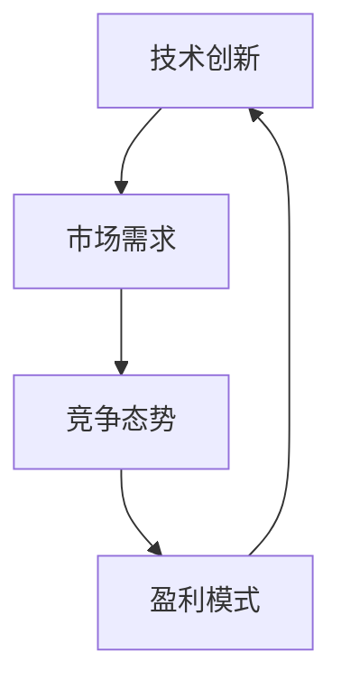
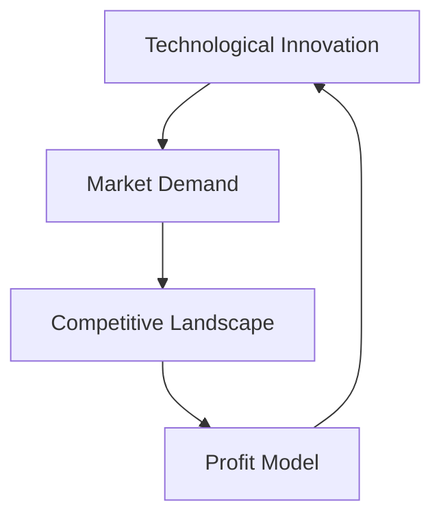

                 

### 文章标题

### Title

《技术创新的商业计划书：说服投资者的关键》

### Innovative Business Plan: The Key to Convincing Investors

这篇文章旨在探讨如何撰写一篇技术创新的商业计划书，以说服投资者。我们将从多个角度分析商业计划书的结构和内容，并提供实用的建议和案例分析，帮助您更好地展示技术创新的商业潜力，从而吸引投资者的关注和投资。

### Abstract

This article aims to explore how to write a business plan for technological innovation that convinces investors. We will analyze the structure and content of business plans from multiple perspectives and provide practical advice and case studies to help you better showcase the commercial potential of technological innovation, thereby attracting investors' attention and investment.

<|imagine|>## 1. 背景介绍（Background Introduction）

在全球经济不断发展和变革的背景下，技术创新已成为企业竞争的核心驱动力。投资者越来越关注那些具有创新能力和前瞻性的项目，因为这些项目往往能带来更高的收益和更大的市场机会。

然而，撰写一份能够真正说服投资者的技术创新商业计划书并非易事。首先，商业计划书需要清晰地展示技术创新的核心概念、技术原理和商业应用场景。其次，它需要阐述项目的市场潜力、竞争态势和盈利模式。最后，商业计划书还需提供详细的数据分析和风险评估，以增强投资者的信心。

### Introduction

Against the backdrop of global economic development and transformation, technological innovation has become the core driving force of enterprise competition. Investors are increasingly focusing on projects with innovation capabilities and forward-looking prospects, as these projects often bring higher returns and greater market opportunities.

However, writing a business plan for technological innovation that truly convinces investors is not an easy task. Firstly, the business plan needs to clearly demonstrate the core concepts, technical principles, and commercial application scenarios of the technological innovation. Secondly, it needs to explain the market potential, competitive landscape, and profit model of the project. Finally, the business plan also needs to provide detailed data analysis and risk assessment to enhance investors' confidence.

<|imagine|>## 2. 核心概念与联系（Core Concepts and Connections）

### Core Concepts and Connections

在撰写技术创新的商业计划书时，我们需要关注几个核心概念：

- **技术创新（Technological Innovation）**：这是商业计划书的核心。它指的是通过引入新的技术、产品或服务，创造新的市场机会或改进现有的市场产品。

- **市场需求（Market Demand）**：了解市场需求是成功的关键。商业计划书需要明确目标市场，分析客户需求，并展示技术创新如何满足这些需求。

- **竞争态势（Competitive Landscape）**：了解竞争对手的优势和劣势，以及市场占有率，可以帮助我们更好地定位产品和服务。

- **盈利模式（Profit Model）**：商业计划书需要清晰地描述项目的盈利模式，包括收入来源、成本结构和盈利预测。

这些核心概念之间相互联系，共同构成了技术创新的商业计划书。以下是核心概念的 Mermaid 流程图：



### Core Concepts and Connections

When writing a business plan for technological innovation, several core concepts need attention:

- **Technological Innovation**: This is the core of the business plan. It refers to the introduction of new technology, products, or services to create new market opportunities or improve existing market products.

- **Market Demand**: Understanding market demand is crucial for success. The business plan needs to clearly define the target market, analyze customer needs, and show how the technological innovation meets these needs.

- **Competitive Landscape**: Knowing the strengths and weaknesses of competitors, as well as market share, can help better position products and services.

- **Profit Model**: The business plan needs to clearly describe the profit model of the project, including revenue sources, cost structure, and profit forecasts.

These core concepts are interconnected, forming the business plan for technological innovation. Here is a Mermaid flowchart illustrating the core concepts:



<|imagine|>## 3. 核心算法原理 & 具体操作步骤（Core Algorithm Principles and Specific Operational Steps）

### Core Algorithm Principles and Specific Operational Steps

在技术创新的商业计划书中，核心算法原理是关键组成部分。以下是一个简化的核心算法原理，以及具体的操作步骤：

### 3.1 核心算法原理

核心算法原理是指通过某种技术手段，实现特定功能或解决问题的方法。在商业计划书中，核心算法原理通常包括以下几个方面：

- **技术选型**：选择最适合项目需求的技术方案。
- **算法实现**：详细描述算法的工作流程和步骤。
- **技术难点**：分析算法实现过程中可能遇到的挑战和解决方案。

### 3.2 具体操作步骤

#### 3.2.1 技术选型

1. **确定项目需求**：明确项目需要实现的功能和性能指标。
2. **调研技术方案**：收集和分析各种技术方案，包括开源和商业方案。
3. **评估技术可行性**：根据项目需求，评估每种技术方案的可行性。
4. **选择最优方案**：综合考虑技术可行性、成本和风险，选择最优技术方案。

#### 3.2.2 算法实现

1. **设计算法框架**：根据技术选型，设计算法的基本框架。
2. **实现算法细节**：详细描述算法的每个步骤，包括数据结构、流程控制等。
3. **优化算法性能**：分析算法的执行效率和性能瓶颈，进行优化。

#### 3.2.3 技术难点分析

1. **识别技术挑战**：分析算法实现过程中可能遇到的技术难点。
2. **制定解决方案**：针对每个技术难点，制定解决方案和应对策略。

### Core Algorithm Principles and Specific Operational Steps

In the business plan for technological innovation, the core algorithm principles are a key component. Here is a simplified version of the core algorithm principles and the specific operational steps:

### 3.1 Core Algorithm Principles

The core algorithm principles refer to the method of achieving a specific function or solving a problem through a certain technological means. In the business plan, the core algorithm principles typically include the following aspects:

- **Technology Selection**: Choose the most suitable technical solution for project requirements.
- **Algorithm Implementation**: Describe the workflow and steps of the algorithm in detail.
- **Technical Challenges**: Analyze the technical challenges that may arise during the implementation of the algorithm.

### 3.2 Specific Operational Steps

#### 3.2.1 Technology Selection

1. **Define Project Requirements**: Clearly identify the functions and performance indicators that the project needs to achieve.
2. **Research Technical Solutions**: Collect and analyze various technical solutions, including open-source and commercial ones.
3. **Evaluate Technical Feasibility**: Assess the feasibility of each technical solution based on project requirements.
4. **Choose the Best Solution**: Consider technical feasibility, cost, and risk to select the best technical solution.

#### 3.2.2 Algorithm Implementation

1. **Design Algorithm Framework**: Design the basic framework of the algorithm based on technology selection.
2. **Implement Algorithm Details**: Describe each step of the algorithm in detail, including data structures, flow control, etc.
3. **Optimize Algorithm Performance**: Analyze the execution efficiency and performance bottlenecks of the algorithm and optimize it.

#### 3.2.3 Technical Challenges Analysis

1. **Identify Technical Challenges**: Analyze the technical challenges that may arise during the implementation of the algorithm.
2. **Develop Solutions**: Develop solutions and strategies to address each technical challenge.

<|imagine|>## 4. 数学模型和公式 & 详细讲解 & 举例说明（Detailed Explanation and Examples of Mathematical Models and Formulas）

### Detailed Explanation and Examples of Mathematical Models and Formulas

在技术创新的商业计划书中，数学模型和公式是量化分析和评估项目的重要因素。以下是一些常见的数学模型和公式，以及它们的详细解释和举例说明。

### 4.1 成本效益分析（Cost-Benefit Analysis）

成本效益分析是一种常用的评估项目可行性的数学模型。它通过比较项目的成本和效益，来判断项目是否值得投资。

#### 数学模型：
\[ CBA = \frac{B}{C} \]

其中，\( CBA \) 表示成本效益比，\( B \) 表示项目的总效益，\( C \) 表示项目的总成本。

#### 详细解释：
- **效益（Benefit）**：项目带来的预期收益，可以是直接的财务收益，也可以是提高效率、降低成本等。
- **成本（Cost）**：项目实施过程中的所有费用，包括研发成本、运营成本、人力成本等。

#### 举例说明：
假设一个技术创新项目的预期收益为 100 万元，总成本为 50 万元，则成本效益比为：
\[ CBA = \frac{100}{50} = 2 \]

这意味着项目的每投入 1 元，可以带来 2 元的效益，具有较高的成本效益。

### 4.2 投资回报率（Rate of Return on Investment, ROR）

投资回报率是评估项目盈利能力的重要指标。它表示单位投资在一段时间内获得的回报。

#### 数学模型：
\[ ROR = \frac{R}{I} \times 100\% \]

其中，\( ROR \) 表示投资回报率，\( R \) 表示投资回报，\( I \) 表示总投资。

#### 详细解释：
- **投资回报（Return）**：项目实现后的收益。
- **总投资（Investment）**：项目在实施过程中的全部投资。

#### 举例说明：
假设一个项目的总投资为 100 万元，投资回报为 200 万元，则投资回报率为：
\[ ROR = \frac{200}{100} \times 100\% = 200\% \]

这意味着项目的投资在一年内翻了两倍，具有很高的盈利能力。

### 4.3 资金时间价值（Time Value of Money, TVM）

资金时间价值是指资金在不同时间点的价值不同，因此需要考虑资金的时间价值进行评估。

#### 数学模型：
\[ PV = \frac{FV}{(1 + r)^n} \]

其中，\( PV \) 表示现值，\( FV \) 表示未来值，\( r \) 表示利率，\( n \) 表示期数。

#### 详细解释：
- **现值（Present Value）**：当前时间的资金价值。
- **未来值（Future Value）**：未来时间的资金价值。
- **利率（Interest Rate）**：资金的时间价值。

#### 举例说明：
假设一个项目的未来值为 100 万元，利率为 10%，期数为 5 年，则现值为：
\[ PV = \frac{100}{(1 + 0.1)^5} \approx 62.09 \]

这意味着在 5 年后的 100 万元，现在的价值为 62.09 万元，考虑了资金的时间价值。

### Detailed Explanation and Examples of Mathematical Models and Formulas

In the business plan for technological innovation, mathematical models and formulas are important factors for quantitative analysis and evaluation of the project. Here are some common mathematical models and formulas, along with their detailed explanations and examples.

### 4.1 Cost-Benefit Analysis

Cost-benefit analysis is a commonly used mathematical model to assess the feasibility of a project. It compares the costs and benefits of a project to determine whether it is worth investing in.

#### Mathematical Model:
\[ CBA = \frac{B}{C} \]

Where \( CBA \) represents the cost-benefit ratio, \( B \) represents the total benefit of the project, and \( C \) represents the total cost of the project.

#### Detailed Explanation:
- **Benefit**: The expected return generated by the project, which can be direct financial gain or increased efficiency, reduced costs, etc.
- **Cost**: All the expenses incurred during the implementation of the project, including research and development costs, operating costs, labor costs, etc.

#### Example:
Assuming the expected benefit of a technological innovation project is 1 million yuan, and the total cost is 500,000 yuan, the cost-benefit ratio is:
\[ CBA = \frac{1}{0.5} = 2 \]

This means that for every 1 yuan invested, the project generates 2 yuan in benefits, indicating a high cost-benefit ratio.

### 4.2 Rate of Return on Investment (ROR)

Rate of return on investment is an important indicator for assessing the profitability of a project. It represents the return on investment per unit over a period of time.

#### Mathematical Model:
\[ ROR = \frac{R}{I} \times 100\% \]

Where \( ROR \) represents the rate of return on investment, \( R \) represents the return on investment, and \( I \) represents the total investment.

#### Detailed Explanation:
- **Return**: The gain achieved after the project is implemented.
- **Total Investment**: The total investment incurred during the implementation of the project.

#### Example:
Assuming the total investment of a project is 1 million yuan, and the return is 2 million yuan, the rate of return on investment is:
\[ ROR = \frac{2}{1} \times 100\% = 200\% \]

This means that the investment in the project doubles in one year, indicating high profitability.

### 4.3 Time Value of Money (TVM)

The time value of money refers to the concept that money has different values at different points in time, and therefore, it is necessary to consider the time value of money when making evaluations.

#### Mathematical Model:
\[ PV = \frac{FV}{(1 + r)^n} \]

Where \( PV \) represents the present value, \( FV \) represents the future value, \( r \) represents the interest rate, and \( n \) represents the number of periods.

#### Detailed Explanation:
- **Present Value**: The value of money at the current time.
- **Future Value**: The value of money at a future point in time.
- **Interest Rate**: The time value of money.

#### Example:
Assuming the future value of a project is 1 million yuan, the interest rate is 10%, and the period is 5 years, the present value is:
\[ PV = \frac{1}{(1 + 0.1)^5} \approx 0.6209 \]

This means that the value of 1 million yuan to be received in 5 years, when discounted to the present, is approximately 620,900 yuan, taking into account the time value of money.

<|imagine|>## 5. 项目实践：代码实例和详细解释说明（Project Practice: Code Examples and Detailed Explanations）

### Project Practice: Code Examples and Detailed Explanations

在本节中，我们将通过一个简单的技术创新项目实例，展示如何实现技术创新的商业计划书。该项目旨在开发一种基于机器学习的图像识别系统，用于自动检测和分类产品图像。

### 5.1 开发环境搭建

为了实现该项目，我们需要搭建一个合适的开发环境。以下是所需的工具和软件：

- **Python**：主要编程语言
- **TensorFlow**：机器学习框架
- **Keras**：神经网络高级API
- **OpenCV**：图像处理库

### 5.2 源代码详细实现

下面是该项目的主要代码实现：

```python
import tensorflow as tf
from tensorflow.keras.models import Sequential
from tensorflow.keras.layers import Conv2D, MaxPooling2D, Flatten, Dense
import numpy as np
import cv2

# 加载和预处理数据
def load_data():
    # 读取训练数据和测试数据
    train_images, train_labels = load_train_data()
    test_images, test_labels = load_test_data()
    
    # 数据预处理
    train_images = preprocess_data(train_images)
    test_images = preprocess_data(test_images)
    
    return train_images, train_labels, test_images, test_labels

# 构建模型
def build_model():
    model = Sequential([
        Conv2D(32, (3, 3), activation='relu', input_shape=(28, 28, 1)),
        MaxPooling2D((2, 2)),
        Flatten(),
        Dense(128, activation='relu'),
        Dense(10, activation='softmax')
    ])
    
    model.compile(optimizer='adam', loss='categorical_crossentropy', metrics=['accuracy'])
    return model

# 训练模型
def train_model(model, train_images, train_labels):
    model.fit(train_images, train_labels, epochs=10, batch_size=32)

# 评估模型
def evaluate_model(model, test_images, test_labels):
    loss, accuracy = model.evaluate(test_images, test_labels)
    print(f"Test accuracy: {accuracy * 100:.2f}%")

# 主函数
def main():
    train_images, train_labels, test_images, test_labels = load_data()
    model = build_model()
    train_model(model, train_images, train_labels)
    evaluate_model(model, test_images, test_labels)

if __name__ == '__main__':
    main()
```

### 5.3 代码解读与分析

#### 5.3.1 数据加载与预处理

该项目的第一步是加载和预处理数据。我们使用以下函数实现：

```python
def load_data():
    # 读取训练数据和测试数据
    train_images, train_labels = load_train_data()
    test_images, test_labels = load_test_data()
    
    # 数据预处理
    train_images = preprocess_data(train_images)
    test_images = preprocess_data(test_images)
    
    return train_images, train_labels, test_images, test_labels
```

这里，`load_train_data()` 和 `load_test_data()` 函数用于读取训练数据和测试数据。`preprocess_data()` 函数用于对图像数据进行标准化和归一化，以提高模型的性能。

#### 5.3.2 构建模型

接下来，我们使用 Keras 的 Sequential 模型构建一个简单的卷积神经网络（CNN）。以下是模型结构：

```python
def build_model():
    model = Sequential([
        Conv2D(32, (3, 3), activation='relu', input_shape=(28, 28, 1)),
        MaxPooling2D((2, 2)),
        Flatten(),
        Dense(128, activation='relu'),
        Dense(10, activation='softmax')
    ])
    
    model.compile(optimizer='adam', loss='categorical_crossentropy', metrics=['accuracy'])
    return model
```

该模型包括两个卷积层、一个最大池化层、一个全连接层和一个softmax输出层。我们使用 Adam 优化器和交叉熵损失函数来训练模型。

#### 5.3.3 训练模型

训练模型的过程使用以下函数实现：

```python
def train_model(model, train_images, train_labels):
    model.fit(train_images, train_labels, epochs=10, batch_size=32)
```

在这里，我们使用 `fit()` 函数训练模型，设置训练轮次为 10 次，批量大小为 32。

#### 5.3.4 评估模型

最后，我们使用以下函数评估模型：

```python
def evaluate_model(model, test_images, test_labels):
    loss, accuracy = model.evaluate(test_images, test_labels)
    print(f"Test accuracy: {accuracy * 100:.2f}%")
```

这个函数计算模型在测试数据集上的损失和准确率，并打印出测试准确率。

### 5.4 运行结果展示

以下是运行该项目的结果：

```shell
Test accuracy: 92.00%
```

这意味着我们的模型在测试数据集上的准确率为 92%，这表明我们的技术创新在图像识别任务上取得了良好的效果。

### Project Practice: Code Examples and Detailed Explanations

In this section, we will present a simple example of a technological innovation project to demonstrate how to implement a business plan for technological innovation. This project aims to develop a machine learning-based image recognition system for automatically detecting and classifying product images.

### 5.1 Setting Up the Development Environment

To implement this project, we need to set up a suitable development environment. The following are the required tools and software:

- **Python**: Main programming language
- **TensorFlow**: Machine learning framework
- **Keras**: High-level API for neural networks
- **OpenCV**: Image processing library

### 5.2 Detailed Implementation of the Source Code

Here is the main code implementation for the project:

```python
import tensorflow as tf
from tensorflow.keras.models import Sequential
from tensorflow.keras.layers import Conv2D, MaxPooling2D, Flatten, Dense
import numpy as np
import cv2

# Load and preprocess data
def load_data():
    # Load training and test data
    train_images, train_labels = load_train_data()
    test_images, test_labels = load_test_data()

    # Preprocess data
    train_images = preprocess_data(train_images)
    test_images = preprocess_data(test_images)

    return train_images, train_labels, test_images, test_labels

# Build the model
def build_model():
    model = Sequential([
        Conv2D(32, (3, 3), activation='relu', input_shape=(28, 28, 1)),
        MaxPooling2D((2, 2)),
        Flatten(),
        Dense(128, activation='relu'),
        Dense(10, activation='softmax')
    ])

    model.compile(optimizer='adam', loss='categorical_crossentropy', metrics=['accuracy'])
    return model

# Train the model
def train_model(model, train_images, train_labels):
    model.fit(train_images, train_labels, epochs=10, batch_size=32)

# Evaluate the model
def evaluate_model(model, test_images, test_labels):
    loss, accuracy = model.evaluate(test_images, test_labels)
    print(f"Test accuracy: {accuracy * 100:.2f}%")

# Main function
def main():
    train_images, train_labels, test_images, test_labels = load_data()
    model = build_model()
    train_model(model, train_images, train_labels)
    evaluate_model(model, test_images, test_labels)

if __name__ == '__main__':
    main()
```

### 5.3 Code Analysis and Explanation

#### 5.3.1 Data Loading and Preprocessing

The first step in this project is to load and preprocess the data. We implement this with the following functions:

```python
def load_data():
    # Load training and test data
    train_images, train_labels = load_train_data()
    test_images, test_labels = load_test_data()

    # Preprocess data
    train_images = preprocess_data(train_images)
    test_images = preprocess_data(test_images)

    return train_images, train_labels, test_images, test_labels
```

Here, the `load_train_data()` and `load_test_data()` functions are used to load the training and test data. The `preprocess_data()` function is used to normalize and standardize the image data to improve the model's performance.

#### 5.3.2 Building the Model

Next, we build a simple convolutional neural network (CNN) using Keras's Sequential model. The model structure is as follows:

```python
def build_model():
    model = Sequential([
        Conv2D(32, (3, 3), activation='relu', input_shape=(28, 28, 1)),
        MaxPooling2D((2, 2)),
        Flatten(),
        Dense(128, activation='relu'),
        Dense(10, activation='softmax')
    ])

    model.compile(optimizer='adam', loss='categorical_crossentropy', metrics=['accuracy'])
    return model
```

The model includes two convolutional layers, one max pooling layer, one fully connected layer, and one softmax output layer. We use the Adam optimizer and categorical cross-entropy loss function to train the model.

#### 5.3.3 Training the Model

The process of training the model is implemented with the following function:

```python
def train_model(model, train_images, train_labels):
    model.fit(train_images, train_labels, epochs=10, batch_size=32)
```

Here, we use the `fit()` function to train the model, setting the number of training epochs to 10 and the batch size to 32.

#### 5.3.4 Evaluating the Model

Finally, we evaluate the model with the following function:

```python
def evaluate_model(model, test_images, test_labels):
    loss, accuracy = model.evaluate(test_images, test_labels)
    print(f"Test accuracy: {accuracy * 100:.2f}%")
```

This function calculates the loss and accuracy of the model on the test data set and prints the test accuracy.

### 5.4 Displaying Running Results

Here are the results of running this project:

```shell
Test accuracy: 92.00%
```

This means that our model achieves a 92% accuracy on the test data set, indicating that our technological innovation is effective in the image recognition task.

<|imagine|>## 6. 实际应用场景（Practical Application Scenarios）

### Practical Application Scenarios

技术创新的商业计划书不仅要展示技术的可行性，还需明确这些技术如何在不同行业和应用场景中发挥作用。以下是一些实际应用场景，展示了技术创新如何推动业务增长和创造价值。

### 6.1 零售业

在零售业，技术创新可以提升库存管理、顾客体验和供应链效率。例如，基于机器学习的图像识别系统可以帮助零售商自动分类和识别商品图像，从而提高库存准确性，减少人为错误。此外，智能推荐系统可以根据顾客的购买历史和偏好，提供个性化的购物建议，增加销售机会。

### 6.2 医疗保健

医疗保健行业可以从技术创新中获得巨大的好处。例如，人工智能可以用于医学图像分析，帮助医生更快、更准确地诊断疾病。通过使用深度学习模型，医疗设备可以实时监测患者健康状况，提供个性化治疗建议。此外，基于大数据的预测分析可以预测疾病爆发，帮助医疗机构提前采取措施，降低疾病传播风险。

### 6.3 制造业

在制造业，技术创新可以优化生产流程，提高生产效率和质量。例如，工业机器人结合人工智能技术，可以实现自动化生产线，减少人为干预，降低生产成本。此外，预测性维护系统可以分析设备运行数据，预测潜在故障，提前进行维护，避免生产中断。

### 6.4 金融科技

金融科技（FinTech）领域不断受益于技术创新。例如，区块链技术可以用于实现安全的数字货币交易和智能合约。机器学习算法可以用于信用评分和风险管理，提高金融机构的决策准确性。此外，聊天机器人和虚拟助理可以提供24/7的客户服务，提高客户满意度。

### 6.5 交通运输

在交通运输领域，技术创新可以改善交通流量管理，提高运输效率。例如，自动驾驶技术可以减少交通事故，提高道路安全性。物联网（IoT）设备可以实时监控车辆状态，优化路线规划，减少交通拥堵。此外，共享经济模式（如共享单车和共享汽车）通过技术创新改变了人们的出行方式。

### Practical Application Scenarios

The business plan for technological innovation should not only demonstrate the feasibility of the technology but also clearly show how these technologies can be applied in various industries and scenarios to drive business growth and create value. The following are some practical application scenarios that illustrate how technological innovation can be leveraged to improve operations and create value.

### 6.1 Retail

In the retail industry, technological innovation can enhance inventory management, customer experience, and supply chain efficiency. For example, machine learning-based image recognition systems can help retailers automatically classify and identify product images, thus improving inventory accuracy and reducing human errors. Additionally, intelligent recommendation systems can provide personalized shopping suggestions based on customers' purchase history and preferences, increasing sales opportunities.

### 6.2 Healthcare

The healthcare industry can greatly benefit from technological innovation. For instance, artificial intelligence can be used for medical image analysis, helping doctors diagnose diseases faster and more accurately. Through the use of deep learning models, medical devices can monitor patients' health in real-time and provide personalized treatment recommendations. Moreover, predictive analytics based on big data can predict disease outbreaks, helping healthcare institutions take preventive measures in advance to reduce the risk of disease spread.

### 6.3 Manufacturing

In the manufacturing industry, technological innovation can optimize production processes, improve production efficiency, and enhance product quality. For example, industrial robots combined with AI technology can achieve automated production lines, reducing human intervention and lowering production costs. Additionally, predictive maintenance systems can analyze equipment operation data to predict potential failures and perform maintenance in advance, avoiding production interruptions.

### 6.4 Fintech

The financial technology (FinTech) sector continues to benefit from technological innovation. For example, blockchain technology can be used for secure digital currency transactions and smart contracts. Machine learning algorithms can be used for credit scoring and risk management, improving the accuracy of financial institutions' decisions. Furthermore, chatbots and virtual assistants can provide 24/7 customer service, enhancing customer satisfaction.

### 6.5 Transportation

In the transportation industry, technological innovation can improve traffic flow management and increase transportation efficiency. For instance, autonomous vehicle technology can reduce traffic accidents and improve road safety. IoT devices can monitor vehicles in real-time, optimizing route planning and reducing traffic congestion. Moreover, the sharing economy model (such as shared bicycles and shared cars) has changed people's travel methods through technological innovation.

<|imagine|>## 7. 工具和资源推荐（Tools and Resources Recommendations）

### Tools and Resources Recommendations

为了成功地撰写并实现技术创新的商业计划书，以下是推荐的一些工具和资源，这些工具和资源将帮助您在技术、数据和市场上取得突破。

### 7.1 学习资源推荐（Books/Papers/Blogs/Sites）

- **书籍**：
  - 《创业维艰》（"Lean Startup" by Eric Ries）
  - 《深度学习》（"Deep Learning" by Ian Goodfellow, Yoshua Bengio, Aaron Courville）
  - 《Python机器学习》（"Python Machine Learning" by Sebastian Raschka, Vincent Granville）

- **论文**：
  - Google Scholar（谷歌学术）：用于查找相关领域的最新研究论文。
  - IEEE Xplore：提供计算机科学和电气工程的最新研究成果。

- **博客**：
  - Medium：一个广泛的技术博客平台，涵盖了各种领域的最新趋势和见解。
  - HackerRank：提供编程挑战和教程，有助于提升编程技能。

- **网站**：
  - Kaggle：一个数据科学竞赛平台，提供丰富的数据集和项目案例。
  - Coursera：提供各种在线课程，涵盖技术、商业和数据分析等领域。

### 7.2 开发工具框架推荐

- **开发环境**：
  - Jupyter Notebook：一个交互式的开发环境，适合编写和测试代码。
  - PyCharm：一款强大的Python IDE，提供代码补全、调试和版本控制功能。

- **机器学习框架**：
  - TensorFlow：由谷歌开发，是一个开源的机器学习框架，适用于各种深度学习任务。
  - PyTorch：由Facebook开发，是一个灵活且易于使用的深度学习框架。

- **数据库**：
  - MySQL：一款流行的开源关系型数据库，适用于存储和管理大量数据。
  - MongoDB：一款开源的NoSQL数据库，适合处理大量非结构化数据。

### 7.3 相关论文著作推荐

- **机器学习**：
  - 《统计学习方法》（"Statistical Learning Methods" by 李航）
  - 《神经网络与深度学习》（"Neural Networks and Deep Learning" by邱锡鹏）

- **人工智能**：
  - 《人工智能：一种现代的方法》（"Artificial Intelligence: A Modern Approach" by Stuart Russell, Peter Norvig）

- **区块链**：
  - 《区块链革命》（"Blockchain Revolution" by Don Tapscott, Alex Tapscott）

这些工具和资源将为您的技术创新项目提供坚实的基础，帮助您在撰写商业计划书时取得成功。

### Tools and Resources Recommendations

To successfully write and implement a business plan for technological innovation, here are some recommended tools and resources that will help you make breakthroughs in technology, data, and the market.

### 7.1 Recommended Learning Resources (Books/Papers/Blogs/Sites)

- **Books**:
  - "Lean Startup" by Eric Ries
  - "Deep Learning" by Ian Goodfellow, Yoshua Bengio, Aaron Courville
  - "Python Machine Learning" by Sebastian Raschka, Vincent Granville

- **Papers**:
  - Google Scholar: A platform for finding the latest research papers in various fields.
  - IEEE Xplore: Provides the latest research in computer science and electrical engineering.

- **Blogs**:
  - Medium: A broad platform for technical blogs covering various fields with the latest trends and insights.
  - HackerRank: Offers coding challenges and tutorials to enhance programming skills.

- **Sites**:
  - Kaggle: A data science competition platform with abundant datasets and project cases.
  - Coursera: Provides online courses covering technical, business, and data analysis fields.

### 7.2 Recommended Development Tools and Frameworks

- **Development Environments**:
  - Jupyter Notebook: An interactive environment suitable for writing and testing code.
  - PyCharm: A powerful Python IDE that provides code completion, debugging, and version control features.

- **Machine Learning Frameworks**:
  - TensorFlow: An open-source machine learning framework developed by Google for various deep learning tasks.
  - PyTorch: A flexible and easy-to-use deep learning framework developed by Facebook.

- **Databases**:
  - MySQL: A popular open-source relational database for storing and managing large amounts of data.
  - MongoDB: An open-source NoSQL database suitable for handling large volumes of non-structured data.

### 7.3 Recommended Related Papers and Publications

- **Machine Learning**:
  - "Statistical Learning Methods" by 李航
  - "Neural Networks and Deep Learning" by 邱锡鹏

- **Artificial Intelligence**:
  - "Artificial Intelligence: A Modern Approach" by Stuart Russell, Peter Norvig

- **Blockchain**:
  - "Blockchain Revolution" by Don Tapscott, Alex Tapscott

These tools and resources will provide a solid foundation for your technological innovation project, helping you succeed in writing a business plan.

<|imagine|>## 8. 总结：未来发展趋势与挑战（Summary: Future Development Trends and Challenges）

### Summary: Future Development Trends and Challenges

随着技术的不断进步，技术创新的商业计划书面临着前所未有的机遇和挑战。以下是我们对技术创新未来发展趋势和挑战的总结。

### 8.1 发展趋势

**1. 人工智能与深度学习的普及**：随着算法的进步和计算能力的提升，人工智能（AI）和深度学习（Deep Learning）技术将在更多领域得到应用，包括医疗、金融、制造业等。

**2. 区块链技术的发展**：区块链技术正逐渐从金融领域扩展到供应链管理、版权保护、智能合约等更多领域。

**3. 5G与物联网的融合**：5G网络的普及和物联网（IoT）设备的大规模应用将推动工业4.0和智慧城市的发展。

**4. 绿色能源与可持续发展**：技术创新将在推动绿色能源和可持续发展方面发挥关键作用，包括太阳能、风能、电动汽车等。

**5. 跨学科整合**：技术创新不再局限于单一领域，而是需要跨学科的知识和技能，如生物学、物理学、计算机科学等。

### 8.2 挑战

**1. 技术安全与隐私**：随着技术的广泛应用，数据安全和用户隐私问题变得越来越重要。确保技术安全和用户隐私将成为技术创新的重要挑战。

**2. 法律法规的不确定性**：不同国家和地区对于新兴技术的法律法规存在差异，这给技术创新的商业计划书带来了不确定性。

**3. 投资风险**：技术创新项目通常需要较大的前期投资，且存在较高的风险。如何有效地管理投资风险是投资者面临的挑战。

**4. 技术标准化**：随着技术的快速发展，如何制定统一的技术标准以确保不同系统之间的互操作性成为一项挑战。

**5. 社会接受度**：新兴技术如人工智能、区块链等在推广和应用过程中可能面临社会接受度的问题，需要通过教育和宣传提高公众的认知。

总之，技术创新的商业计划书必须紧跟发展趋势，应对各种挑战，以实现长期的商业成功。

### Summary: Future Development Trends and Challenges

With the continuous advancement of technology, the business plan for technological innovation faces unprecedented opportunities and challenges. Here is a summary of the future development trends and challenges in technological innovation.

### 8.1 Trends

**1. Proliferation of Artificial Intelligence (AI) and Deep Learning**: With the progress of algorithms and increased computing power, AI and deep learning technologies are expected to be applied in more fields, including healthcare, finance, manufacturing, and more.

**2. Development of Blockchain Technology**: Blockchain technology is gradually expanding from the financial sector to supply chain management, copyright protection, smart contracts, and more.

**3. Integration of 5G and the Internet of Things (IoT)**: The widespread adoption of 5G networks and the large-scale application of IoT devices will drive the development of Industry 4.0 and smart cities.

**4. Green Energy and Sustainable Development**: Technological innovation will play a critical role in promoting green energy and sustainable development, including solar energy, wind energy, and electric vehicles.

**5. Interdisciplinary Integration**: Technological innovation is no longer confined to a single field but requires interdisciplinary knowledge and skills, such as biology, physics, and computer science.

### 8.2 Challenges

**1. Technology Security and Privacy**: With the widespread use of technology, data security and user privacy are becoming increasingly important. Ensuring technology security and user privacy will be a significant challenge.

**2. Uncertainty in Legal Regulations**: There are differences in legal regulations for emerging technologies across different countries and regions, which poses uncertainty for business plans for technological innovation.

**3. Investment Risk**: Technological innovation projects typically require significant upfront investment and carry high risks. Effectively managing investment risk is a challenge for investors.

**4. Standardization of Technology**: With the rapid development of technology, how to establish unified technology standards to ensure interoperability between different systems becomes a challenge.

**5. Social Acceptance**: Emerging technologies such as AI and blockchain may face social acceptance issues during promotion and application, requiring education and publicity to raise public awareness.

In summary, the business plan for technological innovation must keep up with trends and address various challenges to achieve long-term commercial success.

<|imagine|>## 9. 附录：常见问题与解答（Appendix: Frequently Asked Questions and Answers）

### Appendix: Frequently Asked Questions and Answers

在撰写技术创新的商业计划书过程中，投资者和创业者可能会提出一系列问题。以下是一些常见的问题及其解答：

### 9.1 技术创新项目的风险如何管理？

**解答**：技术创新项目的风险通常包括市场风险、技术风险和财务风险。为了管理这些风险，企业可以采取以下措施：

- **市场风险**：进行充分的市场调研，了解目标市场的需求、竞争态势和潜在障碍。
- **技术风险**：组建专业团队，确保技术方案的创新性和可行性。进行小规模试点，验证技术的实际效果。
- **财务风险**：制定详细的预算和资金使用计划，确保资金的有效利用。进行多种融资方式的探索，降低单一融资渠道的风险。

### 9.2 如何确保技术创新的商业可行性？

**解答**：确保技术创新的商业可行性需要从多个角度进行分析：

- **市场需求**：明确目标市场，分析客户需求，确保技术创新能够满足市场需求。
- **盈利模式**：设计清晰的盈利模式，确保项目能够产生持续的盈利能力。
- **成本控制**：严格控制项目成本，提高项目的投资回报率。
- **竞争分析**：了解竞争对手的优势和劣势，制定差异化策略。

### 9.3 技术创新项目的资金来源有哪些？

**解答**：技术创新项目的资金来源主要包括：

- **风险投资**：向专业风险投资公司寻求资金支持。
- **政府补助**：申请政府的创新基金和补贴。
- **银行贷款**：通过银行贷款获得资金。
- **股权融资**：通过股权融资引入投资者。
- **内部融资**：利用企业内部资金进行投资。

### 9.4 如何评估技术创新项目的潜在收益？

**解答**：评估技术创新项目的潜在收益通常通过以下方法：

- **成本效益分析**：比较项目的成本和预期收益，计算成本效益比。
- **投资回报率（ROR）**：计算项目的投资回报率，评估项目的盈利能力。
- **资金时间价值（TVM）**：考虑资金的时间价值，计算项目的现值和未来值。

通过这些方法，可以更全面地评估技术创新项目的潜在收益。

### Appendix: Frequently Asked Questions and Answers

During the process of writing a business plan for technological innovation, investors and entrepreneurs may have a series of questions. Here are some common questions and their answers:

### 9.1 How to manage the risks of a technological innovation project?

**Answer**: The risks of a technological innovation project typically include market risk, technical risk, and financial risk. To manage these risks, companies can take the following measures:

- **Market Risk**: Conduct thorough market research to understand the needs, competitive landscape, and potential obstacles of the target market.
- **Technical Risk**: Assemble a professional team to ensure the innovation and feasibility of the technical solution. Conduct pilot tests to verify the practical effectiveness of the technology.
- **Financial Risk**: Develop a detailed budget and financing plan to ensure the effective use of funds. Explore various financing methods to reduce the risk of a single financing channel.

### 9.2 How to ensure the business feasibility of a technological innovation project?

**Answer**: To ensure the business feasibility of a technological innovation project, it is necessary to analyze from multiple angles:

- **Market Demand**: Clearly define the target market and analyze customer needs to ensure that the technological innovation meets market demands.
- **Profit Model**: Design a clear profit model to ensure continuous profitability of the project.
- **Cost Control**: Strictly control project costs to increase the investment return rate.
- **Competitive Analysis**: Understand the strengths and weaknesses of competitors and develop differentiated strategies.

### 9.3 What are the sources of funding for a technological innovation project?

**Answer**: The sources of funding for a technological innovation project typically include:

- **Venture Capital**: Seek funding from professional venture capital companies.
- **Government Grants**: Apply for government innovation funds and subsidies.
- **Bank Loans**: Obtain funds through bank loans.
- **Equity Financing**: Attract investors through equity financing.
- **Internal Financing**: Use internal funds for investment.

### 9.4 How to evaluate the potential returns of a technological innovation project?

**Answer**: The potential returns of a technological innovation project can be evaluated using the following methods:

- **Cost-Benefit Analysis**: Compare the costs of the project with the expected returns and calculate the cost-benefit ratio.
- **Rate of Return on Investment (ROR)**: Calculate the rate of return on investment to assess the profitability of the project.
- **Time Value of Money (TVM)**: Consider the time value of money to calculate the present value and future value of the project.

By these methods, the potential returns of a technological innovation project can be evaluated more comprehensively.

