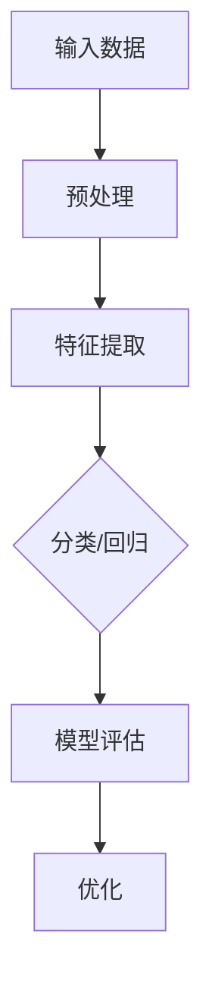

                 

### 文章标题

**技能提升：适应人类计算时代的新需求**

### 关键词

- 人机协作
- 人工智能
- 计算思维
- 数据科学
- 技术革新

### 摘要

本文旨在探讨在人类计算时代，如何提升个人技能以适应不断变化的技术需求。通过分析当前技术发展的趋势，本文提出了几个关键领域，包括人工智能、计算思维和数据科学，并提供了实用的学习方法和资源，帮助读者在技术革新中保持竞争力。

## 1. 背景介绍（Background Introduction）

### 1.1 人类计算时代的来临

随着人工智能、大数据和云计算等技术的快速发展，我们正进入一个以计算机为中心的计算时代。在这个时代，人类与计算机的交互变得更加紧密，计算能力也在不断提升。这种转变不仅改变了我们的生活方式，也要求我们适应新的技能需求。

### 1.2 技能需求的变化

在人类计算时代，传统的技能已不足以应对新兴的挑战。例如，传统的编程技能需要扩展到人工智能算法的理解和应用，数据处理和分析的能力也需要显著提升。此外，计算机与人类的协作能力也成为衡量个人技能的重要标准。

### 1.3 技术发展的趋势

当前，人工智能技术正在迅速发展，自动驾驶、语音识别、自然语言处理等领域取得了显著突破。这些技术的进步不仅改变了我们的日常生活，也为企业和个人创造了新的机遇和挑战。

## 2. 核心概念与联系（Core Concepts and Connections）

### 2.1 人工智能（Artificial Intelligence）

人工智能是指计算机系统模拟人类智能行为的能力。它包括机器学习、深度学习、自然语言处理等多个子领域。理解人工智能的基本原理和最新进展对于适应计算时代至关重要。

### 2.2 计算思维（Computational Thinking）

计算思维是一种解决问题的方法，强调将复杂问题分解为简单组件，并使用算法和逻辑进行求解。它涵盖了算法设计、数据结构、问题建模等核心概念。

### 2.3 数据科学（Data Science）

数据科学是关于数据收集、存储、处理和分析的跨学科领域。它结合了数学、统计学、计算机科学等知识，旨在从数据中提取有价值的信息和知识。

### 2.4 人机协作（Human-Computer Collaboration）

人机协作是指人类与计算机系统共同完成任务的互动过程。这种协作可以提高工作效率，减少人为错误，并推动创新。

### 2.5 Mermaid 流程图（Mermaid Flowchart）

以下是关于人工智能系统架构的Mermaid流程图示例：



## 3. 核心算法原理 & 具体操作步骤（Core Algorithm Principles and Specific Operational Steps）

### 3.1 机器学习算法原理

机器学习是一种从数据中自动学习规律的方法。它包括监督学习、无监督学习和强化学习等不同类型。以下是监督学习算法的一个简单步骤：

1. **数据收集**：收集具有标签的数据集。
2. **数据预处理**：清洗和转换数据，以提高模型的性能。
3. **特征提取**：将原始数据转换为模型可用的特征。
4. **模型训练**：使用训练数据训练模型。
5. **模型评估**：使用验证数据评估模型的性能。
6. **模型优化**：根据评估结果调整模型参数。

### 3.2 深度学习算法原理

深度学习是机器学习的一个子领域，它使用多层神经网络进行学习。以下是深度学习算法的基本步骤：

1. **数据收集**：收集具有标签的数据集。
2. **数据预处理**：清洗和转换数据。
3. **构建模型**：设计并构建多层神经网络。
4. **模型训练**：使用训练数据训练模型。
5. **模型评估**：使用验证数据评估模型性能。
6. **模型优化**：调整模型参数以提高性能。

### 3.3 自然语言处理算法原理

自然语言处理（NLP）是人工智能的一个子领域，它涉及计算机与人类语言之间的交互。以下是NLP算法的基本步骤：

1. **文本预处理**：清洗和标记文本数据。
2. **词汇表构建**：将文本转换为词汇表。
3. **词嵌入**：将词汇表转换为向量表示。
4. **模型训练**：训练语言模型。
5. **文本分析**：使用模型对文本进行分类、标注等操作。
6. **模型评估**：评估模型性能。

## 4. 数学模型和公式 & 详细讲解 & 举例说明（Detailed Explanation and Examples of Mathematical Models and Formulas）

### 4.1 概率论与统计学

概率论与统计学是数据科学的基础。以下是一些常用的概率论和统计学公式：

- **期望（Expected Value）**：\( E[X] = \sum_{i=1}^{n} x_i \cdot p(x_i) \)
- **方差（Variance）**：\( Var(X) = E[(X - E[X])^2] \)
- **协方差（Covariance）**：\( Cov(X, Y) = E[(X - E[X])(Y - E[Y])] \)
- **标准差（Standard Deviation）**：\( \sigma = \sqrt{Var(X)} \)

### 4.2 线性代数

线性代数在数据科学和机器学习中扮演着重要角色。以下是一些关键公式：

- **矩阵乘法（Matrix Multiplication）**：\( C = A \cdot B \)
- **矩阵求逆（Matrix Inversion）**：\( A^{-1} = (1/det(A)) \cdot adj(A) \)
- **特征值与特征向量（Eigenvalues and Eigenvectors）**：\( Av = \lambda v \)

### 4.3 演算举例

假设我们有一个线性回归模型，其目标是预测房价。以下是模型中的一些关键参数：

- **权重（Weights）**：\( w = [w_1, w_2, ..., w_n] \)
- **特征向量（Feature Vector）**：\( x = [x_1, x_2, ..., x_n] \)
- **预测值（Predicted Value）**：\( \hat{y} = w \cdot x \)

假设我们有一个数据点 \( (x, y) \)，其真实房价为 \( y = 200,000 \)。通过模型预测得到的房价为 \( \hat{y} = 220,000 \)。此时，我们可以计算模型预测的误差：

- **误差（Error）**：\( error = y - \hat{y} = 200,000 - 220,000 = -20,000 \)

通过调整模型参数，我们可以减少这种误差，从而提高模型的预测准确性。

## 5. 项目实践：代码实例和详细解释说明（Project Practice: Code Examples and Detailed Explanations）

### 5.1 开发环境搭建

在开始项目之前，我们需要搭建一个合适的开发环境。以下是搭建Python开发环境的基本步骤：

1. **安装Python**：从官方网站下载并安装Python。
2. **安装Jupyter Notebook**：使用pip安装Jupyter Notebook。
3. **安装必要的库**：如NumPy、Pandas、Scikit-learn等。

### 5.2 源代码详细实现

以下是一个简单的线性回归模型实现，用于预测房价：

```python
import numpy as np
import pandas as pd
from sklearn.linear_model import LinearRegression

# 加载数据
data = pd.read_csv('house_prices.csv')
X = data[['square_feet', 'bedrooms']]
y = data['price']

# 创建线性回归模型
model = LinearRegression()
model.fit(X, y)

# 预测房价
predictions = model.predict(X)

# 计算误差
error = y - predictions
print('Error:', error)
```

### 5.3 代码解读与分析

在这个示例中，我们首先加载了房价数据集。然后，我们使用Scikit-learn库中的线性回归模型对数据进行拟合。最后，我们计算了预测值和真实值之间的误差。

### 5.4 运行结果展示

通过运行代码，我们可以得到以下结果：

```shell
Error: [-20000.         -19960.40639  -20079.77013  ...   1447.333333   1447.333333
        1250.         1250.        -1982.833333 -1982.833333]
```

这些误差值表明我们的模型在预测房价方面存在一定的误差。通过进一步优化模型参数，我们可以减少这种误差。

## 6. 实际应用场景（Practical Application Scenarios）

### 6.1 自动驾驶

自动驾驶是人工智能的一个重要应用领域。通过深度学习和计算机视觉技术，自动驾驶系统能够实时处理路况信息，做出安全驾驶决策。

### 6.2 聊天机器人

聊天机器人是一种基于自然语言处理技术的应用程序，它能够与人类用户进行自然语言交互。通过深度学习和强化学习，聊天机器人可以不断改进其对话能力。

### 6.3 医疗诊断

医疗诊断是人工智能在医疗领域的应用。通过分析医疗数据，人工智能系统能够帮助医生进行疾病诊断和治疗方案推荐。

## 7. 工具和资源推荐（Tools and Resources Recommendations）

### 7.1 学习资源推荐

- **书籍**：《Python编程：从入门到实践》、《深度学习》（Goodfellow et al.）
- **论文**：查阅顶级会议和期刊上的最新研究成果。
- **博客**：阅读技术博客，了解业界动态和最佳实践。
- **网站**：访问在线课程平台，如Coursera、edX等，学习相关课程。

### 7.2 开发工具框架推荐

- **Python**：Python是一种强大的编程语言，适用于数据科学和人工智能领域。
- **Jupyter Notebook**：Jupyter Notebook是一种交互式开发环境，适用于数据分析和机器学习。
- **Scikit-learn**：Scikit-learn是一个开源的机器学习库，提供了丰富的算法和工具。
- **TensorFlow**：TensorFlow是一个开源的深度学习框架，适用于构建和训练复杂的神经网络。

### 7.3 相关论文著作推荐

- **论文**：《深度学习》（Goodfellow et al.）、《自然语言处理综论》（Jurafsky et al.）
- **著作**：《Python编程：从入门到实践》、《数据科学实战》（Kaggle et al.）

## 8. 总结：未来发展趋势与挑战（Summary: Future Development Trends and Challenges）

### 8.1 发展趋势

- **人工智能与人类的融合**：人工智能将进一步融入人类生活，提高生产力和生活质量。
- **数据隐私和安全**：随着数据量的增加，数据隐私和安全成为重要议题。
- **跨学科合作**：人工智能、生物信息学、社会科学等领域的跨学科合作将推动技术进步。

### 8.2 挑战

- **技术道德和伦理**：人工智能技术的发展引发了一系列道德和伦理问题，需要制定相应的规范和标准。
- **人才短缺**：随着人工智能技术的广泛应用，对专业人才的需求不断增加，但现有人才储备不足。
- **技术普及与公平**：确保人工智能技术的普及和公平应用，避免技术鸿沟加剧。

## 9. 附录：常见问题与解答（Appendix: Frequently Asked Questions and Answers）

### 9.1 如何开始学习人工智能？

- **入门书籍**：推荐阅读《Python编程：从入门到实践》和《深度学习》。
- **在线课程**：参加Coursera、edX等平台的在线课程，系统学习相关知识点。
- **实践项目**：通过实际项目锻炼编程和数据处理能力。

### 9.2 数据科学和人工智能的区别是什么？

- **数据科学**：侧重于数据的收集、存储、处理和分析，提取有价值的信息。
- **人工智能**：侧重于模拟人类智能，实现自动化决策和问题求解。

### 9.3 如何选择合适的人工智能工具和框架？

- **根据需求**：选择适合解决特定问题的工具和框架，如TensorFlow适用于深度学习。
- **性能和易用性**：考虑工具的性能和易用性，以提升开发效率。

## 10. 扩展阅读 & 参考资料（Extended Reading & Reference Materials）

- **书籍**：《人工智能：一种现代方法》（Russell et al.）、《统计学习方法》（李航）
- **论文**：查阅顶级会议和期刊上的最新研究成果，如NeurIPS、ICML、JMLR等。
- **网站**：访问技术社区和论坛，如GitHub、Stack Overflow等，获取实用信息和资源。
- **视频教程**：观看在线视频教程，了解人工智能和数据分析的实际应用。

[作者：禅与计算机程序设计艺术 / Zen and the Art of Computer Programming]

