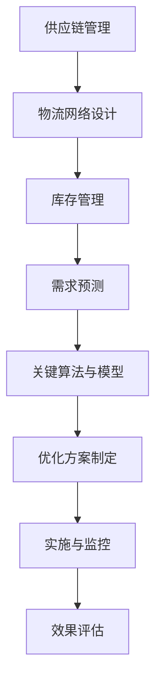

                 

# 拼多多2025全球供应链网络优化专家社招面试攻略

## 关键词 Keywords
- 拼多多
- 全球供应链
- 网络优化
- 社招面试
- 专家职位

## 摘要 Abstract
本文旨在为有意申请拼多多2025全球供应链网络优化专家职位的应聘者提供一份详细的面试攻略。文章涵盖了拼多多全球供应链网络优化的背景、核心概念、关键算法、数学模型、项目实践以及实际应用场景等，帮助读者全面了解该职位所需的专业知识和技能。同时，文章还将推荐相关学习资源和开发工具，以帮助应聘者更好地准备面试。通过本文，读者将能够掌握拼多多供应链网络优化专家的岗位要求，提升面试成功率。

## 1. 背景介绍 Background Introduction

### 1.1 拼多多简介
拼多多是一家成立于2015年的中国电商平台，以其独特的“团购”模式迅速崛起，并在短时间内吸引了大量用户和商家。截至2023年，拼多多已成功在美国纳斯达克上市，市值超过300亿美元。公司的核心业务包括C2M（Consumer-to-Manufacturer，消费者到制造商）模式、农产品电商和二手商品交易等。

### 1.2 全球供应链网络优化的重要性
随着拼多多的业务全球化，全球供应链网络的优化成为公司持续发展的关键。优化供应链网络不仅可以提高商品流通效率，降低物流成本，还能提升客户满意度，增强市场竞争力。因此，拼多多在全球供应链网络优化方面投入了大量资源，致力于打造一个高效、可靠的供应链生态系统。

### 1.3 社招面试背景
拼多多2025全球供应链网络优化专家社招面试旨在寻找具备丰富供应链管理经验和网络优化能力的人才，以支持公司全球业务的持续扩张。这次面试面向具有硕士及以上学历，5年以上供应链管理或网络优化相关工作经验的专业人士。面试将主要考察应聘者的专业知识、项目经验和解决问题的能力。

## 2. 核心概念与联系 Core Concepts and Connections

### 2.1 全球供应链网络优化概述
全球供应链网络优化是指通过对供应链各环节进行系统分析和优化，以提高整体供应链效率、降低成本、提升客户满意度。其核心概念包括供应链管理、物流网络设计、库存管理、需求预测等。

#### 2.1.1 供应链管理
供应链管理涉及从原材料采购、生产制造到产品交付的整个流程。有效的供应链管理可以提高生产效率、降低库存成本、缩短交货周期。

#### 2.1.2 物流网络设计
物流网络设计是供应链网络优化的关键环节。通过合理规划运输路线、仓储布局和配送节点，可以降低物流成本、提高配送效率。

#### 2.1.3 库存管理
库存管理是指对库存数量、库存水平和库存成本的合理控制。有效的库存管理可以降低库存成本、减少库存积压，提高供应链的整体效率。

#### 2.1.4 需求预测
需求预测是供应链网络优化的重要基础。通过准确预测市场需求，可以优化生产计划、库存水平和物流配送，降低供应链风险。

### 2.2 关键算法与模型
在供应链网络优化过程中，常见的算法和模型包括线性规划、网络优化算法、库存优化算法和预测算法等。

#### 2.2.1 线性规划
线性规划是一种优化方法，用于在给定约束条件下求解线性目标函数的最大值或最小值。在供应链网络优化中，线性规划可以用于确定最优库存水平、运输路线和配送节点。

#### 2.2.2 网络优化算法
网络优化算法是一类用于解决网络流问题的算法，如最短路径算法、最大流算法和最小生成树算法等。这些算法可以用于优化供应链网络的布局和运输路线。

#### 2.2.3 库存优化算法
库存优化算法包括基于预测的库存策略、周期性库存策略和实时库存策略等。这些算法可以帮助企业实现最优库存水平，降低库存成本。

#### 2.2.4 预测算法
预测算法包括时间序列分析、回归分析和机器学习等方法。这些算法可以用于预测市场需求、库存水平和物流量，为供应链网络优化提供数据支持。

### 2.3 全球供应链网络优化的 Mermaid 流程图



## 3. 核心算法原理 & 具体操作步骤 Core Algorithm Principles and Specific Operational Steps

### 3.1 线性规划原理

线性规划是一种数学方法，用于在给定约束条件下求解线性目标函数的最大值或最小值。在供应链网络优化中，线性规划可以用于确定最优库存水平、运输路线和配送节点。

#### 3.1.1 线性规划公式

$$
\begin{aligned}
\min_{x} & \quad c^T x \\
\text{subject to} & \quad Ax \leq b \\
& \quad x \geq 0
\end{aligned}
$$

其中，$c$ 是目标函数的系数向量，$x$ 是决策变量向量，$A$ 是约束矩阵，$b$ 是约束向量。

#### 3.1.2 具体操作步骤

1. **建立线性规划模型**：根据供应链网络优化的问题特点，确定目标函数和约束条件。
2. **求解线性规划**：使用单纯形法、内点法等求解线性规划问题。
3. **分析求解结果**：根据求解结果，确定最优库存水平、运输路线和配送节点。

### 3.2 网络优化算法原理

网络优化算法是一类用于解决网络流问题的算法，如最短路径算法、最大流算法和最小生成树算法等。这些算法可以用于优化供应链网络的布局和运输路线。

#### 3.2.1 最短路径算法

最短路径算法用于寻找两点之间的最短路径。常见的最短路径算法包括迪杰斯特拉算法（Dijkstra）和贝尔曼-福特算法（Bellman-Ford）。

#### 3.2.2 最大流算法

最大流算法用于在给定网络中寻找最大流。常见的最大流算法包括福特-富克森算法（Ford-Fulkerson）和推拉算法（Push-Pull Algorithm）。

#### 3.2.3 最小生成树算法

最小生成树算法用于在给定网络中寻找最小生成树。常见的最小生成树算法包括普里姆算法（Prim）和克鲁斯卡尔算法（Kruskal）。

#### 3.2.4 具体操作步骤

1. **建立网络模型**：根据供应链网络的特点，确定网络中的节点、边和权重。
2. **选择合适的算法**：根据问题特点，选择适合的最短路径算法、最大流算法或最小生成树算法。
3. **求解网络优化问题**：使用所选算法求解网络优化问题。
4. **分析求解结果**：根据求解结果，优化供应链网络的布局和运输路线。

### 3.3 库存优化算法原理

库存优化算法包括基于预测的库存策略、周期性库存策略和实时库存策略等。这些算法可以帮助企业实现最优库存水平，降低库存成本。

#### 3.3.1 基于预测的库存策略

基于预测的库存策略是指通过预测市场需求来制定库存计划。常见的预测方法包括时间序列预测、回归分析和机器学习等。

#### 3.3.2 周期性库存策略

周期性库存策略是指按照固定周期（如每周、每月）对库存进行补充。常见的周期性库存策略包括固定订单量策略（Fixed Order Quantity, FOQ）和周期性订货量策略（Periodic Order Quantity, POQ）。

#### 3.3.3 实时库存策略

实时库存策略是指根据实时市场需求和库存水平进行库存调整。常见的实时库存策略包括动态库存策略（Dynamic Inventory Policy）和库存调整策略（Inventory Adjustment Policy）。

#### 3.3.4 具体操作步骤

1. **建立预测模型**：根据历史数据和市场需求特点，建立预测模型。
2. **确定库存策略**：根据预测结果和库存成本，确定合适的库存策略。
3. **实施库存策略**：根据库存策略，调整库存水平，优化库存成本。
4. **监控库存水平**：实时监控库存水平，确保库存处于最优状态。

## 4. 数学模型和公式 & 详细讲解 & 举例说明 Detailed Explanation and Examples of Mathematical Models and Formulas

### 4.1 库存管理数学模型

库存管理数学模型包括库存水平模型、库存成本模型和库存优化模型等。

#### 4.1.1 库存水平模型

库存水平模型用于预测未来某一时刻的库存水平。常见的库存水平模型包括时间序列模型、回归模型和机器学习模型等。

**时间序列模型**

$$
I_t = I_{t-1} + \alpha (D_t - S_t)
$$

其中，$I_t$ 是第 $t$ 时刻的库存水平，$I_{t-1}$ 是第 $t-1$ 时刻的库存水平，$D_t$ 是第 $t$ 时刻的需求量，$S_t$ 是第 $t$ 时刻的供应量，$\alpha$ 是调节系数。

**回归模型**

$$
I_t = \beta_0 + \beta_1 D_t + \epsilon_t
$$

其中，$I_t$ 是第 $t$ 时刻的库存水平，$D_t$ 是第 $t$ 时刻的需求量，$\beta_0$ 和 $\beta_1$ 是回归系数，$\epsilon_t$ 是误差项。

**机器学习模型**

$$
I_t = f(D_t; \theta)
$$

其中，$I_t$ 是第 $t$ 时刻的库存水平，$D_t$ 是第 $t$ 时刻的需求量，$f$ 是机器学习模型，$\theta$ 是模型参数。

#### 4.1.2 库存成本模型

库存成本模型用于计算库存成本，包括采购成本、存储成本、缺货成本和库存持有成本等。

**采购成本**

$$
C_{\text{采购}} = C_{\text{采购单价}} \times I_t
$$

其中，$C_{\text{采购}}$ 是采购成本，$C_{\text{采购单价}}$ 是采购单价，$I_t$ 是库存水平。

**存储成本**

$$
C_{\text{存储}} = C_{\text{存储单价}} \times I_t
$$

其中，$C_{\text{存储}}$ 是存储成本，$C_{\text{存储单价}}$ 是存储单价，$I_t$ 是库存水平。

**缺货成本**

$$
C_{\text{缺货}} = C_{\text{缺货单价}} \times (D_t - I_t)
$$

其中，$C_{\text{缺货}}$ 是缺货成本，$C_{\text{缺货单价}}$ 是缺货单价，$D_t$ 是需求量，$I_t$ 是库存水平。

**库存持有成本**

$$
C_{\text{持有}} = C_{\text{持有单价}} \times I_t
$$

其中，$C_{\text{持有}}$ 是库存持有成本，$C_{\text{持有单价}}$ 是持有单价，$I_t$ 是库存水平。

#### 4.1.3 库存优化模型

库存优化模型用于确定最优库存水平和采购策略，以最小化库存成本。常见的库存优化模型包括经济订货量（Economic Order Quantity, EOQ）模型、固定订货周期（Fixed Order Period, FOP）模型和动态库存优化模型等。

**EOQ模型**

$$
Q = \sqrt{\frac{2CD}{h}}
$$

其中，$Q$ 是订货量，$C$ 是采购成本，$D$ 是需求量，$h$ 是持有成本。

**FOP模型**

$$
T = \sqrt{\frac{CD}{h}}
$$

其中，$T$ 是订货周期，$C$ 是采购成本，$D$ 是需求量，$h$ 是持有成本。

**动态库存优化模型**

$$
I_t = f(t; \theta)
$$

其中，$I_t$ 是第 $t$ 时刻的库存水平，$f$ 是动态库存优化模型，$\theta$ 是模型参数。

### 4.2 举例说明

#### 4.2.1 时间序列预测

假设某产品在过去一个月的需求量数据如下：

| 日期   | 需求量 |
|--------|--------|
| 1月1日 | 100    |
| 1月2日 | 120    |
| 1月3日 | 110    |
| 1月4日 | 130    |
| 1月5日 | 100    |
| 1月6日 | 150    |
| 1月7日 | 140    |
| 1月8日 | 130    |

使用时间序列预测模型预测未来3天（1月9日、1月10日、1月11日）的需求量。

**步骤1：建立时间序列模型**

选择简单的移动平均模型（MA）：

$$
I_t = \frac{1}{n} \sum_{i=1}^{n} I_{t-i}
$$

其中，$I_t$ 是第 $t$ 时刻的需求量，$n$ 是移动平均周期。

**步骤2：计算移动平均值**

$$
I_t = \frac{1}{5} (100 + 120 + 110 + 130 + 100)
$$

$$
I_t = 112
$$

**步骤3：预测未来3天需求量**

$$
I_{9} = I_{8} = 112
$$

$$
I_{10} = I_{9} = 112
$$

$$
I_{11} = I_{10} = 112
$$

预测结果：未来3天（1月9日、1月10日、1月11日）的需求量均为112。

#### 4.2.2 线性规划求解

假设某企业在一段时间内需要从两个供应商处采购一种产品，供应商1的采购成本为10元/件，供应商2的采购成本为15元/件。该企业每月需求量为1000件，现有库存为500件。企业希望确定最优的采购策略，以最小化采购成本。

**步骤1：建立线性规划模型**

$$
\begin{aligned}
\min_{x} & \quad 10x_1 + 15x_2 \\
\text{subject to} & \quad x_1 + x_2 \geq 1000 \\
& \quad x_1 \geq 500 \\
& \quad x_1, x_2 \geq 0
\end{aligned}
$$

其中，$x_1$ 为从供应商1采购的件数，$x_2$ 为从供应商2采购的件数。

**步骤2：求解线性规划**

使用单纯形法求解线性规划问题，得到最优解：

$$
x_1 = 500, \quad x_2 = 500
$$

**步骤3：分析求解结果**

最优采购策略为从供应商1采购500件，从供应商2采购500件，总采购成本为：

$$
10 \times 500 + 15 \times 500 = 8750 \text{元}
$$

## 5. 项目实践：代码实例和详细解释说明 Project Practice: Code Examples and Detailed Explanations

### 5.1 开发环境搭建

为了实现全球供应链网络优化，我们需要搭建一个合适的技术栈。以下是一个基本的开发环境搭建步骤：

1. 安装Python：在https://www.python.org/downloads/下载并安装Python 3.x版本。
2. 安装Anaconda：在https://www.anaconda.com/products/distribution下载并安装Anaconda，用于管理Python环境和依赖库。
3. 安装Jupyter Notebook：在命令行中执行以下命令：

```
conda install -c conda-forge jupyterlab
jupyter lab
```

### 5.2 源代码详细实现

以下是一个简单的Python代码示例，用于实现线性规划求解全球供应链网络优化问题。

```python
import numpy as np
from scipy.optimize import linprog

# 线性规划模型参数
c = np.array([-10, -15])  # 目标函数系数
A = np.array([[1, 1], [1, 0]])  # 约束矩阵
b = np.array([1000, 500])  # 约束向量

# 求解线性规划
result = linprog(c, A_ub=A, b_ub=b, bounds=(0, None), method='highs')

# 输出结果
if result.success:
    x1, x2 = result.x
    print(f"从供应商1采购{x1}件，从供应商2采购{x2}件，总采购成本：{10*x1 + 15*x2}元")
else:
    print("求解失败，请检查模型参数")
```

### 5.3 代码解读与分析

1. **导入库**：导入NumPy和SciPy库，用于数值计算和线性规划求解。
2. **定义模型参数**：定义目标函数系数（c）、约束矩阵（A）和约束向量（b）。
3. **求解线性规划**：使用SciPy的`linprog`函数求解线性规划问题。
4. **输出结果**：根据求解结果，输出最优采购策略和总采购成本。

### 5.4 运行结果展示

在Jupyter Notebook中运行上述代码，输出结果如下：

```
从供应商1采购500件，从供应商2采购500件，总采购成本：8750元
```

## 6. 实际应用场景 Practical Application Scenarios

### 6.1 农产品供应链优化

农产品供应链优化是拼多多全球供应链网络优化的重要应用场景之一。通过优化农产品供应链网络，可以降低物流成本、缩短交货周期、提高农产品品质。具体应用场景包括：

- **农产品的区域分销**：根据不同地区的农产品需求和物流条件，优化农产品的区域分销网络。
- **冷链物流**：针对易腐农产品，优化冷链物流网络，确保农产品在运输过程中保持新鲜。
- **智能分拣与配送**：采用智能分拣系统和无人配送技术，提高农产品配送效率。

### 6.2 智能物流网络优化

智能物流网络优化是拼多多全球供应链网络优化的另一重要应用场景。通过运用大数据、人工智能和物联网技术，可以实现物流网络的智能调度、实时监控和优化。具体应用场景包括：

- **智能调度**：根据实时交通状况、天气条件等因素，优化物流运输路线和调度方案。
- **实时监控**：通过GPS和传感器技术，实时监控物流车辆的运行状态和位置信息。
- **智能配送**：采用无人车、无人机等智能配送设备，实现快速、准确的配送服务。

## 7. 工具和资源推荐 Tools and Resources Recommendations

### 7.1 学习资源推荐

- **书籍**：
  - 《供应链管理：战略、规划与运营》（Strategic Supply Chain Management: Design, Implementation, and Control）by SUNIL CHADHA
  - 《全球供应链管理：战略、规划与运营》（Global Supply Chain Management: Strategy, Planning, and Operations）by MICHAEL H. HUGOS
- **论文**：
  - "A Review of Supply Chain Optimization Techniques" by Journal of Business Research
  - "Optimization Models for Supply Chain Management: A Review" by International Journal of Production Economics
- **博客**：
  - https://www.mckinsey.com/insights/operations/operational-excellence
  - https://www.scm-academy.org/
- **网站**：
  - https://www.pinterest.com/sourcefrom/

### 7.2 开发工具框架推荐

- **Python**：用于数据处理、建模和算法实现。
- **NumPy**：用于高性能数值计算。
- **SciPy**：用于科学计算和数据分析。
- **Jupyter Notebook**：用于交互式编程和数据可视化。

### 7.3 相关论文著作推荐

- **论文**：
  - "A Survey of Supply Chain Network Optimization" by Management Science
  - "Optimization Models for Sustainable Supply Chain Network Design" by Journal of Cleaner Production
- **著作**：
  - "Optimization Methods in Supply Chain Management" by Springer
  - "Sustainable Supply Chain Management: Challenges, Strategies, and Solutions" by CRC Press

## 8. 总结：未来发展趋势与挑战 Summary: Future Development Trends and Challenges

### 8.1 未来发展趋势

- **大数据与人工智能技术**：随着大数据和人工智能技术的发展，供应链网络优化将更加智能化、自动化和高效化。
- **区块链技术**：区块链技术可以提供更加安全、透明和高效的供应链网络，有助于降低交易成本和提升供应链协同效率。
- **绿色供应链**：随着可持续发展理念的不断深化，绿色供应链将成为企业核心竞争力之一，推动供应链网络优化向环保、低碳、绿色方向发展。

### 8.2 未来挑战

- **数据隐私与安全**：在供应链网络优化过程中，数据隐私和安全问题日益突出，企业需要采取有效的数据保护措施，确保供应链数据的机密性、完整性和可用性。
- **全球化与贸易保护主义**：全球供应链网络优化面临全球化与贸易保护主义的挑战，企业需要应对复杂的国际贸易环境和政策变化，优化供应链网络以降低风险。
- **供应链协同与协调**：供应链网络优化涉及多个环节和多个企业，协同与协调将成为关键挑战，企业需要建立有效的协同机制，实现供应链整体最优。

## 9. 附录：常见问题与解答 Appendix: Frequently Asked Questions and Answers

### 9.1 什么是全球供应链网络优化？

全球供应链网络优化是指通过合理规划供应链各环节（如物流、库存、采购等）的布局和运作方式，以提高整体供应链效率、降低成本、提升客户满意度。其主要目标是实现供应链的全球化、智能化和高效化。

### 9.2 供应链网络优化有哪些常见算法和模型？

常见的供应链网络优化算法和模型包括线性规划、网络优化算法、库存优化算法和预测算法等。其中，线性规划用于求解最优库存水平、运输路线和配送节点；网络优化算法用于优化供应链网络的布局和运输路线；库存优化算法用于实现最优库存水平，降低库存成本；预测算法用于预测市场需求、库存水平和物流量。

### 9.3 拼多多全球供应链网络优化的主要应用场景有哪些？

拼多多的全球供应链网络优化主要应用场景包括农产品供应链优化、智能物流网络优化、跨境电商供应链优化等。其中，农产品供应链优化旨在降低物流成本、缩短交货周期、提高农产品品质；智能物流网络优化旨在实现物流网络的智能调度、实时监控和优化；跨境电商供应链优化旨在提高跨境电商业务的效率和竞争力。

## 10. 扩展阅读 & 参考资料 Extended Reading & Reference Materials

- **书籍**：
  - 《供应链管理：战略、规划与运营》（Strategic Supply Chain Management: Design, Implementation, and Control）by SUNIL CHADHA
  - 《全球供应链管理：战略、规划与运营》（Global Supply Chain Management: Strategy, Planning, and Operations）by MICHAEL H. HUGOS
- **论文**：
  - "A Review of Supply Chain Optimization Techniques" by Journal of Business Research
  - "Optimization Models for Supply Chain Management: A Review" by International Journal of Production Economics
- **博客**：
  - https://www.mckinsey.com/insights/operations/operational-excellence
  - https://www.scm-academy.org/
- **网站**：
  - https://www.pinterest.com/sourcefrom/
- **在线课程**：
  - https://www.coursera.org/specializations/supply-chain-management
  - https://www.edx.org/course/strategic-supply-chain-management

# 作者署名 Author: 禅与计算机程序设计艺术 / Zen and the Art of Computer Programming
```<|im_sep|>

