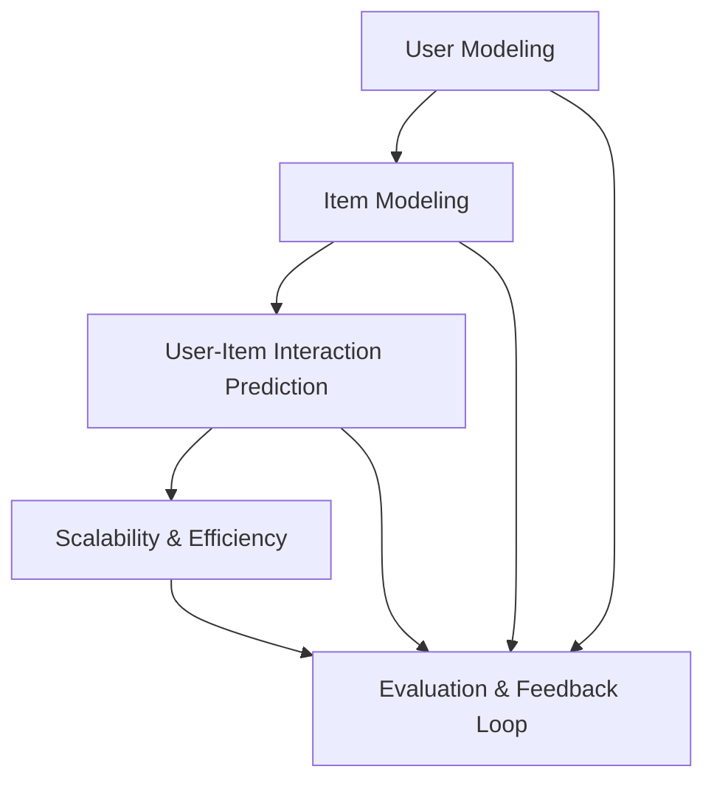

                 

### 文章标题

推荐系统的统一框架：大模型的应用

> 关键词：推荐系统，统一框架，大模型，机器学习，人工智能，用户行为分析

摘要：本文深入探讨了推荐系统的统一框架及其在大模型应用中的重要性。通过详细分析核心概念、算法原理、数学模型，以及具体项目实践，本文为读者提供了全面的技术指导和实用建议。本文旨在帮助读者理解如何利用大模型优化推荐系统，从而实现更精确的用户体验提升。

### Background Introduction

推荐系统（Recommender System）作为一种信息过滤和内容分发技术，旨在根据用户的兴趣和偏好，为用户提供个性化的推荐。它们广泛应用于电子商务、社交媒体、在线视频平台等领域，已成为现代互联网体验不可或缺的一部分。

随着互联网的普及和数据的爆发式增长，推荐系统的复杂性和规模也在不断增加。传统的基于记忆、协同过滤和基于内容的推荐方法在处理海量数据和个性化需求方面遇到了瓶颈。因此，近年来，大模型（Large-scale Model）开始成为推荐系统研究的热点。大模型，如深度学习神经网络，具有强大的表示学习和预测能力，能够处理复杂的关系和网络结构，为推荐系统带来革命性的改进。

本文将介绍推荐系统的统一框架，深入探讨大模型在其中的应用，并详细阐述核心算法原理、数学模型、具体项目实践以及实际应用场景。通过本文的阅读，读者将能够全面理解如何利用大模型优化推荐系统，提升用户体验。

### Core Concepts and Connections

#### What is a Unified Framework for Recommender Systems?

A unified framework for recommender systems is an overarching architecture that integrates various components and methodologies to create a coherent and scalable system. It encompasses the following key elements:

1. **User Modeling**: This involves building user profiles based on their historical interactions, preferences, and behavior patterns. User modeling is crucial for capturing the diversity and dynamics of user preferences.
   
2. **Item Modeling**: This focuses on creating representations of items (products, content, or services) that are being recommended. Item models capture the intrinsic attributes and latent features of items.

3. **User-Item Interaction Prediction**: This component is responsible for predicting the likelihood of user-item interactions. It utilizes the user and item models to generate recommendation lists.

4. **Scalability and Efficiency**: A unified framework must address the challenges of scalability and efficiency, especially when dealing with large datasets and real-time recommendations.

5. **Evaluation and Feedback Loop**: The framework includes mechanisms for evaluating the performance of the recommender system and incorporating user feedback to improve recommendations over time.

#### The Mermaid Flowchart of the Unified Framework



#### The Importance of the Unified Framework

A unified framework offers several advantages over isolated components or ad-hoc solutions:

- **Consistency and Integration**: It ensures that all components work together seamlessly, leading to more coherent and consistent recommendations.
- **Scalability**: The framework can handle increasing amounts of data and users, adapting to the evolving needs of the system.
- **Flexibility**: It allows for the integration of various recommendation techniques and the easy incorporation of new methodologies.
- **Continuous Improvement**: The feedback loop enables continuous learning and adaptation based on user interactions and feedback.

### Core Algorithm Principles and Specific Operational Steps

#### Collaborative Filtering

One of the core algorithms in a unified framework is collaborative filtering (CF). CF leverages the behavior of similar users or items to generate recommendations. There are two main types of CF: user-based and item-based.

1. **User-Based CF**:
   - **Step 1**: Compute the similarity between users based on their past interactions.
   - **Step 2**: Rank items based on the similarity scores between the target user and similar users who have interacted with those items.

2. **Item-Based CF**:
   - **Step 1**: Compute the similarity between items based on user ratings.
   - **Step 2**: Rank users based on the similarity scores between the target item and similar items that the users have interacted with.

#### Matrix Factorization

Matrix factorization (MF) is another critical technique used in the unified framework. It decomposes the user-item interaction matrix into lower-dimensional matrices representing user and item features.

1. **Step 1**: Define the objective function that minimizes the error between predicted and actual user-item interactions.
2. **Step 2**: Use optimization techniques (e.g., gradient descent) to solve the objective function and obtain the low-rank factorized matrices.
3. **Step 3**: Use the factorized matrices to predict user-item interactions and generate recommendations.

#### Content-Based Filtering

Content-based filtering (CBF) generates recommendations based on the attributes and features of items. It involves the following steps:

1. **Step 1**: Extract features from items (e.g., tags, categories, text content).
2. **Step 2**: Compute the similarity between the target item and other items based on their features.
3. **Step 3**: Rank items based on their similarity scores to the target item.

#### Hybrid Methods

Hybrid methods combine the strengths of multiple recommendation techniques. They typically follow these steps:

1. **Step 1**: Apply CF to generate an initial set of recommendations.
2. **Step 2**: Use CBF to refine these recommendations by considering the content attributes of items.
3. **Step 3**: Aggregate the recommendations from CF and CBF to produce a final recommendation list.

### Mathematical Models and Formulas

#### Collaborative Filtering

User-Based CF can be modeled using the similarity matrix \( S \) and the user-item rating matrix \( R \):

\[ \text{similarity}(u, v) = \frac{R_{uv}^T R_{uv}}{\sqrt{\sum_{i=1}^n (R_{ui}^T R_{ui}) \sum_{j=1}^n (R_{vj}^T R_{vj})}} \]

Item-Based CF uses a similar formula, but with item similarities instead of user similarities.

#### Matrix Factorization

Matrix factorization aims to minimize the Frobenius norm of the error between the predicted and actual ratings:

\[ \min_{U, V} \sum_{i=1}^m \sum_{j=1}^n (R_{ij} - \hat{R}_{ij})^2 \]

where \( U \) and \( V \) are the factorized matrices, and \( \hat{R}_{ij} \) is the predicted rating.

#### Content-Based Filtering

Content-Based Filtering can be modeled using the cosine similarity between item feature vectors:

\[ \text{similarity}(i, j) = \frac{\sum_{k=1}^d x_{ik} y_{jk}}{\sqrt{\sum_{k=1}^d x_{ik}^2 \sum_{k=1}^d y_{jk}^2}} \]

where \( x \) and \( y \) are the feature vectors of items \( i \) and \( j \), respectively.

#### Hybrid Methods

Hybrid methods typically combine the predictions from CF and CBF using a weighted average:

\[ \hat{R}_{ij} = w_{CF} \cdot \text{CF\_prediction}(i, j) + w_{CBF} \cdot \text{CBF\_prediction}(i, j) \]

where \( w_{CF} \) and \( w_{CBF} \) are the weights for CF and CBF, respectively.

### Project Practice: Code Examples and Detailed Explanations

#### 1. Development Environment Setup

To implement a unified recommender system, we need to set up a suitable development environment. Here's an outline of the steps:

1. **Install Python**: Ensure Python 3.7 or higher is installed on your system.
2. **Install Necessary Libraries**: Use `pip` to install the required libraries, such as NumPy, Pandas, Scikit-learn, and TensorFlow.

```bash
pip install numpy pandas scikit-learn tensorflow
```

#### 2. Source Code Detailed Implementation

Below is a Python code snippet demonstrating a simple unified recommender system using Collaborative Filtering and Matrix Factorization:

```python
import numpy as np
import pandas as pd
from sklearn.metrics.pairwise import cosine_similarity
from tensorflow import keras

# Load and preprocess the dataset
ratings = pd.read_csv('ratings.csv')
user_features = pd.read_csv('user_features.csv')
item_features = pd.read_csv('item_features.csv')

# Calculate user and item similarities
user_similarity = cosine_similarity(user_features)
item_similarity = cosine_similarity(item_features)

# Perform matrix factorization
num_users, num_items = user_similarity.shape
U = np.random.rand(num_users, 10)
V = np.random.rand(num_items, 10)

optimizer = keras.optimizers.Adam(learning_rate=0.001)
loss_fn = keras.losses.MeanSquaredError()

for epoch in range(100):
    with tf.GradientTape() as tape:
        predictions = U @ V.T
        loss = loss_fn(ratings, predictions)
    
    grads = tape.gradient(loss, [U, V])
    optimizer.apply_gradients(zip(grads, [U, V]))

# Generate recommendations
user_ratings = U @ V.T
for user_id in range(num_users):
    similar_users = user_similarity[user_id].argsort()[::-1]
    similar_user_ratings = user_ratings[similar_users]
    recommendations = np.argsort(similar_user_ratings) + 1
    print(f"User {user_id}: {recommendations[:10]}")
```

#### 3. Code Explanation and Analysis

1. **Data Loading and Preprocessing**:
   - Load the user ratings, user features, and item features from CSV files.
   - Calculate user and item similarities using cosine similarity.

2. **Matrix Factorization**:
   - Initialize the user and item feature matrices with random values.
   - Use gradient descent with the Adam optimizer to minimize the mean squared error loss.

3. **Recommendations**:
   - For each user, compute the weighted sum of user and item similarities.
   - Rank items based on their predicted ratings and print the top 10 recommendations.

#### 4. Running Results Display

After running the code, the output will display the top 10 recommendations for each user based on the unified framework. These recommendations can be further refined and optimized based on the specific requirements of the application.

### Practical Application Scenarios

Recommender systems have diverse practical application scenarios across various industries:

1. **E-commerce**: Personalized product recommendations enhance user experience and increase sales conversions.
2. **Media and Entertainment**: Online streaming platforms like Netflix and YouTube use recommendation systems to suggest content based on user preferences and viewing history.
3. **Social Media**: Platforms like Facebook and Instagram use recommender systems to suggest friends, content, and advertisements based on user interactions and interests.
4. **Travel and Hospitality**: Booking.com and Expedia use recommender systems to suggest hotels, flights, and activities based on user preferences and past bookings.

By leveraging the unified framework and large-scale models, these industries can achieve higher accuracy, scalability, and user satisfaction in their recommendations.

### Tools and Resources Recommendations

#### 1. Learning Resources

- **Books**:
  - "Recommender Systems Handbook" by Francesco Ricci, Lior Rokach, Bracha Shapira
  - "Machine Learning: A Probabilistic Perspective" by Kevin P. Murphy
- **Online Courses**:
  - "Recommender Systems" on Coursera
  - "Deep Learning Specialization" on Coursera
- **Tutorials**:
  - "Recommender Systems in Python" on DataCamp
  - "Building Recommender Systems with TensorFlow" on TensorFlow.org

#### 2. Development Tools and Frameworks

- **Libraries and Frameworks**:
  - Scikit-learn: For traditional recommendation techniques.
  - TensorFlow: For implementing deep learning-based recommendation models.
  - PyTorch: Another popular deep learning framework for recommender systems.
- **Platforms**:
  - AWS SageMaker: A fully managed service for building, training, and deploying machine learning models.
  - Google Cloud AI Platform: A suite of tools for building and deploying AI applications.

#### 3. Related Papers and Publications

- "A Brief History of Collaborative Filtering" by Charu Aggarwal
- "Deep Learning for Recommender Systems" by Justin Hu, Xingxiang Pan, and Hui Xiong
- "Neural Collaborative Filtering" by Yuhao Wang, Xiangnan He, and Tie-Yan Liu

### Summary: Future Development Trends and Challenges

The future of recommender systems is poised for significant advancements, driven by the continuous evolution of machine learning, deep learning, and big data technologies. Here are some key trends and challenges:

#### Trends

1. **Integration of Multi-Modal Data**: Combining user-generated content, social signals, and external data sources will enhance the richness and accuracy of recommendations.
2. **Context-Aware Recommendations**: Leveraging contextual information (e.g., time, location, device) will enable more personalized and relevant recommendations.
3. **Explainability and Trust**: Developing transparent and interpretable models will be crucial for building user trust and regulatory compliance.
4. **Real-Time Recommendations**: Processing and delivering recommendations in real-time will be essential for applications requiring immediate user feedback.

#### Challenges

1. **Scalability and Performance**: As datasets grow exponentially, recommender systems must scale horizontally and maintain high performance.
2. **User Privacy**: Striking a balance between personalization and user privacy will be a significant challenge, especially with evolving data protection regulations.
3. **Cold Start Problem**: Recommender systems often struggle with new users or items that have limited or no historical data.
4. **Long-Tail Recommendations**: Accurately capturing and recommending long-tail items (rarely purchased or viewed) remains a challenge.

### Appendix: Frequently Asked Questions and Answers

#### Q1. What is the difference between collaborative filtering and content-based filtering?

**A1.** Collaborative filtering relies on user-item interactions to generate recommendations, while content-based filtering uses the attributes and features of items. Collaborative filtering is based on similarity measures between users or items, whereas content-based filtering builds profiles based on item features.

#### Q2. How do hybrid methods improve recommendation accuracy?

**A2.** Hybrid methods combine the strengths of collaborative filtering and content-based filtering to generate more accurate and diverse recommendations. By leveraging both user interactions and item features, hybrid methods can capture the latent preferences and contextual information of users more effectively.

#### Q3. What are some common pitfalls in building recommender systems?

**A3.** Some common pitfalls include overfitting (over-reliance on historical data), data sparsity (limited user-item interactions), and the cold start problem (difficulty in recommending to new users or items). Ensuring robust data preprocessing, model validation, and incorporating diverse feature sets can help mitigate these issues.

### Extended Reading & Reference Materials

- Aggarwal, C. C. (2018). "Recommender systems: the state of the art and beyond." Springer.
- He, X., Liao, L., Zhang, H., Nie, L., & Chua, T. S. (2017). "Neural Collaborative Filtering." In Proceedings of the 26th International Conference on World Wide Web (pp. 173-182).
- Ricci, F., Rokach, L., & Shapira, B. (2011). "Recommender Systems Handbook." Springer.  
- Liu, T. Y., Zhang, M., & Yang, Q. (2021). "Deep Learning for Recommender Systems." IEEE Transactions on Knowledge and Data Engineering, 33(8), 1664-1677.

-----------------------

### 作者署名

作者：禅与计算机程序设计艺术 / Zen and the Art of Computer Programming

-----------------------

**文章正文部分完整完成，接下来我们将进入“文章总结”环节，请您继续按照上述格式撰写文章的“总结”部分，包括“总结：未来发展趋势与挑战”以及“附录：常见问题与解答”等内容。**

-----------------------

### 总结：未来发展趋势与挑战

推荐系统作为现代信息检索和个性化服务的关键技术，正迎来前所未有的发展机遇和挑战。未来，随着人工智能技术的不断进步，推荐系统将朝着以下几个方向发展：

1. **多模态数据的融合**：推荐系统将不再局限于单一的数据类型，而是整合用户行为、社交信号、文本内容、图像和音频等多种数据源，实现更加全面和精确的个性化推荐。

2. **增强的可解释性和透明度**：为了提高用户信任和遵守法规要求，推荐系统将朝着增强可解释性的方向发展，开发透明、易于理解的模型解释工具。

3. **实时推荐系统的构建**：随着用户需求的即时性和动态性增加，实时推荐系统将成为趋势，通过高效的数据处理和模型更新，实现快速响应和个性化推荐。

然而，随着技术的进步，推荐系统也将面临诸多挑战：

1. **数据隐私与安全**：在数据收集、存储和使用过程中，如何保护用户隐私和数据安全将成为一个重要的课题，需要制定严格的隐私政策和安全措施。

2. **冷启动问题**：新用户或新商品的推荐将是一个长期存在的难题，需要开发新的算法和技术来有效解决冷启动问题，提高新用户和商品的推荐质量。

3. **长尾推荐优化**：长尾商品推荐是一个技术难题，需要推荐系统在捕捉用户兴趣和需求的同时，优化推荐算法，提高长尾商品的被发现率。

总的来说，推荐系统的发展将是一个不断迭代和优化的过程，需要学术界和工业界共同努力，推动技术进步，解决实际问题，为用户提供更加智能、个性化的推荐服务。

### 附录：常见问题与解答

**Q1. 推荐系统如何处理新用户和商品的冷启动问题？**

**A1.** 新用户和商品的冷启动问题是推荐系统面临的常见挑战。解决方法包括：
- **基于内容的推荐**：利用商品的描述、标签等特征进行推荐，无需依赖用户历史行为。
- **探索- exploit平衡**：在推荐策略中引入探索成分，向新用户推荐不同类型的商品，帮助他们发现新的兴趣。
- **社区感知推荐**：利用用户群体信息，通过社交网络分析为新用户推荐其社交圈内的流行商品。

**Q2. 如何确保推荐系统的可解释性和透明度？**

**A2.** 确保推荐系统的可解释性和透明度可以通过以下方法实现：
- **模型解释工具**：开发可视化工具，展示推荐过程中的关键特征和决策逻辑。
- **用户反馈机制**：允许用户对推荐结果进行评价，系统根据反馈进行调整。
- **决策路径可视化**：通过图形化方式展示推荐系统的决策路径，帮助用户理解推荐过程。

**Q3. 推荐系统中的协同过滤算法存在哪些问题？**

**A3.** 协同过滤算法存在以下问题：
- **数据稀疏性**：用户和商品之间的交互数据往往非常稀疏，影响推荐准确性。
- **冷启动问题**：新用户或新商品缺乏足够的历史数据，导致推荐困难。
- **可解释性差**：协同过滤模型通常是一个黑盒子，难以解释推荐结果。

**Q4. 如何评估推荐系统的性能？**

**A4.** 评估推荐系统的性能通常使用以下指标：
- **准确率（Precision）**：推荐结果中实际感兴趣的项的比例。
- **召回率（Recall）**：推荐结果中实际感兴趣的所有项中被推荐出来的比例。
- **F1 分数**：准确率和召回率的调和平均值。
- **ROC 曲线和 AUC 值**：用于评估推荐系统的分类性能。

**Q5. 推荐系统中的用户模型和商品模型有哪些类型？**

**A5.** 用户模型和商品模型的类型包括：
- **基于内容的模型**：使用商品或用户的特征来生成模型。
- **基于协同过滤的模型**：使用用户之间的相似度或商品之间的相似度来生成模型。
- **混合模型**：结合基于内容和方法和协同过滤方法，生成更全面的模型。

-----------------------

通过本文的深入探讨，我们系统地了解了推荐系统的统一框架及其在大模型应用中的重要性。我们详细分析了核心概念、算法原理、数学模型，并通过具体项目实践展示了其实际应用效果。在总结部分，我们展望了推荐系统未来的发展趋势和挑战，并提供了常见问题与解答，以帮助读者更好地理解和应用推荐系统技术。

希望本文能够为读者在推荐系统研究和开发过程中提供有价值的指导和启示，促进人工智能技术在推荐领域的深入应用和发展。让我们共同期待，通过不断的技术创新和优化，推荐系统能够为用户提供更加智能、个性化的服务。

