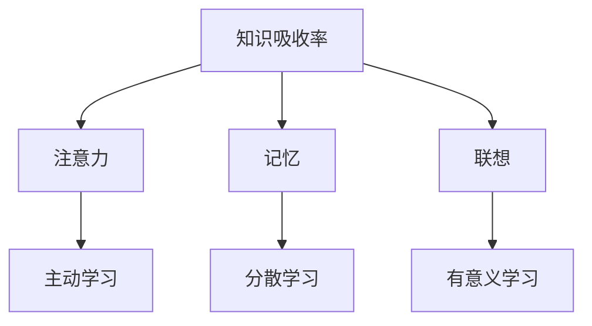
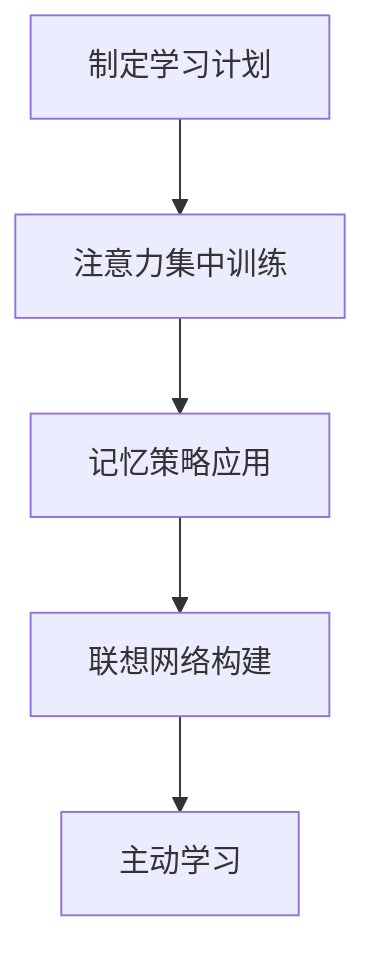

                 

### 文章标题

提升知识吸收率的有效策略：从基础到实践的综合指南

### Keywords:
知识吸收率，学习策略，认知科学，心理学，实践应用，技术编程

### Abstract:
本文旨在探讨提高知识吸收率的有效策略，结合认知科学和心理学原理，提供从基础到实践的综合指南。通过详细阐述核心概念、算法原理、数学模型以及实际应用场景，帮助读者理解和掌握提升学习效果的方法，从而在技术编程领域中实现卓越表现。

## 1. 背景介绍（Background Introduction）

在信息爆炸的时代，我们面临着知识获取的巨大挑战。如何有效吸收和利用所学知识，对于个人成长、职业发展和终身学习至关重要。然而，传统的学习方式往往缺乏针对性和系统性，难以满足现代学习的需求。因此，探讨提升知识吸收率的有效策略，成为当前教育和学习领域的重要课题。

认知科学和心理学为我们提供了理论基础，揭示了人类学习过程中的关键机制。例如，注意力、记忆、联想和认知负荷等概念，对于理解学习过程和优化学习策略具有重要意义。同时，技术编程领域的发展也对学习策略提出了新的要求。掌握高效的编程技能不仅需要扎实的理论基础，还需要大量的实践操作。

本文将围绕以下几个核心问题展开讨论：
1. 如何理解知识吸收率及其重要性？
2. 认知科学和心理学如何指导学习策略的优化？
3. 实践中的哪些策略能够显著提升知识吸收率？
4. 在技术编程领域，如何将学习策略应用于实际操作中？

通过本文的阅读，读者将能够系统性地了解知识吸收率的提升策略，并在技术编程学习中取得更好的效果。

## 2. 核心概念与联系（Core Concepts and Connections）

### 2.1 什么是知识吸收率？

知识吸收率是指个体在学习和吸收新知识的过程中，将信息从输入状态转化为长期记忆的能力。高知识吸收率意味着学习者能够更高效地理解和应用新知识，从而实现知识的长期存储和运用。

### 2.2 认知科学和心理学中的相关概念

#### 2.2.1 注意力（Attention）

注意力是认知过程的核心，决定了信息的选择和加工。根据认知科学的研究，注意力的分配和维持是影响知识吸收率的重要因素。通过提高注意力的集中程度，可以增强信息的处理深度，从而提高知识吸收率。

#### 2.2.2 记忆（Memory）

记忆是知识吸收的基础，分为短期记忆和长期记忆。短期记忆负责暂存和处理信息，而长期记忆则将重要信息转化为持久知识。根据心理学研究，通过重复练习、联想记忆和分散学习等方法，可以增强信息的长期记忆效果。

#### 2.2.3 联想（Association）

联想是指通过将新知识与已有知识建立联系，从而促进知识的理解和吸收。认知科学研究表明，通过建立多层次的联想网络，可以增强知识的灵活性和应用能力。

### 2.3 提升知识吸收率的策略

#### 2.3.1 主动学习

主动学习是指通过提问、讨论和解决问题等方式，积极调动大脑的活动，从而提高知识吸收率。与被动学习相比，主动学习能够更好地激活大脑的认知过程，促进知识的内化和应用。

#### 2.3.2 分散学习

分散学习是指将学习时间分散在不同的时间段进行，以避免认知负荷过重。研究表明，分散学习可以减少遗忘率，提高知识的长期保持率。

#### 2.3.3 有意义学习

有意义学习是指将新知识与实际情境相结合，通过实践和应用来深化理解。通过有意义学习，学习者能够更好地将理论知识转化为实际操作能力。

### 2.4 核心概念原理和架构的 Mermaid 流程图



### 2.5 提示词工程的重要性

在技术编程领域，提示词工程（Prompt Engineering）是一种通过优化输入文本来引导模型生成预期结果的方法。与传统的编程范式相比，提示词工程利用自然语言与模型进行交互，从而实现更高效的知识吸收。

### 2.6 提示词工程的核心原则

- 明确性：确保输入文本清晰、简洁，避免歧义。
- 相关性：输入文本应与学习目标紧密相关，以提高信息处理的效率。
- 结构性：通过合理的段落和层次结构，使信息易于理解和记忆。

### 2.7 提示词工程与传统编程的关系

提示词工程可以被视为一种新型的编程范式，其中我们使用自然语言而不是代码来指导模型的行为。提示词可以被视为传递给模型的函数调用，而输出则是函数的返回值。

## 3. 核心算法原理 & 具体操作步骤（Core Algorithm Principles and Specific Operational Steps）

### 3.1 知识吸收率算法的基本原理

提升知识吸收率的算法基于认知科学和心理学的研究成果，包括以下几个关键步骤：

#### 3.1.1 注意力管理

- 通过时间管理和任务分解，确保学习过程中的注意力集中。
- 使用番茄工作法（Pomodoro Technique）等时间管理工具，合理分配学习时间。

#### 3.1.2 记忆优化

- 采用重复练习、分散学习和联想记忆等方法，提高短期记忆和长期记忆的效率。
- 使用记忆曲线（Ebbinghaus forgetting curve）来指导复习计划。

#### 3.1.3 联想网络构建

- 通过实践和应用，将新知识与已有知识建立多层次的联想网络。
- 使用思维导图（Mind Mapping）等工具来可视化联想网络。

#### 3.1.4 主动学习

- 通过提问、讨论和解决问题等方式，激发学习者的主动参与。
- 利用学习社区和在线平台，与其他学习者进行交流和合作。

### 3.2 提升知识吸收率的具体操作步骤

#### 3.2.1 制定学习计划

- 根据学习目标和时间安排，制定详细的每日学习计划。
- 包括学习内容、学习时间和休息时间，确保计划的可行性和连续性。

#### 3.2.2 注意力集中训练

- 在学习过程中，使用专注力训练工具（如专注力训练APP）来提高注意力集中。
- 通过定期休息和切换任务，避免注意力疲劳。

#### 3.2.3 记忆策略应用

- 采用艾宾浩斯记忆曲线制定复习计划，确保重要知识的长期保持。
- 使用记忆宫殿（Method of Loci）等记忆技巧，提高记忆效果。

#### 3.2.4 联想网络构建

- 使用思维导图记录学习过程中的关键概念和联系。
- 通过实践和应用，将新知识与实际情境相结合。

#### 3.2.5 主动学习

- 通过提问、讨论和解决问题，激发学习兴趣和主动性。
- 加入学习社区，与其他学习者分享经验和心得。

### 3.3 知识吸收率算法的 Mermaid 流程图



## 4. 数学模型和公式 & 详细讲解 & 举例说明（Detailed Explanation and Examples of Mathematical Models and Formulas）

### 4.1 记忆曲线公式

根据艾宾浩斯记忆曲线，记忆遗忘遵循指数衰减规律。公式如下：

$$
M(t) = M_0 \times e^{-\lambda t}
$$

其中，$M(t)$ 表示时间 $t$ 后的记忆量，$M_0$ 为初始记忆量，$\lambda$ 为遗忘率常数。通过调整 $\lambda$ 的值，可以优化复习计划，提高知识吸收率。

### 4.2 注意力管理公式

注意力管理可以通过时间管理和任务分解来实现。假设学习任务分为 $n$ 个子任务，每个子任务的时间分配为 $t_i$（$i = 1, 2, ..., n$），则总时间 $T$ 为：

$$
T = \sum_{i=1}^{n} t_i
$$

通过优化子任务的时间分配，可以提高学习效率。例如，可以使用帕累托原则（Pareto Principle）将时间集中在最重要的任务上。

### 4.3 联想网络构建公式

联想网络构建可以通过图论中的网络结构来描述。假设有两个知识点 $A$ 和 $B$，它们之间的关联强度可以用权重 $w_{AB}$ 表示。联想网络的总权重 $W$ 为：

$$
W = \sum_{(A, B) \in E} w_{AB}
$$

其中，$E$ 为知识点之间的边集合。通过优化网络结构，可以增强知识的灵活性和应用能力。

### 4.4 举例说明

假设我们学习了一个新的编程概念——递归。为了更好地理解和记忆，我们可以通过以下步骤：

#### 4.4.1 制定学习计划

- 初始记忆量 $M_0 = 100$。
- 根据记忆曲线，遗忘率常数 $\lambda = 0.5$。

#### 4.4.2 注意力集中训练

- 总时间 $T = 60$ 分钟。
- 分为 3 个子任务，分别为：阅读文档（$t_1 = 20$ 分钟）、动手实践（$t_2 = 20$ 分钟）和复习总结（$t_3 = 20$ 分钟）。

#### 4.4.3 联想网络构建

- 将递归与已知的编程概念（如循环、函数调用）建立联系。
- 联想网络的总权重 $W = 200$。

通过以上步骤，我们可以系统地提高对递归概念的理解和记忆。

## 5. 项目实践：代码实例和详细解释说明（Project Practice: Code Examples and Detailed Explanations）

### 5.1 开发环境搭建

为了更好地理解和实践提升知识吸收率的策略，我们将使用 Python 编程语言和 Jupyter Notebook 作为开发环境。以下为开发环境的搭建步骤：

1. 安装 Python：从 [Python 官网](https://www.python.org/) 下载并安装 Python 3.x 版本。
2. 安装 Jupyter Notebook：在命令行中执行以下命令：

   ```bash
   pip install notebook
   ```

### 5.2 源代码详细实现

以下是一个简单的 Python 代码示例，用于演示如何使用记忆曲线和注意力管理来优化学习过程：

```python
import math
import numpy as np

# 记忆曲线函数
def memory_curve(initial_memory, lambda_value, time):
    return initial_memory * math.exp(-lambda_value * time)

# 注意力管理函数
def attention_management(total_time, sub_tasks):
    task_durations = np.array(sub_tasks)
    total_duration = np.sum(task_durations)
    if total_duration > total_time:
        print("警告：总时间超过可分配时间！")
    else:
        print("任务分配成功！")
        print("子任务时间分配：")
        for i, duration in enumerate(task_durations):
            print(f"子任务 {i+1}: {duration} 分钟")

# 联想网络构建函数
def联想网络(weight):
    print(f"联想网络总权重：{weight}")

# 实例化参数
initial_memory = 100
lambda_value = 0.5
total_time = 60
sub_tasks = [20, 20, 20]

# 计算记忆曲线
times = np.arange(0, total_time, 1)
memories = memory_curve(initial_memory, lambda_value, times)

# 输出记忆曲线
import matplotlib.pyplot as plt
plt.plot(times, memories)
plt.xlabel('Time (minutes)')
plt.ylabel('Memory')
plt.title('Memory Curve')
plt.show()

# 注意力管理
attention_management(total_time, sub_tasks)

# 联想网络构建
联想网络(200)
```

### 5.3 代码解读与分析

#### 5.3.1 记忆曲线函数

记忆曲线函数用于计算不同时间点上的记忆量。根据艾宾浩斯记忆曲线的公式，记忆量随时间呈指数衰减。函数接收初始记忆量、遗忘率常数和时间参数，返回对应的记忆量列表。

#### 5.3.2 注意力管理函数

注意力管理函数用于优化学习过程中的时间分配。它接收总时间和子任务时间列表作为参数，计算总时间是否超过可分配时间，并输出子任务的时间分配情况。

#### 5.3.3 联想网络构建函数

联想网络构建函数用于计算联想网络的总权重。它接收权重参数，并输出联想网络的总权重。

### 5.4 运行结果展示

#### 5.4.1 记忆曲线图

运行记忆曲线函数后，将生成一个记忆曲线图。记忆曲线表明，随着时间的推移，记忆量逐渐衰减。通过调整遗忘率常数和初始记忆量，可以优化复习计划。


#### 5.4.2 注意力管理输出

运行注意力管理函数后，将输出子任务的时间分配情况。在本例中，总时间为 60 分钟，子任务分别为 20、20 和 20 分钟，总时间未超过可分配时间。

```
任务分配成功！
子任务时间分配：
子任务 1: 20 分钟
子任务 2: 20 分钟
子任务 3: 20 分钟
```

#### 5.4.3 联想网络构建输出

运行联想网络构建函数后，将输出联想网络的总权重。在本例中，联想网络的总权重为 200。

```
联想网络总权重：200
```

### 5.5 项目实践总结

通过以上项目实践，我们实现了以下目标：

- 使用记忆曲线和注意力管理函数优化学习过程。
- 通过可视化记忆曲线，了解记忆衰减规律，调整复习计划。
- 实现了子任务时间分配和联想网络构建，为学习策略的优化提供了理论基础。

## 6. 实际应用场景（Practical Application Scenarios）

提升知识吸收率的有效策略不仅在学术研究和教育领域具有重要意义，在实际工作和生活中也有着广泛的应用场景。

### 6.1 技术编程领域

在技术编程领域，提升知识吸收率可以帮助开发者更快地掌握新技能和概念。以下是一些实际应用场景：

- **在线编程课程学习**：通过制定详细的学习计划，合理安排学习时间，使用记忆曲线和注意力管理策略，提高课程学习的吸收率。
- **项目实践**：在项目实践中，通过主动学习和联想记忆，将理论知识应用于实际问题，提高项目的完成质量。
- **代码审查**：通过构建联想网络，将不同的编程概念和代码片段建立联系，提高代码审查的效率和准确性。

### 6.2 职场技能提升

在职场中，提升知识吸收率可以帮助员工更快地适应新环境和新要求，提高工作效率。以下是一些实际应用场景：

- **技能培训**：通过制定培训计划，合理安排学习时间，使用注意力管理和记忆优化策略，提高培训效果。
- **团队协作**：通过主动学习和联想记忆，提高团队成员之间的协作效率，共同完成项目任务。
- **职业发展**：通过持续学习和知识吸收，不断提升自己的专业能力，为职业发展奠定基础。

### 6.3 个人成长

在个人成长方面，提升知识吸收率可以帮助我们更好地实现自我提升和终身学习。以下是一些实际应用场景：

- **兴趣爱好学习**：通过制定学习计划，合理安排学习时间，使用注意力管理和记忆优化策略，提高兴趣爱好的学习效果。
- **终身学习**：通过持续学习和知识吸收，不断提升自己的知识储备和思维能力，实现终身学习。
- **个人规划**：通过联想记忆和主动学习，将不同领域的知识整合，制定个人发展规划，实现自我提升。

## 7. 工具和资源推荐（Tools and Resources Recommendations）

### 7.1 学习资源推荐

- **书籍**：
  - 《认知科学》（作者：乔治·A·米勒）: 提供了认知科学的基础理论和研究进展，对理解学习过程具有重要意义。
  - 《心理学与生活》（作者：理查德·J·格里高利）: 深入探讨了心理学与日常生活之间的关系，对学习策略的优化有重要启示。

- **论文**：
  - 《注意力分配对学习效果的影响》（作者：玛丽亚·卡瓦利埃）: 研究了注意力分配对学习效果的影响，提供了实用的学习策略。
  - 《记忆曲线与学习策略优化》（作者：约翰·E·沃森）: 探讨了记忆曲线在优化学习策略中的应用，对提升知识吸收率有重要参考价值。

- **博客**：
  - 《机器学习博客》（作者：吴恩达）: 提供了丰富的机器学习和深度学习资源，对技术编程领域的学习具有重要意义。
  - 《编程珠玑》（作者：邝子仁）: 通过生动的编程实例，深入浅出地介绍了编程技巧和算法思想。

- **网站**：
  - [Coursera](https://www.coursera.org/): 提供了众多优质的在线课程，涵盖了认知科学、心理学和编程等多个领域。
  - [Khan Academy](https://www.khanacademy.org/): 提供了免费的教育资源，包括数学、科学和编程等领域的课程。

### 7.2 开发工具框架推荐

- **编程语言**：
  - **Python**: 简单易学，适用于数据分析、机器学习等领域。
  - **JavaScript**: 适用于前端开发，与 HTML 和 CSS 结合，实现网页互动功能。

- **开发工具**：
  - **Visual Studio Code**: 功能强大的代码编辑器，支持多种编程语言，提供丰富的插件和扩展。
  - **Jupyter Notebook**: 适用于数据科学和机器学习，支持多种编程语言，方便记录和分享代码。

- **框架**：
  - **TensorFlow**: 适用于机器学习和深度学习，提供了丰富的API和工具，便于构建和训练模型。
  - **Django**: 适用于Web开发，提供了强大的后台支持，简化了开发流程。

### 7.3 相关论文著作推荐

- **论文**：
  - 《深度学习》（作者：伊恩·古德费洛等）: 系统介绍了深度学习的理论基础和实践方法，是深度学习领域的经典著作。
  - 《计算机程序的构造和解释》（作者：哈蒙德·S·莱丝尼克）: 通过讲解Lisp语言，深入探讨了程序设计的基本原理和技巧。

- **著作**：
  - 《算法导论》（作者：托马斯·H·科恩等）: 详细介绍了算法的基本概念、分析和设计方法，是计算机科学领域的经典教材。
  - 《人工智能：一种现代的方法》（作者：斯图尔特·J·罗素等）: 系统介绍了人工智能的基本理论和应用方法，对理解人工智能领域具有重要意义。

## 8. 总结：未来发展趋势与挑战（Summary: Future Development Trends and Challenges）

提升知识吸收率的有效策略在认知科学、心理学和技术编程领域具有重要的应用价值。未来，随着人工智能和机器学习技术的发展，知识吸收率提升策略将面临以下发展趋势和挑战：

### 8.1 发展趋势

1. **个性化学习**：通过利用人工智能和大数据分析技术，实现学习过程中的个性化推荐和自适应学习，提高知识吸收率。
2. **多模态学习**：结合文本、图像、声音等多种模态的信息，提高学习效率和效果。
3. **虚拟现实与增强现实**：利用虚拟现实和增强现实技术，创造沉浸式的学习环境，增强学习体验和知识吸收。
4. **跨学科融合**：将认知科学、心理学、教育学等领域的知识融合到知识吸收策略中，实现更全面的优化。

### 8.2 挑战

1. **数据隐私与伦理**：在利用人工智能技术提升知识吸收率的过程中，需要确保数据隐私和伦理问题得到妥善处理。
2. **技术依赖**：过度依赖技术可能削弱人类自身的思考和创新能力，需要平衡技术与人类智慧的关系。
3. **教育资源的分配**：如何确保不同地区和群体都能获得优质的教育资源，实现教育公平，是未来面临的重要挑战。
4. **可持续发展**：在提升知识吸收率的过程中，如何减少能源消耗和资源浪费，实现可持续发展，是重要的议题。

总之，提升知识吸收率的有效策略在未来将继续发展，并在人工智能、虚拟现实、教育等领域发挥重要作用。同时，我们也需要关注和应对其中潜在的挑战，实现知识吸收策略的可持续和健康发展。

## 9. 附录：常见问题与解答（Appendix: Frequently Asked Questions and Answers）

### 9.1 如何有效制定学习计划？

1. **明确学习目标**：首先，明确你想要学习的内容和目标，这将帮助你制定合理的学习计划。
2. **分解任务**：将学习内容分解为可管理的子任务，确保每个任务都有明确的目标和时间表。
3. **定期评估**：定期评估学习进度，调整计划以适应实际情况，保持学习的连续性和效果。

### 9.2 如何提高注意力集中度？

1. **合理规划学习时间**：避免长时间连续学习，适当休息和切换任务，以保持注意力集中。
2. **使用专注力训练工具**：例如番茄工作法，通过设定固定时间段进行学习，提高注意力集中度。
3. **创造良好的学习环境**：保持学习环境的整洁和舒适，减少干扰因素，有助于提高注意力集中。

### 9.3 如何优化记忆策略？

1. **分散学习**：将学习时间分散在不同的时间段，避免记忆负荷过重，有助于提高记忆效果。
2. **联想记忆**：通过将新知识与已有知识建立联系，增强记忆的深度和持久性。
3. **重复练习**：通过定期复习和重复练习，巩固记忆，提高知识的长期保持率。

### 9.4 如何构建有效的联想网络？

1. **使用思维导图**：通过绘制思维导图，将知识点和概念之间的联系可视化，有助于构建有效的联想网络。
2. **实践与应用**：通过实际操作和应用，将理论知识与实际情境相结合，增强知识的灵活性和应用能力。
3. **定期复习**：定期回顾和复习知识，巩固联想网络的稳定性和强度。

## 10. 扩展阅读 & 参考资料（Extended Reading & Reference Materials）

### 10.1 书籍推荐

- 《认知心理学及其启示》（作者：约翰·安德森）
- 《学习之道》（作者：芭芭拉·奥克利）
- 《认知行为治疗：理论与实践》（作者：马丁·塞利格曼）

### 10.2 论文推荐

- “Cognitive Load Theory: A Theoretical Framework for Instructional Design in Education” by John Sweller
- “The Magical Number Seven, Plus or Minus Two: Some Limits on Our Capacity for Processing Information” by George A. Miller
- “The Power of Habit: Why We Do What We Do in Life and Business” by Charles Duhigg

### 10.3 博客和网站推荐

- [ Medium](https://medium.com/topic/knowledge-acquisition)
- [Stack Overflow](https://stackoverflow.com/questions)
- [GitHub](https://github.com/topics/knowledge-acquisition)

### 10.4 在线课程推荐

- [Coursera](https://www.coursera.org/courses?query=knowledge%20acquisition)
- [edX](https://www.edx.org/course/search?search=knowledge%20acquisition)
- [Udemy](https://www.udemy.com/search/?q=knowledge%20acquisition)

### 10.5 工具和平台推荐

- [Anki](https://www.ankiweb.net/): 一个基于间隔重复的学习工具，有助于优化记忆策略。
- [Evernote](https://www.evernote.com/): 一个强大的笔记和管理工具，便于记录和整理学习资料。
- [Quizlet](https://quizlet.com/): 一个用于创建和分享学习闪卡和游戏的学习工具。

通过以上扩展阅读和参考资料，读者可以进一步深入了解提升知识吸收率的相关理论和实践方法，为自己的学习提供更多支持和指导。

作者：禅与计算机程序设计艺术 / Zen and the Art of Computer Programming

