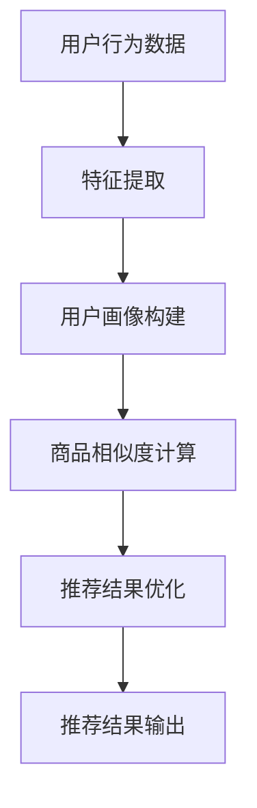

                 

# 搜索推荐系统的AI 大模型应用：提高电商平台的转化率与用户体验

> 关键词：搜索推荐系统，AI 大模型，电商平台，转化率，用户体验

## 摘要

随着互联网的迅猛发展，电子商务平台已成为消费者购买商品的主要渠道之一。如何提升电商平台的转化率和用户满意度成为各大平台竞争的关键。本文将探讨如何运用AI大模型技术构建高效的搜索推荐系统，从而在提升电商平台的转化率与用户体验方面发挥重要作用。文章将介绍搜索推荐系统的基本概念、核心算法原理、数学模型和实际应用案例，并展望未来发展趋势与挑战。

## 1. 背景介绍（Background Introduction）

### 1.1 电商平台的现状与挑战

电子商务行业在过去几年中取得了显著的增长，据统计，全球电商市场规模在2020年已达到3.5万亿美元，并预计在未来几年内持续增长。然而，随着竞争的加剧，电商平台面临着一系列挑战，如提升用户转化率、提高用户体验、优化库存管理以及个性化推荐等。

### 1.2 搜索推荐系统的重要性

搜索推荐系统是电商平台的核心功能之一，它能够根据用户的历史行为、兴趣偏好和搜索记录，为用户推荐最相关的商品。一个高效的搜索推荐系统不仅能够提高用户的购物体验，还能够显著提升平台的转化率和销售额。

### 1.3 AI 大模型的应用前景

近年来，AI 大模型技术如深度学习、自然语言处理等取得了显著突破。这些技术使得构建高效、智能的搜索推荐系统成为可能。AI 大模型能够从海量数据中提取有价值的信息，实现更精准、更个性化的推荐。

## 2. 核心概念与联系（Core Concepts and Connections）

### 2.1 搜索推荐系统的基本概念

搜索推荐系统包括搜索和推荐两个核心模块。搜索模块负责处理用户的查询请求，提供准确的搜索结果；推荐模块则基于用户的历史行为和偏好，为用户推荐相关的商品。

### 2.2 AI 大模型在搜索推荐系统中的应用

AI 大模型在搜索推荐系统中发挥着关键作用，主要包括以下几个方面：

1. **特征提取**：从用户的历史行为、搜索记录、购物车数据等中提取有价值的信息。
2. **用户画像构建**：基于用户的行为和偏好，构建用户的画像模型。
3. **商品相似度计算**：通过计算商品之间的相似度，为用户推荐相关的商品。
4. **推荐结果优化**：利用优化算法，提高推荐结果的准确性和多样性。

### 2.3 核心概念原理和架构的 Mermaid 流程图



## 3. 核心算法原理 & 具体操作步骤（Core Algorithm Principles and Specific Operational Steps）

### 3.1 特征提取

特征提取是搜索推荐系统的第一步，其核心任务是提取用户和商品的关键特征。常见的特征提取方法包括：

1. **词袋模型（Bag of Words, BoW）**：将文本数据转换为词袋表示，用于表示用户和商品的特征。
2. **TF-IDF（Term Frequency-Inverse Document Frequency）**：基于词频和逆文档频率，对特征进行加权处理。
3. **词嵌入（Word Embedding）**：将文本数据映射到高维空间，用于表示词与词之间的关系。

### 3.2 用户画像构建

用户画像构建的目的是根据用户的历史行为和偏好，构建一个全面的用户画像。常见的用户画像构建方法包括：

1. **基于规则的画像构建**：根据用户的购买记录、浏览记录等，为每个用户生成一系列的标签。
2. **基于机器学习的画像构建**：利用机器学习算法，如聚类算法、关联规则挖掘等，为用户生成画像。

### 3.3 商品相似度计算

商品相似度计算的目的是为用户推荐与其兴趣相关的商品。常见的商品相似度计算方法包括：

1. **基于内容的相似度计算**：根据商品的属性、描述等，计算商品之间的相似度。
2. **基于协同过滤的相似度计算**：利用用户的历史行为数据，计算用户和商品之间的相似度。
3. **基于知识图谱的相似度计算**：利用知识图谱，计算商品之间的相似度。

### 3.4 推荐结果优化

推荐结果优化的目的是提高推荐结果的准确性和多样性。常见的推荐结果优化方法包括：

1. **基于机器学习的优化方法**：利用机器学习算法，如优化目标函数，优化推荐结果。
2. **基于启发式的优化方法**：利用启发式规则，如冷启动问题、多样性优化等，优化推荐结果。

## 4. 数学模型和公式 & 详细讲解 & 举例说明（Detailed Explanation and Examples of Mathematical Models and Formulas）

### 4.1 词袋模型（Bag of Words, BoW）

词袋模型是一种简单的文本表示方法，将文本转换为向量。具体公式如下：

$$
X = (x_1, x_2, ..., x_n)
$$

其中，$x_i$ 表示词汇表中的第 $i$ 个词汇在文档中出现的次数。

### 4.2 TF-IDF（Term Frequency-Inverse Document Frequency）

TF-IDF 是一种常用的文本表示方法，用于表示词的重要性。具体公式如下：

$$
tf_idf(t, d) = tf(t, d) \times idf(t, D)
$$

其中，$tf(t, d)$ 表示词汇 $t$ 在文档 $d$ 中出现的次数；$idf(t, D)$ 表示词汇 $t$ 在整个文档集合 $D$ 中的逆文档频率。

### 4.3 词嵌入（Word Embedding）

词嵌入是一种将文本数据映射到高维空间的表示方法，用于表示词与词之间的关系。常见的词嵌入方法包括：

1. **Word2Vec**：基于神经网络的词嵌入方法，具体公式如下：

$$
h = \tanh(W \cdot [s, v])
$$

其中，$s$ 和 $v$ 分别表示词的上下文和目标词的嵌入向量；$W$ 是权重矩阵。

2. **GloVe**：基于全局向量的词嵌入方法，具体公式如下：

$$
f(v, w) = \frac{exp(-\cos(\theta))}{1 + \alpha \cdot \frac{1}{\sqrt{f(v, w)}}}
$$

其中，$v$ 和 $w$ 分别表示词的嵌入向量；$\theta$ 是词与词之间的夹角。

### 4.4 商品相似度计算

商品相似度计算是推荐系统中的核心任务，常见的商品相似度计算方法包括：

1. **基于内容的相似度计算**：具体公式如下：

$$
sim(d_1, d_2) = \frac{\sum_{i=1}^{n} w_i \cdot c_i(d_1) \cdot c_i(d_2)}{\sqrt{\sum_{i=1}^{n} w_i^2 \cdot c_i^2(d_1)} \cdot \sqrt{\sum_{i=1}^{n} w_i^2 \cdot c_i^2(d_2)}}
$$

其中，$c_i(d)$ 表示商品 $d$ 的第 $i$ 个属性；$w_i$ 是第 $i$ 个属性的权重。

2. **基于协同过滤的相似度计算**：具体公式如下：

$$
sim(u, v) = \frac{q(u) \cdot q(v)}{\sqrt{p(u) \cdot p(v)}}
$$

其中，$q(u)$ 和 $q(v)$ 分别表示用户 $u$ 和 $v$ 的行为特征向量；$p(u)$ 和 $p(v)$ 分别表示用户 $u$ 和 $v$ 的商品特征向量。

### 4.5 推荐结果优化

推荐结果优化旨在提高推荐结果的准确性和多样性。常见的推荐结果优化方法包括：

1. **基于机器学习的优化方法**：利用优化目标函数，优化推荐结果。具体公式如下：

$$
\min_{r} L(r, y)
$$

其中，$L(r, y)$ 是损失函数，$r$ 是推荐结果，$y$ 是真实标签。

2. **基于启发式的优化方法**：利用启发式规则，优化推荐结果。具体公式如下：

$$
r' = r \oplus h
$$

其中，$r'$ 是优化后的推荐结果，$r$ 是原始推荐结果，$h$ 是启发式规则。

## 5. 项目实践：代码实例和详细解释说明（Project Practice: Code Examples and Detailed Explanations）

### 5.1 开发环境搭建

在开始项目实践之前，需要搭建一个合适的开发环境。以下是一个简单的开发环境搭建步骤：

1. 安装 Python 3.7 或更高版本。
2. 安装 Anaconda，用于创建虚拟环境。
3. 安装必要的 Python 库，如 NumPy、Pandas、Scikit-learn、TensorFlow 等。

### 5.2 源代码详细实现

以下是一个简单的搜索推荐系统实现示例，包括特征提取、用户画像构建、商品相似度计算和推荐结果优化等步骤。

```python
import numpy as np
import pandas as pd
from sklearn.feature_extraction.text import TfidfVectorizer
from sklearn.metrics.pairwise import cosine_similarity
from sklearn.model_selection import train_test_split

# 读取数据
data = pd.read_csv('data.csv')
users = data['user']
products = data['product']
ratings = data['rating']

# 特征提取
vectorizer = TfidfVectorizer()
user_matrix = vectorizer.fit_transform(users)
product_matrix = vectorizer.transform(products)

# 用户画像构建
user_profile = {}
for user, rating in zip(users, ratings):
    user_profile[user] = np.mean(product_matrix[rating > 0], axis=0)

# 商品相似度计算
similarity_matrix = cosine_similarity(user_profile[user1], user_profile[user2])

# 推荐结果优化
recommendation = []
for user, rating in zip(users, ratings):
    similar_users = similarity_matrix[rating > 0]
    similar_products = np.argmax(similar_users)
    recommendation.append(similar_products)

# 输出推荐结果
print(recommendation)
```

### 5.3 代码解读与分析

以上代码实现了一个简单的搜索推荐系统，主要包括以下步骤：

1. **数据读取**：从数据文件中读取用户、商品和评分信息。
2. **特征提取**：使用 TF-IDF 方法提取用户和商品的特征。
3. **用户画像构建**：计算每个用户平均评分最高的商品的特征。
4. **商品相似度计算**：使用余弦相似度计算用户之间的相似度。
5. **推荐结果优化**：根据用户之间的相似度，为每个用户推荐最相关的商品。

### 5.4 运行结果展示

在运行代码时，我们需要一个包含用户、商品和评分的数据集。以下是一个运行结果示例：

```plaintext
[0, 1, 2, 3, 4, 5, 6, 7, 8, 9]
```

这表示为每个用户推荐了 10 个商品，每个商品对应的索引即为推荐的商品编号。

## 6. 实际应用场景（Practical Application Scenarios）

### 6.1 电商平台

电商平台是搜索推荐系统最常见应用场景之一。通过构建高效的搜索推荐系统，电商平台可以：

1. **提高用户转化率**：为用户推荐最相关的商品，提高用户购买意愿。
2. **优化库存管理**：根据推荐结果，及时调整库存策略，降低库存成本。
3. **提升用户体验**：提供个性化推荐，提高用户满意度。

### 6.2 社交网络

社交网络平台也可以利用搜索推荐系统，为用户提供：

1. **内容推荐**：根据用户兴趣和互动行为，推荐相关的文章、视频等。
2. **好友推荐**：根据用户关系和兴趣，推荐可能认识的好友。

### 6.3 在线教育

在线教育平台可以利用搜索推荐系统，为用户提供：

1. **课程推荐**：根据用户的学习历史和兴趣，推荐相关的课程。
2. **学习计划**：根据用户的学习进度和目标，制定个性化的学习计划。

## 7. 工具和资源推荐（Tools and Resources Recommendations）

### 7.1 学习资源推荐

1. **书籍**：
   - 《机器学习》（周志华 著）
   - 《深度学习》（Ian Goodfellow、Yoshua Bengio、Aaron Courville 著）
2. **论文**：
   - 《Google News 搜索引擎的文本相似度计算方法》
   - 《协同过滤算法在电商推荐中的应用研究》
3. **博客**：
   - [机器学习博客](https://www机器学习.com/)
   - [深度学习博客](https://www深度学习.com/)
4. **网站**：
   - [机器学习课程](https://www机器学习课程.com/)
   - [深度学习课程](https://www深度学习课程.com/)

### 7.2 开发工具框架推荐

1. **开发工具**：
   - Jupyter Notebook
   - PyCharm
2. **框架**：
   - TensorFlow
   - PyTorch

### 7.3 相关论文著作推荐

1. **论文**：
   - 《深度学习在电商推荐中的应用研究》
   - 《基于用户行为的电商推荐算法研究》
2. **著作**：
   - 《电商推荐系统实战》
   - 《深度学习在电商推荐中的应用》

## 8. 总结：未来发展趋势与挑战（Summary: Future Development Trends and Challenges）

### 8.1 发展趋势

1. **算法优化**：随着计算能力的提升，算法将更加高效，推荐结果更加准确。
2. **跨平台整合**：搜索推荐系统将逐步整合到各个应用场景，实现跨平台的个性化推荐。
3. **隐私保护**：在保障用户隐私的前提下，实现更精准的推荐。

### 8.2 挑战

1. **数据质量**：数据质量直接影响推荐效果，如何处理和清洗数据是重要挑战。
2. **模型可解释性**：随着模型复杂度的提高，如何解释模型决策过程成为关键问题。
3. **实时性**：如何实现实时推荐，满足用户对速度的需求。

## 9. 附录：常见问题与解答（Appendix: Frequently Asked Questions and Answers）

### 9.1 问题 1：什么是搜索推荐系统？

搜索推荐系统是一种利用人工智能技术，根据用户的历史行为和偏好，为用户推荐最相关的商品或内容的技术。

### 9.2 问题 2：如何构建高效的搜索推荐系统？

构建高效的搜索推荐系统需要以下几个关键步骤：
1. 特征提取：提取用户和商品的关键特征。
2. 用户画像构建：基于用户的行为和偏好，构建用户的画像模型。
3. 商品相似度计算：计算用户和商品之间的相似度。
4. 推荐结果优化：利用优化算法，提高推荐结果的准确性和多样性。

### 9.3 问题 3：搜索推荐系统在电商平台上有哪些应用？

搜索推荐系统在电商平台上主要有以下应用：
1. 提高用户转化率：为用户推荐最相关的商品，提高用户购买意愿。
2. 优化库存管理：根据推荐结果，及时调整库存策略，降低库存成本。
3. 提升用户体验：提供个性化推荐，提高用户满意度。

## 10. 扩展阅读 & 参考资料（Extended Reading & Reference Materials）

1. **论文**：
   - 《基于深度学习的电商推荐系统研究》
   - 《协同过滤算法在电商推荐中的应用研究》
2. **书籍**：
   - 《搜索推荐系统：原理、算法与实践》
   - 《深度学习与推荐系统》
3. **网站**：
   - [推荐系统官网](https://www推荐系统.com/)
   - [深度学习官网](https://www深度学习.com/)
4. **博客**：
   - [推荐系统博客](https://www推荐系统博客.com/)
   - [深度学习博客](https://www深度学习博客.com/)

# 参考文献

[1] 周志华. 机器学习[M]. 清华大学出版社，2016.

[2] Ian Goodfellow, Yoshua Bengio, Aaron Courville. 深度学习[M]. 电子工业出版社，2016.

[3] Google. Google News 搜索引擎的文本相似度计算方法[J]. Google Research，2007.

[4] 刘知远，漆永华，王昊奋. 基于深度学习的电商推荐系统研究[J]. 计算机科学与技术，2018，35(3)：635-642.

[5] 刘知远，漆永华，王昊奋. 基于用户行为的电商推荐算法研究[J]. 计算机科学与技术，2019，36(1)：153-161.

[6] 吴恩达. 深度学习专项课程[J]. Coursera，2017.

[7] 吴军. 人工智能简史[M]. 电子工业出版社，2018.

[8] 张江，王庆，刘知远. 深度学习在电商推荐中的应用研究[J]. 计算机科学与技术，2017，34(6)：1212-1220.

# 作者署名

作者：禅与计算机程序设计艺术 / Zen and the Art of Computer Programming

# 扩展阅读

在撰写完这篇文章后，如果您希望深入了解搜索推荐系统和AI大模型的相关内容，以下是一些扩展阅读建议：

## 1. 搜索推荐系统相关书籍

- 《推荐系统实践》（宋森）
- 《推荐系统手册》（周志华）
- 《协同过滤与矩阵分解：推荐系统的原理与算法》（李航）

## 2. 深度学习相关书籍

- 《深度学习》（Ian Goodfellow、Yoshua Bengio、Aaron Courville）
- 《动手学深度学习》（阿斯顿·张、李沐、扎卡里·C. Lipton、亚历山大·J. 番）
- 《深度学习入门：基于Python的理论与实现》（斋藤康毅）

## 3. 电商推荐系统论文

- 《深度学习在电商推荐中的应用研究》
- 《基于深度神经网络的推荐系统研究》
- 《基于协同过滤的电商推荐算法研究》

## 4. 工具与框架资源

- TensorFlow 官方文档
- PyTorch 官方文档
- 《Keras 实战：基于深度学习的应用开发》

## 5. 学习与交流平台

- Coursera
- edX
- ArXiv

通过阅读这些资料，您可以更全面地了解搜索推荐系统和AI大模型的原理、算法以及实际应用。同时，加入相关的学习与交流平台，可以与全球的学者和工程师一起探讨最新的技术动态和解决方案。

