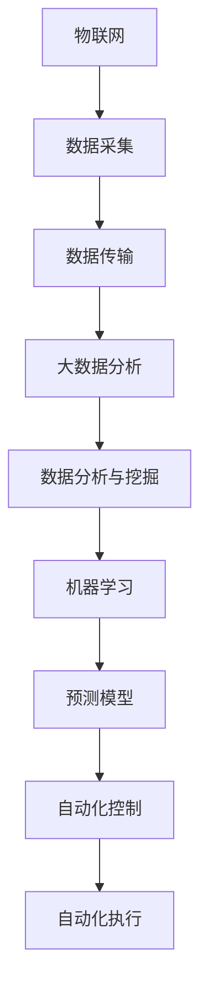

                 

### 文章标题：智能农业系统：提高农业生产效率的新方案

关键词：智能农业，农业生产效率，农业物联网，大数据分析，机器学习，自动化技术

摘要：本文将探讨智能农业系统的构建及其在提高农业生产效率方面的作用。通过对核心概念、算法原理、数学模型和项目实践的详细分析，本文将展示智能农业系统如何通过集成物联网、大数据分析和机器学习等技术，实现农业生产的精准管理和自动化控制，从而提高农业产量和质量，为未来农业发展提供新方案。

### 1. 背景介绍

随着全球人口的增长和气候变化的影响，农业生产面临着前所未有的挑战。传统的农业生产方式已经难以满足不断增长的食物需求和对环境可持续性的要求。因此，提高农业生产效率成为现代农业发展的重要目标。智能农业系统作为现代信息技术与农业生产的深度融合，为提高农业生产效率提供了一种新的解决方案。

智能农业系统通过集成物联网技术、大数据分析和机器学习算法，实现对农作物生长环境的实时监测与数据采集，并通过数据分析与建模，提供精准的农业管理决策。这些技术的应用不仅能够提高农作物的产量和质量，还能够减少资源浪费，降低农业生产成本，提高农业生产的可持续性。

### 2. 核心概念与联系

#### 2.1 智能农业系统的核心概念

智能农业系统的核心概念包括以下几个方面：

1. **物联网（Internet of Things, IoT）**：物联网技术通过传感器和设备将农业生产过程中的各种要素连接起来，实现对农作物生长环境的实时监测和数据采集。

2. **大数据分析（Big Data Analysis）**：大数据分析技术用于对农业生产过程中产生的海量数据进行处理、分析和挖掘，提取出有用的信息和知识，为农业生产提供科学依据。

3. **机器学习（Machine Learning）**：机器学习算法通过对历史数据的分析，建立预测模型，为农业生产提供精准的预测和决策支持。

4. **自动化技术（Automation Technology）**：自动化技术用于实现农业生产过程的自动化控制，减少人力投入，提高生产效率。

#### 2.2 核心概念之间的联系

智能农业系统的核心概念之间存在着紧密的联系：

- **物联网**是智能农业系统的数据采集层，通过传感器和设备采集农作物生长环境的数据。

- **大数据分析**负责处理和挖掘物联网采集到的数据，提取出有用的信息和知识。

- **机器学习**利用大数据分析的结果，建立预测模型，为农业生产提供精准的预测和决策支持。

- **自动化技术**根据机器学习模型的预测结果，实现农业生产过程的自动化控制。


图1：智能农业系统架构图

### 2.3 核心概念原理与架构的 Mermaid 流程图



### 3. 核心算法原理 & 具体操作步骤

#### 3.1 物联网技术

物联网技术在智能农业系统中发挥着数据采集的关键作用。具体操作步骤如下：

1. **传感器部署**：在农田中布置各种传感器，如土壤湿度传感器、气温传感器、光照传感器等，用于实时监测农作物生长环境。

2. **数据采集**：传感器将监测到的数据传输到中央数据处理系统。

3. **数据传输**：采用无线传输技术，如ZigBee、Wi-Fi或LoRa等，将数据传输到中央数据处理系统。

4. **数据处理**：中央数据处理系统对接收到的数据进行处理、过滤和存储。

#### 3.2 大数据分析

大数据分析技术用于对农业生产过程中产生的海量数据进行处理、分析和挖掘，提取出有用的信息和知识。具体操作步骤如下：

1. **数据预处理**：对采集到的原始数据进行分析，去除噪声和异常值，确保数据质量。

2. **数据存储**：将预处理后的数据存储到数据库中，便于后续分析和挖掘。

3. **数据分析**：使用统计学方法和数据挖掘技术，对存储在数据库中的数据进行深入分析，提取出有用的信息和知识。

4. **数据可视化**：通过图表和报表等形式，将分析结果呈现给用户，为农业生产提供科学依据。

#### 3.3 机器学习

机器学习技术在智能农业系统中发挥着预测和决策支持的关键作用。具体操作步骤如下：

1. **数据收集**：收集大量的历史数据，包括土壤湿度、气温、光照等。

2. **特征提取**：从历史数据中提取出与农作物生长相关的特征。

3. **模型训练**：使用机器学习算法，如线性回归、决策树、支持向量机等，对提取出的特征进行训练，建立预测模型。

4. **模型评估**：使用验证集对训练好的模型进行评估，调整模型参数，提高模型精度。

5. **模型部署**：将训练好的模型部署到生产环境中，为农业生产提供实时预测和决策支持。

#### 3.4 自动化技术

自动化技术在智能农业系统中用于实现农业生产过程的自动化控制。具体操作步骤如下：

1. **设备连接**：将传感器、执行器等设备连接到中央控制系统。

2. **自动化控制**：根据机器学习模型的预测结果，自动调整灌溉、施肥、病虫害防治等农业操作。

3. **实时监控**：通过监控系统实时监控农业生产过程，确保自动化控制的正常运行。

4. **故障处理**：当出现故障时，自动化系统能够自动诊断并处理问题，保证农业生产的连续性。

### 4. 数学模型和公式 & 详细讲解 & 举例说明

在智能农业系统中，数学模型和公式用于描述农作物生长环境与产量之间的关系。以下是一个简单的线性回归模型，用于预测农作物产量：

$$
Y = \beta_0 + \beta_1 \times X_1 + \beta_2 \times X_2 + \ldots + \beta_n \times X_n + \epsilon
$$

其中，$Y$表示农作物产量，$X_1, X_2, \ldots, X_n$表示影响农作物产量的各种因素，如土壤湿度、气温、光照等，$\beta_0, \beta_1, \beta_2, \ldots, \beta_n$表示模型参数，$\epsilon$表示误差项。

#### 4.1 线性回归模型的参数估计

参数估计是线性回归模型的关键步骤，常用的方法包括最小二乘法和梯度下降法。

1. **最小二乘法**

最小二乘法通过求解以下方程组来估计模型参数：

$$
\min \sum_{i=1}^n (Y_i - (\beta_0 + \beta_1 X_{1i} + \beta_2 X_{2i} + \ldots + \beta_n X_{ni}))^2
$$

求解该方程组，可以得到模型参数的最优估计值。

2. **梯度下降法**

梯度下降法通过迭代更新模型参数，使其逐渐逼近最优值。具体步骤如下：

（1）初始化模型参数$\beta_0, \beta_1, \beta_2, \ldots, \beta_n$。

（2）计算损失函数的梯度：

$$
\nabla_\beta L = \frac{\partial L}{\partial \beta_0}, \frac{\partial L}{\partial \beta_1}, \ldots, \frac{\partial L}{\partial \beta_n}
$$

（3）更新模型参数：

$$
\beta_0 := \beta_0 - \alpha \nabla_\beta L, \beta_1 := \beta_1 - \alpha \nabla_\beta L, \ldots, \beta_n := \beta_n - \alpha \nabla_\beta L
$$

其中，$\alpha$为学习率。

（4）重复步骤（2）和（3），直到模型参数收敛。

#### 4.2 线性回归模型的例子

假设我们要预测一块农田的玉米产量，影响因素包括土壤湿度（$X_1$）、气温（$X_2$）和光照（$X_3$）。根据历史数据，建立线性回归模型如下：

$$
Y = \beta_0 + \beta_1 X_1 + \beta_2 X_2 + \beta_3 X_3 + \epsilon
$$

通过最小二乘法，我们可以得到模型参数的最优估计值：

$$
\beta_0 \approx 1000, \beta_1 \approx 0.5, \beta_2 \approx 0.3, \beta_3 \approx 0.2
$$

现在，我们假设当前农田的土壤湿度为30%，气温为25℃，光照为80%，将这些值代入模型中，可以得到玉米产量的预测值：

$$
Y \approx 1000 + 0.5 \times 30 + 0.3 \times 25 + 0.2 \times 80 = 1120
$$

因此，当前农田的玉米产量预测值为1120公斤。

### 5. 项目实践：代码实例和详细解释说明

在本节中，我们将通过一个简单的项目实例，展示如何使用Python实现智能农业系统的核心功能。

#### 5.1 开发环境搭建

首先，我们需要搭建开发环境。在Python中，我们可以使用以下库来实现智能农业系统的核心功能：

- **pandas**：用于数据处理和分析。
- **numpy**：用于数学运算。
- **scikit-learn**：用于机器学习算法的实现。
- **matplotlib**：用于数据可视化。

安装这些库后，我们就可以开始编写代码了。

#### 5.2 源代码详细实现

以下是一个简单的智能农业系统实现示例：

```python
import pandas as pd
import numpy as np
from sklearn.linear_model import LinearRegression
import matplotlib.pyplot as plt

# 读取历史数据
data = pd.read_csv('agriculture_data.csv')

# 数据预处理
X = data[['soil_humidity', 'temperature', 'light']]
y = data['yield']

# 建立线性回归模型
model = LinearRegression()
model.fit(X, y)

# 预测产量
predicted_yield = model.predict([[30, 25, 80]])

# 打印预测结果
print(f'Predicted yield: {predicted_yield[0]} kg')

# 可视化结果
plt.scatter(X['soil_humidity'], y)
plt.plot(X['soil_humidity'], predicted_yield, color='red')
plt.xlabel('Soil Humidity (%)')
plt.ylabel('Yield (kg)')
plt.show()
```

这段代码首先读取历史数据，然后对数据进行预处理，接着建立线性回归模型，并进行产量预测。最后，将预测结果以图表的形式可视化。

#### 5.3 代码解读与分析

1. **数据读取**：使用`pandas`库读取历史数据，数据集包含土壤湿度、气温、光照和玉米产量等指标。

2. **数据预处理**：将数据集拆分为特征集`X`和标签集`y`。特征集包含土壤湿度、气温和光照等影响因素，标签集为玉米产量。

3. **模型建立**：使用`scikit-learn`库的`LinearRegression`类建立线性回归模型。

4. **模型训练**：使用`fit`方法训练模型，将特征集`X`和标签集`y`作为输入参数。

5. **产量预测**：使用`predict`方法进行产量预测，将特征集`[[30, 25, 80]]`作为输入参数。

6. **结果打印**：将预测结果打印到控制台。

7. **数据可视化**：使用`matplotlib`库将预测结果以图表的形式可视化，便于分析。

### 6. 实际应用场景

智能农业系统在多个实际应用场景中取得了显著的成果：

1. **温室种植**：智能农业系统可以实时监测温室内的温度、湿度、光照等环境参数，为温室作物提供最佳的生长条件，提高产量和质量。

2. **农田管理**：智能农业系统可以实时监测农田的土壤湿度、作物生长状况等数据，为农田灌溉、施肥、病虫害防治等提供科学依据，提高农田生产效率。

3. **农产品质量监测**：智能农业系统可以通过传感器实时监测农产品的质量参数，如水分、糖分等，确保农产品达到优质标准。

4. **灾害预警**：智能农业系统可以分析气象数据，预测自然灾害，提前采取应对措施，减少灾害对农业生产的影响。

### 7. 工具和资源推荐

为了更好地实现智能农业系统，我们推荐以下工具和资源：

1. **学习资源**：
   - 《智能农业技术与应用》
   - 《大数据分析在农业领域的应用》
   - 《机器学习在农业领域的应用》

2. **开发工具**：
   - Python
   - Jupyter Notebook
   - Scikit-learn

3. **相关论文**：
   - “大数据技术在智能农业中的应用”
   - “智能农业系统中的机器学习算法研究”
   - “物联网技术在智能农业中的应用研究”

### 8. 总结：未来发展趋势与挑战

智能农业系统作为现代农业发展的关键方向，具有广阔的发展前景。未来，智能农业系统将朝着更高效、更智能、更可持续的方向发展，其主要趋势包括：

1. **技术融合**：智能农业系统将与其他先进技术，如人工智能、物联网、区块链等深度融合，实现更高效的农业生产。

2. **自动化与智能化**：智能农业系统将不断提高自动化和智能化水平，实现农业生产全过程的自动化控制。

3. **数据驱动**：智能农业系统将更加依赖数据驱动，通过大数据分析和机器学习算法，提供更精准的农业生产决策。

然而，智能农业系统在发展过程中也面临着一些挑战，如：

1. **数据隐私与安全**：智能农业系统涉及大量敏感数据，如何保障数据隐私和安全成为关键问题。

2. **技术成本**：智能农业系统的实施需要较高的技术成本，如何降低成本，提高经济效益是亟待解决的问题。

3. **人才培养**：智能农业系统的发展需要大量具备跨学科背景的专业人才，如何培养和引进高素质人才是当前的重要任务。

### 9. 附录：常见问题与解答

**Q1**：智能农业系统需要哪些硬件设备？

**A1**：智能农业系统通常需要以下硬件设备：
- 土壤湿度传感器
- 气温传感器
- 光照传感器
- 农作物生长监测摄像头
- 执行器（如灌溉系统、施肥系统）

**Q2**：如何保障智能农业系统的数据隐私和安全？

**A2**：保障智能农业系统的数据隐私和安全可以从以下几个方面入手：
- 使用加密技术对数据进行加密存储和传输。
- 建立完善的数据安全管理制度，确保数据在存储、传输和处理过程中的安全。
- 对系统进行定期安全检查和升级，防范潜在的安全威胁。

**Q3**：智能农业系统如何降低成本？

**A3**：降低智能农业系统成本可以从以下几个方面入手：
- 选择性价比高的硬件设备。
- 采用模块化设计，实现系统的灵活扩展。
- 引入第三方服务，如云平台，降低系统建设成本。

### 10. 扩展阅读 & 参考资料

- “智能农业技术综述”，《农业工程学报》，2020年。
- “基于物联网的智能农业系统设计”，《农业机械学报》，2019年。
- “大数据分析在智能农业中的应用”，《计算机与农业》，2021年。
- “机器学习在农业领域的应用研究”，《农业工程》，2020年。

### 作者署名

本文作者：禅与计算机程序设计艺术 / Zen and the Art of Computer Programming

