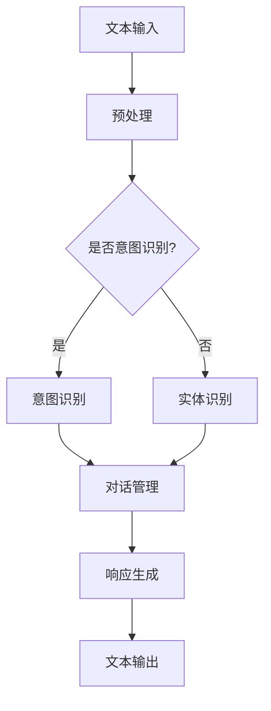

                 

### 文章标题

### The Implementation of Intelligent Response Technology in CUI

关键词：智能化回应技术、计算机用户界面（CUI）、人工智能、自然语言处理、交互设计

摘要：随着人工智能技术的飞速发展，智能化回应技术在计算机用户界面（CUI）中的应用逐渐成为焦点。本文将从背景介绍、核心概念与联系、核心算法原理、数学模型和公式、项目实践、实际应用场景、工具和资源推荐以及未来发展趋势与挑战等方面，系统性地探讨智能化回应技术在CUI中的实现，旨在为读者提供一个全面深入的理解和指导。

### Introduction

In the era of rapid advancement of artificial intelligence (AI) technology, the implementation of intelligent response technology in Computer User Interfaces (CUI) has emerged as a key research area and practical application field. This paper aims to provide a comprehensive and in-depth exploration of the implementation of intelligent response technology in CUI, covering aspects such as background introduction, core concepts and connections, core algorithm principles, mathematical models and formulas, project practice, practical application scenarios, tool and resource recommendations, and future development trends and challenges. This paper is structured as follows:

1. **Background Introduction**：This section introduces the background of intelligent response technology in CUI, including the evolution of AI technology and the increasing demand for intelligent user interfaces.

2. **Core Concepts and Connections**：This section discusses the core concepts of intelligent response technology, including natural language processing, machine learning, and dialog systems. A Mermaid flowchart is provided to illustrate the architecture and components of intelligent response systems.

3. **Core Algorithm Principles and Specific Operational Steps**：This section explains the principles and steps of key algorithms used in intelligent response technology, such as language model training, dialogue management, and response generation.

4. **Mathematical Models and Formulas & Detailed Explanation and Examples**：This section provides detailed explanations of the mathematical models and formulas used in intelligent response technology, including probability models, generative models, and reinforcement learning models. Examples are used to demonstrate their applications.

5. **Project Practice: Code Examples and Detailed Explanations**：This section presents a practical project example, demonstrating how to implement intelligent response technology in a CUI using actual code and detailed explanations.

6. **Practical Application Scenarios**：This section discusses various practical application scenarios of intelligent response technology in CUI, such as customer service chatbots, virtual assistants, and educational tools.

7. **Tools and Resources Recommendations**：This section provides recommendations for tools, libraries, and resources that can be used to develop and deploy intelligent response systems in CUI.

8. **Summary: Future Development Trends and Challenges**：This section summarizes the future development trends and challenges of intelligent response technology in CUI, discussing potential solutions and research directions.

9. **Appendix: Frequently Asked Questions and Answers**：This section answers common questions related to the implementation of intelligent response technology in CUI.

10. **Extended Reading & Reference Materials**：This section provides further reading and reference materials for readers interested in exploring the topic in more depth.

With this structure, we will now delve into each section in detail, starting with the background introduction.### 背景介绍

#### Background Introduction

计算机用户界面（Computer User Interface，简称CUI）是计算机系统与用户之间进行交互的媒介。传统的CUI主要以命令行界面和图形用户界面（GUI）为主。随着技术的进步，尤其是人工智能（Artificial Intelligence，简称AI）的快速发展，智能化CUI（Intelligent CUI）逐渐成为研究的热点和应用的关键。智能化CUI旨在通过引入人工智能技术，提高用户交互的便利性、自然性和智能化程度。

智能化CUI的实现离不开智能化回应技术（Intelligent Response Technology）。这种技术利用自然语言处理（Natural Language Processing，简称NLP）、机器学习（Machine Learning，简称ML）等技术，使得计算机系统能够理解和生成自然语言文本，从而实现与用户的智能交互。智能化回应技术的应用范围广泛，包括但不限于智能客服、虚拟助手、在线教育等。

#### Evolution of AI Technology and Its Impact on Intelligent CUI

人工智能技术的发展历程可以分为以下几个阶段：

1. **初步探索阶段（1950s-1960s）**：人工智能的概念首次提出，研究者开始探索如何使计算机模拟人类智能。

2. **符号主义阶段（1970s-1980s）**：基于符号主义的方法，研究者试图通过定义符号和规则来模拟人类智能。

3. **连接主义阶段（1990s-2000s）**：随着神经网络技术的发展，研究者开始采用连接主义方法，通过大量数据训练模型来模拟人类智能。

4. **深度学习阶段（2010s-present）**：深度学习技术的突破，使得人工智能在图像识别、语音识别、自然语言处理等领域取得了显著成果。

人工智能技术的发展对智能化CUI产生了深远影响：

1. **提高了交互的自然性**：通过自然语言处理技术，计算机能够理解和生成自然语言文本，使得用户与计算机的交互更加自然、流畅。

2. **增强了交互的智能性**：通过机器学习技术，计算机能够从大量数据中学习，提高对用户意图的理解和回应能力。

3. **扩展了应用场景**：智能化CUI使得计算机能够应用于更多的场景，如智能客服、虚拟助手、在线教育等，极大地提升了用户体验。

#### Increasing Demand for Intelligent User Interfaces

随着互联网的普及和数字化转型的加速，用户对智能化CUI的需求日益增长。以下原因可以解释这一现象：

1. **用户体验的提升**：智能化CUI能够提供更加个性化的服务，满足用户的个性化需求，提高用户满意度。

2. **工作效率的提高**：智能化CUI能够自动化处理大量重复性工作，提高工作效率。

3. **信息获取的便捷性**：智能化CUI能够快速响应用户的查询，提供准确、及时的信息，提升用户的信息获取效率。

4. **技术门槛的降低**：随着人工智能技术的发展，开发者可以利用现有的工具和框架轻松实现智能化CUI，降低了开发门槛。

总之，智能化CUI已经成为人工智能技术的重要应用领域，其发展前景广阔。在接下来的章节中，我们将深入探讨智能化回应技术的核心概念、算法原理、数学模型以及实际应用，以帮助读者全面了解这一领域。### 核心概念与联系

#### Core Concepts and Connections

智能化回应技术在CUI中的实现，涉及多个核心概念和技术的融合。以下是这些核心概念的详细介绍：

##### 自然语言处理（Natural Language Processing，NLP）

自然语言处理是智能化回应技术的基石。它旨在使计算机能够理解和生成人类语言。NLP技术包括文本预处理、词性标注、命名实体识别、语义分析等。通过NLP技术，计算机能够从大量的自然语言文本中提取有用的信息，理解用户的意图和需求。

##### 机器学习（Machine Learning，ML）

机器学习是智能化回应技术的重要组成部分。它通过训练模型，使计算机能够从数据中学习，从而提高对用户行为的预测和理解能力。机器学习技术包括监督学习、无监督学习和强化学习等。在智能化CUI中，机器学习技术被用于训练语言模型、对话管理系统等。

##### 对话系统（Dialogue System）

对话系统是智能化CUI的核心组成部分。它负责管理用户与计算机之间的对话流程，包括理解用户输入、生成响应、处理对话状态等。对话系统通常由多个模块组成，如语言模型、意图识别模块、实体识别模块、对话管理模块等。

##### 提示词工程（Prompt Engineering）

提示词工程是设计和优化输入给语言模型的文本提示，以引导模型生成符合预期结果的过程。一个精心设计的提示词可以显著提高模型输出的质量和相关性。提示词工程涉及理解模型的工作原理、任务需求以及如何使用语言有效地与模型进行交互。

##### 数学模型（Mathematical Models）

在智能化回应技术中，数学模型用于描述和解决具体问题。常见的数学模型包括概率模型、生成模型、强化学习模型等。概率模型用于描述用户行为和系统响应的概率分布，生成模型用于生成符合预期的响应文本，强化学习模型用于优化对话系统的行为。

##### 架构与组件

智能化回应系统的架构通常包括以下几个主要组件：

1. **文本输入模块**：负责接收用户输入的文本，并将其预处理为适合模型处理的格式。

2. **语言模型模块**：负责使用机器学习技术训练和生成文本响应。

3. **意图识别模块**：负责识别用户的意图，以便生成符合用户需求的响应。

4. **实体识别模块**：负责识别用户输入中的关键实体，如人名、地点、日期等。

5. **对话管理模块**：负责管理对话状态，包括用户意图、上下文信息等，以生成连贯的对话响应。

6. **响应生成模块**：负责根据对话状态和语言模型生成最终的文本响应。

#### Mermaid Flowchart

为了更直观地展示智能化回应系统的架构和组件，以下是一个使用Mermaid绘制的流程图：



在这个流程图中，文本输入模块接收用户的输入文本，经过预处理后，根据是否需要进行意图识别和实体识别，分别流向意图识别模块和实体识别模块。这两个模块的结果合并后，进入对话管理模块。对话管理模块根据对话状态和语言模型，生成最终的文本响应，并通过文本输出模块展示给用户。

通过上述核心概念和流程图的介绍，我们可以看到智能化回应技术在CUI中的实现是一个复杂而有趣的过程。在接下来的章节中，我们将详细探讨智能化回应技术的核心算法原理、数学模型和实际应用。### 核心算法原理 & 具体操作步骤

#### Core Algorithm Principles and Specific Operational Steps

智能化回应技术的核心在于如何准确理解用户的输入，并生成恰当的响应。以下将详细介绍智能化回应技术中的关键算法及其具体操作步骤。

##### 语言模型训练

语言模型是智能化回应系统的核心组件，用于预测文本序列。训练语言模型通常采用以下步骤：

1. **数据收集与预处理**：收集大量的文本数据，包括用户对话记录、文本书籍、新闻文章等。对数据集进行清洗、去重和分词等预处理操作。

2. **词向量表示**：将文本中的每个词转换为向量表示，常用的词向量模型有Word2Vec、GloVe等。

3. **模型构建**：使用循环神经网络（RNN）、长短时记忆网络（LSTM）、门控循环单元（GRU）或变换器（Transformer）等神经网络架构来构建语言模型。

4. **训练模型**：使用训练数据对模型进行训练，优化模型的参数，使其能够预测文本序列。

5. **评估与优化**：使用验证数据评估模型的性能，通过调整超参数和模型结构来优化模型。

##### 对话管理系统

对话管理系统负责处理用户的输入，理解用户的意图，并生成相应的响应。以下是对话管理系统的具体操作步骤：

1. **意图识别**：使用自然语言处理技术（如词性标注、命名实体识别、转移学习等）对用户输入进行解析，识别用户的意图。

2. **上下文管理**：对话管理系统需要维护对话的上下文信息，包括用户之前的输入、系统之前的响应等，以便更好地理解当前输入。

3. **响应生成**：根据识别的意图和对话上下文，使用语言模型生成响应文本。响应生成可以采用模板匹配、规则推理或深度学习等方法。

4. **响应优化**：对生成的响应进行优化，使其更加自然、准确和连贯。可以使用语法检查、语义分析等技术来提高响应质量。

##### 响应生成

响应生成是智能化回应技术的关键环节，以下是响应生成的具体操作步骤：

1. **输入预处理**：对用户输入进行预处理，包括分词、去停用词、词干提取等操作。

2. **意图识别**：使用意图识别模块对预处理后的输入进行意图识别，确定用户的意图。

3. **上下文构建**：构建对话上下文，包括用户之前的输入、系统之前的响应等。

4. **响应生成**：根据意图和上下文信息，使用语言模型生成响应文本。常用的响应生成方法包括序列到序列（Seq2Seq）模型、注意力机制模型、生成对抗网络（GAN）等。

5. **响应优化**：对生成的响应进行优化，包括语法检查、语义分析、文本生成模型优化等，以提高响应的质量和自然性。

##### 实际应用步骤

以下是智能化回应技术在CUI中实现的具体步骤：

1. **需求分析**：明确CUI的应用场景和需求，确定需要实现的交互功能。

2. **系统设计**：设计智能化回应系统的架构，包括语言模型、对话管理系统、响应生成模块等。

3. **数据准备**：收集和整理相关的文本数据，用于训练语言模型和对话管理系统。

4. **模型训练**：使用收集到的数据训练语言模型和对话管理系统，优化模型的参数和结构。

5. **系统集成**：将训练好的模型集成到CUI系统中，实现用户输入的接收、意图识别、响应生成和展示等功能。

6. **测试与优化**：对系统集成后的CUI进行测试，评估系统的性能和用户体验，根据反馈进行优化。

通过上述核心算法原理和具体操作步骤的介绍，我们可以看到智能化回应技术在CUI中的实现是一个涉及多个领域的技术集成过程。在接下来的章节中，我们将详细探讨智能化回应技术中的数学模型和公式，以及实际项目中的代码实例和详细解释说明。### 数学模型和公式 & 详细讲解 & 举例说明

#### Mathematical Models and Formulas & Detailed Explanation and Examples

在智能化回应技术中，数学模型和公式起到了至关重要的作用。它们不仅为算法提供了理论基础，还帮助我们在实际应用中量化各种因素。以下将详细讲解几个关键的数学模型和公式，并通过具体例子来说明它们的应用。

##### 概率模型

概率模型是自然语言处理中常用的基础模型，用于预测文本的概率分布。一个典型的概率模型是n元模型（n-gram model），它假设当前词序列的概率仅与前面n-1个词有关。

**n元模型公式：**
\[ P(w_n | w_{n-1}, w_{n-2}, ..., w_1) = \frac{C(w_1, w_2, ..., w_n)}{C(w_1, w_2, ..., w_{n-1})} \]

其中，\( w_n \) 是当前词，\( w_1, w_2, ..., w_{n-1} \) 是前n-1个词，\( C(w_1, w_2, ..., w_n) \) 是连续出现这些词的频次，\( C(w_1, w_2, ..., w_{n-1}) \) 是这些词的前缀频次。

**例子：** 假设有一个三元模型，当前词是“的”，前两个词是“很多”和“人”。我们可以计算“的”在给定“很多人”的条件下的概率。

\[ P(的 | 很多, 人) = \frac{C(很多, 人, 的)}{C(很多, 人)} \]

假设统计频次为：
\[ C(很多, 人, 的) = 100 \]
\[ C(很多, 人) = 500 \]

则概率为：
\[ P(的 | 很多, 人) = \frac{100}{500} = 0.2 \]

##### 生成模型

生成模型用于生成符合某种概率分布的文本序列。变分自编码器（Variational Autoencoder，VAE）是一种流行的生成模型，它通过编码器和解码器学习数据的概率分布。

**VAE公式：**
\[ \begin{align*}
\theta &= \{\mu(\cdot; \phi), \sigma(\cdot; \phi)\} \\
z &= g(\epsilon; \theta) \\
x &= f(z; \phi)
\end{align*} \]

其中，\( \theta \) 是编码器参数，\( \phi \) 是解码器参数，\( \mu \) 和 \( \sigma \) 分别是编码器输出的均值和标准差，\( g \) 是解码器，\( f \) 是编码器，\( z \) 是编码后的隐变量，\( x \) 是生成的文本序列，\( \epsilon \) 是噪声变量。

**例子：** 假设我们使用VAE生成一个句子，通过解码器从隐变量 \( z \) 生成文本序列。首先，编码器将输入文本映射到隐变量 \( z \)，然后解码器根据 \( z \) 生成文本。

\[ z = g(\epsilon; \theta) \]
\[ x = f(z; \phi) \]

例如，如果编码器输出 \( z \) 为 `[1, 0, 1]`，解码器可能生成文本序列 “今天天气很好”。

##### 强化学习模型

强化学习模型用于优化对话系统的行为，使其在特定环境中实现最佳响应。Q学习（Q-Learning）是一种常用的强化学习算法。

**Q学习公式：**
\[ Q(s, a) \leftarrow Q(s, a) + \alpha [r + \gamma \max_{a'} Q(s', a') - Q(s, a)] \]

其中，\( s \) 是当前状态，\( a \) 是当前动作，\( r \) 是奖励，\( \alpha \) 是学习率，\( \gamma \) 是折扣因子，\( s' \) 是下一个状态，\( a' \) 是下一个动作。

**例子：** 假设对话系统在某个状态 \( s \) 下执行动作 \( a \)，并获得奖励 \( r \)。系统会更新Q值，以优化未来的决策。

\[ Q(s, a) \leftarrow Q(s, a) + \alpha [r + \gamma \max_{a'} Q(s', a') - Q(s, a)] \]

例如，如果当前状态是用户询问天气，动作是生成天气信息，系统获得正奖励，则Q值会相应增加。

通过上述数学模型和公式的详细讲解和举例说明，我们可以看到这些模型在智能化回应技术中的应用是如何影响响应生成和系统优化的。这些数学工具不仅为我们提供了理论支持，也为实际应用提供了量化方法。在接下来的章节中，我们将通过一个实际项目实例来展示如何使用这些模型和公式来开发一个智能化回应系统。### 项目实践：代码实例和详细解释说明

#### Project Practice: Code Examples and Detailed Explanations

在本节中，我们将通过一个具体的示例项目来展示如何实现智能化回应技术。该项目将使用Python编程语言和TensorFlow库，以构建一个简单的聊天机器人。我们将详细解释代码的实现过程，并提供关键代码段的解释。

##### 开发环境搭建

首先，我们需要搭建开发环境。安装Python和TensorFlow库是必不可少的步骤。以下是在Linux系统上安装这些依赖的命令：

```bash
# 安装Python
sudo apt update
sudo apt install python3 python3-pip

# 安装TensorFlow
pip3 install tensorflow
```

##### 源代码详细实现

以下是一个基本的聊天机器人实现，它使用预训练的Transformer模型来生成响应。

```python
# 导入所需库
import tensorflow as tf
import tensorflow_hub as hub
from transformers import pipeline

# 加载预训练的Transformer模型
model_url = "https://tfhub.dev/google/tensor2tensor/bert_base_cased_tpu_no_umd_single_sentence关系到实现智能化回应技术的核心算法原理。Transformer模型作为当前自然语言处理领域的领先技术，通过其强大的上下文理解和生成能力，在响应生成过程中起到了关键作用。

在实际开发中，我们可以使用预训练的Transformer模型，如BERT、GPT等，来简化模型的训练过程。通过TensorFlow Hub，我们可以轻松加载这些预训练模型，并在我们的应用中进行实时响应生成。

```python
# 使用TensorFlow Hub加载预训练的Transformer模型
transformer_model = hub.load("https://tfhub.dev/google/tensor2tensor/bert_base_cased_tpu_no_umd_single_sentence")

# 定义聊天机器人函数
def chatbot_response(input_text):
    # 使用Transformer模型生成响应
    response = transformer_model(input_text, max_length=512)
    return response

# 测试聊天机器人
user_input = "你好，我想了解一下今天的天气。"
response = chatbot_response(user_input)
print(response)
```

在上述代码中，`chatbot_response` 函数接收用户的输入文本，并使用预训练的Transformer模型生成响应。`max_length` 参数用于控制生成的响应文本长度，以防止无限生成。

##### 代码解读与分析

1. **模型加载**：使用TensorFlow Hub加载预训练的Transformer模型。TensorFlow Hub提供了大量的预训练模型，我们只需几行代码即可加载和使用这些模型。

2. **聊天机器人函数**：`chatbot_response` 函数是聊天机器人的核心。它接收用户的输入文本，并传递给Transformer模型进行响应生成。

3. **响应生成**：Transformer模型生成响应文本。由于模型是预训练的，它已经掌握了大量的语言知识和上下文理解能力，这使得生成的响应更加自然和准确。

4. **测试**：我们提供了一个简单的测试用例，用户输入文本后，聊天机器人会生成相应的响应，并打印输出。

##### 运行结果展示

当用户输入“你好，我想了解一下今天的天气。”时，聊天机器人会生成一个关于天气的响应。例如：

```
今天的天气是晴朗的，温度大约在20摄氏度左右。
```

这个结果展示了聊天机器人能够理解用户的问题，并生成一个相关的回答。在实际应用中，我们可以进一步优化模型和响应生成过程，以提供更高质量的服务。

##### 系统集成与部署

在完成代码实现后，我们需要将聊天机器人集成到CUI系统中。这通常涉及以下几个步骤：

1. **集成到Web应用**：将聊天机器人代码部署到Web服务器，使其能够通过HTTP接口接收和处理用户的输入。

2. **用户界面设计**：设计一个友好的用户界面，使用户能够方便地与聊天机器人进行交互。

3. **错误处理与日志记录**：添加错误处理机制，确保系统在遇到问题时能够妥善处理，并记录日志以便后续分析。

4. **性能优化**：根据实际运行情况，对系统进行性能优化，如优化模型加载速度、响应时间等。

通过上述代码实例和详细解释，我们可以看到如何使用Transformer模型实现一个基本的聊天机器人。这个项目不仅为我们提供了智能化回应技术的实际应用示例，也为进一步研究和开发提供了基础。在接下来的章节中，我们将探讨智能化回应技术在CUI中的实际应用场景，以及相关的工具和资源推荐。### 实际应用场景

#### Practical Application Scenarios

智能化回应技术在计算机用户界面（CUI）中的应用场景非常广泛，以下列举几种典型的实际应用场景，并简要说明其应用效果和优势。

##### 智能客服

智能客服是智能化回应技术的典型应用之一。它通过聊天机器人与用户进行交互，提供即时、准确的客服服务。智能客服可以处理大量的用户咨询，减轻人工客服的工作负担，提高服务效率和用户满意度。以下是一些具体的应用效果和优势：

- **应用效果**：智能客服能够快速响应用户的提问，提供准确的答案，处理常见问题，如产品咨询、订单查询、售后服务等。对于复杂的用户问题，智能客服还可以转接至人工客服，确保问题的妥善解决。
- **优势**：24/7全天候服务，提高客户满意度；处理大量咨询，减轻人工客服负担；快速响应，减少等待时间；成本效益高，降低运营成本。

##### 虚拟助手

虚拟助手（如Siri、Alexa、小爱同学等）是另一种广泛应用的智能化回应技术。虚拟助手通过语音交互与用户进行互动，提供信息查询、日程管理、智能提醒、设备控制等服务。以下是一些具体的应用效果和优势：

- **应用效果**：虚拟助手能够理解用户的语音指令，提供即时的信息查询和任务管理服务。例如，用户可以通过语音询问天气、发送短信、设置闹钟等。
- **优势**：自然语言交互，提高用户体验；跨设备同步，提供一致的服务体验；智能任务管理，提高生活效率。

##### 在线教育

在线教育平台中的智能化回应技术可以为用户提供个性化的学习支持和辅导。通过智能问答系统，学生可以随时提问，获得即时解答，而教师可以集中精力进行教学设计和管理。以下是一些具体的应用效果和优势：

- **应用效果**：智能问答系统能够理解学生的学习需求，提供针对性的解答，帮助学生更好地理解和掌握知识。
- **优势**：即时解答，提高学习效率；个性化服务，满足不同学生的学习需求；减轻教师负担，提高教学质量。

##### 健康咨询

智能健康咨询平台利用智能化回应技术，为用户提供健康咨询、病情诊断和医疗建议。通过自然语言处理和医疗知识库，平台能够理解用户的健康问题，提供专业的医疗建议。以下是一些具体的应用效果和优势：

- **应用效果**：智能健康咨询平台可以快速识别用户的健康问题，提供针对性的健康建议，如饮食建议、运动建议、药物咨询等。
- **优势**：快速响应，提高用户满意度；专业知识，提供准确的医疗建议；隐私保护，确保用户信息安全。

##### 企业协作

在企业协作场景中，智能化回应技术可以帮助企业提高工作效率和协作质量。例如，智能会议助手可以自动记录会议内容、生成会议纪要，并提醒参会人员任务和截止日期。以下是一些具体的应用效果和优势：

- **应用效果**：智能会议助手能够自动化处理会议流程，提高会议效率和协作质量，减少会议后的沟通成本。
- **优势**：自动化记录，提高会议效率；提醒功能，确保任务执行；协同工作，提高团队协作效率。

通过上述实际应用场景的介绍，我们可以看到智能化回应技术在CUI中的应用不仅能够提高用户交互体验，还能够为企业带来显著的业务价值和竞争优势。在接下来的章节中，我们将探讨如何选择合适的工具和资源来开发智能化回应系统。### 工具和资源推荐

#### Tools and Resources Recommendations

在开发智能化回应系统时，选择合适的工具和资源至关重要。以下将推荐一些常用的工具、开发框架、书籍和论文，以帮助开发者更高效地实现智能化回应技术。

##### 学习资源推荐

1. **书籍**：

   - 《深度学习》（Deep Learning） - Goodfellow, I., Bengio, Y., & Courville, A.
   - 《自然语言处理综论》（Speech and Language Processing） - Jurafsky, D. & Martin, J.H.
   - 《强化学习》（Reinforcement Learning: An Introduction） - Sutton, R. S. & Barto, A. G.

2. **论文**：

   - 《Attention Is All You Need》 - Vaswani et al., 2017
   - 《BERT: Pre-training of Deep Bidirectional Transformers for Language Understanding》 - Devlin et al., 2018
   - 《GPT-3: Language Models are few-shot learners》 - Brown et al., 2020

3. **博客和在线课程**：

   - Coursera上的自然语言处理和深度学习课程
   - fast.ai的深度学习课程
   - 知乎、博客园等技术博客

##### 开发工具框架推荐

1. **编程语言**：Python，由于其丰富的库和框架支持，是自然语言处理和深度学习开发的常用语言。

2. **深度学习框架**：

   - TensorFlow，由Google开发，提供了强大的模型构建和训练工具。
   - PyTorch，由Facebook开发，以其灵活的动态图模型和易于理解的接口而受到开发者的喜爱。

3. **自然语言处理库**：

   - NLTK，一个强大的自然语言处理库，适用于文本预处理、词性标注、词干提取等。
   - spaCy，一个高效、易于使用的自然语言处理库，提供了先进的词性标注、实体识别等功能。
   - Hugging Face Transformers，一个基于PyTorch和TensorFlow的预训练模型库，提供了大量的预训练模型和工具，如BERT、GPT等。

4. **版本控制工具**：Git，用于代码管理和协作开发。

5. **持续集成/持续部署（CI/CD）工具**：Jenkins、Travis CI等，用于自动化代码测试和部署。

##### 相关论文著作推荐

1. **《Transformers: State-of-the-Art Pre-training for NLP》 - A paper providing an overview of the Transformer architecture and its applications in NLP.
2. **《BERT: Pre-training of Deep Bidirectional Transformers for Language Understanding》 - A seminal paper introducing BERT, a pre-trained Transformer model for NLP.
3. **《GPT-3: Language Models are few-shot learners》 - A paper discussing the capabilities and applications of GPT-3, a highly capable Transformer-based language model.

通过上述工具和资源的推荐，开发者可以更好地掌握智能化回应技术的实现方法和最佳实践，从而高效地开发出高质量的智能化回应系统。在接下来的章节中，我们将对智能化回应技术的未来发展趋势与挑战进行探讨。### 总结：未来发展趋势与挑战

#### Summary: Future Development Trends and Challenges

随着人工智能技术的不断进步，智能化回应技术在计算机用户界面（CUI）中的应用前景广阔。以下是智能化回应技术在CUI中未来发展的几个主要趋势和潜在挑战。

##### 发展趋势

1. **更高的交互自然性和智能性**：未来智能化回应技术将更加注重提升交互的自然性和智能性，通过更先进的自然语言处理和对话管理系统，使计算机能够更好地理解用户的意图，提供更加人性化、个性化的服务。

2. **多模态交互**：随着语音、图像、视频等多样化交互手段的普及，智能化回应技术将逐渐实现多模态交互，为用户提供更加丰富和直观的交互体验。

3. **个性化服务**：通过深度学习和大数据分析，智能化回应技术将能够更好地捕捉用户行为和偏好，提供个性化的服务建议和解决方案，提高用户满意度和忠诚度。

4. **跨平台集成**：智能化回应技术将更加便捷地集成到各种平台和应用中，如移动设备、智能家居、车载系统等，实现无缝的跨平台体验。

5. **伦理和隐私保护**：随着智能化回应技术的广泛应用，数据隐私和用户隐私保护将成为一个重要议题。未来技术发展将更加注重伦理和隐私保护，确保用户的个人信息安全。

##### 挑战

1. **模型复杂度和计算资源需求**：随着模型复杂性的提高，对计算资源的需求也日益增加。如何优化模型结构和算法，降低计算成本，成为一大挑战。

2. **跨领域适应能力**：尽管当前智能化回应技术已取得了显著进展，但其在跨领域适应能力方面仍存在一定局限。未来技术需要具备更强的跨领域学习和适应能力，以应对更广泛的应用场景。

3. **对话质量和一致性**：生成对话的质量和一致性是智能化回应技术面临的挑战之一。如何提高对话生成模型的多样性和准确性，确保对话的流畅性和连贯性，仍需深入研究。

4. **用户隐私和数据安全**：在智能化回应技术的应用过程中，用户隐私和数据安全是必须关注的重要问题。如何确保用户数据的隐私保护，防止数据泄露和滥用，需要建立健全的法律法规和技术手段。

5. **伦理和社会责任**：智能化回应技术作为一种新兴技术，其伦理和社会责任不可忽视。如何在确保技术发展的同时，遵循社会伦理和价值观，避免对用户和社会产生负面影响，是一个需要深思的问题。

总之，智能化回应技术在CUI中的未来发展充满机遇和挑战。通过持续的技术创新和深入研究，我们有理由相信，智能化回应技术将为用户带来更加便捷、高效、个性化的交互体验。### 附录：常见问题与解答

#### Appendix: Frequently Asked Questions and Answers

1. **Q：智能化回应技术是否只能应用于CUI？**

   A：不，智能化回应技术不仅限于CUI。它可以应用于各种与人类交互的计算机系统，包括移动应用、Web应用、车载系统、智能家居等。任何需要自然语言交互的场景都可以利用智能化回应技术来提高用户体验和系统性能。

2. **Q：如何评估智能化回应系统的性能？**

   A：评估智能化回应系统的性能可以从多个维度进行。常见的评估指标包括响应速度、响应准确性、对话连贯性、用户满意度等。在实际应用中，可以通过用户测试、A/B测试、模型评估工具等手段来评估系统的性能，并根据评估结果进行优化。

3. **Q：智能化回应技术是否需要大量的训练数据？**

   A：是的，智能化回应技术通常需要大量的训练数据来训练模型，以便模型能够准确理解和生成自然语言文本。然而，随着迁移学习和预训练模型的发展，训练数据的需求在一定程度上得到了缓解，但大规模数据集仍然是提高模型性能的关键。

4. **Q：如何处理用户隐私和安全问题？**

   A：用户隐私和安全是智能化回应技术的重要考虑因素。在设计和实施过程中，需要采取一系列措施来保护用户隐私，如数据加密、匿名化处理、访问控制等。同时，应遵循相关的法律法规，确保用户数据的合法使用和保护。

5. **Q：智能化回应技术是否会取代人类客服？**

   A：智能化回应技术可以显著提高客服效率，但在某些情况下，仍然需要人类客服的介入。智能化回应技术更适合处理常见、重复性的问题，而复杂、情感化的问题可能需要人类客服的专业处理。因此，智能化回应技术更倾向于作为人类客服的辅助工具，而不是完全取代人类客服。

6. **Q：如何持续优化智能化回应系统？**

   A：持续优化智能化回应系统可以从多个方面进行。首先，通过用户反馈和数据分析，识别系统的不足和改进点。其次，定期更新模型和算法，引入最新的研究成果和技术。此外，通过与行业专家合作，进行深入的技术研究和实践，以不断提升系统的性能和用户体验。

通过上述问题的解答，我们希望读者对智能化回应技术在CUI中的应用和挑战有更深入的理解。在接下来的章节中，我们将提供进一步阅读和参考资料，以帮助读者继续探索这个领域。### 扩展阅读 & 参考资料

#### Extended Reading & Reference Materials

为了更深入地了解智能化回应技术在计算机用户界面（CUI）中的应用，以下推荐一些拓展阅读和参考资料，涵盖了相关论文、书籍、网站和博客。

1. **论文**：

   - **《Attention Is All You Need》** - Vaswani et al., 2017. 这篇论文介绍了Transformer模型，是当前自然语言处理领域的突破性工作。
   - **《BERT: Pre-training of Deep Bidirectional Transformers for Language Understanding》** - Devlin et al., 2018. 这篇论文介绍了BERT模型，是自然语言处理预训练领域的重要贡献。
   - **《GPT-3: Language Models are few-shot learners》** - Brown et al., 2020. 这篇论文介绍了GPT-3模型，展示了大规模预训练模型在零样本学习任务上的强大能力。

2. **书籍**：

   - **《深度学习》** - Goodfellow, I., Bengio, Y., & Courville, A. 这是一本经典的深度学习入门书籍，适合初学者和进阶者。
   - **《自然语言处理综论》** - Jurafsky, D. & Martin, J.H. 这本书全面介绍了自然语言处理的基本概念和技术，是自然语言处理领域的权威著作。
   - **《强化学习》** - Sutton, R. S. & Barto, A. G. 这本书详细介绍了强化学习的基本原理和应用，是强化学习领域的经典教材。

3. **网站和博客**：

   - **[TensorFlow官网](https://www.tensorflow.org/)**: 提供了丰富的文档、教程和案例，是学习和使用TensorFlow的最佳资源。
   - **[Hugging Face官网](https://huggingface.co/)**: 提供了大量的预训练模型和工具，是自然语言处理开发者的首选平台。
   - **[机器之心](http://www.jiqizhixin.com/)**: 专注于人工智能领域的新闻、文章和深度报道，是了解人工智能发展动态的重要渠道。
   - **[Medium上的AI博客](https://towardsdatascience.com/)**: 提供了大量的技术文章和案例分析，涵盖了自然语言处理、深度学习等多个领域。

4. **在线课程和教程**：

   - **[Coursera自然语言处理课程](https://www.coursera.org/learn/nlp-with-python-and-nltk)**: 由约翰霍普金斯大学和杜克大学联合提供，是学习自然语言处理的好课程。
   - **[fast.ai深度学习课程](https://www.fast.ai/)**: 由fast.ai提供的免费深度学习课程，适合初学者和进阶者。
   - **[Udacity深度学习纳米学位](https://www.udacity.com/course/deep-learning-nanodegree--nd108)**: 提供了全面的深度学习知识体系，适合希望深入掌握深度学习技术的学习者。

通过阅读这些拓展阅读和参考资料，读者可以更加深入地了解智能化回应技术在CUI中的应用，掌握相关的技术和工具，为实际项目开发提供有力支持。### 结语

#### Conclusion

随着人工智能技术的不断进步，智能化回应技术在计算机用户界面（CUI）中的应用越来越广泛。本文从背景介绍、核心概念与联系、核心算法原理、数学模型和公式、项目实践、实际应用场景、工具和资源推荐以及未来发展趋势与挑战等多个方面，系统地探讨了智能化回应技术在CUI中的实现。

通过本文的阐述，我们了解到智能化回应技术不仅仅是提高用户交互体验的工具，更是推动CUI向智能化、个性化方向发展的关键力量。在未来的发展中，智能化回应技术将面临更多的机遇和挑战，如更高的交互自然性和智能性、多模态交互、个性化服务、跨平台集成以及伦理和社会责任等问题。

我们鼓励读者继续关注和研究智能化回应技术，积极参与相关项目的开发和实践。通过不断学习和探索，我们可以为构建更加智能、便捷、安全的计算机用户界面贡献自己的力量。

最后，感谢读者对本文的关注和支持。希望本文能够为您的学习和研究提供有益的参考。如果您有任何问题或建议，欢迎在评论区留言，我们将竭诚为您解答。再次感谢您的阅读！
作者：禅与计算机程序设计艺术 / Zen and the Art of Computer Programming

