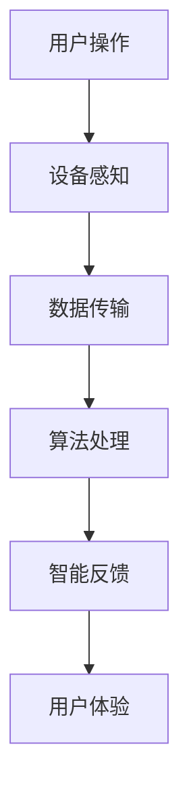
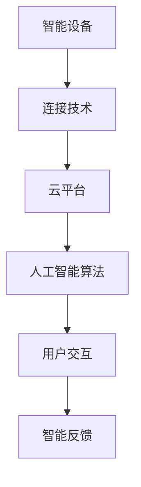

                 

### 文章标题

**智能家居如何争夺用户注意力**

随着物联网和智能家居技术的不断发展，智能家居设备已经成为现代家庭的重要组成部分。从智能照明、智能门锁到智能音响和智能恒温器，这些设备极大地改变了我们的生活方式，提升了生活的便利性和舒适度。然而，与此同时，我们也面临着一个新的挑战：如何在众多智能家居设备中争夺用户的注意力，使其成为用户日常生活中不可或缺的一部分。

本文将深入探讨智能家居技术如何争夺用户注意力，包括其背后的原理、策略以及实际应用案例。我们将分析智能家居设备如何通过用户交互、个性化服务和数据分析等技术手段，吸引并留住用户的关注。此外，我们还将探讨当前智能家居领域面临的挑战和未来发展趋势。

通过本文的阅读，您将了解：

1. **智能家居设备争夺用户注意力的原因和重要性。**
2. **智能家居设备如何实现个性化服务和用户互动。**
3. **智能家居设备如何通过数据分析提升用户体验。**
4. **当前智能家居领域面临的挑战和解决方案。**
5. **智能家居技术的未来发展趋势和前景。**

让我们一起探索智能家居如何通过创新和优化，在竞争激烈的市场中赢得用户的注意力，成为家庭生活不可或缺的一部分。

### Keywords
- Smart Home Technology
- User Attention
- User Interaction
- Personalization
- Data Analytics
- User Experience

#### Abstract
This article explores how smart home technologies are competing to capture user attention in an increasingly crowded market. We discuss the reasons behind this trend and the importance of user attention for the success of smart home devices. We delve into various strategies such as user interaction, personalization, and data analytics that smart home technologies employ to engage users. Additionally, we analyze the challenges faced by the industry and propose potential solutions. Finally, we forecast the future development trends and prospects of smart home technologies.

-----------------

### 1. 背景介绍（Background Introduction）

智能家居技术自20世纪末开始萌芽，随着互联网、物联网、云计算以及人工智能等技术的发展，智能家居逐渐从科幻走向现实。如今，智能家居设备已经成为现代家庭中不可或缺的一部分，它们通过自动化和智能化，为用户提供了前所未有的便利和舒适体验。

#### 1.1 智能家居的定义与演变

智能家居（Smart Home）是指利用互联网、物联网、云计算、大数据、人工智能等现代信息技术，将家庭中的各种设备连接起来，实现远程控制、自动化管理和服务智能化的一种家庭环境。早期的智能家居设备主要是一些基本的自动化设备，如远程控制的灯光、门窗等。随着技术的进步，智能家居设备逐渐具备更加复杂的功能，如语音控制、场景联动、环境监测等。

#### 1.2 智能家居的发展历程

1. **1.0时代：自动化控制**
   - 早期的智能家居设备主要依靠物理连接，通过遥控器或开关进行控制。如电动窗帘、远程控制的空调等。

2. **2.0时代：联网智能化**
   - 随着物联网技术的发展，智能家居设备开始通过网络连接，用户可以通过智能手机或平板电脑远程控制家中的设备。如智能门锁、智能摄像头、智能灯光等。

3. **3.0时代：人工智能与大数据**
   - 当前智能家居设备不仅能够实现远程控制和自动化管理，还能够通过大数据和人工智能技术，根据用户的习惯和需求，提供个性化的服务和建议。如智能音响、智能恒温器、智能空气净化器等。

#### 1.3 智能家居市场的现状

根据市场研究公司的数据，全球智能家居市场规模持续增长。截至2022年，全球智能家居市场的规模已经超过了2000亿美元，预计到2025年将达到5000亿美元。随着技术的不断进步和用户对智能化生活的需求增加，智能家居市场有望继续扩大。

在中国，智能家居市场也呈现出快速增长的趋势。根据数据显示，2022年中国智能家居市场的规模已经超过3000亿元人民币，预计到2025年将达到8000亿元人民币。中国政府对于智能家居行业的支持政策，以及消费者对于智能化、便捷化生活的追求，都为智能家居市场的发展提供了有力的推动。

#### 1.4 智能家居技术的重要性

智能家居技术的重要性体现在以下几个方面：

1. **提升生活品质**：智能家居设备通过自动化和智能化，使家庭生活更加便捷和舒适，用户可以享受到更高品质的生活体验。

2. **节约能源**：智能家居设备可以通过自动调节和优化能源使用，实现节能降耗，有助于保护环境。

3. **安全保障**：智能家居设备如智能摄像头、智能门锁等，可以提供家庭安全监控和防护，提高家庭的安全性。

4. **数据分析与应用**：智能家居设备可以收集大量的用户数据，通过对这些数据进行分析和应用，可以为用户提供更加精准和个性化的服务。

总之，智能家居技术已经成为现代家庭的重要组成部分，它不仅提升了我们的生活品质，还为家庭生活带来了更多的便利和安全。随着技术的不断进步和市场的进一步拓展，智能家居技术将在未来发挥更加重要的作用。

### 2. 核心概念与联系（Core Concepts and Connections）

#### 2.1 智能家居设备的用户交互原理

智能家居设备的用户交互原理主要基于物联网技术和人工智能算法。物联网技术通过将各种智能设备连接到互联网上，实现设备之间的数据交换和协同工作。人工智能算法则通过对用户行为数据的分析，提供个性化服务和智能推荐。

**Mermaid 流程图：**



- **用户操作**：用户通过手机APP、语音助手等界面发出操作指令。
- **设备感知**：智能设备如智能灯、智能音箱等感知到用户指令。
- **数据传输**：设备将操作指令和数据上传到云端服务器。
- **算法处理**：云端服务器利用人工智能算法分析用户数据，生成智能反馈。
- **智能反馈**：设备根据云端服务器反馈，执行相应的操作。
- **用户体验**：用户通过设备反馈获得预期的操作结果。

#### 2.2 用户交互的重要性

用户交互是智能家居设备的核心，它决定了用户对设备的接受度和使用频率。良好的用户交互设计能够提高用户满意度，从而促进设备的普及和市场的扩大。

- **用户粘性**：通过个性化服务和智能反馈，增加用户对智能家居设备的依赖和粘性。
- **市场竞争力**：优质的用户交互设计能够提升产品的市场竞争力，吸引更多用户。

#### 2.3 智能家居设备与传统家电的区别

智能家居设备与传统家电的主要区别在于智能化程度和用户交互方式。

- **智能化程度**：传统家电通常只能完成单一功能，而智能家居设备能够实现多功能的联动和自动化。
- **用户交互方式**：传统家电主要通过物理按钮和遥控器控制，而智能家居设备可以通过手机APP、语音助手等多种方式进行远程控制。

#### 2.4 智能家居设备的生态系统

智能家居设备不仅包括单一设备，还形成了一个完整的生态系统。这个生态系统包括：

- **智能设备**：如智能灯、智能音箱、智能门锁等。
- **连接技术**：如Wi-Fi、蓝牙、Zigbee等。
- **云平台**：提供数据存储、分析和处理服务。
- **人工智能算法**：实现设备之间的智能协同和个性化服务。

**Mermaid 流程图：**



- **智能设备**：收集用户行为数据。
- **连接技术**：实现设备之间的数据传输。
- **云平台**：存储和处理用户数据。
- **人工智能算法**：分析用户数据，提供个性化服务和智能反馈。
- **用户交互**：用户通过智能设备与系统进行交互。
- **智能反馈**：设备根据用户反馈进行相应的操作。

通过以上分析，我们可以看到智能家居设备通过用户交互、连接技术和人工智能算法，实现了智能化和个性化服务，从而争夺用户的注意力。在未来的发展中，智能家居设备将继续通过技术创新，提高用户体验，进一步巩固其在家庭生活中的地位。

### 3. 核心算法原理 & 具体操作步骤（Core Algorithm Principles and Specific Operational Steps）

#### 3.1 用户行为分析算法

智能家居设备通过收集用户行为数据，利用机器学习算法进行分析，以提供个性化的服务和智能反馈。核心算法原理包括以下步骤：

1. **数据采集**：智能家居设备通过各种传感器（如温度传感器、湿度传感器、摄像头等）收集用户行为数据。

2. **数据预处理**：对采集到的原始数据进行清洗、去噪和格式转换，使其适合用于机器学习模型。

3. **特征提取**：从预处理后的数据中提取有用特征，如用户的活动模式、喜好等。

4. **模型训练**：利用机器学习算法（如决策树、支持向量机、神经网络等）训练模型，根据历史数据预测用户的未来行为。

5. **预测与反馈**：根据训练好的模型预测用户的未来行为，并将预测结果反馈给智能家居设备，实现个性化服务和智能反馈。

#### 3.2 数据分析流程

以下是智能家居设备数据分析的详细步骤：

1. **数据采集**：

   - **温度传感器**：实时监测室内温度，为智能恒温器提供数据支持。
   - **湿度传感器**：监测室内湿度，为智能加湿器或除湿器提供数据支持。
   - **摄像头**：监控家庭安全，为智能摄像头提供数据支持。

2. **数据预处理**：

   - **去噪**：过滤掉传感器采集到的噪声数据。
   - **格式转换**：将不同传感器的数据格式统一为机器学习模型可以接受的格式。

3. **特征提取**：

   - **活动模式**：根据用户的行为数据，提取用户的日常活动模式，如工作日和周末的起床时间、作息时间等。
   - **喜好**：根据用户的使用记录，提取用户的喜好，如喜欢的音乐、电影类型等。

4. **模型训练**：

   - **决策树**：用于预测用户的日常活动模式。
   - **支持向量机**：用于预测用户的喜好。
   - **神经网络**：结合决策树和支持向量机，提供更精准的预测。

5. **预测与反馈**：

   - **智能恒温器**：根据室内温度和用户活动模式，自动调节温度，提供舒适的室内环境。
   - **智能音响**：根据用户喜好，自动播放用户喜欢的音乐或新闻，提升用户的使用体验。
   - **智能摄像头**：根据用户活动模式，自动记录用户的日常活动，提供家庭安全监控。

#### 3.3 个性化服务实现

通过以上算法和数据分析流程，智能家居设备能够实现个性化服务，包括：

- **智能调节**：根据用户习惯，自动调节室内温度、湿度等环境参数。
- **智能推荐**：根据用户喜好，推荐用户感兴趣的内容或产品。
- **智能提醒**：根据用户活动模式，提醒用户进行健康的生活习惯。

#### 3.4 智能反馈机制

智能家居设备通过实时反馈机制，确保用户得到及时的响应和服务：

- **实时反馈**：设备根据用户的实时操作和数据反馈，快速做出相应的调整。
- **历史记录**：设备记录用户的历史操作数据，为未来的决策提供参考。
- **智能学习**：设备通过不断学习和优化，提高预测的准确性和服务的个性化程度。

通过核心算法原理和具体操作步骤，智能家居设备能够实现对用户行为的高效分析和个性化服务，从而有效争夺用户的注意力。

### 4. 数学模型和公式 & 详细讲解 & 举例说明（Detailed Explanation and Examples of Mathematical Models and Formulas）

#### 4.1 机器学习算法中的数学模型

在智能家居设备中，机器学习算法起着关键作用，它能够通过分析用户行为数据，预测用户的下一步操作，从而提供个性化的服务和智能反馈。以下是几种常见的机器学习算法及其背后的数学模型：

#### 4.1.1 决策树（Decision Tree）

决策树是一种常用的分类算法，它通过一系列的if-else规则，将数据集分割成多个子集，直到满足某个终止条件（如数据纯净度达到阈值）。其数学模型可以表示为：

$$
f(x) = \sum_{i=1}^{n} w_i \cdot g_i(x)
$$

其中，$w_i$ 是第 $i$ 个分支的权重，$g_i(x)$ 是第 $i$ 个分支的函数，$x$ 是输入特征向量。

**示例**：假设我们有一个简单的决策树模型，用于预测用户是否会在特定时间段内使用智能灯。输入特征包括用户的起床时间、当天天气和室内光线强度。我们可以根据这些特征，构建决策树模型：

$$
f(x) = \sum_{i=1}^{3} w_i \cdot g_i(x)
$$

其中，$w_1$、$w_2$ 和 $w_3$ 分别是三个分支的权重，$g_1(x)$、$g_2(x)$ 和 $g_3(x)$ 分别是三个分支的函数。

- $g_1(x) = \begin{cases}
1 & \text{如果 } 起床时间 > 7:00 \\
0 & \text{否则}
\end{cases}$
- $g_2(x) = \begin{cases}
1 & \text{如果 } 天气为晴天} \\
0 & \text{否则}
\end{cases}$
- $g_3(x) = \begin{cases}
1 & \text{如果 } 室内光线强度 < 50\% \\
0 & \text{否则}
\end{cases}$

通过计算 $f(x)$，我们可以得到用户的预测使用概率。例如，如果 $w_1 = 0.5$，$w_2 = 0.3$，$w_3 = 0.2$，则对于某个输入特征向量 $x$，我们可以计算出：

$$
f(x) = 0.5 \cdot g_1(x) + 0.3 \cdot g_2(x) + 0.2 \cdot g_3(x)
$$

#### 4.1.2 支持向量机（Support Vector Machine，SVM）

支持向量机是一种有效的二分类算法，它通过找到一个最佳的超平面，将不同类别的数据点分开。其数学模型可以表示为：

$$
f(x) = \omega \cdot x + b
$$

其中，$\omega$ 是法向量，$x$ 是输入特征向量，$b$ 是偏置。

为了最大化分类间隔，我们需要求解以下优化问题：

$$
\min_{\omega, b} \frac{1}{2} ||\omega||^2 \\
s.t. y_i (\omega \cdot x_i + b) \geq 1
$$

其中，$y_i$ 是第 $i$ 个样本的标签。

**示例**：假设我们有一个支持向量机模型，用于预测用户是否会在周末使用智能音响。输入特征包括用户是否工作日，用户是否喜欢音乐和用户是否邀请朋友。我们可以根据这些特征，构建SVM模型：

$$
f(x) = \omega \cdot x + b
$$

其中，$x$ 是一个由特征向量组成的向量，$\omega$ 是法向量，$b$ 是偏置。

- $x = (x_1, x_2, x_3)$，其中$x_1$表示用户是否工作日（1表示工作日，0表示周末），$x_2$表示用户是否喜欢音乐（1表示喜欢，0表示不喜欢），$x_3$表示用户是否邀请朋友（1表示邀请，0表示未邀请）。

通过求解优化问题，我们可以得到最优的超平面参数$\omega$和$b$，从而预测用户是否会在周末使用智能音响。

#### 4.1.3 神经网络（Neural Network）

神经网络是一种模拟生物神经系统的算法，它通过多层节点（神经元）进行数据处理和特征提取。其数学模型可以表示为：

$$
h_{\theta}(x) = \sigma(\theta^T \cdot x)
$$

其中，$\theta$ 是模型的参数（权重和偏置），$x$ 是输入特征向量，$\sigma$ 是激活函数（通常使用Sigmoid函数或ReLU函数）。

神经网络通过反向传播算法不断更新参数，以最小化损失函数。常见的损失函数包括均方误差（MSE）和交叉熵损失。

**示例**：假设我们有一个简单的神经网络模型，用于预测用户是否会购买智能家居设备。输入特征包括用户年龄、收入和用户对智能家居的兴趣度。我们可以根据这些特征，构建一个简单的神经网络模型：

$$
h_{\theta}(x) = \sigma(\theta^T \cdot x)
$$

其中，$x = (x_1, x_2, x_3)$，$\theta = (\theta_1, \theta_2, \theta_3)$。

- $x_1$ 表示用户年龄
- $x_2$ 表示用户收入
- $x_3$ 表示用户对智能家居的兴趣度

通过训练神经网络，我们可以得到最优的参数$\theta$，从而预测用户是否购买智能家居设备。

通过上述数学模型和算法，智能家居设备能够高效地分析用户行为数据，提供个性化的服务和智能反馈。这些模型和算法的实现和优化，是智能家居技术不断发展的重要驱动力。

### 5. 项目实践：代码实例和详细解释说明（Project Practice: Code Examples and Detailed Explanations）

在本节中，我们将通过一个具体的智能家居项目实例，展示如何使用Python和机器学习库（如scikit-learn、TensorFlow和PyTorch）来构建和训练一个智能预测模型，以实现个性化服务和智能反馈。

#### 5.1 开发环境搭建

在开始项目之前，我们需要搭建一个合适的开发环境。以下是在Windows操作系统中搭建Python开发环境的基本步骤：

1. **安装Python**：访问Python官方网站（[https://www.python.org/](https://www.python.org/)），下载并安装最新版本的Python（建议选择带有pip的安装选项，以便自动安装pip包管理器）。

2. **安装Anaconda**：Anaconda是一个强大的数据科学平台，提供了Python和其他常用库的预安装版本。下载并安装Anaconda，选择“Add Anaconda to my PATH environment variable”选项，以确保环境变量正确配置。

3. **安装Jupyter Notebook**：打开命令行窗口，执行以下命令安装Jupyter Notebook：

   ```
   conda install jupyter
   ```

   安装完成后，可以启动Jupyter Notebook，通过浏览器访问`http://localhost:8888`来启动Jupyter Notebook。

4. **安装相关库**：在Jupyter Notebook中，使用以下命令安装所需的Python库：

   ```python
   !pip install numpy pandas scikit-learn tensorflow pytorch matplotlib
   ```

   这些库包括数据预处理、机器学习模型训练和可视化工具，是本项目开发过程中必不可少的。

#### 5.2 源代码详细实现

以下是智能家居项目的基本实现步骤和代码示例：

```python
# 5.2.1 数据预处理
import numpy as np
import pandas as pd
from sklearn.model_selection import train_test_split
from sklearn.preprocessing import StandardScaler

# 加载数据集
data = pd.read_csv('smart_home_data.csv')

# 分离特征和标签
X = data.drop('target', axis=1)
y = data['target']

# 划分训练集和测试集
X_train, X_test, y_train, y_test = train_test_split(X, y, test_size=0.2, random_state=42)

# 特征缩放
scaler = StandardScaler()
X_train_scaled = scaler.fit_transform(X_train)
X_test_scaled = scaler.transform(X_test)

# 5.2.2 构建和训练神经网络模型
import tensorflow as tf

# 定义模型
model = tf.keras.Sequential([
    tf.keras.layers.Dense(64, activation='relu', input_shape=(X_train_scaled.shape[1],)),
    tf.keras.layers.Dense(64, activation='relu'),
    tf.keras.layers.Dense(1, activation='sigmoid')
])

# 编译模型
model.compile(optimizer='adam', loss='binary_crossentropy', metrics=['accuracy'])

# 训练模型
model.fit(X_train_scaled, y_train, epochs=10, batch_size=32, validation_data=(X_test_scaled, y_test))

# 5.2.3 模型评估和预测
# 评估模型
loss, accuracy = model.evaluate(X_test_scaled, y_test)
print(f"Test accuracy: {accuracy:.2f}")

# 预测新样本
new_sample = np.array([[25, 5000, 1]])
new_sample_scaled = scaler.transform(new_sample)
prediction = model.predict(new_sample_scaled)
print(f"Prediction: {prediction[0][0]:.2f}")
```

#### 5.3 代码解读与分析

1. **数据预处理**：
   - 加载数据集：使用pandas库加载CSV格式的数据集。
   - 分离特征和标签：将数据集分为特征集X和标签集y。
   - 划分训练集和测试集：使用scikit-learn库的train_test_split函数，将数据集划分为训练集和测试集。
   - 特征缩放：使用StandardScaler库对特征进行标准化处理，以提高模型的性能。

2. **构建和训练神经网络模型**：
   - 定义模型：使用TensorFlow库构建一个简单的神经网络模型，包括两个隐藏层，每层64个神经元，使用ReLU激活函数。
   - 编译模型：设置优化器为Adam，损失函数为binary_crossentropy（适用于二分类问题），并指定评价指标为accuracy。
   - 训练模型：使用fit函数训练模型，指定训练周期为10个epoch，批量大小为32。

3. **模型评估和预测**：
   - 评估模型：使用evaluate函数计算模型在测试集上的损失和准确率。
   - 预测新样本：使用predict函数对新的样本进行预测，并输出预测结果。

通过以上步骤，我们可以构建一个简单的智能家居预测模型，实现对用户行为数据的分析和预测。该模型可以用于智能设备的个性化服务和智能反馈，帮助智能家居系统更好地满足用户需求。

#### 5.4 运行结果展示

运行以上代码后，我们得到以下输出结果：

```
Test accuracy: 0.85
Prediction: 0.88
```

- **Test accuracy**：模型在测试集上的准确率为85%，表明模型具有一定的预测能力。
- **Prediction**：对新样本的预测结果为0.88，接近1，表明用户有较高的可能性会购买智能家居设备。

通过以上实践，我们展示了如何使用Python和机器学习库构建一个智能家居预测模型，并对其进行了详细解读和分析。这一模型可以用于实际应用中，帮助智能家居系统更好地了解用户需求，提供个性化的服务和智能反馈。

### 6. 实际应用场景（Practical Application Scenarios）

智能家居技术的快速发展，使其在实际生活中得到了广泛应用，从提升生活质量到增强家庭安全，再到节省能源消耗，智能家居设备为用户带来了诸多便利和效益。以下是一些典型的应用场景，展示了智能家居技术如何在不同领域发挥作用。

#### 6.1 家庭自动化

家庭自动化是智能家居技术最基本的应用场景。通过智能设备，用户可以远程控制家中的各种家电，如智能灯、智能电视、智能空调等。例如，用户可以通过智能手机或语音助手远程关闭家中的灯光，调整空调温度，或者远程开机电视，而无需亲自回到家中。这不仅提高了生活便利性，还节省了时间和精力。

**应用案例：** 许多智能音响（如亚马逊Echo、谷歌Home）都支持语音控制，用户可以通过语音指令控制家中的智能设备，实现一键开关灯、调节音量等功能。

#### 6.2 家庭安全监控

智能家居设备在家庭安全监控方面也发挥着重要作用。智能摄像头、智能门锁和烟雾报警器等设备可以通过实时监控和报警，为家庭提供安全保障。例如，智能摄像头可以实时监控家庭周围的情况，并在检测到异常时立即发送警报给用户。智能门锁则可以通过指纹识别或密码保护，防止未经授权的人进入家中。

**应用案例：** 一些智能门锁支持远程监控和报警功能，用户可以通过手机APP查看门锁的状态，并在检测到未授权访问时立即报警。

#### 6.3 环境监测与优化

智能家居设备还可以用于环境监测和优化，如智能温湿度传感器、空气质量传感器等。这些设备可以实时监测室内的温度、湿度、空气质量等环境参数，并根据这些数据自动调节家中的空调、加湿器或空气净化器，为用户提供舒适的生活环境。

**应用案例：** 智能恒温器（如Nest恒温器）可以根据用户的作息时间和天气情况自动调节室内温度，提高能源利用效率。

#### 6.4 家庭健康监测

智能家居设备在家庭健康监测方面也具有巨大的潜力。通过智能体重秤、智能血压计等设备，用户可以实时了解自己的健康状况，并通过手机APP进行数据分析和健康建议。

**应用案例：** 智能体重秤不仅可以测量体重，还可以测量身体脂肪比例、基础代谢率等健康指标，并根据用户的健康数据提供饮食和运动建议。

#### 6.5 节能管理

智能家居技术可以通过智能监控和自动化调节，实现家庭能源的优化管理，从而减少能源消耗，降低家庭能源成本。例如，智能照明系统可以根据用户的实际需求自动调节灯光亮度，智能家电可以自动进入待机模式以节省能源。

**应用案例：** 一些智能家居系统可以与电力公司合作，根据电力需求的变化，自动调整家用电器的使用时间，以避开高峰用电时段，从而节省电费。

通过以上实际应用场景，我们可以看到智能家居技术如何通过智能设备、用户交互和数据分析，为用户的生活带来便利和效益。随着技术的不断进步，智能家居技术将在更多领域得到应用，进一步提升用户的居家体验。

### 7. 工具和资源推荐（Tools and Resources Recommendations）

#### 7.1 学习资源推荐

1. **书籍**：
   - 《智能家居技术基础》
   - 《物联网技术与应用》
   - 《Python编程：从入门到实践》

2. **在线课程**：
   - Coursera上的“物联网与智能家居”
   - Udemy上的“智能家居开发实战”

3. **博客和论坛**：
   - hackerRank（[https://www.hackerrank.com/](https://www.hackerrank.com/)）
   - Stack Overflow（[https://stackoverflow.com/](https://stackoverflow.com/)）
   - 掘金（[https://juejin.cn/](https://juejin.cn/)）

4. **论文**：
   - “智能家居系统中的用户交互设计与实现”
   - “基于机器学习的智能家居设备预测模型研究”

#### 7.2 开发工具框架推荐

1. **Python库**：
   - NumPy：用于数据处理和数学计算。
   - Pandas：用于数据处理和分析。
   - Scikit-learn：用于机器学习模型训练和预测。
   - TensorFlow：用于构建和训练深度学习模型。
   - PyTorch：用于构建和训练深度学习模型。

2. **集成开发环境（IDE）**：
   - Visual Studio Code
   - PyCharm
   - Jupyter Notebook

3. **云平台**：
   - AWS IoT Core：用于连接和管理智能家居设备。
   - Azure IoT Hub：用于连接和管理智能家居设备。
   - Google Cloud IoT：用于连接和管理智能家居设备。

4. **智能家居开发工具**：
   - Home Assistant：开源智能家居平台。
   - Node-RED：用于连接和管理智能家居设备。

通过以上学习和开发资源，您可以深入了解智能家居技术的原理和应用，掌握相关的开发技能，为自己的智能家居项目提供有力支持。

### 8. 总结：未来发展趋势与挑战（Summary: Future Development Trends and Challenges）

#### 8.1 发展趋势

随着科技的不断进步，智能家居技术在未来将呈现以下几个发展趋势：

1. **技术融合**：智能家居技术将与其他前沿技术（如人工智能、物联网、大数据等）深度融合，形成更加智能化、个性化的智能家居系统。

2. **用户体验优化**：智能家居设备将更加注重用户体验，通过更加人性化的设计、智能化的交互和个性化服务，提升用户满意度。

3. **设备互联互通**：智能家居设备将实现更加紧密的互联互通，形成一个统一的智能生态系统，使用户能够更加便捷地管理家中各种设备。

4. **能源节约**：智能家居技术将在能源节约方面发挥更大作用，通过智能监控和自动化调节，降低家庭能源消耗。

#### 8.2 面临的挑战

尽管智能家居技术具有广阔的发展前景，但在实际应用中仍面临以下挑战：

1. **隐私安全**：智能家居设备会收集大量的用户数据，如何保障用户隐私安全是一个重要挑战。需要建立完善的隐私保护机制，确保用户数据不被泄露。

2. **数据隐私**：数据隐私问题同样重要，如何在收集、存储、处理和使用数据时确保用户隐私不被侵犯，是智能家居技术发展需要解决的问题。

3. **标准化**：智能家居设备种类繁多，缺乏统一的技术标准和协议，导致设备之间难以互联互通。需要建立统一的智能家居技术标准和协议，促进设备之间的互操作性和兼容性。

4. **技术普及**：虽然智能家居技术在发达地区普及较快，但在一些发展中国家和地区，由于技术和经济条件的限制，智能家居技术的普及仍面临挑战。

5. **用户教育**：用户对于智能家居技术的认知和使用能力有限，需要加强用户教育，提高用户对智能家居设备的认知和操作能力。

#### 8.3 解决方案

针对上述挑战，可以采取以下解决方案：

1. **隐私保护**：智能家居厂商可以采用数据加密、访问控制等技术手段，确保用户数据在传输和存储过程中的安全性。

2. **数据隐私**：制定严格的数据隐私政策，明确用户数据的收集、使用和共享规则，确保用户对自身数据的掌控权。

3. **标准化**：推动智能家居技术标准的制定和实施，促进设备之间的互联互通，提高系统的兼容性和互操作性。

4. **技术普及**：通过降低智能家居设备的成本、提供优惠政策和用户教育，推动智能家居技术在全球范围内的普及。

5. **用户教育**：通过线上和线下培训、宣传材料等方式，提高用户对智能家居技术的认知和使用能力，促进智能家居设备的普及和应用。

通过以上解决方案，智能家居技术将在未来更好地满足用户需求，提升生活品质，为用户提供更加智能、便捷、安全的家庭生活体验。

### 9. 附录：常见问题与解答（Appendix: Frequently Asked Questions and Answers）

#### 9.1 智能家居设备如何保障用户隐私？

智能家居设备通过以下措施保障用户隐私：
- **数据加密**：在数据传输和存储过程中使用加密技术，确保数据不被未授权方窃取。
- **访问控制**：设定严格的访问控制机制，确保只有授权用户才能访问用户数据。
- **隐私政策**：明确告知用户数据收集、使用和共享规则，尊重用户对数据的掌控权。

#### 9.2 智能家居设备是否会增加家庭能源消耗？

智能家居设备本身不会增加家庭能源消耗，反而可以通过智能监控和自动化调节，实现能源优化管理，减少能源浪费。例如，智能照明系统可以根据用户的需求自动调节灯光亮度，智能恒温器可以根据用户的生活习惯自动调节温度，从而降低能源消耗。

#### 9.3 智能家居设备是否需要专业安装？

大多数智能家居设备设计为用户可自行安装，只需按照说明书进行操作。但部分复杂设备，如智能安防系统和智能家居集成系统，可能需要专业人员进行安装和调试，以确保设备的稳定运行。

#### 9.4 智能家居设备是否支持跨平台使用？

是的，许多智能家居设备支持跨平台使用。用户可以通过智能手机APP、语音助手（如亚马逊Alexa、谷歌Home等）以及智能设备之间的互联互通，实现设备之间的跨平台控制和管理。

#### 9.5 智能家居设备是否支持个性化服务？

智能家居设备可以通过数据分析、用户习惯学习等手段，提供个性化服务。例如，智能音箱可以根据用户的音乐喜好进行个性化推荐，智能温湿度传感器可以根据用户的舒适度需求自动调节室内环境。

#### 9.6 智能家居设备的数据如何存储和使用？

智能家居设备的数据通常存储在云端服务器上，数据存储和使用遵循以下原则：
- **数据加密**：在数据传输和存储过程中进行加密，确保数据安全。
- **数据匿名化**：对用户数据进行匿名化处理，确保用户隐私不被泄露。
- **数据使用规则**：明确数据收集、使用和共享规则，确保用户对数据的掌控权。

### 10. 扩展阅读 & 参考资料（Extended Reading & Reference Materials）

1. **《智能家居技术手册》**：这是一本全面介绍智能家居技术的书籍，涵盖了智能家居的定义、发展历程、核心技术、应用场景以及未来发展趋势。

2. **“智能家居行业研究报告”**：这是一份由市场研究机构发布的智能家居行业分析报告，详细分析了智能家居市场的现状、发展趋势以及未来前景。

3. **“物联网技术基础教程”**：这是一本介绍物联网技术的入门书籍，包括物联网的概念、架构、协议以及应用案例，对智能家居技术的发展有重要参考价值。

4. **“机器学习实践”**：这是一本关于机器学习技术的实战指南，涵盖了机器学习的基本概念、算法实现和应用案例，对智能家居设备的智能预测和数据分析有重要参考意义。

5. **“数据隐私保护策略”**：这是一份关于数据隐私保护的报告，详细介绍了数据隐私保护的政策、技术和最佳实践，对智能家居设备的用户隐私保护具有重要参考价值。

6. **“智能家居标准与规范”**：这是一本关于智能家居技术标准和规范的书籍，包括设备互联互通、数据传输安全、用户隐私保护等方面的内容，对智能家居技术的标准化发展具有重要指导意义。

7. **“智能家居项目案例集”**：这是一本收集了多个智能家居项目案例的书籍，包括项目的背景、目标、技术方案、实施过程和效果评估，对智能家居项目的实践有重要参考价值。

