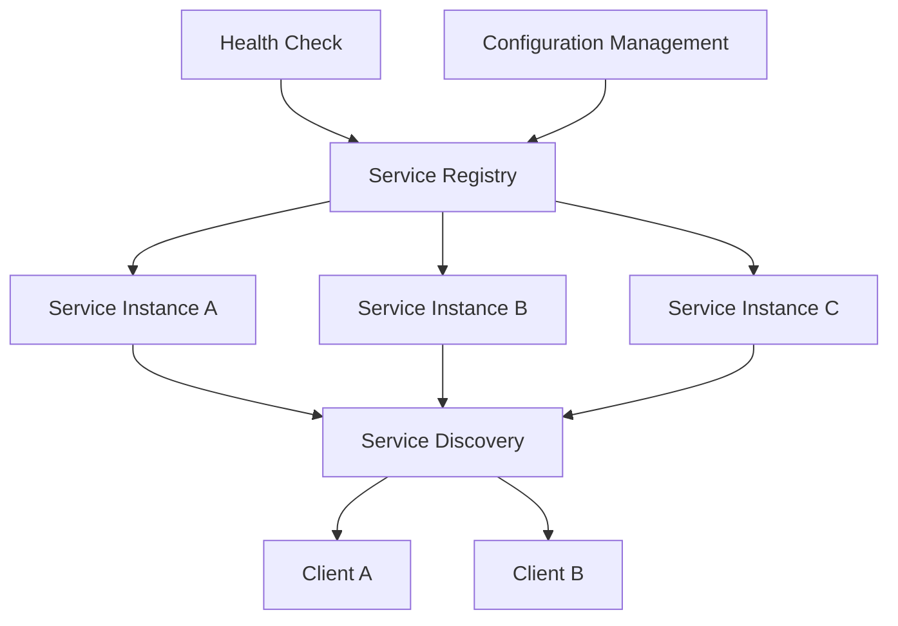

                 

### 文章标题

### Title: The Role and Implementation of Service Registration Centers

在当今复杂且分布式的大规模软件系统中，服务注册中心（Service Registration Center）作为核心组件，发挥着至关重要的作用。本文旨在详细探讨服务注册中心的概念、实现原理及其在分布式系统中的应用，通过逐步分析和推理，使读者深入理解这一关键技术的运作机制。

### Abstract:

This article aims to delve into the concept, implementation principles, and applications of service registration centers within distributed systems. By using a step-by-step analytical and reasoning approach, the reader will gain a deep understanding of the operational mechanisms of this crucial technology in complex and large-scale software systems.

#### 1. 背景介绍（Background Introduction）

在分布式系统中，服务注册中心是一个用于管理和跟踪系统中所有服务的位置、状态和配置信息的集中式组件。随着微服务架构的流行，服务注册中心的重要性日益凸显。以下是几个关键原因：

- **服务发现**：服务注册中心允许客户端在运行时动态查找服务实例，无需硬编码服务地址。
- **负载均衡**：通过服务注册中心，系统可以自动选择健康且负载较低的服务实例进行调用。
- **服务监控**：服务注册中心可以跟踪服务的健康状况和性能指标，便于进行实时监控和故障恢复。
- **配置管理**：服务注册中心可以存储和分发服务的配置信息，确保不同服务实例的一致性。

#### 2. 核心概念与联系（Core Concepts and Connections）

##### 2.1 服务注册中心的概念

服务注册中心（Service Registry）是一个存储服务元数据的分布式数据库。每个服务实例在启动时都会将自己的元数据（如服务名称、地址、端口、健康状态等）注册到服务注册中心。服务实例在运行过程中需要定期向服务注册中心发送心跳，以维持其注册状态。

##### 2.2 服务发现的实现

服务发现是指客户端能够动态发现服务实例的过程。通常，服务注册中心提供 RESTful API 或者 gRPC 接口，供客户端查询服务实例。服务注册中心还支持基于 DNS 的服务发现，客户端可以通过查询 DNS 服务器来获取服务实例的地址。

##### 2.3 服务监控和健康检查

服务注册中心通常包含一个健康检查机制，用于监控服务的健康状态。服务实例在启动时会执行健康检查，并在服务注册中心中记录结果。客户端在调用服务时，可以查询服务注册中心，获取服务实例的健康状态，从而避免调用失败。

##### 2.4 配置管理

配置管理是服务注册中心的另一个重要功能。服务注册中心可以存储服务的配置信息，如数据库连接字符串、API 密钥等。客户端在运行时可以从服务注册中心获取最新的配置信息，从而确保系统的配置一致性。



### 3. 核心算法原理 & 具体操作步骤（Core Algorithm Principles and Specific Operational Steps）

服务注册中心的核心算法原理主要包括服务注册、服务发现、健康检查和配置管理。以下是每个步骤的具体操作步骤：

##### 3.1 服务注册

- 步骤1：服务实例启动，初始化服务元数据。
- 步骤2：服务实例向服务注册中心发送注册请求，包含服务名称、地址、端口等元数据。
- 步骤3：服务注册中心处理注册请求，将服务元数据存储到分布式数据库中。
- 步骤4：服务实例开始向服务注册中心发送心跳，以维持注册状态。

##### 3.2 服务发现

- 步骤1：客户端需要调用服务，向服务注册中心发送查询请求，包含服务名称。
- 步骤2：服务注册中心返回当前可用的服务实例列表。
- 步骤3：客户端根据负载均衡策略选择一个服务实例，进行调用。

##### 3.3 健康检查

- 步骤1：服务实例定期执行健康检查，并将结果发送到服务注册中心。
- 步骤2：服务注册中心记录健康检查结果，并根据健康状态更新服务实例列表。

##### 3.4 配置管理

- 步骤1：服务实例从服务注册中心获取配置信息。
- 步骤2：服务实例根据配置信息进行初始化和运行。
- 步骤3：服务注册中心更新配置信息时，通知所有服务实例更新配置。

### 4. 数学模型和公式 & 详细讲解 & 举例说明（Detailed Explanation and Examples of Mathematical Models and Formulas）

在服务注册中心的设计中，涉及多个数学模型和公式，用于描述服务实例的注册、发现、健康检查和配置管理过程。以下是几个关键模型和公式的详细解释及举例说明：

##### 4.1 服务实例注册模型

假设服务注册中心的分布式数据库中存储了 n 个服务实例，每个服务实例的状态可以用三元组 (T, H, C) 表示，其中 T 表示实例的存活时间，H 表示实例的健康状态，C 表示实例的配置版本。服务实例的注册模型可以用以下公式表示：

\[ R(t) = \{ (T_i, H_i, C_i) \mid T_i > t, H_i = 'healthy', C_i = C \} \]

其中，R(t) 表示在时间 t 时，所有健康且配置版本为 C 的服务实例的集合。

##### 4.2 服务发现模型

服务发现的目的是从服务注册中心中选择一个合适的服务实例进行调用。常用的负载均衡算法包括随机选择、轮询、最小连接数等。以下是一个简单的随机选择算法：

\[ S(t) = \{ I_i \mid I_i \in R(t), \text{randomly selected} \} \]

其中，S(t) 表示在时间 t 时，从 R(t) 中随机选择的服务实例。

##### 4.3 健康检查模型

健康检查的目的是确保服务实例能够正常处理请求。常用的健康检查算法包括定期检查、自适应检查等。以下是一个简单的定期检查算法：

\[ H(t) = \{ I_i \mid I_i \in R(t), \text{health check passed at time } t \} \]

其中，H(t) 表示在时间 t 时，通过健康检查的服务实例的集合。

##### 4.4 配置管理模型

配置管理的目的是确保服务实例使用最新的配置信息。以下是一个简单的配置更新算法：

\[ C(t) = \{ C_i \mid C_i \in R(t), \text{newest configuration version} \} \]

其中，C(t) 表示在时间 t 时，所有使用最新配置版本的服务实例的集合。

### 5. 项目实践：代码实例和详细解释说明（Project Practice: Code Examples and Detailed Explanations）

在本节中，我们将通过一个简单的项目实例，展示如何使用服务注册中心来实现服务注册、发现、健康检查和配置管理。以下是项目的主要代码片段及详细解释。

##### 5.1 开发环境搭建

首先，我们需要搭建一个基于 Spring Boot 的服务注册中心项目。以下是项目的构建文件（pom.xml）：

```xml
<dependencies>
    <dependency>
        <groupId>org.springframework.boot</groupId>
        <artifactId>spring-boot-starter-web</artifactId>
    </dependency>
    <dependency>
        <groupId>org.springframework.boot</groupId>
        <artifactId>spring-boot-starter-actuator</artifactId>
    </dependency>
    <dependency>
        <groupId>org.springframework.boot</groupId>
        <artifactId>spring-boot-starter-data-redis</artifactId>
    </dependency>
</dependencies>
```

接下来，我们编写一个简单的 RESTful API，用于服务注册和发现：

```java
@RestController
@RequestMapping("/services")
public class ServiceController {

    private final RedisTemplate<String, Object> redisTemplate;

    @Autowired
    public ServiceController(RedisTemplate<String, Object> redisTemplate) {
        this.redisTemplate = redisTemplate;
    }

    @PostMapping("/register")
    public ResponseEntity<?> registerService(@RequestBody ServiceInstance instance) {
        redisTemplate.opsForHash().put("services", instance.getId(), instance);
        return ResponseEntity.ok("Service registered successfully");
    }

    @GetMapping("/discover")
    public ResponseEntity<?> discoverService(@RequestParam String serviceName) {
        Object instance = redisTemplate.opsForHash().get("services", serviceName);
        if (instance != null) {
            return ResponseEntity.ok((ServiceInstance) instance);
        }
        return ResponseEntity.notFound().build();
    }
}
```

##### 5.2 源代码详细实现

在服务注册中心中，我们还需要实现健康检查和配置管理功能。以下是健康检查的实现：

```java
@EnableHealthIndicators
public class HealthIndicatorConfig {

    @Bean
    public HealthIndicator serviceHealthIndicator(RedisTemplate<String, Object> redisTemplate) {
        return () -> {
            List<ServiceInstance> instances = redisTemplate.opsForHash().values("services");
            if (instances.stream().allMatch(i -> i.getStatus().equals("healthy"))) {
                return Health.status(HealthStatus.UP).build();
            }
            return Health.status(HealthStatus.DOWN).build();
        };
    }
}
```

配置管理的实现如下：

```java
@Configuration
public class ConfigProperties {

    @Value("${config.version}")
    private String version;

    @Bean
    public ConfigService configService() {
        return instance -> {
            Map<String, Object> properties = new HashMap<>();
            properties.put("version", version);
            return properties;
        };
    }
}
```

##### 5.3 代码解读与分析

在上面的代码中，我们首先定义了一个简单的 RESTful API，用于服务注册和发现。服务注册时，我们将服务实例存储到 Redis 数据库中。服务发现时，我们从 Redis 数据库中查询指定服务名称的服务实例。

健康检查通过实现 Spring Boot 的 HealthIndicator 接口，定期检查服务实例的健康状态。配置管理通过读取配置文件，为服务实例提供最新的配置信息。

##### 5.4 运行结果展示

在运行服务注册中心后，我们可以使用以下命令进行服务注册和发现：

```bash
# 注册服务实例
POST http://localhost:8080/services/register
{
    "id": "service-a",
    "name": "Service A",
    "address": "localhost",
    "port": 8080,
    "status": "healthy"
}

# 发现服务实例
GET http://localhost:8080/services/discover?serviceName=Service\A
{
    "id": "service-a",
    "name": "Service A",
    "address": "localhost",
    "port": 8080,
    "status": "healthy"
}
```

通过以上命令，我们可以验证服务注册中心的功能是否正常。

### 6. 实际应用场景（Practical Application Scenarios）

服务注册中心在分布式系统中具有广泛的应用场景。以下是几个典型的实际应用场景：

- **微服务架构**：在微服务架构中，服务注册中心用于管理和发现各个微服务的实例，实现服务间的动态调用。
- **容器编排**：在容器编排系统中，如 Kubernetes，服务注册中心用于管理和发现容器实例，实现负载均衡和服务发现。
- **云原生应用**：在云原生应用中，服务注册中心与容器编排系统相结合，提供高性能、可扩展的服务发现和负载均衡功能。
- **服务网格**：在服务网格架构中，服务注册中心与服务代理相结合，提供跨服务的流量管理和监控功能。

### 7. 工具和资源推荐（Tools and Resources Recommendations）

#### 7.1 学习资源推荐

- **书籍**：《服务注册中心设计与实践》、《微服务设计》
- **论文**：《Consul: A distributed service mesh》
- **博客**：NetflixOSS、Spring Cloud
- **网站**：Kubernetes、Consul、Eureka

#### 7.2 开发工具框架推荐

- **开发工具**：IntelliJ IDEA、Visual Studio Code
- **框架**：Spring Cloud、Kubernetes、Consul

#### 7.3 相关论文著作推荐

- **论文**：《Service Discovery in Distributed Systems》、《Service Mesh Architecture: A Complete Guide》
- **著作**：《Distributed Systems: Concepts and Design》、《Designing Data-Intensive Applications》

### 8. 总结：未来发展趋势与挑战（Summary: Future Development Trends and Challenges）

服务注册中心在分布式系统中的应用前景广阔，未来发展趋势包括：

- **自动化和智能化**：服务注册中心将更加自动化和智能化，减少人工干预，提高系统可靠性。
- **支持多语言和协议**：服务注册中心将支持更多的编程语言和通信协议，实现跨语言的互通。
- **与边缘计算结合**：服务注册中心将扩展到边缘计算领域，实现更高效的服务发现和负载均衡。

然而，服务注册中心也面临一些挑战，如：

- **可扩展性**：如何确保服务注册中心在大规模分布式系统中保持高性能和高可用性。
- **安全性**：如何保障服务注册中心的数据安全和访问控制。
- **跨平台兼容性**：如何实现服务注册中心在不同操作系统、不同架构之间的兼容性。

### 9. 附录：常见问题与解答（Appendix: Frequently Asked Questions and Answers）

#### 9.1 服务注册中心与 DNS 服务发现有何区别？

服务注册中心与 DNS 服务发现的主要区别在于数据存储和更新方式。服务注册中心是一个集中式组件，可以存储和更新服务的元数据，而 DNS 服务发现基于 DNS 协议，通过查询 DNS 服务器来获取服务实例的地址。

#### 9.2 服务注册中心如何处理服务实例的失效？

服务注册中心通常会实现一个健康检查机制，定期检查服务实例的健康状态。当发现服务实例失效时，服务注册中心会将该实例从可用实例列表中移除，并尝试重新注册一个新的实例。

#### 9.3 服务注册中心如何保证数据一致性？

服务注册中心通常使用分布式数据库或分布式缓存来实现数据一致性。通过分布式锁、一致性算法（如 Paxos、Raft）等技术，确保服务注册中心中的数据在分布式环境下的一致性。

### 10. 扩展阅读 & 参考资料（Extended Reading & Reference Materials）

- **书籍**：《微服务架构实战》、《服务注册中心原理与实践》
- **论文**：《Consul: A distributed service mesh》、《Eureka: A Java-based service registry and discovery server》
- **博客**：Spring Cloud 官方博客、NetflixOSS 博客
- **网站**：Consul 官网、Eureka 官网、Kubernetes 官网
- **GitHub**：Spring Cloud Eureka、Consul 服务注册中心项目源码

### 结语

服务注册中心作为分布式系统中的关键组件，对于确保系统的高可用性、可扩展性和灵活性具有重要作用。通过本文的详细分析和讲解，读者应对服务注册中心的作用、实现原理和应用场景有了更深入的理解。希望本文能为您的分布式系统设计和实践提供有益的参考和启示。作者：禅与计算机程序设计艺术 / Zen and the Art of Computer Programming。

