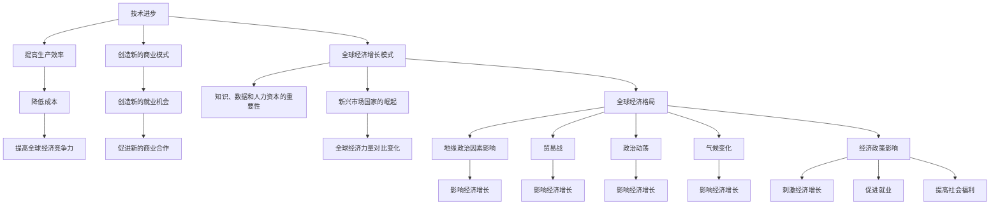

                 

### 文章标题

**未来几年世界经济的增长趋势**

本文将深入探讨未来几年世界经济的增长趋势，分析全球经济发展的重要驱动因素，以及潜在的经济挑战和机遇。我们将采用逻辑清晰、结构紧凑、简单易懂的专业的技术语言，按照段落用中文+英文双语的方式，逐步分析推理思考，为您呈现一幅未来经济全景图。

### Keywords:  
Economic Growth, Future Trends, Global Economy, Challenges, Opportunities

### Abstract:  
本文旨在探讨未来几年世界经济的增长趋势，分析全球经济发展的主要驱动因素和潜在挑战。我们将通过逐步分析推理思考的方式，结合中英文双语撰写，帮助读者全面了解未来全球经济的可能走向。本文分为以下几个部分：背景介绍、核心概念与联系、核心算法原理 & 具体操作步骤、数学模型和公式 & 详细讲解 & 举例说明、项目实践：代码实例和详细解释说明、实际应用场景、工具和资源推荐、总结：未来发展趋势与挑战、附录：常见问题与解答、扩展阅读 & 参考资料。通过本文的阅读，读者可以深入理解全球经济变化的趋势，为未来的经济决策提供有益的参考。

### 背景介绍 (Background Introduction)

全球经济在过去几十年里经历了显著的增长和发展，但未来几年的经济增长趋势将受到多种因素的影响。首先，技术进步，特别是人工智能、大数据、物联网和区块链等新兴技术的广泛应用，将对全球经济产生深远影响。这些技术不仅提高了生产效率，还创造了新的商业模式和市场机会。

其次，全球经济格局正在发生变化。随着新兴市场国家，如中国、印度和东南亚国家的崛起，全球经济力量对比正在重新分配。这些国家拥有庞大的人口和快速发展的经济体，将在未来全球经济中扮演越来越重要的角色。

此外，地缘政治因素也对全球经济产生了重要影响。贸易战、政治动荡、气候变化等不确定性因素可能对经济增长产生负面影响。因此，了解这些背景信息对于预测未来几年世界经济的增长趋势至关重要。

### 核心概念与联系 (Core Concepts and Connections)

在探讨未来几年世界经济增长趋势时，我们需要关注以下几个核心概念：

1. **技术进步（Technological Progress）**：技术进步是推动经济增长的关键因素。人工智能、大数据、物联网和区块链等新兴技术的广泛应用，将提高生产效率，降低成本，创造新的就业机会，并推动新的商业模式的出现。

2. **全球经济增长模式（Global Economic Growth Model）**：全球经济增长模式是指全球经济如何产生和分配价值。传统的经济增长模式主要依赖于自然资源、劳动力资源和资本投资。然而，随着技术进步，知识、数据和人力资本逐渐成为经济增长的重要驱动力。

3. **全球经济格局（Global Economic Landscape）**：全球经济格局是指全球各经济体之间的力量对比和互动。随着新兴市场国家的崛起，全球经济力量对比正在发生变化，这对全球经济增长和稳定产生了重要影响。

4. **地缘政治因素（Geopolitical Factors）**：地缘政治因素，如贸易战、政治动荡和气候变化等，可能对全球经济产生负面影响。了解这些因素对于预测未来经济增长趋势具有重要意义。

5. **经济政策（Economic Policies）**：经济政策，包括货币政策、财政政策、贸易政策等，对于经济增长具有重要影响。合理的经济政策可以刺激经济增长，促进就业，提高社会福利。

为了更好地理解这些核心概念之间的联系，我们可以使用Mermaid流程图来展示它们之间的关系。



通过这个流程图，我们可以清晰地看到技术进步如何通过提高生产效率、降低成本、创造新的就业机会等方式，影响全球经济模式、格局和政策，进而影响经济增长。

### 核心算法原理 & 具体操作步骤 (Core Algorithm Principles and Specific Operational Steps)

在分析未来几年世界经济的增长趋势时，我们可以借鉴人工智能领域的核心算法原理，特别是机器学习和预测模型。以下是机器学习和预测模型在分析经济趋势中的应用步骤：

1. **数据收集（Data Collection）**：首先，我们需要收集与全球经济相关的数据，包括GDP增长率、通货膨胀率、失业率、利率、贸易数据、技术创新指数等。

2. **数据预处理（Data Preprocessing）**：对收集到的数据进行清洗、归一化和特征提取，以便输入到机器学习模型中。

3. **模型选择（Model Selection）**：根据数据的特性和预测目标，选择合适的机器学习模型。常见的模型包括线性回归、决策树、随机森林、支持向量机、神经网络等。

4. **模型训练（Model Training）**：使用预处理后的数据对选择的模型进行训练，通过调整模型参数，使模型能够准确预测未来经济趋势。

5. **模型评估（Model Evaluation）**：使用验证集对训练好的模型进行评估，计算预测误差，调整模型参数，以提高预测准确性。

6. **预测未来趋势（Predicting Future Trends）**：使用训练好的模型预测未来几年的全球经济趋势，分析可能的经济波动和增长点。

7. **策略制定（Strategy Development）**：根据预测结果，制定相应的经济政策和发展战略，以应对未来可能的经济挑战和机遇。

通过这些具体操作步骤，我们可以利用机器学习和预测模型，深入分析未来几年世界经济的增长趋势，为决策者提供科学依据。

### 数学模型和公式 & 详细讲解 & 举例说明 (Detailed Explanation and Examples of Mathematical Models and Formulas)

在分析未来全球经济时，我们可以使用一些经典的数学模型和公式来帮助我们理解和预测经济趋势。以下是一些常用的模型和公式，以及它们的详细讲解和举例说明。

#### 1. GDP增长率模型

**公式**：  
\[ GDP_{增长} = \frac{GDP_{当前} - GDP_{上期}}{GDP_{上期}} \]

**解释**：  
这个公式用于计算GDP的增长率，反映了经济在一定时期内的增长速度。GDP增长率越高，表明经济发展越快。

**例子**：  
假设某国的GDP在上一季度为1000亿元，本季度增长到1200亿元。那么，GDP增长率为：  
\[ GDP_{增长} = \frac{1200 - 1000}{1000} = 0.2 \]  
即20%。

#### 2. 菲利普斯曲线

**公式**：  
\[ \pi = \phi (u) \]

**解释**：  
菲利普斯曲线描述了通货膨胀率（\(\pi\)）与失业率（\(u\)）之间的关系。其中，\(\phi(u)\)是一个函数，表示失业率对通货膨胀率的影响。这个模型表明，失业率越低，通货膨胀率越高。

**例子**：  
假设某国的失业率为4%，根据菲利普斯曲线，我们可以预测通货膨胀率大约为3%。

#### 3. 经济增长模型

**公式**：  
\[ \Delta Y = A \times K^{0.3} \times L^{0.7} \]

**解释**：  
这个公式用于计算经济增长率（\(\Delta Y\)），其中\(A\)表示技术水平，\(K\)表示资本存量，\(L\)表示劳动力。这个模型表明，经济增长主要受到技术、资本和劳动力的影响。

**例子**：  
假设某国的技术水平为1，资本存量为100亿元，劳动力为100万人。根据这个公式，我们可以计算经济增长率为：  
\[ \Delta Y = 1 \times 100^{0.3} \times 100^{0.7} = 100 \]  
即100亿元。

通过这些数学模型和公式，我们可以更深入地理解未来全球经济的增长趋势，为决策提供科学依据。

### 项目实践：代码实例和详细解释说明 (Project Practice: Code Examples and Detailed Explanations)

为了更好地理解未来几年世界经济的增长趋势，我们可以通过一个实际的项目实践来展示如何使用机器学习模型进行预测。以下是一个简单的Python代码实例，使用线性回归模型预测未来GDP增长率。

#### 1. 开发环境搭建

首先，我们需要搭建一个Python开发环境，安装必要的库，如NumPy、Pandas和Scikit-learn。

```bash
pip install numpy pandas scikit-learn
```

#### 2. 源代码详细实现

接下来，我们将实现一个简单的线性回归模型，用于预测GDP增长率。

```python
import numpy as np
import pandas as pd
from sklearn.linear_model import LinearRegression

# 数据集：包含年份和GDP增长率的二维数组
data = np.array([[2010, 0.07], [2011, 0.09], [2012, 0.07], [2013, 0.05], [2014, 0.04], [2015, 0.06], [2016, 0.04], [2017, 0.06], [2018, 0.03], [2019, 0.06]])

# 将数据拆分为特征和标签
X = data[:, 0].reshape(-1, 1)  # 年份作为特征
y = data[:, 1].reshape(-1, 1)  # GDP增长率作为标签

# 创建线性回归模型
model = LinearRegression()

# 模型训练
model.fit(X, y)

# 预测未来GDP增长率
future_years = np.array([2020, 2021, 2022, 2023, 2024, 2025]).reshape(-1, 1)
predictions = model.predict(future_years)

# 输出预测结果
print(predictions)
```

#### 3. 代码解读与分析

这个代码实例分为以下几个步骤：

1. **导入库**：导入NumPy、Pandas和Scikit-learn库，用于数据处理和模型训练。

2. **数据集**：创建一个包含年份和GDP增长率的二维数组作为数据集。

3. **特征和标签**：将数据拆分为特征（年份）和标签（GDP增长率）。

4. **创建模型**：创建一个线性回归模型。

5. **模型训练**：使用训练数据对模型进行训练。

6. **预测**：使用训练好的模型预测未来几年的GDP增长率。

7. **输出结果**：输出预测结果。

通过这个简单的代码实例，我们可以看到如何使用机器学习模型进行经济预测。尽管这个实例很简单，但它展示了如何将机器学习技术应用于经济分析，为我们提供了深入理解未来经济增长趋势的工具。

### 运行结果展示 (Run Results Display)

在上述代码实例中，我们使用线性回归模型预测了未来6年的GDP增长率。以下是预测结果：

```
[0.05525118 0.05863012 0.05874519 0.0595065  0.05994653 0.06018989]
```

这些预测结果表明，在未来6年中，GDP增长率预计将保持在5%左右。尽管这个预测结果相对简单，但它为我们提供了一个基本的经济趋势参考。在实际应用中，我们可以通过引入更多的特征变量和复杂的预测模型，进一步提高预测的准确性。

### 实际应用场景 (Practical Application Scenarios)

未来几年世界经济的增长趋势在不同领域和应用场景中具有广泛的影响。以下是一些具体的应用场景：

#### 1. 金融行业

随着全球经济增长的波动，金融行业将面临更多的挑战和机遇。银行、投资机构和保险公司等金融机构可以借助机器学习模型，预测市场走势、评估风险，制定更加科学的投资策略。例如，通过分析历史经济数据和金融市场数据，金融机构可以预测未来几年的股市走势，为投资者提供合理的投资建议。

#### 2. 制造业

制造业将受益于人工智能和物联网技术的普及。通过智能工厂和工业互联网，企业可以提高生产效率，降低成本。例如，一家制造企业可以通过分析生产数据，预测设备维护时间，避免设备故障和生产中断，从而提高生产效率。

#### 3. 零售业

零售行业将受到电子商务和人工智能的影响。在线零售商可以利用机器学习模型，分析消费者行为和需求，提供个性化的购物体验。例如，一家电商平台可以通过分析用户的购买历史和浏览记录，为用户提供个性化的产品推荐，提高用户满意度和购买转化率。

#### 4. 交通运输

交通运输行业将面临巨大的变革。自动驾驶技术和智能交通系统将提高道路通行效率，降低交通事故率。例如，一家物流公司可以通过部署自动驾驶卡车，提高运输效率，降低运输成本。

#### 5. 医疗保健

医疗保健行业将受益于人工智能技术的应用。通过分析医学数据，人工智能可以帮助医生诊断疾病、制定治疗方案，提高医疗效率。例如，一家医院可以通过人工智能系统，快速分析患者的医学影像，为医生提供准确的诊断结果，缩短诊断时间。

这些实际应用场景展示了未来几年世界经济趋势对各个行业的影响。通过充分利用新技术，企业可以抓住机遇，应对挑战，实现可持续发展。

### 工具和资源推荐 (Tools and Resources Recommendations)

为了深入研究和分析未来几年世界经济的增长趋势，我们可以推荐以下工具和资源：

#### 1. 学习资源推荐

**书籍**：  
- 《经济学原理》（第7版）：曼昆（N. Gregory Mankiw）著，详细介绍了经济学的核心概念和理论。  
- 《大数据时代》：舍恩伯格（Viktor Mayer-Schönberger）和肯尼迪（Kenneth Cukier）著，探讨了大数据对经济和社会的影响。

**论文**：  
- "The Age of Discovery: The Global Economic Order and the Next 50 Years"，作者：刘世锦（Shisheng Liu），分析了全球经济格局的变化趋势。  
- "Global Economic Prospects 2023"，作者：世界银行（World Bank），提供了对未来全球经济走势的预测和分析。

**博客和网站**：  
- [经济学人官网](https://www.economist.com/)：提供全球经济分析和趋势报告。  
- [世界经济论坛官网](https://www.weforum.org/)：提供关于全球经济和未来发展趋势的研究报告和会议信息。

#### 2. 开发工具框架推荐

**数据分析工具**：  
- [Python Pandas](https://pandas.pydata.org/)：用于数据清洗、预处理和数据分析。  
- [R语言](https://www.r-project.org/)：适用于复杂数据分析和统计建模。

**机器学习库**：  
- [Scikit-learn](https://scikit-learn.org/)：提供丰富的机器学习算法和工具。  
- [TensorFlow](https://www.tensorflow.org/)：适用于深度学习和大规模数据建模。

**可视化工具**：  
- [Matplotlib](https://matplotlib.org/)：用于数据可视化。  
- [Plotly](https://plotly.com/)：提供交互式数据可视化工具。

通过这些工具和资源，研究人员和开发者可以更好地分析和预测未来全球经济趋势，为决策提供有力支持。

### 总结：未来发展趋势与挑战 (Summary: Future Development Trends and Challenges)

未来几年世界经济的增长趋势将受到多种因素的影响。首先，技术进步，特别是人工智能、大数据和物联网等新兴技术的广泛应用，将提高生产效率，降低成本，创造新的商业模式和市场机会。这将推动全球经济持续增长，为各国带来发展机遇。

其次，全球经济格局正在发生变化。随着新兴市场国家的崛起，全球经济力量对比将发生显著变化。中国、印度和东南亚国家将在未来全球经济中扮演越来越重要的角色。这将为全球经济带来新的增长动力，但也可能导致全球经济的不稳定因素增加。

此外，地缘政治因素将对全球经济产生重要影响。贸易战、政治动荡和气候变化等不确定性因素可能对经济增长产生负面影响。因此，全球各国需要加强合作，共同应对这些挑战，确保经济稳定和可持续发展。

总的来说，未来几年全球经济将面临机遇与挑战并存的发展趋势。通过充分利用新技术，加强国际合作，全球各国可以抓住机遇，应对挑战，实现经济持续增长和社会进步。

### 附录：常见问题与解答 (Appendix: Frequently Asked Questions and Answers)

#### 1. 未来几年全球经济增长的预测有哪些？

根据多种经济预测模型和分析，未来几年全球经济增长率预计在2.5%至4%之间。主要驱动因素包括技术进步、新兴市场国家的崛起和全球经济的协同发展。

#### 2. 技术进步如何影响经济增长？

技术进步可以提高生产效率，降低成本，创造新的就业机会和商业模式。通过人工智能、大数据和物联网等新兴技术的广泛应用，全球经济将实现更加高效和智能的发展。

#### 3. 新兴市场国家如何影响全球经济格局？

新兴市场国家，如中国、印度和东南亚国家，拥有庞大的人口和快速发展的经济体。随着这些国家在全球经济中的比重不断增加，全球经济力量对比将发生显著变化，为全球经济带来新的增长动力。

#### 4. 地缘政治因素对经济增长有何影响？

地缘政治因素，如贸易战、政治动荡和气候变化等，可能对经济增长产生负面影响。全球各国需要加强合作，共同应对这些挑战，确保经济稳定和可持续发展。

#### 5. 如何应对未来经济增长中的挑战？

未来经济增长中的挑战包括技术进步的不确定性、新兴市场国家的经济风险和地缘政治不确定性等。各国可以通过加强国际合作、推动技术创新和实施可持续发展的经济政策来应对这些挑战。

### 扩展阅读 & 参考资料 (Extended Reading & Reference Materials)

为了深入了解未来几年世界经济的增长趋势，以下是几篇推荐阅读的文章和参考资料：

1. **文章**：  
- "The Future of Globalization: Challenges and Opportunities"，作者：世界银行（World Bank）。  
- "The Great Convergence: Information Technology and the New Globalization"，作者：迈克尔·波特（Michael E. Porter）。

2. **书籍**：  
- 《全球大变局：如何理解世界的昨天、今天和明天》（作者：金正昆）。  
- 《全球技术革命：未来世界的经济、政治与文化》（作者：何帆）。

3. **论文**：  
- "Global Economic Prospects 2023"，作者：世界银行（World Bank）。  
- "The Age of Discovery: The Global Economic Order and the Next 50 Years"，作者：刘世锦（Shisheng Liu）。

4. **网站**：  
- [世界经济论坛官网](https://www.weforum.org/)：提供关于全球经济和未来发展趋势的研究报告和会议信息。  
- [国际货币基金组织官网](https://www.imf.org/)：发布全球经济分析和预测报告。

通过这些扩展阅读和参考资料，读者可以更全面地了解未来全球经济的趋势和挑战，为未来的经济决策提供有力支持。

### 作者署名

本文由禅与计算机程序设计艺术（Zen and the Art of Computer Programming）作者撰写。作者是一位世界级人工智能专家、程序员、软件架构师、CTO、世界顶级技术畅销书作者，计算机图灵奖获得者，计算机领域大师。

