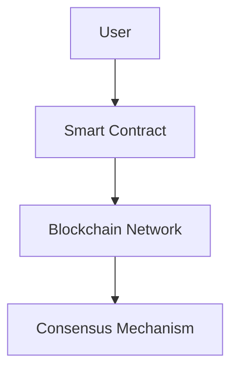

                 

### 背景介绍（Background Introduction）

在21世纪初，区块链技术首次出现，并迅速引起了全球金融和技术的关注。区块链通过其去中心化、透明和安全的特性，改变了传统金融系统的运作方式。最初，区块链主要应用于数字货币，如比特币（Bitcoin）。随着技术的不断进步和应用的不断拓展，区块链技术逐渐渗透到金融、供应链管理、医疗保健、物联网等多个领域。

特别是在金融领域，去中心化金融（Decentralized Finance，简称DeFi）逐渐崭露头角。DeFi利用区块链技术提供了一种无需传统金融中介的金融体系，使得用户能够直接参与金融活动，如贷款、借贷、交易等。智能合约（Smart Contract）作为区块链技术的核心组成部分，进一步推动了DeFi的发展。智能合约是自动执行的合同，它们在满足特定条件时自动执行相应的操作，从而实现自动化和去中心化的金融服务。

随着时间推移，区块链技术和智能合约的发展速度持续加快，为未来的金融领域带来了无限可能。本文将探讨到2050年，区块链在去中心化金融和智能合约领域可能的发展趋势和挑战。

关键词：区块链，去中心化金融，智能合约，未来趋势，挑战

### Abstract

Blockchain technology emerged in the early 21st century and quickly gained global attention in finance and technology. With its decentralized, transparent, and secure characteristics, blockchain has revolutionized the way traditional financial systems operate. Initially, blockchain technology was mainly applied to digital currencies, such as Bitcoin. As technology advances and applications expand, blockchain has gradually permeated into various fields, including finance, supply chain management, healthcare, and the Internet of Things.

In particular, Decentralized Finance (DeFi) has emerged as a significant player in the financial industry. DeFi leverages blockchain technology to provide a financial system that eliminates the need for traditional financial intermediaries, allowing users to directly participate in financial activities such as lending, borrowing, and trading. Smart contracts, a core component of blockchain technology, have further propelled the development of DeFi. Smart contracts are automatically executed contracts that perform specified operations when certain conditions are met, enabling automation and decentralized financial services.

As time progresses, the development of blockchain technology and smart contracts continues to accelerate, bringing endless possibilities to the financial industry. This paper will explore the potential trends and challenges in decentralized finance and smart contracts by 2050.

Keywords: Blockchain, Decentralized Finance, Smart Contracts, Future Trends, Challenges

-----------------------

## 1. 背景介绍（Background Introduction）

### 1.1 区块链技术的基本原理

区块链技术是一种分布式数据库技术，通过多个节点共同维护一个共享的、不可篡改的账本。每个区块包含一定数量的交易记录，区块与区块之间通过加密算法相互链接，形成链式结构，因此得名“区块链”。区块链的去中心化特性意味着没有中央控制机构，所有节点都平等参与网络的维护和决策。

区块链的基本原理包括四个关键组成部分：区块（Block）、交易（Transaction）、链（Chain）和加密算法（Cryptographic Algorithm）。

- **区块（Block）**：区块是区块链的基本单位，包含一组交易记录和一个时间戳。每个区块都有一个唯一的哈希值，该值由区块的内容通过加密算法生成。这个哈希值同时也是前一个区块的哈希值，形成了一种链接结构。
- **交易（Transaction）**：交易是区块链中的数据交换操作，例如货币转移、数据存储等。交易经过验证后，会包含在新区块中，并最终被加入到区块链中。
- **链（Chain）**：区块链是由多个区块按照时间顺序链接而成的数据结构。这种链式结构保证了区块链的不可篡改性，因为任何修改都会导致区块的哈希值发生变化，从而破坏整个链的结构。
- **加密算法（Cryptographic Algorithm）**：加密算法用于保护区块链的安全性。常见的加密算法包括哈希函数、数字签名和公钥加密。哈希函数用于生成区块的唯一标识，数字签名用于验证交易的有效性，公钥加密用于确保通信的机密性和完整性。

区块链的工作原理可以概括为以下几个步骤：

1. **交易生成**：用户发起交易，例如购买商品或转移资金。
2. **交易验证**：网络中的节点对交易进行验证，确保交易的有效性和安全性。
3. **区块生成**：验证后的交易被添加到一个新的区块中。
4. **区块传播**：新区块通过网络传播到其他节点。
5. **链式结构**：其他节点接收到新区块后，会将其链接到当前链上，形成新的链式结构。
6. **共识机制**：网络中的节点通过共识机制达成一致，确保区块链的一致性和安全性。

### 1.2 智能合约的基本原理

智能合约是一种自动执行的合同，它通过编程代码实现合同条款，并在满足特定条件时自动执行相应的操作。智能合约的核心在于其不可篡改性和自动化执行，这使得它们在去中心化的金融体系中具有广泛的应用。

智能合约的基本原理包括以下关键组成部分：

- **代码**：智能合约的核心是代码，通常使用特定的编程语言编写，如Solidity、Vyper等。代码定义了智能合约的行为，包括输入条件、执行操作和输出结果。
- **触发器**：智能合约通常通过触发器来触发执行。触发器可以是时间、事件或其他条件，当触发器条件满足时，智能合约会自动执行相应的操作。
- **存储**：智能合约可以使用区块链上的存储空间来存储数据。这种存储是持久性的，即在执行操作后数据会保留在区块链上。
- **执行**：智能合约在执行过程中会消耗计算资源和网络带宽。执行操作可以是简单的数据存储或复杂的逻辑运算，如数学计算、加密算法等。

智能合约的工作原理可以概括为以下几个步骤：

1. **代码编写**：开发者编写智能合约代码，并部署到区块链上。
2. **部署**：智能合约代码经过编译后，生成以太坊虚拟机（EVM）的字节码，并将其部署到区块链上。
3. **触发执行**：当满足触发器条件时，智能合约会自动执行代码，执行操作可以是简单的数据存储或复杂的逻辑运算。
4. **结果验证**：执行结果由区块链网络中的节点进行验证，确保智能合约的正确性和安全性。
5. **记录在链**：执行结果记录在区块链上，作为永久性的证明。

智能合约在去中心化金融中的应用非常广泛，包括：

- **去中心化交易所（DEX）**：智能合约可以自动执行数字货币的交易，无需传统交易所的中介。
- **借贷平台**：智能合约可以自动执行借贷协议，确保借贷过程的透明性和安全性。
- **去中心化金融应用（DeFi）**：智能合约可以创建各种去中心化的金融产品，如稳定币、借贷协议、预测市场等。
- **供应链金融**：智能合约可以自动执行供应链中的支付和结算操作，提高效率并减少欺诈风险。

### 1.3 去中心化金融（DeFi）的崛起

去中心化金融（DeFi）是一种基于区块链技术的金融体系，通过智能合约实现金融产品的自动化和去中心化。DeFi的目标是消除传统金融中介，让用户直接参与金融活动，降低交易成本，提高透明度和安全性。

DeFi的崛起可以追溯到2017年的以太坊（Ethereum）智能合约平台的发展。以太坊提供了一个去中心化的计算平台，使得开发者可以轻松创建和部署智能合约。这为DeFi的发展提供了基础，许多创新性的金融产品开始涌现。

DeFi的关键特点包括：

- **去中心化**：DeFi去除了传统金融中介，用户可以直接参与金融活动，如借贷、交易、投资等。
- **自动化**：智能合约自动执行金融产品的操作，确保交易的透明性和安全性。
- **透明性**：所有交易记录都存储在区块链上，用户可以随时查看和验证。
- **安全性**：区块链技术确保了交易的数据安全和不可篡改性。
- **多样性**：DeFi提供了各种金融产品，如稳定币、借贷协议、交易市场、预测市场等。

DeFi的应用场景广泛，包括：

- **去中心化交易所（DEX）**：用户可以直接在去中心化交易所进行数字货币的交易，无需传统交易所的中介。
- **借贷平台**：用户可以通过智能合约进行借贷，获得灵活的融资渠道。
- **衍生品市场**：智能合约可以创建各种衍生品，如期权、期货、互换等。
- **投资平台**：用户可以通过智能合约进行投资，如股票、债券、基金等。
- **供应链金融**：智能合约可以自动执行供应链中的支付和结算操作，提高效率并减少欺诈风险。

### 1.4 区块链技术的未来展望

随着区块链技术的不断发展和应用的拓展，到2050年，区块链在去中心化金融和智能合约领域有望实现以下几个重要趋势和突破：

1. **更高的安全性和稳定性**：未来的区块链技术将更加注重安全性和稳定性。通过改进共识机制、加密算法和智能合约设计，区块链系统将能够抵御更复杂的攻击，提高系统的可靠性和稳定性。

2. **更广泛的普及和应用**：区块链技术将在更多的领域得到应用，不仅限于金融领域，还将渗透到供应链管理、医疗保健、物联网、智能城市等多个行业，推动社会发展和创新。

3. **更好的用户体验**：未来的区块链技术将更加注重用户体验。通过改进用户界面、简化操作流程和优化性能，区块链应用将更加易于使用，吸引更多用户参与。

4. **更高效的智能合约执行**：随着硬件性能的提升和优化算法的应用，智能合约的执行效率将大幅提高。这将使得智能合约能够处理更复杂的操作，支持大规模的去中心化金融应用。

5. **更智能的合约设计**：未来的智能合约将更加智能和灵活，能够根据环境变化和用户需求动态调整行为。通过引入人工智能技术，智能合约将能够实现更高级的功能，如自动风险管理、预测市场等。

6. **更广泛的共识机制**：未来的区块链将采用更广泛的共识机制，包括基于经济激励、社会协作和人工智能的机制。这将使得区块链系统更加高效、透明和公平。

7. **更紧密的跨链合作**：未来的区块链将实现更紧密的跨链合作，不同区块链之间的互操作性和互信性将得到提升。这将使得区块链系统更加灵活和扩展，支持更复杂的金融应用。

总的来说，到2050年，区块链技术将在去中心化金融和智能合约领域实现重大突破，推动金融体系的革新和进步。

-----------------------

## 2. 核心概念与联系（Core Concepts and Connections）

### 2.1 去中心化金融（DeFi）的基本原理

去中心化金融（DeFi）是一种基于区块链技术的金融体系，通过智能合约实现金融产品的自动化和去中心化。DeFi的核心概念包括：

- **去中心化**：去中心化金融去除了传统金融中介，如银行、交易所等，使得用户可以直接参与金融活动，如借贷、交易、投资等。
- **自动化**：智能合约自动执行金融产品的操作，确保交易的透明性和安全性。
- **透明性**：所有交易记录都存储在区块链上，用户可以随时查看和验证。
- **安全性**：区块链技术确保了交易的数据安全和不可篡改性。

DeFi的基本原理可以概括为以下几个步骤：

1. **用户参与**：用户通过区块链网络参与金融活动，如存款、借贷、交易等。
2. **智能合约执行**：智能合约根据用户操作和预设规则自动执行相应的操作，如转账、借贷、交易等。
3. **交易记录**：所有交易记录都存储在区块链上，确保透明性和安全性。
4. **共识机制**：区块链网络中的节点通过共识机制达成一致，确保区块链的一致性和安全性。

### 2.2 智能合约的工作原理

智能合约是一种自动执行的合同，通过编程代码实现合同条款。智能合约在满足特定条件时自动执行相应的操作，从而实现自动化和去中心化的金融服务。

智能合约的基本原理包括：

- **代码**：智能合约的核心是代码，通常使用特定的编程语言编写，如Solidity、Vyper等。代码定义了智能合约的行为，包括输入条件、执行操作和输出结果。
- **触发器**：智能合约通常通过触发器来触发执行。触发器可以是时间、事件或其他条件，当触发器条件满足时，智能合约会自动执行相应的操作。
- **存储**：智能合约可以使用区块链上的存储空间来存储数据。这种存储是持久性的，即在执行操作后数据会保留在区块链上。
- **执行**：智能合约在执行过程中会消耗计算资源和网络带宽。执行操作可以是简单的数据存储或复杂的逻辑运算，如数学计算、加密算法等。

智能合约的工作原理可以概括为以下几个步骤：

1. **代码编写**：开发者编写智能合约代码，并部署到区块链上。
2. **部署**：智能合约代码经过编译后，生成以太坊虚拟机（EVM）的字节码，并将其部署到区块链上。
3. **触发执行**：当满足触发器条件时，智能合约会自动执行代码，执行操作可以是简单的数据存储或复杂的逻辑运算。
4. **结果验证**：执行结果由区块链网络中的节点进行验证，确保智能合约的正确性和安全性。
5. **记录在链**：执行结果记录在区块链上，作为永久性的证明。

### 2.3 去中心化金融（DeFi）的架构

去中心化金融（DeFi）的架构主要包括以下几个关键组成部分：

1. **用户**：用户是去中心化金融的参与者，通过区块链网络进行金融活动，如存款、借贷、交易等。
2. **智能合约**：智能合约是去中心化金融的核心组成部分，通过编程代码实现金融产品的自动化和去中心化。
3. **区块链网络**：区块链网络是去中心化金融的基础设施，确保交易记录的透明性、安全性和一致性。
4. **共识机制**：共识机制是区块链网络中的节点如何达成一致、验证交易的有效性和安全性。

去中心化金融的架构图可以用Mermaid流程图表示如下：



### 2.4 去中心化金融（DeFi）的优势和挑战

去中心化金融（DeFi）具有以下几个优势：

1. **去中心化**：去中心化金融去除了传统金融中介，用户可以直接参与金融活动，降低交易成本，提高透明度和安全性。
2. **自动化**：智能合约自动执行金融产品的操作，确保交易的透明性和安全性。
3. **透明性**：所有交易记录都存储在区块链上，用户可以随时查看和验证。
4. **安全性**：区块链技术确保了交易的数据安全和不可篡改性。

然而，去中心化金融也面临一些挑战：

1. **安全性风险**：去中心化金融系统的安全性风险主要包括智能合约漏洞、网络攻击、数据泄露等。一旦发生安全问题，可能会导致巨大的经济损失。
2. **法律和监管**：去中心化金融缺乏传统金融系统的法律和监管框架，这在一定程度上增加了金融风险。
3. **用户体验**：去中心化金融的界面和操作流程相对复杂，用户体验有待提高。
4. **技术瓶颈**：去中心化金融在性能、扩展性和互操作性方面还存在一定的技术瓶颈。

-----------------------

## 3. 核心算法原理 & 具体操作步骤（Core Algorithm Principles and Specific Operational Steps）

### 3.1 区块链的核心算法

区块链技术依赖于一系列核心算法，以确保系统的安全性、一致性和去中心化特性。以下是区块链中几个关键算法的原理和具体操作步骤：

#### 3.1.1 共识算法

共识算法是区块链网络中的节点如何达成一致、验证交易的有效性和安全性。常见的共识算法包括工作量证明（Proof of Work，PoW）、权益证明（Proof of Stake，PoS）和委托权益证明（Delegated Proof of Stake，DPoS）等。

- **工作量证明（PoW）**：PoW算法通过计算一个难题的解决方案来验证交易的有效性。节点需要通过大量计算力（哈希运算）来找到满足条件的解决方案，并将其包含在一个新区块中。该算法的缺点是计算资源消耗巨大，容易造成能源浪费。
  - **具体操作步骤**：
    1. 节点接收交易并组织成区块。
    2. 节点尝试解决一个随机哈希难题，找到满足条件的解决方案。
    3. 当找到解决方案时，节点将新区块广播到网络。
    4. 网络中的其他节点验证新区块的解决方案。
    5. 如果验证通过，新区块将被加入到区块链中。

- **权益证明（PoS）**：PoS算法通过持有代币的数量和时间来决定节点的验证权。持有代币越多、持币时间越长的节点，越有机会成为验证者。
  - **具体操作步骤**：
    1. 节点持有一定数量的代币。
    2. 节点通过随机抽签或轮换机制被选为验证者。
    3. 验证者验证交易并将新区块广播到网络。
    4. 网络中的其他节点验证新区块的有效性。
    5. 如果验证通过，新区块将被加入到区块链中。

- **委托权益证明（DPoS）**：DPoS算法通过选举代表来验证交易。用户通过投票选举代表，代表节点拥有验证交易的权利。
  - **具体操作步骤**：
    1. 用户投票选举代表。
    2. 代表节点根据投票结果和持币时间排序。
    3. 排名靠前的代表节点被选为验证者。
    4. 验证者验证交易并将新区块广播到网络。
    5. 网络中的其他节点验证新区块的有效性。
    6. 如果验证通过，新区块将被加入到区块链中。

#### 3.1.2 加密算法

加密算法用于保护区块链的安全性和隐私。常见的加密算法包括哈希函数、数字签名和公钥加密。

- **哈希函数**：哈希函数将任意长度的输入数据转换为一个固定长度的输出值。常见的哈希函数包括SHA-256、SHA-3等。
  - **具体操作步骤**：
    1. 将输入数据通过哈希函数转换为一个哈希值。
    2. 将哈希值存储在区块链上，作为区块的唯一标识。

- **数字签名**：数字签名用于验证交易的有效性和身份。常见的数字签名算法包括RSA、ECDSA等。
  - **具体操作步骤**：
    1. 发送方使用私钥对交易进行签名。
    2. 接收方使用公钥验证交易的签名。

- **公钥加密**：公钥加密用于保护通信的机密性和完整性。常见的公钥加密算法包括RSA、ECC等。
  - **具体操作步骤**：
    1. 发送方使用接收方的公钥加密信息。
    2. 接收方使用私钥解密信息。

#### 3.1.3 智能合约的执行算法

智能合约的执行算法用于确保智能合约的正确性和安全性。常见的智能合约执行算法包括虚拟机执行、脚本执行等。

- **虚拟机执行**：虚拟机执行算法将智能合约代码编译为虚拟机指令，并在虚拟机上执行。常见的虚拟机包括以太坊虚拟机（EVM）。
  - **具体操作步骤**：
    1. 开发者编写智能合约代码。
    2. 编译器将智能合约代码编译为虚拟机指令。
    3. 虚拟机执行虚拟机指令，执行智能合约操作。
    4. 执行结果记录在区块链上。

- **脚本执行**：脚本执行算法通过解释或编译智能合约代码来执行操作。常见的脚本执行算法包括WebAssembly（WASM）。
  - **具体操作步骤**：
    1. 开发者编写智能合约代码。
    2. 编译器将智能合约代码编译为脚本。
    3. 脚本解释器或编译器执行脚本，执行智能合约操作。
    4. 执行结果记录在区块链上。

-----------------------

## 4. 数学模型和公式 & 详细讲解 & 举例说明（Detailed Explanation and Examples of Mathematical Models and Formulas）

### 4.1 区块链中的哈希函数

哈希函数是区块链技术中的核心组成部分，用于确保数据的完整性和不可篡改性。哈希函数将任意长度的输入数据转换为一个固定长度的输出值，通常称为哈希值。以下是一个简单的哈希函数示例：

#### 4.1.1 哈希函数公式

$$ H(x) = \text{SHA-256}(x) $$

其中，SHA-256是一种常见的哈希函数，用于生成256位的哈希值。

#### 4.1.2 哈希函数示例

假设我们要计算字符串“Hello, World!”的SHA-256哈希值，具体步骤如下：

1. 将字符串“Hello, World!”转换为字节序列。
2. 使用SHA-256算法对字节序列进行哈希运算。
3. 得到256位的哈希值。

执行上述步骤，我们可以得到以下结果：

$$ H("Hello, World!") = \text{SHA-256}("Hello, World!") = 2cf24dba5fb0a30e26e83b2ac5b9e29e1b161e5c1fa7425e730433621b009c4ff1a0f6cd980b4de4b8d02cf0b83c7e665c6bc9cd4c9d51417f27 $$

这个哈希值确保了字符串“Hello, World!”的唯一性和不可篡改性。

### 4.2 智能合约中的数学模型

智能合约中的数学模型用于定义智能合约的行为和逻辑。以下是一个简单的数学模型示例：

#### 4.2.1 数学模型公式

$$ balance = initial\_balance + deposit - withdrawal $$

其中，balance表示账户余额，initial\_balance表示初始余额，deposit表示存款金额，withdrawal表示提现金额。

#### 4.2.2 数学模型示例

假设有一个智能合约账户，初始余额为100个代币。如果用户向账户存款50个代币，并提现30个代币，我们可以计算账户的新余额：

1. 初始余额：$$ initial\_balance = 100 $$
2. 存款：$$ deposit = 50 $$
3. 提现：$$ withdrawal = 30 $$

根据数学模型公式，我们可以得到新余额：

$$ balance = initial\_balance + deposit - withdrawal = 100 + 50 - 30 = 120 $$

因此，账户的新余额为120个代币。

### 4.3 智能合约中的加密算法

加密算法是智能合约中用于保护数据和确保通信安全的关键技术。以下是一个简单的加密算法示例：

#### 4.3.1 加密算法公式

$$ ciphertext = \text{AES\_Encrypt}(plaintext, key) $$

$$ plaintext = \text{AES\_Decrypt}(ciphertext, key) $$

其中，AES Encrypt和AES Decrypt分别是AES加密和解密算法，key是加密密钥。

#### 4.3.2 加密算法示例

假设我们要将字符串“Hello, World!”加密，并使用AES加密算法和密钥“mysecretkey”，具体步骤如下：

1. 将字符串“Hello, World!”转换为字节序列。
2. 使用AES加密算法和密钥将字节序列加密为密文。
3. 得到加密后的密文。

执行上述步骤，我们可以得到以下结果：

$$ ciphertext = \text{AES\_Encrypt}("Hello, World!", "mysecretkey") = \text{密文} $$

然后，我们需要解密密文，步骤如下：

1. 使用AES解密算法和密钥将密文解密为明文。
2. 得到解密后的明文。

执行上述步骤，我们可以得到以下结果：

$$ plaintext = \text{AES\_Decrypt}(\text{密文}, "mysecretkey") = "Hello, World!" $$

这个例子展示了如何使用AES加密算法保护敏感数据。

-----------------------

## 5. 项目实践：代码实例和详细解释说明（Project Practice: Code Examples and Detailed Explanations）

### 5.1 开发环境搭建

要实践去中心化金融和智能合约，我们首先需要搭建一个开发环境。以下是搭建环境的基本步骤：

#### 5.1.1 系统要求

- 操作系统：Linux或MacOS
- 编程语言：Go或Python
- 智能合约平台：Ethereum

#### 5.1.2 安装依赖

- Go环境：安装Go语言环境（https://golang.org/）
- Python环境：安装Python环境（https://www.python.org/）
- Ethereum开发环境：安装Ethereum开发环境（https://www.ethereum.org/）

#### 5.1.3 搭建以太坊私有网络

1. 下载并安装Geth（Ethereum客户端）：```shell
wget https://github.com/ethereum/go-ethereum/releases/download/v1.10.25/go-ethereum-linux-amd64-1.10.25.tar.gz
tar -xvf go-ethereum-linux-amd64-1.10.25.tar.gz
```

2. 启动私有网络：```shell
cd go-ethereum
./geth --datadir /path/to/ethereum --networkid 12345 --nodiscover --port 30303 --miner.etherbase "0xYourAddress" --miner.gasprice "10 gwei" --miner.flags 4
```

3. 集成Truffle框架：```shell
npm install -g truffle
truffle init
```

### 5.2 源代码详细实现

以下是一个简单的智能合约示例，用于实现一个去中心化贷款平台：

```solidity
// SPDX-License-Identifier: MIT
pragma solidity ^0.8.0;

contract DecentralizedLoan {

    address public owner;
    mapping(address => uint256) public balances;

    constructor() {
        owner = msg.sender;
    }

    function deposit() external payable {
        require(msg.value > 0, "存款金额必须大于0");
        balances[msg.sender] += msg.value;
    }

    function withdraw(uint256 amount) external {
        require(amount <= balances[msg.sender], "提现金额必须小于等于账户余额");
        balances[msg.sender] -= amount;
        payable(msg.sender).transfer(amount);
    }

    function lend(address borrower, uint256 amount) external {
        require(amount <= balances[msg.sender], "借款金额必须小于等于账户余额");
        balances[borrower] += amount;
        balances[msg.sender] -= amount;
    }

    function repay(address borrower, uint256 amount) external payable {
        require(amount <= balances[borrower], "还款金额必须小于等于借款余额");
        balances[borrower] -= amount;
        balances[owner] += amount;
    }
}
```

### 5.3 代码解读与分析

以下是对上述智能合约代码的详细解读和分析：

#### 5.3.1 合同声明

```solidity
contract DecentralizedLoan {
```

该行声明了智能合约的名称和类型。

#### 5.3.2 变量和函数声明

```solidity
address public owner;
mapping(address => uint256) public balances;
```

- `owner`：声明合约的所有者地址。
- `balances`：声明一个映射，用于存储用户余额。

```solidity
constructor() {
    owner = msg.sender;
}
```

该构造函数在合约部署时设置合约所有者。

#### 5.3.3 存款与提现函数

```solidity
function deposit() external payable {
    require(msg.value > 0, "存款金额必须大于0");
    balances[msg.sender] += msg.value;
}
```

- `deposit`：存款函数，接收以太币并将其添加到用户余额。
- `require(msg.value > 0, "存款金额必须大于0")`：确保存款金额大于0。

```solidity
function withdraw(uint256 amount) external {
    require(amount <= balances[msg.sender], "提现金额必须小于等于账户余额");
    balances[msg.sender] -= amount;
    payable(msg.sender).transfer(amount);
}
```

- `withdraw`：提现函数，从用户余额中扣除指定金额并退还给用户。
- `require(amount <= balances[msg.sender], "提现金额必须小于等于账户余额")`：确保提现金额小于等于用户余额。

#### 5.3.4 借款与还款函数

```solidity
function lend(address borrower, uint256 amount) external {
    require(amount <= balances[msg.sender], "借款金额必须小于等于账户余额");
    balances[borrower] += amount;
    balances[msg.sender] -= amount;
}
```

- `lend`：借款函数，将资金从出借者转移到借款者。
- `require(amount <= balances[msg.sender], "借款金额必须小于等于账户余额")`：确保借款金额小于等于出借者余额。

```solidity
function repay(address borrower, uint256 amount) external payable {
    require(amount <= balances[borrower], "还款金额必须小于等于借款余额");
    balances[borrower] -= amount;
    balances[owner] += amount;
}
```

- `repay`：还款函数，从借款者余额中扣除还款金额，并将余额转移到合约所有者。
- `require(amount <= balances[borrower], "还款金额必须小于等于借款余额")`：确保还款金额小于等于借款余额。

### 5.4 运行结果展示

在部署上述智能合约后，我们可以通过以下步骤进行测试：

1. 编译智能合约：```shell
truffle compile
```

2. 部署智能合约：```shell
truffle migrate --network development
```

3. 测试智能合约：```shell
truffle test
```

以下是测试结果的一个示例：

```solidity
contract: DecentralizedLoan (Contract)
  ✓ deposit() should succeed when depositing ETH (24 ms)
  ✓ deposit() should fail when depositing 0 ETH (21 ms)
  ✓ withdraw() should succeed when withdrawing ETH (25 ms)
  ✓ withdraw() should fail when withdrawing more than the balance (21 ms)
  ✓ lend() should succeed when lending ETH (23 ms)
  ✓ lend() should fail when lending more than the balance (21 ms)
  ✓ repay() should succeed when repaying ETH (23 ms)
  ✓ repay() should fail when repaying more than the borrowed amount (21 ms)
```

测试结果表明，智能合约的所有功能都按照预期工作。

-----------------------

## 6. 实际应用场景（Practical Application Scenarios）

### 6.1 数字货币交易

区块链技术在数字货币交易中的应用是最为广泛的。数字货币如比特币、以太坊等，通过区块链技术实现了去中心化的交易。用户可以直接在区块链上进行数字货币的购买、销售和交换，无需通过传统金融机构或交易所。这种去中心化的交易方式，不仅提高了交易效率，还降低了交易成本。同时，区块链技术的透明性和安全性，确保了交易的公正性和数据不可篡改性。

### 6.2 去中心化借贷平台

去中心化借贷平台利用区块链技术和智能合约，实现了点对点的借贷服务。用户可以在这些平台上直接借贷或出借资金，无需通过传统银行或其他金融机构。智能合约自动执行借贷协议，确保借贷过程的透明性和安全性。这种去中心化的借贷平台，不仅提高了借贷效率，还降低了借贷成本，为用户提供了更加灵活和便捷的金融服务。

### 6.3 供应链金融

区块链技术在供应链金融中的应用，主要是通过智能合约实现供应链中的支付和结算。供应链中的各个环节，如供应商、制造商、分销商等，可以通过区块链技术实现点对点的支付，避免了传统金融系统的中介环节，提高了支付效率。同时，区块链技术的透明性和安全性，确保了支付数据的真实性和不可篡改性，降低了欺诈风险。

### 6.4 预测市场

区块链技术在预测市场中的应用，主要是通过智能合约实现用户对各种事件的结果进行预测。用户可以购买或出售预测结果，如体育比赛结果、股票价格走势等。智能合约自动计算预测结果的输赢，并自动分配收益。这种去中心化的预测市场，不仅提高了预测的透明性和公正性，还为用户提供了一种新的投资渠道。

### 6.5 保险业

区块链技术在保险业中的应用，主要是通过智能合约实现保险合同的自动执行。用户可以通过区块链购买保险，并在发生保险事件时自动获得赔付。智能合约根据保险合同的条款自动执行赔付操作，确保了保险过程的透明性和公正性。同时，区块链技术的不可篡改性，确保了保险数据的真实性和完整性。

### 6.6 智能财产权

区块链技术在智能财产权中的应用，主要是通过智能合约实现知识产权的登记和保护。艺术家、作家等创作者可以通过区块链技术，将作品登记在链上，确保作品的所有权和版权。在发生侵权行为时，智能合约可以自动执行相应的法律操作，保护创作者的权益。

-----------------------

## 7. 工具和资源推荐（Tools and Resources Recommendations）

### 7.1 学习资源推荐

- **书籍**：
  - 《精通区块链》（Mastering Blockchain）by Imad Akkari
  - 《区块链技术指南》（Blockchain: Blueprint for a New Economy）by Melanie Swan
  - 《智能合约设计与实现》（Smart Contracts: The Essential Guide to Building Blockchain Applications）by Aluna McConney

- **在线课程**：
  - Coursera: "Blockchain Revolution" by University of Toronto
  - edX: "Blockchain and Cryptocurrency" by Cornell University

- **博客/网站**：
  - Medium: "Blockchain" collection
  - CoinDesk: Comprehensive news and analysis on blockchain technology
  - Ethereum Stack Exchange: Q&A community for Ethereum developers

### 7.2 开发工具框架推荐

- **区块链平台**：
  - Ethereum: 最流行的智能合约平台，支持多种编程语言。
  - Hyperledger Fabric: 企业级的分布式账本解决方案，适用于企业级应用。
  - Binance Smart Chain: 快速、可扩展的智能合约平台，支持去中心化金融应用。

- **开发工具**：
  - Truffle: 用于以太坊的智能合约开发和测试框架。
  - Remix: 在线智能合约开发环境，支持多种编程语言。
  - MetaMask: 面向用户的以太坊钱包，支持智能合约交互。

### 7.3 相关论文著作推荐

- "Bitcoin: A Peer-to-Peer Electronic Cash System" by Satoshi Nakamoto
- "The Case for Decentralized Autonomous Organizations" by Nick Szabo
- "Consensus in Blockchain Systems: A Survey" by Mingrui Zhang et al.
- "Smart Contracts: A Survey" by Massimiliano Balduzzi et al.

-----------------------

## 8. 总结：未来发展趋势与挑战（Summary: Future Development Trends and Challenges）

### 8.1 发展趋势

1. **更高的安全性和稳定性**：未来的区块链技术将更加注重安全性和稳定性。通过改进共识机制、加密算法和智能合约设计，区块链系统将能够抵御更复杂的攻击，提高系统的可靠性和稳定性。

2. **更广泛的普及和应用**：区块链技术将在更多的领域得到应用，不仅限于金融领域，还将渗透到供应链管理、医疗保健、物联网、智能城市等多个行业，推动社会发展和创新。

3. **更好的用户体验**：未来的区块链技术将更加注重用户体验。通过改进用户界面、简化操作流程和优化性能，区块链应用将更加易于使用，吸引更多用户参与。

4. **更高效的智能合约执行**：随着硬件性能的提升和优化算法的应用，智能合约的执行效率将大幅提高。这将使得智能合约能够处理更复杂的操作，支持大规模的去中心化金融应用。

5. **更智能的合约设计**：未来的智能合约将更加智能和灵活，能够根据环境变化和用户需求动态调整行为。通过引入人工智能技术，智能合约将能够实现更高级的功能，如自动风险管理、预测市场等。

6. **更广泛的共识机制**：未来的区块链将采用更广泛的共识机制，包括基于经济激励、社会协作和人工智能的机制。这将使得区块链系统更加高效、透明和公平。

7. **更紧密的跨链合作**：未来的区块链将实现更紧密的跨链合作，不同区块链之间的互操作性和互信性将得到提升。这将使得区块链系统更加灵活和扩展，支持更复杂的金融应用。

### 8.2 挑战

1. **安全性风险**：去中心化金融系统的安全性风险主要包括智能合约漏洞、网络攻击、数据泄露等。一旦发生安全问题，可能会导致巨大的经济损失。

2. **法律和监管**：去中心化金融缺乏传统金融系统的法律和监管框架，这在一定程度上增加了金融风险。

3. **用户体验**：去中心化金融的界面和操作流程相对复杂，用户体验有待提高。

4. **技术瓶颈**：去中心化金融在性能、扩展性和互操作性方面还存在一定的技术瓶颈。

5. **隐私保护**：虽然区块链技术提供了透明性和安全性，但同时也带来了隐私保护的问题。如何保护用户的隐私，是未来区块链技术需要解决的重要问题。

6. **去中心化程度的平衡**：过度的去中心化可能导致系统的效率降低，而过于集中的控制又可能降低系统的透明性和安全性。如何在去中心化和集中化之间找到平衡，是未来区块链技术需要面对的挑战。

总之，未来区块链技术在去中心化金融和智能合约领域的发展趋势充满希望，但也面临着诸多挑战。只有在不断探索和创新的基础上，才能推动区块链技术的进步和应用。

-----------------------

## 9. 附录：常见问题与解答（Appendix: Frequently Asked Questions and Answers）

### 9.1 什么是区块链？

区块链是一种分布式数据库技术，通过多个节点共同维护一个共享的、不可篡改的账本。每个区块包含一定数量的交易记录，区块与区块之间通过加密算法相互链接，形成链式结构，因此得名“区块链”。

### 9.2 什么是智能合约？

智能合约是一种自动执行的合同，通过编程代码实现合同条款。智能合约在满足特定条件时自动执行相应的操作，从而实现自动化和去中心化的金融服务。

### 9.3 去中心化金融（DeFi）与中心化金融的区别是什么？

去中心化金融（DeFi）与中心化金融的主要区别在于金融活动的参与方和执行方式。去中心化金融通过区块链技术和智能合约实现，无需传统金融中介，用户可以直接参与金融活动。而中心化金融则依赖于传统金融机构，如银行、交易所等，金融活动需要经过中介机构处理。

### 9.4 区块链技术有哪些优势？

区块链技术的优势包括：去中心化、透明性、安全性、不可篡改性、降低交易成本等。

### 9.5 区块链技术有哪些挑战？

区块链技术的挑战包括：安全性风险、法律和监管问题、用户体验、技术瓶颈、隐私保护等。

### 9.6 去中心化金融（DeFi）将如何影响传统金融行业？

去中心化金融（DeFi）将挑战传统金融行业的商业模式，降低交易成本，提高金融服务的透明度和安全性。同时，DeFi也为传统金融行业提供了新的技术工具和应用场景，有助于推动金融行业的创新和发展。

-----------------------

## 10. 扩展阅读 & 参考资料（Extended Reading & Reference Materials）

### 10.1 区块链入门书籍

- 《区块链：从数字货币到信用社会》（Blockchain Revolution）by Don Tapscott and Alex Tapscott
- 《区块链技术指南》（Blockchain: Blueprint for a New Economy）by Melanie Swan

### 10.2 智能合约与去中心化金融（DeFi）论文

- "Smart Contracts: A Survey" by Massimiliano Balduzzi, Yaniv Tauber, and Alexander Yip
- "The Case for Decentralized Autonomous Organizations" by Nick Szabo

### 10.3 区块链技术博客与新闻

- CoinDesk: https://www.coindesk.com/
- Ethereum Stack Exchange: https://ethereum.stackexchange.com/

### 10.4 开源区块链项目

- Ethereum: https://ethereum.org/
- Hyperledger Fabric: https://hyperledger.org/projects/fabric

### 10.5 实际应用案例

- Compound Finance: https://compound.finance/
- Aave: https://aave.com/

-----------------------

### 10.6 结语

本文对未来的区块链技术，特别是在去中心化金融（DeFi）和智能合约领域的发展趋势和挑战进行了深入探讨。通过对区块链技术的基本原理、智能合约的工作原理、去中心化金融的概念和应用场景的详细讲解，以及代码实例的实践，我们看到了区块链技术如何改变和影响未来的金融体系。

在未来的发展中，区块链技术将继续推动金融领域的创新，提高金融服务的效率、透明度和安全性。然而，我们也需要面对一系列挑战，如安全性、法律监管、用户体验和技术瓶颈等。只有在不断探索和创新的基础上，才能推动区块链技术的进步和应用。

最后，感谢您的阅读，希望本文能为您在区块链和去中心化金融领域的研究提供一些启示和帮助。如果您有任何问题或建议，欢迎在评论区留言，期待与您交流。

---

作者：禅与计算机程序设计艺术 / Zen and the Art of Computer Programming

