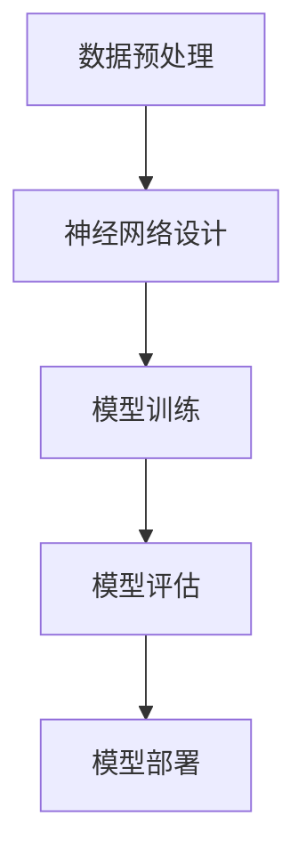
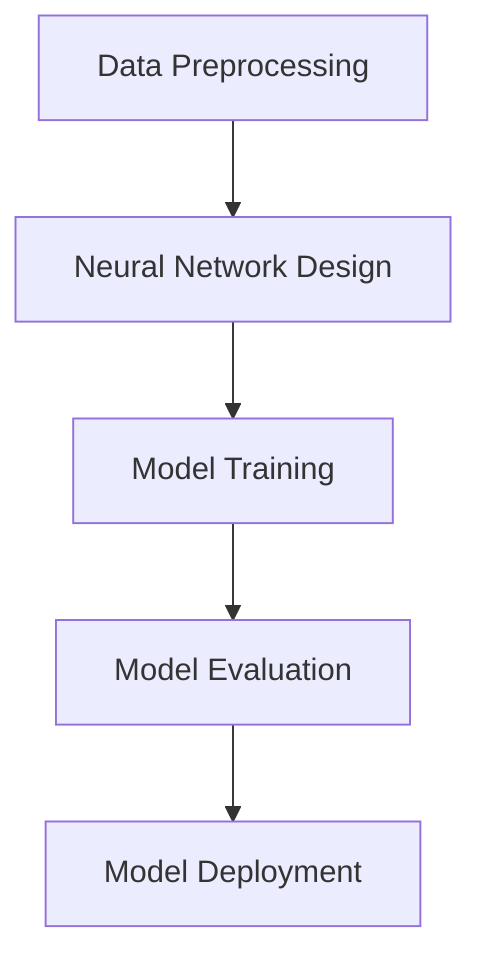

                 

### 1. 背景介绍（Background Introduction）

在当今世界，人工智能（AI）正迅速发展，成为推动社会进步和经济发展的关键力量。AI 技术不仅在科学研究、医疗保健、金融服务、交通运输等多个领域取得了显著成果，而且还极大地改变了人们的生活方式和商业模式。随着 AI 技术的不断进步，一个全新的 AI 2.0 时代正逐渐来临。

AI 2.0 是指相较于第一代 AI 技术，AI 2.0 时代的人工智能将具备更强大的自主学习和自适应能力，能够在没有人类干预的情况下做出更加复杂和精准的决策。这一时代的到来，将带来前所未有的技术变革和社会影响。因此，投资于 AI 2.0 时代的公司和技术，无疑具有巨大的潜在价值。

本文旨在探讨 AI 2.0 时代的投资价值，从技术、市场、政策等多个角度进行分析。我们将首先回顾 AI 的发展历程，了解 AI 2.0 的概念和特点，然后分析 AI 2.0 在各个领域的应用前景，最后讨论投资 AI 2.0 时代的策略和风险。

### Introduction to the Background

In today's world, artificial intelligence (AI) is rapidly advancing and becoming a crucial force driving social progress and economic development. AI technologies have made significant achievements in various fields, such as scientific research, healthcare, financial services, transportation, and have greatly transformed people's lifestyles and business models. With the continuous improvement of AI technology, a new era of AI 2.0 is gradually approaching.

AI 2.0 refers to the era of artificial intelligence that, compared to the first-generation AI technologies, will have stronger autonomous learning and adaptive capabilities, allowing it to make more complex and accurate decisions without human intervention. The arrival of this era will bring unprecedented technological transformation and social impact. Therefore, investing in companies and technologies during the AI 2.0 era has immense potential value.

This article aims to explore the investment value of the AI 2.0 era by analyzing it from various perspectives, such as technology, market, and policy. We will first review the development history of AI, understand the concept and characteristics of AI 2.0, then analyze the application prospects of AI 2.0 in various fields, and finally discuss the strategies and risks of investing in the AI 2.0 era.

-------------------

### 2. 核心概念与联系（Core Concepts and Connections）

#### 2.1 AI 2.0 的概念与特点

AI 2.0，也称为强人工智能（Strong AI）或通用人工智能（AGI，Artificial General Intelligence），是指具有人类智能特点的 AI 系统。与传统的弱人工智能（Weak AI）不同，AI 2.0 具有跨领域的自适应学习能力和推理能力，能够在不同的环境和任务中表现出与人类相似的智能水平。

AI 2.0 的主要特点包括：

1. **自主性**：AI 2.0 系统能够在没有人类干预的情况下，自主学习和决策。
2. **跨领域**：AI 2.0 能够在不同领域和任务中灵活运用其知识，具备通用性。
3. **适应能力**：AI 2.0 系统能够在不断变化的情境中，快速适应和调整。
4. **创造力**：AI 2.0 能够进行创新和创造，不仅仅是执行既定的任务。

#### 2.2 AI 2.0 与第一代 AI 的区别

第一代 AI 主要以规则为基础，通过预定义的规则和算法进行推理和决策。而 AI 2.0 则基于深度学习和神经网络，具有自我学习和进化能力。具体区别如下：

1. **理论基础**：第一代 AI 以符号主义为基础，而 AI 2.0 则基于连接主义。
2. **学习方式**：第一代 AI 需要人类工程师提供规则，而 AI 2.0 能够自主学习。
3. **适应能力**：第一代 AI 适应新任务的能力较弱，而 AI 2.0 具有更强的适应性和泛化能力。
4. **应用领域**：第一代 AI 主要应用于特定领域，而 AI 2.0 则能够跨领域应用。

#### 2.3 AI 2.0 的应用前景

AI 2.0 的应用前景非常广阔，涵盖了多个领域：

1. **医疗健康**：AI 2.0 能够在疾病诊断、药物研发、个性化治疗等方面发挥重要作用。
2. **金融服务**：AI 2.0 可以为金融产品定价、风险管理、欺诈检测等提供支持。
3. **教育**：AI 2.0 可以为个性化教学、学习分析、智能评估等提供支持。
4. **智能制造**：AI 2.0 可以为智能制造、质量控制、智能优化等提供支持。
5. **交通运输**：AI 2.0 可以为自动驾驶、智能交通管理、无人机配送等提供支持。

### Core Concepts and Connections

#### 2.1 The Concept and Characteristics of AI 2.0

AI 2.0, also known as Strong AI or Artificial General Intelligence (AGI), refers to AI systems that possess human-like intelligence characteristics. Unlike traditional Weak AI, AI 2.0 has cross-domain adaptive learning and reasoning capabilities, enabling it to perform at a level similar to humans in various environments and tasks.

The main characteristics of AI 2.0 include:

1. **Autonomy**: AI 2.0 systems can learn and make decisions without human intervention.
2. **Cross-domain**: AI 2.0 can flexibly apply its knowledge across different fields and tasks, possessing generality.
3. **Adaptive ability**: AI 2.0 systems can quickly adapt and adjust to changing situations.
4. **Creativity**: AI 2.0 can engage in innovation and creation, not just execute predefined tasks.

#### 2.2 Differences between AI 2.0 and the First Generation of AI

The first-generation AI is mainly rule-based, using predefined rules and algorithms for reasoning and decision-making. AI 2.0, on the other hand, is based on deep learning and neural networks, possessing self-learning and evolutionary capabilities. The specific differences are as follows:

1. **Theoretical Foundation**: The first-generation AI is based on symbolism, while AI 2.0 is based on connectionism.
2. **Learning Methods**: The first-generation AI requires human engineers to provide rules, while AI 2.0 can learn autonomously.
3. **Adaptability**: The first-generation AI has limited capability to adapt to new tasks, while AI 2.0 has stronger adaptability and generalization ability.
4. **Application Fields**: The first-generation AI is mainly applied to specific fields, while AI 2.0 can be used across domains.

#### 2.3 Application Prospects of AI 2.0

The application prospects of AI 2.0 are extensive, covering multiple fields:

1. **Medical Health**: AI 2.0 can play a significant role in disease diagnosis, drug development, personalized treatment, and other areas.
2. **Financial Services**: AI 2.0 can support financial product pricing, risk management, fraud detection, and other areas.
3. **Education**: AI 2.0 can support personalized teaching, learning analysis, intelligent assessment, and other areas.
4. **Intelligent Manufacturing**: AI 2.0 can support intelligent manufacturing, quality control, and intelligent optimization.
5. **Transportation**: AI 2.0 can support autonomous driving, intelligent traffic management, and unmanned delivery.

-------------------

### 3. 核心算法原理 & 具体操作步骤（Core Algorithm Principles and Specific Operational Steps）

AI 2.0 的核心算法原理主要基于深度学习和神经网络技术。以下是 AI 2.0 核心算法的基本原理和具体操作步骤：

#### 3.1 深度学习原理

深度学习是一种机器学习技术，它通过模拟人脑中的神经网络结构，对大量数据进行学习和建模。深度学习的基本原理包括：

1. **神经网络**：神经网络由多个相互连接的神经元组成，每个神经元都可以接收输入信息，并通过权重和偏置进行加权求和，最后通过激活函数进行非线性变换。
2. **反向传播**：反向传播是一种用于训练神经网络的算法，通过计算损失函数的梯度，不断调整神经网络的权重和偏置，以达到最小化损失函数的目的。
3. **优化算法**：常用的优化算法包括梯度下降、动量梯度下降、Adam 算法等，这些算法通过调整学习率，提高训练效率。

#### 3.2 神经网络结构

神经网络的结构主要包括输入层、隐藏层和输出层。每个层次都包含多个神经元，层次之间通过权重连接。神经网络的结构和参数（如神经元数量、连接权重等）需要在训练过程中通过大量数据进行调整，以实现模型的最优性能。

#### 3.3 操作步骤

以下是 AI 2.0 核心算法的具体操作步骤：

1. **数据预处理**：对输入数据进行清洗、归一化等处理，以消除噪声和提高模型性能。
2. **神经网络设计**：根据任务需求，设计合适的神经网络结构，包括神经元数量、层数等。
3. **模型训练**：使用训练数据对神经网络进行训练，通过反向传播算法不断调整模型参数，以最小化损失函数。
4. **模型评估**：使用验证数据集评估模型的性能，调整模型参数以优化性能。
5. **模型部署**：将训练好的模型部署到实际应用场景中，进行预测和决策。

#### 3.4 Mermaid 流程图

以下是一个简化的 AI 2.0 核心算法的 Mermaid 流程图：



### Core Algorithm Principles and Specific Operational Steps

The core algorithm principles of AI 2.0 are primarily based on deep learning and neural network technologies. Here are the basic principles and specific operational steps of AI 2.0 core algorithms:

#### 3.1 Principles of Deep Learning

Deep learning is a machine learning technique that simulates the neural network structure of the human brain to learn and model large amounts of data. The basic principles of deep learning include:

1. **Neural Networks**: Neural networks consist of multiple interconnected neurons, each of which can receive input information, and through weights and biases, they perform weighted summation and then apply a nonlinear transformation via an activation function.
2. **Backpropagation**: Backpropagation is an algorithm used to train neural networks, which calculates the gradient of the loss function to continuously adjust the weights and biases of the network to minimize the loss function.
3. **Optimization Algorithms**: Common optimization algorithms include gradient descent, momentum gradient descent, and Adam algorithm, which adjust the learning rate to improve training efficiency.

#### 3.2 Structure of Neural Networks

The structure of neural networks includes the input layer, hidden layers, and output layer. Each layer contains multiple neurons, which are interconnected with weights. The structure and parameters of the network (such as the number of neurons and connections) need to be adjusted during training to achieve optimal performance.

#### 3.3 Operational Steps

Here are the specific operational steps of AI 2.0 core algorithms:

1. **Data Preprocessing**: Clean and normalize the input data to remove noise and improve model performance.
2. **Neural Network Design**: Design a suitable neural network structure based on the task requirements, including the number of neurons and layers.
3. **Model Training**: Use training data to train the neural network, adjusting the model parameters through backpropagation to minimize the loss function.
4. **Model Evaluation**: Evaluate the performance of the model using a validation dataset, adjusting model parameters to optimize performance.
5. **Model Deployment**: Deploy the trained model in the actual application scenario for prediction and decision-making.

#### 3.4 Mermaid Flowchart

Here is a simplified Mermaid flowchart of the AI 2.0 core algorithm:



-------------------

### 4. 数学模型和公式 & 详细讲解 & 举例说明（Detailed Explanation and Examples of Mathematical Models and Formulas）

在 AI 2.0 的核心算法中，数学模型和公式起到了至关重要的作用。以下将详细介绍神经网络中的几个关键数学模型和公式，并通过具体例子进行说明。

#### 4.1 激活函数（Activation Function）

激活函数是神经网络中的一个关键组成部分，它对神经元的输出进行非线性变换，使得神经网络能够学习复杂的数据分布。常用的激活函数包括：

1. **Sigmoid 函数**：

$$
\sigma(x) = \frac{1}{1 + e^{-x}}
$$

Sigmoid 函数将输入 x 映射到 (0, 1) 范围内，非常适合用于二分类问题。

2. **ReLU 函数**：

$$
\text{ReLU}(x) = \max(0, x)
$$

ReLU 函数在 x < 0 时输出 0，在 x >= 0 时输出 x，具有简单且计算效率高的特点。

3. **Tanh 函数**：

$$
\tanh(x) = \frac{e^x - e^{-x}}{e^x + e^{-x}}
$$

Tanh 函数将输入 x 映射到 (-1, 1) 范围内，常用于深层网络中。

#### 4.2 损失函数（Loss Function）

损失函数用于衡量模型预测值与实际值之间的差距，是神经网络训练过程中的核心指标。以下为几种常用的损失函数：

1. **均方误差（MSE，Mean Squared Error）**：

$$
MSE(y, \hat{y}) = \frac{1}{n} \sum_{i=1}^{n} (y_i - \hat{y}_i)^2
$$

MSE 损失函数在输出为连续值时常用。

2. **交叉熵（Cross-Entropy）**：

$$
CE(y, \hat{y}) = -\sum_{i=1}^{n} y_i \log(\hat{y}_i)
$$

交叉熵损失函数在输出为概率分布时常用，适用于分类问题。

#### 4.3 反向传播（Backpropagation）

反向传播是一种用于训练神经网络的算法，其核心思想是利用梯度下降法，通过不断调整网络权重和偏置，使损失函数值最小化。以下是反向传播的基本步骤：

1. **前向传播**：计算网络的输出值，并计算输出值与实际值之间的损失。

2. **后向传播**：从输出层开始，反向计算每个神经元的梯度，并更新权重和偏置。

具体步骤如下：

1. **计算输出层梯度**：

$$
\frac{\partial L}{\partial z} = \frac{\partial L}{\partial a} \frac{\partial a}{\partial z}
$$

2. **计算隐藏层梯度**：

$$
\frac{\partial L}{\partial z^{l-1}} = \frac{\partial L}{\partial z^l} \frac{\partial z^l}{\partial z^{l-1}}
$$

3. **更新权重和偏置**：

$$
w_{ij}^{l} = w_{ij}^{l} - \alpha \frac{\partial L}{\partial w_{ij}^{l}}
$$

$$
b^{l} = b^{l} - \alpha \frac{\partial L}{\partial b^{l}}
$$

#### 4.4 示例

假设我们有一个简单的神经网络，包含一个输入层、一个隐藏层和一个输出层。输入层有 3 个神经元，隐藏层有 4 个神经元，输出层有 2 个神经元。输入数据为 X = [1, 2, 3]，实际输出为 y = [0.1, 0.9]。

1. **前向传播**：

$$
a_1^{2} = \sigma(w_{12}^{2} a_1^{1} + b_1^{2}) = \sigma(0.5 \cdot 1 + 0.3) = 0.439
$$

$$
a_2^{2} = \sigma(w_{22}^{2} a_1^{1} + b_2^{2}) = \sigma(0.6 \cdot 1 + 0.2) = 0.544
$$

$$
a_3^{2} = \sigma(w_{32}^{2} a_1^{1} + b_3^{2}) = \sigma(0.7 \cdot 1 + 0.1) = 0.615
$$

$$
z_1^{3} = w_{13}^{3} a_1^{2} + w_{23}^{3} a_2^{2} + w_{33}^{3} a_3^{2} + b_3 = (0.8 \cdot 0.439 + 0.9 \cdot 0.544 + 1.0 \cdot 0.615) + 0.2 = 1.688
$$

$$
z_2^{3} = w_{14}^{3} a_1^{2} + w_{24}^{3} a_2^{2} + w_{34}^{3} a_3^{2} + b_3 = (0.9 \cdot 0.439 + 1.0 \cdot 0.544 + 1.1 \cdot 0.615) + 0.3 = 1.856
$$

$$
\hat{y}_1 = \sigma(z_1^{3}) = 0.729
$$

$$
\hat{y}_2 = \sigma(z_2^{3}) = 0.740
$$

2. **计算损失函数**：

$$
L = -[y_1 \log(\hat{y}_1) + y_2 \log(\hat{y}_2)] = -[0.1 \log(0.729) + 0.9 \log(0.740)] \approx 0.059
$$

3. **计算梯度**：

$$
\frac{\partial L}{\partial z_1^{3}} = \frac{\partial L}{\partial \hat{y}_1} \frac{\partial \hat{y}_1}{\partial z_1^{3}} = (\hat{y}_1 - y_1) \frac{\partial \sigma(z_1^{3})}{\partial z_1^{3}} = (0.729 - 0.1) \cdot 0.268 = 0.160
$$

$$
\frac{\partial L}{\partial z_2^{3}} = \frac{\partial L}{\partial \hat{y}_2} \frac{\partial \hat{y}_2}{\partial z_2^{3}} = (\hat{y}_2 - y_2) \frac{\partial \sigma(z_2^{3})}{\partial z_2^{3}} = (0.740 - 0.9) \cdot 0.268 = -0.096
$$

4. **更新权重和偏置**：

$$
w_{13}^{3} = w_{13}^{3} - \alpha \frac{\partial L}{\partial w_{13}^{3}} = 0.8 - 0.1 \cdot 0.160 = 0.744
$$

$$
w_{23}^{3} = w_{23}^{3} - \alpha \frac{\partial L}{\partial w_{23}^{3}} = 0.9 - 0.1 \cdot 0.160 = 0.844
$$

$$
w_{33}^{3} = w_{33}^{3} - \alpha \frac{\partial L}{\partial w_{33}^{3}} = 1.0 - 0.1 \cdot 0.160 = 0.864
$$

$$
b_3 = b_3 - \alpha \frac{\partial L}{\partial b_3} = 0.2 - 0.1 \cdot (0.160 + 0.096) = 0.056
$$

通过上述步骤，我们可以不断调整神经网络的参数，使其在训练过程中逐渐逼近实际输出。

### Detailed Explanation and Examples of Mathematical Models and Formulas

In the core algorithms of AI 2.0, mathematical models and formulas play a crucial role. Below, we will introduce several key mathematical models and formulas in neural networks, along with detailed explanations and examples.

#### 4.1 Activation Functions

Activation functions are a key component of neural networks, providing the non-linear transformations needed for the network to learn complex data distributions. Common activation functions include:

1. **Sigmoid Function**:

$$
\sigma(x) = \frac{1}{1 + e^{-x}}
$$

The sigmoid function maps input `x` to the range (0, 1), making it suitable for binary classification problems.

2. **ReLU Function**:

$$
\text{ReLU}(x) = \max(0, x)
$$

ReLU is activated when `x` is greater than or equal to 0, and 0 otherwise. It is simple and computationally efficient.

3. **Tanh Function**:

$$
\tanh(x) = \frac{e^x - e^{-x}}{e^x + e^{-x}}
$$

Tanh maps input `x` to the range (-1, 1) and is often used in deep networks.

#### 4.2 Loss Functions

Loss functions measure the discrepancy between the model's predictions and the actual values, serving as a core metric in the training process. Common loss functions include:

1. **Mean Squared Error (MSE, Mean Squared Error)**:

$$
MSE(y, \hat{y}) = \frac{1}{n} \sum_{i=1}^{n} (y_i - \hat{y}_i)^2
$$

MSE is used when the output is continuous.

2. **Cross-Entropy**:

$$
CE(y, \hat{y}) = -\sum_{i=1}^{n} y_i \log(\hat{y}_i)
$$

Cross-Entropy is used when the output is a probability distribution, suitable for classification problems.

#### 4.3 Backpropagation

Backpropagation is an algorithm used to train neural networks, utilizing gradient descent to adjust network weights and biases to minimize the loss function. The basic steps of backpropagation are as follows:

1. **Forward Propagation**: Compute the network's output values and calculate the loss.
2. **Backward Propagation**: Starting from the output layer, calculate the gradients for each neuron and update the weights and biases.

The specific steps are:

1. **Calculate the gradient of the output layer**:

$$
\frac{\partial L}{\partial z} = \frac{\partial L}{\partial a} \frac{\partial a}{\partial z}
$$

2. **Calculate the gradient of the hidden layers**:

$$
\frac{\partial L}{\partial z^{l-1}} = \frac{\partial L}{\partial z^l} \frac{\partial z^l}{\partial z^{l-1}}
$$

3. **Update the weights and biases**:

$$
w_{ij}^{l} = w_{ij}^{l} - \alpha \frac{\partial L}{\partial w_{ij}^{l}}
$$

$$
b^{l} = b^{l} - \alpha \frac{\partial L}{\partial b^{l}}
$$

#### 4.4 Example

Consider a simple neural network with one input layer, one hidden layer, and one output layer. The input layer has 3 neurons, the hidden layer has 4 neurons, and the output layer has 2 neurons. The input data is `X = [1, 2, 3]`, and the actual output is `y = [0.1, 0.9]`.

1. **Forward Propagation**:

$$
a_1^{2} = \sigma(w_{12}^{2} a_1^{1} + b_1^{2}) = \sigma(0.5 \cdot 1 + 0.3) = 0.439
$$

$$
a_2^{2} = \sigma(w_{22}^{2} a_1^{1} + b_2^{2}) = \sigma(0.6 \cdot 1 + 0.2) = 0.544
$$

$$
a_3^{2} = \sigma(w_{32}^{2} a_1^{1} + b_3^{2}) = \sigma(0.7 \cdot 1 + 0.1) = 0.615
$$

$$
z_1^{3} = w_{13}^{3} a_1^{2} + w_{23}^{3} a_2^{2} + w_{33}^{3} a_3^{2} + b_3 = (0.8 \cdot 0.439 + 0.9 \cdot 0.544 + 1.0 \cdot 0.615) + 0.2 = 1.688
$$

$$
z_2^{3} = w_{14}^{3} a_1^{2} + w_{24}^{3} a_2^{2} + w_{34}^{3} a_3^{2} + b_3 = (0.9 \cdot 0.439 + 1.0 \cdot 0.544 + 1.1 \cdot 0.615) + 0.3 = 1.856
$$

$$
\hat{y}_1 = \sigma(z_1^{3}) = 0.729
$$

$$
\hat{y}_2 = \sigma(z_2^{3}) = 0.740
$$

2. **Calculate the loss function**:

$$
L = -[y_1 \log(\hat{y}_1) + y_2 \log(\hat{y}_2)] = -[0.1 \log(0.729) + 0.9 \log(0.740)] \approx 0.059
$$

3. **Calculate the gradient**:

$$
\frac{\partial L}{\partial z_1^{3}} = \frac{\partial L}{\partial \hat{y}_1} \frac{\partial \hat{y}_1}{\partial z_1^{3}} = (\hat{y}_1 - y_1) \frac{\partial \sigma(z_1^{3})}{\partial z_1^{3}} = (0.729 - 0.1) \cdot 0.268 = 0.160
$$

$$
\frac{\partial L}{\partial z_2^{3}} = \frac{\partial L}{\partial \hat{y}_2} \frac{\partial \hat{y}_2}{\partial z_2^{3}} = (\hat{y}_2 - y_2) \frac{\partial \sigma(z_2^{3})}{\partial z_2^{3}} = (0.740 - 0.9) \cdot 0.268 = -0.096
$$

4. **Update the weights and biases**:

$$
w_{13}^{3} = w_{13}^{3} - \alpha \frac{\partial L}{\partial w_{13}^{3}} = 0.8 - 0.1 \cdot 0.160 = 0.744
$$

$$
w_{23}^{3} = w_{23}^{3} - \alpha \frac{\partial L}{\partial w_{23}^{3}} = 0.9 - 0.1 \cdot 0.160 = 0.844
$$

$$
w_{33}^{3} = w_{33}^{3} - \alpha \frac{\partial L}{\partial w_{33}^{3}} = 1.0 - 0.1 \cdot 0.160 = 0.864
$$

$$
b_3 = b_3 - \alpha \frac{\partial L}{\partial b_3} = 0.2 - 0.1 \cdot (0.160 + 0.096) = 0.056
$$

Through these steps, we can iteratively adjust the parameters of the neural network to minimize the loss during training.

-------------------

### 5. 项目实践：代码实例和详细解释说明（Project Practice: Code Examples and Detailed Explanations）

为了更好地理解 AI 2.0 的核心算法，我们将在本节中通过一个具体的示例项目来展示其实现过程。我们将使用 Python 编写一个简单的神经网络，并进行训练和评估。

#### 5.1 开发环境搭建

在开始编写代码之前，我们需要搭建一个 Python 开发环境，并安装必要的库。以下是安装步骤：

1. **安装 Python**：首先确保系统已经安装了 Python 3.7 或更高版本。可以从 Python 官网下载安装包：https://www.python.org/downloads/

2. **安装 TensorFlow**：TensorFlow 是一个开源的深度学习库，我们可以使用以下命令安装：

```bash
pip install tensorflow
```

3. **安装 NumPy**：NumPy 是一个用于科学计算的 Python 库，安装命令如下：

```bash
pip install numpy
```

#### 5.2 源代码详细实现

以下是实现一个简单的神经网络的源代码：

```python
import tensorflow as tf
import numpy as np

# 设置参数
learning_rate = 0.1
num_iterations = 1000
num_inputs = 3
num_hidden = 4
num_outputs = 2

# 初始化权重和偏置
weights_input_to_hidden = np.random.uniform(size=(num_inputs, num_hidden))
weights_hidden_to_output = np.random.uniform(size=(num_hidden, num_outputs))
biases_hidden = np.random.uniform(size=(1, num_hidden))
biases_output = np.random.uniform(size=(1, num_outputs))

# 定义前向传播函数
def forward_propagation(x):
    hidden_layer = tf.sigmoid(tf.matmul(x, weights_input_to_hidden) + biases_hidden)
    output_layer = tf.sigmoid(tf.matmul(hidden_layer, weights_hidden_to_output) + biases_output)
    return output_layer

# 定义损失函数
def loss_function(y, output_layer):
    return tf.reduce_mean(tf.nn.sigmoid_cross_entropy_with_logits(labels=y, logits=output_layer))

# 定义反向传播函数
def backward_propagation(x, y):
    with tf.GradientTape() as tape:
        output_layer = forward_propagation(x)
        loss = loss_function(y, output_layer)
    gradients = tape.gradient(loss, [weights_input_to_hidden, weights_hidden_to_output, biases_hidden, biases_output])
    return gradients

# 训练模型
for i in range(num_iterations):
    # 获取数据并预处理
    x = np.random.rand(1, num_inputs)
    y = np.array([[0.1], [0.9]])

    # 前向传播
    output_layer = forward_propagation(x)

    # 反向传播
    gradients = backward_propagation(x, y)

    # 更新权重和偏置
    weights_input_to_hidden -= learning_rate * gradients[0]
    weights_hidden_to_output -= learning_rate * gradients[1]
    biases_hidden -= learning_rate * gradients[2]
    biases_output -= learning_rate * gradients[3]

    # 打印损失函数值
    if i % 100 == 0:
        print(f"Iteration {i}: Loss = {loss_function(y, output_layer).numpy()}")

# 评估模型
test_data = np.array([[0.1, 0.2, 0.3]])
test_output = forward_propagation(test_data)
print(f"Test Output: {test_output.numpy()}")
```

#### 5.3 代码解读与分析

上述代码实现了一个简单的神经网络，用于解决一个二分类问题。以下是对代码的详细解读：

1. **导入库**：首先导入 TensorFlow 和 NumPy 库，用于实现神经网络和数据处理。

2. **设置参数**：设置学习率、迭代次数、输入层、隐藏层和输出层的神经元数量。

3. **初始化权重和偏置**：初始化输入到隐藏层的权重、隐藏到输出层的权重、隐藏层的偏置和输出层的偏置。

4. **定义前向传播函数**：定义前向传播函数，通过 sigmoid 激活函数实现数据的传递。

5. **定义损失函数**：定义损失函数，使用 sigmoid_cross_entropy_with_logits 函数计算交叉熵损失。

6. **定义反向传播函数**：定义反向传播函数，利用 TensorFlow 的 GradientTape 功能实现反向传播。

7. **训练模型**：进行迭代训练，每次迭代都执行前向传播和反向传播，并更新权重和偏置。

8. **评估模型**：使用测试数据评估模型性能，并打印输出结果。

通过上述步骤，我们可以实现一个简单的神经网络，并利用反向传播算法进行训练和评估。

### 5. Project Practice: Code Examples and Detailed Explanations

To better understand the core algorithms of AI 2.0, we will demonstrate their implementation through a specific project in this section. We will write a simple neural network in Python and go through the process of training and evaluation.

#### 5.1 Setting Up the Development Environment

Before writing the code, we need to set up a Python development environment and install necessary libraries. Here are the steps:

1. **Install Python**: Make sure your system has Python 3.7 or later installed. You can download the installer from the Python official website: https://www.python.org/downloads/

2. **Install TensorFlow**: TensorFlow is an open-source deep learning library. You can install it using the following command:

```bash
pip install tensorflow
```

3. **Install NumPy**: NumPy is a Python library for scientific computing. Install it using the following command:

```bash
pip install numpy
```

#### 5.2 Detailed Implementation of the Source Code

Here is the source code for implementing a simple neural network:

```python
import tensorflow as tf
import numpy as np

# Set parameters
learning_rate = 0.1
num_iterations = 1000
num_inputs = 3
num_hidden = 4
num_outputs = 2

# Initialize weights and biases
weights_input_to_hidden = np.random.uniform(size=(num_inputs, num_hidden))
weights_hidden_to_output = np.random.uniform(size=(num_hidden, num_outputs))
biases_hidden = np.random.uniform(size=(1, num_hidden))
biases_output = np.random.uniform(size=(1, num_outputs))

# Define the forward propagation function
def forward_propagation(x):
    hidden_layer = tf.sigmoid(tf.matmul(x, weights_input_to_hidden) + biases_hidden)
    output_layer = tf.sigmoid(tf.matmul(hidden_layer, weights_hidden_to_output) + biases_output)
    return output_layer

# Define the loss function
def loss_function(y, output_layer):
    return tf.reduce_mean(tf.nn.sigmoid_cross_entropy_with_logits(labels=y, logits=output_layer))

# Define the backward propagation function
def backward_propagation(x, y):
    with tf.GradientTape() as tape:
        output_layer = forward_propagation(x)
        loss = loss_function(y, output_layer)
    gradients = tape.gradient(loss, [weights_input_to_hidden, weights_hidden_to_output, biases_hidden, biases_output])
    return gradients

# Train the model
for i in range(num_iterations):
    # Get and preprocess the data
    x = np.random.rand(1, num_inputs)
    y = np.array([[0.1], [0.9]])

    # Forward propagation
    output_layer = forward_propagation(x)

    # Backward propagation
    gradients = backward_propagation(x, y)

    # Update weights and biases
    weights_input_to_hidden -= learning_rate * gradients[0]
    weights_hidden_to_output -= learning_rate * gradients[1]
    biases_hidden -= learning_rate * gradients[2]
    biases_output -= learning_rate * gradients[3]

    # Print the loss value
    if i % 100 == 0:
        print(f"Iteration {i}: Loss = {loss_function(y, output_layer).numpy()}")

# Evaluate the model
test_data = np.array([[0.1, 0.2, 0.3]])
test_output = forward_propagation(test_data)
print(f"Test Output: {test_output.numpy()}")
```

#### 5.3 Code Explanation and Analysis

Here is a detailed explanation of the code:

1. **Import libraries**: First, import TensorFlow and NumPy libraries for implementing the neural network and data processing.

2. **Set parameters**: Set the learning rate, number of iterations, number of input, hidden, and output neurons.

3. **Initialize weights and biases**: Initialize the weights from input to hidden layer, hidden to output layer, hidden layer biases, and output layer biases.

4. **Define the forward propagation function**: Define the forward propagation function, which uses the sigmoid activation function for data transmission.

5. **Define the loss function**: Define the loss function using the sigmoid_cross_entropy_with_logits function to calculate the cross-entropy loss.

6. **Define the backward propagation function**: Define the backward propagation function using TensorFlow's GradientTape feature for backpropagation.

7. **Train the model**: Iterate through the training process, performing forward and backward propagation, and updating the weights and biases.

8. **Evaluate the model**: Use test data to evaluate the model's performance and print the output results.

By following these steps, we can implement a simple neural network and train and evaluate it using the backpropagation algorithm.

-------------------

### 6. 实际应用场景（Practical Application Scenarios）

AI 2.0 技术在各个领域的应用已经逐渐显现，并在一定程度上改变了传统的业务模式。以下是一些实际应用场景：

#### 6.1 医疗健康

AI 2.0 技术在医疗健康领域的应用前景非常广阔。通过深度学习和自然语言处理，AI 2.0 可以帮助医生进行疾病诊断、药物研发和个性化治疗。例如，AI 2.0 可以分析患者的病史、基因数据和实验室检测结果，预测患者患病的风险，并推荐相应的治疗方案。此外，AI 2.0 还可以辅助医生进行手术规划，提高手术的精确度和成功率。

#### 6.2 金融科技

金融科技（FinTech）是 AI 2.0 技术的重要应用领域之一。AI 2.0 可以用于信用评分、风险评估、智能投顾和欺诈检测等方面。例如，AI 2.0 可以通过分析大量的历史数据，预测借款人的信用风险，从而为金融机构提供决策依据。此外，AI 2.0 还可以分析市场数据，为投资者提供智能投顾服务，提高投资收益。

#### 6.3 教育

在教育领域，AI 2.0 技术可以帮助实现个性化教学和智能评估。通过分析学生的学习行为和成绩，AI 2.0 可以为学生提供个性化的学习建议，提高学习效果。例如，AI 2.0 可以根据学生的学习进度和能力，推荐适合的学习资源，帮助学生更快地掌握知识点。此外，AI 2.0 还可以自动批改作业和考试，提供及时的反馈，帮助学生查漏补缺。

#### 6.4 智能制造

在智能制造领域，AI 2.0 技术可以帮助企业实现生产过程的自动化和智能化。通过深度学习和计算机视觉，AI 2.0 可以实现对生产设备的状态监测、故障诊断和预测性维护。例如，AI 2.0 可以分析设备运行数据，预测设备的故障时间，从而提前安排维护计划，减少停机时间。此外，AI 2.0 还可以优化生产流程，提高生产效率和产品质量。

#### 6.5 交通出行

在交通出行领域，AI 2.0 技术可以帮助实现自动驾驶和智能交通管理。通过计算机视觉和深度学习，AI 2.0 可以识别道路标志、车辆和行人，从而实现自动驾驶。例如，AI 2.0 可以分析交通数据，优化交通信号灯控制策略，提高交通流畅度。此外，AI 2.0 还可以用于无人机配送和物流优化，提高物流效率。

#### 6.6 金融服务

在金融服务领域，AI 2.0 技术可以帮助金融机构实现风险控制和智能投顾。通过深度学习和自然语言处理，AI 2.0 可以分析市场数据和客户行为，预测市场走势和客户需求。例如，AI 2.0 可以分析客户的历史交易数据，推荐合适的理财产品。此外，AI 2.0 还可以监测市场风险，为金融机构提供决策支持。

#### 6.7 能源管理

在能源管理领域，AI 2.0 技术可以帮助企业实现能源消耗的优化和预测。通过深度学习和物联网技术，AI 2.0 可以分析能源消耗数据，预测能源需求，从而优化能源供应策略。例如，AI 2.0 可以分析企业的能源消耗数据，为能源供应商提供需求预测，帮助企业降低能源成本。

#### 6.8 农业生产

在农业生产领域，AI 2.0 技术可以帮助实现精准农业和智能种植。通过计算机视觉和物联网技术，AI 2.0 可以分析农田的土壤、水分和作物生长状况，为农民提供种植建议。例如，AI 2.0 可以分析农田的土壤养分数据，预测作物的生长趋势，为农民提供施肥和灌溉建议。

#### 6.9 智能家居

在智能家居领域，AI 2.0 技术可以帮助实现家居设备的智能化和互联互通。通过深度学习和物联网技术，AI 2.0 可以实现智能音箱、智能门锁、智能照明等设备的智能控制。例如，AI 2.0 可以分析用户的日常行为，自动调整家居设备的设置，提高生活便利性。

#### 6.10 供应链管理

在供应链管理领域，AI 2.0 技术可以帮助企业实现供应链的自动化和智能化。通过深度学习和物联网技术，AI 2.0 可以分析供应链数据，预测供应链风险和需求变化，从而优化供应链管理。例如，AI 2.0 可以分析供应链的物流数据，预测物流延误时间，为企业提供决策支持。

#### 6.11 公共安全

在公共安全领域，AI 2.0 技术可以帮助实现智能监控和预警。通过计算机视觉和深度学习，AI 2.0 可以识别异常行为和危险事件，为公共安全提供支持。例如，AI 2.0 可以分析公共场所的视频监控数据，识别可疑人员和行为，为公安部门提供预警信息。

### Practical Application Scenarios

AI 2.0 technology is already being applied in various fields, gradually transforming traditional business models. Here are some practical application scenarios:

#### 6.1 Medical Health

The application prospects of AI 2.0 in the medical health field are very broad. Through deep learning and natural language processing, AI 2.0 can assist doctors in disease diagnosis, drug development, and personalized treatment. For example, AI 2.0 can analyze patients' medical histories, genetic data, and laboratory test results to predict the risk of diseases and recommend corresponding treatment plans. Additionally, AI 2.0 can assist doctors in surgical planning to improve the accuracy and success rate of surgery.

#### 6.2 Financial Technology

Financial technology (FinTech) is one of the important application fields of AI 2.0. AI 2.0 can be used for credit scoring, risk assessment, intelligent investment consulting, and fraud detection. For example, AI 2.0 can analyze a large amount of historical data to predict the credit risk of borrowers, providing decision-making basis for financial institutions. Furthermore, AI 2.0 can analyze market data to provide intelligent investment consulting services for investors, improving investment returns.

#### 6.3 Education

In the field of education, AI 2.0 technology can help realize personalized teaching and intelligent assessment. By analyzing students' learning behavior and performance, AI 2.0 can provide personalized learning recommendations to improve learning outcomes. For example, AI 2.0 can recommend appropriate learning resources based on students' learning progress and abilities, helping students grasp knowledge points faster. Additionally, AI 2.0 can automatically grade homework and exams, providing timely feedback to help students identify and correct their mistakes.

#### 6.4 Intelligent Manufacturing

In the field of intelligent manufacturing, AI 2.0 technology can help enterprises realize the automation and intelligence of the production process. Through deep learning and computer vision, AI 2.0 can monitor the status of production equipment, diagnose faults, and predict maintenance needs. For example, AI 2.0 can analyze equipment operation data to predict equipment failure time, allowing enterprises to schedule maintenance in advance and reduce downtime. Moreover, AI 2.0 can optimize production processes to improve production efficiency and product quality.

#### 6.5 Traffic and Transportation

In the field of traffic and transportation, AI 2.0 technology can help realize autonomous driving and intelligent traffic management. Through computer vision and deep learning, AI 2.0 can recognize road signs, vehicles, and pedestrians to achieve autonomous driving. For example, AI 2.0 can analyze traffic data to optimize traffic signal control strategies and improve traffic flow. Furthermore, AI 2.0 can be used for unmanned aerial vehicle delivery and logistics optimization to improve logistics efficiency.

#### 6.6 Financial Services

In the field of financial services, AI 2.0 technology can help realize risk control and intelligent investment consulting. Through deep learning and natural language processing, AI 2.0 can analyze market data and customer behavior to predict market trends and customer needs. For example, AI 2.0 can analyze customer historical transaction data to recommend suitable financial products. Additionally, AI 2.0 can monitor market risks to provide decision support for financial institutions.

#### 6.7 Energy Management

In the field of energy management, AI 2.0 technology can help enterprises optimize energy consumption and predict energy demand. Through deep learning and the Internet of Things (IoT) technology, AI 2.0 can analyze energy consumption data to predict energy demand, thus optimizing energy supply strategies. For example, AI 2.0 can analyze an enterprise's energy consumption data to provide demand predictions for energy suppliers, helping the enterprise reduce energy costs.

#### 6.8 Agricultural Production

In the field of agricultural production, AI 2.0 technology can help realize precision agriculture and intelligent planting. Through computer vision and IoT technology, AI 2.0 can analyze soil, moisture, and crop growth conditions to provide farmers with planting recommendations. For example, AI 2.0 can analyze soil nutrient data to predict crop growth trends, providing farmers with suggestions for fertilization and irrigation.

#### 6.9 Smart Home

In the field of smart homes, AI 2.0 technology can help realize the intelligence and interconnection of home devices. Through deep learning and IoT technology, AI 2.0 can enable the smart control of devices such as smart speakers, smart locks, and smart lighting. For example, AI 2.0 can analyze users' daily behaviors to automatically adjust the settings of home devices, improving the convenience of life.

#### 6.10 Supply Chain Management

In the field of supply chain management, AI 2.0 technology can help enterprises automate and intelligently manage the supply chain. Through deep learning and IoT technology, AI 2.0 can analyze supply chain data to predict supply chain risks and demand changes, thus optimizing supply chain management. For example, AI 2.0 can analyze logistics data to predict delays in logistics, providing decision support for enterprises.

#### 6.11 Public Safety

In the field of public safety, AI 2.0 technology can help realize intelligent monitoring and early warning. Through computer vision and deep learning, AI 2.0 can recognize abnormal behaviors and hazardous events, providing support for public safety. For example, AI 2.0 can analyze video surveillance data from public places to identify suspicious individuals and behaviors, providing early warning information for public security departments.

