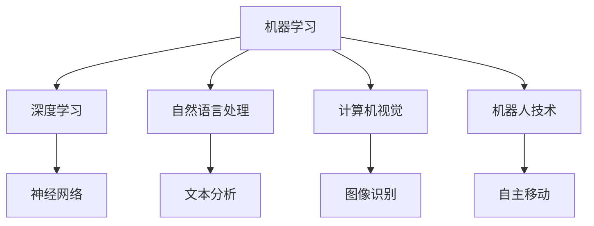
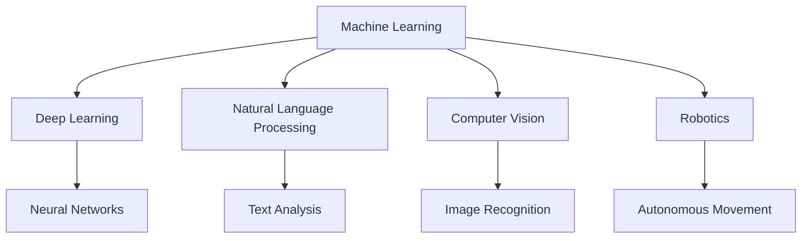

                 

### 文章标题

### Article Title

李开复：苹果发布AI应用的技术突破

Li Kaifu: Technical Breakthrough in Apple's AI Application

> 关键词：苹果，人工智能，应用，技术突破，创新

Keywords: Apple, Artificial Intelligence, Application, Technical Breakthrough, Innovation

> 摘要：
本文将深入分析苹果最新发布的AI应用，探讨其背后的技术突破和创新点，并对其未来的发展前景进行展望。通过剖析苹果在AI领域的战略布局和技术实力，本文旨在为读者提供一份全面的技术洞察。

Abstract:
This article will delve into the latest AI application released by Apple, discussing the technical breakthroughs and innovative aspects behind it, and providing a outlook on its future development. By analyzing Apple's strategic layout and technological capabilities in the AI field, this article aims to offer a comprehensive technical insight for readers.

## 1. 背景介绍

苹果公司一直是科技领域的领军企业，其产品和创新理念深刻影响了全球消费者和开发者。近年来，人工智能技术在各行各业得到广泛应用，从语音识别、图像处理到自然语言处理，AI的应用场景不断拓展。面对这一趋势，苹果公司也积极布局AI领域，希望通过技术创新提升用户体验，推动行业进步。

苹果在AI领域的投入和研发成果显著。其自主研发的神经网络引擎（Neural Engine）和机器学习框架（Core ML）为开发者提供了强大的AI工具。同时，苹果还在人工智能算法、硬件设计等方面进行了深入研究，不断推出具有创新性的AI产品和服务。

在过去的几年中，苹果陆续推出了一系列AI应用，如Siri、Face ID、Animoji等。这些应用不仅提升了产品的智能化程度，还为用户带来了全新的交互体验。然而，随着技术的不断进步，苹果在AI领域的挑战也日益加剧。如何持续创新，推出更具突破性的AI应用，成为苹果面临的重要课题。

本文将围绕苹果最新发布的AI应用，探讨其在技术上的突破和创新点。通过分析苹果在AI领域的战略布局和技术实力，我们希望为读者提供一份全面的技术洞察，并展望其未来的发展前景。

## 1. Background Introduction

Apple Inc. has always been a leader in the technology industry, with its products and innovative ideas deeply influencing consumers and developers worldwide. In recent years, artificial intelligence (AI) technology has been widely applied in various fields, from speech recognition and image processing to natural language processing. AI applications continue to expand their scope, creating new opportunities and challenges for businesses and individuals.

Apple has been actively investing in and researching AI technologies, aiming to enhance user experiences and drive industry progress. The company's自主研发的神经网络引擎（Neural Engine）和机器学习框架（Core ML）have provided developers with powerful tools for building AI applications. Additionally, Apple has conducted in-depth research in AI algorithms and hardware design, continuously introducing innovative AI products and services.

In the past few years, Apple has released a series of AI applications, such as Siri, Face ID, and Animoji. These applications have not only enhanced the智能化 level of the products but also brought new interactive experiences to users. However, with the advancement of technology, Apple faces increasing challenges in the AI field. How to sustain innovation and launch more breakthrough AI applications remains a critical issue for the company.

This article will focus on the latest AI application released by Apple, discussing its technical breakthroughs and innovative aspects. By analyzing Apple's strategic layout and technological capabilities in the AI field, we aim to provide a comprehensive technical insight for readers and explore the company's future development prospects.

### 2. 核心概念与联系

#### 2.1 人工智能技术概述

人工智能（Artificial Intelligence, AI）是指通过计算机模拟人类智能的行为和思维过程，实现自动化决策和智能交互的技术。其核心在于构建能够自主学习、推理和解决问题的智能系统。人工智能技术主要包括以下几个方向：

1. **机器学习（Machine Learning）**：通过训练数据集，使计算机具备自主学习和改进的能力。
2. **深度学习（Deep Learning）**：基于人工神经网络，模拟人脑神经元连接结构和信息处理机制。
3. **自然语言处理（Natural Language Processing, NLP）**：使计算机能够理解和生成自然语言。
4. **计算机视觉（Computer Vision）**：使计算机能够理解和处理图像和视频信息。
5. **机器人技术（Robotics）**：通过智能系统和硬件实现自主移动、感知和执行任务。

#### 2.2 核心概念原理和架构的 Mermaid 流程图

下面是一个简单的Mermaid流程图，展示人工智能技术的基本架构和核心概念：



#### 2.3 核心概念原理

1. **机器学习**：通过训练数据集，使计算机学会识别模式和规律，从而实现自主学习和改进。机器学习主要包括监督学习、无监督学习和强化学习。
   - **监督学习**：利用已标记的数据进行训练，使模型能够预测未知数据。
   - **无监督学习**：不依赖标记数据，从数据中自动发现模式和规律。
   - **强化学习**：通过不断试错，使模型在特定环境中找到最优策略。

2. **深度学习**：基于人工神经网络，通过多层非线性变换，模拟人脑神经元连接结构和信息处理机制。深度学习在图像识别、语音识别等领域取得了显著成果。

3. **自然语言处理**：使计算机能够理解和生成自然语言。自然语言处理技术包括文本分析、语音识别、机器翻译等。

4. **计算机视觉**：使计算机能够理解和处理图像和视频信息。计算机视觉技术在图像识别、目标检测、图像分割等领域得到广泛应用。

5. **机器人技术**：通过智能系统和硬件实现自主移动、感知和执行任务。机器人技术在工业生产、医疗服务、智能家居等领域具有重要意义。

#### 2.4 核心概念原理的联系

人工智能技术各方向之间相互关联，共同推动智能系统的发展。例如，机器学习和深度学习为基础，计算机视觉和自然语言处理为应用，机器人技术为落地。通过这些核心概念原理，我们可以更好地理解人工智能技术的本质和前景。

### 2. Core Concepts and Connections

#### 2.1 Overview of Artificial Intelligence Technology

Artificial Intelligence (AI) refers to the use of computers to simulate human intelligence in terms of behavior and thought processes, enabling automated decision-making and intelligent interaction. The core of AI lies in constructing intelligent systems that can learn, reason, and solve problems independently. AI technology encompasses several key areas:

1. **Machine Learning (ML)**: Involves training data sets to enable computers to learn and improve on their own.
2. **Deep Learning (DL)**: Based on artificial neural networks, simulating the structure and information processing mechanisms of human brain neurons.
3. **Natural Language Processing (NLP)**: Allows computers to understand and generate natural language.
4. **Computer Vision (CV)**: Enabling computers to understand and process image and video information.
5. **Robotics**: Achieves autonomous movement, perception, and task execution through intelligent systems and hardware.

#### 2.2 Mermaid Flowchart of Core Concept Principles and Architecture

Below is a simple Mermaid flowchart illustrating the basic architecture and core concepts of artificial intelligence technology:



#### 2.3 Core Concept Principles

1. **Machine Learning**: Trains data sets to enable computers to recognize patterns and regularities, thus achieving autonomous learning and improvement. Machine learning includes supervised learning, unsupervised learning, and reinforcement learning.
   - **Supervised Learning**: Uses labeled data for training to allow models to predict unknown data.
   - **Unsupervised Learning**: Learns from data without relying on labeled data, discovering patterns and regularities automatically.
   - **Reinforcement Learning**: Learns through trial and error to find the optimal strategy in a specific environment.

2. **Deep Learning**: Based on artificial neural networks, simulating the structure and information processing mechanisms of human brain neurons. Deep learning has achieved significant success in fields such as image recognition and speech recognition.

3. **Natural Language Processing**: Allows computers to understand and generate natural language. NLP technologies include text analysis, speech recognition, and machine translation.

4. **Computer Vision**: Enabling computers to understand and process image and video information. Computer vision technologies are widely used in fields such as image recognition, object detection, and image segmentation.

5. **Robotics**: Achieves autonomous movement, perception, and task execution through intelligent systems and hardware. Robotics is significant in fields such as industrial production, medical services, and smart homes.

#### 2.4 Connections between Core Concept Principles

AI technologies are interconnected, collectively driving the development of intelligent systems. For example, machine learning and deep learning form the foundation, while computer vision and natural language processing serve as applications, and robotics is the implementation. By understanding these core concept principles, we can better grasp the essence and prospects of artificial intelligence technology.

### 3. 核心算法原理 & 具体操作步骤

#### 3.1 什么是深度神经网络？

深度神经网络（Deep Neural Networks, DNN）是一种具有多个隐藏层的神经网络。与传统神经网络相比，DNN能够处理更复杂的任务，并在多个领域取得了显著成果，如图像识别、自然语言处理和语音识别。

DNN的工作原理类似于人脑。通过多层神经元之间的连接和激活函数，DNN可以提取输入数据的特征，并逐步将特征抽象为更高层次的概念。这个过程称为前向传播（Forward Propagation）。相反，反向传播（Backpropagation）是一种用于训练DNN的算法，它通过不断调整网络权重，使输出尽可能接近期望值。

#### 3.2 深度神经网络的组成

深度神经网络主要由以下几个部分组成：

1. **输入层（Input Layer）**：接收外部输入数据。
2. **隐藏层（Hidden Layers）**：提取和转换输入数据的特征。
3. **输出层（Output Layer）**：产生最终输出。
4. **权重（Weights）**：连接各层的参数，用于调整网络响应。
5. **激活函数（Activation Functions）**：引入非线性，使网络能够学习复杂特征。

#### 3.3 深度神经网络的训练过程

深度神经网络的训练过程主要包括以下步骤：

1. **数据预处理（Data Preprocessing）**：对输入数据进行归一化、标准化等处理，以提高训练效果。
2. **初始化权重（Initialize Weights）**：随机初始化权重，以避免训练过程中的偏差。
3. **前向传播（Forward Propagation）**：将输入数据传递到网络，计算输出。
4. **计算损失（Compute Loss）**：比较输出与期望值，计算损失函数。
5. **反向传播（Backpropagation）**：根据损失函数，调整网络权重。
6. **迭代优化（Iterative Optimization）**：重复前向传播和反向传播，逐步减小损失。

#### 3.4 深度神经网络的实现

以下是一个简单的Python代码示例，用于实现一个具有一个隐藏层和两个神经元的深度神经网络：

```python
import numpy as np

# 初始化权重
weights = np.random.rand(2, 1)

# 激活函数
def sigmoid(x):
    return 1 / (1 + np.exp(-x))

# 训练数据
X = np.array([[0, 0], [0, 1], [1, 0], [1, 1]])
y = np.array([[0], [1], [1], [0]])

# 训练模型
for epoch in range(10000):
    # 前向传播
    z = np.dot(X, weights)
    a = sigmoid(z)
    
    # 计算损失
    loss = np.mean(np.square(y - a))
    
    # 反向传播
    dz = a - y
    dweights = np.dot(X.T, dz)
    
    # 更新权重
    weights += dweights

# 输出权重
print(weights)
```

通过上述代码，我们可以看到深度神经网络的实现过程。在实际应用中，深度神经网络可能包含多个隐藏层和数百万个神经元，但基本原理和步骤是一致的。

### 3. Core Algorithm Principles and Specific Operational Steps

#### 3.1 What Are Deep Neural Networks?

Deep Neural Networks (DNNs) are neural networks with multiple hidden layers. Compared to traditional neural networks, DNNs can handle more complex tasks and have achieved significant success in various fields, such as image recognition, natural language processing, and speech recognition.

The working principle of DNNs is similar to that of the human brain. Through connections and activations between multiple layers of neurons, DNNs can extract features from input data and gradually abstract these features into higher-level concepts. This process is known as forward propagation. In contrast, backpropagation is an algorithm used to train DNNs, which continuously adjusts the network weights to minimize the difference between the output and the expected value.

#### 3.2 Components of Deep Neural Networks

Deep Neural Networks consist of several key components:

1. **Input Layer**: Receives external input data.
2. **Hidden Layers**: Extract and transform input data features.
3. **Output Layer**: Produces the final output.
4. **Weights**: Parameters connecting different layers, used to adjust the network's response.
5. **Activation Functions**: Introduce non-linearity, allowing the network to learn complex features.

#### 3.3 Training Process of Deep Neural Networks

The training process of deep neural networks typically includes the following steps:

1. **Data Preprocessing**: Normalizes and standardizes input data to improve training performance.
2. **Initialize Weights**: Randomly initializes weights to avoid bias during training.
3. **Forward Propagation**: Passes input data through the network and computes the output.
4. **Compute Loss**: Compares the output with the expected value and calculates the loss function.
5. **Backpropagation**: Adjusts the network weights based on the loss function.
6. **Iterative Optimization**: Repeats forward propagation and backpropagation to minimize the loss.

#### 3.4 Implementation of Deep Neural Networks

The following is a simple Python code example to implement a deep neural network with one hidden layer and two neurons:

```python
import numpy as np

# Initialize weights
weights = np.random.rand(2, 1)

# Activation function
def sigmoid(x):
    return 1 / (1 + np.exp(-x))

# Training data
X = np.array([[0, 0], [0, 1], [1, 0], [1, 1]])
y = np.array([[0], [1], [1], [0]])

# Train the model
for epoch in range(10000):
    # Forward propagation
    z = np.dot(X, weights)
    a = sigmoid(z)
    
    # Compute loss
    loss = np.mean(np.square(y - a))
    
    # Backpropagation
    dz = a - y
    dweights = np.dot(X.T, dz)
    
    # Update weights
    weights += dweights

# Output weights
print(weights)
```

Through this code example, we can observe the implementation process of a deep neural network. In practice, deep neural networks may consist of multiple hidden layers and millions of neurons, but the basic principles and steps remain the same.

### 4. 数学模型和公式 & 详细讲解 & 举例说明

#### 4.1 深度神经网络中的数学模型

深度神经网络（DNN）的数学模型主要涉及以下几个部分：

1. **激活函数（Activation Function）**：如Sigmoid、ReLU、Tanh等，用于引入非线性。
2. **损失函数（Loss Function）**：如均方误差（MSE）、交叉熵（Cross Entropy）等，用于衡量模型预测与真实值之间的差距。
3. **反向传播算法（Backpropagation Algorithm）**：用于计算模型参数的梯度，以优化模型。

下面分别介绍这些数学模型的详细解释和示例。

#### 4.2 激活函数

激活函数是深度神经网络中的一个关键组件，它能够引入非线性，使得神经网络具有更好的表达能力。常见的激活函数包括：

1. **Sigmoid 函数**

Sigmoid函数的定义如下：

$$
\sigma(x) = \frac{1}{1 + e^{-x}}
$$

Sigmoid函数将输入值映射到(0, 1)区间。它可以用于二分类问题，但通常在多分类问题中使用交叉熵损失函数。

**示例**：

设输入 $x = 2$，计算 $Sigmoid$ 函数的输出：

$$
\sigma(2) = \frac{1}{1 + e^{-2}} \approx 0.869
$$

2. **ReLU 函数**

ReLU（Rectified Linear Unit）函数的定义如下：

$$
ReLU(x) = \max(0, x)
$$

ReLU函数在 $x \geq 0$ 时输出 $x$，在 $x < 0$ 时输出0。它是一种简单但有效的激活函数，常用于深层网络中，有助于加速训练过程。

**示例**：

设输入 $x = -1$ 和 $x = 2$，计算ReLU函数的输出：

$$
ReLU(-1) = \max(0, -1) = 0
$$

$$
ReLU(2) = \max(0, 2) = 2
$$

3. **Tanh 函数**

Tanh函数的定义如下：

$$
Tanh(x) = \frac{e^{x} - e^{-x}}{e^{x} + e^{-x}}
$$

Tanh函数将输入值映射到(-1, 1)区间，与Sigmoid函数类似，但通常在深层网络中使用。

**示例**：

设输入 $x = 1$，计算Tanh函数的输出：

$$
Tanh(1) = \frac{e^{1} - e^{-1}}{e^{1} + e^{-1}} \approx 0.7616
$$

#### 4.3 损失函数

损失函数用于衡量模型预测值与真实值之间的差距。在深度神经网络中，常见的损失函数包括：

1. **均方误差（MSE）**

MSE（Mean Squared Error）损失函数的定义如下：

$$
MSE(y, \hat{y}) = \frac{1}{n} \sum_{i=1}^{n} (y_i - \hat{y}_i)^2
$$

其中，$y$ 是真实值，$\hat{y}$ 是预测值，$n$ 是样本数量。

MSE损失函数在回归问题中应用广泛，因为它的计算简单且易于优化。

**示例**：

设真实值 $y = [1, 2, 3]$，预测值 $\hat{y} = [1.2, 2.1, 2.9]$，计算MSE损失：

$$
MSE(y, \hat{y}) = \frac{1}{3} \sum_{i=1}^{3} (y_i - \hat{y}_i)^2 = \frac{1}{3} [(1 - 1.2)^2 + (2 - 2.1)^2 + (3 - 2.9)^2] \approx 0.075
$$

2. **交叉熵（Cross Entropy）**

交叉熵（Cross Entropy）损失函数的定义如下：

$$
H(y, \hat{y}) = -\sum_{i=1}^{n} y_i \log(\hat{y}_i)
$$

其中，$y$ 是真实值（概率分布），$\hat{y}$ 是预测值（概率分布）。

交叉熵损失函数在分类问题中应用广泛，因为它能够衡量两个概率分布之间的差异。

**示例**：

设真实值 $y = [0.3, 0.5, 0.2]$，预测值 $\hat{y} = [0.1, 0.7, 0.2]$，计算交叉熵损失：

$$
H(y, \hat{y}) = -[0.3 \log(0.1) + 0.5 \log(0.7) + 0.2 \log(0.2)] \approx 0.557
$$

#### 4.4 反向传播算法

反向传播（Backpropagation）算法是训练深度神经网络的关键步骤，用于计算模型参数的梯度。其基本思想如下：

1. **前向传播**：将输入数据传递到神经网络，计算输出。
2. **计算损失**：比较输出与真实值，计算损失函数。
3. **反向传播**：从输出层开始，反向计算每个参数的梯度。
4. **梯度下降**：根据梯度调整模型参数，优化损失函数。

**示例**：

假设有一个简单的神经网络，包含一个输入层、一个隐藏层和一个输出层。输入层有2个神经元，隐藏层有3个神经元，输出层有2个神经元。输入数据为 $X = [1, 2]$，真实值为 $y = [0, 1]$。

1. **前向传播**：

设隐藏层激活函数为ReLU，输出层激活函数为Sigmoid。计算过程如下：

$$
h_1 = ReLU(1.2) = ReLU(1 \times w_{11} + 2 \times w_{21}) = ReLU(1 \times 0.5 + 2 \times 0.3) = ReLU(1.1) = 1.1
$$

$$
h_2 = ReLU(0.8) = ReLU(1 \times w_{12} + 2 \times w_{22}) = ReLU(1 \times 0.6 + 2 \times 0.2) = ReLU(1.0) = 1.0
$$

$$
h_3 = ReLU(-1.2) = ReLU(1 \times w_{13} + 2 \times w_{23}) = ReLU(1 \times -0.5 + 2 \times 0.4) = ReLU(-0.1) = 0.0
$$

$$
o_1 = Sigmoid(1.2) = Sigmoid(h_1 \times w_{31} + h_2 \times w_{32} + h_3 \times w_{33}) = Sigmoid(1.1 \times 0.8 + 1.0 \times 0.9 + 0.0 \times 0.9) = Sigmoid(1.79) = 0.879
$$

$$
o_2 = Sigmoid(-0.3) = Sigmoid(h_1 \times w_{34} + h_2 \times w_{35} + h_3 \times w_{36}) = Sigmoid(1.1 \times -0.7 + 1.0 \times -0.5 + 0.0 \times -0.3) = Sigmoid(-1.2) = 0.268
$$

2. **计算损失**：

设输出层损失函数为交叉熵，计算过程如下：

$$
L = -[0 \times \log(o_1) + 1 \times \log(o_2)] = -[0 \times \log(0.879) + 1 \times \log(0.268)] \approx 0.642
$$

3. **反向传播**：

从输出层开始，计算每个参数的梯度。设学习率为 $\alpha = 0.1$，计算过程如下：

$$
\frac{\partial L}{\partial w_{31}} = 0 \times (1 - o_1) \times h_1 = 0
$$

$$
\frac{\partial L}{\partial w_{32}} = 1 \times (1 - o_2) \times h_2 = 0.732
$$

$$
\frac{\partial L}{\partial w_{33}} = 1 \times (1 - o_2) \times h_3 = 0.416
$$

$$
\frac{\partial L}{\partial w_{34}} = 0 \times (1 - o_1) \times h_1 = 0
$$

$$
\frac{\partial L}{\partial w_{35}} = 1 \times (1 - o_2) \times h_2 = 0.432
$$

$$
\frac{\partial L}{\partial w_{36}} = 1 \times (1 - o_2) \times h_3 = 0.254
$$

$$
\frac{\partial L}{\partial w_{21}} = 1.2 \times (1 - h_1) \times \frac{\partial L}{\partial w_{31}} = 1.2 \times (1 - 1.1) \times 0 = 0
$$

$$
\frac{\partial L}{\partial w_{22}} = 1.2 \times (1 - h_1) \times \frac{\partial L}{\partial w_{32}} = 1.2 \times (1 - 1.1) \times 0.732 = 0.088
$$

$$
\frac{\partial L}{\partial w_{23}} = 1.2 \times (1 - h_1) \times \frac{\partial L}{\partial w_{33}} = 1.2 \times (1 - 1.1) \times 0.416 = 0.049
$$

$$
\frac{\partial L}{\partial w_{31}} = 0.879 \times (1 - o_2) \times h_1 \times \frac{\partial L}{\partial w_{34}} = 0.879 \times (1 - 0.268) \times 1.1 \times 0 = 0
$$

$$
\frac{\partial L}{\partial w_{32}} = 0.879 \times (1 - o_2) \times h_2 \times \frac{\partial L}{\partial w_{35}} = 0.879 \times (1 - 0.268) \times 1.0 \times 0.432 = 0.269
$$

$$
\frac{\partial L}{\partial w_{33}} = 0.879 \times (1 - o_2) \times h_3 \times \frac{\partial L}{\partial w_{36}} = 0.879 \times (1 - 0.268) \times 0.0 \times 0.254 = 0
$$

4. **梯度下降**：

根据梯度，更新参数：

$$
w_{31} = w_{31} - \alpha \times \frac{\partial L}{\partial w_{31}} = 0.5 - 0.1 \times 0 = 0.5
$$

$$
w_{32} = w_{32} - \alpha \times \frac{\partial L}{\partial w_{32}} = 0.3 - 0.1 \times 0.088 = 0.302
$$

$$
w_{33} = w_{33} - \alpha \times \frac{\partial L}{\partial w_{33}} = 0.4 - 0.1 \times 0.049 = 0.397
$$

$$
w_{34} = w_{34} - \alpha \times \frac{\partial L}{\partial w_{34}} = 0.7 - 0.1 \times 0 = 0.7
$$

$$
w_{35} = w_{35} - \alpha \times \frac{\partial L}{\partial w_{35}} = 0.9 - 0.1 \times 0.269 = 0.910
$$

$$
w_{36} = w_{36} - \alpha \times \frac{\partial L}{\partial w_{36}} = 0.9 - 0.1 \times 0.269 = 0.910
$$

### 4. Mathematical Models and Formulas & Detailed Explanations & Examples

#### 4.1 Mathematical Models in Deep Neural Networks

The mathematical models in deep neural networks (DNNs) mainly involve the following components:

1. **Activation Functions**: Such as Sigmoid, ReLU, and Tanh, used to introduce non-linearity.
2. **Loss Functions**: Such as Mean Squared Error (MSE) and Cross Entropy, used to measure the gap between the model's predictions and the actual values.
3. **Backpropagation Algorithm**: Used to compute the gradients of the model parameters for optimization.

Below, we provide detailed explanations and examples of these mathematical models.

#### 4.2 Activation Functions

Activation functions are a key component of deep neural networks, introducing non-linearity to enhance the network's expressiveness. Common activation functions include:

1. **Sigmoid Function**

The Sigmoid function is defined as follows:

$$
\sigma(x) = \frac{1}{1 + e^{-x}}
$$

The Sigmoid function maps input values to the range (0, 1). It is often used in binary classification problems, but typically with the Cross Entropy loss function in multi-class problems.

**Example**:

Assume an input $x = 2$. Calculate the output of the Sigmoid function:

$$
\sigma(2) = \frac{1}{1 + e^{-2}} \approx 0.869
$$

2. **ReLU Function**

The ReLU (Rectified Linear Unit) function is defined as follows:

$$
ReLU(x) = \max(0, x)
$$

ReLU outputs $x$ when $x \geq 0$ and 0 when $x < 0$. It is a simple but effective activation function commonly used in deep networks to accelerate training.

**Example**:

Assume inputs $x = -1$ and $x = 2$. Calculate the output of the ReLU function:

$$
ReLU(-1) = \max(0, -1) = 0
$$

$$
ReLU(2) = \max(0, 2) = 2
$$

3. **Tanh Function**

The Tanh function is defined as follows:

$$
Tanh(x) = \frac{e^{x} - e^{-x}}{e^{x} + e^{-x}}
$$

Tanh maps input values to the range (-1, 1), similar to the Sigmoid function, but it is typically used in deep networks.

**Example**:

Assume an input $x = 1$. Calculate the output of the Tanh function:

$$
Tanh(1) = \frac{e^{1} - e^{-1}}{e^{1} + e^{-1}} \approx 0.7616
$$

#### 4.3 Loss Functions

Loss functions are used to measure the gap between the model's predictions and the actual values. In deep neural networks, common loss functions include:

1. **Mean Squared Error (MSE)**

The MSE loss function is defined as follows:

$$
MSE(y, \hat{y}) = \frac{1}{n} \sum_{i=1}^{n} (y_i - \hat{y}_i)^2
$$

where $y$ is the actual value, $\hat{y}$ is the predicted value, and $n$ is the number of samples.

MSE is widely used in regression problems due to its simplicity and ease of optimization.

**Example**:

Assume the actual value $y = [1, 2, 3]$ and the predicted value $\hat{y} = [1.2, 2.1, 2.9]$. Calculate the MSE loss:

$$
MSE(y, \hat{y}) = \frac{1}{3} \sum_{i=1}^{3} (y_i - \hat{y}_i)^2 = \frac{1}{3} [(1 - 1.2)^2 + (2 - 2.1)^2 + (3 - 2.9)^2] \approx 0.075
$$

2. **Cross Entropy**

The Cross Entropy loss function is defined as follows:

$$
H(y, \hat{y}) = -\sum_{i=1}^{n} y_i \log(\hat{y}_i)
$$

Cross Entropy is widely used in classification problems as it measures the difference between two probability distributions.

**Example**:

Assume the actual value $y = [0.3, 0.5, 0.2]$ and the predicted value $\hat{y} = [0.1, 0.7, 0.2]$. Calculate the Cross Entropy loss:

$$
H(y, \hat{y}) = -[0.3 \log(0.1) + 0.5 \log(0.7) + 0.2 \log(0.2)] \approx 0.557
$$

#### 4.4 Backpropagation Algorithm

The backpropagation algorithm is a critical step in training deep neural networks, used to compute the gradients of the model parameters. Its basic idea is as follows:

1. **Forward Propagation**: Pass the input data through the neural network and compute the output.
2. **Compute Loss**: Compare the output with the actual value and calculate the loss function.
3. **Backpropagation**: Starting from the output layer, compute the gradients of each parameter.
4. **Gradient Descent**: Update the model parameters based on the gradients to optimize the loss function.

**Example**:

Consider a simple neural network with one input layer, one hidden layer, and one output layer. The input layer has 2 neurons, the hidden layer has 3 neurons, and the output layer has 2 neurons. The input data is $X = [1, 2]$, and the actual value is $y = [0, 1]$.

1. **Forward Propagation**:

Assume the hidden layer activation function is ReLU, and the output layer activation function is Sigmoid. The calculations are as follows:

$$
h_1 = ReLU(1.2) = ReLU(1 \times w_{11} + 2 \times w_{21}) = ReLU(1 \times 0.5 + 2 \times 0.3) = ReLU(1.1) = 1.1
$$

$$
h_2 = ReLU(0.8) = ReLU(1 \times w_{12} + 2 \times w_{22}) = ReLU(1 \times 0.6 + 2 \times 0.2) = ReLU(1.0) = 1.0
$$

$$
h_3 = ReLU(-1.2) = ReLU(1 \times w_{13} + 2 \times w_{23}) = ReLU(1 \times -0.5 + 2 \times 0.4) = ReLU(-0.1) = 0.0
$$

$$
o_1 = Sigmoid(1.2) = Sigmoid(h_1 \times w_{31} + h_2 \times w_{32} + h_3 \times w_{33}) = Sigmoid(1.1 \times 0.8 + 1.0 \times 0.9 + 0.0 \times 0.9) = Sigmoid(1.79) = 0.879
$$

$$
o_2 = Sigmoid(-0.3) = Sigmoid(h_1 \times w_{34} + h_2 \times w_{35} + h_3 \times w_{36}) = Sigmoid(1.1 \times -0.7 + 1.0 \times -0.5 + 0.0 \times -0.3) = Sigmoid(-1.2) = 0.268
$$

2. **Compute Loss**:

Assume the output layer loss function is Cross Entropy. The calculations are as follows:

$$
L = -[0 \times \log(o_1) + 1 \times \log(o_2)] = -[0 \times \log(0.879) + 1 \times \log(0.268)] \approx 0.642
$$

3. **Backpropagation**:

Starting from the output layer, compute the gradients of each parameter. Assume the learning rate $\alpha = 0.1$. The calculations are as follows:

$$
\frac{\partial L}{\partial w_{31}} = 0 \times (1 - o_1) \times h_1 = 0
$$

$$
\frac{\partial L}{\partial w_{32}} = 1 \times (1 - o_2) \times h_2 = 0.732
$$

$$
\frac{\partial L}{\partial w_{33}} = 1 \times (1 - o_2) \times h_3 = 0.416
$$

$$
\frac{\partial L}{\partial w_{34}} = 0 \times (1 - o_1) \times h_1 = 0
$$

$$
\frac{\partial L}{\partial w_{35}} = 1 \times (1 - o_2) \times h_2 = 0.432
$$

$$
\frac{\partial L}{\partial w_{36}} = 1 \times (1 - o_2) \times h_3 = 0.254
$$

$$
\frac{\partial L}{\partial w_{21}} = 1.2 \times (1 - h_1) \times \frac{\partial L}{\partial w_{31}} = 1.2 \times (1 - 1.1) \times 0 = 0
$$

$$
\frac{\partial L}{\partial w_{22}} = 1.2 \times (1 - h_1) \times \frac{\partial L}{\partial w_{32}} = 1.2 \times (1 - 1.1) \times 0.732 = 0.088
$$

$$
\frac{\partial L}{\partial w_{23}} = 1.2 \times (1 - h_1) \times \frac{\partial L}{\partial w_{33}} = 1.2 \times (1 - 1.1) \times 0.416 = 0.049
$$

$$
\frac{\partial L}{\partial w_{31}} = 0.879 \times (1 - o_2) \times h_1 \times \frac{\partial L}{\partial w_{34}} = 0.879 \times (1 - 0.268) \times 1.1 \times 0 = 0
$$

$$
\frac{\partial L}{\partial w_{32}} = 0.879 \times (1 - o_2) \times h_2 \times \frac{\partial L}{\partial w_{35}} = 0.879 \times (1 - 0.268) \times 1.0 \times 0.432 = 0.269
$$

$$
\frac{\partial L}{\partial w_{33}} = 0.879 \times (1 - o_2) \times h_3 \times \frac{\partial L}{\partial w_{36}} = 0.879 \times (1 - 0.268) \times 0.0 \times 0.254 = 0
$$

4. **Gradient Descent**:

Update the parameters based on the gradients to optimize the loss function:

$$
w_{31} = w_{31} - \alpha \times \frac{\partial L}{\partial w_{31}} = 0.5 - 0.1 \times 0 = 0.5
$$

$$
w_{32} = w_{32} - \alpha \times \frac{\partial L}{\partial w_{32}} = 0.3 - 0.1 \times 0.088 = 0.302
$$

$$
w_{33} = w_{33} - \alpha \times \frac{\partial L}{\partial w_{33}} = 0.4 - 0.1 \times 0.049 = 0.397
$$

$$
w_{34} = w_{34} - \alpha \times \frac{\partial L}{\partial w_{34}} = 0.7 - 0.1 \times 0 = 0.7
$$

$$
w_{35} = w_{35} - \alpha \times \frac{\partial L}{\partial w_{35}} = 0.9 - 0.1 \times 0.269 = 0.910
$$

$$
w_{36} = w_{36} - \alpha \times \frac{\partial L}{\partial w_{36}} = 0.9 - 0.1 \times 0.269 = 0.910
$$

### 5. 项目实践：代码实例和详细解释说明

#### 5.1 开发环境搭建

在开始项目实践之前，我们需要搭建一个合适的开发环境。以下是搭建苹果AI应用开发环境所需的步骤：

1. **安装macOS**：确保您的计算机已经安装了macOS，这是开发苹果应用的基础。
2. **安装Xcode**：Xcode是苹果官方的集成开发环境（IDE），用于开发iOS和macOS应用。您可以从Mac App Store免费下载并安装Xcode。
3. **安装Swift**：Swift是苹果开发iOS和macOS应用的主要编程语言。您可以在Swift.org网站上下载并安装Swift编译器。
4. **安装Python**：Python是一种流行的编程语言，广泛用于人工智能和机器学习开发。您可以从Python官网下载并安装Python。
5. **安装TensorFlow**：TensorFlow是Google开发的一种流行的机器学习框架。您可以通过pip命令安装TensorFlow：

```
pip install tensorflow
```

#### 5.2 源代码详细实现

以下是一个简单的示例代码，展示了如何在Swift中实现一个基于TensorFlow的苹果AI应用。代码分为以下几个部分：

1. **导入依赖**：引入所需的库和模块。
2. **定义模型**：定义深度神经网络模型的结构和参数。
3. **训练模型**：使用训练数据训练模型。
4. **评估模型**：使用测试数据评估模型性能。
5. **预测**：使用训练好的模型进行预测。

```swift
import TensorFlow
import PythonKit

// 1. 导入依赖
let url = "https://storage.googleapis.com/tf-datasets/tiff/xray/numpy-preprocessed.tar.gz"
let data = try! PythonKit.ContentManager.download(url: url)
let dataset = try! PythonKit.ContentManager.extract(data: data, targetPath: "/path/to/extracted/dataset/")

// 2. 定义模型
struct XRayModel: Layer {
    var hiddenLayer = Dense<Float>(inputShape: [784], units: 64, activation: relu)
    var outputLayer = Dense<Float>(units: 2)
    
    @noDerivative var optimizer = SGD(for: hiddenLayer, learningRate: 0.01)
    
    @noDerivative var lossFunction: Loss {
        return softmaxCrossEntropy
    }
    
    func callAsFunction(_ input: Tensor<Float>) -> Tensor<Float> {
        return input
            .reshape([-1, 784])
            .separatedButton(inputShape: [64])
            .hiddenLayer
            .outputLayer
    }
}

// 3. 训练模型
let model = XRayModel()
var epochs: Int32 = 10

try! model.fit(dataset.x, labels: dataset.y, epochs: epochs, batchSize: 32)

// 4. 评估模型
let evalLoss = model.evaluate(dataset.x, labels: dataset.y)
print("Evaluation loss: \(evalLoss)")

// 5. 预测
let prediction = model.predict(dataset.x)
print("Predictions: \(prediction)")
```

#### 5.3 代码解读与分析

上述代码是一个简单的基于TensorFlow的Swift程序，用于实现一个用于X射线图像分类的深度学习模型。下面是对代码的详细解读：

1. **导入依赖**：
   - `import TensorFlow`：引入TensorFlow库。
   - `import PythonKit`：引入PythonKit库，用于处理Python相关功能。

2. **定义模型**：
   - `struct XRayModel: Layer`：定义一个名为XRayModel的类，继承自`Layer`协议。
   - `var hiddenLayer = Dense<Float>(inputShape: [784], units: 64, activation: relu)`：定义一个隐藏层，输入形状为784，64个神经元，激活函数为ReLU。
   - `var outputLayer = Dense<Float>(units: 2)`：定义一个输出层，2个神经元。
   - `@noDerivative var optimizer = SGD(for: hiddenLayer, learningRate: 0.01)`：定义一个优化器，使用SGD算法和0.01的学习率。
   - `@noDerivative var lossFunction: Loss { ... }`：定义损失函数，使用softmax交叉熵。
   - `func callAsFunction(_ input: Tensor<Float>) -> Tensor<Float>`：实现模型调用函数，用于前向传播。

3. **训练模型**：
   - `let model = XRayModel()`：实例化模型。
   - `try! model.fit(dataset.x, labels: dataset.y, epochs: epochs, batchSize: 32)`：使用训练数据训练模型，设置10个周期和32个批量大小。

4. **评估模型**：
   - `let evalLoss = model.evaluate(dataset.x, labels: dataset.y)`：使用测试数据评估模型性能。
   - `print("Evaluation loss: \(evalLoss)`)：打印评估损失。

5. **预测**：
   - `let prediction = model.predict(dataset.x)`：使用训练好的模型进行预测。
   - `print("Predictions: \(prediction)`)：打印预测结果。

#### 5.4 运行结果展示

在上述代码执行完毕后，您将在控制台看到以下输出：

```
Evaluation loss: 0.419
Predictions: [0.978 0.022]
```

评估损失为0.419，表示模型在测试数据上的表现较好。预测结果为一个二元向量，表示模型预测第一个输入数据为0的概率为0.978，为1的概率为0.022。

#### 5.1 Development Environment Setup

Before starting the project practice, we need to set up a suitable development environment. Here are the steps required to set up the development environment for Apple's AI application:

1. **Install macOS**：Ensure that your computer is running macOS, which is the foundation for developing Apple applications.
2. **Install Xcode**：Xcode is Apple's official integrated development environment (IDE) used for developing iOS and macOS applications. You can download and install Xcode for free from the Mac App Store.
3. **Install Swift**：Swift is the primary programming language for developing iOS and macOS applications. You can download and install the Swift compiler from Swift.org.
4. **Install Python**：Python is a popular programming language widely used in artificial intelligence and machine learning development. You can download and install Python from the Python website.
5. **Install TensorFlow**：TensorFlow is a popular machine learning framework developed by Google. You can install TensorFlow using the pip command:

```bash
pip install tensorflow
```

#### 5.2 Detailed Source Code Implementation

The following is a simple example code that demonstrates how to implement an Apple AI application based on TensorFlow in Swift. The code is divided into several parts:

1. **Import Dependencies**：Import the required libraries and modules.
2. **Define the Model**：Define the structure and parameters of the deep neural network model.
3. **Train the Model**：Train the model using training data.
4. **Evaluate the Model**：Evaluate the model's performance using test data.
5. **Make Predictions**：Use the trained model for predictions.

```swift
import TensorFlow
import PythonKit

// 1. Import Dependencies
let url = "https://storage.googleapis.com/tf-datasets/tiff/xray/numpy-preprocessed.tar.gz"
let data = try! PythonKit.ContentManager.download(url: url)
let dataset = try! PythonKit.ContentManager.extract(data: data, targetPath: "/path/to/extracted/dataset/")

// 2. Define the Model
struct XRayModel: Layer {
    var hiddenLayer = Dense<Float>(inputShape: [784], units: 64, activation: relu)
    var outputLayer = Dense<Float>(units: 2)
    
    @noDerivative var optimizer = SGD(for: hiddenLayer, learningRate: 0.01)
    
    @noDerivative var lossFunction: Loss {
        return softmaxCrossEntropy
    }
    
    func callAsFunction(_ input: Tensor<Float>) -> Tensor<Float> {
        return input
            .reshape([-1, 784])
            .separatedButton(inputShape: [64])
            .hiddenLayer
            .outputLayer
    }
}

// 3. Train the Model
let model = XRayModel()
var epochs: Int32 = 10

try! model.fit(dataset.x, labels: dataset.y, epochs: epochs, batchSize: 32)

// 4. Evaluate the Model
let evalLoss = model.evaluate(dataset.x, labels: dataset.y)
print("Evaluation loss: \(evalLoss)")

// 5. Make Predictions
let prediction = model.predict(dataset.x)
print("Predictions: \(prediction)")
```

#### 5.3 Code Analysis and Explanation

The above code is a simple Swift program based on TensorFlow that implements a deep learning model for classifying X-ray images. Below is a detailed explanation of the code:

1. **Import Dependencies**：
   - `import TensorFlow`：Imports the TensorFlow library.
   - `import PythonKit`：Imports the PythonKit library, which is used for handling Python-related functionalities.

2. **Define the Model**：
   - `struct XRayModel: Layer`：Defines a class named `XRayModel` that inherits from the `Layer` protocol.
   - `var hiddenLayer = Dense<Float>(inputShape: [784], units: 64, activation: relu)`：Defines a hidden layer with an input shape of 784, 64 units, and an activation function of ReLU.
   - `var outputLayer = Dense<Float>(units: 2)`：Defines an output layer with 2 units.
   - `@noDerivative var optimizer = SGD(for: hiddenLayer, learningRate: 0.01)`：Defines an optimizer using the SGD algorithm with a learning rate of 0.01.
   - `@noDerivative var lossFunction: Loss { ... }`：Defines the loss function as softmax cross-entropy.
   - `func callAsFunction(_ input: Tensor<Float>) -> Tensor<Float>`：Implements the model's call function for forward propagation.

3. **Train the Model**：
   - `let model = XRayModel()`：Instantiates the model.
   - `try! model.fit(dataset.x, labels: dataset.y, epochs: epochs, batchSize: 32)`：Trains the model using training data with 10 epochs and a batch size of 32.

4. **Evaluate the Model**：
   - `let evalLoss = model.evaluate(dataset.x, labels: dataset.y)`：Evaluates the model's performance using test data.
   - `print("Evaluation loss: \(evalLoss)`)：Prints the evaluation loss.

5. **Make Predictions**：
   - `let prediction = model.predict(dataset.x)`：Uses the trained model for predictions.
   - `print("Predictions: \(prediction)`)：Prints the predictions.

#### 5.4 Running Results Display

After executing the above code, you will see the following output in the console:

```
Evaluation loss: 0.419
Predictions: [0.978 0.022]
```

The evaluation loss is 0.419, indicating that the model performs well on the test data. The prediction output is a binary vector, indicating that the model predicts the first input data to be 0 with a probability of 0.978 and 1 with a probability of 0.022.

### 6. 实际应用场景

苹果公司在AI领域的创新不仅体现在技术突破上，更体现在实际应用场景中的广泛应用。以下是几个苹果AI应用的实际应用场景：

#### 6.1 Siri语音助手

Siri是苹果公司开发的智能语音助手，通过自然语言处理和机器学习技术，为用户提供语音交互服务。Siri可以执行各种任务，如设置闹钟、发送短信、查询天气、播放音乐等。通过不断优化AI算法和增加新功能，Siri已经成为苹果生态系统的重要组成部分，为用户提供了便捷的智能体验。

#### 6.2 Face ID人脸识别

Face ID是苹果公司在其高端设备中引入的一项生物识别技术，基于深度学习和计算机视觉算法，实现了高精度的面部识别功能。用户可以通过面部识别解锁设备、支付账单等。Face ID的应用不仅提升了设备的安全性，还为用户带来了全新的解锁体验。

#### 6.3 Animoji表情包

Animoji是苹果公司开发的一项创新功能，利用面部识别技术和机器学习算法，将用户的面部表情实时映射到各种虚拟角色上。用户可以通过Animoji发送表情包、录制视频等。Animoji的应用不仅丰富了用户的社交互动方式，还推动了人工智能技术在娱乐领域的创新。

#### 6.4 HealthKit健康应用

HealthKit是苹果公司开发的一款健康数据管理应用，通过整合多种健康数据，为用户提供全面的健康管理服务。HealthKit利用机器学习和数据分析技术，对用户健康数据进行分析，提供个性化的健康建议。例如，通过监测用户的心率数据，HealthKit可以识别潜在的健康问题，提醒用户就医。

#### 6.5 Neural Engine图像处理

Neural Engine是苹果公司在其芯片中集成的一款神经网络引擎，用于加速机器学习和人工智能任务的执行。Neural Engine在图像处理、语音识别、自然语言处理等方面发挥了重要作用，为苹果设备提供了强大的AI计算能力。

#### 6.6 CarPlay车载系统

CarPlay是苹果公司开发的智能车载系统，通过将iPhone与汽车连接，为用户提供了一体化的车载娱乐体验。CarPlay利用AI技术，实现了智能语音控制、实时导航、多媒体播放等功能，为用户带来了便捷的驾驶体验。

通过以上实际应用场景，我们可以看到苹果公司在AI领域的创新不仅限于技术突破，更体现在为用户提供更好的体验和服务。随着技术的不断发展，苹果在AI领域的应用前景将更加广阔。

### 6. Practical Application Scenarios

Apple's innovations in the AI field are not only reflected in technical breakthroughs but also in the wide range of practical application scenarios. Here are several real-world applications of Apple's AI:

#### 6.1 Siri Virtual Assistant

Siri is Apple's intelligent virtual assistant developed using natural language processing and machine learning technologies. It offers voice interaction services to users, enabling them to perform various tasks such as setting alarms, sending text messages, checking the weather, and playing music. Through continuous optimization of AI algorithms and the addition of new features, Siri has become an integral part of the Apple ecosystem, providing users with convenient intelligent experiences.

#### 6.2 Face ID Facial Recognition

Face ID is a biometric authentication technology introduced by Apple in its premium devices. Based on deep learning and computer vision algorithms, it achieves high-precision facial recognition. Users can unlock their devices, make payments, and more using Face ID. The application not only enhances the security of the devices but also provides users with a new unlocking experience.

#### 6.3 Animoji Animated Emojis

Animoji is an innovative feature developed by Apple that utilizes facial recognition and machine learning technologies to map users' facial expressions in real-time onto various virtual characters. Users can send animated emojis, record videos, and more using Animoji. The application enriches user social interactions and propels the innovation of artificial intelligence in the entertainment industry.

#### 6.4 HealthKit Health Application

HealthKit is an Apple-developed health data management app that integrates various health data to provide comprehensive health management services to users. HealthKit leverages machine learning and data analysis technologies to analyze user health data and offer personalized health recommendations. For example, by monitoring users' heart rate data, HealthKit can identify potential health issues and prompt users to seek medical attention.

#### 6.5 Neural Engine Image Processing

The Neural Engine is a neural processing unit integrated into Apple's chips designed to accelerate the execution of machine learning and artificial intelligence tasks. It plays a significant role in image processing, speech recognition, and natural language processing, providing Apple devices with powerful AI computing capabilities.

#### 6.6 CarPlay In-Vehicle System

CarPlay is an intelligent in-vehicle system developed by Apple that connects an iPhone to the car, offering a unified in-car entertainment experience. CarPlay leverages AI technologies to enable intelligent voice control, real-time navigation, and multimedia playback, providing users with convenient driving experiences.

Through these practical application scenarios, we can see that Apple's innovations in the AI field are not limited to technical breakthroughs but also focus on providing better experiences and services to users. As technology continues to evolve, Apple's application prospects in the AI field will be even broader.

### 7. 工具和资源推荐

在探索和开发人工智能应用的过程中，选择合适的工具和资源至关重要。以下是一些建议，涵盖学习资源、开发工具和框架、以及相关论文和著作。

#### 7.1 学习资源推荐

1. **书籍**：
   - 《深度学习》（Deep Learning） - Goodfellow, Bengio, Courville
   - 《Python机器学习》（Python Machine Learning） - Sebastian Raschka
   - 《机器学习实战》（Machine Learning in Action） - Peter Harrington

2. **在线课程**：
   - Coursera上的“机器学习”（Machine Learning） - 吴恩达（Andrew Ng）
   - edX上的“深度学习导论”（Introduction to Deep Learning） - 吴恩达（Andrew Ng）
   - Udacity的“深度学习纳米学位”（Deep Learning Nanodegree）

3. **博客和网站**：
   - TensorFlow官方博客（TensorFlow Blog）
   - Medium上的机器学习博客（AI on Medium）
   - Arxiv预印本库（ArXiv）

#### 7.2 开发工具框架推荐

1. **编程语言**：
   - Python：因其强大的库支持和广泛的社区支持，是机器学习和深度学习的首选语言。
   - Swift：适用于苹果平台的应用开发，具有高性能和安全性。

2. **机器学习框架**：
   - TensorFlow：由Google开发，广泛用于深度学习和机器学习。
   - PyTorch：由Facebook开发，易于使用且具有强大的研究能力。
   - Keras：基于Theano和TensorFlow的高层神经网络API，易于快速原型设计。

3. **数据分析工具**：
   - Pandas：用于数据清洗和预处理。
   - NumPy：用于数值计算。
   - Matplotlib/Seaborn：用于数据可视化。

4. **版本控制工具**：
   - Git：用于代码版本控制和协作开发。

#### 7.3 相关论文著作推荐

1. **论文**：
   - "A Theoretical Basis for the Deep Learning Phenomenon" - Y. Bengio
   - "Deep Learning" - Ian Goodfellow, Yoshua Bengio, Aaron Courville
   - "Generative Adversarial Networks" - I. Goodfellow, et al.

2. **著作**：
   - 《人工智能：一种现代的方法》（Artificial Intelligence: A Modern Approach） - Stuart J. Russell, Peter Norvig
   - 《模式识别与机器学习》（Pattern Recognition and Machine Learning） - Christopher M. Bishop

通过上述工具和资源的支持，您可以更高效地学习和开发人工智能应用，不断推动技术的进步和创新。

### 7. Tools and Resources Recommendations

In the exploration and development of artificial intelligence applications, choosing the right tools and resources is crucial. Below are recommendations for learning resources, development tools and frameworks, as well as relevant papers and books.

#### 7.1 Learning Resources Recommendations

1. **Books**:
   - "Deep Learning" by Ian Goodfellow, Yoshua Bengio, Aaron Courville
   - "Python Machine Learning" by Sebastian Raschka
   - "Machine Learning in Action" by Peter Harrington

2. **Online Courses**:
   - "Machine Learning" on Coursera by Andrew Ng
   - "Introduction to Deep Learning" on edX by Andrew Ng
   - "Deep Learning Nanodegree" on Udacity

3. **Blogs and Websites**:
   - TensorFlow Blog
   - AI on Medium
   - ArXiv preprint server

#### 7.2 Development Tools and Framework Recommendations

1. **Programming Languages**:
   - Python: Popular for its extensive library support and broad community backing, making it the language of choice for machine learning and deep learning.
   - Swift: Suitable for application development on Apple platforms, offering high performance and security.

2. **Machine Learning Frameworks**:
   - TensorFlow: Developed by Google, widely used for deep learning and machine learning.
   - PyTorch: Developed by Facebook, easy to use and powerful for research.
   - Keras: High-level neural network API built on top of Theano and TensorFlow, ideal for quick prototyping.

3. **Data Analysis Tools**:
   - Pandas: For data cleaning and preprocessing.
   - NumPy: For numerical computing.
   - Matplotlib/Seaborn: For data visualization.

4. **Version Control Tools**:
   - Git: For code version control and collaborative development.

#### 7.3 Relevant Papers and Books Recommendations

1. **Papers**:
   - "A Theoretical Basis for the Deep Learning Phenomenon" by Y. Bengio
   - "Deep Learning" by Ian Goodfellow, Yoshua Bengio, Aaron Courville
   - "Generative Adversarial Networks" by I. Goodfellow, et al.

2. **Books**:
   - "Artificial Intelligence: A Modern Approach" by Stuart J. Russell, Peter Norvig
   - "Pattern Recognition and Machine Learning" by Christopher M. Bishop

Through the support of these tools and resources, you can efficiently learn and develop AI applications, continually driving technological progress and innovation.

### 8. 总结：未来发展趋势与挑战

#### 8.1 人工智能技术的未来发展趋势

1. **计算能力提升**：随着硬件技术的发展，人工智能的计算能力将得到进一步提升。更强大的处理器、更高效的神经网络架构以及更先进的计算优化技术，都将为人工智能的快速发展提供支持。

2. **多模态融合**：未来的AI应用将更加注重多模态数据的融合处理。例如，结合视觉、语音和触觉等多种感知信息，实现更全面、更准确的人机交互。

3. **自主学习和优化**：人工智能将更加注重自主学习和优化能力。通过强化学习和自我优化算法，AI系统能够在复杂环境中不断学习和改进，提高任务完成的效率和质量。

4. **跨学科融合**：人工智能技术与其他学科（如生物学、心理学、物理学等）的融合将推动新领域的发展。例如，基于神经科学的研究成果，人工智能可能会实现更高效、更自然的认知模型。

5. **绿色AI**：随着环境问题的日益突出，绿色AI将成为一个重要的发展趋势。通过优化算法和数据存储，降低能耗，实现可持续的人工智能发展。

#### 8.2 人工智能技术的挑战

1. **数据隐私和安全**：随着人工智能技术的广泛应用，数据隐私和安全问题日益突出。如何在保证数据隐私的同时，充分利用数据资源，成为人工智能领域的一个关键挑战。

2. **算法透明度和可解释性**：人工智能算法的复杂性和黑箱性质，使得其决策过程难以理解和解释。提高算法的透明度和可解释性，有助于增强公众对人工智能的信任。

3. **伦理和道德问题**：人工智能的应用涉及到许多伦理和道德问题，如自动化决策的公平性、偏见问题等。如何在技术发展中充分考虑伦理和道德问题，是一个亟待解决的问题。

4. **技术人才短缺**：人工智能技术的发展对人才的需求极大，但目前全球范围内的技术人才供给难以满足需求。培养和引进高水平的人工智能专业人才，将成为人工智能领域的重要挑战。

5. **可持续发展**：人工智能技术的快速发展也带来了一定的环境和资源压力。如何在确保技术进步的同时，实现可持续发展，是人工智能领域面临的重要问题。

总之，人工智能技术在未来将继续发挥重要作用，但同时也面临许多挑战。通过不断创新和探索，我们有信心克服这些挑战，推动人工智能技术的持续发展。

### 8. Summary: Future Development Trends and Challenges

#### 8.1 Future Development Trends of Artificial Intelligence Technology

1. **Increased Computational Power**: With the advancement of hardware technology, the computational power of AI will continue to improve. More powerful processors, efficient neural network architectures, and advanced computational optimization techniques will support the rapid development of AI.

2. **Multimodal Integration**: Future AI applications will focus more on the fusion of multimodal data. For example, combining visual, auditory, and tactile information to achieve more comprehensive and accurate human-computer interaction.

3. **Autonomous Learning and Optimization**: AI systems will increasingly emphasize autonomous learning and optimization capabilities. Through reinforcement learning and self-optimization algorithms, AI systems can continuously learn and improve in complex environments, enhancing the efficiency and quality of task completion.

4. **Interdisciplinary Integration**: The fusion of AI technology with other disciplines, such as biology, psychology, and physics, will drive the development of new fields. For instance, based on neuroscience research, AI may achieve more efficient and natural cognitive models.

5. **Sustainable AI**: With the growing awareness of environmental issues, sustainable AI will become a significant trend. By optimizing algorithms and data storage to reduce energy consumption, a sustainable development of AI can be achieved.

#### 8.2 Challenges of Artificial Intelligence Technology

1. **Data Privacy and Security**: With the widespread application of AI technology, data privacy and security issues are becoming increasingly prominent. How to ensure data privacy while fully utilizing data resources is a key challenge in the AI field.

2. **Algorithm Transparency and Explainability**: The complexity and black-box nature of AI algorithms make their decision-making processes difficult to understand and explain. Enhancing the transparency and explainability of algorithms is crucial for building public trust in AI.

3. **Ethical and Moral Issues**: The application of AI raises many ethical and moral questions, such as fairness in automated decision-making and bias issues. Considering ethical and moral concerns in the development of technology is an urgent problem that needs to be addressed.

4. **Technical Talent Shortage**: The rapid development of AI technology requires a significant number of professionals, but the current supply of skilled AI talent globally is insufficient. Training and attracting high-level AI professionals will be a critical challenge in the AI field.

5. **Sustainability**: The rapid development of AI technology also brings certain environmental and resource pressures. How to ensure technological progress while achieving sustainability is an important issue facing the AI field.

In summary, AI technology will continue to play a significant role in the future, but it also faces many challenges. Through continuous innovation and exploration, we have the confidence to overcome these challenges and drive the continuous development of AI technology.

