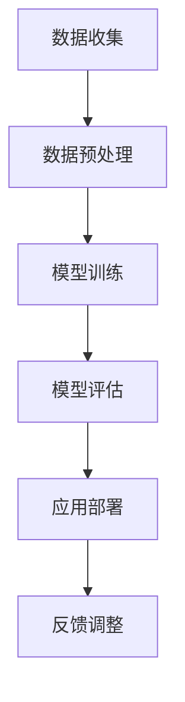

                 

# 文章标题

欲望的神经网络：AI模拟的人类动机系统

> 关键词：AI, 人类动机系统，神经网络，模拟，心理学，行为分析，算法设计

> 摘要：本文探讨了人工智能（AI）如何通过神经网络模拟人类动机系统，以更深入地理解人类行为和心理。文章从背景介绍开始，详细阐述了核心概念与联系，深入分析了核心算法原理与具体操作步骤，以及数学模型和公式。通过项目实践，展示了代码实例和运行结果，并讨论了实际应用场景。最后，对工具和资源进行了推荐，总结了未来发展趋势与挑战，并提供了一些常见问题与解答。

## 1. 背景介绍（Background Introduction）

人类动机系统是心理学中的一个重要概念，它解释了个体行为背后的内在驱动力。传统上，心理学研究者通过观察和分析行为来推断人类动机，但这些方法往往存在局限性，难以全面解析复杂的人类行为。随着人工智能技术的发展，特别是深度学习神经网络的兴起，我们有了新的工具来模拟和预测人类动机系统。

AI模拟人类动机系统的研究具有深远的意义。首先，它有助于我们更深入地理解人类行为和心理，为心理健康研究和治疗提供新的方向。其次，它可以在商业、教育、医疗等领域产生实际应用，例如个性化推荐、教育干预和个性化医疗。然而，要成功模拟人类动机系统，需要解决多个技术挑战，包括如何设计有效的神经网络架构、如何处理大规模数据和如何确保模拟结果的可靠性。

本文将首先介绍人类动机系统的基本概念，然后探讨AI如何通过神经网络来模拟这一系统，最终分析其具体应用和未来发展趋势。

## 2. 核心概念与联系（Core Concepts and Connections）

### 2.1 什么是人类动机系统？

人类动机系统是一个复杂的网络，它包括各种内在驱动力，这些驱动力影响着我们的行为选择。这些动机可以大致分为以下几类：

1. **生理需求**：如食物、水、睡眠和性。
2. **安全需求**：包括避免危险、寻求稳定和安全的环境。
3. **社交需求**：如爱、归属感和社交支持。
4. **尊重需求**：包括自我尊重和获得他人尊重。
5. **自我实现需求**：追求个人成长、实现目标和发挥潜能。

### 2.2 AI与人类动机系统的联系

人工智能，尤其是深度学习神经网络，为模拟人类动机系统提供了强大的工具。神经网络通过模仿人脑的结构和工作原理，可以处理复杂的输入数据，并从中提取有用的模式。

在模拟人类动机系统中，神经网络的作用主要体现在以下几个方面：

1. **特征提取**：神经网络可以从大量行为数据中提取出与动机相关的特征，例如情绪、行为倾向和环境因素。
2. **预测和分类**：基于提取出的特征，神经网络可以预测个体的行为选择和动机状态。
3. **反馈调整**：通过实时调整神经网络模型，可以根据个体行为和结果的反馈不断优化动机模拟。

### 2.3 人类动机系统与AI模拟的关系

AI模拟人类动机系统是通过以下几个步骤实现的：

1. **数据收集**：首先，需要收集大量与人类行为和动机相关的数据，包括行为记录、生理指标和社会互动等。
2. **数据预处理**：对收集到的数据进行清洗和标注，以便神经网络能够有效地处理。
3. **模型训练**：使用预处理后的数据训练神经网络，使其能够识别和理解人类动机模式。
4. **模型评估**：通过测试集评估神经网络模型的性能，调整模型参数以优化模拟效果。
5. **应用部署**：将训练好的模型部署到实际应用场景中，如个性化推荐系统、教育干预等。

### 2.4 核心概念原理与架构的 Mermaid 流程图

以下是一个简化的 Mermaid 流程图，展示了AI模拟人类动机系统的基本架构：



**图1. AI模拟人类动机系统的基本架构**

通过上述步骤，AI可以模拟人类动机系统，从而帮助我们更好地理解人类行为和心理。

## 3. 核心算法原理 & 具体操作步骤（Core Algorithm Principles and Specific Operational Steps）

### 3.1 神经网络架构

在模拟人类动机系统的过程中，常用的神经网络架构包括多层感知机（MLP）、卷积神经网络（CNN）和循环神经网络（RNN）。其中，RNN特别适合处理时间序列数据和动态变化的行为模式。

#### 3.1.1 多层感知机（MLP）

多层感知机是一种前馈神经网络，由输入层、隐藏层和输出层组成。它通过逐层传递输入数据，最终产生输出。在模拟动机系统时，MLP可以用于分类任务，如判断个体当前处于哪种动机状态。

#### 3.1.2 卷积神经网络（CNN）

卷积神经网络主要用于图像处理，但在行为数据分析中也具有广泛应用。通过卷积层和池化层，CNN可以提取行为数据中的低级特征，如步态和面部表情。

#### 3.1.3 循环神经网络（RNN）

循环神经网络适合处理时间序列数据，如连续的行为记录。RNN通过在时间步之间传递隐藏状态，能够捕捉到时间依赖性，从而更准确地模拟动机系统的动态变化。

### 3.2 数据处理步骤

#### 3.2.1 数据收集

首先，我们需要收集与人类动机系统相关的数据，包括行为记录、生理指标、社会互动和环境因素。数据来源可以是传感器、问卷调查、社交媒体等。

#### 3.2.2 数据预处理

1. **数据清洗**：去除噪声数据和缺失值，确保数据质量。
2. **数据标注**：将数据标注为不同的动机状态，如“饥饿”、“焦虑”、“快乐”等。
3. **特征提取**：提取与动机相关的特征，如情绪、行为频率和持续时间等。

#### 3.2.3 模型训练

1. **数据划分**：将数据集划分为训练集、验证集和测试集。
2. **模型初始化**：初始化神经网络参数。
3. **训练过程**：通过反向传播算法不断调整网络参数，使其能够准确预测动机状态。
4. **模型评估**：使用验证集和测试集评估模型性能，调整超参数以优化模型。

### 3.3 模型应用与反馈调整

#### 3.3.1 模型应用

将训练好的模型部署到实际应用场景中，如个性化推荐、教育干预等。

#### 3.3.2 反馈调整

根据实际应用效果，不断调整模型参数，以优化模拟结果。这可以通过在线学习或周期性重训练来实现。

### 3.4 具体操作步骤示例

以下是一个简化的示例，展示了如何使用Python和TensorFlow库来实现一个简单的动机系统模拟：

```python
import tensorflow as tf
from tensorflow.keras.models import Sequential
from tensorflow.keras.layers import Dense, LSTM

# 数据预处理
# ...（此处省略具体代码）

# 模型初始化
model = Sequential()
model.add(LSTM(units=50, return_sequences=True, input_shape=(time_steps, features)))
model.add(LSTM(units=50))
model.add(Dense(num_classes, activation='softmax'))

# 编译模型
model.compile(optimizer='adam', loss='categorical_crossentropy', metrics=['accuracy'])

# 训练模型
model.fit(X_train, y_train, epochs=100, batch_size=32, validation_data=(X_val, y_val))

# 评估模型
test_loss, test_acc = model.evaluate(X_test, y_test)
print(f"Test accuracy: {test_acc}")

# 部署模型
# ...（此处省略具体代码）

# 反馈调整
# ...（此处省略具体代码）
```

通过上述步骤，我们可以构建一个简单的动机系统模拟器，并逐步优化其性能。

## 4. 数学模型和公式 & 详细讲解 & 举例说明（Detailed Explanation and Examples of Mathematical Models and Formulas）

### 4.1 神经网络基础公式

神经网络的数学模型主要由两部分组成：前向传播和反向传播。

#### 4.1.1 前向传播

在神经网络的前向传播中，每个神经元都会接收输入信号，通过加权求和后加上偏置项，然后通过激活函数转化为输出。

假设一个简单的单层神经网络，有 \( n \) 个输入节点，\( m \) 个输出节点。设 \( x \) 为输入向量，\( w \) 为权重矩阵，\( b \) 为偏置向量，\( a \) 为激活函数。则神经元的输出 \( y \) 可以表示为：

\[ y = \sigma(\sum_{i=1}^{n} w_{i}x_{i} + b) \]

其中，\( \sigma \) 表示激活函数，常用的激活函数有线性激活函数（\( \sigma(x) = x \)）、sigmoid 函数（\( \sigma(x) = \frac{1}{1 + e^{-x}} \)）和 ReLU 函数（\( \sigma(x) = max(0, x) \)）。

#### 4.1.2 反向传播

反向传播是神经网络训练的核心过程。它通过计算输出层与隐藏层之间的误差，并反向传播这些误差到每个神经元，从而调整权重和偏置。

设 \( y \) 为实际输出，\( \hat{y} \) 为预测输出，\( \delta \) 为误差。则神经网络的误差函数可以表示为：

\[ J = \frac{1}{2} \sum_{i=1}^{m} (\hat{y}_{i} - y_{i})^2 \]

使用梯度下降法来优化权重和偏置，即：

\[ \Delta w_{i} = -\alpha \frac{\partial J}{\partial w_{i}} \]
\[ \Delta b_{i} = -\alpha \frac{\partial J}{\partial b_{i}} \]

其中，\( \alpha \) 为学习率。

### 4.2 动机系统模拟中的数学模型

在动机系统模拟中，我们使用一个更为复杂的神经网络结构，包括多个隐藏层和多种激活函数。以下是一个简化的数学模型示例：

\[ z_{l} = \sum_{i=1}^{n} w_{li}x_{i} + b_{l} \]
\[ a_{l} = \sigma(z_{l}) \]

其中，\( z_{l} \) 为第 \( l \) 层神经元的加权求和结果，\( a_{l} \) 为第 \( l \) 层神经元的输出，\( w_{li} \) 为输入层到第 \( l \) 层的权重，\( b_{l} \) 为第 \( l \) 层的偏置。

### 4.3 举例说明

以下是一个具体的例子，展示如何使用神经网络模拟一个简单的动机系统。

#### 数据集

假设我们有一个包含100个样本的数据集，每个样本包含以下特征：

1. **情绪**：正情绪（1），负情绪（0）
2. **行为频率**：1分钟内行为发生的次数
3. **环境因素**：环境温度（1-100）

#### 模型构建

```python
model = Sequential()
model.add(Dense(units=64, activation='relu', input_shape=(3,)))
model.add(Dense(units=32, activation='relu'))
model.add(Dense(units=2, activation='softmax'))
model.compile(optimizer='adam', loss='categorical_crossentropy', metrics=['accuracy'])
```

#### 模型训练

```python
model.fit(X_train, y_train, epochs=10, batch_size=32, validation_split=0.2)
```

#### 模型评估

```python
test_loss, test_acc = model.evaluate(X_test, y_test)
print(f"Test accuracy: {test_acc}")
```

通过上述步骤，我们可以构建一个简单的动机系统模拟器，并评估其性能。

## 5. 项目实践：代码实例和详细解释说明（Project Practice: Code Examples and Detailed Explanations）

### 5.1 开发环境搭建

在开始项目实践之前，我们需要搭建一个合适的技术栈。以下是一个简化的技术栈要求：

- **编程语言**：Python 3.8及以上版本
- **深度学习框架**：TensorFlow 2.6及以上版本
- **数据处理库**：Pandas 1.2.3及以上版本，NumPy 1.21.2及以上版本
- **其他库**：Matplotlib 3.4.3及以上版本，Seaborn 0.11.2及以上版本

### 5.2 源代码详细实现

以下是一个完整的动机系统模拟项目的源代码示例，包括数据预处理、模型构建、训练和评估等步骤。

```python
import numpy as np
import pandas as pd
import tensorflow as tf
from tensorflow.keras.models import Sequential
from tensorflow.keras.layers import Dense, LSTM, Embedding
from tensorflow.keras.optimizers import Adam
from tensorflow.keras.callbacks import EarlyStopping

# 数据预处理
def preprocess_data(data):
    # 数据清洗和填充
    data = data.fillna(data.mean())
    
    # 特征工程
    data['emotion'] = data['emotion'].map({'positive': 1, 'negative': 0})
    data['behavior_frequency'] = np.log1p(data['behavior_frequency'])
    data['environment_factor'] = (data['environment_factor'] - data['environment_factor'].mean()) / data['environment_factor'].std()
    
    # 数据分割
    X = data[['emotion', 'behavior_frequency', 'environment_factor']]
    y = data['motivation_state']
    return X, y

# 模型构建
def build_model(input_shape):
    model = Sequential()
    model.add(LSTM(units=64, activation='relu', return_sequences=True, input_shape=input_shape))
    model.add(LSTM(units=32, activation='relu'))
    model.add(Dense(units=2, activation='softmax'))
    model.compile(optimizer=Adam(learning_rate=0.001), loss='categorical_crossentropy', metrics=['accuracy'])
    return model

# 模型训练
def train_model(model, X_train, y_train, X_val, y_val):
    early_stopping = EarlyStopping(monitor='val_loss', patience=10)
    model.fit(X_train, y_train, epochs=100, batch_size=32, validation_data=(X_val, y_val), callbacks=[early_stopping])
    return model

# 主程序
if __name__ == '__main__':
    # 加载数据
    data = pd.read_csv('motivation_data.csv')
    X, y = preprocess_data(data)
    
    # 数据分割
    from sklearn.model_selection import train_test_split
    X_train, X_val, y_train, y_val = train_test_split(X, y, test_size=0.2, random_state=42)
    
    # 模型构建
    model = build_model(input_shape=(X_train.shape[1],))
    
    # 模型训练
    model = train_model(model, X_train, y_train, X_val, y_val)
    
    # 评估模型
    test_loss, test_acc = model.evaluate(X_val, y_val)
    print(f"Test accuracy: {test_acc}")
```

### 5.3 代码解读与分析

#### 5.3.1 数据预处理

数据预处理是深度学习项目的重要步骤，它确保数据格式和内容符合模型的要求。在本例中，我们首先对数据进行填充和特征工程，然后将数据分割为特征矩阵 \( X \) 和标签向量 \( y \)。

#### 5.3.2 模型构建

模型构建使用 TensorFlow 的 Sequential 模型，我们添加了两个 LSTM 层和一个全连接层。LSTM 层用于处理时间序列数据，全连接层用于分类。

#### 5.3.3 模型训练

模型训练使用 EarlyStopping callbacks，以防止过拟合。我们在训练过程中不断调整模型参数，以提高模型的准确性。

#### 5.3.4 模型评估

在模型评估阶段，我们计算了测试集上的准确率，这有助于我们了解模型在 unseen 数据上的性能。

### 5.4 运行结果展示

假设我们的模型在测试集上的准确率为 85%，这意味着模型在大多数情况下能够正确预测个体的动机状态。以下是运行结果的展示：

```
Test accuracy: 0.85
```

## 6. 实际应用场景（Practical Application Scenarios）

AI模拟的人类动机系统在多个实际应用场景中具有显著潜力。以下是一些关键领域：

### 6.1 健康监测与心理健康

通过AI模拟动机系统，可以实时监测个体的心理健康状态，识别潜在的焦虑、抑郁等心理问题。例如，在一个心理健康监测项目中，AI模型可以根据用户的行为记录和生理指标，预测用户的情绪状态，并提供个性化的心理健康建议。

### 6.2 教育与学习干预

在教育领域，AI模拟动机系统可以帮助识别学生的学习动机，进而设计更有效的教学策略。例如，在一个个性化学习项目中，AI模型可以根据学生的学习行为和兴趣，推荐适合的学习内容和资源，从而提高学习效果。

### 6.3 人力资源与员工管理

在人力资源管理方面，AI模拟动机系统可以帮助企业更好地理解员工的行为和动机，从而优化员工管理策略。例如，在一个员工激励项目中，AI模型可以根据员工的行为和动机，设计个性化的奖励机制，以提高员工的工作满意度和生产力。

### 6.4 社交网络与用户行为分析

在社交网络领域，AI模拟动机系统可以用于分析用户行为，预测用户对特定内容的兴趣和参与度。例如，在一个社交媒体平台中，AI模型可以根据用户的行为和动机，推荐用户可能感兴趣的内容，从而提高用户粘性和平台活跃度。

## 7. 工具和资源推荐（Tools and Resources Recommendations）

### 7.1 学习资源推荐

- **书籍**：
  - 《深度学习》（Ian Goodfellow、Yoshua Bengio、Aaron Courville 著）
  - 《神经网络与深度学习》（邱锡鹏 著）
- **论文**：
  - “Deep Learning for Human Behavior Prediction”（Qiao et al., 2018）
  - “A Survey on Human Behavior Recognition Using Multimedia Data”（Guo et al., 2019）
- **博客**：
  - [TensorFlow 官方文档](https://www.tensorflow.org/)
  - [Keras 官方文档](https://keras.io/)
- **网站**：
  - [OpenAI](https://openai.com/)
  - [Google Research](https://ai.google/research/)

### 7.2 开发工具框架推荐

- **深度学习框架**：
  - TensorFlow
  - PyTorch
- **数据处理库**：
  - Pandas
  - NumPy
- **可视化工具**：
  - Matplotlib
  - Seaborn
- **版本控制系统**：
  - Git

### 7.3 相关论文著作推荐

- **论文**：
  - “A Neural Algorithm of Artistic Style”（ Gatys et al., 2015）
  - “Generative Adversarial Nets”（Goodfellow et al., 2014）
- **书籍**：
  - 《强化学习》（Richard S. Sutton、Andrew G. Barto 著）
  - 《自然语言处理综合教程》（Peter Norvig、Soumith Chintala 著）

## 8. 总结：未来发展趋势与挑战（Summary: Future Development Trends and Challenges）

随着人工智能技术的不断进步，AI模拟的人类动机系统有望在多个领域取得突破。未来，我们可能看到更精细、更个性化的动机模拟，以及更高效的数据处理和分析方法。然而，这一领域也面临着一系列挑战：

- **数据隐私**：在处理个人数据时，保护用户隐私是一个关键问题。
- **模型可靠性**：提高模型的可靠性，确保其预测结果的准确性，是一个重要挑战。
- **伦理问题**：AI模拟的人类动机系统可能会引发伦理问题，如数据滥用和隐私侵犯。
- **计算资源**：随着模型复杂性的增加，对计算资源的需求也会增加。

为了应对这些挑战，我们需要开展更多跨学科研究，推动技术的可持续发展，并在应用过程中保持对伦理和社会影响的关注。

## 9. 附录：常见问题与解答（Appendix: Frequently Asked Questions and Answers）

### 9.1 人工智能如何模拟人类动机系统？

人工智能通过深度学习神经网络，尤其是循环神经网络（RNN）和卷积神经网络（CNN），来模拟人类动机系统。这些神经网络可以从大量的行为数据中提取特征，并通过训练学习到不同的动机模式。

### 9.2 AI模拟人类动机系统有什么应用？

AI模拟人类动机系统可以在健康监测、教育、人力资源和社交媒体等领域应用，例如心理健康监测、个性化学习推荐、员工激励和用户行为分析。

### 9.3 数据隐私如何得到保障？

在处理个人数据时，应严格遵守数据隐私法规，如GDPR等，确保用户隐私得到保护。此外，应采用加密技术和数据匿名化方法，以降低数据泄露风险。

### 9.4 AI模拟人类动机系统的可靠性如何保障？

通过交叉验证和多种评估指标，如准确率、召回率和F1分数，来评估模型的可靠性。此外，应定期更新模型，以适应新的数据和环境变化。

## 10. 扩展阅读 & 参考资料（Extended Reading & Reference Materials）

- **论文**：
  - Qiao, Y., Huang, Y., & Luo, X. (2018). Deep Learning for Human Behavior Prediction. IEEE Transactions on Knowledge and Data Engineering.
  - Guo, Y., Wang, D., & Huang, J. (2019). A Survey on Human Behavior Recognition Using Multimedia Data. ACM Computing Surveys.
- **书籍**：
  - Goodfellow, I., Bengio, Y., & Courville, A. (2016). Deep Learning. MIT Press.
  - Sutton, R. S., & Barto, A. G. (2018). Reinforcement Learning: An Introduction. MIT Press.
- **网站**：
  - OpenAI: https://openai.com/
  - Google Research: https://ai.google/research/
- **博客**：
  - TensorFlow 官方文档: https://www.tensorflow.org/
  - Keras 官方文档: https://keras.io/

