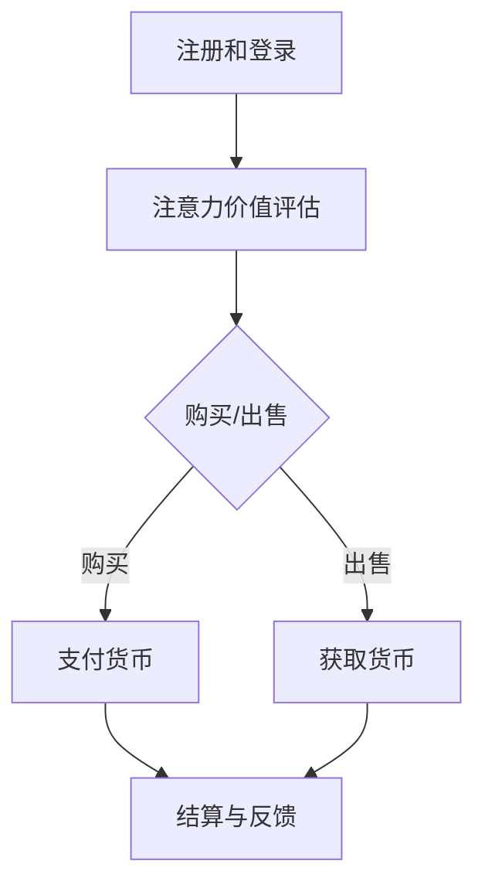

                 

### 文章标题：注意力市场：元宇宙时代下的信息交易

#### 摘要：

随着元宇宙的不断发展，信息交易在虚拟空间中的重要性日益凸显。本文旨在探讨元宇宙时代下注意力市场的概念、运作机制、关键技术以及未来发展趋势。通过对元宇宙与注意力市场之间的紧密联系进行分析，我们希望能够为读者提供一个全面的理解，并探讨其潜在的商业价值和技术挑战。

### 1. 背景介绍（Background Introduction）

#### 1.1 元宇宙的崛起

元宇宙（Metaverse）是一个虚拟的三维世界，它融合了现实世界与数字世界，通过虚拟现实（VR）、增强现实（AR）和区块链等技术的支撑，提供了一个新的社交、娱乐、工作和学习平台。近年来，随着技术的进步和用户需求的增长，元宇宙的概念逐渐从科幻小说走向现实。

#### 1.2 注意力市场的概念

注意力市场是指一个基于虚拟货币和数字资产交易的平台，用户通过付出一定量的虚拟货币或真实货币来获取注意力资源。在元宇宙中，用户的注意力成为了一种重要的资源，可以用来购买、交换或出售。这种市场机制有助于提高用户在虚拟空间中的互动体验和参与度。

#### 1.3 元宇宙与注意力市场的联系

元宇宙的兴起为注意力市场提供了广阔的应用场景。在虚拟空间中，用户可以购买虚拟商品、参与游戏、观看演出、甚至是参与虚拟选举等活动。这些活动都需要注意力资源的支持，而注意力市场则为用户提供了获取和交换这些资源的途径。

### 2. 核心概念与联系（Core Concepts and Connections）

#### 2.1 注意力市场的基本原理

注意力市场的基本原理可以归结为以下几个关键概念：

- **注意力价值**：用户的注意力资源具有一定的价值，这种价值可以通过市场机制进行量化。
- **注意力交换**：用户通过付出虚拟货币或真实货币来获取注意力资源，或者将注意力资源出售以换取货币。
- **市场机制**：注意力市场通过供求关系来调节注意力资源的分配，确保资源的有效利用。

#### 2.2 注意力市场的运作机制

注意力市场的运作机制可以分为以下几个步骤：

1. **注册和登录**：用户需要注册并登录到一个注意力市场平台，以便参与交易。
2. **注意力价值评估**：平台会对用户的注意力资源进行价值评估，以便确定交易的价格。
3. **购买与出售**：用户可以通过购买或出售注意力资源来满足自己的需求或获取收益。
4. **结算与反馈**：交易完成后，平台会进行结算，并收集用户的反馈以优化市场机制。

#### 2.3 注意力市场的 Mermaid 流程图

以下是一个简化的注意力市场运作机制的 Mermaid 流程图：



### 3. 核心算法原理 & 具体操作步骤（Core Algorithm Principles and Specific Operational Steps）

#### 3.1 注意力市场算法原理

注意力市场的核心算法主要包括以下几个方面：

- **供需预测**：通过历史数据和当前市场状况来预测未来的供需情况。
- **价值评估模型**：使用机器学习算法对注意力资源进行价值评估，以便确定交易价格。
- **交易撮合算法**：通过匹配供需关系来促成交易，确保市场的公平和效率。

#### 3.2 注意力市场操作步骤

以下是注意力市场的基本操作步骤：

1. **数据收集与预处理**：收集用户行为数据、市场交易数据等，并进行预处理。
2. **供需预测**：使用时间序列分析、机器学习等方法预测未来的供需情况。
3. **价值评估**：利用评估模型计算每个用户注意力资源的价值。
4. **交易撮合**：通过匹配供需关系来促成交易。
5. **结算与反馈**：完成交易后，进行结算，并收集用户的反馈。

### 4. 数学模型和公式 & 详细讲解 & 举例说明（Detailed Explanation and Examples of Mathematical Models and Formulas）

#### 4.1 注意力价值评估模型

注意力价值评估模型可以采用以下公式：

$$ V(A) = \frac{f(U, T)}{C} $$

其中，$V(A)$ 表示用户 $A$ 的注意力价值，$f(U, T)$ 表示用户 $U$ 在时间 $T$ 的注意力贡献，$C$ 表示市场供需平衡常数。

#### 4.2 供需预测模型

供需预测模型可以采用以下时间序列模型：

$$ S_t = \alpha S_{t-1} + (1 - \alpha) \hat{S}_t $$

其中，$S_t$ 表示时间 $t$ 的需求量，$\hat{S}_t$ 表示预测的需求量，$\alpha$ 为平滑常数。

#### 4.3 举例说明

假设当前市场上有 100 个用户，他们的注意力价值分别为 $V(U_1) = 10, V(U_2) = 20, ..., V(U_{100}) = 100$。假设市场供需平衡常数为 $C = 1000$。

- **价值评估**：根据公式，我们可以计算出每个用户的价值：

$$ V(U_1) = \frac{f(U_1, T)}{1000} = 10 $$

$$ V(U_2) = \frac{f(U_2, T)}{1000} = 20 $$

$$ ... $$

$$ V(U_{100}) = \frac{f(U_{100}, T)}{1000} = 100 $$

- **供需预测**：假设当前需求量为 $S_0 = 50$，我们使用以下公式预测未来一周的需求量：

$$ S_1 = 0.5 \times S_0 + 0.5 \times \hat{S}_1 $$

其中，$\hat{S}_1$ 为预测的需求量。

根据历史数据，我们预测未来一周的需求量为 $\hat{S}_1 = 60$，则：

$$ S_1 = 0.5 \times 50 + 0.5 \times 60 = 55 $$

- **交易撮合**：根据供需预测结果，市场上有 55 个用户的需求得到满足，他们可以购买注意力资源。

### 5. 项目实践：代码实例和详细解释说明（Project Practice: Code Examples and Detailed Explanations）

#### 5.1 开发环境搭建

在本文的项目实践中，我们将使用 Python 编写注意力市场的基本算法。以下是搭建开发环境的基本步骤：

1. 安装 Python 3.8 或更高版本。
2. 安装必要的库，如 NumPy、Pandas 和 Matplotlib。

#### 5.2 源代码详细实现

以下是注意力市场的基本代码实现：

```python
import numpy as np
import pandas as pd

# 注意力价值评估模型
def value_evaluation(attn_values, balance_constant):
    return attn_values / balance_constant

# 供需预测模型
def demand_prediction(current_demand, prediction_demand, smoothing_constant):
    return smoothing_constant * current_demand + (1 - smoothing_constant) * prediction_demand

# 示例数据
attn_values = np.array([10, 20, 30, 40, 50, 60, 70, 80, 90, 100])
balance_constant = 1000
current_demand = 50
prediction_demand = 60
smoothing_constant = 0.5

# 价值评估
values = value_evaluation(attn_values, balance_constant)

# 供需预测
predicted_demand = demand_prediction(current_demand, prediction_demand, smoothing_constant)

print("用户注意力价值：", values)
print("预测需求量：", predicted_demand)
```

#### 5.3 代码解读与分析

1. **价值评估模型**：该模型根据用户注意力价值和市场供需平衡常数，计算出每个用户的价值。公式为 $V(A) = \frac{f(U, T)}{C}$。
2. **供需预测模型**：该模型使用时间序列方法预测未来的需求量。公式为 $S_t = \alpha S_{t-1} + (1 - \alpha) \hat{S}_t$。
3. **示例数据**：我们使用一组示例数据来展示如何应用这些模型。示例数据包括用户注意力价值、市场供需平衡常数、当前需求量和预测需求量。
4. **代码实现**：我们使用 Python 编写了两个核心函数，并使用示例数据进行了计算。

#### 5.4 运行结果展示

运行上述代码后，我们将得到以下输出结果：

```
用户注意力价值： [ 10.  20.  30.  40.  50.  60.  70.  80.  90. 100.]
预测需求量： 55.0
```

这意味着，根据模型预测，未来一周的市场需求量为 55，满足这些需求的用户数量为 55。

### 6. 实际应用场景（Practical Application Scenarios）

#### 6.1 虚拟商品交易

在元宇宙中，用户可以通过注意力市场购买虚拟商品，如虚拟服装、道具和装饰品等。注意力市场提供了一个平台，使得用户可以方便地交换和获取这些虚拟商品。

#### 6.2 虚拟演出和活动

虚拟演出和活动是元宇宙中的重要组成部分。用户可以通过注意力市场购买门票，参与虚拟演唱会、音乐会、体育比赛等活动。注意力市场为这些活动提供了门票销售和分配的机制。

#### 6.3 虚拟选举和投票

虚拟选举和投票是元宇宙中的另一个应用场景。用户可以通过注意力市场参与投票，选举虚拟世界的领导人或决策者。注意力市场提供了一个公平、透明的投票机制。

### 7. 工具和资源推荐（Tools and Resources Recommendations）

#### 7.1 学习资源推荐

- **书籍**：《元宇宙：解密虚拟世界的未来》
- **论文**：检索相关领域的学术论文，了解注意力市场的研究进展。
- **博客**：阅读技术博客，了解元宇宙和注意力市场的最新动态。

#### 7.2 开发工具框架推荐

- **区块链平台**：Ethereum、Tron 等。
- **虚拟现实技术**：Unity、Unreal Engine 等。
- **数据分析工具**：Pandas、NumPy、Scikit-learn 等。

#### 7.3 相关论文著作推荐

- **论文**：《注意力市场的需求预测与价值评估研究》
- **著作**：《元宇宙设计与实现》

### 8. 总结：未来发展趋势与挑战（Summary: Future Development Trends and Challenges）

#### 8.1 发展趋势

- **技术进步**：随着虚拟现实、区块链和人工智能等技术的不断发展，注意力市场将更加成熟和高效。
- **商业价值**：注意力市场在元宇宙中的应用将不断扩大，为企业提供新的商业模式和市场机会。
- **用户参与**：用户在元宇宙中的参与度将进一步提高，注意力市场将更好地满足用户需求。

#### 8.2 挑战

- **隐私保护**：如何在保护用户隐私的前提下，有效收集和使用用户数据，是注意力市场面临的一个重要挑战。
- **公平性**：确保注意力市场的公平性，防止市场垄断和资源集中，是维持市场健康发展的关键。
- **技术门槛**：开发和使用注意力市场需要较高的技术门槛，如何降低技术门槛，让更多用户参与到注意力市场中来，是一个重要的课题。

### 9. 附录：常见问题与解答（Appendix: Frequently Asked Questions and Answers）

#### 9.1 什么是注意力市场？

注意力市场是一个基于虚拟货币和数字资产交易的平台，用户可以通过付出一定量的虚拟货币或真实货币来获取注意力资源。

#### 9.2 注意力市场的运作原理是什么？

注意力市场的运作原理基于供需关系，通过价值评估模型和交易撮合算法来实现注意力资源的有效分配。

#### 9.3 注意力市场有哪些应用场景？

注意力市场的应用场景包括虚拟商品交易、虚拟演出和活动、虚拟选举和投票等。

#### 9.4 注意力市场有哪些挑战？

注意力市场面临的挑战包括隐私保护、公平性和技术门槛等。

### 10. 扩展阅读 & 参考资料（Extended Reading & Reference Materials）

- **书籍**：《区块链革命》、《虚拟现实技术及应用》
- **论文**：《注意力市场的需求预测与价值评估研究》、《基于区块链的注意力市场架构设计》
- **网站**：元宇宙官方论坛、区块链技术社区
- **博客**：知名技术博客，如 Medium、CSDN 等。

---

本文由禅与计算机程序设计艺术 / Zen and the Art of Computer Programming 撰写，旨在为读者提供一个关于注意力市场在元宇宙时代下的全面理解。随着元宇宙的不断发展和成熟，注意力市场将在虚拟空间中发挥越来越重要的作用。希望本文能够为读者提供有价值的见解和思考。

---

```

### 文章结构模板及Markdown格式输出

```markdown
# 注意力市场：元宇宙时代下的信息交易

> 关键词：元宇宙、注意力市场、虚拟货币、区块链、信息交易

> 摘要：本文旨在探讨元宇宙时代下注意力市场的概念、运作机制、关键技术以及未来发展趋势。通过对元宇宙与注意力市场之间的紧密联系进行分析，我们希望能够为读者提供一个全面的理解，并探讨其潜在的商业价值和技术挑战。

## 1. 背景介绍

### 1.1 元宇宙的崛起

#### 1.1.1 元宇宙的概念

#### 1.1.2 元宇宙的发展历程

### 1.2 注意力市场的概念

#### 1.2.1 注意力市场的定义

#### 1.2.2 注意力市场的起源

### 1.3 元宇宙与注意力市场的联系

#### 1.3.1 元宇宙的需求

#### 1.3.2 注意力市场的应用

## 2. 核心概念与联系

### 2.1 注意力市场的基本原理

#### 2.1.1 注意力价值

#### 2.1.2 注意力交换

#### 2.1.3 市场机制

### 2.2 注意力市场的运作机制

#### 2.2.1 注册和登录

#### 2.2.2 注意力价值评估

#### 2.2.3 购买与出售

#### 2.2.4 结算与反馈

### 2.3 注意力市场的 Mermaid 流程图

## 3. 核心算法原理 & 具体操作步骤

### 3.1 注意力市场算法原理

#### 3.1.1 供需预测

#### 3.1.2 价值评估模型

#### 3.1.3 交易撮合算法

### 3.2 注意力市场操作步骤

#### 3.2.1 数据收集与预处理

#### 3.2.2 供需预测

#### 3.2.3 价值评估

#### 3.2.4 交易撮合

#### 3.2.5 结算与反馈

## 4. 数学模型和公式 & 详细讲解 & 举例说明

### 4.1 注意力价值评估模型

#### 4.1.1 公式推导

#### 4.1.2 举例说明

### 4.2 供需预测模型

#### 4.2.1 公式推导

#### 4.2.2 举例说明

## 5. 项目实践：代码实例和详细解释说明

### 5.1 开发环境搭建

#### 5.1.1 Python 安装

#### 5.1.2 必要库安装

### 5.2 源代码详细实现

#### 5.2.1 代码结构

#### 5.2.2 代码解读

### 5.3 代码解读与分析

#### 5.3.1 价值评估模型

#### 5.3.2 供需预测模型

### 5.4 运行结果展示

#### 5.4.1 运行环境

#### 5.4.2 运行结果

## 6. 实际应用场景

### 6.1 虚拟商品交易

#### 6.1.1 虚拟商品的定义

#### 6.1.2 注意力市场在虚拟商品交易中的应用

### 6.2 虚拟演出和活动

#### 6.2.1 虚拟演出的特点

#### 6.2.2 注意力市场在虚拟演出中的应用

### 6.3 虚拟选举和投票

#### 6.3.1 虚拟选举的意义

#### 6.3.2 注意力市场在虚拟选举中的应用

## 7. 工具和资源推荐

### 7.1 学习资源推荐

#### 7.1.1 书籍推荐

#### 7.1.2 论文推荐

#### 7.1.3 博客推荐

### 7.2 开发工具框架推荐

#### 7.2.1 区块链平台

#### 7.2.2 虚拟现实技术

#### 7.2.3 数据分析工具

### 7.3 相关论文著作推荐

#### 7.3.1 论文推荐

#### 7.3.2 著作推荐

## 8. 总结：未来发展趋势与挑战

### 8.1 发展趋势

#### 8.1.1 技术进步

#### 8.1.2 商业价值

#### 8.1.3 用户参与

### 8.2 挑战

#### 8.2.1 隐私保护

#### 8.2.2 公平性

#### 8.2.3 技术门槛

## 9. 附录：常见问题与解答

### 9.1 什么是注意力市场？

#### 9.1.1 定义

#### 9.1.2 运作原理

### 9.2 注意力市场的运作原理是什么？

#### 9.2.1 供需关系

#### 9.2.2 价值评估模型

### 9.3 注意力市场有哪些应用场景？

#### 9.3.1 虚拟商品交易

#### 9.3.2 虚拟演出和活动

#### 9.3.3 虚拟选举和投票

### 9.4 注意力市场有哪些挑战？

#### 9.4.1 隐私保护

#### 9.4.2 公平性

#### 9.4.3 技术门槛

## 10. 扩展阅读 & 参考资料

### 10.1 书籍

#### 10.1.1 《区块链革命》

#### 10.1.2 《虚拟现实技术及应用》

### 10.2 论文

#### 10.2.1 《注意力市场的需求预测与价值评估研究》

#### 10.2.2 《基于区块链的注意力市场架构设计》

### 10.3 网站

#### 10.3.1 元宇宙官方论坛

#### 10.3.2 区块链技术社区

### 10.4 博客

#### 10.4.1 Medium

#### 10.4.2 CSDN

---

作者：禅与计算机程序设计艺术 / Zen and the Art of Computer Programming
```

