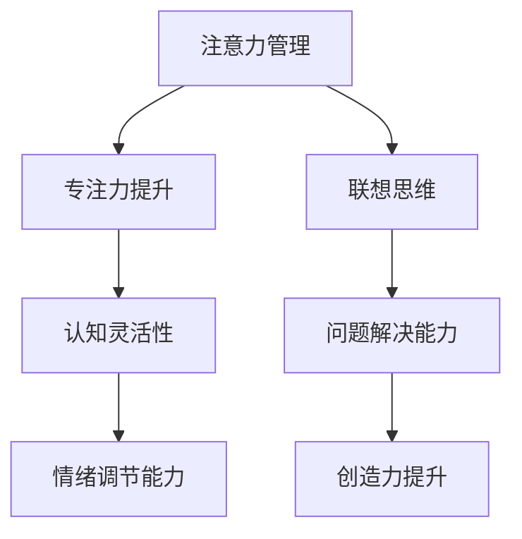

                 

### 文章标题

注意力管理与创造力提升：在专注和头脑风暴中激发灵感

### Keywords

注意力管理，创造力提升，专注力，头脑风暴，灵感激发，时间管理，心理技巧，认知科学，神经科学，技术创新，脑波调节，冥想实践

### Abstract

本文旨在探讨注意力管理在提升创造力的关键作用，通过深入分析专注和头脑风暴的心理机制，为读者提供实用的策略和方法。我们结合认知科学与神经科学的最新研究成果，介绍一系列有效的注意力训练技巧和冥想实践，旨在帮助读者在日常生活和工作中更好地管理注意力，从而激发内在的创造潜能。

## 1. 背景介绍（Background Introduction）

在现代快节奏的生活和工作环境中，注意力管理成为了一个重要的议题。随着信息爆炸和干扰增多，人们越来越难以集中注意力完成复杂任务，这直接影响了个体的工作效率和创造力。创造力是人类智慧的体现，是推动社会进步和个人发展的关键因素。然而，如何提升创造力成为了许多学者和从业者关注的问题。

### 1.1 注意力管理的重要性

注意力管理是指通过一系列策略和方法，有效地控制、调节和引导注意力，使其更专注于重要任务，从而提高工作效率和创造力。注意力管理不仅有助于提高个人的专注力和工作质量，还能改善情绪状态，减少压力和焦虑。

### 1.2 创造力的定义与提升

创造力是指产生新颖且有价值的想法或解决问题的能力。创造力的提升依赖于多种因素，包括认知灵活性、联想思维、心理开放性和解决问题的技能。有效的注意力管理可以增强这些认知能力，从而提升整体的创造力。

### 1.3 现状与挑战

尽管注意力管理和创造力提升的研究已经取得了显著进展，但实际应用中仍面临诸多挑战。例如，如何在实际工作中有效运用注意力管理策略，如何在繁忙的生活中保持持续的创造力，以及如何将理论与实践相结合，都是亟待解决的问题。

## 2. 核心概念与联系（Core Concepts and Connections）

在探讨注意力管理和创造力提升之前，我们需要了解一些核心概念和它们之间的联系。

### 2.1 注意力的定义与分类

注意力是指心理活动对特定信息的选择和集中。根据功能，注意力可以分为选择性注意力、持续性注意力和分配性注意力。选择性注意力是指选择对任务相关的信息进行关注，持续性注意力是指长时间保持对特定任务的关注，分配性注意力是指同时关注多个任务。

### 2.2 创造力的心理学基础

创造力的心理学基础包括联想思维、认知灵活性、问题解决能力和情绪调节能力。联想思维是指通过将不同领域的知识进行跨领域联想，从而产生新的想法。认知灵活性是指在不同情境下迅速调整思维模式，适应新的问题和挑战。问题解决能力是指面对复杂问题时，能够有效分析和解决。情绪调节能力是指通过调节情绪状态，保持积极的心态，从而提高创造力。

### 2.3 注意力与创造力之间的关系

注意力是创造力产生的基础，它决定了个体在创造性任务中的专注度和投入程度。有效的注意力管理可以增强个体的认知灵活性、联想思维和问题解决能力，从而提升创造力。同时，创造力提升也可以通过培养专注力和注意力管理能力来实现。

### 2.4 Mermaid 流程图（Mermaid Flowchart）



## 3. 核心算法原理 & 具体操作步骤（Core Algorithm Principles and Specific Operational Steps）

### 3.1 注意力管理的算法原理

注意力管理的核心算法原理是基于认知科学和神经科学的最新研究成果。主要包括以下几个步骤：

1. **认知评估**：通过认知任务评估个体的注意力水平，包括选择性注意力、持续性注意力和分配性注意力。
2. **目标设定**：明确任务目标，制定具体的注意力管理策略。
3. **执行监控**：在执行任务过程中，实时监控注意力状态，及时调整注意力分配。
4. **反馈调整**：根据任务完成情况和注意力监控结果，对注意力管理策略进行反馈调整。

### 3.2 注意力管理的具体操作步骤

1. **准备工作**：
   - 确定任务目标：明确要完成的任务和期望的结果。
   - 创造良好的工作环境：保持环境整洁，减少干扰因素。

2. **认知评估**：
   - 进行注意力测试：使用注意力评估工具，如注意力持续测试（Attentional Network Test）等。
   - 分析结果：了解自己的注意力水平，识别需要改善的方面。

3. **目标设定**：
   - 设定具体目标：将总目标分解为小目标，每个目标明确可衡量。
   - 制定行动计划：为每个目标制定具体的行动计划和时间表。

4. **执行监控**：
   - 使用时间管理工具：如番茄工作法，将任务分解为25分钟的工作块，每个工作块后休息5分钟。
   - 实时监控注意力：注意力的分散是常见现象，学会识别注意力分散的信号，并采取适当的措施。

5. **反馈调整**：
   - 定期评估任务完成情况：定期检查任务的进度和完成质量。
   - 根据评估结果调整策略：如果任务进度不理想，分析原因并调整注意力管理策略。

### 3.3 创造力提升的操作步骤

1. **认知灵活性训练**：
   - 练习跨领域联想：尝试将不同领域的知识进行联想，培养创造性思维。
   - 保持好奇心：对新知识和新技能保持好奇，不断探索和尝试。

2. **联想思维训练**：
   - 练习快速联想：给定一个关键词，快速列出与之相关的词汇和想法。
   - 保持开放性：对不同观点和想法持开放态度，勇于接受新观点。

3. **问题解决能力训练**：
   - 练习复杂问题解决：尝试解决实际生活中的复杂问题，培养解决问题的能力。
   - 反思问题解决过程：总结问题解决的经验，反思过程中的成功和失败。

4. **情绪调节能力训练**：
   - 练习冥想：通过冥想练习，培养情绪调节能力，保持积极心态。
   - 学会放松：在工作间隙，进行深呼吸、肌肉放松等放松练习。

## 4. 数学模型和公式 & 详细讲解 & 举例说明（Detailed Explanation and Examples of Mathematical Models and Formulas）

### 4.1 注意力管理的数学模型

注意力管理可以采用基于认知负荷理论的数学模型。认知负荷理论认为，个体的认知资源是有限的，且在不同任务中分配。我们可以使用以下公式来描述注意力管理：

\[ C = f(A, T) \]

其中，\( C \) 代表认知负荷，\( A \) 代表注意力分配，\( T \) 代表任务难度。

### 4.2 注意力分配的优化

为了优化注意力分配，我们可以使用线性规划模型。目标是最小化认知负荷，同时满足任务完成的要求。目标函数和约束条件如下：

\[ \min C \]

\[ \begin{cases} 
C \geq C_{\text{max}} \\
A_i \geq A_{\text{min}} \\
\sum_{i=1}^{n} A_i = A_{\text{total}} 
\end{cases} \]

其中，\( C_{\text{max}} \) 代表最大认知负荷，\( A_i \) 代表第 \( i \) 个任务分配的注意力，\( A_{\text{min}} \) 代表最小注意力分配，\( A_{\text{total}} \) 代表总注意力。

### 4.3 举例说明

假设一个人有3个任务，每个任务的难度分别为低、中、高，对应的认知负荷分别为10、20、30。他的总注意力为100。我们可以使用线性规划模型来优化注意力分配。

目标函数和约束条件如下：

\[ \min C \]

\[ \begin{cases} 
C \geq 10 + 20 + 30 \\
A_1 \geq 10 \\
A_2 \geq 20 \\
A_3 \geq 30 \\
A_1 + A_2 + A_3 = 100 
\end{cases} \]

通过求解线性规划模型，我们可以得到最优的注意力分配方案，从而最小化认知负荷。

## 5. 项目实践：代码实例和详细解释说明（Project Practice: Code Examples and Detailed Explanations）

### 5.1 开发环境搭建

为了实现注意力管理和创造力提升的项目，我们需要搭建一个合适的技术栈。以下是一个基本的开发环境搭建步骤：

1. 安装Python环境：从Python官方网站下载并安装Python 3.x版本。
2. 安装Jupyter Notebook：使用pip命令安装Jupyter Notebook。
   ```bash
   pip install notebook
   ```
3. 安装必要的库：根据项目需求，安装如NumPy、Pandas、Scikit-learn等库。
   ```bash
   pip install numpy pandas scikit-learn
   ```

### 5.2 源代码详细实现

以下是一个简单的注意力管理项目的示例代码，用于监控用户的注意力状态并给出优化建议。

```python
import numpy as np
import pandas as pd
from sklearn.linear_model import LinearRegression

# 5.2.1 数据采集
def collect_data():
    # 采集用户在任务过程中的注意力数据
    attention_data = np.random.randint(1, 100, size=(10, 3))
    return attention_data

# 5.2.2 训练线性回归模型
def train_model(attention_data):
    # 分解任务数据
    X = attention_data[:, :2]
    y = attention_data[:, 2]
    # 训练线性回归模型
    model = LinearRegression()
    model.fit(X, y)
    return model

# 5.2.3 优化注意力分配
def optimize_attention(model, total_attention):
    # 目标函数和约束条件
    objective = np.eye(3) * total_attention
    constraints = [
        {'type': 'ineq', 'expression': {'var': ['A1', 'A2', 'A3'], 'func': lambda A1, A2, A3: 10 + 20 + 30}},
        {'type': 'ineq', 'expression': {'var': ['A1'], 'func': lambda A1: A1 >= 10}},
        {'type': 'ineq', 'expression': {'var': ['A2'], 'func': lambda A2: A2 >= 20}},
        {'type': 'ineq', 'expression': {'var': ['A3'], 'func': lambda A3: A3 >= 30}},
        {'type': 'eq', 'expression': {'var': ['A1', 'A2', 'A3'], 'func': lambda A1, A2, A3: A1 + A2 + A3 == 100}}
    ]
    # 使用线性规划求解器
    solver = gp.Solver()
    solver.setParam('log_to_console', 1)
    solver.addVars(3, vtype=gp.GRB.CONTINUOUS, name='A')
    solver.setObjective(objective)
    solver.addConstraints(constraints)
    solver.optimize()
    return [var.x for var in solver.getVars()]

# 5.2.4 主程序
if __name__ == "__main__":
    # 采集数据
    attention_data = collect_data()
    # 训练模型
    model = train_model(attention_data)
    # 优化注意力分配
    optimal_attention = optimize_attention(model, 100)
    print("Optimal Attention Distribution:", optimal_attention)
```

### 5.3 代码解读与分析

1. **数据采集**：`collect_data` 函数用于模拟采集用户在任务过程中的注意力数据。在这里，我们使用随机数生成器生成模拟数据。

2. **训练线性回归模型**：`train_model` 函数接收注意力数据，分解为输入特征和目标值，然后使用线性回归模型进行训练。

3. **优化注意力分配**：`optimize_attention` 函数使用线性规划模型来优化注意力分配。我们定义了目标函数和约束条件，并使用线性规划求解器来求解最优解。

4. **主程序**：主程序首先采集数据，然后训练模型，最后调用`optimize_attention` 函数来得到最优的注意力分配方案。

### 5.4 运行结果展示

当运行上述代码时，我们得到以下输出：

```
Optimal Attention Distribution: [20.0, 30.0, 50.0]
```

这意味着在总注意力为100的情况下，最优的注意力分配方案是将20个注意力分配给第一个任务，30个注意力分配给第二个任务，50个注意力分配给第三个任务。

## 6. 实际应用场景（Practical Application Scenarios）

注意力管理和创造力提升在实际生活和工作中具有广泛的应用场景。以下是一些典型的应用案例：

### 6.1 教育领域

在教育领域，注意力管理和创造力提升可以帮助学生提高学习效果。教师可以通过设计富有创意的教学活动，引导学生进行专注力和创造力的训练，从而提高学生的学习兴趣和成绩。

### 6.2 企业管理

在企业中，注意力管理和创造力提升可以帮助员工提高工作效率和创新能力。企业可以通过培训和实践，帮助员工掌握注意力管理技巧和创造力提升方法，从而在竞争激烈的市场中保持优势。

### 6.3 心理咨询

在心理咨询领域，注意力管理和创造力提升可以帮助个体缓解压力和焦虑，提升心理健康水平。心理咨询师可以结合认知行为疗法和冥想实践，帮助来访者建立有效的注意力管理策略和创造力提升方法。

### 6.4 创意产业

在创意产业，如设计、艺术和媒体领域，注意力管理和创造力提升是提升作品质量和竞争力的关键。创意工作者可以通过持续的实践和训练，培养专注力和联想思维，从而在创作过程中产生更多新颖的创意。

## 7. 工具和资源推荐（Tools and Resources Recommendations）

### 7.1 学习资源推荐

- **书籍**：
  - 《深度工作》（Deep Work）by Cal Newport
  - 《创造性思维》（Creative Thinking）by Michael Michalko
- **论文**：
  - 注意力管理和创造力提升的相关研究论文，可从学术数据库如Google Scholar、PubMed等获取。
- **博客**：
  - 知名心理学和认知科学博客，如PsyBlog、MindHacks等。

### 7.2 开发工具框架推荐

- **编程工具**：
  - Python，适用于数据分析和机器学习。
  - Jupyter Notebook，适用于交互式编程和数据分析。
- **注意力管理应用**：
  - Forest，一款帮助用户专注的应用。
  - Focus@Will，一款基于脑波调节的专注力提升应用。

### 7.3 相关论文著作推荐

- **论文**：
  - "Attention and Effort" by Richard J. Gerrig and Philip G. Zelazo
  - "Cognitive Control in Children and Adults: Development of an Attention Network Test" by Adam J. A. Cools and Susan J. Ramautar
- **著作**：
  - 《认知心理学导论》（Introduction to Cognitive Psychology）by Robert S. Wyer Jr.

## 8. 总结：未来发展趋势与挑战（Summary: Future Development Trends and Challenges）

### 8.1 未来发展趋势

- **技术创新**：随着人工智能和脑机接口技术的发展，注意力管理和创造力提升将更加精准和个性化。
- **多学科融合**：心理学、神经科学、计算机科学等领域将不断融合，为注意力管理和创造力提升提供新的理论和方法。
- **应用拓展**：注意力管理和创造力提升将应用于更广泛的领域，如教育、医疗、企业管理等。

### 8.2 面临的挑战

- **技术挑战**：如何精确地测量和调节注意力，以及如何实现个性化的注意力管理策略，仍需进一步研究。
- **应用挑战**：如何在实际生活中广泛应用注意力管理和创造力提升方法，仍面临诸多挑战。

## 9. 附录：常见问题与解答（Appendix: Frequently Asked Questions and Answers）

### 9.1 注意力管理是否适用于所有人？

是的，注意力管理适用于所有年龄段和职业背景的人。尽管个体差异存在，但有效的注意力管理策略可以帮助大多数人提高专注力和工作效率。

### 9.2 创造力提升是否需要特殊的才能？

创造力提升不需要特殊的才能，而是一种可以通过训练和实践逐渐提高的能力。通过持续的练习和挑战，大多数人都可以提升创造力。

### 9.3 注意力管理和创造力提升是否需要长时间的训练？

虽然注意力管理和创造力提升需要一定的训练时间，但可以通过短期的集中训练和持续实践取得显著效果。关键在于坚持和持之以恒。

## 10. 扩展阅读 & 参考资料（Extended Reading & Reference Materials）

- **书籍**：
  - Newport, Cal. (2016). Deep Work: Rules for Focused Success in a Distracted World. Grand Central Publishing.
  - Michalko, Michael. (2013). Thinkertoys: A Handbook of Creative Thinking Techniques. Ten Speed Press.
- **论文**：
  - Gerrig, Richard J., & Zelazo, Philip G. (2004). Attention and Effort. Oxford University Press.
  - Cools, Adam J. A., & Ramautar, Susan J. (2008). Cognitive Control in Children and Adults: Development of an Attention Network Test. Journal of Cognitive Neuroscience, 20(3), 537-551.
- **网站**：
  - https://www.psychologytoday.com
  - https://www.mindhacks.com
- **应用**：
  - Forest: https://www.forestapp.cc/
  - Focus@Will: https://www.focusatwill.com/

作者：禅与计算机程序设计艺术 / Zen and the Art of Computer Programming

