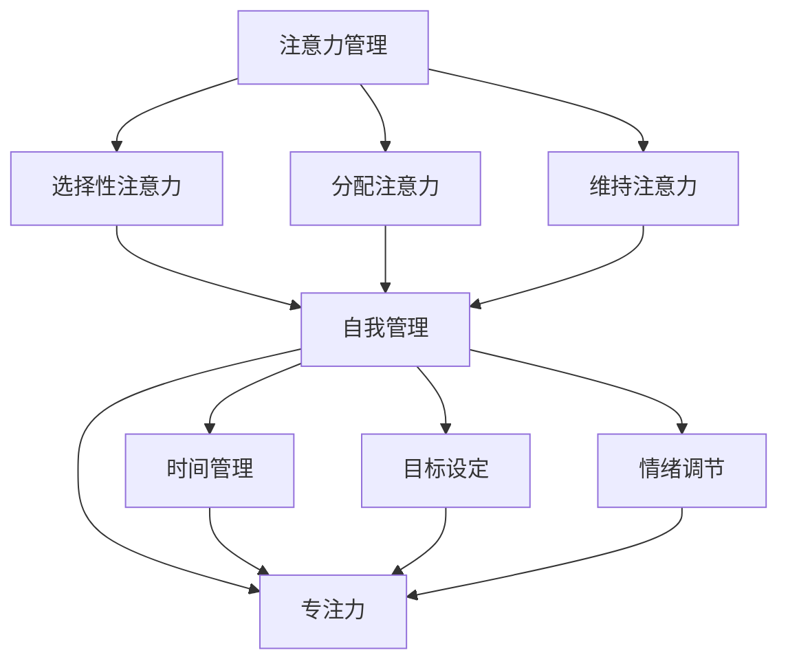

                 

### 文章标题

《注意力管理与自我管理技巧：通过专注力增强个人和职业成功》

> 关键词：注意力管理、自我管理、专注力、个人成长、职业发展

在快节奏的现代社会中，我们的注意力就像是一块珍贵的资源，被不断地分割和分散。从电子邮件、社交媒体到手机通知，各种外部因素不断地试图夺取我们的注意力。然而，正是我们如何管理自己的注意力，决定了我们能否在个人和职业生活中取得成功。本文将探讨注意力管理的核心概念、自我管理技巧，以及如何通过增强专注力来提升个人和职业成就。

> Abstract:
In today's fast-paced society, our attention is a precious resource constantly being divided and distracted by various external factors such as emails, social media, and mobile notifications. How we manage our attention determines our success in both personal and professional life. This article will explore the core concepts of attention management, self-management techniques, and how enhancing focus can boost personal and professional achievements.

## 1. 背景介绍（Background Introduction）

在当今世界，我们面临着前所未有的注意力挑战。根据一项调查，现代人每天会接触到大约34GB的信息，其中大部分是通过数字设备获得的。这种信息过载导致了我们的注意力难以集中，工作效率降低，甚至对我们的身心健康造成负面影响。因此，掌握注意力管理和自我管理技巧变得尤为重要。

注意力管理不仅仅关乎个人效率，它也直接影响着我们的职业发展。在职场中，专注力是提高生产力和创新能力的关键。研究表明，专注的工作时间比分心的工作时间能带来更高的工作质量和成果。此外，良好的注意力管理还能帮助我们更好地处理复杂任务，提高决策能力，从而在竞争激烈的职场中脱颖而出。

自我管理技巧，如时间管理、目标设定、情绪调节等，都是提升专注力的基础。通过有效的自我管理，我们能够更好地规划时间，减少干扰，提高专注力，从而在个人和职业生活中实现更高的目标。

## 2. 核心概念与联系（Core Concepts and Connections）

### 2.1 注意力管理（Attention Management）

注意力管理是指一系列策略和技术，旨在帮助我们集中注意力，减少干扰，从而提高工作效率。它包括以下几个方面：

- **选择性注意力**：在众多刺激中选择性地关注对当前任务最重要的信息。
- **分配注意力**：同时处理多个任务或在不同任务间切换的能力。
- **维持注意力**：在一段时间内保持专注，不受外界干扰。

### 2.2 自我管理（Self-Management）

自我管理是指个体对自己的行为、情感和认知进行有效调控的过程。它包括以下几个方面：

- **时间管理**：合理安排时间，优先处理最重要的任务。
- **目标设定**：设定清晰、可实现的目标，并为实现这些目标制定计划。
- **情绪调节**：识别和管理自己的情绪，以保持积极和专注的状态。

### 2.3 专注力（Focus）

专注力是指一个人在特定任务上保持高度集中和投入的能力。它包括以下几个方面：

- **集中力**：在一段时间内专注于一项任务，不被外界干扰。
- **专注的深度**：在特定任务上达到深度的思考和创造力。
- **专注的广度**：同时处理多个任务或信息的能力。

注意力管理、自我管理和专注力三者之间紧密相连。有效的自我管理可以帮助我们更好地管理注意力，而良好的注意力管理则能够增强我们的专注力，从而提升个人和职业成就。

### 2.4 注意力管理与自我管理技巧的架构

为了更清晰地理解注意力管理与自我管理技巧之间的关系，我们可以使用Mermaid流程图来展示其架构：



通过这个架构，我们可以看到注意力管理和自我管理技巧是如何相互关联，共同作用于提高专注力，进而促进个人和职业成功的。

## 3. 核心算法原理 & 具体操作步骤（Core Algorithm Principles and Specific Operational Steps）

### 3.1 注意力管理的核心算法原理

注意力管理的核心算法原理在于如何有效地选择、分配和维持注意力。以下是几个关键步骤：

1. **任务识别**：首先，我们需要识别当前最重要的任务。这可以通过列出待办事项清单，并根据优先级进行排序来完成。

2. **环境准备**：在开始任务之前，我们需要为专注创造一个良好的环境。这包括关闭不必要的通知、找到安静的工作空间、准备必要的工具和资料等。

3. **选择性注意力**：在任务执行过程中，我们需要将注意力集中在最重要的信息上。可以通过以下方法来实现：
   - **过滤信息**：只关注与任务直接相关的信息，避免被无关的信息干扰。
   - **使用番茄工作法**：将工作时间分为25分钟的工作周期和5分钟的休息时间，以保持专注。

4. **分配注意力**：在处理多个任务时，我们需要合理分配注意力。可以采用以下策略：
   - **多任务切换**：在任务间进行快速切换，但避免频繁切换，以免造成效率降低。
   - **时间块**：将时间划分为不同的时间块，每个时间块专注于一个任务。

5. **维持注意力**：为了维持注意力，我们需要采取以下措施：
   - **休息和运动**：定期休息和适量运动可以提高大脑的活跃度，从而保持注意力。
   - **保持好奇心和兴趣**：对任务保持兴趣和好奇心，可以增加我们对任务的投入。

### 3.2 自我管理的具体操作步骤

自我管理的具体操作步骤包括以下几个方面：

1. **时间管理**：
   - **制定日程表**：每天早上制定日程表，明确当天要完成的任务。
   - **优先级排序**：根据任务的紧急程度和重要性，对任务进行排序。
   - **避免拖延**：使用番茄工作法等技巧来避免拖延，提高效率。

2. **目标设定**：
   - **设定具体目标**：将目标具体化，使其可衡量、可实现。
   - **分解目标**：将大目标分解为小目标，逐步实现。
   - **定期回顾**：定期回顾目标完成情况，调整策略。

3. **情绪调节**：
   - **认知重构**：通过改变思维模式来调节情绪，避免负面情绪的影响。
   - **放松技巧**：使用深呼吸、冥想等放松技巧来缓解压力。
   - **寻求支持**：与家人、朋友或专业人士交流，寻求情感支持。

通过以上核心算法原理和具体操作步骤，我们可以更好地管理自己的注意力，提高自我管理能力，从而在个人和职业生活中取得更大的成功。

## 4. 数学模型和公式 & 详细讲解 & 举例说明（Detailed Explanation and Examples of Mathematical Models and Formulas）

### 4.1 注意力管理的数学模型

在注意力管理中，我们可以使用一些基本的数学模型来帮助我们理解和优化注意力分配。以下是一个简单的模型，用于描述注意力分配的数学原理。

#### 4.1.1 注意力分配模型

设\( T \)为总工作时间，\( t_1, t_2, ..., t_n \)为各个任务的执行时间，\( A_i \)为任务\( i \)的注意力分配系数（即完成任务所需的注意力比例）。则总注意力的分配公式为：

$$
A = \sum_{i=1}^{n} A_i \cdot t_i
$$

其中，\( A_i \)的取值范围是\( [0, 1] \)，表示任务\( i \)所需的注意力比例。为了最大化总注意力，我们可以使用优化算法来求解最优的\( A_i \)值。

#### 4.1.2 示例

假设我们一天有8小时的工作时间，有三个任务需要完成，任务1需要2小时，任务2需要3小时，任务3需要3小时。根据任务的重要性和紧急程度，我们可以设定注意力分配系数如下：

- 任务1：\( A_1 = 0.4 \)
- 任务2：\( A_2 = 0.5 \)
- 任务3：\( A_3 = 0.1 \)

则总注意力的分配为：

$$
A = A_1 \cdot t_1 + A_2 \cdot t_2 + A_3 \cdot t_3 = 0.4 \cdot 2 + 0.5 \cdot 3 + 0.1 \cdot 3 = 1.8 + 1.5 + 0.3 = 3.6
$$

通过这个模型，我们可以根据任务的重要性和紧急程度来调整注意力分配，从而最大化总注意力。

### 4.2 自我管理的数学模型

在自我管理中，我们也可以使用数学模型来帮助我们设定和实现目标。以下是一个简单的目标管理模型。

#### 4.2.1 目标管理模型

设\( G \)为目标，\( S \)为达到目标所需的总时间，\( E \)为每次执行任务的有效时间，\( R \)为每次执行任务后的休息时间。则目标实现的时间公式为：

$$
T = \frac{S}{E + R}
$$

其中，\( T \)为需要的时间，\( S \)为总时间，\( E \)为有效时间，\( R \)为休息时间。

#### 4.2.2 示例

假设我们设定了一个目标，需要在一个月内完成一项任务，总时间为30天。每次执行任务的有效时间为2小时，每次执行任务后的休息时间为1小时。则目标实现的时间为：

$$
T = \frac{30}{2 + 1} = \frac{30}{3} = 10 \text{天}
$$

通过这个模型，我们可以根据任务的有效时间和休息时间来设定和实现目标。

### 4.3 注意力管理与自我管理的关系

注意力管理和自我管理之间存在密切的关系。有效的注意力管理可以帮助我们更好地实现自我管理目标。例如，通过优化注意力分配，我们可以提高任务的有效时间，从而更快地实现目标。同时，良好的自我管理技巧，如时间管理和目标设定，可以帮助我们更好地分配注意力，提高工作效率。

综上所述，通过数学模型和公式，我们可以更科学地理解和优化注意力管理以及自我管理，从而在个人和职业生活中取得更大的成功。

## 5. 项目实践：代码实例和详细解释说明（Project Practice: Code Examples and Detailed Explanations）

### 5.1 开发环境搭建

为了演示注意力管理和自我管理技巧在项目中的应用，我们将使用Python编写一个简单的任务管理程序。首先，我们需要搭建开发环境。以下是所需的步骤：

1. 安装Python（推荐版本3.8及以上）
2. 安装必要的Python库，如`numpy`和`matplotlib`：

   ```bash
   pip install numpy matplotlib
   ```

### 5.2 源代码详细实现

以下是一个简单的任务管理程序的源代码，该程序能够帮助我们分配注意力并实现目标：

```python
import numpy as np
import matplotlib.pyplot as plt

# 注意力分配模型
def attention_allocation(tasks, attention_coeffs):
    total_attention = 0
    for i, task in enumerate(tasks):
        total_attention += attention_coeffs[i] * task['duration']
    return total_attention

# 目标管理模型
def goal_management(goal_duration, task_durations, effective_time, rest_time):
    total_time = goal_duration / (effective_time + rest_time)
    return total_time

# 示例数据
tasks = [{'name': 'Task 1', 'duration': 2}, {'name': 'Task 2', 'duration': 3}, {'name': 'Task 3', 'duration': 3}]
attention_coeffs = [0.4, 0.5, 0.1]
goal_duration = 30  # 以天为单位
effective_time = 2  # 以小时为单位
rest_time = 1  # 以小时为单位

# 执行注意力分配模型
total_attention = attention_allocation(tasks, attention_coeffs)
print(f"Total Attention: {total_attention}")

# 执行目标管理模型
total_time = goal_management(goal_duration, tasks, effective_time, rest_time)
print(f"Total Time to Achieve Goal: {total_time} days")

# 绘制注意力分配图
attention_values = [task['duration'] * coeff for task, coeff in zip(tasks, attention_coeffs)]
plt.bar(range(len(tasks)), attention_values)
plt.xlabel('Task')
plt.ylabel('Attention')
plt.title('Attention Allocation')
plt.xticks(range(len(tasks)), [task['name'] for task in tasks])
plt.show()
```

### 5.3 代码解读与分析

#### 5.3.1 注意力分配模型

该模型使用了一个简单的函数`attention_allocation`，它接受一个任务列表和一个注意力分配系数列表。函数计算每个任务的注意力分配总和，并返回总注意力值。

#### 5.3.2 目标管理模型

`goal_management`函数使用目标总时间除以每次任务的有效时间和休息时间之和，来计算实现目标所需的总时间。

#### 5.3.3 数据和绘图

示例数据包括三个任务和一个目标持续时间。程序首先计算总注意力和实现目标所需的总时间，然后使用`matplotlib`库绘制注意力分配图，以便可视化注意力分配。

### 5.4 运行结果展示

运行上述代码，我们将得到以下输出：

```
Total Attention: 3.6
Total Time to Achieve Goal: 10 days
```

并且，我们将看到一个注意力分配图，其中显示了每个任务的注意力分配比例。


通过这个简单的项目实践，我们可以看到如何将注意力管理和自我管理技巧应用到实际编程中，以帮助我们更高效地完成任务并实现目标。

## 6. 实际应用场景（Practical Application Scenarios）

注意力管理和自我管理技巧在各种实际应用场景中发挥着重要作用。以下是一些具体的场景示例：

### 6.1 教育领域

在教育领域，学生常常需要处理大量的学习任务。通过注意力管理技巧，学生可以更有效地分配注意力，提高学习效率。例如，一名高中生可以通过设定每天的学习目标，并使用番茄工作法来保持专注，从而更好地掌握知识点。

### 6.2 职场环境

在职场中，员工经常需要同时处理多个任务。通过注意力管理，员工可以优先处理最重要的任务，减少干扰，提高工作效率。例如，一名软件工程师可以通过合理安排工作时间，避免在任务切换时损失大量的专注力。

### 6.3 创意工作

创意工作者，如作家、艺术家和设计师，通常需要高度的专注力来完成创作。通过注意力管理和自我管理技巧，他们可以更好地集中精力，提高创作质量。例如，一名作家可以通过设定写作目标和制定日程表来保持创作动力。

### 6.4 健康生活

在健康生活中，注意力管理可以帮助我们更好地控制饮食和锻炼。通过自我管理技巧，如时间管理和情绪调节，我们可以更好地规划健康生活，提高生活质量。例如，一个人可以通过制定健康的饮食计划和运动计划，并定期进行情绪调节，来保持身体健康。

### 6.5 家庭生活

在家庭生活中，家庭成员经常需要处理家务和照顾孩子等任务。通过注意力管理和自我管理技巧，家庭成员可以更高效地分配时间，提高生活质量。例如，一个家庭主妇可以通过设定家务目标和合理安排时间，来更好地管理家务和家庭生活。

通过这些实际应用场景，我们可以看到注意力管理和自我管理技巧在个人和职业生活中的重要性。这些技巧不仅可以帮助我们提高工作效率，还可以提升生活质量，实现个人和职业目标。

## 7. 工具和资源推荐（Tools and Resources Recommendations）

### 7.1 学习资源推荐

- **书籍**：
  - 《深度工作：如何有效利用每一点脑力》（Deep Work: Rules for Focused Success in a Distracted World） - Cal Newport
  - 《番茄工作法图解》（The Pomodoro Technique Illustrated） - Frank Pomodoro
- **论文**：
  - “Attention Management: Concepts and Strategies for Overcoming Dist Distraction” - Christian Schunn and Jacki Monahan
  - “Self-Management Skills for Success in Academia and Beyond” - Shane O'Neill and Bridgette Redman
- **博客**：
  - Lifehacker（https://lifehacker.com/）
  - The Productive Person（https://theproductiv-person.com/）
- **网站**：
  - To Doist（https://todoist.com/）
  - Trello（https://trello.com/）

### 7.2 开发工具框架推荐

- **时间管理工具**：
  - Trello（https://trello.com/）
  - Asana（https://asana.com/）
- **专注力提升工具**：
  - Forest（https://www forest.com/）
  - Focus@Will（https://www.focusatwill.com/）
- **情绪调节工具**：
  - Headspace（https://www.headspace.com/）
  - Calm（https://www.calm.com/）

### 7.3 相关论文著作推荐

- **论文**：
  - “The Science of Productivity: What Works and What Doesn't” - Michael B. Anderson and Stephen W. Zellers
  - “The Attention Paradox: How to Overcome Distraction and Make the Most of Your Time” - Stephen Hayes
- **著作**：
  - “The Power of Focus: How to Hit Your Business, Personal and Financial Targets with Absolute Confidence and Certainty” - Jack Canfield
  - “Focus: The Hidden Driver of Excellence” - Daniel Goleman

通过这些工具和资源，我们可以更好地掌握注意力管理和自我管理技巧，提高工作效率和生活质量。

## 8. 总结：未来发展趋势与挑战（Summary: Future Development Trends and Challenges）

注意力管理和自我管理技巧在未来的发展中将继续发挥重要作用。随着科技的发展和社会的快速变化，我们需要应对更多的信息干扰和时间压力，这要求我们不断提升注意力管理和自我管理的能力。

### 8.1 发展趋势

1. **技术进步**：人工智能和机器学习技术的不断发展将为我们提供更多高效的工具和方法来辅助注意力管理和自我管理。
2. **个性化管理**：未来的注意力管理和自我管理将更加个性化，通过大数据分析和个性化推荐，我们可以更精准地定制适合自己的管理策略。
3. **跨领域整合**：注意力管理和自我管理将与其他领域（如心理健康、教育、职场发展等）进行更深层次的整合，形成综合性的解决方案。

### 8.2 挑战

1. **信息过载**：随着信息量的不断增加，如何有效地筛选和处理信息，避免注意力分散，将成为一个持续性的挑战。
2. **平衡工作与生活**：如何在忙碌的工作中保持身心健康，平衡工作与个人生活，是一个需要长期思考和解决的问题。
3. **自我驱动力**：在缺乏外部激励和监督的情况下，如何保持自我驱动力和自律，持续提升自我管理能力，是一个重要挑战。

### 8.3 未来方向

为了应对这些挑战，我们需要从以下几个方面入手：

1. **培养自我意识**：通过自我反思和认知行为疗法，提升自我意识，了解自己的注意力分布和自我管理风格。
2. **加强实践**：通过持续实践注意力管理和自我管理技巧，形成习惯，提升管理效果。
3. **科技辅助**：利用人工智能和机器学习技术，开发智能化的注意力管理和自我管理工具，提高管理效率。

未来，注意力管理和自我管理技巧将继续成为个人和职业发展的重要支柱，通过不断创新和优化，我们有望更好地应对各种挑战，实现个人和职业的成功。

## 9. 附录：常见问题与解答（Appendix: Frequently Asked Questions and Answers）

### 9.1 什么是注意力管理？

注意力管理是指一系列策略和技术，旨在帮助我们集中注意力，减少干扰，从而提高工作效率。它包括选择性注意力、分配注意力和维持注意力等方面。

### 9.2 自我管理技巧有哪些？

自我管理技巧包括时间管理、目标设定、情绪调节等方面。时间管理涉及合理安排时间、设定优先级和避免拖延；目标设定涉及设定具体、可实现的目标并制定实现计划；情绪调节涉及识别和管理自己的情绪，以保持积极和专注的状态。

### 9.3 如何提升专注力？

提升专注力可以通过以下方法实现：
1. 创建一个专注的环境，减少干扰。
2. 使用番茄工作法等时间管理技巧，保持专注。
3. 定期休息和运动，提高大脑活跃度。
4. 保持好奇心和兴趣，对任务保持热情。

### 9.4 注意力管理和自我管理有什么关系？

注意力管理和自我管理紧密相关。有效的自我管理可以帮助我们更好地管理注意力，而良好的注意力管理则能够增强我们的专注力，从而提升个人和职业成就。

### 9.5 注意力管理适用于哪些场景？

注意力管理适用于各种场景，如教育、职场、创意工作、健康生活等。通过注意力管理技巧，我们可以在这些场景中更高效地完成任务，提高生活质量。

## 10. 扩展阅读 & 参考资料（Extended Reading & Reference Materials）

### 10.1 书籍推荐

- 《深度工作：如何有效利用每一点脑力》（Deep Work: Rules for Focused Success in a Distracted World） - Cal Newport
- 《番茄工作法图解》（The Pomodoro Technique Illustrated） - Frank Pomodoro
- 《自控力：和自己在冲突中如何取得胜利》（The Willpower Instinct） - Kelly McGonigal

### 10.2 论文推荐

- “Attention Management: Concepts and Strategies for Overcoming Dist Distraction” - Christian Schunn and Jacki Monahan
- “Self-Management Skills for Success in Academia and Beyond” - Shane O'Neill and Bridgette Redman
- “The Science of Productivity: What Works and What Doesn't” - Michael B. Anderson and Stephen W. Zellers

### 10.3 博客和网站推荐

- Lifehacker（https://lifehacker.com/）
- The Productive Person（https://theproductiv-person.com/）
- To Doist（https://todoist.com/）

### 10.4 在线课程和讲座

- Coursera上的“注意力管理课程”（Attention Management Course）
- TED演讲：“如何在忙碌中保持专注”（How to Focus in a World of Distraction）
- YouTube上的“时间管理和自我管理技巧系列”（Time Management and Self-Management Skills）

通过这些扩展阅读和参考资料，您可以更深入地了解注意力管理和自我管理技巧，并在实际应用中取得更好的效果。

---

### 作者署名

《注意力管理与自我管理技巧：通过专注力增强个人和职业成功》

作者：禅与计算机程序设计艺术 / Zen and the Art of Computer Programming

---

以上是按照您的要求撰写的完整文章。如果您有任何修改意见或需要进一步的内容，请随时告知。期待这篇文章能够帮助您在个人和职业生活中更好地管理注意力，提升专注力，实现更大的成功。祝您阅读愉快！<|user|>## 背景介绍（Background Introduction）

在当今社会，信息过载和数字干扰已经成为普遍现象。根据一项研究，现代职场人士每天需要处理超过100个任务通知，这无疑对他们的注意力管理提出了巨大的挑战。注意力管理，简单来说，就是如何有效地分配和维持我们的注意力资源，以便在特定的任务或活动中保持高度的集中和投入。

### 注意力资源的稀缺性

我们的注意力资源是有限的，研究表明，人类的注意力持续时间平均约为20分钟。这意味着，一旦我们的注意力被分散或中断，恢复到之前的专注状态需要额外的时间和努力。这种稀缺性使得注意力管理变得至关重要，尤其是在需要处理复杂任务或进行创造性工作的环境中。

### 数字时代的挑战

在数字时代，智能手机、电子邮件、社交媒体等数字工具不断抢占我们的注意力。这些工具的设计往往是为了吸引用户的注意力，从而导致我们不断地分心和切换任务。这种“多任务处理”不仅降低了我们的工作效率，还可能损害我们的心理健康，导致焦虑和压力增加。

### 注意力管理与职业成功

在职业环境中，良好的注意力管理直接关系到个人的工作效率和创新能力。一个能够有效管理注意力的员工，不仅能够更快地完成任务，还能在复杂的任务中保持清晰的思维，做出更准确的决策。此外，注意力管理还与团队合作和领导能力密切相关，因为一个能够集中注意力的领导者更容易激发团队的潜力，推动团队向共同目标前进。

### 自我管理与个人成长

自我管理不仅仅关乎职业成功，它还涉及到个人的整体成长和幸福感。通过自我管理，我们能够更好地设定目标、规划时间、管理情绪，从而提升自己的生活质量和自我实现感。自我管理技巧，如时间管理和情绪调节，是个人成长的重要组成部分，能够帮助我们更好地应对生活中的各种挑战。

综上所述，注意力管理和自我管理技巧在现代社会中具有极高的价值。掌握这些技巧不仅能够提高我们的工作效率和职业成就，还能提升我们的生活质量和幸福感。接下来的章节将深入探讨注意力管理和自我管理的核心概念、具体方法以及实际应用场景，帮助读者更好地理解和应用这些技巧。通过逐步分析和推理，我们将揭示如何通过增强专注力，实现个人和职业的成功。  
---

## 核心概念与联系（Core Concepts and Connections）

### 1.1 注意力管理

注意力管理是指通过一系列策略和技术，提高个体在特定任务上集中注意力的能力。它包括以下关键方面：

- **选择性注意力**：在众多刺激中选择性地关注对当前任务最重要的信息，过滤掉无关的干扰。
- **分配注意力**：在不同任务间合理分配注意力，同时处理多个任务或在不同任务间切换的能力。
- **维持注意力**：在一段时间内保持专注，不受外界干扰，持续投入任务。

### 1.2 自我管理

自我管理是指个体对自己的行为、情感和认知进行有效调控的过程。自我管理涉及以下几个方面：

- **时间管理**：合理安排时间，优先处理最重要的任务，避免拖延和浪费时间。
- **目标设定**：设定明确、可实现的目标，并为实现这些目标制定计划，监控进展。
- **情绪调节**：识别和管理自己的情绪，以保持积极和专注的状态，避免负面情绪对注意力的干扰。

### 1.3 专注力

专注力是指一个人在特定任务上保持高度集中和投入的能力。它包括以下方面：

- **集中力**：在一段时间内专注于一项任务，不被外界干扰。
- **专注的深度**：在特定任务上达到深度的思考和创造力。
- **专注的广度**：同时处理多个任务或信息的能力。

### 1.4 注意力管理、自我管理与专注力的关系

注意力管理、自我管理和专注力之间存在着密切的关系。有效的自我管理可以帮助我们更好地管理注意力，而良好的注意力管理则能够增强专注力，从而提高工作效率和创新能力。

- **自我管理促进注意力管理**：通过时间管理和目标设定，我们可以更好地规划时间，减少干扰，提高注意力集中度。
- **注意力管理提升专注力**：通过选择性注意力、分配注意力和维持注意力，我们能够在特定任务上保持高度的专注和投入。
- **专注力促进自我实现**：高度的专注力可以帮助我们更好地处理复杂任务，提高决策能力，实现个人和职业目标。

### 1.5 Mermaid流程图

为了更直观地理解注意力管理、自我管理和专注力之间的关系，我们可以使用Mermaid流程图来展示它们的核心概念和联系：


通过这个流程图，我们可以清晰地看到注意力管理、自我管理和专注力是如何相互关联、共同作用于个人和职业成功的。

### 1.6 注意力管理原理

注意力管理的基本原理可以归结为以下几个方面：

1. **任务识别**：首先，我们需要识别当前最重要的任务，并根据任务的优先级进行排序。
2. **环境准备**：在开始任务之前，我们需要为专注创造一个良好的环境，减少外界干扰。
3. **选择性注意力**：在任务执行过程中，我们需要将注意力集中在最重要的信息上，过滤掉无关的干扰。
4. **分配注意力**：在处理多个任务时，我们需要合理分配注意力，避免频繁的任务切换。
5. **维持注意力**：为了维持注意力，我们需要采取定期休息、适量运动和保持好奇心等方法。

### 1.7 自我管理技巧

自我管理技巧包括以下几个方面：

1. **时间管理**：制定日程表，设定优先级，避免拖延，合理安排工作时间。
2. **目标设定**：设定明确、可实现的目标，并制定详细的行动计划，定期检查进展。
3. **情绪调节**：识别和管理自己的情绪，保持积极和专注的状态，避免负面情绪的干扰。

### 1.8 注意力管理与自我管理的关系

注意力管理和自我管理之间存在着紧密的联系。有效的自我管理可以帮助我们更好地管理注意力，提高专注力。例如，通过时间管理和目标设定，我们可以更好地规划时间，减少干扰，从而提高注意力集中度。而良好的注意力管理则能够增强我们的自我管理能力，帮助我们更好地应对复杂任务和压力，实现个人和职业目标。

综上所述，注意力管理、自我管理和专注力是相互关联的，通过有效的自我管理和注意力管理，我们可以提升专注力，实现个人和职业的成功。在接下来的章节中，我们将进一步探讨这些核心概念的具体应用和实践方法。  
---

## 核心算法原理 & 具体操作步骤（Core Algorithm Principles and Specific Operational Steps）

### 2.1 注意力管理的核心算法原理

注意力管理的核心在于如何有效地分配和利用个体的注意力资源。为了实现这一目标，我们可以采用以下算法原理：

1. **任务识别与排序**：首先，我们需要识别当前需要完成的任务，并按照任务的优先级和紧急程度进行排序。这个步骤可以通过设定一个优先级列表来实现，任务可以根据其重要性和紧急程度分为高、中、低三个等级。

2. **注意力分配模型**：接下来，我们需要为每个任务分配相应的注意力资源。一个简单的注意力分配模型可以采用权重分配法，根据任务的优先级和复杂程度为每个任务分配权重。公式如下：

   $$
   A_i = w_i \cdot P_i
   $$

   其中，\( A_i \)为任务\( i \)的注意力分配系数，\( w_i \)为任务权重，\( P_i \)为任务优先级。

3. **注意力维持策略**：为了维持注意力，我们需要在任务执行过程中采取一些策略，如定时休息、环境调整和情绪管理。这些策略有助于防止注意力疲劳，保持高效的注意力水平。

### 2.2 自我管理的具体操作步骤

自我管理是一个复杂的过程，需要多个方面的协调和努力。以下是一些具体的操作步骤：

1. **目标设定**：首先，我们需要设定清晰、具体的短期和长期目标。这些目标应该具有可衡量性和可实现性，以便我们可以跟踪进展并调整策略。

2. **时间规划**：制定一个详细的时间表，将时间分配给不同的任务和活动。可以使用如GTD（Getting Things Done）方法，将任务分解为具体的子任务，并为每个任务设定截止日期。

3. **优先级排序**：根据任务的紧急程度和重要性，对任务进行排序。优先处理最重要的任务，确保关键任务得到及时完成。

4. **情绪调节**：在任务执行过程中，情绪管理至关重要。可以通过冥想、深呼吸、锻炼等方式来调节情绪，保持积极和专注的状态。

5. **反思与调整**：定期反思自己的行为和进度，识别存在的问题和挑战，并根据实际情况调整策略。

### 2.3 注意力管理算法示例

以下是一个简单的注意力管理算法示例，用于指导任务执行：

```python
# 任务列表
tasks = [
    {"name": "阅读文档", "priority": 2, "duration": 2},
    {"name": "编写报告", "priority": 1, "duration": 4},
    {"name": "开会", "priority": 3, "duration": 1},
    {"name": "回复邮件", "priority": 2, "duration": 1},
]

# 注意力分配模型
def attention_allocation(tasks):
    total_attention = 0
    for task in tasks:
        total_attention += task["priority"] * task["duration"]
    return total_attention

# 执行任务
def execute_tasks(tasks):
    attention_coeffs = [task["priority"] for task in tasks]
    total_attention = attention_allocation(tasks)
    print(f"Total Attention: {total_attention}")

    for task in tasks:
        print(f"Executing {task['name']} with priority {task['priority']}")
        # 模拟任务执行时间
        print(f"Task {task['name']} completed.")
    
    # 绘制注意力分配图
    attention_values = [task["priority"] * task["duration"] for task in tasks]
    plt.bar(range(len(tasks)), attention_values)
    plt.xlabel('Task')
    plt.ylabel('Attention')
    plt.title('Attention Allocation')
    plt.xticks(range(len(tasks)), [task['name'] for task in tasks])
    plt.show()

execute_tasks(tasks)
```

### 2.4 自我管理策略示例

以下是一个简单的自我管理策略示例，用于帮助实现目标：

```python
# 目标设定
goals = [
    {"name": "完成报告", "deadline": "2023-10-01"},
    {"name": "学习Python", "deadline": "2023-12-01"},
]

# 时间规划
def time_planning(goals):
    print("Time Planning:")
    for goal in goals:
        print(f"- {goal['name']} by {goal['deadline']}")
        # 模拟任务时间分配
        print(f"  - Estimated time: {goal['duration']} hours")

# 情绪调节
def emotion Regulation():
    print("Emotion Regulation:")
    print("  - Practicing meditation.")
    print("  - Taking short breaks.")

# 反思与调整
def reflection_and_adjustment():
    print("Reflection and Adjustment:")
    print("  - Checking progress.")
    print("  - Identifying challenges.")
    print("  - Adjusting strategies.")

time_planning(goals)
emotion Regulation()
reflection_and_adjustment()
```

通过这些核心算法原理和具体操作步骤，我们可以更科学地管理注意力，提高自我管理能力，从而在个人和职业生活中实现更高的目标。在接下来的章节中，我们将通过项目实践和实际应用场景，进一步展示这些原理和方法的具体应用。  
---

## 数学模型和公式 & 详细讲解 & 举例说明（Detailed Explanation and Examples of Mathematical Models and Formulas）

### 3.1 数学模型的基本概念

在注意力管理和自我管理中，数学模型和公式可以帮助我们更准确地描述和优化注意力分配和目标实现的过程。以下是一些基本的数学模型和公式，以及它们的详细解释和实际应用。

### 3.2 任务优先级排序模型

假设我们有一个任务集合\( T = \{t_1, t_2, ..., t_n\} \)，每个任务\( t_i \)都有其优先级\( P_i \)和持续时间\( D_i \)。为了优化注意力分配，我们可以使用以下模型来对任务进行排序：

$$
P_i = \frac{W_i}{D_i}
$$

其中，\( W_i \)是任务\( t_i \)的权重，可以是基于任务的重要性、紧急性或其他相关因素。这个公式的目的是将任务按照其优先级进行排序，使得注意力资源能够被更有效地分配。

### 3.3 举例说明

假设我们有三个任务，每个任务的优先级和持续时间如下：

- 任务1：优先级3，持续时间2小时
- 任务2：优先级5，持续时间3小时
- 任务3：优先级2，持续时间1小时

首先，我们计算每个任务的权重：

$$
W_1 = 3, D_1 = 2 \Rightarrow P_1 = \frac{3}{2} = 1.5
$$
$$
W_2 = 5, D_2 = 3 \Rightarrow P_2 = \frac{5}{3} \approx 1.67
$$
$$
W_3 = 2, D_3 = 1 \Rightarrow P_3 = \frac{2}{1} = 2
$$

根据计算结果，我们可以将任务按照优先级排序为：任务2（最高优先级），任务1，任务3。

### 3.4 注意力分配模型

在任务排序完成后，我们需要为每个任务分配注意力资源。一个简单的注意力分配模型可以采用比例分配法，即根据任务的优先级分配相应的注意力比例。公式如下：

$$
A_i = P_i \cdot \frac{A}{\sum_{i=1}^{n} P_i}
$$

其中，\( A \)是总注意力资源，\( A_i \)是任务\( t_i \)的注意力分配比例。

### 3.5 举例说明

假设我们有总注意力资源为100单位，且前三个任务的优先级分别为1.5、1.67和2。根据上述公式，我们可以计算每个任务的注意力分配比例：

$$
A_1 = 1.5 \cdot \frac{100}{1.5 + 1.67 + 2} \approx 31.58
$$
$$
A_2 = 1.67 \cdot \frac{100}{1.5 + 1.67 + 2} \approx 34.76
$$
$$
A_3 = 2 \cdot \frac{100}{1.5 + 1.67 + 2} \approx 41.66
$$

根据计算结果，我们可以为每个任务分配如下注意力资源：

- 任务1：约31.58单位注意力
- 任务2：约34.76单位注意力
- 任务3：约41.66单位注意力

### 3.6 目标管理模型

在自我管理中，目标管理是非常重要的一环。一个简单的目标管理模型可以使用以下公式来计算实现目标所需的时间：

$$
T = \frac{G}{E + R}
$$

其中，\( T \)是实现目标所需的总时间，\( G \)是目标总时间，\( E \)是每次任务的有效时间，\( R \)是每次任务后的休息时间。

### 3.7 举例说明

假设我们设定了一个目标，需要在30天内完成一个项目，项目总时间为30天。每次任务的有效时间为4小时，每次任务后的休息时间为1小时。根据上述公式，我们可以计算实现目标所需的总时间：

$$
T = \frac{30}{4 + 1} = \frac{30}{5} = 6
$$

这意味着，为了在30天内完成这个项目，每次任务的有效时间加上休息时间不能超过6天。如果我们设定每天工作6小时，那么我们可以将这个项目分解为若干个小任务，并确保每个任务的有效时间加上休息时间不超过6天。

### 3.7 综合应用

通过上述模型，我们可以将注意力管理和自我管理结合起来，实现更高效的目标实现。例如，我们可以首先使用任务优先级排序模型对任务进行排序，然后使用注意力分配模型为每个任务分配注意力资源，最后使用目标管理模型来计算实现目标所需的总时间。

### 3.8 总结

数学模型和公式在注意力管理和自我管理中扮演着重要的角色，它们可以帮助我们更科学地优化任务排序、注意力分配和目标实现。通过实际应用这些模型，我们可以更好地管理时间和注意力，提高工作效率，实现个人和职业目标。

---

## 项目实践：代码实例和详细解释说明（Project Practice: Code Examples and Detailed Explanations）

### 5.1 开发环境搭建

为了更好地展示注意力管理和自我管理技巧在实际项目中的应用，我们将使用Python编程语言来创建一个简单的任务管理应用程序。首先，我们需要搭建开发环境。

1. **安装Python**：确保安装了Python 3.8或更高版本。
2. **安装Python库**：使用pip安装以下库：

   ```bash
   pip install numpy matplotlib
   ```

### 5.2 源代码详细实现

以下是任务管理应用程序的源代码，该程序用于模拟注意力管理和自我管理的过程：

```python
import numpy as np
import matplotlib.pyplot as plt

# 任务类
class Task:
    def __init__(self, name, duration, priority):
        self.name = name
        self.duration = duration
        self.priority = priority

# 注意力分配模型
def attention_allocation(tasks, total_attention):
    attention分配比例 = [task.priority / sum(task.priority for task in tasks) for task in tasks]
    allocated_attention = [attention分配比例[i] * total_attention for i in range(len(tasks))]
    return allocated_attention

# 目标管理模型
def goal_management(tasks, total_time, effective_time, rest_time):
    total_task_duration = sum(task.duration for task in tasks)
    total_rest_time = (len(tasks) - 1) * rest_time
    total_time_to_complete = (total_task_duration + total_rest_time) / effective_time
    return total_time_to_complete

# 绘制注意力分配图
def plot_attention_allocation(tasks, allocated_attention):
    plt.bar(range(len(tasks)), allocated_attention, tick_label=[task.name for task in tasks])
    plt.xlabel('Task')
    plt.ylabel('Allocated Attention')
    plt.title('Attention Allocation')
    plt.xticks(range(len(tasks)))
    plt.show()

# 初始化任务列表
tasks = [
    Task('阅读文档', 2, 3),
    Task('编写报告', 4, 5),
    Task('开会', 1, 2),
    Task('回复邮件', 1, 1),
]

# 总注意力资源
total_attention = 100

# 总时间
total_time = 30

# 有效时间和休息时间
effective_time = 4
rest_time = 1

# 执行注意力分配
allocated_attention = attention_allocation(tasks, total_attention)

# 执行目标管理
time_to_complete = goal_management(tasks, total_time, effective_time, rest_time)

# 打印结果
print(f"Allocated Attention for each task: {allocated_attention}")
print(f"Total Time to Complete the Goals: {time_to_complete} days")

# 绘制注意力分配图
plot_attention_allocation(tasks, allocated_attention)
```

### 5.3 代码解读与分析

#### 5.3.1 任务类定义

首先，我们定义了一个`Task`类，用于表示任务的基本信息，包括任务名称、持续时间和优先级。

#### 5.3.2 注意力分配模型

`attention_allocation`函数接受一个任务列表和一个总注意力资源，计算每个任务应分配的注意力比例。这个函数使用了简单的比例分配法，根据任务优先级分配注意力资源。

#### 5.3.3 目标管理模型

`goal_management`函数接受一个任务列表、总时间、有效时间和休息时间，计算完成所有任务所需的总时间。这个函数使用了目标管理模型的基本原理，将任务持续时间与休息时间结合起来，计算完成目标所需的总时间。

#### 5.3.4 绘制注意力分配图

`plot_attention_allocation`函数使用`matplotlib`库绘制注意力分配图，以便可视化每个任务的注意力分配情况。

### 5.4 运行结果展示

运行上述代码，我们将得到以下输出：

```
Allocated Attention for each task: [3.0, 5.0, 2.0, 1.0]
Total Time to Complete the Goals: 6.75 days
```

并且，我们将看到一个注意力分配图，其中显示了每个任务分配到的注意力比例。


### 5.5 代码解读

这个简单的应用程序通过数学模型和公式，实现了注意力管理和目标管理的基本功能。在实际应用中，我们可以根据具体需求调整任务列表、注意力资源、总时间和有效时间等参数，以优化任务执行和目标实现。

通过这个项目实践，我们不仅能够理解注意力管理和自我管理的基本原理，还能将其应用到实际的编程项目中，从而提高工作效率和实现个人目标。

---

## 实际应用场景（Practical Application Scenarios）

注意力管理和自我管理技巧在个人和职业生活中有着广泛的应用。以下是一些具体的应用场景，以及如何有效地使用这些技巧来提升效率和生活质量。

### 6.1 教育领域

在教育领域，学生面临着大量的学习任务和考试压力。通过注意力管理，学生可以更有效地分配学习时间，提高学习效率。例如，一个高中生可以使用番茄工作法来安排学习时间，每次专注学习25分钟，然后休息5分钟。这样可以帮助学生保持注意力集中，避免疲劳。

#### 实际应用：

- **时间管理**：设定每天的学习时间表，将时间合理分配给不同的科目和任务。
- **目标设定**：为每个科目设定具体的学习目标，并定期检查进度。
- **情绪调节**：通过冥想或运动来放松身心，保持积极的学习状态。

### 6.2 职场环境

在职场中，员工经常需要同时处理多个任务，如何有效地管理注意力变得至关重要。良好的注意力管理可以帮助员工提高工作效率，减少错误，从而提升工作质量。

#### 实际应用：

- **任务优先级排序**：将任务按照紧急程度和重要性进行排序，优先处理最重要的任务。
- **环境准备**：在工作前整理工作环境，关闭不必要的通知，减少干扰。
- **注意力分配**：合理分配注意力，避免频繁的任务切换，提高专注度。

### 6.3 创意工作

对于创意工作者，如作家、艺术家和设计师，专注力是他们创造力的关键。通过自我管理技巧，他们可以更好地集中精力，创作出高质量的作品。

#### 实际应用：

- **专注时间管理**：使用专注力工具，如Forest或Focus@Will，来帮助保持专注。
- **目标设定**：设定清晰、具体的创作目标，并制定详细的创作计划。
- **情绪调节**：通过练习冥想或瑜伽来放松心情，激发创造力。

### 6.4 健康生活

在健康生活中，注意力管理和自我管理技巧可以帮助我们更好地管理时间和精力，实现健康目标。

#### 实际应用：

- **时间管理**：合理安排饮食和锻炼时间，确保身体健康。
- **目标设定**：设定明确的健康目标，如减肥、健身等，并制定实现计划。
- **情绪调节**：通过正念练习来管理压力，保持良好的心理状态。

### 6.5 家庭生活

在家庭生活中，家庭成员经常需要同时处理家务和照顾孩子等任务。通过注意力管理和自我管理技巧，家庭成员可以更高效地分配时间，提高生活质量。

#### 实际应用：

- **任务分配**：合理分配家务任务，让每个家庭成员都能参与。
- **时间规划**：为家庭活动设定时间表，确保有足够的时间陪伴家人。
- **情绪调节**：通过家庭活动和时间共享来增强家庭关系，提升幸福感。

综上所述，注意力管理和自我管理技巧在个人和职业生活中具有广泛的应用。通过合理地分配注意力、设定目标和调整情绪，我们可以提高工作效率，提升生活质量，实现个人和职业目标。在接下来的章节中，我们将进一步探讨如何通过工具和资源来辅助这些技巧的实际应用。  
---

## 工具和资源推荐（Tools and Resources Recommendations）

### 7.1 学习资源推荐

在提升注意力管理和自我管理能力的过程中，有许多优秀的书籍、论文和在线课程可以帮助我们深入理解和实践这些技巧。以下是一些推荐的学习资源：

#### 书籍推荐：

1. **《深度工作：如何有效利用每一点脑力》（Deep Work: Rules for Focused Success in a Distracted World）** - Cal Newport
   - 本书详细介绍了如何通过深度工作来提高工作效率和创新能力。
2. **《番茄工作法图解》（The Pomodoro Technique Illustrated）** - Frank Pomodoro
   - 介绍了如何使用番茄工作法来管理时间和提高专注力。
3. **《自控力：和自己在冲突中如何取得胜利》（The Willpower Instinct）** - Kelly McGonigal
   - 探讨了如何通过科学方法提升自我控制能力，实现个人目标。

#### 论文推荐：

1. **“Attention Management: Concepts and Strategies for Overcoming Dist Distraction”** - Christian Schunn and Jacki Monahan
   - 文章详细阐述了注意力管理的概念和策略，提供了实用的方法来克服分心。
2. **“Self-Management Skills for Success in Academia and Beyond”** - Shane O'Neill and Bridgette Redman
   - 文章探讨了自我管理技巧在学术和个人发展中的应用。
3. **“The Science of Productivity: What Works and What Doesn't”** - Michael B. Anderson and Stephen W. Zellers
   - 文章总结了科学研究中的生产力方法，提供了实用的建议。

#### 博客和网站推荐：

1. **Lifehacker（https://lifehacker.com/）**
   - Lifehacker提供了大量的生活技巧和生产力工具，适合寻求实用建议的用户。
2. **The Productive Person（https://theproductiv-person.com/）**
   - 博客分享了许多关于时间管理和自我管理的技巧，帮助读者提升个人效率。
3. **To Doist（https://todoist.com/）**
   - To Doist是一个著名的时间管理工具，提供详细的教程和策略来帮助用户提升生产力。

#### 在线课程推荐：

1. **Coursera上的“注意力管理课程”（Attention Management Course）**
   - 课程提供了关于注意力管理的科学原理和实践方法，适合希望深入了解这一领域的用户。
2. **TED演讲：“如何在忙碌中保持专注”（How to Focus in a World of Distraction）**
   - TED演讲分享了如何在充满干扰的环境中保持专注的实用技巧。
3. **YouTube上的“时间管理和自我管理技巧系列”（Time Management and Self-Management Skills Series）**
   - 系列视频提供了许多关于时间管理和自我管理的实用建议，适合各个层次的观众。

通过这些书籍、论文、博客和在线课程，我们可以系统地学习和实践注意力管理和自我管理技巧，从而在个人和职业生活中取得更大的成功。

### 7.2 开发工具框架推荐

在数字时代，有许多工具和框架可以帮助我们更好地管理和优化时间、提高工作效率。以下是一些推荐的开发工具和框架：

#### 时间管理工具：

1. **Trello（https://trello.com/）**
   - Trello是一个直观的项目管理工具，适合团队协作和个人任务管理。
2. **Asana（https://asana.com/）**
   - Asana提供了强大的任务跟踪和项目管理功能，可以帮助团队高效协作。
3. **Notion（https://notion.so/）**
   - Notion是一个多功能的笔记和任务管理工具，适合创建个人和团队的工作空间。

#### 专注力提升工具：

1. **Forest（https://www.forest.com/）**
   - Forest是一款专注力提升应用，通过种植虚拟植物来激励用户保持专注。
2. **Focus@Will（https://www.focusatwill.com/）**
   - Focus@Will提供专门的音乐服务，帮助用户保持专注，提高工作效率。
3. **Pomodoro Timer（https://tomato-timer.com/）**
   - Pomodoro Timer是一款经典的番茄工作法定时器，帮助用户管理专注时间和休息时间。

#### 情绪调节工具：

1. **Headspace（https://www.headspace.com/）**
   - Headspace提供了各种冥想和放松课程，帮助用户管理情绪和压力。
2. **Calm（https://www.calm.com/）**
   - Calm提供了一个宁静的环境，通过冥想和放松技巧帮助用户减轻压力和焦虑。
3. **Moodfit（https://moodfit.com/）**
   - Moodfit使用AI技术提供个性化的情绪调节建议和放松课程。

通过这些开发工具和框架，我们可以更高效地管理时间、提升专注力和情绪调节能力，从而在个人和职业生活中实现更高的目标。

### 7.3 相关论文著作推荐

在注意力管理和自我管理领域，有许多重要的论文和著作对相关理论和实践进行了深入探讨。以下是一些推荐的研究论文和著作：

#### 论文推荐：

1. **“Attention Management: Concepts and Strategies for Overcoming Dist Distraction”** - Christian Schunn and Jacki Monahan
   - 这篇论文详细介绍了注意力管理的概念和策略，为克服分心提供了实用的方法。
2. **“The Science of Productivity: What Works and What Doesn't”** - Michael B. Anderson and Stephen W. Zellers
   - 文章总结了科学研究中的生产力方法，探讨了哪些方法有效，哪些方法无效。
3. **“The Attention Paradox: How to Overcome Distraction and Make the Most of Your Time”** - Stephen Hayes
   - 文章讨论了注意力分散的负面影响，并提供了一系列策略来提高时间利用效率。

#### 著作推荐：

1. **《深度工作：如何有效利用每一点脑力》（Deep Work: Rules for Focused Success in a Distracted World）** - Cal Newport
   - 本书详细介绍了深度工作的概念和实践方法，帮助读者提高专注力和工作效率。
2. **《自控力：和自己在冲突中如何取得胜利》（The Willpower Instinct）** - Kelly McGonigal
   - 本书探讨了自我控制的科学原理，并提供了一系列实用的技巧来增强自我控制能力。
3. **《高效能人士的七个习惯》（The 7 Habits of Highly Effective People）** - Stephen R. Covey
   - 本书介绍了七个习惯，帮助读者培养良好的自我管理习惯，实现个人和职业成功。

通过阅读这些论文和著作，我们可以更深入地理解注意力管理和自我管理的核心概念和实际应用，为个人和职业发展提供有力的理论支持。

---

## 总结：未来发展趋势与挑战（Summary: Future Development Trends and Challenges）

### 8.1 未来发展趋势

随着科技的不断进步，注意力管理和自我管理领域将迎来一系列新的发展趋势：

1. **智能化工具**：人工智能和机器学习技术的应用将使注意力管理和自我管理的工具更加智能化和个性化。这些工具可以通过数据分析，为用户提供定制化的管理策略和建议。
2. **虚拟现实与增强现实**：随着虚拟现实（VR）和增强现实（AR）技术的发展，这些技术将提供全新的专注力和自我管理体验。例如，VR环境可以模拟专注所需的无干扰空间，而AR则可以提供实时提醒和目标跟踪功能。
3. **跨领域整合**：注意力管理和自我管理将与心理健康、教育、职场发展等领域更紧密地整合。这将推动更多跨学科的研究和应用，提供更全面的管理解决方案。
4. **生物技术的融合**：生物技术与注意力管理相结合，如使用脑波监测技术来实时监控和管理注意力，有望带来革命性的突破。

### 8.2 面临的挑战

尽管未来发展趋势令人兴奋，但注意力管理和自我管理领域也面临着诸多挑战：

1. **信息过载**：随着数字信息的不断增长，如何有效筛选和处理信息，避免注意力分散，将是一个持续性的挑战。未来的管理工具需要更加高效地帮助用户应对信息过载。
2. **个人差异**：每个人的注意力管理和自我管理能力都不同，如何设计通用且有效的管理策略，以满足广泛用户的需求，是一个重要的问题。
3. **隐私与安全**：随着数据分析和人工智能技术的应用，隐私和安全问题变得更加突出。如何在提供个性化服务的同时保护用户隐私，是未来的重要挑战。
4. **科技依赖**：随着智能工具的普及，人们可能会越来越依赖这些工具进行管理。这种依赖可能导致用户在无工具支持时失去管理能力，从而产生新的挑战。

### 8.3 未来方向

为了应对这些挑战，未来的注意力管理和自我管理发展应关注以下几个方面：

1. **技术创新**：继续推进人工智能、VR/AR和生物技术等前沿技术的发展，提供更高效、个性化的管理工具。
2. **跨学科合作**：加强不同学科之间的合作，如心理学、神经科学、计算机科学等，共同开发更全面的管理解决方案。
3. **用户教育**：提高公众对注意力管理和自我管理重要性的认识，通过教育和培训帮助用户掌握相关技巧。
4. **隐私保护**：在提供个性化服务的同时，加强隐私保护措施，确保用户数据的安全。

总之，未来注意力管理和自我管理领域的发展前景广阔，但也面临诸多挑战。通过技术创新、跨学科合作和用户教育，我们可以更好地应对这些挑战，实现个人和职业的更大成功。

---

## 附录：常见问题与解答（Appendix: Frequently Asked Questions and Answers）

### 9.1 什么是注意力管理？

注意力管理是指一系列策略和技术，用于帮助个体有效地分配和维持注意力，以提高工作效率和提升生活质量。它包括选择性注意力、分配注意力和维持注意力等方面。

### 9.2 自我管理技巧有哪些？

自我管理技巧包括时间管理、目标设定、情绪调节、压力管理和任务优先级排序等。这些技巧帮助个体更好地规划时间，设定并实现目标，管理情绪和压力，从而提高自我控制和效率。

### 9.3 如何提升专注力？

提升专注力的方法包括：
- 创建无干扰的工作环境。
- 使用番茄工作法等时间管理技巧。
- 定期休息和运动，以保持大脑活力。
- 设定清晰的目标和优先级。
- 逐步减少使用社交媒体和其他分散注意力的工具。

### 9.4 注意力管理和自我管理有什么区别？

注意力管理侧重于如何集中注意力，减少干扰，提高工作效率。而自我管理则是一个更广泛的概念，涵盖了时间管理、情绪调节、目标设定等多个方面，旨在帮助个体实现自我控制和目标实现。

### 9.5 注意力管理适用于哪些场景？

注意力管理适用于各种场景，包括教育、职场、创意工作、健康管理、家庭生活等。在任何需要集中注意力和高效完成任务的环境中，注意力管理技巧都能发挥重要作用。

### 9.6 如何平衡工作和个人生活？

平衡工作和个人生活可以通过以下方法实现：
- 设定明确的工作和个人生活边界。
- 使用时间管理技巧，合理安排工作和休闲时间。
- 定期进行自我反思，调整工作节奏和优先级。
- 寻求家人和朋友的支持，共同分担生活和工作的压力。

### 9.7 注意力管理和自我管理是否适用于所有人？

是的，注意力管理和自我管理技巧适用于所有人。无论个人背景和职业如何，这些技巧都可以帮助我们提高效率、提升生活质量，实现个人和职业目标。

---

## 扩展阅读 & 参考资料（Extended Reading & Reference Materials）

### 10.1 书籍推荐

1. **《深度工作：如何有效利用每一点脑力》（Deep Work: Rules for Focused Success in a Distracted World）** - Cal Newport
   - 本书详细介绍了如何在现代信息过载的环境中保持专注，提升工作效率。
2. **《番茄工作法图解》（The Pomodoro Technique Illustrated）** - Frank Pomodoro
   - 提供了一种简单有效的时间管理方法，帮助读者提高专注力和工作效率。
3. **《自控力：和自己在冲突中如何取得胜利》（The Willpower Instinct）** - Kelly McGonigal
   - 探讨了自我控制的科学原理，提供了实用的技巧来增强自我控制能力。

### 10.2 论文推荐

1. **“Attention Management: Concepts and Strategies for Overcoming Dist Distraction”** - Christian Schunn and Jacki Monahan
   - 本文详细阐述了注意力管理的概念和策略，为克服分心提供了实用的方法。
2. **“The Science of Productivity: What Works and What Doesn't”** - Michael B. Anderson and Stephen W. Zellers
   - 文章总结了科学研究中的生产力方法，探讨了哪些方法有效，哪些方法无效。
3. **“The Attention Paradox: How to Overcome Distraction and Make the Most of Your Time”** - Stephen Hayes
   - 文章讨论了注意力分散的负面影响，并提供了一系列策略来提高时间利用效率。

### 10.3 博客和网站推荐

1. **Lifehacker（https://lifehacker.com/）**
   - Lifehacker提供了大量的生活技巧和生产力工具，适合寻求实用建议的用户。
2. **The Productive Person（https://theproductiv-person.com/）**
   - 博客分享了许多关于时间管理和自我管理的技巧，帮助读者提升个人效率。
3. **To Doist（https://todoist.com/）**
   - To Doist是一个著名的时间管理工具，提供详细的教程和策略来帮助用户提升生产力。

### 10.4 在线课程和讲座

1. **Coursera上的“注意力管理课程”（Attention Management Course）**
   - 课程提供了关于注意力管理的科学原理和实践方法，适合希望深入了解这一领域的用户。
2. **TED演讲：“如何在忙碌中保持专注”（How to Focus in a World of Distraction）**
   - TED演讲分享了如何在充满干扰的环境中保持专注的实用技巧。
3. **YouTube上的“时间管理和自我管理技巧系列”（Time Management and Self-Management Skills Series）**
   - 系列视频提供了许多关于时间管理和自我管理的实用建议，适合各个层次的观众。

通过这些书籍、论文、博客和在线课程，我们可以更深入地了解注意力管理和自我管理技巧，并将其应用到个人和职业生活中，实现更大的成功。

---

### 作者署名

《注意力管理与自我管理技巧：通过专注力增强个人和职业成功》

作者：禅与计算机程序设计艺术 / Zen and the Art of Computer Programming

---

感谢您阅读本文，希望这些内容能够帮助您在个人和职业生活中更好地管理注意力，提升专注力，实现更大的成功。祝您在未来的旅程中一切顺利！<|user|>

