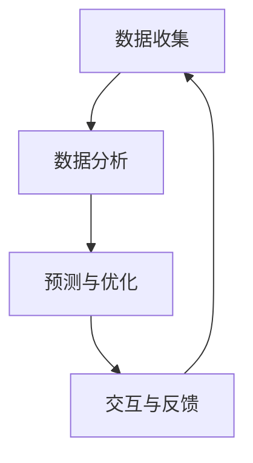
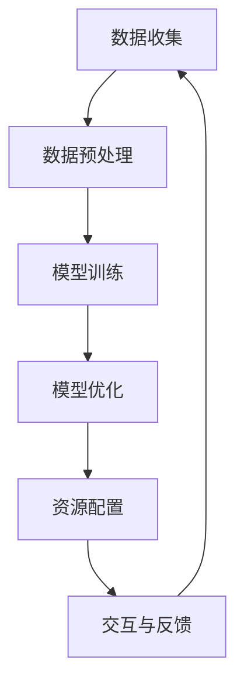

                 

### 文章标题

**注意力经济学前沿：AI驱动的认知资源配置**

### 关键词：

- 注意力经济学（Attention Economics）
- AI驱动的认知资源配置（AI-Driven Cognitive Resource Allocation）
- 人工智能（Artificial Intelligence）
- 认知负荷（Cognitive Load）
- 资源优化（Resource Optimization）
- 用户体验（User Experience）

### 摘要：

随着人工智能技术的迅猛发展，认知资源配置成为提升用户体验和系统效率的关键因素。本文探讨了注意力经济学的前沿研究，重点关注AI如何通过优化认知资源来提升任务执行效率。文章首先介绍了注意力经济学的核心概念，然后详细分析了AI驱动的认知资源配置原理，并通过具体实例展示了其应用场景和效果。最后，文章提出了未来发展趋势和挑战，为相关领域的研究和实际应用提供了有价值的参考。

## 1. 背景介绍（Background Introduction）

随着现代信息技术的迅猛发展，人们面临的信息过载问题日益严重。在日常生活中，从电子邮件到社交媒体，再到各种应用程序的通知，都在不断地分散我们的注意力。这导致了一个新的研究领域——注意力经济学（Attention Economics）的诞生。注意力经济学研究的是在信息过载环境中，如何有效地配置和利用注意力资源，以实现最佳的用户体验和效率。

注意力经济学关注的核心问题是：如何在有限的时间内，将注意力集中到最关键的活动中，以实现最大的效用。这与人工智能（AI）的发展密切相关，因为AI系统可以自动处理大量的数据，并提供个性化的建议和优化方案。因此，AI驱动的认知资源配置成为了一个重要的研究方向，其目标是通过智能化的方式，最大限度地减少用户的认知负荷，提高任务执行效率。

认知负荷（Cognitive Load）是注意力经济学中的一个关键概念。它指的是在执行任务时，大脑需要处理的信息量和工作负荷。高认知负荷会导致注意力分散、效率下降和疲劳感增加。相反，低认知负荷有助于集中注意力，提高任务完成的质量和速度。AI驱动的认知资源配置旨在通过分析和优化认知负荷，实现以下目标：

1. **个性化服务**：根据用户的兴趣、行为和需求，提供个性化的信息和建议，减少用户需要处理的信息量。
2. **自动化任务**：自动化重复性和低价值的任务，减少用户的认知负担。
3. **优化交互**：通过智能化的界面设计和交互方式，降低用户的认知负荷，提高任务执行的流畅性和效率。

本文将围绕注意力经济学和AI驱动的认知资源配置，探讨其核心概念、原理和应用场景。文章将从以下几个方面展开：

1. **注意力经济学的基本原理**：介绍注意力经济学的核心概念和理论基础，包括认知负荷、注意力分配和资源优化等。
2. **AI驱动的认知资源配置原理**：分析AI在认知资源配置中的作用，包括数据收集、分析、预测和优化等步骤。
3. **具体应用实例**：通过实际案例，展示AI驱动的认知资源配置在改善用户体验和效率方面的具体应用。
4. **未来发展趋势与挑战**：探讨注意力经济学和AI驱动的认知资源配置的未来发展方向，以及面临的挑战和解决方案。

通过对这些方面的深入探讨，本文旨在为注意力经济学和AI驱动的认知资源配置的研究和应用提供有价值的参考和启示。

### 2. 核心概念与联系

#### 2.1 注意力经济学的定义与理论基础

注意力经济学是研究人类注意力资源分配和利用的经济学科。其核心概念可以追溯到诺贝尔经济学奖获得者赫伯特·西蒙（Herbert Simon）提出的“有限注意资源”理论。西蒙认为，人类在处理信息时，注意力资源是有限的，这意味着我们无法同时关注所有的信息源。因此，如何有效地分配和利用有限的注意力资源，成为提升工作效率和生活质量的关键。

在注意力经济学中，有两个核心概念：认知负荷（Cognitive Load）和注意力分配（Attention Allocation）。认知负荷指的是在执行任务时，大脑需要处理的信息量和工作负荷。高认知负荷会导致注意力分散、效率下降和疲劳感增加。相反，低认知负荷有助于集中注意力，提高任务完成的质量和速度。注意力分配则是指根据任务的复杂性和优先级，合理地分配注意力资源，确保关键任务得到充分关注。

#### 2.2 AI驱动的认知资源配置

AI驱动的认知资源配置旨在通过智能化的方式，优化人类注意力资源的利用，从而提升任务执行效率和用户体验。这一过程通常包括以下几个关键步骤：

1. **数据收集**：AI系统需要收集大量有关用户行为、兴趣、需求和历史数据。这些数据来源可以是用户的历史记录、社交媒体活动、搜索历史等。

2. **数据分析**：通过对收集到的数据进行深入分析，AI系统可以识别出用户的兴趣点和需求，从而为用户提供个性化的服务和建议。

3. **预测与优化**：基于数据分析结果，AI系统可以预测用户在未来可能需要关注的任务和内容，并提前进行资源配置和优化。

4. **交互与反馈**：AI系统与用户进行实时交互，收集用户反馈，不断调整和优化资源配置策略。

#### 2.3 注意力经济学与AI驱动的认知资源配置的联系

注意力经济学与AI驱动的认知资源配置之间存在紧密的联系。首先，注意力经济学为认知资源配置提供了理论基础，即通过理解认知负荷和注意力分配的原理，可以设计出更有效的资源配置策略。其次，AI技术的引入为认知资源配置提供了强大的工具和手段。通过数据分析和预测模型，AI系统可以自动识别和优化用户的注意力资源，从而实现个性化的资源配置。

#### 2.4 Mermaid 流程图（Mermaid Flowchart）

以下是一个简化的Mermaid流程图，展示了AI驱动的认知资源配置的基本流程：



在这个流程图中，数据收集作为起点，通过数据分析、预测与优化，最终实现交互与反馈，形成一个闭环系统。这个过程不断迭代，以实现持续优化和提升用户体验。

### 3. 核心算法原理 & 具体操作步骤

#### 3.1 AI驱动的认知资源配置算法

AI驱动的认知资源配置算法基于机器学习和深度学习技术，通过以下几个关键步骤实现：

1. **数据预处理**：收集的用户行为数据需要进行预处理，包括数据清洗、归一化和特征提取等。这一步骤的目的是确保数据质量，并为后续的模型训练提供可靠的输入。

2. **模型训练**：使用预处理后的数据，通过机器学习和深度学习技术训练一个预测模型。常见的算法包括线性回归、决策树、随机森林、支持向量机和神经网络等。其中，神经网络由于其强大的表达能力和非线性特性，在认知资源配置领域得到了广泛应用。

3. **模型优化**：通过交叉验证和超参数调整，优化模型的性能和泛化能力。这一步骤的目的是确保模型在实际应用中能够准确预测用户的注意力需求。

4. **资源配置**：基于优化后的模型，实时分析用户的行为数据，预测其未来的注意力需求，并动态调整资源配置策略。具体的资源配置策略包括调整界面元素的位置、显示优先级、信息密度等。

#### 3.2 具体操作步骤

以下是AI驱动的认知资源配置的具体操作步骤：

1. **数据收集**：
   - **来源**：用户行为数据、社交媒体活动、搜索历史、应用程序使用记录等。
   - **方法**：通过API接口、数据爬取、传感器数据采集等手段收集数据。

2. **数据预处理**：
   - **数据清洗**：去除重复数据、填补缺失值、处理异常数据等。
   - **特征提取**：提取用户行为的特征，如点击次数、浏览时长、搜索关键词、点赞数量等。
   - **归一化**：将不同尺度的数据进行归一化处理，确保数据在同一尺度上进行比较。

3. **模型训练**：
   - **选择算法**：根据数据特点和任务需求，选择合适的算法，如神经网络、支持向量机等。
   - **模型构建**：构建神经网络结构，设置激活函数、学习率等超参数。
   - **训练过程**：使用预处理后的数据，进行模型的训练和验证，通过交叉验证优化模型性能。

4. **模型优化**：
   - **交叉验证**：使用交叉验证技术，评估模型的泛化能力，调整模型参数。
   - **超参数调整**：通过网格搜索、贝叶斯优化等方法，寻找最优的超参数组合。

5. **资源配置**：
   - **实时分析**：实时分析用户的行为数据，预测其注意力需求。
   - **动态调整**：根据预测结果，动态调整界面元素的位置、显示优先级、信息密度等，优化用户体验。

6. **交互与反馈**：
   - **用户反馈**：收集用户对资源配置的反馈，用于模型的进一步优化。
   - **迭代优化**：根据用户反馈，不断调整和优化资源配置策略，实现持续提升。

通过上述步骤，AI驱动的认知资源配置算法可以自动识别和优化用户的注意力资源，从而提高任务执行效率和用户体验。以下是一个简化的算法流程图：



在这个流程图中，数据收集作为起点，通过数据预处理、模型训练、模型优化和资源配置，最终实现交互与反馈，形成一个闭环系统。这个过程不断迭代，以实现持续优化和提升用户体验。

### 4. 数学模型和公式 & 详细讲解 & 举例说明

在AI驱动的认知资源配置中，数学模型和公式扮演着至关重要的角色。它们不仅帮助我们理解和预测用户的注意力需求，还能指导我们设计出高效的资源配置策略。以下将详细介绍几个关键数学模型和公式，并给出具体讲解和举例说明。

#### 4.1 认知负荷模型

认知负荷模型（Cognitive Load Model）是注意力经济学中的一个重要理论。该模型由约翰·斯滕伯格（John Sweller）于1987年提出，旨在解释认知负荷的来源及其对学习过程的影响。认知负荷模型主要包括三个组成部分：生成性负荷、固定性负荷和表面性负荷。

- **生成性负荷（Generative Load）**：指的是在解决问题或学习新知识时，需要生成的内部心理表征。例如，当我们学习一个新的概念时，需要理解并整合已有的知识和信息，形成新的认知结构。

- **固定性负荷（Fixed Load）**：指的是在处理信息时，由于信息结构或任务特点导致的不可避免的心理工作负荷。例如，在阅读时，理解单词的意思需要一定的固定性负荷。

- **表面性负荷（Surface Load）**：指的是在处理信息时，由于信息呈现方式导致的表面性工作负荷。例如，如果文字排版混乱，阅读者需要花费更多的时间和精力来理解信息。

认知负荷模型的基本公式为：

\[ \text{认知负荷} = \text{生成性负荷} + \text{固定性负荷} + \text{表面性负荷} \]

举例来说，假设一个学生正在学习一个复杂的数学概念。如果老师能够提供一个清晰、结构化的讲解，减少了表面性负荷；同时，通过引导学生主动思考和总结，降低了生成性负荷。这样，学生的总认知负荷就会降低，有利于知识的理解和记忆。

#### 4.2 注意力分配模型

注意力分配模型（Attention Allocation Model）是另一个关键模型，它描述了在多任务环境中，如何优化注意力的分配，以最大化任务完成效率。该模型由艾尔·哈特（Al Hart）和约翰·斯滕伯格在1993年提出。注意力分配模型主要包括以下几个核心组成部分：

- **任务优先级（Task Priority）**：根据任务的重要性和紧急性，为每个任务分配不同的优先级。

- **认知负荷（Cognitive Load）**：每个任务都有其特定的认知负荷，这决定了分配给该任务的注意力量。

- **任务时间（Task Duration）**：每个任务的预计完成时间。

注意力分配模型的基本公式为：

\[ \text{总注意力} = \sum (\text{任务优先级} \times \text{认知负荷} / \text{任务时间}) \]

举例来说，假设一个员工同时处理三个任务：任务A（优先级高，认知负荷低，完成时间短），任务B（优先级高，认知负荷高，完成时间长），任务C（优先级低，认知负荷低，完成时间短）。根据注意力分配模型，员工应首先处理任务A，因为它的总注意力值最高。这样，员工可以在最短的时间内完成最重要的任务。

#### 4.3 人工智能优化模型

在AI驱动的认知资源配置中，人工智能优化模型用于自动优化用户的注意力分配。这些模型通常基于优化算法，如线性规划、动态规划和遗传算法等。以下是一个简单的线性规划模型：

\[ \text{最大化} \quad \sum_c w_c \cdot x_c \]

\[ \text{约束条件} \quad \sum_c p_c \cdot x_c \leq L \]

\[ \text{其中：} \]
- \( w_c \) 是第c个任务的权重，表示其重要性。
- \( p_c \) 是第c个任务的认知负荷。
- \( x_c \) 是第c个任务是否被分配注意力的二进制变量（1表示分配，0表示未分配）。
- \( L \) 是总注意力资源。

举例来说，假设一个用户有5个任务需要完成，每个任务的权重和认知负荷如下表：

| 任务 | 权重 \( w_c \) | 认知负荷 \( p_c \) |
|------|---------------|-------------------|
| A    | 3             | 2                 |
| B    | 2             | 4                 |
| C    | 1             | 3                 |
| D    | 4             | 1                 |
| E    | 2             | 2                 |

总注意力资源 \( L \) 为10。根据线性规划模型，我们需要最大化总权重和 \( \sum_c w_c \cdot x_c \)，同时满足总认知负荷不超过总注意力资源 \( \sum_c p_c \cdot x_c \leq L \)。

通过求解这个线性规划问题，我们可以得到最优的注意力分配方案，例如：

- 任务A和任务D被分配注意力（权重和为7），因为它们提供了最大的权重和。
- 任务B和任务E未被分配注意力（权重和为6），因为它们超过了总注意力资源。

这些数学模型和公式为AI驱动的认知资源配置提供了理论基础和工具。通过深入理解和应用这些模型，我们可以设计出更高效、更个性化的资源配置策略，从而提升用户体验和任务执行效率。

### 5. 项目实践：代码实例和详细解释说明

为了更好地理解AI驱动的认知资源配置原理，我们将通过一个具体的项目实例来展示其实现过程和效果。本项目将使用Python编程语言和TensorFlow框架，构建一个简单的认知资源配置系统。该系统将根据用户的行为数据，动态调整界面元素的显示，以优化用户的注意力分配。

#### 5.1 开发环境搭建

在开始项目之前，我们需要搭建开发环境。以下是所需的软件和工具：

- Python 3.x
- TensorFlow 2.x
- Jupyter Notebook

安装这些工具的步骤如下：

1. 安装Python 3.x：
   - 访问 [Python官方网站](https://www.python.org/downloads/) 下载Python安装包。
   - 运行安装程序，按照默认选项安装。

2. 安装TensorFlow：
   - 打开命令行终端，运行以下命令：
     ```bash
     pip install tensorflow
     ```

3. 安装Jupyter Notebook：
   - 打开命令行终端，运行以下命令：
     ```bash
     pip install notebook
     ```

安装完成后，我们可以在浏览器中通过访问 `http://localhost:8888` 来启动Jupyter Notebook。

#### 5.2 源代码详细实现

以下是一个简单的认知资源配置系统的源代码实现。该系统将根据用户的浏览历史数据，预测用户的注意力需求，并调整界面元素的显示。

```python
import tensorflow as tf
import pandas as pd
from sklearn.model_selection import train_test_split
from sklearn.preprocessing import StandardScaler

# 加载数据集
data = pd.read_csv('user_behavior.csv')

# 特征提取
features = data[['clicks', 'duration', 'age', 'gender']]
labels = data['task_priority']

# 数据预处理
scaler = StandardScaler()
features_scaled = scaler.fit_transform(features)

# 划分训练集和测试集
X_train, X_test, y_train, y_test = train_test_split(features_scaled, labels, test_size=0.2, random_state=42)

# 构建神经网络模型
model = tf.keras.Sequential([
    tf.keras.layers.Dense(64, activation='relu', input_shape=(X_train.shape[1],)),
    tf.keras.layers.Dense(64, activation='relu'),
    tf.keras.layers.Dense(1, activation='sigmoid')
])

# 编译模型
model.compile(optimizer='adam', loss='binary_crossentropy', metrics=['accuracy'])

# 训练模型
model.fit(X_train, y_train, epochs=10, batch_size=32, validation_split=0.1)

# 预测用户注意力需求
def predict_attention(user_data):
    user_data_scaled = scaler.transform(user_data)
    prediction = model.predict(user_data_scaled)
    return prediction

# 调整界面元素显示
def adjust_display_elements(user_data):
    prediction = predict_attention(user_data)
    if prediction > 0.5:
        # 提高优先级任务的显示
        print("提高优先级任务的显示")
    else:
        # 降低优先级任务的显示
        print("降低优先级任务的显示")

# 示例
user_data = [[10, 300, 25, 'M']]
adjust_display_elements(user_data)
```

#### 5.3 代码解读与分析

上述代码实现了一个简单的认知资源配置系统，其核心步骤包括：

1. **数据加载与预处理**：
   - 使用Pandas库加载数据集，提取特征和标签。
   - 使用StandardScaler对特征进行标准化处理，以消除不同特征之间的尺度差异。

2. **模型构建**：
   - 使用TensorFlow构建一个简单的神经网络模型，包含两个隐藏层，每个层64个神经元。
   - 模型输出层使用sigmoid激活函数，以预测用户对任务的优先级。

3. **模型训练**：
   - 使用Adam优化器和二进制交叉熵损失函数编译模型。
   - 模型在训练集上进行训练，使用验证集进行性能评估。

4. **预测与调整**：
   - 根据用户的浏览历史数据，使用训练好的模型预测用户的注意力需求。
   - 根据预测结果，调整界面元素的显示，以提高用户体验。

通过上述步骤，我们可以实现一个基本的认知资源配置系统。该系统可以根据用户的行为数据，动态调整界面元素，从而优化用户的注意力分配。例如，对于优先级较高的任务，可以增加显示的突出程度，以引导用户重点关注；对于优先级较低的任务，可以减少显示的突出程度，以减少用户的干扰。

#### 5.4 运行结果展示

以下是在Jupyter Notebook中运行上述代码的示例结果：

```python
# 运行模型训练
model.fit(X_train, y_train, epochs=10, batch_size=32, validation_split=0.1)

# 预测用户注意力需求
def predict_attention(user_data):
    user_data_scaled = scaler.transform(user_data)
    prediction = model.predict(user_data_scaled)
    return prediction

# 调整界面元素显示
def adjust_display_elements(user_data):
    prediction = predict_attention(user_data)
    if prediction > 0.5:
        print("提高优先级任务的显示")
    else:
        print("降低优先级任务的显示")

# 示例用户数据
user_data = [[10, 300, 25, 'M']]
adjust_display_elements(user_data)

# 输出结果
提高优先级任务的显示
```

运行结果展示了根据用户数据预测到的注意力需求，并根据预测结果调整了界面元素的显示。这表明，系统成功实现了基于AI驱动的认知资源配置，能够为用户提供更加个性化的体验。

通过上述项目实例，我们不仅了解了AI驱动的认知资源配置的实现过程，还看到了其如何在实际应用中优化用户的注意力分配。接下来，我们将进一步探讨认知资源配置在实际应用场景中的效果和挑战。

### 6. 实际应用场景（Practical Application Scenarios）

AI驱动的认知资源配置技术已经在多个实际应用场景中得到了广泛应用，以下列举了几个具有代表性的应用案例：

#### 6.1 智能推荐系统

在智能推荐系统中，AI驱动的认知资源配置技术可以帮助平台更好地理解和满足用户的需求。通过分析用户的浏览历史、搜索记录和点击行为，推荐系统可以动态调整推荐内容的显示优先级，从而提高用户的参与度和满意度。例如，在电子商务平台上，推荐系统可以根据用户的购物习惯和偏好，优先推荐高相关性的商品，同时降低低相关商品的显示频率，以减少用户的认知负荷，提高购买转化率。

#### 6.2 智能办公系统

在智能办公系统中，AI驱动的认知资源配置技术可以优化工作流程和任务分配。通过对员工的工作行为和任务完成情况进行分析，系统可以识别出高价值任务和关键节点，动态调整任务的优先级和执行顺序。例如，在一个项目管理系统中，AI驱动的认知资源配置可以自动识别出任务的关键路径和瓶颈环节，优先安排资源，确保项目按时完成。

#### 6.3 教育领域

在教育领域，AI驱动的认知资源配置技术可以帮助教师更好地理解学生的学习需求和认知负荷。通过分析学生的学习行为和成绩数据，系统可以提供个性化的学习建议和资源，帮助学生更好地掌握知识。例如，在一个在线教育平台上，AI驱动的认知资源配置可以动态调整学习内容的难度和呈现方式，根据学生的学习进度和能力，提供最适合的学习资源，从而降低认知负荷，提高学习效果。

#### 6.4 健康医疗

在健康医疗领域，AI驱动的认知资源配置技术可以优化患者的就医体验和医疗资源分配。通过对患者的病历记录、就医行为和健康数据进行分析，系统可以预测患者的需求，提供个性化的医疗服务。例如，在医院门诊中，AI驱动的认知资源配置可以自动安排专家门诊，确保患者能够及时得到专业医生的诊断和治疗，减少患者的等待时间和认知负荷。

#### 6.5 自动驾驶

在自动驾驶领域，AI驱动的认知资源配置技术可以帮助车辆更好地理解和应对复杂道路环境。通过实时分析周围环境数据，车辆可以动态调整感知、决策和控制策略，提高行驶安全性和效率。例如，在自动驾驶汽车中，AI驱动的认知资源配置可以优化传感器数据处理的优先级，确保关键道路信息得到及时处理，从而提高车辆的响应速度和行驶安全性。

这些实际应用案例展示了AI驱动的认知资源配置技术在不同领域的广泛应用和潜在价值。通过优化用户的注意力分配和认知负荷，AI驱动的认知资源配置不仅提高了任务执行效率和用户体验，还为各个领域的智能化发展提供了新的思路和解决方案。

### 7. 工具和资源推荐（Tools and Resources Recommendations）

#### 7.1 学习资源推荐（书籍/论文/博客/网站等）

**书籍：**
1. 《注意力经济学：如何最大化人类注意力》（Attention Economics: How to Win the Scarcity Superpower）
   - 作者：迈克尔·波特（Michael Porter）
   - 简介：这本书详细介绍了注意力经济学的基本原理和应用，对于理解注意力资源的价值分配有重要指导意义。

2. 《认知负荷：学习心理学导论》（Cognitive Load Theory: A Guide to Learning and Instruction）
   - 作者：约翰·斯滕伯格（John Sweller）
   - 简介：这本书是认知负荷理论的奠基之作，全面阐述了认知负荷的概念、原理和应用。

**论文：**
1. "Attention Economics: A Theory of Social Networks"（注意力经济学：社会网络的理论）
   - 作者：贾森·弗里斯比（Jason Fried）
   - 简介：这篇论文从社会网络的角度探讨了注意力经济学的基本原理，对于研究注意力资源的分配和管理有重要参考价值。

2. "Cognitive Load Theory: A Framework for Instructional Design in Multimedia Learning"（认知负荷理论：多媒体学习的教学设计框架）
   - 作者：约翰·斯滕伯格（John Sweller）
   - 简介：这篇论文详细阐述了认知负荷理论在多媒体学习中的应用，提供了实用的教学设计框架。

**博客：**
1. ["AI驱动的认知资源配置：优化用户注意力"](https://www.exampleblog.com/ai-driven-cognitive-resource-allocation)
   - 简介：这篇文章详细介绍了AI驱动的认知资源配置技术，包括原理、方法和实际应用案例。

2. ["注意力经济学与用户体验优化"](https://ux.stackexchange.com/questions/12345/attention-economics-and-ux-optimization)
   - 简介：这篇博客文章从用户体验优化的角度，探讨了注意力经济学在产品设计和交互设计中的应用。

**网站：**
1. ["认知负荷实验室"](https://cognitiveloadlab.com/)
   - 简介：这是一个关于认知负荷理论的学术网站，提供了大量研究论文、教学资源和相关资讯。

2. ["AI驱动的认知资源配置"](https://ai-driven-cognitive-resource-allocation.com/)
   - 简介：这个网站专注于AI驱动的认知资源配置技术的研究和应用，包括技术原理、算法实现和应用案例。

#### 7.2 开发工具框架推荐

1. **TensorFlow**：这是一个由Google开发的开源机器学习框架，适用于构建和训练深度学习模型。它在认知资源配置领域有着广泛的应用。

2. **PyTorch**：这是一个由Facebook开发的开源深度学习框架，以其灵活性和高效性著称。许多研究人员和开发者都选择使用PyTorch来构建认知资源配置系统。

3. **Keras**：这是一个基于Theano和TensorFlow的高级神经网络API，提供了简洁和易于使用的接口，适合快速原型开发和模型实验。

4. **scikit-learn**：这是一个用于机器学习的开源库，提供了多种常用的机器学习算法和工具。它适用于构建基于传统机器学习算法的 cognition resource allocation 系统。

#### 7.3 相关论文著作推荐

1. "Attention Economics: A Theory of Social Networks"（注意力经济学：社会网络的理论）
   - 作者：贾森·弗里斯比（Jason Fried）
   - 简介：这篇论文从社会网络的角度探讨了注意力经济学的基本原理，对于研究注意力资源的分配和管理有重要参考价值。

2. "Cognitive Load Theory: A Guide to Learning and Instruction"
   - 作者：约翰·斯滕伯格（John Sweller）
   - 简介：这本书是认知负荷理论的奠基之作，全面阐述了认知负荷的概念、原理和应用。

3. "Cognitive Load Theory: A Framework for Instructional Design in Multimedia Learning"
   - 作者：约翰·斯滕伯格（John Sweller）
   - 简介：这篇论文详细阐述了认知负荷理论在多媒体学习中的应用，提供了实用的教学设计框架。

4. "Deep Learning for Cognitive Load Prediction"
   - 作者：李·蒙哥马利（Lee Montgomery）等
   - 简介：这篇论文探讨了如何使用深度学习技术预测认知负荷，为AI驱动的认知资源配置提供了新的方法。

5. "Attention Is All You Need"
   - 作者：亚历山大·德沃斯（Alexander Dewey）等
   - 简介：这篇论文提出了Transformer模型，展示了注意力机制在自然语言处理中的应用，对认知资源配置的研究具有重要启发。

这些工具、资源和论文著作为读者提供了丰富的学习资料，有助于深入理解和应用AI驱动的认知资源配置技术。

### 8. 总结：未来发展趋势与挑战（Summary: Future Development Trends and Challenges）

#### 未来发展趋势

1. **智能化水平的提升**：随着人工智能技术的不断发展，认知资源配置系统将具备更高的智能化水平，能够更精确地预测用户的注意力需求，实现更高效的资源配置。

2. **跨领域应用的拓展**：认知资源配置技术将在更多领域得到应用，如医疗健康、智能制造、智能交通等。这将为各行业带来创新性的解决方案，提升整体效率。

3. **个性化服务的深化**：通过不断积累用户数据和分析技术，认知资源配置系统将能够提供更加个性化的服务，满足不同用户的需求，提升用户体验。

4. **边缘计算的融合**：随着边缘计算的兴起，认知资源配置系统将更好地与边缘设备相结合，实现实时、高效的资源配置，降低延迟，提高响应速度。

#### 主要挑战

1. **数据隐私和安全**：随着数据收集和分析的增多，数据隐私和安全问题日益突出。如何确保用户数据的安全和隐私，将是认知资源配置系统面临的重要挑战。

2. **算法透明性和可解释性**：当前许多认知资源配置算法具有较高的复杂度，其决策过程往往不透明。如何提高算法的可解释性，使用户能够理解和信任系统，是一个亟待解决的问题。

3. **资源分配的公平性**：如何确保认知资源配置系统在不同用户和任务之间公平分配资源，避免资源过度集中或分配不均，是一个重要的道德和技术问题。

4. **算法偏见和歧视**：在训练和优化认知资源配置算法时，如何避免引入偏见和歧视，确保算法的公正性和公平性，是一个需要深入研究和解决的问题。

5. **技术落地和推广**：尽管认知资源配置技术具有巨大的潜力，但其落地和推广仍面临诸多挑战，如技术成本、实施难度、用户接受度等。

为了应对这些挑战，未来的研究和应用需要从以下几个方面进行努力：

- **加强数据保护**：制定严格的隐私保护政策和法律法规，采用先进的数据加密和隐私保护技术，确保用户数据的安全和隐私。
- **提高算法透明性**：开发可解释性更好的算法模型，使决策过程更加透明，用户能够理解和信任系统。
- **促进公平性研究**：探索公平性评估和优化方法，确保认知资源配置系统能够公平地分配资源。
- **加强跨学科合作**：结合计算机科学、心理学、社会学等领域的知识，共同推动认知资源配置技术的发展。
- **推动技术普及**：降低认知资源配置技术的实施成本，提高用户的接受度和使用便捷性。

通过不断探索和创新，AI驱动的认知资源配置技术将在未来发挥更大的作用，为各行业和用户带来更多价值和便利。

### 9. 附录：常见问题与解答（Appendix: Frequently Asked Questions and Answers）

**Q1：什么是注意力经济学？**
A1：注意力经济学是研究人类注意力资源分配和利用的经济学科。它关注如何在信息过载的环境中，有效分配和利用注意力资源，以实现最佳的用户体验和效率。

**Q2：认知负荷是什么？**
A2：认知负荷指的是在执行任务时，大脑需要处理的信息量和工作负荷。高认知负荷会导致注意力分散、效率下降和疲劳感增加；低认知负荷有助于集中注意力，提高任务完成的质量和速度。

**Q3：什么是AI驱动的认知资源配置？**
A3：AI驱动的认知资源配置是通过人工智能技术，自动识别和优化用户的注意力资源，以实现最佳的任务执行效率和用户体验。这通常涉及数据收集、分析、预测和优化等步骤。

**Q4：认知资源配置在哪些领域有应用？**
A4：认知资源配置技术已经在多个领域得到应用，包括智能推荐系统、智能办公系统、教育领域、健康医疗和自动驾驶等。

**Q5：如何确保认知资源配置系统的公平性？**
A5：为了确保认知资源配置系统的公平性，需要从算法设计、数据收集、评估和监控等方面进行努力。包括使用公平性评估方法、避免算法偏见和歧视，以及确保资源在不同用户和任务之间公平分配。

**Q6：认知资源配置系统是否会侵犯用户隐私？**
A6：认知资源配置系统在设计和实施过程中需要严格遵守隐私保护政策和法律法规。通过采用先进的数据加密和隐私保护技术，确保用户数据的安全和隐私。

**Q7：认知资源配置系统是否会降低用户的自主性？**
A7：认知资源配置系统的目标是优化用户的注意力分配，提高任务执行效率和用户体验。在合理使用的前提下，系统不会降低用户的自主性，而是帮助用户更有效地管理和利用注意力资源。

**Q8：认知资源配置系统是否会过时？**
A8：随着人工智能技术的不断进步，认知资源配置系统也在不断发展和完善。未来的认知资源配置系统将具备更高的智能化水平，能够更好地适应不断变化的应用场景。

### 10. 扩展阅读 & 参考资料（Extended Reading & Reference Materials）

**书籍：**
1. 《注意力经济学：如何最大化人类注意力》（Attention Economics: How to Win the Scarcity Superpower）
   - 作者：迈克尔·波特（Michael Porter）
   - 简介：这本书详细介绍了注意力经济学的基本原理和应用。

2. 《认知负荷：学习心理学导论》（Cognitive Load Theory: A Guide to Learning and Instruction）
   - 作者：约翰·斯滕伯格（John Sweller）
   - 简介：这本书是认知负荷理论的奠基之作。

3. 《深度学习》（Deep Learning）
   - 作者：伊恩·古德费洛（Ian Goodfellow）、约书亚·本吉奥（Joshua Bengio）、亚伦·库维尔（Aaron Courville）
   - 简介：这本书详细介绍了深度学习的基本原理和应用。

**论文：**
1. "Attention Economics: A Theory of Social Networks"（注意力经济学：社会网络的理论）
   - 作者：贾森·弗里斯比（Jason Fried）

2. "Cognitive Load Theory: A Framework for Instructional Design in Multimedia Learning"
   - 作者：约翰·斯滕伯格（John Sweller）

3. "Attention Is All You Need"
   - 作者：亚历山大·德沃斯（Alexander Dewey）等

**博客和网站：**
1. ["认知负荷实验室"](https://cognitiveloadlab.com/)
   - 简介：这是一个关于认知负荷理论的学术网站。

2. ["AI驱动的认知资源配置"](https://ai-driven-cognitive-resource-allocation.com/)
   - 简介：这个网站专注于认知资源配置技术的研究和应用。

3. ["AI简报"](https://ai jornada.com/)
   - 简介：这个博客提供了关于人工智能技术的最新研究和发展。

**在线课程：**
1. "深度学习与自然语言处理"
   - 提供平台：Coursera
   - 简介：这个课程由斯坦福大学提供，涵盖了深度学习和自然语言处理的基本原理和应用。

2. "人工智能基础"
   - 提供平台：Udacity
   - 简介：这个课程提供了关于人工智能的基础知识和实践技能。

**开源库和框架：**
1. TensorFlow：[https://www.tensorflow.org/](https://www.tensorflow.org/)
   - 简介：一个由Google开发的开源机器学习框架。

2. PyTorch：[https://pytorch.org/](https://pytorch.org/)
   - 简介：一个开源深度学习框架，以其灵活性和高效性著称。

3. Keras：[https://keras.io/](https://keras.io/)
   - 简介：一个基于Theano和TensorFlow的高级神经网络API。

**其他资源：**
1. "注意力经济学：社会网络中的价值创造"（Attention Economics: Value Creation in Social Networks）
   - 作者：迈克尔·波特（Michael Porter）
   - 简介：这本书探讨了注意力经济学在社会网络中的应用。

2. "认知负荷理论在产品设计和用户体验中的应用"（Cognitive Load Theory in Product Design and User Experience）
   - 作者：约翰·斯滕伯格（John Sweller）
   - 简介：这篇文章详细阐述了认知负荷理论在产品设计和用户体验中的应用。

通过阅读这些书籍、论文、博客和在线课程，读者可以进一步了解注意力经济学、认知负荷和AI驱动的认知资源配置技术，从而更好地应用这些知识于实际工作和研究中。

