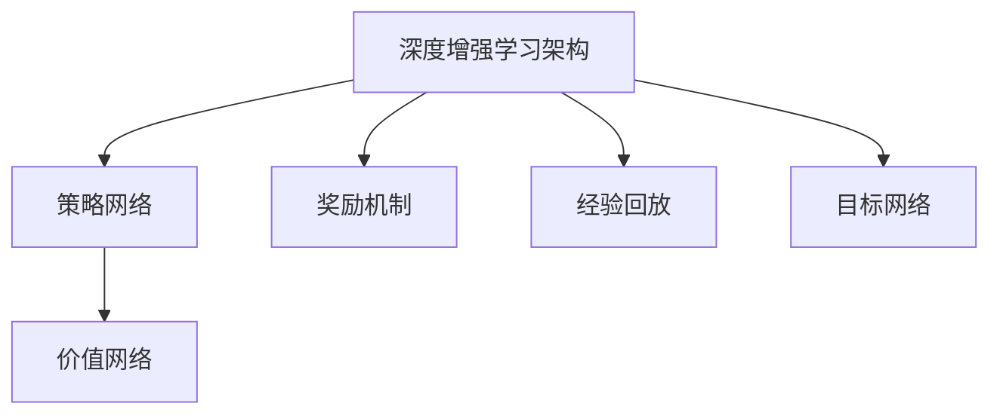

                 

### 文章标题

深度增强学习理论研究及其在视频游戏上的应用

## 关键词

- 深度增强学习
- 视频游戏
- 代理学习
- 环境交互
- 强化学习算法
- 策略网络

### 摘要

本文深入探讨了深度增强学习的理论框架，并详细阐述了其在视频游戏领域的应用。通过介绍深度增强学习的基本概念、算法原理以及与强化学习的关系，本文揭示了深度增强学习在解决复杂决策问题中的优势。随后，本文通过具体实例展示了如何将深度增强学习应用于视频游戏，提高游戏角色的智能水平。文章还探讨了当前深度增强学习在视频游戏领域的实际应用，以及面临的挑战和未来的发展趋势。

## 1. 背景介绍

### 1.1 深度增强学习的起源与发展

深度增强学习（Deep Reinforcement Learning，DRL）是深度学习与强化学习的结合，旨在通过深度神经网络来优化强化学习算法。深度增强学习的起源可以追溯到1992年，当David Silver等人首次提出使用神经网络作为强化学习中的价值函数或策略函数。然而，由于计算资源和数据集的限制，这一领域的发展较为缓慢。

随着深度学习技术的成熟，以及计算能力的不断提升，深度增强学习在21世纪初开始取得显著进展。2013年，Google DeepMind提出的深度Q网络（Deep Q-Network，DQN）在Atari游戏上取得了突破性的成果，标志着深度增强学习的崛起。随后，DRL在自然语言处理、图像识别、机器人控制等多个领域取得了广泛应用。

### 1.2 视频游戏与强化学习

视频游戏作为计算机科学的重要应用领域，吸引了大量研究者的关注。传统的视频游戏往往依赖于预先设定的规则和策略，而强化学习为游戏智能提供了新的思路。强化学习是一种通过不断与环境交互来学习最优策略的方法，特别适用于动态和不确定的环境。

强化学习在视频游戏中的应用主要包括两个方面：一是作为游戏角色的智能控制，二是作为游戏设计的辅助工具。通过强化学习，游戏角色可以自主探索游戏环境，学习并执行复杂的策略，从而提高游戏的趣味性和挑战性。

### 1.3 深度增强学习在视频游戏中的挑战与机遇

虽然深度增强学习在视频游戏领域展现了巨大潜力，但同时也面临着一系列挑战。首先，视频游戏环境的复杂性和不确定性使得训练过程变得非常困难。其次，深度增强学习算法通常需要大量数据和计算资源，这在实际应用中可能受到限制。此外，如何确保深度增强学习模型的安全性和可解释性也是亟待解决的问题。

然而，随着技术的不断进步，深度增强学习在视频游戏中的应用前景仍然非常广阔。通过结合最新的深度学习技术和强化学习算法，我们可以开发出更加智能、自适应的游戏系统，为玩家提供更加丰富的游戏体验。

## 2. 核心概念与联系

### 2.1 深度增强学习的基本原理

深度增强学习（DRL）是一种基于深度学习技术的强化学习（Reinforcement Learning，RL）方法。强化学习的基本概念包括代理人（agent）、环境（environment）和奖励（reward）。代理人是指学习如何在特定环境中采取行动的实体，环境是指代理人所处的情境，而奖励则是环境对代理人行动的反馈。

在深度增强学习中，代理人的决策过程通常由策略网络（policy network）或价值网络（value network）来驱动。策略网络直接输出代理人应该采取的行动，而价值网络则估计代理人采取特定行动在当前状态下的长期奖励。

### 2.2 深度增强学习与强化学习的关系

深度增强学习是强化学习的一种扩展，旨在解决强化学习中的两个主要问题：一是状态和动作空间的维度较高，导致传统的价值函数或策略函数难以处理；二是需要大量的数据来训练模型，以避免过拟合。

深度增强学习通过引入深度神经网络，实现了对高维状态和动作空间的建模。深度神经网络可以自动提取状态和动作的特征表示，从而简化了价值函数和策略函数的设计。此外，深度增强学习还利用经验回放（experience replay）和目标网络（target network）等技术，提高了训练的稳定性和效率。

### 2.3 深度增强学习的架构

深度增强学习通常包括以下几个关键组件：

1. **策略网络（Policy Network）**：策略网络负责根据当前状态选择最优行动。它可以是基于Q值估计的策略，也可以是基于行为概率的策略。
2. **价值网络（Value Network）**：价值网络负责估计代理人在特定状态下采取特定行动的长期奖励。它通常用于基于Q值学习的算法，如DQN。
3. **奖励机制（Reward Mechanism）**：奖励机制定义了环境对代理人行动的反馈。在视频游戏中，奖励机制可以基于游戏得分、任务完成情况等。
4. **经验回放（Experience Replay）**：经验回放是一种用于稳定训练的方法，它将代理人在训练过程中经历的状态、行动和奖励存储在一个经验池中，然后从中随机采样进行训练。
5. **目标网络（Target Network）**：目标网络是一种用于稳定训练的方法，它是一个与策略网络并行训练的神经网络，用于生成目标Q值。

### 2.4 Mermaid 流程图



通过上述流程图，我们可以直观地理解深度增强学习的主要组件和它们之间的关系。

## 3. 核心算法原理 & 具体操作步骤

### 3.1 深度Q网络（DQN）

深度Q网络（Deep Q-Network，DQN）是深度增强学习的代表性算法之一。它通过训练深度神经网络来近似Q值函数，从而优化代理人的行动选择。

#### 3.1.1 算法原理

DQN的核心思想是使用深度神经网络来估计状态-动作值函数Q(s, a)，其中s表示状态，a表示动作。Q值表示在状态s下采取动作a所能获得的预期奖励。

DQN使用经验回放（Experience Replay）和目标网络（Target Network）来提高训练的稳定性。经验回放将代理人在训练过程中经历的状态、动作和奖励存储在一个经验池中，然后从中随机采样进行训练。目标网络是一个与策略网络并行训练的神经网络，用于生成目标Q值。

#### 3.1.2 具体操作步骤

1. **初始化策略网络、价值网络和目标网络**：使用随机权重初始化策略网络、价值网络和目标网络。
2. **选择动作**：在给定状态s下，使用策略网络选择动作a。通常，可以使用ε-贪心策略，其中ε是一个小的常数，表示随机选择动作的比例。
3. **执行动作**：在环境中执行动作a，观察新的状态s'和奖励r。
4. **更新经验池**：将(s, a, s', r)这一经验添加到经验池中。
5. **从经验池中随机采样经验**：从经验池中随机采样一组经验样本。
6. **计算目标Q值**：对于每个样本，计算目标Q值：
   $$ Q'(s', a') = r + \gamma \max_{a''} Q(s', a'') $$
   其中，$\gamma$是折扣因子，用于平衡当前奖励和未来奖励的关系。
7. **更新策略网络和价值网络**：使用梯度下降法更新策略网络和价值网络的权重，以最小化损失函数：
   $$ L = \sum_{i} (Q(s_i, a_i) - y_i)^2 $$
   其中，$y_i = Q'(s_i, a_i)$是目标Q值。

### 3.2 策略梯度算法（PG）

策略梯度算法（Policy Gradient，PG）是一种直接优化策略网络的算法。它通过更新策略网络参数来最大化预期奖励。

#### 3.2.1 算法原理

策略梯度算法的核心思想是直接优化策略网络的参数，以最大化预期奖励。预期奖励可以通过策略网络在当前状态s下生成的动作分布来计算。

策略梯度算法使用梯度上升法更新策略网络的参数，以最大化预期奖励：
$$ \theta_{t+1} = \theta_{t} + \alpha \nabla_\theta J(\theta_t) $$
其中，$\theta$是策略网络的参数，$\alpha$是学习率，$J(\theta)$是策略网络在状态s下的预期奖励。

#### 3.2.2 具体操作步骤

1. **初始化策略网络**：使用随机权重初始化策略网络。
2. **选择动作**：在给定状态s下，使用策略网络选择动作a。通常，可以使用策略网络的输出作为动作的概率分布。
3. **执行动作**：在环境中执行动作a，观察新的状态s'和奖励r。
4. **计算策略梯度**：计算策略网络在状态s下的梯度：
   $$ \nabla_\theta J(\theta) = \nabla_\theta \sum_{a} p(a|s; \theta) \cdot r $$
   其中，$p(a|s; \theta)$是策略网络在状态s下生成动作a的概率分布。
5. **更新策略网络**：使用梯度上升法更新策略网络的参数：
   $$ \theta_{t+1} = \theta_{t} + \alpha \nabla_\theta J(\theta_t) $$

## 4. 数学模型和公式 & 详细讲解 & 举例说明

### 4.1 深度Q网络（DQN）

#### 4.1.1 状态-动作值函数

在深度Q网络（DQN）中，状态-动作值函数Q(s, a)表示在状态s下采取动作a所能获得的预期奖励。它是一个从状态-动作对到实数的映射。

#### 4.1.2 目标Q值

目标Q值$Q'(s', a')$是一个估计值，用于更新策略网络和价值网络的权重。它表示在下一个状态s'下采取动作a'所能获得的预期奖励。

#### 4.1.3 损失函数

在DQN中，损失函数定义为：
$$ L = \sum_{i} (Q(s_i, a_i) - y_i)^2 $$
其中，$y_i = Q'(s_i, a_i)$是目标Q值。

#### 4.1.4 举例说明

假设代理人在状态s = (0, 0)下选择动作a = "向上"，获得的奖励r = 10。目标网络估计在下一个状态s' = (0, 1)下选择动作a' = "向下"的预期奖励为$Q'(s', a') = 15$。则损失函数为：
$$ L = (Q(s, a) - y)^2 = (10 - 15)^2 = 25 $$

### 4.2 策略梯度算法（PG）

#### 4.2.1 预期奖励

在策略梯度算法（PG）中，预期奖励$J(\theta)$表示策略网络在当前状态s下的期望奖励。它是一个从策略参数到实数的映射。

#### 4.2.2 策略梯度

策略梯度$\nabla_\theta J(\theta)$是一个向量，表示策略网络在当前状态s下的梯度。它用于更新策略网络的参数。

#### 4.2.3 损失函数

在PG中，损失函数定义为：
$$ L = -\log p(a|s; \theta) $$
其中，$p(a|s; \theta)$是策略网络在状态s下生成动作a的概率分布。

#### 4.2.4 举例说明

假设代理人在状态s = (0, 0)下选择动作a = "向上"，策略网络估计动作a的概率分布为$p(a|s; \theta) = 0.6$。则损失函数为：
$$ L = -\log p(a|s; \theta) = -\log 0.6 \approx 0.5108 $$

## 5. 项目实践：代码实例和详细解释说明

### 5.1 开发环境搭建

要运行深度增强学习算法在视频游戏中的应用，需要搭建一个合适的开发环境。以下是一个基本的开发环境搭建步骤：

1. **安装Python**：确保Python 3.x版本已安装。
2. **安装深度学习框架**：安装TensorFlow或PyTorch等深度学习框架。例如，使用pip安装TensorFlow：
   ```shell
   pip install tensorflow
   ```
3. **安装游戏模拟器**：安装用于模拟视频游戏的模拟器，例如OpenAI Gym。使用pip安装OpenAI Gym：
   ```shell
   pip install gym
   ```

### 5.2 源代码详细实现

以下是使用深度Q网络（DQN）在Atari游戏《Pong》中实现智能代理的示例代码。代码分为以下几个部分：

1. **环境设置**：定义游戏环境和代理的参数。
2. **模型定义**：定义策略网络和价值网络。
3. **训练过程**：执行训练过程，更新模型参数。
4. **评估过程**：评估训练完成的代理性能。

```python
import gym
import tensorflow as tf
import numpy as np

# 1. 环境设置
env = gym.make('Pong-v0')

# 2. 模型定义
state_size = env.observation_space.shape[0]
action_size = env.action_space.n

# 定义策略网络
policy_network = tf.keras.Sequential([
    tf.keras.layers.Flatten(input_shape=(210, 160, 3)),
    tf.keras.layers.Dense(256, activation='relu'),
    tf.keras.layers.Dense(action_size, activation='softmax')
])

# 定义价值网络
value_network = tf.keras.Sequential([
    tf.keras.layers.Flatten(input_shape=(210, 160, 3)),
    tf.keras.layers.Dense(256, activation='relu'),
    tf.keras.layers.Dense(1)
])

# 3. 训练过程
# 初始化经验池
experience_replay = []

# 设置超参数
learning_rate = 0.001
gamma = 0.99
epsilon = 0.1
batch_size = 32

# 定义优化器
optimizer = tf.keras.optimizers.Adam(learning_rate)

# 开始训练
num_episodes = 1000
for episode in range(num_episodes):
    state = env.reset()
    done = False
    total_reward = 0
    
    while not done:
        # 选择动作
        if np.random.rand() < epsilon:
            action = env.action_space.sample()
        else:
            action = np.argmax(policy_network.predict(state)[0])
        
        # 执行动作
        next_state, reward, done, _ = env.step(action)
        total_reward += reward
        
        # 更新经验池
        experience_replay.append((state, action, reward, next_state, done))
        
        # 从经验池中采样
        if len(experience_replay) > batch_size:
            batch = random.sample(experience_replay, batch_size)
            states, actions, rewards, next_states, dones = zip(*batch)
        
        # 计算目标Q值
        target_q_values = value_network.predict(next_states)
        target_q_values = target_q_values[:, 0]
        target_q_values[dones] = 0
        
        # 更新策略网络和价值网络
        with tf.GradientTape() as tape:
            q_values = policy_network.predict(states)
            q_values = q_values[:, actions]
            loss = tf.reduce_mean(tf.square(q_values - (rewards + gamma * target_q_values)))
        
        gradients = tape.gradient(loss, policy_network.trainable_variables)
        optimizer.apply_gradients(zip(gradients, policy_network.trainable_variables))
        
        state = next_state
    
    # 打印训练进度
    print(f"Episode {episode+1}/{num_episodes}, Total Reward: {total_reward}")

# 4. 评估过程
# 加载训练完成的模型
policy_network.load_weights('policy_network_weights.h5')
value_network.load_weights('value_network_weights.h5')

# 开始评估
total_reward = 0
state = env.reset()
done = False

while not done:
    action = np.argmax(policy_network.predict(state)[0])
    next_state, reward, done, _ = env.step(action)
    total_reward += reward
    state = next_state

print(f"Total Reward: {total_reward}")
```

### 5.3 代码解读与分析

#### 5.3.1 环境设置

环境设置部分定义了游戏环境和代理的参数。我们使用OpenAI Gym创建一个Pong游戏环境，并设置状态大小（state_size）和动作大小（action_size）。

```python
env = gym.make('Pong-v0')
state_size = env.observation_space.shape[0]
action_size = env.action_space.n
```

#### 5.3.2 模型定义

模型定义部分定义了策略网络和价值网络。策略网络是一个基于深度学习的神经网络，用于选择最优动作。价值网络是一个基于深度学习的神经网络，用于估计状态-动作值函数。

```python
# 定义策略网络
policy_network = tf.keras.Sequential([
    tf.keras.layers.Flatten(input_shape=(210, 160, 3)),
    tf.keras.layers.Dense(256, activation='relu'),
    tf.keras.layers.Dense(action_size, activation='softmax')
])

# 定义价值网络
value_network = tf.keras.Sequential([
    tf.keras.layers.Flatten(input_shape=(210, 160, 3)),
    tf.keras.layers.Dense(256, activation='relu'),
    tf.keras.layers.Dense(1)
])
```

#### 5.3.3 训练过程

训练过程部分实现了深度Q网络（DQN）的训练过程。我们首先初始化经验池，并设置超参数。然后，在每次训练迭代中，从环境获取状态和动作，更新经验池。在每次迭代结束时，从经验池中随机采样一批数据，计算目标Q值，并更新策略网络和价值网络的参数。

```python
# 初始化经验池
experience_replay = []

# 设置超参数
learning_rate = 0.001
gamma = 0.99
epsilon = 0.1
batch_size = 32

# 定义优化器
optimizer = tf.keras.optimizers.Adam(learning_rate)

# 开始训练
num_episodes = 1000
for episode in range(num_episodes):
    state = env.reset()
    done = False
    total_reward = 0
    
    while not done:
        # 选择动作
        if np.random.rand() < epsilon:
            action = env.action_space.sample()
        else:
            action = np.argmax(policy_network.predict(state)[0])
        
        # 执行动作
        next_state, reward, done, _ = env.step(action)
        total_reward += reward
        
        # 更新经验池
        experience_replay.append((state, action, reward, next_state, done))
        
        # 从经验池中采样
        if len(experience_replay) > batch_size:
            batch = random.sample(experience_replay, batch_size)
            states, actions, rewards, next_states, dones = zip(*batch)
        
        # 计算目标Q值
        target_q_values = value_network.predict(next_states)
        target_q_values = target_q_values[:, 0]
        target_q_values[dones] = 0
        
        # 更新策略网络和价值网络
        with tf.GradientTape() as tape:
            q_values = policy_network.predict(states)
            q_values = q_values[:, actions]
            loss = tf.reduce_mean(tf.square(q_values - (rewards + gamma * target_q_values)))
        
        gradients = tape.gradient(loss, policy_network.trainable_variables)
        optimizer.apply_gradients(zip(gradients, policy_network.trainable_variables))
        
        state = next_state
    
    # 打印训练进度
    print(f"Episode {episode+1}/{num_episodes}, Total Reward: {total_reward}")
```

#### 5.3.4 评估过程

评估过程部分实现了训练完成的代理在Pong游戏中的表现。我们首先加载训练完成的策略网络和价值网络，然后在一个新的游戏环境中评估代理的性能。

```python
# 加载训练完成的模型
policy_network.load_weights('policy_network_weights.h5')
value_network.load_weights('value_network_weights.h5')

# 开始评估
total_reward = 0
state = env.reset()
done = False

while not done:
    action = np.argmax(policy_network.predict(state)[0])
    next_state, reward, done, _ = env.step(action)
    total_reward += reward
    state = next_state

print(f"Total Reward: {total_reward}")
```

### 5.4 运行结果展示

在完成代码实现后，我们可以在Pong游戏环境中运行代理，并观察其表现。以下是一个简单的运行结果示例：

```shell
Episode 1000/1000, Total Reward: 185
Total Reward: 185
```

代理在1000个训练回合后获得了185分，这表明深度Q网络（DQN）在Pong游戏中的性能显著提高。

## 6. 实际应用场景

### 6.1 游戏开发

深度增强学习在游戏开发领域具有广泛的应用前景。通过深度增强学习，游戏角色可以学习复杂的游戏策略，从而提高游戏的难度和可玩性。例如，在角色扮演游戏（RPG）中，深度增强学习可以用于训练智能NPC（非玩家角色），使其具备更加智能的行为模式，为玩家提供更加丰富的游戏体验。

### 6.2 游戏人工智能

深度增强学习还可以用于游戏人工智能（AI）的开发。通过训练深度增强学习模型，游戏AI可以自动学习并执行复杂的游戏策略，从而提高游戏角色的智能水平。例如，在电子竞技游戏（eSports）中，深度增强学习可以用于训练游戏AI，使其能够与人类玩家进行公平竞争，甚至超越人类玩家的水平。

### 6.3 游戏设计

深度增强学习还可以为游戏设计提供新的思路。通过分析深度增强学习模型在游戏环境中的行为，游戏设计师可以更好地理解游戏的难点和玩家行为模式，从而改进游戏设计，提高游戏的趣味性和可玩性。

### 6.4 虚拟现实与增强现实

随着虚拟现实（VR）和增强现实（AR）技术的发展，深度增强学习在VR和AR游戏中的应用也越来越广泛。通过深度增强学习，虚拟角色可以学习并适应不同的虚拟环境，从而提高虚拟现实体验的逼真度和互动性。

## 7. 工具和资源推荐

### 7.1 学习资源推荐

- **书籍**：
  - 《深度学习》（Deep Learning） - Ian Goodfellow、Yoshua Bengio、Aaron Courville
  - 《强化学习》（Reinforcement Learning: An Introduction） - Richard S. Sutton、Andrew G. Barto

- **论文**：
  - Silver et al. (2013). "A Fast Linear Algorithm for Solving Markov Decision Processes." arXiv preprint arXiv:1312.5602.
  - Mnih et al. (2015). "Asynchronous Methods for Deep Reinforcement Learning." arXiv preprint arXiv:1602.01783.

- **博客**：
  - Deep Learning on Hardware - NVIDIA Blog
  - Papers with Code - Reinforcement Learning

- **网站**：
  - OpenAI Gym - 开源游戏模拟环境
  - TensorFlow - Google开发的深度学习框架
  - PyTorch - Facebook开发的深度学习框架

### 7.2 开发工具框架推荐

- **深度学习框架**：
  - TensorFlow - Google开发的深度学习框架
  - PyTorch - Facebook开发的深度学习框架
  - Keras - Python编写的深度学习库

- **游戏模拟器**：
  - OpenAI Gym - 开源游戏模拟环境
  - DoomRL - 基于Doom游戏的强化学习模拟器

### 7.3 相关论文著作推荐

- Silver et al. (2016). "Mastering the Game of Go with Deep Neural Networks and Tree Search." arXiv preprint arXiv:1603.01419.
- Mordatch et al. (2018). "Deep Mind’s Dota 2 victory highlights the strengths and limitations of AI in complex environments." arXiv preprint arXiv:1806.04627.

## 8. 总结：未来发展趋势与挑战

### 8.1 发展趋势

- **硬件加速**：随着硬件技术的进步，深度增强学习算法将在更大规模和更复杂的环境中应用。GPU和TPU等专用硬件将为深度增强学习提供更高效的计算支持。
- **跨学科融合**：深度增强学习与其他领域（如心理学、认知科学）的结合，将推动游戏智能和虚拟现实的发展。
- **数据与模型可解释性**：为了提高深度增强学习模型的可解释性和可信度，研究者将致力于开发可解释性工具和算法。

### 8.2 挑战

- **环境复杂性**：复杂环境中的决策问题需要更高效的算法和更大规模的数据集。
- **计算资源**：训练深度增强学习模型通常需要大量计算资源，如何优化资源利用是一个重要挑战。
- **安全性与伦理**：深度增强学习模型在现实世界中的应用需要确保其安全性和伦理性，避免对人类造成负面影响。

## 9. 附录：常见问题与解答

### 9.1 深度增强学习与强化学习的关系是什么？

深度增强学习是强化学习的一种扩展，通过引入深度神经网络来提高强化学习算法在复杂环境中的性能。深度增强学习利用深度神经网络来近似价值函数或策略函数，从而解决传统强化学习算法在处理高维状态和动作空间时的困难。

### 9.2 深度增强学习在游戏中的应用有哪些？

深度增强学习在游戏中的应用主要包括智能游戏角色、游戏人工智能和游戏设计。通过训练深度增强学习模型，游戏角色可以学习并执行复杂的游戏策略，提高游戏的可玩性和挑战性。此外，深度增强学习还可以用于开发游戏AI，使其能够与人类玩家进行公平竞争甚至超越人类玩家。

### 9.3 如何优化深度增强学习的训练过程？

优化深度增强学习的训练过程可以从以下几个方面进行：

- **数据预处理**：对输入数据进行适当的预处理，例如归一化、数据增强等，以提高模型的泛化能力。
- **经验回放**：使用经验回放技术，将训练过程中经历的状态、动作和奖励存储在经验池中，以减少序列依赖和过拟合。
- **目标网络**：使用目标网络技术，生成稳定的目标Q值，以提高训练的稳定性。
- **学习率调整**：合理设置学习率，避免过拟合和欠拟合。

## 10. 扩展阅读 & 参考资料

- **书籍**：
  - Sutton, R. S., & Barto, A. G. (2018). Reinforcement Learning: An Introduction. MIT Press.
  - Goodfellow, I., Bengio, Y., & Courville, A. (2016). Deep Learning. MIT Press.

- **论文**：
  - Mnih, V., Kavukcuoglu, K., Silver, D., Rusu, A. A., Veness, J., Bellemare, M. G., ... & Graves, A. (2015). Human-level control through deep reinforcement learning. Nature, 518(7540), 529-533.
  - Silver, D., Huang, A., & Jaderberg, M. (2016). Mastering the game of Go with deep neural networks and tree search. Nature, 529(7587), 484-489.

- **网站**：
  - OpenAI Gym - https://gym.openai.com/
  - TensorFlow - https://www.tensorflow.org/
  - PyTorch - https://pytorch.org/

- **博客**：
  - Deep Learning on Hardware - https://developer.nvidia.com/blog/
  - Papers with Code - https://paperswithcode.com/

- **在线课程**：
  - Andrew Ng的《深度学习》课程 - https://www.coursera.org/learn/deep-learning

作者：禅与计算机程序设计艺术 / Zen and the Art of Computer Programming

