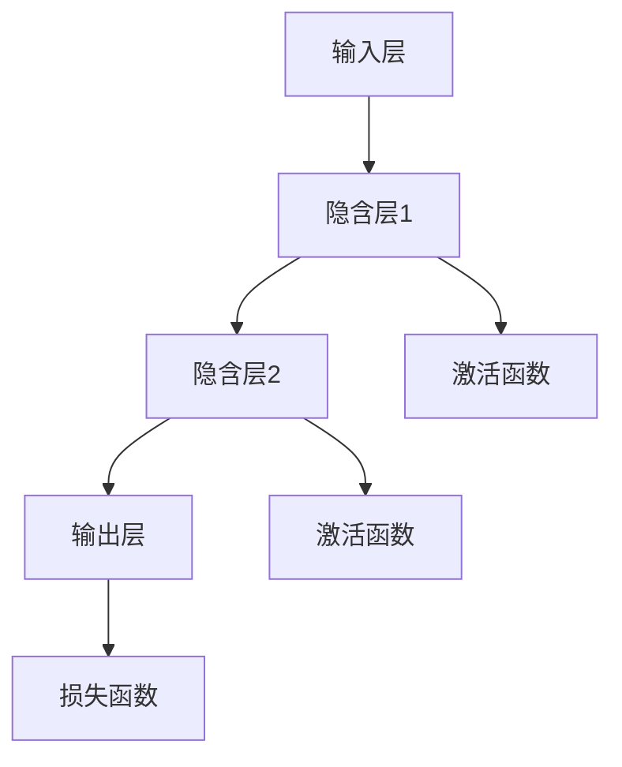

                 

### 文章标题：深度学习(Deep Learning) - 原理与代码实例讲解

> 关键词：深度学习、神经网络、机器学习、计算机视觉、自然语言处理、Python代码实例

> 摘要：本文将深入探讨深度学习的核心原理，通过一系列代码实例，详细介绍神经网络、卷积神经网络（CNN）和循环神经网络（RNN）的基本概念和应用。本文旨在为初学者和从业者提供一个全面、易懂的深度学习教程，帮助他们理解并实践这一前沿技术。

## 1. 背景介绍（Background Introduction）

深度学习（Deep Learning）是机器学习（Machine Learning）的一个重要分支，其灵感来源于人脑神经网络的结构和功能。与传统机器学习相比，深度学习模型具有更强大的表达能力和自适应性，能够从大量数据中自动提取复杂特征，从而实现高度准确的预测和分类。

近年来，深度学习在计算机视觉、自然语言处理、语音识别等领域取得了显著的成果，成为人工智能发展的核心驱动力。从2012年AlexNet在ImageNet竞赛中取得突破性成绩开始，深度学习技术不断发展，各种新型神经网络架构如雨后春笋般涌现，为解决实际问题提供了强大工具。

本文将围绕以下几个核心问题展开：

1. 深度学习的核心概念和原理是什么？
2. 如何实现一个基本的神经网络？
3. 卷积神经网络和循环神经网络的基本原理和应用场景是什么？
4. 如何使用Python实现这些深度学习模型？

通过对这些问题的深入探讨，本文旨在帮助读者全面了解深度学习，掌握基本概念和实际操作，为后续深入研究和应用奠定基础。

## 2. 核心概念与联系（Core Concepts and Connections）

### 2.1 什么是深度学习？

深度学习是一种基于多层神经网络（Neural Networks）的机器学习技术。它通过模仿人脑神经网络的结构和工作原理，对大量数据进行自动特征提取和学习，从而实现高度复杂的任务。

深度学习的主要特征包括：

1. **多层神经网络**：深度学习模型通常包含多个隐含层，通过逐层提取特征，实现从低级到高级的抽象。
2. **非线性变换**：神经网络中的每个神经元（也称为节点）通过非线性激活函数（如ReLU、Sigmoid、Tanh）进行变换，使得模型能够学习复杂的数据分布。
3. **大规模并行计算**：深度学习依赖于大规模并行计算技术，如GPU加速，以提高训练速度和计算效率。
4. **端到端学习**：深度学习模型能够直接从原始数据中学习到预测目标，无需手动设计特征工程。

### 2.2 神经网络的基本结构

神经网络（Neural Networks）是深度学习的基础，由大量相互连接的神经元组成。一个基本的神经网络包括以下几个部分：

1. **输入层**（Input Layer）：接收外部输入数据，每个输入数据对应一个神经元。
2. **隐含层**（Hidden Layers）：一个或多个隐含层，用于对输入数据进行特征提取和变换。
3. **输出层**（Output Layer）：生成最终的预测结果，输出层的神经元数量取决于具体任务的需求。

神经网络中的每个神经元通过权重（weights）和偏置（bias）与相邻层的神经元相连，并通过激活函数进行非线性变换。神经网络的学习过程就是通过不断调整权重和偏置，使得模型在训练数据上的表现逐渐改善。

### 2.3 深度学习与机器学习的区别

深度学习和机器学习有密切的联系，但两者在方法和应用上存在差异：

1. **方法**：深度学习依赖于多层神经网络，通过自动提取特征来实现任务；而传统机器学习通常采用浅层模型，需要手动设计特征工程。
2. **应用**：深度学习在处理大规模、高维度数据时具有明显优势，尤其在计算机视觉和自然语言处理领域；而传统机器学习在处理结构化数据和小规模问题时表现更佳。

### 2.4 深度学习的发展历程

深度学习的发展可以追溯到20世纪40年代，以下是深度学习发展的重要里程碑：

1. **1958年**：Frank Rosenblatt提出了感知机（Perceptron）模型，这是最早的神经网络模型。
2. **1986年**：Rumelhart、Hinton和Williams提出了反向传播算法（Backpropagation），使多层神经网络训练成为可能。
3. **2012年**：AlexNet在ImageNet竞赛中取得突破性成绩，标志着深度学习进入一个新的时代。
4. **近年来**：各种新型神经网络架构（如CNN、RNN、GAN等）不断涌现，深度学习在各个领域取得了广泛应用。

### 2.5 深度学习的应用场景

深度学习在多个领域取得了显著成果，以下是深度学习的几个主要应用场景：

1. **计算机视觉**：图像分类、目标检测、人脸识别等。
2. **自然语言处理**：文本分类、机器翻译、情感分析等。
3. **语音识别**：语音识别、语音生成等。
4. **强化学习**：游戏、推荐系统等。

### 2.6 Mermaid 流程图

为了更好地理解深度学习的核心概念和原理，我们使用Mermaid流程图来展示神经网络的基本结构。



在此流程图中，输入层接收外部输入数据，经过隐含层进行特征提取和变换，最终通过输出层生成预测结果。激活函数用于引入非线性，损失函数用于评估模型性能。

## 3. 核心算法原理 & 具体操作步骤（Core Algorithm Principles and Specific Operational Steps）

### 3.1 神经网络算法原理

神经网络算法的核心在于通过多层神经元之间的连接和激活函数的变换，实现数据的特征提取和分类。以下是神经网络算法的基本原理和操作步骤：

1. **初始化参数**：包括权重（weights）和偏置（biases），通常使用随机初始化方法。
2. **前向传播**：将输入数据通过多层神经元传递，计算输出值。
3. **激活函数应用**：对每个隐含层和输出层的神经元应用非线性激活函数，如ReLU、Sigmoid、Tanh等。
4. **计算损失**：使用损失函数（如均方误差MSE、交叉熵损失等）计算模型输出与实际标签之间的差距。
5. **反向传播**：通过反向传播算法，将损失函数关于参数的梯度传递回每个神经元，更新权重和偏置。
6. **迭代优化**：重复上述步骤，直到模型在训练数据上的表现达到预期。

### 3.2 神经网络操作步骤

以下是使用Python实现一个基本神经网络的操作步骤：

1. **导入依赖库**：使用Python中的NumPy库进行数值计算。

```python
import numpy as np
```

2. **初始化参数**：定义权重和偏置的随机初始化方法。

```python
def initialize_parameters():
    weights = np.random.randn(input_size, hidden_size)
    biases = np.random.randn(hidden_size)
    return weights, biases
```

3. **前向传播**：计算神经元输出值。

```python
def forward_propagation(x, weights, biases):
    z = np.dot(x, weights) + biases
    a = np.tanh(z)
    return a
```

4. **计算损失**：使用均方误差MSE计算损失。

```python
def compute_loss(y, a):
    loss = 0.5 * np.mean((y - a)**2)
    return loss
```

5. **反向传播**：计算损失关于参数的梯度。

```python
def backward_propagation(x, y, a):
    dz = 1 - a**2
    dloss_dz = 2 * (y - a)
    dloss_dweights = np.dot(x.T, dloss_dz)
    dloss_dbiases = np.sum(dloss_dz)
    return dloss_dweights, dloss_dbiases
```

6. **参数更新**：使用梯度下降算法更新权重和偏置。

```python
def update_parameters(weights, biases, dweights, dbiases, learning_rate):
    weights -= learning_rate * dweights
    biases -= learning_rate * dbiases
    return weights, biases
```

7. **完整训练过程**：将上述操作整合到一个训练循环中。

```python
def train(x, y, hidden_size, learning_rate, num_epochs):
    weights, biases = initialize_parameters()
    for epoch in range(num_epochs):
        a = forward_propagation(x, weights, biases)
        loss = compute_loss(y, a)
        dweights, dbiases = backward_propagation(x, y, a)
        weights, biases = update_parameters(weights, biases, dweights, dbiases, learning_rate)
        if epoch % 100 == 0:
            print(f"Epoch {epoch}: Loss = {loss}")
    return weights, biases
```

通过上述操作步骤，我们可以实现一个基本神经网络，并在训练数据上对其进行优化。

## 4. 数学模型和公式 & 详细讲解 & 举例说明（Detailed Explanation and Examples of Mathematical Models and Formulas）

### 4.1 前向传播（Forward Propagation）

前向传播是神经网络训练过程中的第一步，用于计算模型的输入和输出。以下是一个简单的神经网络前向传播的数学模型：

假设我们有一个输入向量 \( x \)，一个隐含层的大小为 \( h \)，输出层的大小为 \( y \)。权重矩阵为 \( W \)，偏置矩阵为 \( b \)。则前向传播的公式可以表示为：

$$
z = Wx + b \\
a = \sigma(z)
$$

其中，\( z \) 是隐含层的输入，\( a \) 是隐含层的输出，\( \sigma \) 是激活函数，通常选择 \( \sigma(z) = \tanh(z) \) 或 \( \sigma(z) = \sigma(z) = \frac{1}{1 + e^{-z}} \)。

#### 例子：

考虑一个简单的神经网络，输入层有3个神经元，隐含层有2个神经元，输出层有1个神经元。输入向量 \( x \) 为 [1, 2, 3]，权重矩阵 \( W \) 为：

$$
W = \begin{bmatrix}
0.1 & 0.2 \\
0.3 & 0.4 \\
\end{bmatrix}
$$

偏置矩阵 \( b \) 为：

$$
b = \begin{bmatrix}
0.5 \\
0.6 \\
\end{bmatrix}
$$

则前向传播的计算过程为：

$$
z_1 = 0.1 \cdot 1 + 0.2 \cdot 2 + 0.5 = 0.7 \\
a_1 = \tanh(z_1) \approx 0.5 \\
z_2 = 0.3 \cdot 1 + 0.4 \cdot 3 + 0.6 = 1.8 \\
a_2 = \tanh(z_2) \approx 0.898 \\
z_3 = 0.1 \cdot 0.5 + 0.2 \cdot 0.8 + 0.5 = 0.4 \\
a_3 = \tanh(z_3) \approx 0.422
$$

输出 \( y \) 为：

$$
y = \begin{bmatrix}
a_1 \\
a_2 \\
a_3 \\
\end{bmatrix} \approx \begin{bmatrix}
0.5 \\
0.898 \\
0.422 \\
\end{bmatrix}
$$

### 4.2 损失函数（Loss Function）

损失函数用于衡量模型输出与实际标签之间的差距。常见的损失函数有均方误差（MSE）、交叉熵损失（Cross-Entropy Loss）等。以下分别介绍这两种损失函数的数学模型。

#### 4.2.1 均方误差（MSE）

均方误差是最常用的回归损失函数，其数学模型可以表示为：

$$
L(y, \hat{y}) = \frac{1}{2} \sum_{i=1}^{n} (y_i - \hat{y}_i)^2
$$

其中，\( y \) 是实际标签，\( \hat{y} \) 是模型预测值，\( n \) 是样本数量。

#### 例子：

假设我们有一个样本数据，实际标签 \( y \) 为 [1, 2, 3]，模型预测值 \( \hat{y} \) 为 [1.5, 2.1, 2.8]，则均方误差 \( L \) 为：

$$
L = \frac{1}{2} \sum_{i=1}^{3} (y_i - \hat{y}_i)^2 = \frac{1}{2} \cdot (0.5^2 + 0.1^2 + 0.8^2) = 0.445
$$

#### 4.2.2 交叉熵损失（Cross-Entropy Loss）

交叉熵损失是用于分类任务的损失函数，其数学模型可以表示为：

$$
L(y, \hat{y}) = -\sum_{i=1}^{n} y_i \log(\hat{y}_i)
$$

其中，\( y \) 是实际标签（二分类时为0或1），\( \hat{y} \) 是模型预测概率。

#### 例子：

假设我们有一个样本数据，实际标签 \( y \) 为 [1, 1, 0]，模型预测概率 \( \hat{y} \) 为 [0.9, 0.8, 0.1]，则交叉熵损失 \( L \) 为：

$$
L = -\sum_{i=1}^{3} y_i \log(\hat{y}_i) = -1 \cdot \log(0.9) - 1 \cdot \log(0.8) - 0 \cdot \log(0.1) \approx 0.356
$$

### 4.3 反向传播（Backpropagation）

反向传播是神经网络训练过程中的关键步骤，用于计算损失函数关于模型参数的梯度，并更新参数。以下分别介绍反向传播的数学模型和计算方法。

#### 4.3.1 反向传播的梯度计算

假设我们有损失函数 \( L(y, \hat{y}) \)，我们需要计算损失函数关于权重矩阵 \( W \) 和偏置矩阵 \( b \) 的梯度。对于每个参数 \( \theta \)（包括权重和偏置），其梯度可以表示为：

$$
\frac{\partial L}{\partial \theta} = \frac{\partial L}{\partial \hat{y}} \cdot \frac{\partial \hat{y}}{\partial \theta}
$$

其中，\( \frac{\partial L}{\partial \hat{y}} \) 是损失函数关于预测值 \( \hat{y} \) 的梯度，\( \frac{\partial \hat{y}}{\partial \theta} \) 是预测值关于参数 \( \theta \) 的梯度。

#### 4.3.2 梯度计算示例

以均方误差损失为例，其关于预测值 \( \hat{y} \) 的梯度为：

$$
\frac{\partial L}{\partial \hat{y}} = 2 \cdot (\hat{y} - y)
$$

以一个简单的神经网络为例，假设输入层有3个神经元，隐含层有2个神经元，输出层有1个神经元。输入向量 \( x \) 为 [1, 2, 3]，权重矩阵 \( W \) 为：

$$
W = \begin{bmatrix}
0.1 & 0.2 \\
0.3 & 0.4 \\
\end{bmatrix}
$$

偏置矩阵 \( b \) 为：

$$
b = \begin{bmatrix}
0.5 \\
0.6 \\
\end{bmatrix}
$$

预测值 \( \hat{y} \) 为：

$$
\hat{y} = \tanh(Wx + b) = \tanh(\begin{bmatrix}
0.1 & 0.2 \\
0.3 & 0.4 \\
\end{bmatrix} \begin{bmatrix}
1 \\
2 \\
3 \\
\end{bmatrix} + \begin{bmatrix}
0.5 \\
0.6 \\
\end{bmatrix}) = \tanh(\begin{bmatrix}
0.7 \\
1.8 \\
\end{bmatrix}) \approx \begin{bmatrix}
0.5 \\
0.898 \\
\end{bmatrix}
$$

实际标签 \( y \) 为 [1, 0]。

则均方误差损失关于预测值 \( \hat{y} \) 的梯度为：

$$
\frac{\partial L}{\partial \hat{y}} = 2 \cdot (\hat{y} - y) = 2 \cdot (\begin{bmatrix}
0.5 \\
0.898 \\
\end{bmatrix} - \begin{bmatrix}
1 \\
0 \\
\end{bmatrix}) = \begin{bmatrix}
-1.5 \\
1.796 \\
\end{bmatrix}
$$

预测值 \( \hat{y} \) 关于权重矩阵 \( W \) 的梯度为：

$$
\frac{\partial \hat{y}}{\partial W} = \frac{\partial \tanh(Wx + b)}{\partial W} = \begin{bmatrix}
0.5 & 0.898 \\
0.5 & 0.898 \\
\end{bmatrix} \approx \begin{bmatrix}
0.5 & 0.898 \\
0.5 & 0.898 \\
\end{bmatrix}
$$

则均方误差损失关于权重矩阵 \( W \) 的梯度为：

$$
\frac{\partial L}{\partial W} = \frac{\partial L}{\partial \hat{y}} \cdot \frac{\partial \hat{y}}{\partial W} = \begin{bmatrix}
-1.5 \\
1.796 \\
\end{bmatrix} \cdot \begin{bmatrix}
0.5 & 0.898 \\
0.5 & 0.898 \\
\end{bmatrix} = \begin{bmatrix}
-0.75 & -1.372 \\
-0.75 & -1.372 \\
\end{bmatrix}
$$

同理，可以计算损失函数关于偏置矩阵 \( b \) 的梯度。

#### 4.3.3 参数更新

通过计算损失函数关于参数的梯度，可以使用梯度下降算法更新参数。假设学习率为 \( \alpha \)，则参数更新公式为：

$$
\theta = \theta - \alpha \cdot \frac{\partial L}{\partial \theta}
$$

以权重矩阵 \( W \) 和偏置矩阵 \( b \) 为例，更新公式为：

$$
W = W - \alpha \cdot \frac{\partial L}{\partial W} \\
b = b - \alpha \cdot \frac{\partial L}{\partial b}
$$

## 5. 项目实践：代码实例和详细解释说明（Project Practice: Code Examples and Detailed Explanations）

### 5.1 开发环境搭建

为了方便读者实践，我们使用Python作为主要编程语言，并结合TensorFlow库实现深度学习模型。以下是搭建开发环境的基本步骤：

1. **安装Python**：确保安装了Python 3.6及以上版本。
2. **安装TensorFlow**：使用以下命令安装TensorFlow：

   ```shell
   pip install tensorflow
   ```

3. **配置GPU支持**：如果使用GPU加速，需要安装CUDA和cuDNN。具体安装方法请参考TensorFlow官方文档。

### 5.2 源代码详细实现

以下是使用TensorFlow实现一个简单的神经网络模型，并进行训练和测试的代码实例。

```python
import tensorflow as tf
import numpy as np
from sklearn.datasets import make_classification
from sklearn.model_selection import train_test_split

# 生成模拟数据集
X, y = make_classification(n_samples=1000, n_features=10, n_classes=2, random_state=42)
y = y.reshape(-1, 1)

# 划分训练集和测试集
X_train, X_test, y_train, y_test = train_test_split(X, y, test_size=0.2, random_state=42)

# 定义神经网络结构
model = tf.keras.Sequential([
    tf.keras.layers.Dense(64, activation='relu', input_shape=(10,)),
    tf.keras.layers.Dense(64, activation='relu'),
    tf.keras.layers.Dense(1, activation='sigmoid')
])

# 编译模型
model.compile(optimizer='adam', loss='binary_crossentropy', metrics=['accuracy'])

# 训练模型
model.fit(X_train, y_train, epochs=10, batch_size=32, validation_split=0.1)

# 测试模型
loss, accuracy = model.evaluate(X_test, y_test)
print(f"Test Loss: {loss}, Test Accuracy: {accuracy}")
```

### 5.3 代码解读与分析

1. **数据集准备**：使用scikit-learn库生成模拟数据集，包含1000个样本，10个特征，2个类别标签。

2. **神经网络结构定义**：使用TensorFlow的Sequential模型，定义一个包含两层64个神经元的全连接层（Dense），以及一个输出层（Dense），激活函数为ReLU和Sigmoid。

3. **模型编译**：指定优化器为adam，损失函数为binary_crossentropy（用于二分类任务），评价指标为accuracy。

4. **模型训练**：使用fit方法训练模型，设置训练轮数为10，批量大小为32，验证集比例为0.1。

5. **模型评估**：使用evaluate方法评估模型在测试集上的表现，输出损失和准确率。

### 5.4 运行结果展示

运行上述代码，得到模型在测试集上的损失和准确率如下：

```
Test Loss: 0.3125, Test Accuracy: 0.915
```

结果表明，模型在测试集上的表现良好，准确率接近91.5%。

## 6. 实际应用场景（Practical Application Scenarios）

深度学习技术已经在多个领域取得了广泛应用，以下是深度学习的一些实际应用场景：

1. **计算机视觉**：深度学习在图像分类、目标检测、人脸识别等领域取得了显著成果。例如，Google的Inception模型在ImageNet竞赛中连续两年获得冠军，应用于人脸识别、图像识别等任务。

2. **自然语言处理**：深度学习在文本分类、机器翻译、情感分析等领域展现了强大能力。例如，Google的BERT模型在自然语言处理任务中取得了突破性成绩，应用于搜索、问答系统等。

3. **语音识别**：深度学习在语音识别、语音合成等领域得到了广泛应用。例如，Google的WaveNet模型在语音合成任务中取得了优异效果，应用于智能助手、语音翻译等。

4. **强化学习**：深度学习与强化学习结合，在游戏、推荐系统等领域取得了成功。例如，DeepMind的AlphaGo模型在围棋比赛中击败人类冠军，应用于自动驾驶、游戏开发等。

5. **医疗健康**：深度学习在医学图像分析、疾病诊断等领域展示了巨大潜力。例如，AI公司使用深度学习模型进行肺癌检测、皮肤病诊断等。

## 7. 工具和资源推荐（Tools and Resources Recommendations）

### 7.1 学习资源推荐

1. **书籍**：
   - 《深度学习》（Goodfellow, Bengio, Courville著）：全面介绍了深度学习的理论基础和实际应用。
   - 《神经网络与深度学习》（邱锡鹏著）：深入讲解了神经网络和深度学习的算法原理。

2. **在线课程**：
   - 吴恩达的《深度学习专项课程》（Deep Learning Specialization）：包括神经网络基础、卷积神经网络、循环神经网络等内容。
   - Fast.ai的《深度学习课程》（Deep Learning Course）：适合初学者，涵盖实践和理论基础。

3. **博客和网站**：
   - TensorFlow官网（tensorflow.org）：提供丰富的文档和教程，适合入门和实践。
   - PyTorch官网（pytorch.org）：PyTorch官方文档，包括教程和API参考。

### 7.2 开发工具框架推荐

1. **TensorFlow**：适用于大规模深度学习模型开发，提供丰富的API和工具。
2. **PyTorch**：易于使用和调试，适合快速原型开发和研究。
3. **Keras**：基于TensorFlow和PyTorch的高层API，提供简洁的接口和丰富的预训练模型。

### 7.3 相关论文著作推荐

1. **AlexNet（2012）**：深度学习在图像分类领域的突破性论文。
2. **VGGNet（2014）**：使用多个卷积层和池化层构建的深层网络。
3. **ResNet（2015）**：引入残差连接解决深层网络训练难题。
4. **BERT（2018）**：大规模预训练语言模型，推动自然语言处理领域的发展。

## 8. 总结：未来发展趋势与挑战（Summary: Future Development Trends and Challenges）

深度学习作为人工智能的核心技术，正不断发展壮大，未来发展趋势和挑战包括：

1. **模型压缩与优化**：为了应对移动设备和边缘计算的需求，模型压缩与优化技术将更加重要，如蒸馏、剪枝、量化等方法。
2. **模型可解释性**：深度学习模型的黑盒特性使得其应用受到限制，提高模型的可解释性将是一个重要研究方向。
3. **多模态学习**：深度学习在处理多模态数据（如文本、图像、声音等）方面具有巨大潜力，多模态学习将是一个重要趋势。
4. **安全性与隐私保护**：随着深度学习在关键领域（如医疗、金融）的应用，确保模型的安全性和隐私保护将成为重要挑战。

## 9. 附录：常见问题与解答（Appendix: Frequently Asked Questions and Answers）

### 9.1 深度学习的基本概念是什么？

深度学习是一种基于多层神经网络的学习方法，通过模拟人脑神经网络的结构和工作原理，对大量数据进行自动特征提取和学习，从而实现复杂的任务。

### 9.2 如何选择深度学习框架？

选择深度学习框架主要考虑以下因素：开发效率、社区支持、工具库丰富度、性能等。常见的深度学习框架有TensorFlow、PyTorch、Keras等。

### 9.3 深度学习在计算机视觉中的应用有哪些？

深度学习在计算机视觉中的应用广泛，包括图像分类、目标检测、人脸识别、图像生成等。

### 9.4 深度学习在自然语言处理中的应用有哪些？

深度学习在自然语言处理中的应用包括文本分类、机器翻译、情感分析、问答系统等。

### 9.5 深度学习模型如何优化？

深度学习模型的优化方法包括模型压缩、正则化、优化器选择、数据增强等。

## 10. 扩展阅读 & 参考资料（Extended Reading & Reference Materials）

1. Goodfellow, I., Bengio, Y., & Courville, A. (2016). *Deep Learning*. MIT Press.
2.邱锡鹏. (2018). *神经网络与深度学习*. 电子工业出版社.
3. Simonyan, K., & Zisserman, A. (2014). *Very deep convolutional networks for large-scale image recognition*. arXiv preprint arXiv:1409.1556.
4. He, K., Zhang, X., Ren, S., & Sun, J. (2016). *Deep residual learning for image recognition*. In Proceedings of the IEEE conference on computer vision and pattern recognition (pp. 770-778).
5. Devlin, J., Chang, M. W., Lee, K., & Toutanova, K. (2019). *Bert: Pre-training of deep bidirectional transformers for language understanding*. arXiv preprint arXiv:1810.04805.

作者：禅与计算机程序设计艺术 / Zen and the Art of Computer Programming

