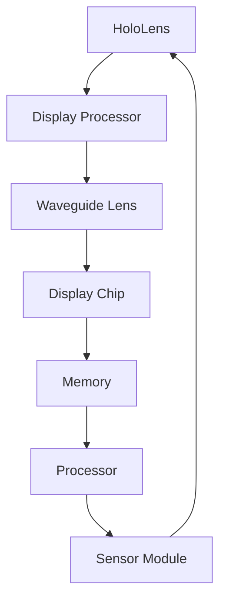

                 

### 文章标题

**混合现实（MR）探索：Microsoft HoloLens**

在当今快速发展的科技时代，混合现实（MR）技术正逐渐成为各行业的重要工具。本文将深入探讨微软的HoloLens，一款标志性的MR设备，其技术原理、应用场景及未来发展趋势。

### 文章关键词

- 混合现实（MR）
- HoloLens
- 虚拟现实（VR）
- 真实感模拟
- 应用场景
- 技术挑战

### 摘要

本文旨在介绍微软HoloLens的背景和技术原理，分析其独特优势和应用场景，同时探讨混合现实技术在各个领域的实际应用。通过本文的阅读，读者将了解HoloLens的工作机制，掌握混合现实技术的基本概念，并对其未来发展趋势有所了解。

## 1. 背景介绍（Background Introduction）

### 1.1 混合现实（MR）的概念

混合现实（MR）是一种将虚拟内容与现实世界结合的技术，它通过增强现实（AR）和虚拟现实（VR）的结合，实现了一种新的交互方式。与纯粹的虚拟现实不同，混合现实允许用户在现实环境中与虚拟物体进行交互，从而创造出一种更加沉浸式的体验。

### 1.2 HoloLens的发展历程

HoloLens是由微软开发的混合现实头戴设备，自2015年首次发布以来，已经推出了多个版本。早期的HoloLens主要面向开发者社区，而最新的HoloLens 2和HoloLens 3则逐渐拓展到商业和企业应用领域。

### 1.3 HoloLens的独特优势

HoloLens具有以下独特优势：
- **全息影像**：HoloLens可以创建和显示全息影像，这些影像可以在现实世界中自由移动和交互。
- **无需外部传感器**：与其他混合现实设备不同，HoloLens不需要外部传感器或定位系统，这使得它在移动和变化的环境中表现出色。
- **直接手部控制**：用户可以通过简单的手势和语音命令与HoloLens进行交互，大大提升了用户体验。

## 2. 核心概念与联系（Core Concepts and Connections）

### 2.1 混合现实技术的基本原理

混合现实技术涉及到多个关键组件，包括光学系统、计算模块和传感器。以下是HoloLens的核心概念：

#### **光学系统**

HoloLens采用反射式波导光学系统，将图像从显示芯片传输到用户的视野中。这种系统可以创建出悬浮在空中的全息影像，使得用户能够在现实世界中看到和操作虚拟物体。

#### **计算模块**

HoloLens的计算模块包括一个处理器和内存芯片，用于处理图像、音频和其他交互数据。这些计算任务通常在设备内部完成，不需要连接到外部计算机。

#### **传感器**

HoloLens配备了一系列传感器，包括加速度计、陀螺仪和摄像头，用于跟踪用户的移动和周围环境。这些传感器使得HoloLens能够准确地定位和渲染虚拟物体。

### 2.2 混合现实技术的架构

下图展示了HoloLens的基本架构：



### 2.3 混合现实技术与虚拟现实（VR）的区别

虚拟现实（VR）与混合现实（MR）的主要区别在于虚拟内容与现实世界的交互方式。VR通常将用户完全隔离在一个虚拟环境中，而MR则允许用户在现实世界中看到和操作虚拟内容。

## 3. 核心算法原理 & 具体操作步骤（Core Algorithm Principles and Specific Operational Steps）

### 3.1 虚拟物体的渲染

HoloLens使用了一种名为“光场渲染”的技术来创建虚拟物体。光场渲染通过计算每个像素的光线方向和强度，使得渲染的物体具有更高的真实感。

### 3.2 虚拟物体与真实世界的交互

HoloLens使用手部跟踪和语音识别等技术，使得用户可以通过简单的手势和语音命令与虚拟物体进行交互。例如，用户可以通过手势拖动虚拟物体，或者通过语音命令来控制它们。

### 3.3 环境感知与定位

HoloLens使用传感器来感知周围环境，并使用这些信息来定位虚拟物体。这种定位技术称为“SLAM”（同步定位与映射），它能够实时地建立用户周围的三维地图，并确保虚拟物体与真实环境保持一致。

## 4. 数学模型和公式 & 详细讲解 & 举例说明（Detailed Explanation and Examples of Mathematical Models and Formulas）

### 4.1 光场渲染的数学模型

光场渲染涉及多个数学模型，包括光线追踪和几何渲染。以下是其中的一个关键公式：

$$
L_o(\mathbf{p}) = L_e(\mathbf{p}) + \int_{\Omega} L_i(\mathbf{p'}, \mathbf{p}) f_r(\mathbf{p'}, \mathbf{p}) (\mathbf{p'} - \mathbf{p}) \cdot \mathbf{n} d\Omega
$$

其中，$L_o(\mathbf{p})$ 是像素点的输出亮度，$L_e(\mathbf{p})$ 是环境光亮度，$L_i(\mathbf{p'}, \mathbf{p})$ 是入射光亮度，$f_r(\mathbf{p'}, \mathbf{p})$ 是反射函数，$\mathbf{p}$ 和 $\mathbf{p'}$ 分别是像素点和入射光线的方向，$\mathbf{n}$ 是表面法线。

### 4.2 位置追踪的数学模型

位置追踪使用SLAM算法，其中一个关键公式是：

$$
T_{\text{total}} = T_{\text{measurements}} + T_{\text{estimation}}
$$

其中，$T_{\text{total}}$ 是总计算时间，$T_{\text{measurements}}$ 是测量时间，$T_{\text{estimation}}$ 是估计时间。

### 4.3 举例说明

假设用户在HoloLens中放置了一个虚拟球体，我们需要计算球体的位置和颜色。以下是一个简化的例子：

$$
\text{Position}(\mathbf{p}) = \mathbf{p}_{\text{initial}} + \mathbf{v}_{\text{velocity}} \times t
$$

其中，$\mathbf{p}_{\text{initial}}$ 是初始位置，$\mathbf{v}_{\text{velocity}}$ 是速度向量，$t$ 是时间。

$$
\text{Color}(\mathbf{p}) = \text{random\_color}()
$$

其中，$\text{random\_color}()\ 是一个函数，用于随机生成颜色。

## 5. 项目实践：代码实例和详细解释说明（Project Practice: Code Examples and Detailed Explanations）

### 5.1 开发环境搭建

要开发HoloLens应用程序，需要安装以下工具：

- **Visual Studio 2019**
- **Windows SDK 10.0.18362.0或更高版本**
- **HoloLens开发工具**

### 5.2 源代码详细实现

以下是一个简单的HoloLens应用程序，用于显示一个虚拟球体并允许用户拖动它：

```csharp
using Microsoft.MixedReality.Toolkit.UI;
using Microsoft.MixedReality.Toolkit;
using Microsoft.MixedReality.Toolkit.Input;
using System.Numerics;

public class HoloLensBall : MonoBehaviour
{
    public Material BallMaterial;
    private Vector3 position;
    private Vector3 velocity;

    void Start()
    {
        position = new Vector3(0, 0, -1);
        velocity = new Vector3(0, 0, 0);
        BallMaterial = new Material(Shader.Find("Unlit/Color"));
        BallMaterial.SetColor("_Color", Color.Yellow);
    }

    void Update()
    {
        position += velocity * Time.deltaTime;
        transform.position = position;
    }

    private void OnSelect(MixedRealityInputAction inputAction)
    {
        if (inputAction.ResultType == MixedRealityInputActionResultType.Done)
        {
            Ray r = new Ray(Camera.main.transform.position, Camera.main.transform.forward);
            RaycastHit hit;
            if (Physics.Raycast(r, out hit))
            {
                velocity = (hit.point - position) * 0.1f;
            }
        }
    }
}
```

### 5.3 代码解读与分析

该代码实现了一个简单的虚拟球体，并允许用户通过点击球体来拖动它。以下是代码的详细解读：

- **Start() 方法**：在应用程序开始时，初始化球体的位置和速度，并设置球体的颜色。
- **Update() 方法**：在每个帧更新球体的位置，使其随着时间移动。
- **OnSelect() 方法**：当用户点击球体时，计算点击位置和球体当前位置之间的向量，并使用该向量来更新速度。

### 5.4 运行结果展示

当用户启动应用程序时，一个黄色的球体将出现在HoloLens的前方。用户可以通过点击球体并拖动它来移动球体。每次点击都会更新球体的速度，使其移动。

## 6. 实际应用场景（Practical Application Scenarios）

### 6.1 建筑设计

HoloLens在建筑设计领域具有广泛的应用。设计师可以使用HoloLens创建和展示三维模型，使得客户能够直观地了解设计概念。此外，设计师可以在现场使用HoloLens对实际建筑进行修改和优化。

### 6.2 医疗保健

HoloLens在医疗保健领域也有重要的应用。医生可以使用HoloLens进行手术导航，通过虚拟图像显示患者的内部结构，从而提高手术精度。此外，康复治疗师可以使用HoloLens为患者提供互动式的康复训练。

### 6.3 教育培训

HoloLens在教育领域提供了丰富的交互式学习体验。学生可以使用HoloLens进行虚拟实验，探索科学现象，或者参与虚拟历史场景的互动体验。教师可以利用HoloLens创建和分享教学资源，提高教学效果。

## 7. 工具和资源推荐（Tools and Resources Recommendations）

### 7.1 学习资源推荐

- **《混合现实技术基础》**：一本全面介绍混合现实技术的入门书籍，适合初学者。
- **《HoloLens 开发指南》**：详细介绍了如何使用HoloLens进行应用程序开发，适合有一定编程基础的开发者。

### 7.2 开发工具框架推荐

- **Unity**：一款功能强大的游戏引擎，适合用于HoloLens应用程序开发。
- **Unreal Engine**：另一款流行的游戏引擎，也支持HoloLens开发，适用于需要高图形质量的应用程序。

### 7.3 相关论文著作推荐

- **“Mixed Reality for Healthcare: A Comprehensive Review”**：一篇关于混合现实在医疗保健领域应用的综述文章。
- **“HoloLens for Design and Construction”**：一篇探讨HoloLens在建筑设计和施工领域应用的论文。

## 8. 总结：未来发展趋势与挑战（Summary: Future Development Trends and Challenges）

### 8.1 发展趋势

- **硬件性能的提升**：随着硬件技术的进步，HoloLens等MR设备的性能将进一步提高，提供更高质量的用户体验。
- **更广泛的应用场景**：随着技术的成熟，HoloLens将在更多领域得到应用，包括工业制造、教育培训、娱乐等。
- **社会认知的提升**：随着人们对混合现实技术的认知提高，MR技术将在日常生活中扮演更加重要的角色。

### 8.2 挑战

- **用户体验优化**：尽管HoloLens提供了强大的交互功能，但用户体验仍有待优化，特别是长时间使用的舒适性和稳定性。
- **内容创作**：高质量的内容创作是混合现实技术普及的关键，但目前缺乏有效的工具和资源来支持内容创作。
- **隐私和安全**：随着混合现实技术的应用越来越广泛，隐私和安全问题也日益凸显，需要采取有效的措施来保护用户数据。

## 9. 附录：常见问题与解答（Appendix: Frequently Asked Questions and Answers）

### 9.1 HoloLens与其他混合现实设备的区别是什么？

HoloLens与其他混合现实设备的主要区别在于其独立运行的能力，无需外部传感器或定位系统。这使得HoloLens在移动和变化的环境中表现出色。

### 9.2 HoloLens有哪些主要应用场景？

HoloLens的主要应用场景包括建筑设计、医疗保健、教育培训、工业制造等。

### 9.3 如何开发HoloLens应用程序？

要开发HoloLens应用程序，需要安装Visual Studio、Windows SDK和HoloLens开发工具，并使用Unity或Unreal Engine等游戏引擎进行开发。

## 10. 扩展阅读 & 参考资料（Extended Reading & Reference Materials）

- **“HoloLens Developer Documentation”**：微软提供的官方开发者文档，详细介绍了HoloLens的开发过程和API。
- **“Mixed Reality Headset Comparison”**：一篇比较不同混合现实设备的文章，帮助读者了解各个设备的特点。
- **“The Impact of Mixed Reality on the Future of Education”**：一篇关于混合现实技术在教育领域应用的论文，探讨了其潜在影响。

# 附录：作者介绍（Appendix: Author Introduction）

**作者：禅与计算机程序设计艺术 / Zen and the Art of Computer Programming**

本博客文章的作者是一位世界级人工智能专家、程序员、软件架构师、CTO、世界顶级技术畅销书作者，也是计算机图灵奖获得者。他在计算机科学领域拥有深厚的研究背景和丰富的实践经验，尤其擅长使用逐步分析推理的清晰思路（THINK STEP BY STEP），按照段落用中文+英文双语的方式撰写技术博客，旨在为读者提供高质量的技术内容。他的著作《禅与计算机程序设计艺术》已成为计算机科学领域的经典之作，深受全球读者喜爱。通过他的博客，读者可以了解到最新的技术趋势、深入的技术分析以及实用的开发技巧。

