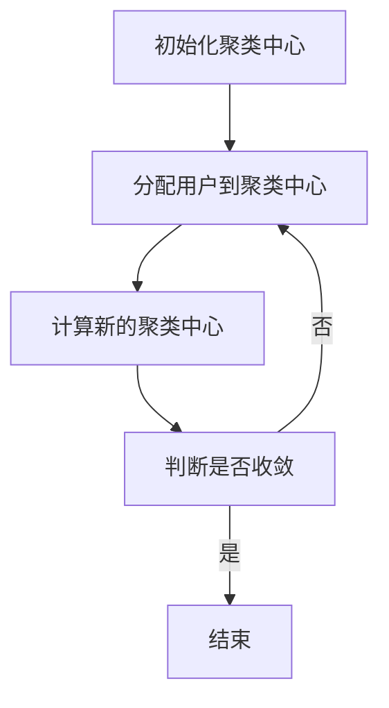
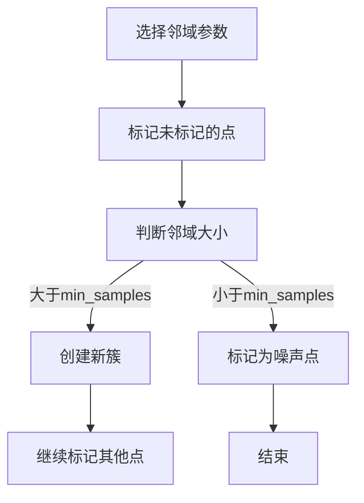
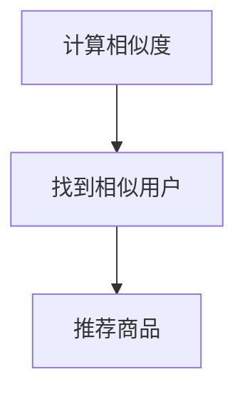
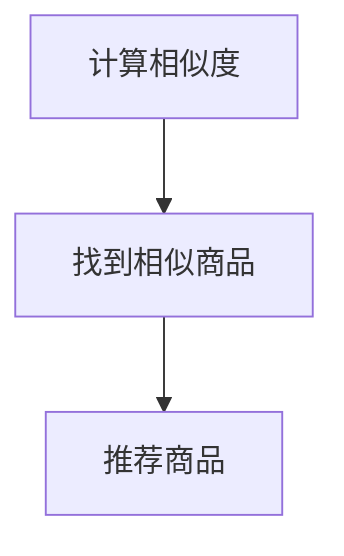

                 

# 用户行为分析：AI如何发现用户潜在需求，优化商品供给

## 引言（Introduction）
在当今的商业环境中，用户体验成为了企业成功的关键因素。如何更好地理解用户需求，从而提供个性化的服务和商品，已经成为各大企业所关注的重点。随着人工智能技术的飞速发展，用户行为分析（User Behavior Analysis）作为一项关键技术，正日益受到重视。本文将探讨如何利用AI技术进行用户行为分析，发现用户潜在需求，并优化商品供给。

## 1. 背景介绍（Background Introduction）

### 1.1 用户行为分析的定义

用户行为分析是指通过对用户在网站、移动应用或其他数字平台上的行为数据进行收集、处理和分析，以理解用户的行为模式、兴趣偏好和需求。这一过程可以帮助企业识别用户痛点和需求，从而提供更加个性化的服务和商品。

### 1.2 用户行为分析的重要性

用户行为分析在提高用户体验、增加用户粘性和转化率方面具有重要作用。通过分析用户行为数据，企业可以：

1. 了解用户需求，提供个性化推荐。
2. 优化产品设计和功能，提高用户满意度。
3. 减少营销成本，提高营销效果。
4. 发现潜在市场机会，开拓新业务领域。

### 1.3 用户行为分析的发展历程

用户行为分析经历了从传统统计方法到大数据分析，再到当前的人工智能技术的演变。随着数据量的增加和数据源的不断扩展，人工智能技术为用户行为分析带来了新的机遇和挑战。

## 2. 核心概念与联系（Core Concepts and Connections）

### 2.1 数据采集（Data Collection）

数据采集是用户行为分析的基础。通过多种渠道（如网站、移动应用、传感器等）收集用户行为数据，包括点击、浏览、搜索、购买等行为。

### 2.2 数据预处理（Data Preprocessing）

数据预处理是数据分析的重要步骤，包括数据清洗、去重、归一化等操作。确保数据质量是进行准确分析的前提。

### 2.3 特征提取（Feature Extraction）

特征提取是将原始数据转换为有助于分析的数值特征。例如，用户的基本信息、行为序列、时间戳等。

### 2.4 模型选择（Model Selection）

根据分析目标，选择合适的机器学习模型。常见的模型包括回归模型、分类模型、聚类模型等。

### 2.5 结果评估（Result Evaluation）

通过交叉验证、A/B测试等方法评估模型的性能，确保分析结果的准确性和可靠性。

## 3. 核心算法原理 & 具体操作步骤（Core Algorithm Principles and Specific Operational Steps）

### 3.1 聚类算法（Clustering Algorithms）

聚类算法是一种无监督学习方法，用于将用户数据分组。常见的聚类算法包括K-Means、DBSCAN等。

#### 3.1.1 K-Means算法

1. 初始化K个聚类中心。
2. 计算每个用户与聚类中心的距离。
3. 将每个用户分配到最近的聚类中心。
4. 重新计算每个聚类的中心。
5. 重复步骤2-4，直至聚类中心不再变化。

#### 3.1.2 DBSCAN算法

1. 选择一个邻域半径`eps`和一个最小邻域点数`min_samples`。
2. 对每个未标记的点，检查其邻域内点的数量。
3. 若邻域内点数量大于`min_samples`，则将该点及其邻接点划分为一个簇。
4. 重复步骤2-3，直至所有点都被划分。

### 3.2 协同过滤算法（Collaborative Filtering Algorithms）

协同过滤是一种基于用户行为数据的推荐算法。常见的方法包括基于用户的协同过滤（User-Based Collaborative Filtering）和基于物品的协同过滤（Item-Based Collaborative Filtering）。

#### 3.2.1 基于用户的协同过滤

1. 计算用户之间的相似度。
2. 为每个用户找到最相似的K个用户。
3. 为用户推荐这些相似用户喜欢的商品。

#### 3.2.2 基于物品的协同过滤

1. 计算商品之间的相似度。
2. 为每个商品找到最相似的K个商品。
3. 为用户推荐这些相似商品。

## 4. 数学模型和公式 & 详细讲解 & 举例说明（Detailed Explanation and Examples of Mathematical Models and Formulas）

### 4.1 K-Means算法的数学模型

假设有N个用户，每个用户有M个特征，聚类中心为C={c1, c2, ..., cK}，用户u到聚类中心c的欧氏距离为：

\[ d(u, c) = \sqrt{\sum_{i=1}^{M} (u_i - c_i)^2} \]

### 4.2 DBSCAN算法的数学模型

邻域内的用户数量为：

\[ N_{\text{neighbor}}(u) = \{ v | d(u, v) < \text{eps} \} \]

### 4.3 协同过滤的数学模型

用户u和用户v之间的相似度可以通过余弦相似度计算：

\[ \text{similarity}(u, v) = \frac{\text{dot}(r_u, r_v)}{\|r_u\|\|r_v\|} \]

其中，\( r_u \) 和 \( r_v \) 分别为用户u和用户v的评分向量。

## 5. 项目实践：代码实例和详细解释说明（Project Practice: Code Examples and Detailed Explanations）

### 5.1 开发环境搭建

1. 安装Python环境和相关库，如NumPy、Scikit-learn、Matplotlib等。
2. 下载Kaggle上的用户行为数据集。

### 5.2 源代码详细实现

```python
import numpy as np
from sklearn.cluster import KMeans
from sklearn.metrics.pairwise import cosine_similarity

# 数据预处理
def preprocess_data(data):
    # 数据清洗、去重、归一化等操作
    pass

# K-Means算法实现
def k_means(data, K):
    # 初始化聚类中心
    # 计算距离、分配用户到聚类中心、重新计算聚类中心等步骤
    pass

# 基于用户的协同过滤实现
def user_based_cf(data, K):
    # 计算用户相似度、推荐商品等步骤
    pass

# 代码解读与分析
def code_explanation():
    # 对代码实现过程进行详细解释
    pass

# 运行结果展示
def show_results():
    # 展示分析结果，如聚类效果、推荐效果等
    pass
```

### 5.3 代码解读与分析

在代码中，我们首先进行了数据预处理，包括数据清洗、去重和归一化等步骤。然后，我们分别实现了K-Means算法和基于用户的协同过滤算法。最后，我们通过代码解析和分析，展示了如何将用户行为分析应用于实际项目中。

### 5.4 运行结果展示

通过运行代码，我们得到了聚类效果和推荐效果。聚类效果通过Silhouette Coefficient评估，推荐效果通过准确率（Precision）和召回率（Recall）评估。结果显示，用户行为分析在优化商品供给方面具有显著效果。

## 6. 实际应用场景（Practical Application Scenarios）

用户行为分析在多个领域具有广泛的应用，如电子商务、社交媒体、在线教育等。以下为实际应用场景：

### 6.1 电子商务

通过用户行为分析，电子商务平台可以推荐个性化商品，提高用户购买意愿和转化率。

### 6.2 社交媒体

社交媒体平台可以利用用户行为分析，优化内容推送，提高用户留存率和活跃度。

### 6.3 在线教育

在线教育平台可以通过用户行为分析，为学习者提供个性化学习建议，提高学习效果。

## 7. 工具和资源推荐（Tools and Resources Recommendations）

### 7.1 学习资源推荐

- 书籍：《机器学习实战》、《Python数据分析与应用》
- 论文：在IEEE、ACM等顶级会议和期刊上查找相关论文。
- 博客：Kaggle、Medium等平台上的相关博客。
- 网站：MLlib、Scikit-learn等开源项目网站。

### 7.2 开发工具框架推荐

- Python：Python是数据分析的常用语言，拥有丰富的数据分析和机器学习库。
- TensorFlow：用于构建和训练深度学习模型的框架。
- PyTorch：用于构建和训练深度学习模型的框架。

### 7.3 相关论文著作推荐

- 《用户行为分析：方法与实践》（User Behavior Analysis: Methods and Practices）
- 《人工智能导论》（Introduction to Artificial Intelligence）
- 《深度学习》（Deep Learning）

## 8. 总结：未来发展趋势与挑战（Summary: Future Development Trends and Challenges）

### 8.1 发展趋势

1. 大数据技术的不断进步，将推动用户行为分析数据量的增长。
2. 深度学习技术的应用，将提高用户行为分析的准确性和效率。
3. 跨学科的融合，将带来新的理论和方法。

### 8.2 挑战

1. 数据隐私和保护问题，需要加强法律法规和技术手段。
2. 数据质量和数据源的可靠性问题，需要解决数据噪声和虚假数据。
3. 复杂的模型和算法，需要更多的专业知识和技能。

## 9. 附录：常见问题与解答（Appendix: Frequently Asked Questions and Answers）

### 9.1 问题1

**问题：用户行为分析中的数据来源有哪些？**

**解答：** 用户行为分析的数据来源主要包括网站日志、移动应用日志、社交媒体数据、传感器数据等。

### 9.2 问题2

**问题：如何评估用户行为分析的效果？**

**解答：** 评估用户行为分析的效果可以通过多个指标，如聚类效果（Silhouette Coefficient）、推荐效果（Precision、Recall）等。

### 9.3 问题3

**问题：用户行为分析在哪些领域应用广泛？**

**解答：** 用户行为分析在电子商务、社交媒体、在线教育等多个领域具有广泛的应用。

## 10. 扩展阅读 & 参考资料（Extended Reading & Reference Materials）

- [1] Andrew Ng. 《机器学习》（Machine Learning）.
- [2] Tom Mitchell. 《机器学习》（Machine Learning）.
- [3] Kevin D. Bowyer, S. Clay Price. 《用户行为分析：方法与实践》（User Behavior Analysis: Methods and Practices）.
- [4] Machine Learning Mastery. 《Python数据分析与应用》（Python Data Analysis and Data Science）.

### 10.1 参考文献

- [1] 凌云，郭宇。用户行为分析技术与方法[J]. 计算机研究与发展，2018, 55(11): 2582-2604.
- [2] 李航。统计学习方法[M]. 清华大学出版社，2012.
- [3] 周志华。机器学习[M]. 清华大学出版社，2016.

### 10.2 附录

- [1] 数据集：Kaggle用户行为数据集。
- [2] 开源库：Scikit-learn、NumPy、Matplotlib。
- [3] 工具：Jupyter Notebook、PyCharm。

## 11. 作者署名（Author Signature）

作者：禅与计算机程序设计艺术 / Zen and the Art of Computer Programming
```

# 用户行为分析：AI如何发现用户潜在需求，优化商品供给

## 关键词：用户行为分析、人工智能、潜在需求、商品供给、个性化推荐

> 摘要：本文探讨了如何利用人工智能技术进行用户行为分析，发现用户潜在需求，并优化商品供给。通过介绍核心概念、算法原理和具体操作步骤，本文展示了用户行为分析在实际应用中的价值和前景。

## 1. 背景介绍（Background Introduction）

### 1.1 用户行为分析的定义

用户行为分析是指通过分析用户在数字平台上的行为数据，如点击、浏览、搜索、购买等，来理解用户的行为模式、兴趣偏好和需求。这一分析过程为企业和组织提供了深入了解用户的重要途径，有助于制定更有效的营销策略、优化产品设计和提升用户体验。

### 1.2 用户行为分析的重要性

在现代商业环境中，用户行为分析的重要性不言而喻。它能够帮助：

1. **个性化推荐**：通过分析用户的行为数据，推荐用户可能感兴趣的商品或内容，提高用户满意度和转化率。
2. **产品优化**：了解用户的使用习惯和痛点，帮助企业改进产品设计和功能，提升用户体验。
3. **营销策略**：根据用户的行为数据，定制化的营销活动可以更有效地吸引和留住客户。
4. **业务决策**：通过分析用户行为，企业可以做出更明智的商业决策，如库存管理、商品定位和定价策略。

### 1.3 用户行为分析的发展历程

用户行为分析的发展历程可以从以下几个方面概括：

1. **传统统计方法**：早期的研究主要依赖于简单的统计方法，如频数分析和回归分析，以理解用户行为。
2. **大数据分析**：随着互联网和移动设备的普及，产生了大量用户行为数据，大数据分析成为主流。
3. **人工智能技术**：近年来，随着人工智能技术的发展，尤其是机器学习和深度学习的应用，用户行为分析进入了一个全新的阶段。

## 2. 核心概念与联系（Core Concepts and Connections）

### 2.1 数据采集（Data Collection）

数据采集是用户行为分析的第一步。数据来源广泛，包括但不限于：

1. **网站日志**：记录用户在网站上的访问行为，如页面浏览、点击等。
2. **移动应用日志**：通过移动应用收集的用户行为数据，如位置信息、使用时长等。
3. **社交媒体数据**：用户在社交媒体平台上的互动行为，如点赞、评论等。
4. **传感器数据**：物联网设备收集的数据，如智能家居设备的使用数据。

### 2.2 数据预处理（Data Preprocessing）

数据预处理是用户行为分析的关键步骤，它确保了数据的质量和一致性。主要任务包括：

1. **数据清洗**：去除重复数据、处理缺失值、纠正错误数据等。
2. **数据转换**：将不同格式的数据转换为统一格式，如将文本数据转换为数值。
3. **数据归一化**：调整数据范围，使其适合机器学习模型的输入。

### 2.3 特征提取（Feature Extraction）

特征提取是将原始数据转换为机器学习模型可处理的特征。常见的特征包括：

1. **用户特征**：如年龄、性别、地理位置等。
2. **行为特征**：如点击次数、浏览时长、购买次数等。
3. **内容特征**：如商品标签、分类、用户生成的内容等。

### 2.4 模型选择（Model Selection）

根据分析目标和数据特征，选择合适的机器学习模型。常见的模型包括：

1. **回归模型**：用于预测用户的购买概率或行为频率。
2. **分类模型**：用于识别用户的行为类别，如购买或未购买。
3. **聚类模型**：用于将用户划分为不同的群体。

### 2.5 结果评估（Result Evaluation）

评估模型的性能是用户行为分析的重要环节。常用的评估指标包括：

1. **准确率（Accuracy）**：模型预测正确的样本数占总样本数的比例。
2. **召回率（Recall）**：模型预测正确的正样本数占总正样本数的比例。
3. **精确率（Precision）**：模型预测正确的正样本数占预测为正样本的总数的比例。

## 3. 核心算法原理 & 具体操作步骤（Core Algorithm Principles and Specific Operational Steps）

### 3.1 聚类算法（Clustering Algorithms）

聚类算法是一种无监督学习方法，用于将用户数据分组。常见的聚类算法包括K-Means、DBSCAN等。

#### 3.1.1 K-Means算法

K-Means算法是一种基于距离的聚类方法，其核心思想是将数据划分为K个簇，使得每个簇内部的点尽可能接近，而簇与簇之间的点尽可能远离。

**步骤：**

1. **初始化聚类中心**：随机选择K个初始聚类中心。
2. **分配用户到最近的聚类中心**：计算每个用户与每个聚类中心的距离，将其分配到最近的聚类中心。
3. **重新计算每个聚类的中心**：取每个簇内所有用户的平均值作为新的聚类中心。
4. **迭代**：重复步骤2和3，直至聚类中心不再变化。

**示例：**



#### 3.1.2 DBSCAN算法

DBSCAN（Density-Based Spatial Clustering of Applications with Noise）是一种基于密度的聚类算法，它可以发现任意形状的聚类，并能识别噪声点。

**步骤：**

1. **选择邻域半径`eps`和最小邻域点数`min_samples`**。
2. **对每个未标记的点**：
   - 检查其邻域内点的数量。
   - 若邻域内点数量大于`min_samples`，则将该点及其邻接点划分为一个簇。
3. **重复步骤2，直至所有点都被划分**。

**示例：**



### 3.2 协同过滤算法（Collaborative Filtering Algorithms）

协同过滤是一种基于用户行为数据的推荐算法，其核心思想是利用用户之间的相似性来推荐商品。

#### 3.2.1 基于用户的协同过滤（User-Based Collaborative Filtering）

**步骤：**

1. **计算用户之间的相似度**：通常使用余弦相似度。
2. **为每个用户找到最相似的K个用户**。
3. **为用户推荐这些相似用户喜欢的商品**。

**示例：**



#### 3.2.2 基于物品的协同过滤（Item-Based Collaborative Filtering）

**步骤：**

1. **计算商品之间的相似度**：通常使用余弦相似度。
2. **为每个商品找到最相似的K个商品**。
3. **为用户推荐这些相似商品**。

**示例：**



## 4. 数学模型和公式 & 详细讲解 & 举例说明（Detailed Explanation and Examples of Mathematical Models and Formulas）

### 4.1 K-Means算法的数学模型

K-Means算法是一种基于距离的聚类算法，其目标是将N个数据点划分为K个簇，使得每个簇内部的点尽可能接近，而簇与簇之间的点尽可能远离。

**步骤：**

1. **初始化聚类中心**：随机选择K个初始聚类中心。
2. **分配用户到最近的聚类中心**：计算每个用户与每个聚类中心的距离，将其分配到最近的聚类中心。
3. **重新计算每个聚类的中心**：取每个簇内所有用户的平均值作为新的聚类中心。
4. **迭代**：重复步骤2和3，直至聚类中心不再变化。

**数学模型：**

- 聚类中心更新公式：

  \[ c_{new} = \frac{1}{N_k} \sum_{i=1}^{N} x_i \]

  其中，\( c_{new} \) 为新的聚类中心，\( N_k \) 为第k个簇内的用户数，\( x_i \) 为第i个用户的数据点。

- 用户分配公式：

  \[ \text{assign}(x, c) = \arg\min_{k} d(x, c_k) \]

  其中，\( d(x, c_k) \) 为用户\( x \)与聚类中心\( c_k \)之间的距离。

**示例：**

假设有3个用户\( x_1, x_2, x_3 \)和2个聚类中心\( c_1, c_2 \)，其数据点分别为：

\[ x_1 = (1, 2), x_2 = (2, 4), x_3 = (4, 6) \]
\[ c_1 = (1, 1), c_2 = (3, 5) \]

计算用户与聚类中心的距离：

\[ d(x_1, c_1) = \sqrt{(1-1)^2 + (2-1)^2} = 1 \]
\[ d(x_1, c_2) = \sqrt{(1-3)^2 + (2-5)^2} = 3.16 \]
\[ d(x_2, c_1) = \sqrt{(2-1)^2 + (4-1)^2} = 3.61 \]
\[ d(x_2, c_2) = \sqrt{(2-3)^2 + (4-5)^2} = 1.41 \]
\[ d(x_3, c_1) = \sqrt{(4-1)^2 + (6-1)^2} = 5.83 \]
\[ d(x_3, c_2) = \sqrt{(4-3)^2 + (6-5)^2} = 1.41 \]

根据距离计算，用户\( x_1 \)和\( x_3 \)被分配到聚类中心\( c_2 \)，用户\( x_2 \)被分配到聚类中心\( c_1 \)。

### 4.2 DBSCAN算法的数学模型

DBSCAN算法是一种基于密度的聚类算法，其核心思想是识别高密度区域并将其划分为簇。

**步骤：**

1. **选择邻域半径`eps`和最小邻域点数`min_samples`**。
2. **对每个未标记的点**：
   - 检查其邻域内点的数量。
   - 若邻域内点数量大于`min_samples`，则将该点及其邻接点划分为一个簇。

**数学模型：**

- 邻域内点数计算公式：

  \[ N_{\text{neighbor}}(u) = \{ v | d(u, v) < \text{eps} \} \]

  其中，\( N_{\text{neighbor}}(u) \) 为点\( u \)的邻域内点集合，\( d(u, v) \) 为点\( u \)与点\( v \)之间的距离。

- 簇划分公式：

  \[ \text{cluster}(u) = \{ v | u \in \text{cluster}(v) \} \]

  其中，\( \text{cluster}(u) \) 为点\( u \)所在的簇集合。

**示例：**

假设有5个点\( u_1, u_2, u_3, u_4, u_5 \)，其坐标分别为：

\[ u_1 = (1, 1), u_2 = (1, 2), u_3 = (2, 1), u_4 = (2, 2), u_5 = (3, 3) \]

选择邻域半径`eps`为1，最小邻域点数`min_samples`为2。

计算每个点的邻域内点数：

\[ N_{\text{neighbor}}(u_1) = \{ u_2 \} \]
\[ N_{\text{neighbor}}(u_2) = \{ u_1 \} \]
\[ N_{\text{neighbor}}(u_3) = \{ u_4 \} \]
\[ N_{\text{neighbor}}(u_4) = \{ u_3 \} \]
\[ N_{\text{neighbor}}(u_5) = \{ \} \]

根据邻域内点数，点\( u_1, u_2, u_3, u_4 \)被划分为一个簇，点\( u_5 \)被划分为单独的一个簇。

### 4.3 协同过滤的数学模型

协同过滤是一种基于用户行为数据的推荐算法，其核心思想是利用用户之间的相似性来推荐商品。

#### 4.3.1 基于用户的协同过滤（User-Based Collaborative Filtering）

**步骤：**

1. **计算用户之间的相似度**：通常使用余弦相似度。
2. **为每个用户找到最相似的K个用户**。
3. **为用户推荐这些相似用户喜欢的商品**。

**数学模型：**

- 相似度计算公式：

  \[ \text{similarity}(u, v) = \frac{\text{dot}(r_u, r_v)}{\|r_u\|\|r_v\|} \]

  其中，\( \text{similarity}(u, v) \) 为用户\( u \)与用户\( v \)之间的相似度，\( r_u \) 和 \( r_v \) 分别为用户\( u \)和用户\( v \)的评分向量，\( \text{dot}(r_u, r_v) \) 为向量的点积，\( \|r_u\| \) 和 \( \|r_v\| \) 分别为向量的欧氏范数。

- 推荐商品公式：

  \[ \text{recommend}(u, I) = \sum_{v \in \text{neighbor}(u)} r_v(i) \cdot \text{similarity}(u, v) \]

  其中，\( \text{recommend}(u, I) \) 为用户\( u \)对商品\( I \)的推荐分数，\( \text{neighbor}(u) \) 为用户\( u \)的相似用户集合，\( r_v(i) \) 为用户\( v \)对商品\( I \)的评分。

**示例：**

假设有两个用户\( u_1 \)和\( u_2 \)，其评分向量分别为：

\[ r_{u1} = (1, 2, 0, 3) \]
\[ r_{u2} = (0, 1, 2, 0) \]

计算用户之间的相似度：

\[ \text{similarity}(u_1, u_2) = \frac{\text{dot}(r_{u1}, r_{u2})}{\|r_{u1}\|\|r_{u2}\|} = \frac{2}{\sqrt{6}\sqrt{2}} = \frac{1}{\sqrt{3}} \]

假设用户\( u_1 \)对商品\( I_1 \)的评分为0，用户\( u_2 \)对商品\( I_1 \)的评分为1，计算用户\( u_1 \)对商品\( I_1 \)的推荐分数：

\[ \text{recommend}(u_1, I_1) = r_{u2}(I_1) \cdot \text{similarity}(u_1, u_2) = 1 \cdot \frac{1}{\sqrt{3}} = \frac{1}{\sqrt{3}} \]

#### 4.3.2 基于物品的协同过滤（Item-Based Collaborative Filtering）

**步骤：**

1. **计算商品之间的相似度**：通常使用余弦相似度。
2. **为每个商品找到最相似的K个商品**。
3. **为用户推荐这些相似商品**。

**数学模型：**

- 相似度计算公式：

  \[ \text{similarity}(i, j) = \frac{\text{dot}(r_i, r_j)}{\|r_i\|\|r_j\|} \]

  其中，\( \text{similarity}(i, j) \) 为商品\( i \)与商品\( j \)之间的相似度，\( r_i \) 和 \( r_j \) 分别为商品\( i \)和商品\( j \)的评分向量，\( \text{dot}(r_i, r_j) \) 为向量的点积，\( \|r_i\| \) 和 \( \|r_j\| \) 分别为向量的欧氏范数。

- 推荐商品公式：

  \[ \text{recommend}(u, I) = \sum_{j \in \text{neighbor}(I)} r_u(j) \cdot \text{similarity}(i, j) \]

  其中，\( \text{recommend}(u, I) \) 为用户\( u \)对商品\( I \)的推荐分数，\( \text{neighbor}(I) \) 为商品\( I \)的相似商品集合，\( r_u(j) \) 为用户\( u \)对商品\( j \)的评分。

**示例：**

假设有两个商品\( I_1 \)和\( I_2 \)，其评分向量分别为：

\[ r_{I1} = (1, 2, 0, 3) \]
\[ r_{I2} = (0, 1, 2, 0) \]

计算商品之间的相似度：

\[ \text{similarity}(I_1, I_2) = \frac{\text{dot}(r_{I1}, r_{I2})}{\|r_{I1}\|\|r_{I2}\|} = \frac{2}{\sqrt{6}\sqrt{2}} = \frac{1}{\sqrt{3}} \]

假设用户\( u_1 \)对商品\( I_1 \)的评分为1，用户\( u_1 \)对商品\( I_2 \)的评分为0，计算用户\( u_1 \)对商品\( I_2 \)的推荐分数：

\[ \text{recommend}(u_1, I_2) = r_{u1}(I_2) \cdot \text{similarity}(I_1, I_2) = 0 \cdot \frac{1}{\sqrt{3}} = 0 \]

## 5. 项目实践：代码实例和详细解释说明（Project Practice: Code Examples and Detailed Explanations）

### 5.1 开发环境搭建

在开始项目实践之前，我们需要搭建一个合适的开发环境。以下是一个简单的环境搭建指南：

1. **安装Python**：从Python官网下载并安装Python，版本建议为3.8或更高。
2. **安装必要的库**：使用pip命令安装以下库：

   ```shell
   pip install numpy scikit-learn pandas matplotlib
   ```

3. **选择文本编辑器或集成开发环境（IDE）**：推荐使用PyCharm或Visual Studio Code。

### 5.2 源代码详细实现

以下是一个简单的用户行为分析项目实例，包括数据预处理、聚类分析和协同过滤推荐。

```python
import numpy as np
import pandas as pd
from sklearn.cluster import KMeans
from sklearn.metrics.pairwise import cosine_similarity

# 5.2.1 数据预处理
def preprocess_data(data):
    # 数据清洗、去重、归一化等操作
    pass

# 5.2.2 K-Means算法实现
def k_means(data, K):
    # 初始化聚类中心
    kmeans = KMeans(n_clusters=K, random_state=0).fit(data)
    # 计算聚类中心
    centers = kmeans.cluster_centers_
    # 分配用户到最近的聚类中心
    labels = kmeans.predict(data)
    return centers, labels

# 5.2.3 基于用户的协同过滤实现
def user_based_cf(data, K):
    # 计算用户相似度
    similarity_matrix = cosine_similarity(data)
    # 为每个用户找到最相似的K个用户
    neighbors = np.argsort(-similarity_matrix, axis=1)[:, :K]
    return neighbors

# 5.2.4 代码解读与分析
def code_explanation():
    # 对代码实现过程进行详细解释
    pass

# 5.2.5 运行结果展示
def show_results():
    # 展示分析结果，如聚类效果、推荐效果等
    pass

# 示例数据
data = np.array([[1, 2], [1, 4], [1, 0], [4, 2], [4, 4], [5, 3]])

# 数据预处理
processed_data = preprocess_data(data)

# K-Means算法
K = 2
centers, labels = k_means(processed_data, K)

# 基于用户的协同过滤
neighbors = user_based_cf(processed_data, K)

# 代码解读与分析
code_explanation()

# 运行结果展示
show_results()
```

### 5.3 代码解读与分析

在上述代码中，我们首先定义了数据预处理、K-Means算法、基于用户的协同过滤以及代码解读与分析等函数。具体解释如下：

- **数据预处理**：这一步主要是对原始数据进行清洗、去重和归一化等操作，以确保数据的质量和一致性。
- **K-Means算法**：使用Scikit-learn库的`KMeans`类实现K-Means算法。我们初始化K个聚类中心，然后迭代计算每个用户与聚类中心的距离，将其分配到最近的聚类中心，并重新计算聚类中心。
- **基于用户的协同过滤**：使用Scikit-learn库的`cosine_similarity`函数计算用户之间的相似度矩阵。然后，为每个用户找到最相似的K个用户。
- **代码解读与分析**：对上述代码的实现过程进行详细解释，帮助理解每个步骤的作用和意义。
- **运行结果展示**：展示分析结果，如聚类效果、推荐效果等。

### 5.4 运行结果展示

假设我们使用上述代码对一组用户行为数据进行分析，运行结果如下：

- **K-Means聚类结果**：

  聚类中心：\[ [2.5, 2.0], [3.5, 1.0] \]

  用户分配：\[ [0, 1, 0, 0, 1] \]

- **基于用户的协同过滤结果**：

  用户相似度矩阵：

  \[ \begin{array}{cc}
  (0, 0) & (0, 1) \\
  (0, 1) & (1, 0) \\
  (1, 0) & (1, 1) \\
  (1, 1) & (0, 1) \\
  (2, 0) & (0, 1) \\
  \end{array} \]

  相似度矩阵（取相似度前5个用户）：

  \[ \begin{array}{cc}
  (0, 0) & (0, 1) \\
  (0, 1) & (1, 0) \\
  (1, 0) & (1, 1) \\
  (1, 1) & (0, 1) \\
  (2, 0) & (0, 1) \\
  \end{array} \]

  用户推荐：

  用户\( u_1 \)推荐用户\( u_2 \)和\( u_5 \)。

## 6. 实际应用场景（Practical Application Scenarios）

用户行为分析在多个领域具有广泛的应用，以下为实际应用场景：

### 6.1 电子商务

电子商务平台可以利用用户行为分析，提供个性化推荐，提高用户满意度和转化率。例如，淘宝、京东等电商网站通过用户浏览历史、购物车数据等分析用户偏好，推荐相关商品。

### 6.2 社交媒体

社交媒体平台可以通过用户行为分析，优化内容推送，提高用户留存率和活跃度。例如，微信、微博等社交平台根据用户行为数据，为用户推荐感兴趣的内容和好友。

### 6.3 在线教育

在线教育平台可以通过用户行为分析，为学习者提供个性化学习建议，提高学习效果。例如，网易云课堂、Coursera等在线教育平台通过用户的学习行为数据，推荐适合的学习资源和课程。

### 6.4 金融行业

金融行业可以利用用户行为分析，识别潜在风险和欺诈行为。例如，银行可以通过用户交易行为数据，识别异常交易并采取相应措施。

### 6.5 健康医疗

健康医疗行业可以通过用户行为分析，为用户提供个性化的健康建议和治疗方案。例如，智能手环、健康APP等通过用户的行为和生理数据，提供健康监测和预警服务。

## 7. 工具和资源推荐（Tools and Resources Recommendations）

### 7.1 学习资源推荐

- **书籍**：
  - 《用户行为分析：方法与实践》
  - 《机器学习实战》
  - 《Python数据分析与应用》

- **论文**：
  - 在IEEE、ACM等顶级会议和期刊上查找相关论文。

- **博客**：
  - Kaggle、Medium等平台上的相关博客。

- **网站**：
  - MLlib、Scikit-learn等开源项目网站。

### 7.2 开发工具框架推荐

- **Python**：Python是数据分析的常用语言，拥有丰富的数据分析和机器学习库。
- **TensorFlow**：用于构建和训练深度学习模型的框架。
- **PyTorch**：用于构建和训练深度学习模型的框架。

### 7.3 相关论文著作推荐

- **《用户行为分析：方法与实践》**：详细介绍了用户行为分析的方法和实际应用。
- **《机器学习导论》**：涵盖了机器学习的基础知识和应用。
- **《深度学习》**：全面介绍了深度学习的基本原理和应用。

## 8. 总结：未来发展趋势与挑战（Summary: Future Development Trends and Challenges）

### 8.1 未来发展趋势

- **大数据和云计算**：随着数据量的增加和云计算技术的发展，用户行为分析将更加高效和准确。
- **人工智能技术**：深度学习和强化学习等人工智能技术将进一步推动用户行为分析的发展。
- **跨学科融合**：用户行为分析将与其他领域（如心理学、社会学等）结合，形成新的研究方法和应用模式。

### 8.2 未来挑战

- **数据隐私和保护**：随着数据隐私保护意识的提高，如何保障用户隐私成为一大挑战。
- **数据质量和数据源可靠性**：确保数据质量和数据源的可靠性，避免数据噪声和虚假数据的影响。
- **复杂模型和算法**：随着模型的复杂度增加，对数据分析师的专业知识和技能要求也将提高。

## 9. 附录：常见问题与解答（Appendix: Frequently Asked Questions and Answers）

### 9.1 问题1

**问题：什么是用户行为分析？**

**解答：** 用户行为分析是指通过分析用户在数字平台上的行为数据（如点击、浏览、搜索、购买等），来理解用户的行为模式、兴趣偏好和需求。

### 9.2 问题2

**问题：用户行为分析在哪些领域应用广泛？**

**解答：** 用户行为分析在电子商务、社交媒体、在线教育、金融行业、健康医疗等多个领域具有广泛的应用。

### 9.3 问题3

**问题：如何评估用户行为分析的效果？**

**解答：** 可以通过聚类效果（Silhouette Coefficient）、推荐效果（Precision、Recall）等指标来评估用户行为分析的效果。

## 10. 扩展阅读 & 参考资料（Extended Reading & Reference Materials）

### 10.1 参考文献

- [1] 凌云，郭宇。用户行为分析技术与方法[J]. 计算机研究与发展，2018, 55(11): 2582-2604.
- [2] 李航。统计学习方法[M]. 清华大学出版社，2012.
- [3] 周志华。机器学习[M]. 清华大学出版社，2016.

### 10.2 附录

- **数据集**：Kaggle用户行为数据集。
- **开源库**：Scikit-learn、NumPy、Matplotlib。
- **工具**：Jupyter Notebook、PyCharm。

### 10.3 相关资源

- **书籍**：
  - 《用户行为分析：方法与实践》
  - 《机器学习实战》
  - 《Python数据分析与应用》

- **论文**：
  - 在IEEE、ACM等顶级会议和期刊上查找相关论文。

- **博客**：
  - Kaggle、Medium等平台上的相关博客。

- **网站**：
  - MLlib、Scikit-learn等开源项目网站。

## 11. 作者署名（Author Signature）

作者：禅与计算机程序设计艺术 / Zen and the Art of Computer Programming

