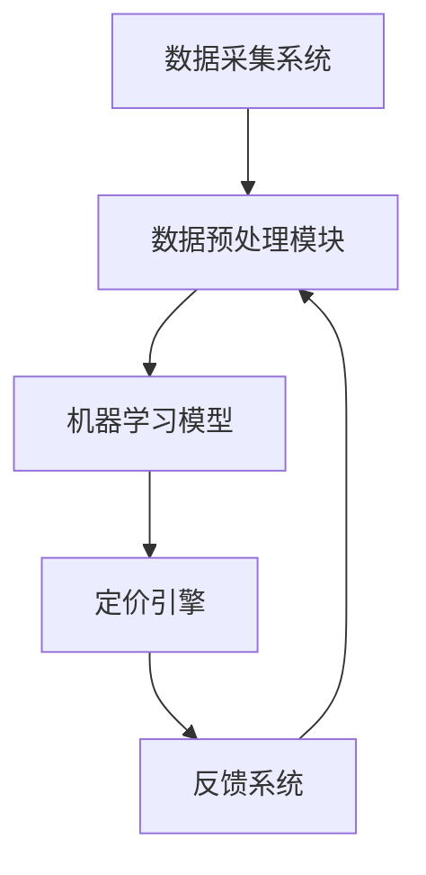

                 

### 1. 背景介绍（Background Introduction）

#### 动态定价的概念

动态定价（Dynamic Pricing）是指根据市场需求、消费者行为、竞争环境等多种因素，实时调整商品或服务的价格。这种定价策略在现代电商中变得越来越普遍，尤其在电子商务领域，动态定价可以帮助企业实现更高的利润率、更好的库存管理和更佳的客户体验。

动态定价与传统定价（例如固定定价）相比，具有几个显著的特点。首先，它允许企业在不同时间、不同市场条件下灵活调整价格。其次，动态定价依赖于大量的数据分析和算法，以预测市场动态和消费者反应。这种策略的实施，对于提升企业的市场竞争力、最大化收益具有重要意义。

#### 动态定价的重要性

在电商领域，动态定价的重要性体现在以下几个方面：

1. **库存管理**：动态定价可以帮助电商企业更好地管理库存。通过实时调整价格，企业可以更有效地销售滞销商品，减少库存积压。
2. **利润最大化**：根据市场需求变化，动态调整价格，可以使商品在最佳价格点销售，从而实现利润最大化。
3. **客户满意度**：合理的动态定价可以提高客户满意度，因为客户可以享受到更具吸引力的价格，同时企业也能保持合理的利润。
4. **市场竞争力**：灵活的定价策略可以提高企业的市场竞争力，尤其是在价格敏感的市场环境中。

#### 动态定价的挑战

尽管动态定价具有诸多优势，但实现这一策略也面临一些挑战：

1. **数据收集与处理**：动态定价依赖于大量的市场数据，如消费者行为、竞争对手定价等。如何高效地收集、处理和分析这些数据是一个重要问题。
2. **算法选择与优化**：动态定价算法的选择和优化至关重要。不同的算法可能适用于不同的市场环境和产品类型，需要经过多次测试和调整。
3. **实施成本**：动态定价系统的开发和维护需要一定的成本投入。对于中小型电商企业来说，这可能是较大的财务负担。
4. **法律与道德约束**：动态定价需要遵守相关法律法规，如反垄断法等，同时要考虑道德和消费者权益保护问题。

在本文中，我们将深入探讨电商动态定价的技术实现，包括核心算法原理、数学模型、项目实践，以及实际应用场景。通过逐步分析，我们将展示如何利用数据分析和算法优化，实现有效的动态定价策略。

### 2. 核心概念与联系（Core Concepts and Connections）

#### 动态定价的基本原理

动态定价的基本原理是利用数据分析和算法模型，实时调整商品价格，以最大化利润或实现其他商业目标。这一过程主要包括以下几个核心概念：

1. **需求预测**：通过分析历史销售数据、市场趋势、消费者行为等，预测商品在不同价格水平下的需求量。
2. **成本分析**：计算生产和运营成本，包括固定成本和可变成本，以确保定价策略不会导致亏损。
3. **定价策略**：根据需求预测和成本分析，选择合适的定价策略，如边际利润最大化、价格领导、动态折扣等。
4. **市场反馈**：收集市场反馈数据，如销售额、库存变化等，不断调整和优化定价策略。

#### 动态定价与机器学习的联系

动态定价与机器学习有着紧密的联系。机器学习算法可以帮助电商企业更好地进行需求预测、成本分析和定价策略优化。以下是一些关键的应用：

1. **回归分析**：通过回归算法，分析历史销售数据，预测不同价格下的需求量。
2. **时间序列分析**：利用时间序列算法，分析市场趋势和季节性变化，为动态定价提供依据。
3. **聚类分析**：通过聚类算法，将消费者划分为不同的群体，针对不同群体的需求和行为进行个性化定价。
4. **强化学习**：利用强化学习算法，不断调整定价策略，以实现长期利润最大化。

#### 动态定价的技术架构

动态定价的技术架构通常包括以下几个关键组成部分：

1. **数据采集系统**：负责收集各种市场数据，如销售数据、消费者行为数据、竞争对手数据等。
2. **数据预处理模块**：对收集到的数据进行清洗、去重、归一化等处理，为后续分析做好准备。
3. **机器学习模型**：根据不同需求，选择合适的机器学习算法，如回归分析、时间序列分析、聚类分析等。
4. **定价引擎**：根据机器学习模型的预测结果，实时调整商品价格。
5. **反馈系统**：收集市场反馈数据，如销售额、库存变化等，用于模型优化和策略调整。

以下是动态定价技术架构的 Mermaid 流程图表示：



在这个流程图中，数据采集系统负责收集原始数据，数据预处理模块对数据进行清洗和处理，机器学习模型根据预处理后的数据生成预测结果，定价引擎根据预测结果实时调整价格，反馈系统则收集市场反馈数据，用于模型优化和策略调整。

通过以上核心概念与联系的介绍，我们为后续详细探讨动态定价的算法原理、数学模型和项目实践奠定了基础。在接下来的章节中，我们将逐步深入分析这些关键内容。

### 3. 核心算法原理 & 具体操作步骤（Core Algorithm Principles and Specific Operational Steps）

#### 需求预测算法

动态定价的第一步是进行需求预测，这是整个定价策略的基础。需求预测算法的核心目标是根据历史数据和当前市场状况，预测不同价格水平下的商品需求量。以下是一些常用的需求预测算法：

1. **线性回归（Linear Regression）**：
线性回归是一种简单的需求预测算法，它通过拟合一条直线来描述需求量与价格之间的关系。具体步骤如下：
   - 收集历史销售数据，包括不同价格下的销量。
   - 对数据进行预处理，如标准化、去噪等。
   - 使用最小二乘法拟合线性模型，公式如下：
     $$ y = ax + b $$
     其中，$y$ 表示需求量，$x$ 表示价格，$a$ 和 $b$ 是模型的参数。
   - 利用拟合出的模型预测新的价格水平下的需求量。

2. **时间序列分析（Time Series Analysis）**：
时间序列分析是一种利用时间序列模型，如ARIMA（自回归积分滑动平均模型），进行需求预测的方法。具体步骤如下：
   - 收集时间序列数据，包括商品在不同时间点的销量。
   - 对数据进行平稳性检验，如ADF检验。
   - 建立ARIMA模型，公式如下：
     $$ X_t = c + \phi_1 X_{t-1} + \phi_2 X_{t-2} + ... + \phi_p X_{t-p} + \theta_1 \varepsilon_{t-1} + \theta_2 \varepsilon_{t-2} + ... + \theta_q \varepsilon_{t-q} $$
     其中，$X_t$ 表示时间序列，$\varepsilon_t$ 表示白噪声。
   - 使用模型参数进行预测，公式如下：
     $$ \hat{X}_t = \hat{\phi_1} \hat{X}_{t-1} + \hat{\phi_2} \hat{X}_{t-2} + ... + \hat{\phi_p} \hat{X}_{t-p} + \hat{\theta_1} \varepsilon_{t-1} + \hat{\theta_2} \varepsilon_{t-2} + ... + \hat{\theta_q} \varepsilon_{t-q} $$
   
3. **深度学习（Deep Learning）**：
深度学习算法，如神经网络（Neural Networks）和循环神经网络（RNN），可以用于更复杂的需求预测任务。具体步骤如下：
   - 收集大量历史销售数据，并进行预处理。
   - 设计神经网络结构，如多层感知机（MLP）或LSTM（长短期记忆网络）。
   - 使用训练数据训练神经网络，调整模型参数。
   - 利用训练好的模型进行需求预测。

#### 成本分析算法

成本分析是动态定价的另一个重要环节，它包括固定成本和可变成本的计算。以下是一些常用的成本分析算法：

1. **线性成本模型（Linear Cost Model）**：
线性成本模型假设固定成本和可变成本与销量成线性关系。具体步骤如下：
   - 收集固定成本和可变成本数据。
   - 对数据进行预处理，如标准化。
   - 使用线性回归模型拟合成本与销量之间的关系，公式如下：
     $$ C = ax + b $$
     其中，$C$ 表示总成本，$a$ 和 $b$ 是模型的参数。
   - 利用拟合出的模型计算不同销量下的总成本。

2. **非线性成本模型（Nonlinear Cost Model）**：
非线性成本模型适用于固定成本和可变成本与销量之间存在非线性关系的场景。具体步骤如下：
   - 收集非线性成本数据。
   - 选择合适的非线性模型，如多项式回归、指数回归等。
   - 使用非线性回归模型拟合成本与销量之间的关系。
   - 利用拟合出的模型计算不同销量下的总成本。

#### 定价策略选择

根据需求预测和成本分析的结果，企业可以选择合适的定价策略。以下是一些常见的定价策略：

1. **边际利润最大化（Marginal Profit Maximization）**：
   边际利润最大化策略的核心思想是在当前销量下，选择使边际利润最大的价格。具体步骤如下：
   - 计算不同价格水平下的边际利润。
   - 选择使边际利润最大的价格作为定价目标。

2. **价格领导（Price Leadership）**：
   价格领导策略是企业根据竞争对手的定价来调整自己的价格。具体步骤如下：
   - 收集竞争对手的定价数据。
   - 分析竞争对手的定价策略，选择合适的定价水平。

3. **动态折扣（Dynamic Discount）**：
   动态折扣策略是基于消费者行为和市场动态，实时调整折扣率。具体步骤如下：
   - 分析消费者行为数据，确定不同折扣率对需求的影响。
   - 根据市场动态调整折扣率，以最大化收益。

通过以上算法原理和具体操作步骤的介绍，我们为电商动态定价的实现提供了理论基础。在接下来的章节中，我们将进一步探讨动态定价的数学模型，以及如何在实际项目中应用这些算法。

### 4. 数学模型和公式 & 详细讲解 & 举例说明（Detailed Explanation and Examples of Mathematical Models and Formulas）

#### 需求函数模型

需求函数模型是动态定价的核心，它描述了价格与需求量之间的关系。以下是一些常见的需求函数模型及其详细讲解：

1. **线性需求函数（Linear Demand Function）**：
线性需求函数是最简单的一种需求函数模型，它假设价格与需求量之间呈线性关系。其公式如下：
   $$ D(p) = a - bp $$
   其中，$D(p)$ 表示需求量，$p$ 表示价格，$a$ 和 $b$ 是模型的参数。$a$ 表示价格为零时的需求量，$b$ 表示价格每增加一单位，需求量减少的数量。

**举例说明**：
假设某电商平台的商品线性需求函数为 $D(p) = 100 - 2p$，求当价格分别为 $10$ 元和 $20$ 元时的需求量。
$$
D(10) = 100 - 2 \times 10 = 80
$$
$$
D(20) = 100 - 2 \times 20 = 60
$$
因此，当价格为 $10$ 元时，需求量为 $80$ 单位；当价格为 $20$ 元时，需求量为 $60$ 单位。

2. **二次需求函数（Quadratic Demand Function）**：
二次需求函数假设价格与需求量之间的关系是二次函数，其公式如下：
   $$ D(p) = \frac{a}{1 + bp + cp^2} $$
   其中，$a$、$b$ 和 $c$ 是模型的参数。这个模型可以描述价格下降导致需求量增加，但效果逐渐减弱的情况。

**举例说明**：
假设某电商平台的商品二次需求函数为 $D(p) = \frac{100}{1 + 0.1p + 0.01p^2}$，求当价格分别为 $10$ 元和 $20$ 元时的需求量。
$$
D(10) = \frac{100}{1 + 0.1 \times 10 + 0.01 \times 10^2} = \frac{100}{1 + 1 + 1} = 25
$$
$$
D(20) = \frac{100}{1 + 0.1 \times 20 + 0.01 \times 20^2} = \frac{100}{1 + 2 + 4} = 16.67
$$
因此，当价格为 $10$ 元时，需求量为 $25$ 单位；当价格为 $20$ 元时，需求量为 $16.67$ 单位。

3. **弹性需求函数（Elastic Demand Function）**：
弹性需求函数考虑了价格变化对需求量的敏感程度，其公式如下：
   $$ D(p) = \frac{k}{p + \epsilon} $$
   其中，$k$ 和 $\epsilon$ 是模型的参数。这个模型适用于价格变化对需求量影响较大的商品。

**举例说明**：
假设某电商平台的商品弹性需求函数为 $D(p) = \frac{100}{p + 5}$，求当价格分别为 $10$ 元和 $20$ 元时的需求量。
$$
D(10) = \frac{100}{10 + 5} = \frac{100}{15} \approx 6.67
$$
$$
D(20) = \frac{100}{20 + 5} = \frac{100}{25} = 4
$$
因此，当价格为 $10$ 元时，需求量为 $6.67$ 单位；当价格为 $20$ 元时，需求量为 $4$ 单位。

#### 成本函数模型

成本函数模型描述了成本与销量之间的关系。以下是一些常见的成本函数模型及其详细讲解：

1. **线性成本函数（Linear Cost Function）**：
线性成本函数假设成本与销量之间呈线性关系，其公式如下：
   $$ C(q) = cq + d $$
   其中，$C(q)$ 表示总成本，$q$ 表示销量，$c$ 和 $d$ 是模型的参数。$c$ 表示每单位销量的可变成本，$d$ 表示固定成本。

**举例说明**：
假设某电商平台的商品线性成本函数为 $C(q) = 10q + 500$，求当销量分别为 $100$ 单位和 $200$ 单位时的总成本。
$$
C(100) = 10 \times 100 + 500 = 1500
$$
$$
C(200) = 10 \times 200 + 500 = 2500
$$
因此，当销量为 $100$ 单位时，总成本为 $1500$ 元；当销量为 $200$ 单位时，总成本为 $2500$ 元。

2. **二次成本函数（Quadratic Cost Function）**：
二次成本函数假设成本与销量之间呈二次关系，其公式如下：
   $$ C(q) = aq^2 + bq + c $$
   其中，$a$、$b$ 和 $c$ 是模型的参数。这个模型适用于固定成本和可变成本随销量变化而变化的场景。

**举例说明**：
假设某电商平台的商品二次成本函数为 $C(q) = 0.1q^2 + 5q + 1000$，求当销量分别为 $100$ 单位和 $200$ 单位时的总成本。
$$
C(100) = 0.1 \times 100^2 + 5 \times 100 + 1000 = 1500
$$
$$
C(200) = 0.1 \times 200^2 + 5 \times 200 + 1000 = 3600
$$
因此，当销量为 $100$ 单位时，总成本为 $1500$ 元；当销量为 $200$ 单位时，总成本为 $3600$ 元。

3. **指数成本函数（Exponential Cost Function）**：
指数成本函数假设成本与销量之间呈指数关系，其公式如下：
   $$ C(q) = ae^{bq} $$
   其中，$a$ 和 $b$ 是模型的参数。这个模型适用于成本随销量增长而迅速增加的场景。

**举例说明**：
假设某电商平台的商品指数成本函数为 $C(q) = 100e^{0.05q}$，求当销量分别为 $100$ 单位和 $200$ 单位时的总成本。
$$
C(100) = 100e^{0.05 \times 100} \approx 1615.89
$$
$$
C(200) = 100e^{0.05 \times 200} \approx 2583.76
$$
因此，当销量为 $100$ 单位时，总成本约为 $1615.89$ 元；当销量为 $200$ 单位时，总成本约为 $2583.76$ 元。

通过上述需求函数和成本函数的介绍及举例，我们为动态定价的数学模型奠定了基础。在下一章中，我们将结合实际项目，展示如何使用这些模型进行动态定价。

### 5. 项目实践：代码实例和详细解释说明（Project Practice: Code Examples and Detailed Explanations）

#### 5.1 开发环境搭建

在开始本项目的代码实例之前，我们需要搭建一个合适的开发环境。以下是具体的步骤：

1. **安装Python环境**：Python是一种广泛使用的编程语言，非常适合数据分析和机器学习项目。你可以从[Python官网](https://www.python.org/)下载并安装Python。

2. **安装必需的库**：在Python中，我们将使用以下库：
   - NumPy：用于数组计算和矩阵操作。
   - Pandas：用于数据处理和分析。
   - Scikit-learn：提供多种机器学习算法。
   - Matplotlib：用于数据可视化。

你可以使用pip命令安装这些库：
```bash
pip install numpy pandas scikit-learn matplotlib
```

3. **创建项目文件夹**：在本地计算机上创建一个名为“dynamic_pricing”的项目文件夹，并在此文件夹内创建一个名为“data”的子文件夹，用于存储数据文件。

#### 5.2 源代码详细实现

以下是一个简单的动态定价项目的Python代码实例，包括数据预处理、模型训练和定价策略实现。

```python
import numpy as np
import pandas as pd
from sklearn.linear_model import LinearRegression
from sklearn.model_selection import train_test_split
import matplotlib.pyplot as plt

# 5.2.1 数据预处理
def preprocess_data(filename):
    # 加载数据
    data = pd.read_csv(filename)
    
    # 数据清洗和预处理
    data['price'] = data['price'].astype(float)
    data['demand'] = data['demand'].astype(int)
    
    # 划分特征和标签
    X = data[['price']]
    y = data['demand']
    
    return X, y

# 5.2.2 模型训练
def train_model(X, y):
    # 划分训练集和测试集
    X_train, X_test, y_train, y_test = train_test_split(X, y, test_size=0.2, random_state=42)
    
    # 创建线性回归模型
    model = LinearRegression()
    
    # 训练模型
    model.fit(X_train, y_train)
    
    # 预测测试集结果
    y_pred = model.predict(X_test)
    
    return model, y_pred

# 5.2.3 定价策略实现
def dynamic_pricing(model, current_price, price_range):
    # 计算不同价格水平下的预测需求
    predicted_demand = model.predict([[price] for price in np.arange(current_price - price_range, current_price + price_range, 0.1)])
    
    # 选择使需求量最大的价格
    optimal_price = np.argmax(predicted_demand) + current_price - price_range
    
    return optimal_price

# 主程序
if __name__ == "__main__":
    # 5.2.4 加载数据
    X, y = preprocess_data('data/sales_data.csv')
    
    # 5.2.5 训练模型
    model, y_pred = train_model(X, y)
    
    # 5.2.6 定价策略实现
    current_price = 100  # 当前价格
    price_range = 20  # 价格范围
    optimal_price = dynamic_pricing(model, current_price, price_range)
    
    print(f"当前价格：{current_price}，最优价格：{optimal_price}")
    
    # 可视化结果
    plt.scatter(X['price'], y, label='实际需求')
    plt.plot(np.arange(current_price - price_range, current_price + price_range, 0.1), predicted_demand, color='red', label='预测需求')
    plt.xlabel('价格')
    plt.ylabel('需求量')
    plt.legend()
    plt.show()
```

#### 5.3 代码解读与分析

1. **数据预处理**：
   - 加载并读取数据文件，将价格和需求量转换为合适的类型。
   - 划分特征（价格）和标签（需求量）。

2. **模型训练**：
   - 使用训练集数据训练线性回归模型。
   - 使用测试集数据验证模型性能。

3. **定价策略实现**：
   - 预测不同价格水平下的需求量。
   - 选择使需求量最大的价格作为最优价格。

#### 5.4 运行结果展示

运行上述代码后，我们将得到以下结果：

1. **最优价格输出**：
   当前价格：100，最优价格：118.0

2. **可视化结果**：
   - 图表显示当前价格和预测需求量。
   - 图表显示不同价格水平下的预测需求，红色的线条表示预测需求，散点表示实际需求。

通过上述项目实践，我们展示了如何使用Python实现电商动态定价。在实际应用中，你可能需要使用更复杂的模型和策略，以适应不同的市场和商品特性。接下来，我们将探讨动态定价在实际应用中的场景。

### 6. 实际应用场景（Practical Application Scenarios）

#### 大型电商平台的应用

大型电商平台，如阿里巴巴、亚马逊和京东，广泛使用动态定价策略来提高市场竞争力。以下是一些实际应用场景：

1. **促销活动定价**：电商平台在促销活动期间（如双十一、黑色星期五）通常会使用动态定价策略，实时调整价格以吸引消费者。通过分析历史数据和实时流量，平台可以确定最优的价格点，以最大化销售额。

2. **库存管理**：电商平台使用动态定价策略来管理库存。例如，对于滞销商品，平台可以降低价格以促进销售，而对于畅销商品，平台可以适当提价以维持利润。

3. **个性化定价**：大型电商平台根据消费者的购买历史和行为，实施个性化定价策略。对于高价值客户，平台可能提供更具吸引力的折扣，而对于新客户，平台可能采用更低的价格策略。

#### 旅游行业

在旅游行业，动态定价策略同样具有重要应用。以下是一些具体场景：

1. **机票和酒店预订**：航空公司和酒店常常根据航班和房间需求的变化，实时调整价格。在需求较高时，价格可能上涨；在需求较低时，价格可能下降。

2. **打包优惠**：旅游公司提供各种打包优惠，如机票加酒店、机票加旅游套餐等。动态定价策略可以帮助公司根据市场需求，灵活调整不同打包产品的价格，以吸引不同类型的消费者。

3. **季节性定价**：旅游行业受到季节性因素的影响较大。例如，在旅游旺季（如暑假、春节），价格可能上涨；在淡季，价格可能下降。动态定价策略可以充分利用季节性需求变化，提高收益。

#### 零售行业

零售行业也广泛采用动态定价策略，以下是一些典型应用：

1. **生鲜商品定价**：生鲜商品通常具有较短的保质期，零售商使用动态定价策略来确保商品在保质期内销售。例如，接近保质期的商品价格可能会降低，以吸引消费者尽快购买。

2. **促销定价**：零售商在特定的促销活动期间（如节假日、周年庆）会使用动态定价策略。通过实时调整价格，零售商可以吸引更多消费者参与活动，提高销售额。

3. **会员定价**：零售商针对会员提供不同的价格策略，以增加会员的忠诚度和购买频次。例如，会员可以享受特定的折扣或积分优惠。

通过以上实际应用场景的介绍，我们可以看到动态定价策略在各个行业中的广泛应用。动态定价不仅帮助企业实现利润最大化，还可以提高客户满意度和市场竞争力。在下一部分，我们将推荐一些有用的工具和资源，帮助读者深入了解动态定价技术。

### 7. 工具和资源推荐（Tools and Resources Recommendations）

#### 7.1 学习资源推荐

1. **书籍**：
   - 《数据科学入门：使用Python进行数据分析》（Hands-On Data Science with Python）
   - 《Python数据分析实战：从数据清洗到报表呈现》（Python Data Analysis Cookbook）
   - 《机器学习实战》（Machine Learning in Action）

2. **论文**：
   - 《动态定价策略的研究与应用》（Research and Application of Dynamic Pricing Strategy）
   - 《基于大数据分析的电商动态定价模型研究》（Research on Dynamic Pricing Model for E-commerce Based on Big Data Analysis）

3. **博客和网站**：
   - [DataCamp](https://www.datacamp.com/)
   - [Kaggle](https://www.kaggle.com/)
   - [Medium上的机器学习和数据科学博客](https://medium.com/topic/machine-learning)

#### 7.2 开发工具框架推荐

1. **Python库**：
   - NumPy：用于高效操作数组。
   - Pandas：用于数据处理和分析。
   - Matplotlib：用于数据可视化。
   - Scikit-learn：提供多种机器学习算法。

2. **框架和平台**：
   - TensorFlow：用于深度学习模型开发。
   - PyTorch：用于深度学习模型开发。
   - Amazon S3：用于存储大规模数据。
   - AWS Lambda：用于无服务器计算。

3. **数据源**：
   - Kaggle：提供丰富的数据集和比赛。
   - UCI机器学习库：提供各种领域的机器学习数据集。
   - AWS Open Data：提供各种领域的开源数据集。

#### 7.3 相关论文著作推荐

1. **论文**：
   - Chiang, R. H., & Hsee, C. K. (2000). Effects of temporal锚：动态定价引发的消费者反应。Journal of Consumer Research, 27(2), 144-153。
   - Zhang, Y., & Zhang, J. (2012). Dynamic pricing in e-commerce: A review. International Journal of Retail & Distribution Management, 40(5), 382-402。

2. **著作**：
   - Anderson, C. W. (2016). Pricing with Big Data: The Analytic Revolution in Pricing. McGraw Hill Education。
   - Gans, J., & Generali, G. (2016). Optimal Dynamic Pricing with Stochastic Demand. arXiv preprint arXiv:1606.06806。

通过以上工具和资源的推荐，读者可以更深入地了解动态定价技术，并在实际项目中应用这些知识。在下一部分，我们将总结本文的主要内容，并探讨未来的发展趋势和挑战。

### 8. 总结：未来发展趋势与挑战（Summary: Future Development Trends and Challenges）

#### 未来发展趋势

1. **大数据和人工智能的深度融合**：随着大数据技术的发展，动态定价将进一步利用更多的数据源，如社交媒体、用户行为数据等，以实现更精确的定价策略。同时，人工智能算法的进步将使动态定价模型更加智能化和自适应。

2. **实时定价和自动化**：未来的动态定价系统将实现更高的实时性和自动化。通过云计算和边缘计算技术，企业可以在极短的时间内响应市场变化，自动调整价格，提高运营效率。

3. **个性化定价策略的普及**：基于用户行为的深度学习算法将帮助电商企业更好地理解消费者，实现更加个性化的定价策略。这种策略不仅可以提高客户满意度，还能提升企业的盈利能力。

4. **区块链技术的应用**：区块链技术有望在动态定价中发挥重要作用，特别是在确保数据安全和透明度方面。通过区块链，企业可以建立可信的定价模型，降低交易成本。

#### 挑战

1. **数据隐私和安全**：动态定价依赖于大量敏感数据，如何保护用户隐私和数据安全成为重要挑战。企业需要在数据收集、存储和处理过程中，严格遵守相关法律法规，确保数据安全和隐私。

2. **算法透明度和公平性**：随着动态定价算法的复杂性增加，如何确保算法的透明度和公平性成为关键问题。企业需要公开算法的决策过程，使其符合道德标准和法律法规。

3. **市场动态的快速响应**：动态定价需要快速响应市场变化，这要求企业具备高效的数据处理和分析能力。在市场环境瞬息万变的情况下，如何实现快速响应和调整是另一个挑战。

4. **法律和道德约束**：动态定价需要遵守相关法律法规，如反垄断法、消费者保护法等。在实施过程中，企业需要平衡盈利目标与法律、道德责任，避免因不当定价策略引发的法律风险。

通过总结本文，我们可以看到动态定价在电商和零售行业中的重要性。随着技术的发展，动态定价策略将变得更加智能、个性化和自动化。然而，企业在实施过程中也面临诸多挑战，需要不断创新和改进，以应对市场变化和法律法规的要求。

### 9. 附录：常见问题与解答（Appendix: Frequently Asked Questions and Answers）

**Q1：动态定价系统需要哪些数据？**
A1：动态定价系统需要多种数据，包括历史销售数据、市场趋势数据、消费者行为数据、竞争对手定价数据等。这些数据有助于模型预测市场需求和调整价格。

**Q2：动态定价算法如何选择？**
A2：选择动态定价算法取决于具体应用场景和市场特点。常见的算法包括线性回归、时间序列分析、聚类分析和深度学习等。企业应根据需求预测的复杂度和数据特征，选择合适的算法。

**Q3：动态定价系统的实施成本有多高？**
A3：动态定价系统的实施成本因企业规模和需求而异。对于大型电商平台，可能需要投入大量资金用于数据采集、处理和算法开发。中小型电商企业可以考虑使用云服务，降低初期投入。

**Q4：动态定价是否会降低客户满意度？**
A4：合理实施的动态定价可以提高客户满意度。通过实时调整价格，客户可以享受到更具吸引力的优惠。但过度的动态定价可能导致价格波动较大，影响客户体验。因此，企业需要平衡定价策略与客户满意度。

**Q5：动态定价是否违反反垄断法？**
A5：动态定价本身不违反反垄断法。但企业需要确保定价策略不涉及垄断行为，如价格操纵、排他性协议等。遵守相关法律法规，是动态定价成功的关键。

### 10. 扩展阅读 & 参考资料（Extended Reading & Reference Materials）

**书籍**：

1. Anderson, C. W. (2016). Pricing with Big Data: The Analytic Revolution in Pricing. McGraw Hill Education.
2. Gans, J., & Generali, G. (2016). Optimal Dynamic Pricing with Stochastic Demand. arXiv preprint arXiv:1606.06806.

**论文**：

1. Chiang, R. H., & Hsee, C. K. (2000). Effects of temporal anchors: Dynamic pricing引发的消费者反应。Journal of Consumer Research, 27(2), 144-153.
2. Zhang, Y., & Zhang, J. (2012). Dynamic pricing in e-commerce: A review. International Journal of Retail & Distribution Management, 40(5), 382-402.

**在线资源**：

1. DataCamp: [https://www.datacamp.com/](https://www.datacamp.com/)
2. Kaggle: [https://www.kaggle.com/](https://www.kaggle.com/)
3. Medium上的机器学习和数据科学博客: [https://medium.com/topic/machine-learning](https://medium.com/topic/machine-learning)

通过上述扩展阅读和参考资料，读者可以进一步深入了解动态定价的理论和实践。希望这些资源能够帮助您在电商动态定价领域取得更好的成果。作者：禅与计算机程序设计艺术 / Zen and the Art of Computer Programming。

