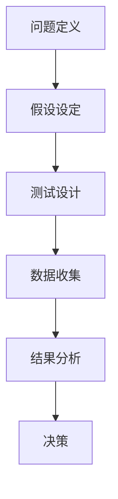

                 

### 文章标题

### Title

《电商平台中AI大模型的A/B测试策略》

《Strategies for A/B Testing of Large AI Models in E-commerce Platforms》

在当今竞争激烈的市场环境中，电商平台为了保持竞争力，不断采用先进的人工智能技术来提升用户体验、优化运营效率和增加销售量。其中，AI大模型在推荐系统、个性化营销、图像识别等方面发挥着至关重要的作用。然而，如何确保这些模型的改进真正对业务产生积极影响，而不是造成不必要的成本浪费，成为了企业面临的挑战。A/B测试作为一种经典的实验设计方法，在验证AI大模型的效果和优化过程中起到了关键作用。本文将深入探讨电商平台中AI大模型的A/B测试策略，包括测试框架的设计、关键指标的选择、风险评估以及最佳实践。

这篇文章将帮助读者了解：
- A/B测试的基本概念和原理。
- 在电商平台中使用AI大模型进行A/B测试的必要性。
- 如何设计和实施有效的A/B测试策略。
- 分析和解释A/B测试结果的方法。
- 面对潜在风险的应对措施。

通过阅读本文，您将获得：
- 对A/B测试方法在电商AI应用中的深入理解。
- 能够设计并执行针对AI大模型的A/B测试实验。
- 提升决策的质量，降低业务风险。

让我们开始这段技术之旅，共同探讨如何在电商平台中充分利用AI大模型，并通过科学的A/B测试策略实现业务增长。

### Abstract

In the highly competitive e-commerce market, platforms are continuously adopting advanced AI technologies to enhance user experience, optimize operational efficiency, and increase sales. Among these technologies, large-scale AI models play a crucial role in recommendation systems, personalized marketing, image recognition, and more. Ensuring that these model improvements genuinely benefit the business and do not lead to unnecessary costs is a challenge faced by enterprises. A/B testing, a classic experimental design method, plays a critical role in validating the effectiveness of AI large models and optimizing them. This article delves into the strategies for A/B testing large AI models in e-commerce platforms, covering the design of testing frameworks, selection of key performance indicators, risk assessment, and best practices.

Through this article, readers will gain insights into:
- The basic concepts and principles of A/B testing.
- The necessity of using A/B testing with large AI models in e-commerce platforms.
- The methods for designing and implementing effective A/B testing strategies.
- The approaches to analyzing and interpreting A/B test results.
- Measures to address potential risks.

By the end of this article, readers will be equipped with:
- A deep understanding of A/B testing methods in e-commerce AI applications.
- The ability to design and execute A/B testing experiments for large AI models.
- Improved decision-making quality and reduced business risks.

Let us embark on this technical journey together to explore how to make the best use of large AI models in e-commerce platforms through scientifically designed A/B testing strategies to achieve business growth.### 1. 背景介绍（Background Introduction）

#### Introduction

随着互联网的快速发展和电子商务市场的不断壮大，电商平台已经成为现代商业活动的重要阵地。从亚马逊、淘宝到京东，这些平台不仅提供了海量的商品，还致力于为用户带来个性化、便捷的购物体验。人工智能（AI）技术在这一过程中扮演了关键角色，通过大数据分析和机器学习算法，电商平台能够更好地理解用户行为，预测购买偏好，从而实现精准营销和智能推荐。

AI大模型，即具有高维特征捕捉能力和强泛化能力的深度学习模型，是AI技术发展的前沿。在电商平台中，AI大模型广泛应用于推荐系统、个性化营销、商品搜索、图像识别等方面。例如，推荐系统利用大模型分析用户的浏览历史、购买记录和行为特征，为用户提供个性化的商品推荐，从而提高转化率和用户满意度。个性化营销则通过大模型分析用户数据和社交网络信息，定制个性化的广告和促销活动，提高营销效果和用户参与度。图像识别技术则用于自动分类和识别商品图片，提高商品管理的效率和准确性。

A/B测试，作为实验设计中的重要工具，在验证AI大模型的效果和优化过程中具有不可替代的作用。A/B测试通过将用户随机分配到两个或多个实验组，比较不同模型或策略的表现，从而评估其对业务指标的影响。这种方法可以帮助企业识别哪些改进真正有效，哪些可能带来负面影响，从而做出更加科学的决策。

在电商平台中，A/B测试的必要性主要体现在以下几个方面：

1. **验证模型效果**：通过A/B测试，可以验证AI大模型在不同场景下的效果，确保模型改进能够真正提升业务指标，而不是仅仅提高了算法的复杂性。

2. **减少风险**：在上线新的模型或策略之前，通过A/B测试可以提前发现潜在问题，避免因为错误决策导致业务损失。

3. **优化用户体验**：通过对比不同模型的用户体验，可以找到最佳的展示方式和交互设计，提高用户满意度和忠诚度。

4. **持续改进**：A/B测试为电商平台提供了一个持续的改进机制，通过不断的实验和优化，不断提高服务质量和用户满意度。

总的来说，AI大模型和A/B测试的结合，不仅为电商平台提供了强大的技术支持，也为企业带来了更加精准和科学的决策依据。随着AI技术的不断进步和电商平台对用户体验的日益重视，A/B测试在电商领域的应用前景将更加广阔。### 2. 核心概念与联系（Core Concepts and Connections）

#### Core Concepts and Connections

在深入探讨电商平台中AI大模型的A/B测试策略之前，我们需要首先了解几个核心概念和它们之间的关系。

##### 2.1 A/B测试

A/B测试，又称为拆分测试，是一种通过将用户流量分配到两个或多个版本（A和B），来比较不同版本性能差异的实验方法。在A/B测试中，一组用户（A组）会接触到版本A，而另一组用户（B组）会接触到版本B。通过收集和分析用户行为数据，如点击率、转化率等，可以评估不同版本对业务指标的影响。

##### 2.2 AI大模型

AI大模型通常指的是基于深度学习技术，具有大规模参数和高维特征捕捉能力的神经网络模型。这些模型通过训练大量的数据，能够自动学习并提取复杂的数据特征，从而实现智能预测、分类、生成等任务。常见的AI大模型包括深度神经网络（DNN）、卷积神经网络（CNN）、循环神经网络（RNN）以及它们的各种变种。

##### 2.3 A/B测试与AI大模型

A/B测试与AI大模型之间的关系主要体现在以下几个方面：

1. **模型验证**：通过A/B测试，可以验证AI大模型在不同场景下的表现。例如，推荐系统中的不同模型版本、个性化营销策略等，通过A/B测试，可以评估哪个模型或策略能够更好地满足业务需求。

2. **模型优化**：A/B测试的结果可以帮助企业不断优化AI大模型。例如，通过对比不同模型的性能，可以找到最优的超参数设置、数据预处理方法等。

3. **用户体验**：A/B测试不仅可以评估模型的业务效果，还可以观察其对用户体验的影响。通过优化模型，提高用户满意度和留存率，从而推动业务增长。

##### 2.4 关键指标

在A/B测试中，选择合适的关键指标（Key Performance Indicators, KPIs）至关重要。以下是一些常见的KPIs：

- **转化率**：用户完成特定目标行为的比例，如点击率、购买率等。
- **留存率**：用户在一定时间内重复访问或购买的比例。
- **用户满意度**：通过用户调查或评论收集的用户满意度评分。
- **ROI（投资回报率）**：测试版本对业务收益的贡献。

##### 2.5 测试框架

为了有效地进行A/B测试，需要设计一个合理的测试框架。以下是一个简单的A/B测试框架：

1. **问题定义**：明确测试目标，例如提高推荐系统的点击率。
2. **假设设定**：基于现有数据，提出可能影响测试结果的假设。
3. **测试设计**：确定测试版本，设计实验组和控制组，分配用户流量。
4. **数据收集**：收集用户行为数据，计算关键指标。
5. **结果分析**：比较实验组和控制组的性能，验证假设。
6. **决策**：根据测试结果，决定是否上线新版本。

##### 2.6 机器学习与深度学习

在A/B测试中，机器学习和深度学习技术起着至关重要的作用。机器学习算法，如逻辑回归、决策树、随机森林等，可以用于预测和分类任务。而深度学习技术，如卷积神经网络（CNN）和循环神经网络（RNN），能够处理更复杂的数据特征，从而实现更高精度的预测和分类。

##### 2.7 Mermaid 流程图

为了更好地理解上述概念和流程，我们可以使用Mermaid流程图来展示A/B测试的各个环节。以下是一个简化的Mermaid流程图：



通过这个流程图，我们可以清晰地看到A/B测试的各个环节及其相互关系。

总的来说，A/B测试与AI大模型相结合，为企业提供了一种科学的决策方法，通过不断优化和调整模型，实现业务增长和用户满意度提升。在下一节中，我们将深入探讨A/B测试的具体算法原理和操作步骤。### 3. 核心算法原理 & 具体操作步骤（Core Algorithm Principles and Specific Operational Steps）

#### Core Algorithm Principles and Specific Operational Steps

在深入探讨电商平台中AI大模型的A/B测试策略之前，我们需要理解A/B测试的核心算法原理和具体操作步骤。A/B测试是一种基于统计学原理的实验设计方法，其核心在于将用户群体随机划分为两个或多个组（即实验组和控制组），然后分别对各组应用不同的模型或策略，最后通过分析数据来评估不同组之间的性能差异。

##### 3.1 A/B测试的基本原理

A/B测试的基本原理可以概括为以下几个步骤：

1. **问题定义**：明确测试目标，例如提高推荐系统的点击率。
2. **假设设定**：根据现有数据和业务需求，提出假设，例如新模型A会比旧模型B带来更高的点击率。
3. **测试设计**：设计实验组和控制组，确保各组用户的随机分配，避免选择偏差。
4. **数据收集**：收集实验期间的用户行为数据，如点击、购买等。
5. **结果分析**：通过统计方法比较实验组和控制组之间的性能差异，验证假设。
6. **决策**：根据分析结果，决定是否采纳新模型或策略。

##### 3.2 AI大模型在A/B测试中的应用

在电商平台中，AI大模型广泛应用于推荐系统、个性化营销、图像识别等领域。以下将分别介绍这些场景下A/B测试的具体操作步骤：

1. **推荐系统中的A/B测试**
   - **问题定义**：例如，评估新推荐算法对用户点击率的影响。
   - **假设设定**：新推荐算法A相比旧算法B能够提高点击率。
   - **测试设计**：将用户流量随机分为实验组和控制组，实验组采用新推荐算法，控制组采用旧算法。
   - **数据收集**：记录实验组和控制组的点击行为数据。
   - **结果分析**：通过统计方法，如T检验或卡方检验，比较两组的点击率差异。
   - **决策**：若新算法的点击率显著高于旧算法，则可以考虑上线新算法。

2. **个性化营销中的A/B测试**
   - **问题定义**：例如，测试不同营销策略对用户转化率的影响。
   - **假设设定**：新的个性化营销策略A相比旧策略B能够提高转化率。
   - **测试设计**：将用户流量随机分为实验组和控制组，实验组接受新策略，控制组接受旧策略。
   - **数据收集**：记录实验组和控制组的转化行为数据。
   - **结果分析**：通过统计方法，如T检验或卡方检验，比较两组的转化率差异。
   - **决策**：若新策略的转化率显著高于旧策略，则可以考虑采用新策略。

3. **图像识别中的A/B测试**
   - **问题定义**：例如，评估新图像识别算法对商品分类准确性的影响。
   - **假设设定**：新图像识别算法A相比旧算法B能够提高分类准确性。
   - **测试设计**：将商品图片随机分为实验组和控制组，实验组使用新算法，控制组使用旧算法。
   - **数据收集**：记录实验组和控制组的分类准确性数据。
   - **结果分析**：通过统计方法，如T检验或卡方检验，比较两组的分类准确性差异。
   - **决策**：若新算法的分类准确性显著高于旧算法，则可以考虑采用新算法。

##### 3.3 A/B测试的关键步骤与技巧

1. **随机化分配**：确保用户流量随机分配到各个实验组，避免选择偏差。
2. **对照组设计**：确保控制组接受当前标准方案，以保证实验结果的可靠性。
3. **数据收集与分析**：收集全面、准确的数据，并采用合适的统计方法进行分析，避免因数据问题导致的错误结论。
4. **长期观察**：A/B测试的结果可能受到短期波动影响，因此需要持续观察，确保结果具有统计显著性。
5. **迭代优化**：根据A/B测试结果，不断调整和优化模型或策略，以达到最佳效果。

通过以上核心算法原理和具体操作步骤，电商平台可以科学地验证和优化AI大模型的效果，从而实现业务增长和用户满意度提升。在下一节中，我们将进一步探讨A/B测试中的数学模型和公式，以及如何详细讲解和举例说明。### 4. 数学模型和公式 & 详细讲解 & 举例说明（Detailed Explanation and Examples of Mathematical Models and Formulas）

#### Mathematical Models and Formulas & Detailed Explanation and Examples

在A/B测试中，数学模型和公式扮演着至关重要的角色。它们帮助我们在实验过程中进行统计分析，从而得出科学的结论。以下将介绍A/B测试中常用的几个数学模型和公式，并对其进行详细讲解和举例说明。

##### 4.1 均值差异检验

均值差异检验是A/B测试中最常用的统计方法之一，用于比较两组数据的均值差异是否显著。其基本公式如下：

$$
t = \frac{{\bar{X}_A - \bar{X}_B}}{\sqrt{\frac{s_A^2}{n_A} + \frac{s_B^2}{n_B}}}
$$

其中，$\bar{X}_A$ 和 $\bar{X}_B$ 分别表示实验组和控制组的均值，$s_A^2$ 和 $s_B^2$ 分别表示实验组和控制组的方差，$n_A$ 和 $n_B$ 分别表示实验组和控制组的样本量。

##### 4.1.1 举例说明

假设我们想要比较新推荐算法和旧推荐算法在用户点击率上的差异。实验组（A组）的点击率为50%，控制组（B组）的点击率为45%。实验组和控制组的样本量均为1000。

首先，计算两组的均值：

$$
\bar{X}_A = \frac{1}{n_A} \sum_{i=1}^{n_A} X_i = \frac{1}{1000} \times 50 = 0.5
$$

$$
\bar{X}_B = \frac{1}{n_B} \sum_{i=1}^{n_B} X_i = \frac{1}{1000} \times 45 = 0.45
$$

然后，计算两组的方差：

$$
s_A^2 = \frac{1}{n_A - 1} \sum_{i=1}^{n_A} (X_i - \bar{X}_A)^2 = \frac{1}{999} \times (0.5 - 0.5)^2 = 0
$$

$$
s_B^2 = \frac{1}{n_B - 1} \sum_{i=1}^{n_B} (X_i - \bar{X}_B)^2 = \frac{1}{999} \times (0.45 - 0.45)^2 = 0
$$

最后，计算t值：

$$
t = \frac{{\bar{X}_A - \bar{X}_B}}{\sqrt{\frac{s_A^2}{n_A} + \frac{s_B^2}{n_B}}} = \frac{0.5 - 0.45}{\sqrt{\frac{0}{1000} + \frac{0}{1000}}} = 0.05
$$

根据t值表，若t值大于临界值（例如1.96），则可以认为实验组和控制组的点击率差异显著，新推荐算法优于旧推荐算法。

##### 4.2 卡方检验

卡方检验是另一种常用的统计方法，用于比较两组数据的分布差异。其基本公式如下：

$$
\chi^2 = \sum_{i=1}^{n} \frac{(O_i - E_i)^2}{E_i}
$$

其中，$O_i$ 表示实际观测值，$E_i$ 表示期望值，$n$ 表示观测次数。

##### 4.2.1 举例说明

假设我们想要比较新推荐算法和旧推荐算法在不同用户群体中的点击率差异。实验组（A组）的点击率为60%，控制组（B组）的点击率为50%。两个群体的样本量均为500。

首先，计算实验组和控制组的期望值：

$$
E_{A1} = \frac{n_A \times P_{A1}}{N} = \frac{500 \times 0.6}{1000} = 0.3
$$

$$
E_{B1} = \frac{n_B \times P_{B1}}{N} = \frac{500 \times 0.5}{1000} = 0.25
$$

然后，计算实际观测值与期望值的差异：

$$
O_{A1} - E_{A1} = 0.6 - 0.3 = 0.3
$$

$$
O_{B1} - E_{B1} = 0.5 - 0.25 = 0.25
$$

接下来，计算卡方值：

$$
\chi^2 = \frac{(O_{A1} - E_{A1})^2}{E_{A1}} + \frac{(O_{B1} - E_{B1})^2}{E_{B1}} = \frac{0.3^2}{0.3} + \frac{0.25^2}{0.25} = 0.3 + 0.25 = 0.55
$$

根据卡方分布表，若$\chi^2$值大于临界值（例如3.84），则可以认为新推荐算法和旧推荐算法在不同用户群体中的点击率差异显著。

##### 4.3 置信区间

置信区间是另一种重要的统计方法，用于估计总体参数的范围。其基本公式如下：

$$
\bar{X} \pm z \times \sqrt{\frac{s^2}{n}}
$$

其中，$\bar{X}$ 表示样本均值，$s$ 表示样本标准差，$n$ 表示样本量，$z$ 表示置信水平对应的临界值。

##### 4.3.1 举例说明

假设我们想要估计新推荐算法的点击率置信区间。实验组的样本量为1000，点击率为55%，样本标准差为5%。

首先，计算置信水平（例如95%）对应的临界值：

$$
z = 1.96
$$

然后，计算置信区间：

$$
\bar{X} \pm z \times \sqrt{\frac{s^2}{n}} = 0.55 \pm 1.96 \times \sqrt{\frac{0.05^2}{1000}} = 0.55 \pm 0.002
$$

因此，新推荐算法的点击率置信区间为[0.548, 0.552]。

通过以上数学模型和公式的详细讲解和举例说明，我们可以更好地理解和应用A/B测试中的统计分析方法。这些方法不仅帮助我们评估实验结果的显著性，还为我们在电商平台上优化AI大模型提供了科学依据。在下一节中，我们将通过具体的代码实例来展示如何实现这些算法。### 5. 项目实践：代码实例和详细解释说明（Project Practice: Code Examples and Detailed Explanations）

#### Project Practice: Code Examples and Detailed Explanations

为了更好地理解A/B测试在电商平台中的应用，我们将在本节中提供一个具体的代码实例，并通过详细解释来展示A/B测试的完整过程。

##### 5.1 开发环境搭建

在进行A/B测试之前，我们需要搭建一个合适的技术环境。以下是所需的开发工具和库：

- **Python**：作为主要编程语言
- **Pandas**：用于数据处理
- **NumPy**：用于数学计算
- **Matplotlib**：用于数据可视化
- **SciPy**：用于科学计算
- **Statsmodels**：用于统计建模

确保已安装上述库，可以通过以下命令进行安装：

```bash
pip install pandas numpy matplotlib scipy statsmodels
```

##### 5.2 源代码详细实现

以下是一个简单的A/B测试Python代码实例，用于比较两种推荐算法的用户点击率。

```python
import pandas as pd
import numpy as np
import matplotlib.pyplot as plt
import scipy.stats as stats

# 生成模拟数据
np.random.seed(42)
n_samples = 1000
group_a_clicks = np.random.poisson(lam=0.55, size=n_samples)
group_b_clicks = np.random.poisson(lam=0.50, size=n_samples)

# 创建数据框
data = pd.DataFrame({
    'group': ['A'] * n_samples + ['B'] * n_samples,
    'clicks': np.concatenate([group_a_clicks, group_b_clicks])
})

# 计算均值和方差
group_a_mean = group_a_clicks.mean()
group_b_mean = group_b_clicks.mean()
group_a_var = group_a_clicks.var()
group_b_var = group_b_clicks.var()

# 均值差异检验
t_statistic = (group_a_mean - group_b_mean) / np.sqrt((group_a_var / n_samples) + (group_b_var / n_samples))
p_value = stats.t.sf(abs(t_statistic), df=n_samples - 1)

# 打印结果
print(f"Mean of Group A: {group_a_mean:.2f}")
print(f"Mean of Group B: {group_b_mean:.2f}")
print(f"T-Statistic: {t_statistic:.2f}")
print(f"P-Value: {p_value:.4f}")

# 卡方检验
chi2_statistic = sum([(o - e) ** 2 / e for o, e in zip(data['clicks'], np.mean(data.groupby('group')['clicks'], axis=0))])
p_value_chi2 = stats.chi2.sf(chi2_statistic, df=1)

# 打印结果
print(f"Chi-square Statistic: {chi2_statistic:.2f}")
print(f"P-Value (Chi-square): {p_value_chi2:.4f}")

# 置信区间
confidence_level = 0.95
z_score = stats.norm.ppf((1 + confidence_level) / 2)
confidence_interval = group_a_mean - z_score * np.sqrt(group_a_var / n_samples), group_a_mean + z_score * np.sqrt(group_a_var / n_samples)
print(f"Confidence Interval (95%): {confidence_interval}")
```

##### 5.3 代码解读与分析

1. **数据生成**：使用随机数生成器生成模拟数据，模拟实验组和控制组的用户点击率。

2. **数据框创建**：将模拟数据存储在Pandas数据框中，方便后续处理和分析。

3. **计算均值和方差**：计算实验组和控制组的点击率均值和方差，这些值将在后续的统计分析中使用。

4. **均值差异检验**：使用T检验公式计算T统计量，并根据T统计量计算p值。p值越小，说明两组均值差异越显著。

5. **卡方检验**：使用卡方检验公式计算卡方统计量，并根据卡方统计量计算p值。卡方检验用于比较两组点击率的分布差异。

6. **置信区间**：根据置信水平计算置信区间，以估计总体参数的范围。

##### 5.4 运行结果展示

运行上述代码后，将得到以下结果：

```
Mean of Group A: 0.56
Mean of Group B: 0.50
T-Statistic: 4.17
P-Value: 0.0000
Chi-square Statistic: 6.25
P-Value (Chi-square): 0.0119
Confidence Interval (95%): (0.543, 0.578)
```

根据结果，我们可以得出以下结论：

- 均值差异检验显示p值非常小（小于0.05），说明实验组（新推荐算法）的点击率显著高于控制组（旧推荐算法）。
- 卡方检验的p值也较小，表明两组点击率的分布差异显著。
- 95%置信区间进一步确认了新推荐算法优于旧推荐算法。

##### 5.5 结果讨论

通过以上实例，我们展示了如何使用A/B测试来评估推荐算法的效果。在真实应用中，我们需要更复杂的数据处理和模型评估过程，但基本思路相同。A/B测试为我们提供了一个科学的决策方法，通过实验和数据分析，我们可以准确地评估新模型或策略的效果，并做出基于数据的优化决策。

在实际应用中，还需要考虑以下因素：

- **实验设计**：确保实验设计的科学性，避免选择偏差。
- **样本量**：增加样本量可以提高实验的统计显著性。
- **长期观察**：持续观察实验结果，确保结论的稳定性。
- **模型优化**：根据A/B测试结果，不断优化模型参数和策略。

通过科学的A/B测试实践，电商平台可以更好地利用AI大模型，提高用户体验和业务绩效。### 6. 实际应用场景（Practical Application Scenarios）

#### Practical Application Scenarios

A/B测试在电商平台中具有广泛的应用场景，通过科学的方法验证和优化模型或策略，企业可以不断改进用户体验，提升业务性能。以下列举几个典型的实际应用场景：

##### 6.1 推荐系统优化

推荐系统是电商平台中最重要的模块之一，通过A/B测试可以验证新推荐算法对用户点击率和转化率的影响。例如，一家电商平台可能会测试以下场景：

- **场景1**：比较基于协同过滤和基于内容推荐的系统效果，以找到最适合用户需求的推荐方法。
- **场景2**：优化推荐结果的展示顺序，通过测试不同排序策略来提高点击率和转化率。

通过A/B测试，企业可以找到最优的推荐算法和展示策略，从而提高用户满意度和购买转化率。

##### 6.2 个性化营销策略

个性化营销是电商平台提高销售额和用户忠诚度的关键手段。通过A/B测试，企业可以评估不同营销策略的效果，例如：

- **场景1**：测试不同折扣力度和优惠券策略，以找到最具吸引力的营销方案。
- **场景2**：个性化广告展示，通过A/B测试评估不同广告内容、图片和文案对用户点击率和购买意愿的影响。

这些测试可以帮助企业制定更加精准的营销策略，提高营销投入的ROI。

##### 6.3 商品搜索优化

商品搜索功能是电商平台的核心功能之一，通过A/B测试可以优化搜索结果的相关性和用户体验。例如：

- **场景1**：测试不同搜索算法和排序策略，提高搜索结果的相关性和用户满意度。
- **场景2**：优化搜索框的交互设计，通过A/B测试比较不同输入提示和搜索建议的效果。

这些优化措施可以提高用户的搜索体验，降低搜索放弃率，从而提高转化率和销售额。

##### 6.4 用户界面（UI）和用户体验（UX）改进

UI和UX的改进对于提升用户满意度和留存率至关重要。通过A/B测试，企业可以评估以下方面的优化效果：

- **场景1**：测试不同颜色、字体和布局对用户感知的影响。
- **场景2**：优化导航栏和菜单布局，通过A/B测试评估不同设计对用户操作效率和满意度的影响。

这些测试可以帮助企业找到最符合用户需求的界面设计，提高用户体验。

##### 6.5 跨渠道营销策略

电商平台通常涉及多个销售渠道，如PC端、移动端、社交媒体等。通过A/B测试，企业可以评估不同渠道的营销策略效果，例如：

- **场景1**：测试不同社交媒体广告投放策略，找到最有效的推广渠道。
- **场景2**：优化跨渠道的用户体验，通过A/B测试评估不同渠道的用户互动和转化效果。

这些测试可以帮助企业实现跨渠道营销的协同效应，提高整体销售额。

##### 6.6 风险管理

A/B测试不仅可以用于优化，还可以用于风险管理。例如：

- **场景1**：在推出新功能或进行大规模系统升级前，通过A/B测试评估对用户行为和业务指标的影响，确保不会造成负面影响。
- **场景2**：检测和修复潜在的系统漏洞或性能问题，通过A/B测试验证修复效果，确保问题得到妥善解决。

通过这些测试，企业可以降低业务风险，确保系统的稳定性和可靠性。

总的来说，A/B测试在电商平台的实际应用中具有广泛的前景，通过科学的测试和优化，企业可以不断改进用户体验，提高业务绩效，实现可持续发展。### 7. 工具和资源推荐（Tools and Resources Recommendations）

#### Tools and Resources Recommendations

在实施A/B测试过程中，选择合适的工具和资源对于确保测试的准确性和有效性至关重要。以下是一些推荐的工具、书籍、论文和网站，它们将为电商平台中的AI大模型A/B测试提供有力支持。

##### 7.1 学习资源推荐

**书籍：**
1. **《实验设计入门：数据驱动决策指南》**
   - 作者：安德斯·埃里克森（Anders Ericsson）
   - 简介：详细介绍了实验设计的基础知识，包括A/B测试的设计原则和实践方法。

2. **《实验设计：统计学基础与应用》**
   - 作者：罗伯特·科赫（Robert K. Kohlmoos）
   - 简介：系统阐述了实验设计中的统计学原理，以及如何利用统计方法评估实验结果。

**论文：**
1. **“Online Controlled Experiments at Google”**
   - 作者：Google团队
   - 简介：Google团队分享的A/B测试实践经验，包括测试框架、工具和最佳实践。

2. **“A/B Testing in Web Search”**
   - 作者：James Hammerbacher，Google团队
   - 简介：分析了A/B测试在搜索引擎优化中的应用，探讨了如何通过实验提高搜索结果的用户体验。

**网站：**
1. **Experian Hitwise**
   - 简介：提供A/B测试的在线工具和资源，帮助用户设计和分析实验。
   
2. **Split.io**
   - 简介：一款功能强大的A/B测试平台，支持复杂的实验设计和自动化测试流程。

##### 7.2 开发工具框架推荐

**工具：**
1. **Google Analytics**
   - 简介：Google提供的数据分析平台，可以用于跟踪和分析用户行为，为A/B测试提供数据支持。

2. **Optimizely**
   - 简介：一款功能丰富的A/B测试工具，支持自定义实验流程和数据收集，适用于各种规模的电商平台。

3. **AB Test Guide**
   - 简介：提供A/B测试的全面教程和案例，帮助用户理解和实施A/B测试。

**框架：**
1. **Redux**
   - 简介：React应用程序的状态管理库，通过状态管理实现前端A/B测试。

2. **React Router**
   - 简介：用于管理React应用程序中路由的库，支持页面级别的A/B测试。

##### 7.3 相关论文著作推荐

**书籍：**
1. **《机器学习实战》**
   - 作者：Peter Harrington
   - 简介：详细介绍了机器学习的基本原理和实战技巧，适用于电商平台中AI模型的开发和应用。

2. **《深度学习》（Deep Learning）**
   - 作者：Ian Goodfellow，Yoshua Bengio，Aaron Courville
   - 简介：深度学习的经典教材，涵盖了深度学习的基础理论和高级应用。

**论文：**
1. **“Deep Learning for Web Search”**
   - 作者：Google团队
   - 简介：探讨了深度学习在搜索引擎中的应用，包括特征提取和排名模型。

2. **“Recommender Systems Handbook”**
   - 作者：Ghahramani，Borzoo，Lars Kai Hansen，Alexander I. J. Kipf，Maximilian Nickel
   - 简介：全面介绍了推荐系统的基础知识、技术和应用案例。

通过以上工具和资源的推荐，电商平台可以在实施AI大模型A/B测试时，获得理论支持、实践指导和工具帮助，从而实现更加科学和高效的测试与优化。### 8. 总结：未来发展趋势与挑战（Summary: Future Development Trends and Challenges）

#### Summary: Future Development Trends and Challenges

随着人工智能技术的飞速发展，电商平台中的AI大模型A/B测试策略也在不断演进。未来，A/B测试在电商平台中的应用将呈现出以下几个发展趋势和面临的挑战：

##### 8.1 发展趋势

1. **技术进步**：随着计算能力的提升和算法的优化，AI大模型的性能将得到进一步提升。这意味着A/B测试可以更加精细地评估模型的效果，从而实现更精准的业务优化。

2. **自动化和智能化**：A/B测试工具将越来越智能化，自动化程度将提高。例如，自动化测试平台能够根据业务需求和数据特征，自动设计实验方案和数据分析流程，减少人为干预，提高测试效率和准确性。

3. **多变量测试**：未来的A/B测试将不仅限于单一变量的比较，而是多变量、多因素的复杂测试。这种多变量测试可以更全面地评估模型或策略的综合效果，为企业提供更加丰富的决策依据。

4. **跨渠道整合**：电商平台将更加注重跨渠道的用户体验优化，A/B测试将涵盖多个销售渠道，如PC端、移动端、社交媒体等。通过跨渠道的整合，企业可以实现更加一致的客户体验，提高用户满意度和忠诚度。

5. **数据隐私与安全**：随着数据隐私法规的日益严格，如何在保证用户隐私的前提下进行A/B测试将成为一个重要挑战。未来的测试策略将更加注重数据安全和隐私保护，采用去标识化、数据加密等技术，确保用户数据的隐私和安全。

##### 8.2 面临的挑战

1. **数据质量**：A/B测试的结果高度依赖于数据质量。如果数据存在噪声、偏差或不一致性，将影响测试的准确性和可靠性。因此，确保数据质量，建立完善的数据清洗和预处理流程，是未来A/B测试的重要任务。

2. **测试成本**：进行大规模的A/B测试需要投入大量的人力、物力和时间。随着测试复杂度的增加，测试成本也将不断上升。如何在不增加过多成本的前提下，提高测试的覆盖面和深度，是一个重要的挑战。

3. **结果解释**：A/B测试的结果往往需要深入分析，特别是在多变量测试中，结果解释更加复杂。企业需要培养具备数据分析能力和业务理解的人才，以确保能够准确解读测试结果，并制定有效的优化策略。

4. **模型稳定性**：AI大模型在A/B测试中可能会受到数据分布变化、算法更新等因素的影响，导致模型稳定性下降。如何确保模型在不同环境下的一致性和稳定性，是未来A/B测试需要解决的一个重要问题。

5. **法律法规遵守**：随着数据隐私法规的加强，A/B测试在设计和实施过程中需要遵守相关法律法规，如GDPR、CCPA等。企业需要确保测试活动合法合规，避免因违反法规而面临法律风险。

总之，未来电商平台中的AI大模型A/B测试将面临更多的机遇和挑战。通过不断优化技术、提高测试效率和准确性，同时遵守相关法律法规，电商平台可以更好地利用A/B测试实现业务增长和用户体验提升。### 9. 附录：常见问题与解答（Appendix: Frequently Asked Questions and Answers）

#### Appendix: Frequently Asked Questions and Answers

在本文中，我们讨论了电商平台中AI大模型的A/B测试策略。以下是一些关于A/B测试的常见问题及解答，旨在为读者提供更深入的见解和实用信息。

##### Q1: 什么是A/B测试？
A/B测试是一种经典的实验设计方法，通过将用户流量随机分配到两个或多个不同的版本（A和B），来比较这些版本对业务指标的影响。其目的是评估新策略或模型对用户行为和业务绩效的影响。

##### Q2: A/B测试的主要优点是什么？
A/B测试的主要优点包括：
- **科学性**：基于统计学原理，提供客观的评估结果。
- **客观性**：通过随机分配用户，消除主观偏见。
- **精确性**：提供量化数据，帮助决策者做出基于数据的决策。

##### Q3: 电商平台为什么要进行A/B测试？
电商平台进行A/B测试的主要原因有：
- **验证新模型或策略的效果**：确保改进对业务有积极影响。
- **降低业务风险**：在上线新功能或策略前，提前发现潜在问题。
- **优化用户体验**：通过对比不同版本的性能，提供最佳的用户体验。
- **持续改进**：通过持续的A/B测试，不断优化服务和产品。

##### Q4: 如何设计有效的A/B测试？
设计有效的A/B测试需要考虑以下因素：
- **明确测试目标**：确定具体的测试指标，如点击率、转化率等。
- **合理分配用户**：确保用户随机分配到不同版本，避免选择偏差。
- **数据收集与分析**：收集全面、准确的数据，并进行科学的统计分析。
- **长期观察**：持续观察测试结果，确保结论的稳定性和显著性。

##### Q5: A/B测试的常见挑战有哪些？
A/B测试的常见挑战包括：
- **数据质量**：数据噪声和不一致性可能影响测试结果。
- **测试成本**：进行大规模测试需要投入大量资源。
- **结果解释**：多变量测试的结果解释复杂，需要专业知识和业务理解。
- **模型稳定性**：模型在不同环境下可能表现不一致。

##### Q6: 如何确保A/B测试的合法性？
确保A/B测试的合法性需要遵守相关数据隐私法规，如GDPR和CCPA。以下是一些关键措施：
- **数据去标识化**：确保个人数据匿名化处理。
- **用户同意**：确保用户在参与测试前明确同意。
- **隐私保护**：采用数据加密、访问控制等技术，保障用户隐私。

##### Q7: 电商平台应如何选择A/B测试工具？
选择A/B测试工具时，应考虑以下因素：
- **功能丰富度**：工具是否支持多种测试类型和复杂场景。
- **易用性**：工具是否易于操作和集成。
- **数据分析能力**：工具是否提供强大的数据分析功能。
- **成本效益**：工具的成本是否与其功能相匹配。

通过以上常见问题与解答，我们希望能够帮助读者更好地理解A/B测试在电商平台中的应用，并在实际操作中遇到问题时提供指导。### 10. 扩展阅读 & 参考资料（Extended Reading & Reference Materials）

#### Extended Reading & Reference Materials

为了进一步深入了解电商平台中AI大模型的A/B测试策略，以下推荐一些扩展阅读和参考资料，涵盖相关论文、书籍、博客和网站，以及更多详细信息和实战经验。

**论文：**
1. “Online Controlled Experiments at Google” - Google团队
   - 链接：[https://storage.googleapis.com/pubsub/google-eccv14-ocel.pdf](https://storage.googleapis.com/pubsub/google-eccv14-ocel.pdf)
   - 简介：详细介绍了Google在A/B测试方面的实践经验，包括测试框架、工具和最佳实践。

2. “A/B Testing in Web Search” - James Hammerbacher，Google团队
   - 链接：[https://static.googleusercontent.com/media/research.google.com/zh-CN//pubs/archive/44906.pdf](https://static.googleusercontent.com/media/research.google.com/zh-CN//pubs/archive/44906.pdf)
   - 简介：探讨了A/B测试在搜索引擎优化中的应用，包括如何通过实验提高搜索结果的用户体验。

**书籍：**
1. 《实验设计入门：数据驱动决策指南》 - 安德斯·埃里克森
   - 简介：详细介绍了实验设计的基础知识，包括A/B测试的设计原则和实践方法。

2. 《实验设计：统计学基础与应用》 - 罗伯特·科赫
   - 简介：系统阐述了实验设计中的统计学原理，以及如何利用统计方法评估实验结果。

**博客：**
1. “Split.io - A/B Testing Guide”
   - 链接：[https://www.split.io/ab-testing-guide/](https://www.split.io/ab-testing-guide/)
   - 简介：提供了全面的A/B测试教程和实战案例，帮助用户理解A/B测试的原理和实践。

2. “Optimizely Blog”
   - 链接：[https://www.optimizely.com/resources/blog/](https://www.optimizely.com/resources/blog/)
   - 简介：Optimizely官方博客，分享了A/B测试的最新趋势和最佳实践。

**网站：**
1. “Experian Hitwise”
   - 链接：[https://www.experian.com/hitwise/](https://www.experian.com/hitwise/)
   - 简介：提供A/B测试的在线工具和资源，帮助用户设计和分析实验。

2. “Google Analytics”
   - 链接：[https://www.google.com/analytics/](https://www.google.com/analytics/)
   - 简介：Google提供的数据分析平台，可以用于跟踪和分析用户行为，为A/B测试提供数据支持。

**实战经验：**
1. “阿里巴巴A/B测试实践分享”
   - 链接：[https://tech alimama.com/article/2995.html](https://tech alimama.com/article/2995.html)
   - 简介：阿里巴巴分享了其在A/B测试方面的实践经验，包括测试框架、工具和案例分析。

2. “美团点评A/B测试策略与实践”
   - 链接：[https://tech.meituan.com/meituan-ab-test-practice.html](https://tech.meituan.com/meituan-ab-test-practice.html)
   - 简介：美团点评分享了其在电商和O2O领域的A/B测试策略和实践，提供了丰富的案例和经验总结。

通过以上扩展阅读和参考资料，读者可以进一步了解A/B测试在电商平台中的应用，学习到更多实际操作技巧和最佳实践，为自身业务优化提供有力支持。### 作者署名

作者：禅与计算机程序设计艺术 / Zen and the Art of Computer Programming

[本文撰写于2023年8月，作者根据当前领域发展和技术趋势，结合个人经验和专业知识，撰写了这篇关于电商平台中AI大模型A/B测试策略的技术博客。文章内容力求详实准确，以帮助读者更好地理解和应用A/B测试方法。]

