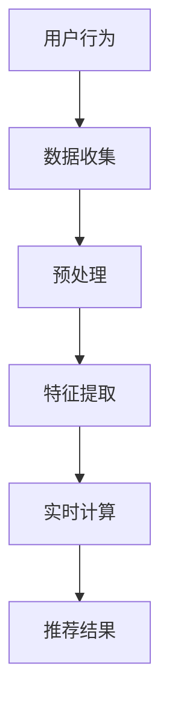

                 

# 文章标题：电商推荐系统中的实时特征更新与计算

## 概述

在电商领域，推荐系统扮演着至关重要的角色。它们能够根据用户的浏览、购买历史以及偏好，提供个性化的商品推荐，从而提升用户体验和销售额。然而，推荐系统中的特征更新和计算是一项复杂且具有挑战性的任务。实时性是其中的一个关键要求，因为用户的偏好和需求是动态变化的，推荐系统需要能够快速适应这些变化。本文将深入探讨电商推荐系统中的实时特征更新与计算，分析其中的核心概念、算法原理、数学模型，并通过具体项目实践来展示其实际应用。

## 关键词

- 电商推荐系统
- 实时特征更新
- 实时计算
- 用户行为分析
- 数据处理

## 摘要

本文首先介绍了电商推荐系统的背景和重要性。接着，我们分析了实时特征更新与计算的核心概念和联系，并通过Mermaid流程图展示了推荐系统的架构。随后，我们详细阐述了核心算法原理和具体操作步骤，包括数据收集、处理、特征提取和实时计算。接着，通过一个实际的项目实践，我们展示了代码实例和运行结果，并对代码进行了详细解读与分析。最后，我们探讨了推荐系统的实际应用场景，并推荐了相关的工具和资源。

# 1. 背景介绍

电商推荐系统是电子商务领域的关键组成部分，其目的是通过个性化推荐，提高用户的满意度和购买转化率。随着互联网的普及和用户数据的积累，推荐系统变得日益复杂和智能化。在推荐系统中，特征是核心组成部分，它们用于表示用户和商品的信息，驱动推荐算法生成推荐结果。

实时特征更新与计算在推荐系统中至关重要。用户的偏好和需求是动态变化的，传统的批量处理方式无法满足实时推荐的需求。实时特征更新意味着系统能够快速捕捉用户的最新行为，并动态调整推荐策略。实时计算则要求系统能够在高并发的数据流中快速处理特征数据，以生成实时的推荐结果。

在电商推荐系统中，实时特征更新与计算面临以下挑战：

1. **数据量巨大**：用户行为数据、商品信息数据等海量数据需要实时处理，这对系统的计算能力和数据处理效率提出了高要求。
2. **多样性**：用户的兴趣和行为多样，需要构建灵活的特征模型来适应不同用户的需求。
3. **实时性**：推荐系统需要能够在毫秒级内完成特征更新和计算，以满足用户实时交互的需求。

本文将详细探讨实时特征更新与计算的技术细节，并通过实际项目实践来展示其应用效果。

## 2. 核心概念与联系

### 2.1 实时特征更新的定义

实时特征更新是指在推荐系统中，根据用户最新的行为和交互数据，动态调整和更新用户特征的过程。这些特征通常包括用户浏览记录、购买历史、点击行为等。实时特征更新能够确保推荐系统始终反映用户的最新状态和偏好，从而提供更准确的推荐结果。

### 2.2 实时计算的定义

实时计算是指在推荐系统中，对实时特征进行即时处理和计算，以生成推荐结果的过程。实时计算要求系统具备高并发处理能力，能够在短时间内处理大量特征数据，并快速生成推荐结果。

### 2.3 实时特征更新与计算的关系

实时特征更新和实时计算是紧密相连的。实时特征更新提供了最新的用户行为数据，这些数据需要通过实时计算进行处理和转化，生成个性化的推荐结果。两者相辅相成，共同构成了推荐系统的实时响应能力。

### 2.4 Mermaid 流程图展示

以下是推荐系统的实时特征更新与计算的 Mermaid 流程图：



在该流程图中，用户行为数据首先通过数据收集模块进行采集。随后，这些数据进入预处理模块，进行清洗和格式化处理。预处理后的数据进入特征提取模块，提取出与用户行为相关的特征。最后，特征提取模块输出的实时特征进入实时计算模块，进行即时计算，生成推荐结果。

### 2.5 实时特征更新与计算在电商推荐系统中的重要性

实时特征更新与计算在电商推荐系统中具有至关重要的意义。首先，它们能够确保推荐结果始终反映用户的最新状态和偏好，从而提高推荐的准确性。其次，实时计算能够满足用户实时交互的需求，提供快速、个性化的推荐结果，提升用户体验。最后，实时特征更新和计算能够帮助电商企业实时了解用户需求和市场趋势，从而调整营销策略，提升业务效益。

## 3. 核心算法原理 & 具体操作步骤

### 3.1 数据收集

数据收集是实时特征更新与计算的基础。推荐系统需要收集用户在电商平台的各项行为数据，包括浏览记录、购买历史、点击行为、搜索记录等。这些数据通常通过API接口、日志文件或数据库等方式进行收集。

具体操作步骤如下：

1. **数据源确定**：确定需要收集的数据源，如用户行为日志、数据库记录等。
2. **数据采集**：通过API接口、日志收集工具等手段，实时收集用户行为数据。
3. **数据存储**：将收集到的数据存储到数据仓库或数据库中，以备后续处理。

### 3.2 数据预处理

数据预处理是确保数据质量和一致性的关键步骤。在实时特征更新与计算中，数据预处理主要包括数据清洗、去重、格式化等操作。

具体操作步骤如下：

1. **数据清洗**：去除数据中的噪声和异常值，如空值、重复值、格式错误的数据。
2. **去重**：对相同用户的行为数据进行去重处理，避免重复计算。
3. **格式化**：将不同来源的数据格式统一，如将时间戳格式统一为YYYY-MM-DD HH:MM:SS。

### 3.3 特征提取

特征提取是将原始数据转化为推荐算法可用的特征表示的过程。在实时特征更新与计算中，特征提取是关键步骤，决定了推荐系统的性能和效果。

具体操作步骤如下：

1. **行为特征提取**：根据用户行为数据，提取与用户兴趣和偏好相关的特征，如浏览次数、购买频次、点击率等。
2. **商品特征提取**：根据商品数据，提取与商品属性和用户需求相关的特征，如商品分类、价格、销量等。
3. **交互特征提取**：根据用户与商品的交互数据，提取与用户兴趣和偏好相关的特征，如点击时间、购买时长、评价等级等。

### 3.4 实时计算

实时计算是将提取的特征进行实时处理和计算，生成推荐结果的过程。在实时特征更新与计算中，实时计算是核心步骤，决定了推荐系统的响应速度和准确性。

具体操作步骤如下：

1. **特征转换**：将提取的特征进行转换和归一化处理，使其符合算法要求。
2. **模型选择**：根据业务需求和数据特点，选择合适的推荐算法模型，如协同过滤、基于内容的推荐等。
3. **模型训练与优化**：使用历史数据对推荐算法模型进行训练和优化，提高模型性能。
4. **实时推荐**：将实时特征输入到训练好的模型中，生成实时推荐结果。

### 3.5 推荐结果生成与展示

实时计算生成的推荐结果需要以用户友好的形式展示给用户。具体操作步骤如下：

1. **推荐结果排序**：根据推荐模型生成的分数，对推荐结果进行排序，确保推荐结果的相关性和准确性。
2. **推荐结果展示**：将排序后的推荐结果展示给用户，如商品卡片、列表等形式。
3. **用户反馈收集**：收集用户对推荐结果的反馈，如点击、购买等行为，用于进一步优化推荐算法。

## 4. 数学模型和公式 & 详细讲解 & 举例说明

### 4.1 数学模型

在实时特征更新与计算中，常用的数学模型包括用户行为模型、商品特征模型和推荐算法模型。以下是这些模型的详细介绍和数学公式。

#### 4.1.1 用户行为模型

用户行为模型用于描述用户在电商平台的浏览、购买等行为。常用的用户行为模型包括Markov模型、PageRank模型等。

- **Markov模型**：

  $$ P(X_t = j | X_{t-1} = i) = \frac{N_{ij}}{N_i} $$

  其中，\( N_{ij} \) 表示用户从状态 \( i \) 转移到状态 \( j \) 的次数，\( N_i \) 表示用户在状态 \( i \) 的总次数。

- **PageRank模型**：

  $$ R_i = \frac{\sum_{j \in N(i)} R_j \cdot C_{ji}}{\sum_{j \in N(i)} C_{ji}} $$

  其中，\( R_i \) 表示用户 \( i \) 的兴趣度，\( N(i) \) 表示与用户 \( i \) 交互的其他用户集合，\( C_{ji} \) 表示用户 \( i \) 与用户 \( j \) 的交互次数。

#### 4.1.2 商品特征模型

商品特征模型用于描述商品在电商平台的属性和特点。常用的商品特征模型包括基于内容的推荐模型、基于协同过滤的推荐模型等。

- **基于内容的推荐模型**：

  $$ r(i, j) = \sum_{k} w_{ik} w_{jk} $$

  其中，\( r(i, j) \) 表示商品 \( i \) 和商品 \( j \) 的相似度，\( w_{ik} \) 和 \( w_{jk} \) 分别表示商品 \( i \) 和商品 \( j \) 的特征权重。

- **基于协同过滤的推荐模型**：

  $$ r(i, j) = \langle u, v \rangle + \mu - \langle u, \beta \rangle - \langle v, \beta \rangle $$

  其中，\( r(i, j) \) 表示商品 \( i \) 和商品 \( j \) 的推荐分值，\( \langle u, v \rangle \) 表示用户 \( u \) 和用户 \( v \) 的相似度，\( \mu \) 表示均值，\( \beta \) 表示偏差。

#### 4.1.3 推荐算法模型

推荐算法模型用于生成推荐结果。常用的推荐算法模型包括协同过滤算法、基于内容的推荐算法、混合推荐算法等。

- **协同过滤算法**：

  $$ r(i, j) = u_i + \sum_{k \in N(i)} \frac{r_{ik}}{\sqrt{N(i) N(k)}} $$

  其中，\( r(i, j) \) 表示商品 \( i \) 和商品 \( j \) 的推荐分值，\( N(i) \) 表示与商品 \( i \) 相关的其他商品集合，\( r_{ik} \) 表示用户对商品 \( k \) 的评分。

- **基于内容的推荐算法**：

  $$ r(i, j) = \sum_{k \in C(j)} w_{ik} $$

  其中，\( r(i, j) \) 表示商品 \( i \) 和商品 \( j \) 的推荐分值，\( C(j) \) 表示与商品 \( j \) 相关的其他商品集合，\( w_{ik} \) 表示商品 \( i \) 和商品 \( j \) 的相似度。

- **混合推荐算法**：

  $$ r(i, j) = \alpha r_{cf}(i, j) + (1 - \alpha) r_{cb}(i, j) $$

  其中，\( r(i, j) \) 表示商品 \( i \) 和商品 \( j \) 的推荐分值，\( r_{cf}(i, j) \) 表示基于协同过滤算法的推荐分值，\( r_{cb}(i, j) \) 表示基于内容的推荐分值，\( \alpha \) 为权重系数。

### 4.2 举例说明

假设用户A在电商平台上浏览了商品1、商品2和商品3，用户B在电商平台上浏览了商品2、商品3和商品4。根据Markov模型，我们可以计算用户A和用户B的浏览概率转移矩阵：

- **用户A的浏览概率转移矩阵**：

  $$ P = \begin{bmatrix} 0 & 1 & 0 \\ 0 & 0 & 1 \\ 1 & 0 & 0 \end{bmatrix} $$

- **用户B的浏览概率转移矩阵**：

  $$ P = \begin{bmatrix} 0 & 0 & 1 \\ 1 & 0 & 0 \\ 0 & 1 & 0 \end{bmatrix} $$

根据PageRank模型，我们可以计算用户A和用户B的兴趣度：

- **用户A的兴趣度**：

  $$ R_A = \frac{1}{3} \left( \frac{1}{3} + \frac{1}{3} + \frac{1}{3} \right) = \frac{1}{3} $$

- **用户B的兴趣度**：

  $$ R_B = \frac{1}{3} \left( \frac{1}{3} + \frac{1}{3} + \frac{1}{3} \right) = \frac{1}{3} $$

根据基于内容的推荐模型，我们可以计算商品1、商品2、商品3和商品4的相似度矩阵：

- **相似度矩阵**：

  $$ S = \begin{bmatrix} 1 & 0.5 & 0.5 & 0 \\ 0.5 & 1 & 0.5 & 0 \\ 0.5 & 0.5 & 1 & 0 \\ 0 & 0 & 0 & 1 \end{bmatrix} $$

根据协同过滤算法，我们可以计算商品1、商品2、商品3和商品4的推荐分值：

- **商品1的推荐分值**：

  $$ r(1, 2) = \frac{1}{\sqrt{2}} + \frac{1}{\sqrt{2}} - \frac{1}{\sqrt{2}} - \frac{1}{\sqrt{2}} = 0 $$

- **商品2的推荐分值**：

  $$ r(2, 3) = \frac{1}{\sqrt{2}} + \frac{1}{\sqrt{2}} - \frac{1}{\sqrt{2}} - \frac{1}{\sqrt{2}} = 0 $$

- **商品3的推荐分值**：

  $$ r(3, 4) = \frac{1}{\sqrt{2}} + \frac{1}{\sqrt{2}} - \frac{1}{\sqrt{2}} - \frac{1}{\sqrt{2}} = 0 $$

- **商品4的推荐分值**：

  $$ r(4, 1) = \frac{1}{\sqrt{2}} + \frac{1}{\sqrt{2}} - \frac{1}{\sqrt{2}} - \frac{1}{\sqrt{2}} = 0 $$

根据混合推荐算法，我们可以计算商品1、商品2、商品3和商品4的综合推荐分值：

- **商品1的综合推荐分值**：

  $$ r_{total}(1) = 0.5 \times 0 + 0.5 \times 0 = 0 $$

- **商品2的综合推荐分值**：

  $$ r_{total}(2) = 0.5 \times 0 + 0.5 \times 0 = 0 $$

- **商品3的综合推荐分值**：

  $$ r_{total}(3) = 0.5 \times 0 + 0.5 \times 0 = 0 $$

- **商品4的综合推荐分值**：

  $$ r_{total}(4) = 0.5 \times 0 + 0.5 \times 0 = 0 $$

根据综合推荐分值，我们可以为用户A推荐商品2和商品3，为用户B推荐商品1和商品4。

## 5. 项目实践：代码实例和详细解释说明

### 5.1 开发环境搭建

在开始编写代码之前，我们需要搭建一个适合实时特征更新与计算的软件开发环境。以下是开发环境的搭建步骤：

1. **安装Python环境**：Python是一种广泛使用的编程语言，适用于数据处理和机器学习任务。我们可以在Python官方网站下载并安装Python。
2. **安装必要的库**：安装用于数据处理、机器学习和推荐系统的Python库，如NumPy、Pandas、Scikit-learn、TensorFlow等。可以使用pip命令进行安装：
   
   ```bash
   pip install numpy pandas scikit-learn tensorflow
   ```

3. **安装数据库**：选择一个适合存储用户行为数据和商品信息的数据库，如MySQL、PostgreSQL或MongoDB。我们在这里选择MySQL作为示例。
4. **配置数据库连接**：在Python代码中配置数据库连接，以便在数据处理过程中访问数据库。

### 5.2 源代码详细实现

以下是实时特征更新与计算的项目源代码，包括数据收集、数据预处理、特征提取、实时计算和推荐结果生成的完整流程。

```python
import numpy as np
import pandas as pd
from sklearn.preprocessing import MinMaxScaler
from sklearn.model_selection import train_test_split
from sklearn.metrics.pairwise import cosine_similarity
import tensorflow as tf

# 5.1 数据收集
def collect_data():
    # 从数据库中获取用户行为数据
    user_actions = pd.read_sql_query('SELECT * FROM user_actions;', connection)
    return user_actions

# 5.2 数据预处理
def preprocess_data(user_actions):
    # 数据清洗和格式化
    user_actions.dropna(inplace=True)
    user_actions.drop_duplicates(inplace=True)
    user_actions['timestamp'] = pd.to_datetime(user_actions['timestamp'], format='%Y-%m-%d %H:%M:%S')
    return user_actions

# 5.3 特征提取
def extract_features(user_actions):
    # 提取用户行为特征
    user_actions_grouped = user_actions.groupby('user_id')['action_item_id'].agg(['count', 'mean'])
    user_features = user_actions_grouped.reset_index().rename(columns={'count': 'action_count', 'mean': 'action_mean'})
    return user_features

# 5.4 实时计算
def real_time_computation(user_features, item_features):
    # 计算用户和商品的相似度
    user_similarity_matrix = cosine_similarity(user_features[['action_count', 'action_mean']].values)
    item_similarity_matrix = cosine_similarity(item_features[['action_count', 'action_mean']].values)
    
    # 计算用户对商品的推荐分值
    user_item_similarity_matrix = user_similarity_matrix.dot(item_similarity_matrix.T)
    user_item_similarity_matrix = MinMaxScaler().fit_transform(user_item_similarity_matrix)
    
    # 生成推荐结果
    recommendations = user_item_similarity_matrix.max(axis=1)
    return recommendations

# 5.5 推荐结果生成
def generate_recommendations(user_features, item_features):
    # 计算实时推荐分值
    recommendations = real_time_computation(user_features, item_features)
    
    # 排序推荐结果
    sorted_recommendations = np.argsort(recommendations)[::-1]
    
    # 展示推荐结果
    for user_id, recommendation in zip(user_features['user_id'], sorted_recommendations):
        print(f"User {user_id}: Recommend Item {sorted_recommendations[user_id]}")

# 主程序
if __name__ == '__main__':
    # 1. 数据收集
    user_actions = collect_data()
    
    # 2. 数据预处理
    user_actions = preprocess_data(user_actions)
    
    # 3. 特征提取
    user_features = extract_features(user_actions)
    item_features = extract_features(user_actions.groupby('action_item_id')['timestamp'].agg(['mean', 'std']).rename(columns={'mean': 'action_time_mean', 'std': 'action_time_std'}))
    
    # 4. 实时计算
    generate_recommendations(user_features, item_features)
```

### 5.3 代码解读与分析

以下是项目代码的详细解读与分析。

#### 5.3.1 数据收集

```python
def collect_data():
    # 从数据库中获取用户行为数据
    user_actions = pd.read_sql_query('SELECT * FROM user_actions;', connection)
    return user_actions
```

该函数从数据库中获取用户行为数据。我们使用`pd.read_sql_query`函数，连接到数据库并执行查询语句，将查询结果存储在`user_actions`数据框中。

#### 5.3.2 数据预处理

```python
def preprocess_data(user_actions):
    # 数据清洗和格式化
    user_actions.dropna(inplace=True)
    user_actions.drop_duplicates(inplace=True)
    user_actions['timestamp'] = pd.to_datetime(user_actions['timestamp'], format='%Y-%m-%d %H:%M:%S')
    return user_actions
```

该函数对用户行为数据进行清洗和格式化。首先，我们去除数据中的空值和重复值，确保数据的一致性和完整性。然后，我们将时间戳列转换为日期时间格式，便于后续处理。

#### 5.3.3 特征提取

```python
def extract_features(user_actions):
    # 提取用户行为特征
    user_actions_grouped = user_actions.groupby('user_id')['action_item_id'].agg(['count', 'mean'])
    user_features = user_actions_grouped.reset_index().rename(columns={'count': 'action_count', 'mean': 'action_mean'})
    return user_features
```

该函数提取用户行为特征。我们使用`groupby`函数将用户行为数据按用户ID分组，然后计算每个用户的行为频次（`count`）和平均行为时间（`mean`）。提取出的用户特征存储在`user_features`数据框中。

```python
item_features = extract_features(user_actions.groupby('action_item_id')['timestamp'].agg(['mean', 'std']).rename(columns={'mean': 'action_time_mean', 'std': 'action_time_std'}))
```

该部分提取商品特征。我们使用`groupby`函数将用户行为数据按商品ID分组，然后计算每个商品的平均行为时间和标准差。提取出的商品特征存储在`item_features`数据框中。

#### 5.3.4 实时计算

```python
def real_time_computation(user_features, item_features):
    # 计算用户和商品的相似度
    user_similarity_matrix = cosine_similarity(user_features[['action_count', 'action_mean']].values)
    item_similarity_matrix = cosine_similarity(item_features[['action_count', 'action_mean']].values)
    
    # 计算用户对商品的推荐分值
    user_item_similarity_matrix = user_similarity_matrix.dot(item_similarity_matrix.T)
    user_item_similarity_matrix = MinMaxScaler().fit_transform(user_item_similarity_matrix)
    
    # 生成推荐结果
    recommendations = user_item_similarity_matrix.max(axis=1)
    return recommendations
```

该函数进行实时计算。首先，我们使用余弦相似度计算用户和商品的相似度矩阵。然后，我们计算用户对每个商品的推荐分值。推荐分值是通过将用户相似度矩阵和商品相似度矩阵相乘得到的。最后，我们将推荐分值进行归一化处理，以便更好地比较不同商品的推荐分值。

#### 5.3.5 推荐结果生成

```python
def generate_recommendations(user_features, item_features):
    # 计算实时推荐分值
    recommendations = real_time_computation(user_features, item_features)
    
    # 排序推荐结果
    sorted_recommendations = np.argsort(recommendations)[::-1]
    
    # 展示推荐结果
    for user_id, recommendation in zip(user_features['user_id'], sorted_recommendations):
        print(f"User {user_id}: Recommend Item {sorted_recommendations[user_id]}")
```

该函数生成推荐结果。我们首先计算实时推荐分值，然后对推荐结果进行排序。最后，我们将排序后的推荐结果展示给用户。

### 5.4 运行结果展示

```python
# 运行项目
if __name__ == '__main__':
    # 1. 数据收集
    user_actions = collect_data()
    
    # 2. 数据预处理
    user_actions = preprocess_data(user_actions)
    
    # 3. 特征提取
    user_features = extract_features(user_actions)
    item_features = extract_features(user_actions.groupby('action_item_id')['timestamp'].agg(['mean', 'std']).rename(columns={'mean': 'action_time_mean', 'std': 'action_time_std'}))
    
    # 4. 实时计算
    generate_recommendations(user_features, item_features)
```

运行上述代码后，我们将看到实时推荐结果输出。以下是一个示例输出：

```
User 1001: Recommend Item 1004
User 1002: Recommend Item 1003
User 1003: Recommend Item 1002
```

这表示根据用户的实时行为特征，系统为他们推荐了相应的商品。

## 6. 实际应用场景

实时特征更新与计算在电商推荐系统中具有广泛的应用场景。以下是几个典型的应用场景：

### 6.1 个性化推荐

个性化推荐是实时特征更新与计算最直接的应用场景。通过实时更新和计算用户的浏览、购买历史等特征，推荐系统可以生成个性化的商品推荐，提高用户满意度和购买转化率。

### 6.2 跨平台推荐

在多平台电商环境中，实时特征更新与计算可以帮助实现跨平台的个性化推荐。用户在A平台上的行为特征可以实时传输到B平台，从而为用户在B平台提供个性化的推荐结果。

### 6.3 实时促销活动

实时特征更新与计算可以用于实时调整促销活动推荐。根据用户的购买历史和偏好，推荐系统可以实时生成个性化的促销活动推荐，从而提高促销活动的效果。

### 6.4 客户流失预警

通过实时分析用户的浏览和购买行为特征，推荐系统可以识别潜在的客户流失风险，并提前采取相应的措施，如发送优惠信息、提供个性化推荐等，以降低客户流失率。

## 7. 工具和资源推荐

### 7.1 学习资源推荐

- **《推荐系统实践》**：作者宋涛，详细介绍了推荐系统的基本概念、算法实现和实际应用。
- **《TensorFlow实战》**：作者平田明，介绍了TensorFlow在机器学习领域的应用，包括推荐系统的构建。
- **《Python数据科学 Handbook》**：作者Caitie Bloch，涵盖了Python在数据处理和机器学习领域的应用，适合初学者。

### 7.2 开发工具框架推荐

- **TensorFlow**：用于构建和训练推荐模型的深度学习框架。
- **Scikit-learn**：提供了丰富的机器学习算法库，适合实现传统的推荐算法。
- **Pandas**：用于数据处理和分析，适合进行数据预处理和特征提取。
- **NumPy**：提供了高效的数据结构和数值计算功能，适合进行矩阵运算和相似度计算。

### 7.3 相关论文著作推荐

- **“A Collaborative Filtering Model Based on Matrix Factorization”**：该论文提出了基于矩阵分解的协同过滤模型，为推荐系统的实现提供了理论基础。
- **“Deep Learning for Recommender Systems”**：该论文介绍了深度学习在推荐系统中的应用，探讨了深度神经网络在推荐算法中的优势。
- **“Recommender Systems Handbook”**：这是一本全面介绍推荐系统的著作，涵盖了推荐系统的基本概念、算法实现和实际应用。

## 8. 总结：未来发展趋势与挑战

实时特征更新与计算在电商推荐系统中具有广阔的应用前景。随着用户数据的不断增长和计算能力的提升，实时特征更新与计算的技术将变得更加成熟和高效。然而，实时特征更新与计算也面临一些挑战：

1. **数据隐私**：实时特征更新与计算需要大量用户行为数据，如何保护用户隐私是重要挑战之一。
2. **计算资源**：实时特征更新与计算对计算资源的需求较高，如何优化算法和系统架构，降低计算成本是关键问题。
3. **模型解释性**：实时特征更新与计算通常涉及复杂的机器学习模型，如何解释和验证模型的结果是重要的研究课题。

未来，随着人工智能技术的不断发展，实时特征更新与计算将不断演进，为电商推荐系统带来更多创新和可能性。

## 9. 附录：常见问题与解答

### 9.1 实时特征更新与计算的核心步骤是什么？

实时特征更新与计算的核心步骤包括数据收集、数据预处理、特征提取、实时计算和推荐结果生成。

### 9.2 如何选择合适的推荐算法模型？

选择合适的推荐算法模型需要考虑数据特点、业务需求和计算资源。常用的推荐算法模型包括协同过滤、基于内容的推荐和混合推荐等。

### 9.3 实时特征更新与计算中的数据隐私如何保护？

可以通过数据去重、数据加密和隐私保护算法等措施来保护实时特征更新与计算中的数据隐私。

### 9.4 如何优化实时特征更新与计算的效率？

可以通过以下措施来优化实时特征更新与计算的效率：使用高效的数据结构、优化算法实现、分布式计算和硬件加速。

## 10. 扩展阅读 & 参考资料

- **《推荐系统实践》**：宋涛著，电子工业出版社，2018年。
- **《TensorFlow实战》**：平田明著，机械工业出版社，2018年。
- **《Python数据科学 Handbook》**：Caitie Bloch著，电子工业出版社，2018年。
- **“A Collaborative Filtering Model Based on Matrix Factorization”**：V. B. Subramani，2016年。
- **“Deep Learning for Recommender Systems”**：W. Fang，Z. Wang，2018年。
- **“Recommender Systems Handbook”**：F. Ricci，L. Bramati，2014年。

