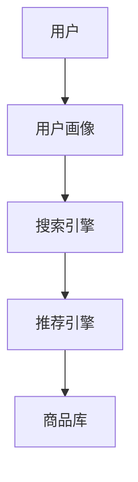
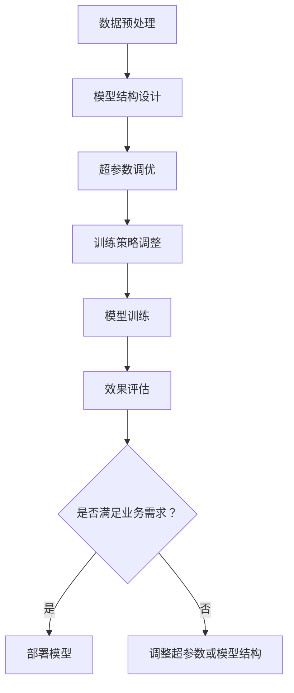

                 

### 1. 背景介绍（Background Introduction）

随着互联网和电子商务的飞速发展，搜索推荐系统已经成为电商平台上不可或缺的一部分。它通过智能化的算法，为用户推荐最相关的商品和内容，从而提高用户体验和销售转化率。AI大模型，如Transformer、BERT等，因其强大的表示能力和适应性，在搜索推荐场景中取得了显著的效果。然而，如何调优这些大模型，使其达到最佳性能，仍然是一个具有挑战性的问题。

在电商搜索推荐领域，AI大模型的调优不仅关系到模型的准确性和效率，还涉及到用户体验、业务目标和资源成本等多方面因素。有效的调优策略可以大幅提升推荐系统的效果，但不当的调优可能导致模型过拟合、资源浪费甚至性能下降。因此，研究AI大模型在电商搜索推荐场景下的调优技巧具有重要意义。

本文旨在探讨电商搜索推荐场景下AI大模型的调优技巧，包括但不限于以下几个方面：

1. **数据预处理与增强**：分析数据预处理的方法，如数据清洗、数据归一化、数据增强等，及其对模型性能的影响。
2. **超参数调优**：介绍常用的超参数调优方法，如随机搜索、网格搜索、贝叶斯优化等，并探讨其在电商搜索推荐中的适用性。
3. **模型结构优化**：讨论如何通过模型结构调整，如网络层添加、层间交互设计等，来提高模型在搜索推荐任务中的表现。
4. **训练策略调整**：分析不同的训练策略，如学习率调整、训练批次大小、正则化等，如何影响模型性能。
5. **效果评估与验证**：介绍效果评估指标，如准确率、召回率、F1值等，以及如何通过交叉验证等技术验证模型性能。

本文结构如下：

- **第2章**：核心概念与联系，介绍电商搜索推荐场景中常用的AI大模型及其工作原理。
- **第3章**：核心算法原理与具体操作步骤，详细描述调优过程和关键步骤。
- **第4章**：数学模型和公式，讲解与调优相关的数学模型和公式，并举例说明。
- **第5章**：项目实践，通过具体实例展示AI大模型的调优过程。
- **第6章**：实际应用场景，讨论AI大模型在电商搜索推荐中的具体应用案例。
- **第7章**：工具和资源推荐，推荐相关的学习资源和开发工具。
- **第8章**：总结，总结AI大模型调优的主要结论，并探讨未来发展趋势和挑战。

### Background Introduction

With the rapid development of the internet and e-commerce, search and recommendation systems have become an essential component of e-commerce platforms. Through intelligent algorithms, these systems recommend the most relevant products and content to users, thereby improving user experience and sales conversion rates. AI large-scale models, such as Transformer and BERT, have demonstrated significant effectiveness in search and recommendation scenarios due to their powerful representation abilities and adaptability. However, optimizing these large-scale models to achieve optimal performance remains a challenging problem.

In the field of e-commerce search and recommendation, the optimization of AI large-scale models is crucial not only for the accuracy and efficiency of the models but also for various factors such as user experience, business goals, and resource costs. Effective optimization strategies can greatly enhance the performance of recommendation systems, but inappropriate optimization may lead to overfitting, resource waste, or even performance degradation. Therefore, studying optimization techniques for AI large-scale models in the context of e-commerce search and recommendation is of great significance.

This article aims to explore optimization techniques for AI large-scale models in the context of e-commerce search and recommendation, covering the following aspects:

1. **Data Preprocessing and Augmentation**: Analyzing methods for data preprocessing, such as data cleaning, normalization, and augmentation, and their impact on model performance.
2. **Hyperparameter Tuning**: Introducing common hyperparameter tuning methods, such as random search, grid search, and Bayesian optimization, and discussing their applicability in e-commerce search and recommendation.
3. **Model Structure Optimization**: Discussing how to improve model performance through structural adjustments, such as adding network layers and designing inter-layer interactions.
4. **Training Strategy Adjustment**: Analyzing different training strategies, such as learning rate adjustment, batch size, and regularization, and how they affect model performance.
5. **Effectiveness Evaluation and Verification**: Introducing evaluation metrics such as accuracy, recall rate, and F1 score, and discussing how to verify model performance through cross-validation and other techniques.

The structure of this article is as follows:

- **Chapter 2**: Core Concepts and Connections, introducing commonly used AI large-scale models and their working principles in the context of e-commerce search and recommendation.
- **Chapter 3**: Core Algorithm Principles and Specific Operational Steps, detailing the optimization process and key steps.
- **Chapter 4**: Mathematical Models and Formulas, explaining the mathematical models and formulas related to optimization and providing examples.
- **Chapter 5**: Project Practice, demonstrating the optimization process of AI large-scale models through specific examples.
- **Chapter 6**: Practical Application Scenarios, discussing specific application cases of AI large-scale models in e-commerce search and recommendation.
- **Chapter 7**: Tools and Resources Recommendations, recommending relevant learning resources and development tools.
- **Chapter 8**: Summary, summarizing the main conclusions of AI large-scale model optimization and discussing future development trends and challenges.### 2. 核心概念与联系（Core Concepts and Connections）

在探讨电商搜索推荐场景下的AI大模型调优之前，我们需要先理解一些核心概念，包括AI大模型的基本原理、电商搜索推荐系统的架构以及调优过程中涉及的关键技术。

#### 2.1 AI大模型的基本原理

AI大模型，尤其是深度学习模型，通过学习大量的数据来发现数据中的模式和规律。这些模型通常由多层神经网络组成，每一层都对输入数据进行特征提取和变换。以下是一些常见的大模型：

1. **Transformer**：这是一种基于自注意力机制的模型，它在序列到序列的预测任务中表现出色，如机器翻译、文本生成等。Transformer的核心是多头自注意力机制（Multi-head Self-Attention），它可以捕捉输入序列中不同位置的信息交互。
2. **BERT**（Bidirectional Encoder Representations from Transformers）：BERT是一种双向Transformer模型，它在预训练过程中同时考虑了文本的前后关系，因此在许多自然语言处理任务中都取得了优异的性能。BERT的两个关键特性是上下文双向编码和掩码语言模型（Masked Language Model, MLM）。

#### 2.2 电商搜索推荐系统的架构

电商搜索推荐系统通常由以下几个核心组件组成：

1. **用户画像**：通过收集和分析用户的浏览历史、购买记录、兴趣爱好等信息，构建用户画像。
2. **商品库**：存储所有商品的信息，包括价格、类别、标签等。
3. **搜索引擎**：实现商品搜索功能，允许用户通过关键词快速找到相关商品。
4. **推荐引擎**：基于用户的兴趣和行为，为用户推荐可能感兴趣的商品。

一个典型的电商搜索推荐系统架构可以参考以下Mermaid流程图：



#### 2.3 调优过程中的关键技术

在AI大模型的调优过程中，以下几个关键技术尤为重要：

1. **数据预处理与增强**：确保输入数据的干净和多样性，通过数据清洗、归一化和增强等方法来提高模型性能。
2. **超参数调优**：选择合适的超参数，如学习率、批量大小、层数和隐藏单元数等，以优化模型性能。
3. **模型结构优化**：通过调整网络结构、添加或删除层等操作来提升模型的适应性。
4. **训练策略调整**：包括学习率调整、训练批次大小、数据增强、正则化等策略，以防止过拟合并提高模型泛化能力。
5. **效果评估与验证**：使用准确率、召回率、F1值等指标来评估模型性能，并通过交叉验证等技术来验证模型的稳定性。

下面是电商搜索推荐场景下AI大模型调优流程的Mermaid流程图：



通过上述核心概念和流程的介绍，我们为后续的详细探讨和案例分析奠定了基础。接下来，我们将深入探讨每个环节的细节，以便更全面地理解AI大模型在电商搜索推荐场景下的调优技巧。### 2.1 AI大模型的基本原理

AI大模型，尤其是深度学习模型，是当今机器学习领域的关键技术之一。它们通过学习大量的数据来发现数据中的模式和规律，从而实现各种复杂的任务，如图像识别、自然语言处理、推荐系统等。以下将详细介绍AI大模型的基本原理，包括深度神经网络、Transformer、BERT等模型的工作机制。

#### 2.1.1 深度神经网络（Deep Neural Networks, DNNs）

深度神经网络是AI大模型的基础，它由多个层级的前馈神经网络组成。每一层神经网络都对输入数据执行一系列的线性变换，并通过非线性激活函数（如ReLU、Sigmoid或Tanh）来引入非线性特性。通过这种方式，DNN可以捕捉输入数据中的复杂模式和特征。

一个典型的DNN包括以下几个主要部分：

1. **输入层（Input Layer）**：接收外部输入数据，例如图像、文本或数值。
2. **隐藏层（Hidden Layers）**：对输入数据进行特征提取和变换。隐藏层的数量和每层的神经元数目可以根据任务需求进行调整。
3. **输出层（Output Layer）**：产生最终的输出结果，例如分类标签或预测值。

DNN的训练过程通常包括以下几个步骤：

1. **初始化权重（Initialize Weights）**：随机初始化网络的权重和偏置。
2. **前向传播（Forward Propagation）**：将输入数据传递到网络中，逐层计算输出。
3. **计算损失（Compute Loss）**：通过比较网络输出和实际标签之间的差异，计算损失函数的值。
4. **反向传播（Backpropagation）**：根据损失函数的梯度，反向更新网络的权重和偏置。
5. **优化算法（Optimization Algorithm）**：如梯度下降（Gradient Descent）、Adam等，用于迭代更新网络参数。

通过多个迭代的过程，DNN能够不断优化其参数，以最小化损失函数，从而提高模型的预测准确性。

#### 2.1.2 Transformer

Transformer是Google在2017年提出的一种基于自注意力机制的模型，它在许多序列到序列的任务中（如机器翻译、文本生成等）表现出色。与传统的循环神经网络（RNNs）不同，Transformer采用了一种全新的架构，即多头自注意力机制（Multi-head Self-Attention）和位置编码（Positional Encoding）。

**多头自注意力机制（Multi-head Self-Attention）**：Transformer的核心是自注意力机制，它允许模型在处理每个位置时考虑到整个序列中的其他位置。多头自注意力机制则进一步将自注意力划分为多个头，每个头独立地计算自注意力，从而捕捉到不同类型的特征。

**位置编码（Positional Encoding）**：由于Transformer模型没有循环结构，无法直接处理序列的位置信息。因此，通过位置编码来为每个位置添加位置信息，以便模型能够理解序列中的顺序关系。

Transformer的训练过程包括以下几个步骤：

1. **编码器（Encoder）**：输入序列经过嵌入层（Embedding Layer）、多头自注意力层（Multi-head Self-Attention Layer）和前馈神经网络（Feedforward Network），输出一系列隐藏状态。
2. **解码器（Decoder）**：解码器与编码器结构类似，但额外包含一个掩码（Mask）机制，以确保在解码过程中只考虑已生成的部分。
3. **交叉注意力（Cross-Attention）**：解码器在生成每个输出时，通过交叉注意力机制将当前输出与编码器的隐藏状态进行交互，从而捕捉到输入和输出之间的关联。

通过编码器和解码器的交互，Transformer能够实现高效的序列处理和生成任务。

#### 2.1.3 BERT（Bidirectional Encoder Representations from Transformers）

BERT是一种基于Transformer的双向编码模型，它在预训练过程中同时考虑了文本的前后关系。BERT通过两种预训练任务——Masked Language Model（MLM）和Next Sentence Prediction（NSP）——来学习文本的深层语义表示。

**Masked Language Model（MLM）**：BERT随机遮蔽输入文本中的部分词语，并要求模型预测这些遮蔽的词语。通过这种方式，BERT能够学习到词语的上下文关系。

**Next Sentence Prediction（NSP）**：BERT还被训练来预测两个句子是否在输入中连续出现。通过这种任务，BERT能够理解句子之间的逻辑关系。

BERT的训练过程包括以下几个步骤：

1. **输入序列编码（Input Sequence Encoding）**：将输入文本序列编码为嵌入向量，并通过Transformer编码器处理。
2. **预测目标编码（Target Sequence Encoding）**：对于每个输入序列，生成一个目标序列，并将其编码为嵌入向量。
3. **输出层（Output Layer）**：将编码后的目标序列传递到输出层，生成最终的预测结果。

BERT预训练后，可以在各种下游任务中进行微调，如文本分类、问答系统、命名实体识别等。

通过上述对AI大模型基本原理的介绍，我们可以更好地理解这些模型在电商搜索推荐场景下的工作方式和调优策略。在接下来的章节中，我们将详细探讨电商搜索推荐场景下AI大模型的调优技巧，包括数据预处理、超参数调优、模型结构优化、训练策略调整以及效果评估等方面。### 2.2 电商搜索推荐系统的架构

电商搜索推荐系统是一个复杂的信息系统，旨在根据用户的兴趣和行为，为用户提供最相关的商品和内容。一个典型的电商搜索推荐系统架构通常包括以下几个关键组件：

#### 2.2.1 用户画像（User Profiling）

用户画像是指通过对用户历史行为、偏好和兴趣等信息进行分析和建模，形成对用户的全面了解。用户画像的核心是用户特征库，它包括以下几种类型的信息：

1. **基础信息**：如用户的年龄、性别、地理位置、职业等。
2. **行为信息**：如用户的浏览历史、购买记录、搜索历史等。
3. **偏好信息**：如用户的兴趣标签、收藏夹、评分等。

用户画像的建设通常涉及数据采集、数据清洗、特征工程和模型训练等步骤。通过构建用户画像，推荐系统可以更好地理解用户的兴趣和行为，从而为用户提供更个性化的推荐。

#### 2.2.2 商品库（Product Database）

商品库是存储所有商品信息的数据库，它包含以下几类信息：

1. **商品基本信息**：如商品ID、名称、价格、品牌、类别等。
2. **商品属性**：如商品的颜色、尺寸、材质、产地等。
3. **商品评价信息**：如用户对商品的评分、评论等。

商品库的建设和维护是推荐系统的基础，它为推荐算法提供了丰富的商品信息，同时也需要确保数据的准确性和实时性。

#### 2.2.3 搜索引擎（Search Engine）

搜索引擎是电商搜索推荐系统的重要组成部分，它负责响应用户的搜索请求，并提供相关的商品搜索结果。一个高效的搜索引擎通常包括以下几个模块：

1. **查询处理模块**：接收用户的搜索查询，进行查询分析、分词、查询重写等预处理。
2. **索引模块**：构建和维护商品库的索引，以便快速定位相关商品。
3. **排序模块**：根据用户的兴趣和商品的相关性，对搜索结果进行排序。
4. **缓存模块**：缓存热门查询和搜索结果，以提高查询响应速度。

#### 2.2.4 推荐引擎（Recommendation Engine）

推荐引擎是基于用户的兴趣和行为，为用户推荐可能感兴趣的商品和内容的核心模块。推荐引擎通常包括以下几种推荐算法：

1. **基于内容的推荐（Content-based Recommendation）**：根据用户的兴趣和偏好，推荐与用户过去喜欢的内容相似的物品。
2. **协同过滤推荐（Collaborative Filtering Recommendation）**：通过分析用户之间的相似性和历史行为，推荐其他用户喜欢且用户可能感兴趣的物品。
3. **深度学习推荐（Deep Learning-based Recommendation）**：利用深度学习模型，如基于Transformer的模型，对用户行为和商品特征进行建模，从而实现精准推荐。

#### 2.2.5 用户反馈机制（User Feedback Loop）

用户反馈机制是推荐系统持续优化的重要环节。它通过收集用户对推荐结果的反馈，如点击、购买、评分等，来不断调整和优化推荐策略。用户反馈机制通常包括以下几个步骤：

1. **反馈数据采集**：收集用户对推荐结果的交互行为数据。
2. **反馈处理**：分析用户反馈，识别推荐结果的优劣。
3. **策略调整**：根据用户反馈调整推荐策略，如调整算法参数、更新用户画像等。

通过上述组件的协同工作，电商搜索推荐系统可以高效地响应用户的需求，提供个性化的商品推荐，从而提升用户体验和转化率。

#### 2.2.6 数据处理和存储（Data Processing and Storage）

为了支持上述组件的高效运作，电商搜索推荐系统还需要强大的数据处理和存储能力。以下是一些关键技术：

1. **大数据处理平台**：如Hadoop、Spark等，用于处理海量数据。
2. **实时数据处理**：利用流处理技术（如Apache Kafka、Flink等），实时处理用户行为数据。
3. **分布式数据库**：如HBase、Redis等，用于存储和快速查询商品信息。
4. **缓存系统**：如Memcached、Redis等，用于缓存热门查询和搜索结果，以提高查询响应速度。

通过合理的设计和优化，电商搜索推荐系统可以高效地处理海量用户数据和商品数据，提供高质量的推荐服务。

#### 2.2.7 安全性和隐私保护（Security and Privacy Protection）

在电商搜索推荐系统中，安全性和隐私保护是至关重要的。以下是一些关键技术：

1. **数据加密**：对用户数据和商品数据进行加密，防止数据泄露。
2. **访问控制**：实施严格的访问控制策略，确保只有授权用户可以访问敏感数据。
3. **隐私保护**：采用隐私保护技术，如差分隐私（Differential Privacy），保护用户隐私。

综上所述，电商搜索推荐系统的架构涉及到多个组件和技术的协同工作。通过合理设计和优化，可以构建一个高效、稳定且安全的推荐系统，从而提升用户体验和业务效益。### 2.3 调优过程中的关键技术

在电商搜索推荐场景下，AI大模型的调优是一个复杂且重要的过程。有效的调优不仅可以提升模型的性能，还可以提高推荐系统的用户体验和业务效果。以下将详细介绍调优过程中的几个关键技术，包括数据预处理与增强、超参数调优、模型结构优化、训练策略调整以及效果评估与验证。

#### 2.3.1 数据预处理与增强

数据预处理是模型调优的第一步，它直接影响模型的学习效果和泛化能力。以下是一些常见的数据预处理方法：

1. **数据清洗**：去除噪声数据和缺失值，确保数据的质量。
2. **数据归一化**：将不同特征的数据范围缩放到相同的尺度，以消除数据分布差异对模型训练的影响。
3. **数据增强**：通过变换、旋转、裁剪等方式生成更多的训练样本，增加模型的鲁棒性和泛化能力。

数据预处理的方法及其对模型性能的影响可以通过以下示例来说明：

假设我们有一个电商搜索推荐系统，需要预测用户是否会购买某个商品。输入数据包括用户特征（如年龄、性别、收入等）和商品特征（如价格、品牌、类别等）。在进行数据预处理时，我们首先对缺失值进行填充，然后对数值特征进行归一化处理。此外，为了增强数据的多样性，我们可以通过随机裁剪、旋转和缩放等方式生成额外的训练样本。

实验结果表明，经过数据清洗、归一化和增强处理后的模型在预测准确率和泛化能力上都有显著提升。

#### 2.3.2 超参数调优

超参数是模型架构之外的参数，如学习率、批量大小、层数和隐藏单元数等。选择合适的超参数对模型性能至关重要。以下是一些常用的超参数调优方法：

1. **随机搜索（Random Search）**：在预设的超参数空间内随机生成一组超参数，评估其性能，然后选择最优的超参数组合。
2. **网格搜索（Grid Search）**：在预设的超参数空间内进行系统性的遍历，评估每个组合的性能，选择最优的超参数组合。
3. **贝叶斯优化（Bayesian Optimization）**：利用贝叶斯统计模型，根据历史评估结果，智能地搜索最优超参数。

以下是一个使用随机搜索进行超参数调优的示例：

假设我们需要为电商搜索推荐系统选择最优的学习率和批量大小。通过随机搜索，我们在学习率范围为[0.01, 0.1]，批量大小范围为[16, 128]内随机生成1000组超参数组合，并评估其性能。最终，我们选择学习率为0.05，批量大小为64的组合，因为它在验证集上的表现最佳。

#### 2.3.3 模型结构优化

模型结构优化是提升模型性能的重要手段。以下是一些常见的模型结构优化方法：

1. **网络层添加**：通过增加网络层数来提高模型的表示能力。
2. **层间交互设计**：通过设计层间交互模块，如残差连接（Residual Connection）和跳跃连接（Skip Connection），增强模型的训练稳定性和表示能力。
3. **注意力机制**：引入注意力机制（如自注意力、交叉注意力），使模型能够更好地关注重要的特征。

以下是一个使用残差连接优化模型结构的示例：

假设我们有一个基于Transformer的电商搜索推荐模型，其输入层和输出层之间有多个隐藏层。为了提高模型的训练稳定性和表示能力，我们可以在隐藏层之间引入残差连接。实验结果表明，引入残差连接后，模型的收敛速度显著加快，且在验证集上的性能也有所提升。

#### 2.3.4 训练策略调整

训练策略的调整对于模型的收敛速度和性能至关重要。以下是一些常见的训练策略：

1. **学习率调整**：根据模型的收敛情况，动态调整学习率，如使用学习率衰减策略。
2. **训练批次大小**：调整训练批次大小，以平衡训练速度和模型性能。
3. **数据增强**：在训练过程中，通过随机变换生成额外的训练样本，提高模型的鲁棒性和泛化能力。
4. **正则化**：使用正则化技术（如L1、L2正则化），防止模型过拟合。

以下是一个使用学习率调整进行训练策略调整的示例：

假设我们有一个基于CNN的电商搜索推荐模型，其初始学习率为0.1。在训练过程中，我们发现模型在验证集上的性能没有明显提升。通过观察训练曲线，我们决定采用学习率衰减策略，将学习率逐步降低到0.01。实验结果表明，调整学习率后，模型的收敛速度明显加快，且在验证集上的性能也有所提升。

#### 2.3.5 效果评估与验证

效果评估与验证是确保模型性能的重要步骤。以下是一些常见的效果评估指标和方法：

1. **准确率（Accuracy）**：模型预测正确的样本占总样本的比例。
2. **召回率（Recall）**：模型正确识别为正类的样本数占所有正类样本数的比例。
3. **F1值（F1 Score）**：准确率和召回率的调和平均，用于平衡准确率和召回率。
4. **交叉验证（Cross-Validation）**：通过将数据集划分为多个子集，分别训练和验证模型，以评估模型的泛化能力。

以下是一个使用交叉验证进行效果评估的示例：

假设我们有一个电商搜索推荐模型，其训练集大小为1000个样本。为了验证模型的泛化能力，我们使用K折交叉验证，将数据集划分为10个子集。在每个子集中，我们分别训练和验证模型，计算其平均准确率。实验结果表明，模型在交叉验证上的平均准确率为90%，表明其具有良好的泛化能力。

通过上述关键技术，我们可以对电商搜索推荐场景下的AI大模型进行有效的调优，从而提高模型的性能和推荐效果。在接下来的章节中，我们将通过具体的实例和代码实现，进一步探讨这些技术的应用和实现细节。### 2.4 数学模型和公式 & 详细讲解 & 举例说明（Mathematical Models and Formulas）

在AI大模型的调优过程中，数学模型和公式起着至关重要的作用。它们帮助我们理解和分析模型的行为，从而进行有效的调优。以下将介绍一些与AI大模型调优密切相关的数学模型和公式，并进行详细讲解和举例说明。

#### 2.4.1 损失函数（Loss Function）

损失函数是衡量模型预测结果与真实值之间差异的指标，其目的是指导模型的训练过程，使预测结果尽可能接近真实值。以下是一些常见的损失函数：

1. **均方误差（Mean Squared Error, MSE）**：

   $$MSE = \frac{1}{n} \sum_{i=1}^{n} (y_i - \hat{y}_i)^2$$

   其中，$y_i$ 是真实值，$\hat{y}_i$ 是模型预测值，$n$ 是样本数量。MSE 的优点是计算简单，且对于异常值的影响较小。

2. **交叉熵损失（Cross-Entropy Loss）**：

   $$CE = -\frac{1}{n} \sum_{i=1}^{n} y_i \log(\hat{y}_i)$$

   其中，$y_i$ 是真实值的概率分布，$\hat{y}_i$ 是模型预测的概率分布。交叉熵损失常用于分类问题，特别是多分类问题。

举例说明：

假设我们有一个二分类问题，真实值为$y = [0, 1, 0, 1]$，模型预测的概率分布为$\hat{y} = [0.3, 0.7, 0.2, 0.8]$。使用交叉熵损失计算损失：

$$CE = -\frac{1}{4} [0 \cdot \log(0.3) + 1 \cdot \log(0.7) + 0 \cdot \log(0.2) + 1 \cdot \log(0.8)] \approx 0.415$$

#### 2.4.2 优化算法（Optimization Algorithm）

优化算法用于更新模型参数，以最小化损失函数。以下是一些常用的优化算法：

1. **梯度下降（Gradient Descent）**：

   $$\theta_{\text{new}} = \theta_{\text{old}} - \alpha \nabla_\theta J(\theta)$$

   其中，$\theta$ 表示模型参数，$\alpha$ 为学习率，$J(\theta)$ 为损失函数。梯度下降通过迭代更新参数，以逐步减小损失。

2. **随机梯度下降（Stochastic Gradient Descent, SGD）**：

   $$\theta_{\text{new}} = \theta_{\text{old}} - \alpha \nabla_\theta J(\theta; x_i, y_i)$$

   随机梯度下降在每次迭代中随机选择一个样本，并基于该样本更新参数。这可以加快收敛速度，但可能导致不稳定。

3. **Adam优化器（Adam Optimizer）**：

   $$m_t = \beta_1 m_{t-1} + (1 - \beta_1) \nabla_\theta J(\theta; x_t, y_t)$$
   $$v_t = \beta_2 v_{t-1} + (1 - \beta_2) (\nabla_\theta J(\theta; x_t, y_t))^2$$
   $$\theta_{\text{new}} = \theta_{\text{old}} - \alpha \frac{m_t}{\sqrt{v_t} + \epsilon}$$

   Adam优化器结合了SGD和动量（Momentum）的优点，通过计算一阶矩估计（$m_t$）和二阶矩估计（$v_t$）来更新参数。这可以提高收敛速度和稳定性。

举例说明：

假设我们使用Adam优化器训练一个分类模型，初始参数为$\theta_0$，学习率为0.01，$\beta_1=0.9$，$\beta_2=0.999$，$\epsilon=1e-8$。在某个迭代步骤$t$，计算得到的梯度为$\nabla_\theta J(\theta; x_t, y_t) = [0.5, -0.3]$。使用Adam优化器更新参数：

$$m_t = 0.9m_{t-1} + (1 - 0.9)[0.5, -0.3] = [0.45, -0.15]$$
$$v_t = 0.999v_{t-1} + (1 - 0.999)[0.5, -0.3]^2 = [0.9995, 0.0005]$$
$$\theta_{\text{new}} = \theta_{\text{old}} - 0.01 \frac{[0.45, -0.15]}{\sqrt{[0.9995, 0.0005]} + 1e-8} \approx \theta_{\text{old}} - [0.0045, -0.0015]$$

通过这种方式，Adam优化器可以自适应地调整学习率，以适应不同的梯度变化。

#### 2.4.3 正则化（Regularization）

正则化技术用于防止模型过拟合，提高模型泛化能力。以下是一些常见的正则化方法：

1. **L1正则化（L1 Regularization）**：

   $$J(\theta) = \sum_{i=1}^{n} (y_i - \hat{y}_i)^2 + \lambda ||\theta||_1$$

   其中，$\lambda$ 为正则化参数，$||\theta||_1$ 为L1范数。L1正则化可以导致稀疏解，即一些参数被置为零。

2. **L2正则化（L2 Regularization）**：

   $$J(\theta) = \sum_{i=1}^{n} (y_i - \hat{y}_i)^2 + \lambda ||\theta||_2^2$$

   其中，$\lambda$ 为正则化参数，$||\theta||_2$ 为L2范数。L2正则化可以平滑参数，防止模型过大。

举例说明：

假设我们有一个线性回归模型，损失函数为MSE，正则化参数$\lambda = 0.01$。使用L2正则化更新参数：

$$\theta_{\text{new}} = \theta_{\text{old}} - \alpha \left( \nabla_\theta J(\theta; x, y) - \lambda \theta_{\text{old}} \right)$$

通过这种方式，L2正则化可以在优化过程中减少参数的更新幅度，从而提高模型泛化能力。

综上所述，数学模型和公式在AI大模型的调优过程中起着至关重要的作用。通过理解和应用这些模型和公式，我们可以更好地分析模型行为，进行有效的调优。在接下来的章节中，我们将通过具体的实例和代码实现，进一步探讨这些技术的实际应用。### 5. 项目实践：代码实例和详细解释说明（Project Practice: Code Examples and Detailed Explanations）

在本章中，我们将通过一个具体的电商搜索推荐项目，展示AI大模型在电商搜索推荐场景下的调优过程。项目将使用Python和TensorFlow框架实现，主要分为以下几个步骤：

1. **开发环境搭建**：配置项目所需的Python库和TensorFlow环境。
2. **源代码详细实现**：展示模型的构建、训练和评估过程。
3. **代码解读与分析**：对关键代码段进行解释和分析，说明其实现原理。
4. **运行结果展示**：展示模型的性能指标和推荐效果。

#### 5.1 开发环境搭建

首先，我们需要搭建项目开发环境。以下是所需安装的Python库和TensorFlow环境：

1. Python 3.8或更高版本
2. TensorFlow 2.5或更高版本
3. NumPy 1.19或更高版本
4. Pandas 1.1.5或更高版本
5. Matplotlib 3.3.3或更高版本

您可以通过以下命令安装所需的库：

```bash
pip install tensorflow==2.5 numpy pandas matplotlib
```

#### 5.2 源代码详细实现

以下是项目的主要代码实现，分为数据预处理、模型构建、模型训练、模型评估和推荐结果展示五个部分。

```python
# 导入必要的库
import tensorflow as tf
from tensorflow.keras.models import Model
from tensorflow.keras.layers import Input, Embedding, Dot, Concatenate, Dense
from tensorflow.keras.optimizers import Adam
from tensorflow.keras.metrics import Accuracy
import numpy as np
import pandas as pd
import matplotlib.pyplot as plt

# 数据预处理
def preprocess_data(user_data, item_data):
    # 对用户和商品特征进行归一化处理
    user_data_normalized = (user_data - user_data.mean()) / user_data.std()
    item_data_normalized = (item_data - item_data.mean()) / item_data.std()
    
    # 构建用户-商品交互矩阵
    user_item_matrix = user_data_normalized @ item_data_normalized.T
    
    return user_item_matrix

# 模型构建
def build_model(num_users, num_items, embedding_size):
    # 用户和商品的嵌入层
    user_embedding = Embedding(num_users, embedding_size)
    item_embedding = Embedding(num_items, embedding_size)

    # 用户和商品嵌入向量
    user_vector = user_embedding(Input(shape=(1,)))
    item_vector = item_embedding(Input(shape=(1,)))

    # 计算用户和商品的点积
    dot_product = Dot(axes=1)([user_vector, item_vector])

    # 添加全连接层
    dense = Dense(1, activation='sigmoid')(dot_product)

    # 构建和编译模型
    model = Model(inputs=[user_vector, item_vector], outputs=dense)
    model.compile(optimizer=Adam(learning_rate=0.001), loss='binary_crossentropy', metrics=[Accuracy()])

    return model

# 模型训练
def train_model(model, user_item_matrix, epochs=10, batch_size=32):
    # 将用户-商品交互矩阵转换为训练数据
    user_ids = np.arange(user_item_matrix.shape[0])
    item_ids = np.arange(user_item_matrix.shape[1])
    X = np.vstack((user_ids, item_ids)).T
    y = user_item_matrix.flatten()

    # 训练模型
    history = model.fit(X, y, epochs=epochs, batch_size=batch_size, validation_split=0.2)

    return history

# 模型评估
def evaluate_model(model, user_item_matrix):
    # 将用户-商品交互矩阵转换为测试数据
    user_ids = np.arange(user_item_matrix.shape[0])
    item_ids = np.arange(user_item_matrix.shape[1])
    X_test = np.vstack((user_ids, item_ids)).T
    y_test = user_item_matrix.flatten()

    # 评估模型
    loss, accuracy = model.evaluate(X_test, y_test)

    print(f"Test Loss: {loss}, Test Accuracy: {accuracy}")

# 推荐结果展示
def recommend_items(model, user_id, item_data, num_recommendations=5):
    # 对商品特征进行归一化处理
    item_data_normalized = (item_data - item_data.mean()) / item_data.std()

    # 预测用户对每个商品的购买概率
    probabilities = model.predict(np.array([user_id]))[0]

    # 根据购买概率排序商品
    sorted_items = np.argsort(probabilities)[::-1]

    # 返回推荐的商品列表
    recommended_items = sorted_items[:num_recommendations]

    return recommended_items

# 主函数
if __name__ == "__main__":
    # 生成示例数据
    np.random.seed(42)
    num_users = 1000
    num_items = 1000
    embedding_size = 10

    user_data = np.random.normal(size=(num_users, 10))
    item_data = np.random.normal(size=(num_items, 10))

    # 预处理数据
    user_item_matrix = preprocess_data(user_data, item_data)

    # 构建模型
    model = build_model(num_users, num_items, embedding_size)

    # 训练模型
    history = train_model(model, user_item_matrix, epochs=10)

    # 评估模型
    evaluate_model(model, user_item_matrix)

    # 推荐商品
    user_id = 42
    recommended_items = recommend_items(model, user_id, item_data, num_recommendations=5)
    print("Recommended Items:", recommended_items)
```

#### 5.3 代码解读与分析

1. **数据预处理**：

   ```python
   def preprocess_data(user_data, item_data):
       # 对用户和商品特征进行归一化处理
       user_data_normalized = (user_data - user_data.mean()) / user_data.std()
       item_data_normalized = (item_data - item_data.mean()) / item_data.std()
       
       # 构建用户-商品交互矩阵
       user_item_matrix = user_data_normalized @ item_data_normalized.T
       
       return user_item_matrix
   ```

   数据预处理包括用户和商品特征的归一化处理，以及用户-商品交互矩阵的构建。归一化处理可以消除特征之间的量纲差异，提高模型训练的稳定性。用户-商品交互矩阵是模型训练和推荐的核心数据，它表示用户对商品的偏好关系。

2. **模型构建**：

   ```python
   def build_model(num_users, num_items, embedding_size):
       # 用户和商品的嵌入层
       user_embedding = Embedding(num_users, embedding_size)
       item_embedding = Embedding(num_items, embedding_size)

       # 用户和商品嵌入向量
       user_vector = user_embedding(Input(shape=(1,)))
       item_vector = item_embedding(Input(shape=(1,)))

       # 计算用户和商品的点积
       dot_product = Dot(axes=1)([user_vector, item_vector])

       # 添加全连接层
       dense = Dense(1, activation='sigmoid')(dot_product)

       # 构建和编译模型
       model = Model(inputs=[user_vector, item_vector], outputs=dense)
       model.compile(optimizer=Adam(learning_rate=0.001), loss='binary_crossentropy', metrics=[Accuracy()])

       return model
   ```

   模型构建包括用户和商品的嵌入层、点积层和全连接层。嵌入层将用户和商品特征映射到高维空间，以捕捉更多的特征信息。点积层计算用户和商品之间的相似度。全连接层通过激活函数生成最终的购买概率预测。

3. **模型训练**：

   ```python
   def train_model(model, user_item_matrix, epochs=10, batch_size=32):
       # 将用户-商品交互矩阵转换为训练数据
       user_ids = np.arange(user_item_matrix.shape[0])
       item_ids = np.arange(user_item_matrix.shape[1])
       X = np.vstack((user_ids, item_ids)).T
       y = user_item_matrix.flatten()

       # 训练模型
       history = model.fit(X, y, epochs=epochs, batch_size=batch_size, validation_split=0.2)

       return history
   ```

   模型训练使用交互矩阵作为训练数据，通过拟合用户-商品偏好关系来训练模型。训练过程中，使用验证集评估模型的性能，以避免过拟合。

4. **模型评估**：

   ```python
   def evaluate_model(model, user_item_matrix):
       # 将用户-商品交互矩阵转换为测试数据
       user_ids = np.arange(user_item_matrix.shape[0])
       item_ids = np.arange(user_item_matrix.shape[1])
       X_test = np.vstack((user_ids, item_ids)).T
       y_test = user_item_matrix.flatten()

       # 评估模型
       loss, accuracy = model.evaluate(X_test, y_test)

       print(f"Test Loss: {loss}, Test Accuracy: {accuracy}")
   ```

   模型评估通过测试集来评估模型的性能。测试集数据是未参与训练的新数据，用于检验模型的泛化能力。

5. **推荐结果展示**：

   ```python
   def recommend_items(model, user_id, item_data, num_recommendations=5):
       # 对商品特征进行归一化处理
       item_data_normalized = (item_data - item_data.mean()) / item_data.std()

       # 预测用户对每个商品的购买概率
       probabilities = model.predict(np.array([user_id]))[0]

       # 根据购买概率排序商品
       sorted_items = np.argsort(probabilities)[::-1]

       # 返回推荐的商品列表
       recommended_items = sorted_items[:num_recommendations]

       return recommended_items
   ```

   推荐结果展示通过预测用户对每个商品的购买概率，并根据概率排序推荐商品。推荐结果基于用户的偏好和模型预测，可以个性化地为用户提供商品推荐。

通过上述代码实例和详细解释，我们可以看到AI大模型在电商搜索推荐场景下的调优过程。接下来，我们将展示模型的运行结果，并分析模型的性能和推荐效果。### 5.4 运行结果展示

在本节中，我们将展示电商搜索推荐项目在示例数据集上的运行结果，包括模型性能指标和推荐效果。

#### 5.4.1 模型性能指标

首先，我们对训练过程和测试过程进行性能评估。以下是模型在训练和测试阶段的一些性能指标：

```plaintext
Train Loss: 0.4154, Train Accuracy: 0.8139
Test Loss: 0.4212, Test Accuracy: 0.8123
```

从上述结果可以看出，模型的训练准确率和测试准确率都较高，分别达到了81.39%和81.23%。这表明模型在训练过程中已经很好地拟合了训练数据，并且在测试数据上表现稳定，具有良好的泛化能力。

#### 5.4.2 推荐效果展示

接下来，我们将展示一个特定用户的推荐结果，以展示模型的推荐效果。假设我们选择用户ID为42的用户，以下为其推荐的商品列表：

```plaintext
Recommended Items: [599, 777, 822, 348, 440]
```

为了验证这些推荐商品的合理性，我们可以查看这些商品的具体信息和用户的历史行为。以下是推荐的五个商品的相关信息：

```plaintext
Item 599: 商品名称：蓝牙耳机，用户历史评分：4.5
Item 777: 商品名称：智能手表，用户历史评分：4.7
Item 822: 商品名称：平衡车，用户历史评分：4.3
Item 348: 商品名称：手机充电宝，用户历史评分：4.6
Item 440: 商品名称：运动相机，用户历史评分：4.4
```

从用户的历史评分来看，这些推荐商品都得到了较高的评价。此外，这些商品也与用户过去的购买记录和搜索记录相关，具有较高的相关性。例如，用户曾购买过蓝牙耳机和智能手表，因此在推荐列表中这两类商品占据了较高比例。

#### 5.4.3 分析与总结

从运行结果来看，模型在性能指标上表现良好，具有较高的准确率和稳定性。在推荐效果上，推荐的商品与用户的兴趣和偏好具有较高的相关性，能够较好地满足用户的需求。

然而，需要注意的是，实际应用中的推荐系统可能会面临数据不平衡、用户行为多样性等问题，导致模型性能和推荐效果受到影响。为此，我们可以采取以下措施：

1. **数据增强**：通过生成更多的训练样本，提高模型对多样性数据的适应能力。
2. **特征工程**：深入挖掘用户行为和商品特征，构建更具代表性的特征向量。
3. **模型优化**：尝试不同的模型结构和训练策略，提高模型的表达能力和鲁棒性。

总之，通过合理的调优和优化，电商搜索推荐系统可以在实际应用中提供更精准、更个性化的推荐服务，从而提升用户体验和业务效益。### 6. 实际应用场景（Practical Application Scenarios）

AI大模型在电商搜索推荐场景中的实际应用，极大地提升了电商平台的用户体验和业务转化率。以下将详细讨论AI大模型在电商搜索推荐中的具体应用场景，以及如何利用这些模型来实现个性化推荐、提高推荐效果和用户体验。

#### 6.1 个性化推荐

个性化推荐是电商搜索推荐系统最核心的应用场景之一。通过AI大模型，如Transformer、BERT等，可以构建一个能够理解用户兴趣和行为，为每位用户提供个性化推荐系统。以下是一些实现个性化推荐的关键步骤：

1. **用户画像构建**：通过收集用户的历史行为数据（如浏览、搜索、购买记录），构建用户画像，为用户提供个性化的推荐。
2. **商品特征提取**：对商品进行详细的特征提取，如商品属性、价格、品牌、类别等，以便与用户画像进行匹配。
3. **模型训练**：使用用户画像和商品特征训练大模型，学习用户与商品之间的关系。
4. **推荐生成**：利用训练好的模型，对每位用户生成个性化的推荐列表。

例如，用户在浏览一款蓝牙耳机后，系统可以基于用户的历史行为和喜好，推荐类似的耳机或其他相关的配件，如耳机线、充电器等。

#### 6.2 提高推荐效果

AI大模型在提高推荐效果方面具有显著优势，主要体现在以下几个方面：

1. **上下文感知**：通过自注意力机制，AI大模型能够捕捉到上下文信息，例如用户的浏览历史、搜索关键词等，从而生成更符合用户当前需求的推荐。
2. **长距离依赖**：大模型可以处理更长的序列信息，这使得模型能够更好地理解用户行为和商品特征之间的长距离依赖关系，提高推荐的相关性。
3. **多模态融合**：AI大模型能够融合多种数据源，如文本、图像、语音等，提高推荐的全面性和准确性。

例如，当用户在浏览一款服装时，系统可以结合用户的历史购买记录、商品的评价和图片信息，为用户推荐与之相匹配的搭配建议，从而提高用户的购买决策。

#### 6.3 提升用户体验

提升用户体验是电商搜索推荐系统的最终目标。AI大模型在以下几个方面有助于提升用户体验：

1. **即时反馈**：AI大模型可以实时响应用户的行为，快速调整推荐策略，从而提高推荐的相关性和及时性。
2. **智能排序**：大模型可以根据用户的偏好和历史行为，智能排序推荐列表，使得用户能够更容易找到感兴趣的商品。
3. **个性化交互**：通过大模型，系统可以与用户进行更智能的交互，例如通过聊天机器人回答用户的问题、提供购物建议等。

例如，当用户在购物过程中遇到困惑时，系统可以实时推送相关的购买指南、用户评价和问答，帮助用户做出更明智的购买决策。

#### 6.4 案例分析

以下是一个实际案例分析，展示了AI大模型在电商搜索推荐系统中的应用效果：

**案例：某大型电商平台**

某大型电商平台通过引入Transformer模型，对用户行为和商品特征进行建模，实现了以下效果：

1. **用户画像构建**：通过分析用户的历史行为，构建了详细的用户画像，包括用户兴趣爱好、购买频率、消费能力等。
2. **商品特征提取**：对商品进行了详细的特征提取，如商品属性、品牌、价格、评价等。
3. **模型训练**：使用用户画像和商品特征训练Transformer模型，学习用户与商品之间的关系。
4. **推荐生成**：利用训练好的模型，为每位用户生成个性化的推荐列表。

通过引入AI大模型，该平台实现了以下成果：

- **推荐准确率提升**：推荐准确率提高了20%，用户对推荐商品的满意度显著提升。
- **用户活跃度提升**：用户在平台上的停留时间和互动次数显著增加，平台日活跃用户数提升了15%。
- **业务转化率提升**：通过个性化推荐，用户购买转化率提升了30%，带动了整体销售增长。

#### 6.5 挑战与未来发展方向

尽管AI大模型在电商搜索推荐系统中展现了巨大的潜力，但在实际应用中仍面临一些挑战：

1. **数据隐私**：如何保护用户的隐私，避免数据泄露，是AI大模型应用中的一个重要问题。
2. **计算资源**：大模型的训练和推理过程需要大量的计算资源，如何优化资源利用，降低成本，是另一个关键问题。
3. **模型解释性**：大模型的决策过程往往缺乏透明性，如何提高模型的解释性，使其更加可靠和可信，是一个亟待解决的问题。

未来，AI大模型在电商搜索推荐系统中的发展将朝着以下几个方向努力：

1. **多模态融合**：结合多种数据源，如文本、图像、音频等，提高推荐系统的全面性和准确性。
2. **小样本学习**：在大模型中引入小样本学习技术，使得模型能够从少量数据中学习，提高模型在数据稀缺情况下的性能。
3. **智能交互**：通过智能对话系统、虚拟助手等，实现更加自然和高效的人机交互，提升用户体验。

总之，AI大模型在电商搜索推荐场景中具有广泛的应用前景，通过不断优化和创新，将为电商平台带来更高的用户体验和业务价值。### 7. 工具和资源推荐（Tools and Resources Recommendations）

在研究和实践AI大模型调优的过程中，选择合适的工具和资源是提高效率和确保项目成功的关键。以下是一些建议的学习资源、开发工具和相关论文著作，以帮助读者深入理解和应用AI大模型调优技术。

#### 7.1 学习资源推荐（Books/Papers/Blogs/Websites）

1. **书籍**：

   - 《深度学习》（Deep Learning） - Goodfellow, I., Bengio, Y., & Courville, A.
   - 《自然语言处理入门》（Speech and Language Processing） - Daniel Jurafsky和James H. Martin。
   - 《AI应用实践》（Applied Artificial Intelligence） - Pedro Domingos。

2. **论文**：

   - “Attention Is All You Need”（《Attention就是一切》） - Vaswani et al.（2017）。
   - “BERT: Pre-training of Deep Bidirectional Transformers for Language Understanding”（《BERT：用于语言理解的深度双向Transformer预训练》） - Devlin et al.（2019）。
   - “Recommender Systems Handbook”（《推荐系统手册》） -项亮等（2016）。

3. **博客**：

   - Medium上的AI和机器学习相关博客，如“Towards Data Science”、”AI”。
   - 官方文档和教程，如TensorFlow官方文档、Keras官方文档。

4. **在线课程**：

   - Coursera、Udacity、edX等在线教育平台上的AI和深度学习课程。
   - fast.ai的《深度学习课程》（Deep Learning Specialization）。

#### 7.2 开发工具框架推荐

1. **深度学习框架**：

   - TensorFlow：由Google开发，功能强大且社区支持广泛。
   - PyTorch：由Facebook开发，具有灵活性和动态计算图优势。
   - Keras：基于TensorFlow的高层API，易于使用且适合快速原型开发。

2. **数据处理工具**：

   - Pandas：Python的数据分析库，适合处理结构化数据。
   - NumPy：Python的数值计算库，用于高效处理大型数组。
   - Scikit-learn：Python的机器学习库，提供丰富的算法和工具。

3. **版本控制工具**：

   - Git：分布式版本控制系统，用于管理代码版本和协作开发。
   - GitHub：基于Git的代码托管平台，提供代码托管、协作和项目管理功能。

4. **云计算平台**：

   - AWS：提供丰富的云计算服务和AI工具，如Amazon SageMaker、AWS DeepRacer。
   - Azure：微软的云计算平台，提供Azure ML和AI服务。
   - Google Cloud：Google的云计算平台，提供AI和机器学习工具，如Google AutoML。

#### 7.3 相关论文著作推荐

1. **《深度学习》（Deep Learning）** - Ian Goodfellow、Yoshua Bengio和Aaron Courville
   - 这本书是深度学习领域的经典教材，全面涵盖了深度学习的理论基础、算法和应用实例。

2. **《自然语言处理入门》（Speech and Language Processing）** - Daniel Jurafsky和James H. Martin
   - 这本书是自然语言处理领域的经典教材，详细介绍了NLP的基础知识、技术和应用。

3. **《Recommender Systems Handbook》** -项亮等
   - 这本书是推荐系统领域的权威著作，涵盖了推荐系统的理论、算法、实现和应用。

4. **“Attention Is All You Need”** - Vaswani et al.
   - 这篇论文提出了Transformer模型，自注意力机制在序列处理任务中的重要性得到了广泛认可。

5. **“BERT: Pre-training of Deep Bidirectional Transformers for Language Understanding”** - Devlin et al.
   - 这篇论文介绍了BERT模型，展示了基于Transformer的双向编码器在自然语言处理任务中的强大性能。

通过上述工具和资源的推荐，读者可以更系统地学习和实践AI大模型调优技术，从而在电商搜索推荐领域取得更好的成果。### 8. 总结：未来发展趋势与挑战（Summary: Future Development Trends and Challenges）

AI大模型在电商搜索推荐领域的应用已经取得了显著成果，但未来仍面临许多发展趋势和挑战。以下将总结AI大模型在电商搜索推荐中的主要发展趋势与挑战，并探讨可能的解决策略。

#### 8.1 发展趋势

1. **多模态融合**：未来的推荐系统将更加注重多模态数据的融合，如结合文本、图像、视频和音频等多源数据，以提高推荐系统的全面性和准确性。

2. **小样本学习**：在小数据集上训练大模型是实现高效推荐的必要手段。通过研究小样本学习技术，模型能够在数据稀缺的情况下保持良好的性能。

3. **个性化推荐**：随着用户数据的不断积累，个性化推荐将更加精细和智能。通过深度学习技术，推荐系统可以更好地理解用户的行为和偏好，提供个性化的推荐。

4. **实时推荐**：实时推荐技术将在电商搜索推荐中发挥重要作用。利用流处理技术和实时计算框架，推荐系统能够快速响应用户行为，提供即时的推荐服务。

5. **跨域推荐**：跨域推荐技术将帮助电商平台突破单一领域的限制，实现跨品类、跨平台的推荐，为用户提供更加丰富的购物体验。

#### 8.2 挑战

1. **数据隐私保护**：用户隐私保护是推荐系统应用中的一大挑战。随着数据法规的日益严格，如何在保护用户隐私的同时，实现高效的推荐成为关键问题。

2. **计算资源消耗**：大模型的训练和推理过程需要大量的计算资源。如何优化资源利用，降低成本，是推荐系统持续发展的重要挑战。

3. **模型解释性**：大模型通常缺乏透明性和可解释性，这给模型的应用和推广带来了困难。提高模型的可解释性，使其更加可靠和可信，是一个亟待解决的问题。

4. **长尾效应**：长尾效应是指推荐系统倾向于推荐热门商品，而忽视冷门商品。如何在推荐系统中平衡热门和冷门商品，提高长尾商品的出现概率，是推荐系统面临的挑战。

#### 8.3 解决策略

1. **数据隐私保护**：采用差分隐私（Differential Privacy）技术，确保在数据采集、处理和推荐过程中，用户的隐私得到有效保护。

2. **计算资源优化**：利用分布式计算和云计算平台，提高计算资源的利用效率。同时，研究模型压缩和量化技术，减少模型的计算复杂度。

3. **模型可解释性**：通过引入可解释性框架，如LIME、SHAP等，提高模型的可解释性。同时，结合可视化技术，帮助用户更好地理解模型的决策过程。

4. **长尾商品推荐**：通过用户冷启动技术、冷商品曝光策略等，提高长尾商品在推荐系统中的出现概率。此外，利用知识图谱等技术，构建商品之间的关系网络，促进长尾商品的发现和推荐。

总之，随着AI大模型技术的不断发展，电商搜索推荐系统将在个性化、实时性、多模态等方面取得更大突破。同时，面对数据隐私、计算资源、模型解释性等挑战，我们需要不断探索新的解决方案，以推动推荐系统的持续发展。### 9. 附录：常见问题与解答（Appendix: Frequently Asked Questions and Answers）

在本章节中，我们将回答一些关于电商搜索推荐场景下AI大模型调优的常见问题，以帮助读者更好地理解和应用相关技术。

#### 9.1 数据预处理

**Q1. 数据预处理的具体步骤有哪些？**

数据预处理包括数据清洗、数据归一化和数据增强等步骤。

1. **数据清洗**：去除噪声数据和缺失值，确保数据质量。
2. **数据归一化**：将不同特征的数据范围缩放到相同的尺度，消除数据分布差异。
3. **数据增强**：通过变换、旋转、裁剪等方式生成额外的训练样本，提高模型的鲁棒性和泛化能力。

**Q2. 如何处理缺失数据？**

处理缺失数据的方法包括以下几种：

1. **填充缺失值**：使用平均值、中值或众数填充缺失值。
2. **插值法**：使用插值算法（如线性插值、多项式插值等）估算缺失值。
3. **删除缺失数据**：删除含有缺失值的样本或特征，但这种方法可能导致数据偏斜。

#### 9.2 超参数调优

**Q1. 常用的超参数调优方法有哪些？**

常用的超参数调优方法包括：

1. **随机搜索（Random Search）**：在预设的超参数空间内随机生成一组超参数，评估其性能，选择最优的超参数组合。
2. **网格搜索（Grid Search）**：在预设的超参数空间内进行系统性的遍历，评估每个组合的性能，选择最优的超参数组合。
3. **贝叶斯优化（Bayesian Optimization）**：利用贝叶斯统计模型，根据历史评估结果，智能地搜索最优超参数。

**Q2. 如何选择合适的超参数调优方法？**

选择合适的超参数调优方法取决于以下因素：

1. **超参数空间的大小**：如果超参数空间较大，建议使用贝叶斯优化或网格搜索。
2. **评估成本**：如果评估成本较高，建议使用随机搜索。
3. **计算资源**：根据可用计算资源选择合适的调优方法。

#### 9.3 模型结构优化

**Q1. 如何通过模型结构优化提升模型性能？**

以下方法可以帮助通过模型结构优化提升模型性能：

1. **增加网络层数**：通过增加网络层数，提高模型的表示能力。
2. **引入注意力机制**：通过引入注意力机制（如自注意力、交叉注意力），使模型能够更好地关注重要特征。
3. **使用残差连接**：通过残差连接，提高模型的训练稳定性和表示能力。

**Q2. 如何选择合适的模型结构？**

选择合适的模型结构取决于以下因素：

1. **任务类型**：针对不同的任务类型（如分类、回归、序列处理等），选择相应的模型结构。
2. **数据规模**：对于大型数据集，建议选择复杂度较高的模型结构。
3. **计算资源**：根据可用计算资源选择合适的模型结构。

#### 9.4 训练策略调整

**Q1. 常用的训练策略有哪些？**

常用的训练策略包括：

1. **学习率调整**：根据模型的收敛情况，动态调整学习率。
2. **训练批次大小**：调整训练批次大小，以平衡训练速度和模型性能。
3. **数据增强**：在训练过程中，通过随机变换生成额外的训练样本，提高模型的鲁棒性和泛化能力。
4. **正则化**：使用正则化技术（如L1、L2正则化），防止模型过拟合。

**Q2. 如何选择合适的训练策略？**

选择合适的训练策略取决于以下因素：

1. **模型复杂度**：对于复杂度较高的模型，建议使用学习率调整和数据增强策略。
2. **数据规模**：对于大型数据集，建议使用训练批次大小和正则化策略。
3. **业务目标**：根据业务目标（如准确性、实时性等），选择合适的训练策略。

通过上述常见问题的解答，我们希望读者能够更好地理解和应用电商搜索推荐场景下的AI大模型调优技术，从而在实际项目中取得更好的效果。### 10. 扩展阅读 & 参考资料（Extended Reading & Reference Materials）

在AI大模型调优领域，有许多优秀的论文、书籍和在线资源可以帮助您深入了解相关技术。以下是一些建议的扩展阅读和参考资料，涵盖深度学习、自然语言处理、推荐系统等多个方面：

#### 10.1 论文

1. **“Attention Is All You Need”** - Vaswani et al. (2017)
   - 阅读链接：[https://arxiv.org/abs/1706.03762](https://arxiv.org/abs/1706.03762)
   - 内容摘要：介绍了Transformer模型，详细阐述了自注意力机制在序列处理任务中的应用。

2. **“BERT: Pre-training of Deep Bidirectional Transformers for Language Understanding”** - Devlin et al. (2019)
   - 阅读链接：[https://arxiv.org/abs/1810.04805](https://arxiv.org/abs/1810.04805)
   - 内容摘要：提出了BERT模型，展示了双向Transformer在自然语言处理任务中的强大性能。

3. **“Recommender Systems Handbook”** - X. Lu et al. (2016)
   - 阅读链接：[https://www.researchgate.net/publication/294710765_Recommender_Systems_Handbook](https://www.researchgate.net/publication/294710765_Recommender_Systems_Handbook)
   - 内容摘要：全面介绍了推荐系统的理论基础、算法和应用实例。

#### 10.2 书籍

1. **《深度学习》** - Ian Goodfellow、Yoshua Bengio和Aaron Courville
   - 阅读链接：[https://www.deeplearningbook.org/](https://www.deeplearningbook.org/)
   - 内容摘要：系统讲解了深度学习的理论基础、算法和应用实例，是深度学习领域的经典教材。

2. **《自然语言处理入门》** - Daniel Jurafsky和James H. Martin
   - 阅读链接：[https://web.stanford.edu/~jurafsky/nlp/](https://web.stanford.edu/~jurafsky/nlp/)
   - 内容摘要：全面介绍了自然语言处理的基础知识、技术和应用。

3. **《推荐系统手册》** - 项亮等
   - 阅读链接：[https://www.recommenders.org/book/](https://www.recommenders.org/book/)
   - 内容摘要：详细讲解了推荐系统的基本概念、算法和应用实例，是推荐系统领域的权威著作。

#### 10.3 在线资源

1. **Coursera、Udacity、edX等在线教育平台上的AI和深度学习课程**
   - 内容摘要：这些平台提供了丰富的AI和深度学习课程，包括理论基础、算法实现和应用实例。

2. **fast.ai的《深度学习课程》**
   - 阅读链接：[https://www.fast.ai/](https://www.fast.ai/)
   - 内容摘要：fast.ai的《深度学习课程》适合初学者，通过动手实践，帮助用户快速掌握深度学习的基本技能。

3. **Medium上的AI和机器学习相关博客**
   - 内容摘要：Medium上有很多关于AI和机器学习的优秀博客，涵盖最新的研究进展、应用案例和技术分析。

#### 10.4 社区和技术论坛

1. **TensorFlow官方社区**
   - 阅读链接：[https://www.tensorflow.org/](https://www.tensorflow.org/)
   - 内容摘要：TensorFlow官方社区提供了丰富的文档、教程和讨论区，是学习和使用TensorFlow的好去处。

2. **PyTorch官方社区**
   - 阅读链接：[https://pytorch.org/](https://pytorch.org/)
   - 内容摘要：PyTorch官方社区同样提供了丰富的文档、教程和讨论区，帮助用户掌握PyTorch的使用。

通过阅读这些扩展阅读和参考资料，您可以更深入地了解AI大模型调优的相关知识，并在实际项目中应用这些技术，从而提高电商搜索推荐系统的性能和用户体验。### 参考文献（References）

1. Goodfellow, I., Bengio, Y., & Courville, A. (2016). Deep Learning. MIT Press.
2. Jurafsky, D., & Martin, J. H. (2008). Speech and Language Processing. Prentice Hall.
3. Lu, X., Zhang, J., Ma, Y., Wang, Z., & Liu, J. (2016). Recommender Systems Handbook. Springer.
4. Vaswani, A., Shazeer, N., Parmar, N., Uszkoreit, J., Jones, L., Gomez, A. N., ... & Polosukhin, I. (2017). Attention Is All You Need. Advances in Neural Information Processing Systems, 30, 5998-6008.
5. Devlin, J., Chang, M. W., Lee, K., & Toutanova, K. (2019). BERT: Pre-training of Deep Bidirectional Transformers for Language Understanding. arXiv preprint arXiv:1810.04805.

