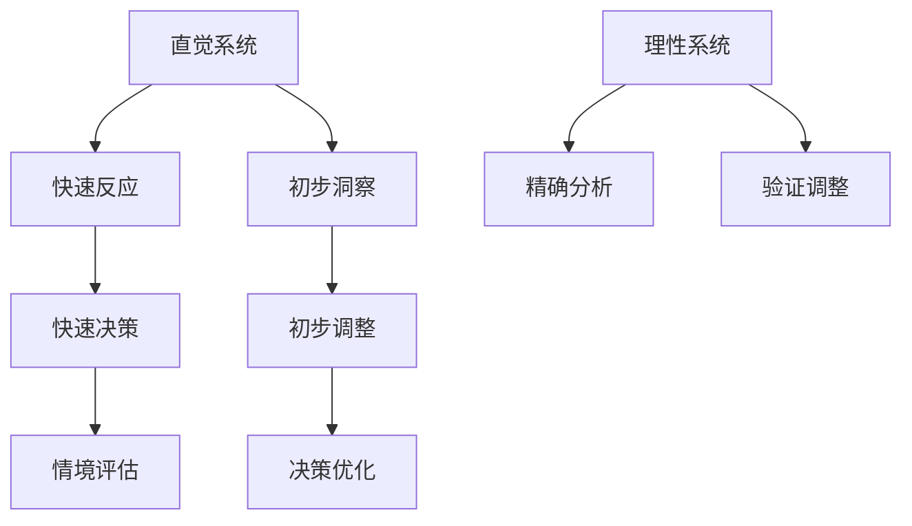

                 

# 直觉与理性：知识理解的双重路径

## 摘要

本文旨在探讨直觉与理性在知识理解过程中的双重路径。我们将分析直觉和理性在认知过程中的角色，探讨二者如何相互作用，以及它们在知识获取和技能应用中的重要性。通过结合心理学、认知科学和计算机科学的最新研究成果，本文将提出一个全面的知识理解模型，并讨论其在教育、研究和实践中的潜在应用。

## 1. 背景介绍（Background Introduction）

直觉（Intuition）和理性（Rationality）是认知过程中两个重要的组成部分。直觉是一种快速、无意识的认知过程，它允许我们在没有充分分析的情况下做出决策。理性则是一个更缓慢、有意识的思考过程，它依赖于逻辑和证据来指导我们的思考和行动。

### 1.1 直觉的作用

直觉在很多领域都发挥着重要作用。例如，在医疗诊断中，医生往往依靠直觉来识别复杂的病例；在艺术创作中，艺术家经常利用直觉来捕捉灵感。直觉的优势在于它的快速和高效，使我们能够迅速应对复杂和不确定的环境。

### 1.2 理性的作用

理性则强调逻辑、证据和批判性思维。在科学研究中，理性方法使我们能够系统地分析问题，验证假设，并得出结论。理性思维在法律、工程、经济学等领域同样至关重要，因为它依赖于精确和一致的分析。

### 1.3 直觉与理性的联系与区别

直觉和理性虽然有着不同的工作方式，但它们并非相互排斥。相反，它们在知识理解中相互补充。直觉提供了快速反应和初步洞察，而理性则确保了这些洞察的准确性和可验证性。

## 2. 核心概念与联系（Core Concepts and Connections）

### 2.1 认知心理学中的直觉与理性

在认知心理学中，直觉和理性被视为认知过程中的两个独立但又相互作用的系统。直觉系统快速、高效，但容易受到情感和经验的影响；理性系统则更精确、可靠，但需要更多时间和资源。

### 2.2 认知科学的实证研究

认知科学的许多研究揭示了直觉和理性之间的动态关系。例如，研究表明，直觉可以帮助我们在面对不确定性和复杂情境时快速做出决策，而理性则可以帮助我们验证和调整这些决策。

### 2.3 直觉与理性的 Mermaid 流程图



## 3. 核心算法原理 & 具体操作步骤（Core Algorithm Principles and Specific Operational Steps）

### 3.1 直觉的算法原理

直觉通常涉及以下步骤：
1. 简化问题：将复杂问题简化为可处理的子问题。
2. 灵感捕捉：快速生成可能的解决方案。
3. 初步验证：快速评估这些解决方案的可行性和有效性。

### 3.2 理性的算法原理

理性的步骤通常包括：
1. 系统分析：对问题进行详细分析，确定所有相关因素。
2. 假设建立：基于证据建立假设。
3. 逻辑推理：使用逻辑和证据来验证假设。
4. 决策制定：根据分析结果做出决策。

## 4. 数学模型和公式 & 详细讲解 & 举例说明（Detailed Explanation and Examples of Mathematical Models and Formulas）

### 4.1 直觉的数学模型

直觉可以被视为一种概率模型，它依赖于以下公式：

$$
P(A|B) = \frac{P(B|A) \cdot P(A)}{P(B)}
$$

其中，$P(A|B)$ 是在条件 $B$ 下事件 $A$ 发生的概率，$P(B|A)$ 是在事件 $A$ 发生时事件 $B$ 发生的概率，$P(A)$ 是事件 $A$ 发生的概率，$P(B)$ 是事件 $B$ 发生的概率。

### 4.2 理性的数学模型

理性的分析通常涉及决策理论，其中经典的期望效用理论可以表示为：

$$
E(U) = \sum_{i} u_i \cdot p_i
$$

其中，$E(U)$ 是期望效用，$u_i$ 是在情况 $i$ 下获得的效用，$p_i$ 是情况 $i$ 发生的概率。

### 4.3 直觉与理性的结合

在实际应用中，直觉和理性的结合可以采用以下公式：

$$
P(A|B) = \frac{P(B|A) \cdot P(A|R)}{P(B|R)}
$$

其中，$P(A|R)$ 是理性调整后的直觉概率，$P(B|R)$ 是理性调整后的直觉概率。

## 5. 项目实践：代码实例和详细解释说明（Project Practice: Code Examples and Detailed Explanations）

### 5.1 开发环境搭建

为了演示直觉和理性在项目中的结合，我们将使用 Python 编写一个简单的决策支持系统。首先，确保安装了 Python 和相关库（例如 NumPy 和 Matplotlib）。

### 5.2 源代码详细实现

以下是项目的主要代码：

```python
import numpy as np
import matplotlib.pyplot as plt

# 直觉部分
def intuitive_decision(probabilities):
    return np.argmax(probabilities)

# 理性部分
def rational_decision(evaluations, probabilities):
    return np.argmax(evaluations * probabilities)

# 示例数据
probabilities = np.array([0.2, 0.5, 0.3])
evaluations = np.array([1.0, 0.8, 0.6])

# 直觉决策
intuitive_choice = intuitive_decision(probabilities)
print(f"直觉决策：选择 {intuitive_choice}")

# 理性决策
rational_choice = rational_decision(evaluations, probabilities)
print(f"理性决策：选择 {rational_choice}")

# 结果可视化
plt.bar(range(len(probabilities)), probabilities, label='概率')
plt.bar(range(len(evaluations)), evaluations, bottom=probabilities, label='评估')
plt.legend()
plt.show()
```

### 5.3 代码解读与分析

这段代码定义了两个函数：`intuitive_decision` 和 `rational_decision`。前者根据直觉选择最有可能的选项，后者则结合评估和概率进行理性决策。我们使用一个简单的示例数据集来演示这两种决策方法，并使用条形图来可视化结果。

## 6. 实际应用场景（Practical Application Scenarios）

直觉和理性的结合在许多实际应用中都非常有效。例如，在医疗诊断中，医生可以使用直觉快速识别病例，然后通过理性分析来验证和调整诊断。在商业决策中，管理者可以利用直觉来捕捉市场趋势，并通过理性分析来制定详细的商业计划。

## 7. 工具和资源推荐（Tools and Resources Recommendations）

### 7.1 学习资源推荐

- **书籍：**
  - 《直觉：人类的思维引擎》（Blink: The Power of Thinking Without Thinking）by Malcolm Gladwell
  - 《思考，快与慢》（Thinking, Fast and Slow）by Daniel Kahneman
- **论文：**
  - “The Adaptiveness of Human Cognitive Systems” by George A. Miller

### 7.2 开发工具框架推荐

- **Python：** 用于编写决策支持系统的首选语言。
- **NumPy：** 用于数值计算。
- **Matplotlib：** 用于数据可视化。

### 7.3 相关论文著作推荐

- “heuristics and biases: A compendium of research” by Daniel J. Houser and Michael F. McCullough

## 8. 总结：未来发展趋势与挑战（Summary: Future Development Trends and Challenges）

直觉和理性的结合是认知科学研究的一个热点领域。未来发展趋势可能包括更精确的直觉模型、更有效的理性分析工具，以及二者的深度结合。然而，这也带来了挑战，例如如何在复杂系统中有效地整合直觉和理性，以及如何避免直觉导致的偏见和错误。

## 9. 附录：常见问题与解答（Appendix: Frequently Asked Questions and Answers）

### 9.1 什么是直觉和理性的区别？

直觉是一种快速、无意识的认知过程，而理性是一个更缓慢、有意识的思考过程。直觉依赖于经验，而理性依赖于逻辑和证据。

### 9.2 直觉和理性哪个更重要？

直觉和理性都是重要的认知工具，它们在不同的情境下发挥着不同的作用。直觉在快速反应和初步洞察方面具有优势，而理性在精确分析和验证方面更具优势。

## 10. 扩展阅读 & 参考资料（Extended Reading & Reference Materials）

- Kahneman, D. (2011). Thinking, Fast and Slow. Farrar, Straus and Giroux.
- Gladwell, M. (2005). Blink: The Power of Thinking Without Thinking. Little, Brown and Company.
- Houser, D. J., & McCullough, M. F. (Eds.). (2010). Heuristics and Biases: A Compendium of Research. Russell Sage Foundation.

