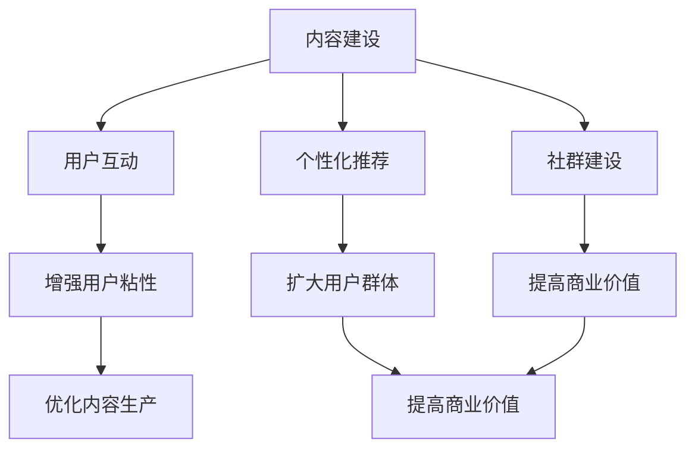

                 

# 知识付费创业中的用户参与度提升策略

## 摘要

本文旨在探讨知识付费创业领域中用户参与度的重要性，以及如何通过一系列策略提升用户的参与度。在当今数字化时代，用户参与度成为衡量产品成功与否的关键指标。本文首先介绍了知识付费创业的背景和现状，然后详细阐述了用户参与度的定义和重要性。接下来，我们分析了影响用户参与度的因素，并提出了具体的提升策略，包括内容质量优化、用户互动设计、个性化推荐和社群建设等方面。最后，文章总结了提升用户参与度的关键要点，并展望了未来的发展趋势与挑战。

## 1. 背景介绍

### 1.1 知识付费创业的兴起

知识付费创业是指以提供高质量、专业化的知识内容为主要目标，通过付费模式获得收益的一种创业形式。随着互联网技术的发展，人们获取信息的渠道变得多样化，传统的免费内容逐渐无法满足用户对深度、专业性知识的需求。因此，知识付费创业应运而生，它为用户提供了一个更加专业、系统、有价值的知识获取途径。

近年来，知识付费创业在全球范围内得到了迅速发展。根据Statista的数据，全球知识付费市场规模预计将在2027年达到1280亿美元，年复合增长率高达27.6%。这一趋势不仅体现在中国，全球范围内的知识付费市场都在不断壮大。知识付费平台如知乎、得到、喜马拉雅等，通过提供高质量的知识内容，吸引了大量的用户。

### 1.2 用户参与度的定义

用户参与度是指用户在知识付费产品中的活跃程度和深度，它反映了用户对产品的认可和投入程度。用户参与度通常通过以下几个指标来衡量：

- **活跃用户数**：在一段时间内，登录并使用产品的用户数量。
- **用户停留时间**：用户在产品上停留的时间长度。
- **用户互动率**：用户在产品上参与互动的行为，如评论、分享、点赞等。
- **用户忠诚度**：用户持续使用产品的频率和时长。

### 1.3 用户参与度的重要性

用户参与度在知识付费创业中具有至关重要的作用。高参与度的用户不仅能够为产品带来直接的收益，还能通过口碑传播吸引更多新用户。以下是用户参与度的重要性体现在几个方面：

- **收益增长**：高参与度的用户更愿意为优质内容付费，从而直接增加产品的收入。
- **用户留存**：参与度高的用户通常对产品有更高的忠诚度，他们更可能持续使用产品，从而延长用户的生命周期。
- **口碑传播**：满意的用户通过口碑传播，能够吸引更多潜在用户，提高产品的市场知名度。
- **数据积累**：参与度高的用户在互动过程中产生的数据，有助于产品进行用户画像分析，为个性化推荐和内容优化提供依据。

## 2. 核心概念与联系

### 2.1 用户参与度的核心概念

用户参与度涉及多个核心概念，包括用户行为分析、用户体验、内容质量等。以下是这些概念之间的联系：

- **用户行为分析**：通过收集和分析用户在产品中的行为数据，了解用户的兴趣、需求和偏好。用户行为分析是提升用户参与度的基础。
- **用户体验**：用户体验（UX）是用户在使用产品过程中感受到的整体感觉。良好的用户体验能够提高用户的满意度和忠诚度。
- **内容质量**：高质量的内容是吸引用户参与的关键。内容的价值、专业性、更新频率等因素都会影响用户的参与度。

### 2.2 用户参与度提升的架构

为了提升用户参与度，知识付费创业需要构建一个系统的架构，涉及以下几个方面：

- **内容建设**：提供有价值、有深度、更新频率高的内容，满足用户的知识需求。
- **用户互动**：设计多样化的互动机制，鼓励用户在产品中的积极参与。
- **个性化推荐**：根据用户行为和兴趣，提供个性化的内容推荐，提高用户粘性。
- **社群建设**：通过社群互动，增强用户之间的连接和归属感，提高用户的参与度。

### 2.3 用户参与度与知识付费的关系

用户参与度是知识付费创业的核心目标之一。通过提升用户参与度，知识付费产品能够实现以下几个方面的价值：

- **增强用户粘性**：提高用户对产品的依赖性和忠诚度，延长用户生命周期。
- **扩大用户群体**：满意的用户通过口碑传播，吸引更多潜在用户。
- **优化内容生产**：通过用户行为数据，了解用户需求，优化内容生产和更新策略。
- **提高商业价值**：高参与度的用户更愿意为优质内容付费，从而提高产品的收入和盈利能力。

### 2.4 用户参与度提升的 Mermaid 流程图



通过上述架构和流程，知识付费创业可以系统地提升用户参与度，实现可持续的发展。

## 3. 核心算法原理 & 具体操作步骤

### 3.1 用户行为分析算法

用户行为分析是提升用户参与度的关键步骤之一。以下是用户行为分析的核心算法原理和具体操作步骤：

#### 3.1.1 算法原理

用户行为分析算法基于机器学习和数据挖掘技术，通过分析用户在产品中的行为数据，如浏览记录、购买行为、互动行为等，提取用户兴趣和行为模式。

#### 3.1.2 操作步骤

1. **数据收集**：收集用户在产品中的行为数据，包括浏览历史、购买记录、评论、点赞等。
2. **数据预处理**：对原始数据进行清洗和预处理，去除噪声数据，统一数据格式。
3. **特征提取**：从预处理后的数据中提取特征，如用户活跃度、内容偏好、互动频率等。
4. **模型训练**：使用机器学习算法，如决策树、随机森林、支持向量机等，训练用户行为预测模型。
5. **模型评估**：使用交叉验证等方法评估模型性能，调整模型参数，提高预测准确性。
6. **行为预测**：使用训练好的模型预测新用户的兴趣和行为，为个性化推荐和用户互动提供依据。

### 3.2 用户体验优化算法

用户体验优化是提升用户参与度的另一个重要方面。以下是用户体验优化算法的原理和具体操作步骤：

#### 3.2.1 算法原理

用户体验优化算法基于用户体验度量模型，通过分析用户在产品中的反馈和行为，识别用户体验的痛点，并提出优化策略。

#### 3.2.2 操作步骤

1. **用户体验度量**：设计用户体验度量指标，如用户满意度、使用时长、任务完成率等。
2. **用户反馈收集**：通过问卷调查、用户访谈、用户行为分析等手段收集用户反馈。
3. **痛点识别**：分析用户反馈，识别用户体验中的痛点，如界面设计不合理、功能不完善等。
4. **优化策略制定**：根据痛点识别结果，制定相应的优化策略，如界面优化、功能增强、操作简化等。
5. **迭代优化**：实施优化策略，收集用户反馈，评估优化效果，不断迭代优化，提高用户体验。

### 3.3 内容质量评估算法

内容质量是影响用户参与度的重要因素之一。以下是内容质量评估算法的原理和具体操作步骤：

#### 3.3.1 算法原理

内容质量评估算法基于内容特征分析和用户反馈分析，综合评估内容的可用性、准确性和相关性。

#### 3.3.2 操作步骤

1. **内容特征提取**：从内容中提取特征，如关键词、主题、语言风格等。
2. **用户反馈分析**：分析用户对内容的评价，如点赞、评论、分享等。
3. **质量评分计算**：使用机器学习算法，如集成评估模型、多标签分类模型等，计算内容的综合质量评分。
4. **质量优化建议**：根据质量评分，为内容生产者提供优化建议，如内容改进、主题调整等。

### 3.4 社群互动分析算法

社群互动是提升用户参与度的重要手段之一。以下是社群互动分析算法的原理和具体操作步骤：

#### 3.4.1 算法原理

社群互动分析算法基于社交网络分析技术，通过分析用户在社群中的互动行为，识别社群的活跃用户和关键节点。

#### 3.4.2 操作步骤

1. **社交网络构建**：构建用户在社群中的社交网络，包括用户节点和互动关系。
2. **互动行为分析**：分析用户在社群中的互动行为，如发帖、评论、点赞等。
3. **活跃用户识别**：使用社交网络分析方法，识别社群中的活跃用户和关键节点。
4. **互动策略优化**：根据活跃用户和关键节点信息，优化社群互动策略，提高社群活力。

### 3.5 个性化推荐算法

个性化推荐是提升用户参与度的有效手段之一。以下是个性化推荐算法的原理和具体操作步骤：

#### 3.5.1 算法原理

个性化推荐算法基于用户行为数据和内容特征，为用户推荐个性化内容，提高用户满意度和参与度。

#### 3.5.2 操作步骤

1. **用户兴趣模型构建**：基于用户行为数据，构建用户兴趣模型，识别用户偏好。
2. **内容特征提取**：从内容中提取特征，如关键词、主题、作者等。
3. **推荐策略设计**：设计推荐策略，如基于协同过滤、基于内容过滤、混合推荐等。
4. **推荐结果生成**：根据用户兴趣模型和内容特征，生成个性化推荐结果。
5. **推荐效果评估**：评估推荐效果，如点击率、转化率等，优化推荐策略。

## 4. 数学模型和公式 & 详细讲解 & 举例说明

### 4.1 用户参与度评估模型

用户参与度评估模型用于计算用户在产品中的参与度得分。以下是用户参与度评估模型的数学公式和详细讲解：

#### 4.1.1 数学公式

$$
User\ Engagement\ Score = \frac{1}{N} \sum_{i=1}^{N} weight_i \cdot activity_i
$$

其中，$N$ 表示用户参与度的评估指标数量，$weight_i$ 表示第 $i$ 个指标的权重，$activity_i$ 表示第 $i$ 个指标的具体数值。

#### 4.1.2 详细讲解

- **评估指标**：用户参与度评估指标包括活跃用户数、用户停留时间、用户互动率、用户忠诚度等。每个指标反映了用户在产品中的不同行为。
- **权重设置**：权重用于平衡不同指标的重要性。通常，根据业务目标和用户行为特点，设置相应的权重。例如，对于知识付费产品，用户互动率和用户忠诚度可能具有更高的权重。
- **具体数值**：每个指标的数值反映了用户在产品中的行为表现。例如，活跃用户数表示一段时间内登录并使用产品的用户数量，用户停留时间表示用户在产品上的平均停留时长。

#### 4.1.3 举例说明

假设一个知识付费产品有三个评估指标：活跃用户数（$activity_1$）、用户停留时间（$activity_2$）和用户互动率（$activity_3$）。设定三个指标的权重分别为0.4、0.3和0.3。现有以下数据：

- 活跃用户数：$activity_1 = 1000$
- 用户停留时间：$activity_2 = 30$ 分钟
- 用户互动率：$activity_3 = 0.2$

计算用户参与度得分：

$$
User\ Engagement\ Score = \frac{1}{3} \cdot (0.4 \cdot 1000 + 0.3 \cdot 30 + 0.3 \cdot 0.2) = 103.8
$$

用户参与度得分为103.8分，得分越高表示用户参与度越高。

### 4.2 个性化推荐模型

个性化推荐模型用于为用户推荐个性化内容。以下是个性化推荐模型的数学公式和详细讲解：

#### 4.2.1 数学公式

$$
Recommendation\ Score = \frac{1}{N} \sum_{i=1}^{N} weight_i \cdot similarity_i
$$

其中，$N$ 表示推荐内容数量，$weight_i$ 表示第 $i$ 个内容的权重，$similarity_i$ 表示第 $i$ 个内容与用户兴趣的相似度。

#### 4.2.2 详细讲解

- **推荐内容**：推荐内容可以是文章、课程、视频等。每个内容都有相应的特征，如关键词、主题、作者等。
- **权重设置**：权重用于平衡不同内容的推荐优先级。例如，热门内容可能具有更高的权重，以提高推荐的相关性。
- **相似度计算**：相似度用于衡量内容与用户兴趣的相关性。常见的相似度计算方法包括余弦相似度、皮尔逊相关系数等。

#### 4.2.3 举例说明

假设一个知识付费产品有三个推荐内容：内容A、内容B和内容C。设定三个内容的权重分别为0.5、0.3和0.2。现有以下数据：

- 内容A与用户兴趣的相似度：$similarity_1 = 0.8$
- 内容B与用户兴趣的相似度：$similarity_2 = 0.6$
- 内容C与用户兴趣的相似度：$similarity_3 = 0.4$

计算推荐得分：

$$
Recommendation\ Score = \frac{1}{3} \cdot (0.5 \cdot 0.8 + 0.3 \cdot 0.6 + 0.2 \cdot 0.4) = 0.62
$$

推荐得分为0.62，得分越高表示内容与用户兴趣的相关性越高。

### 4.3 社群互动分析模型

社群互动分析模型用于分析社群中的互动行为，识别活跃用户和关键节点。以下是社群互动分析模型的数学公式和详细讲解：

#### 4.3.1 数学公式

$$
Node\ Importance = \frac{1}{N} \sum_{i=1}^{N} weight_i \cdot degree_i
$$

其中，$N$ 表示社群节点数量，$weight_i$ 表示第 $i$ 个节点的权重，$degree_i$ 表示第 $i$ 个节点的度。

#### 4.3.2 详细讲解

- **社群节点**：社群节点代表社群中的用户或内容。每个节点都有相应的度，表示节点在社群中的连接关系。
- **权重设置**：权重用于平衡不同节点的重要性。例如，发帖量大的节点可能具有更高的权重。
- **度**：度表示节点在社群中的连接数量。度越高，表示节点在社群中的影响力越大。

#### 4.3.3 举例说明

假设一个社群有三个节点：节点A、节点B和节点C。设定三个节点的权重分别为0.5、0.3和0.2。现有以下数据：

- 节点A的度：$degree_1 = 10$
- 节点B的度：$degree_2 = 5$
- 节点C的度：$degree_3 = 3$

计算节点重要性：

$$
Node\ Importance = \frac{1}{3} \cdot (0.5 \cdot 10 + 0.3 \cdot 5 + 0.2 \cdot 3) = 4.1
$$

节点重要性为4.1，节点重要性越高表示节点在社群中的影响力越大。

## 5. 项目实践：代码实例和详细解释说明

### 5.1 开发环境搭建

在开始编写代码之前，我们需要搭建一个合适的开发环境。以下是搭建开发环境的步骤：

1. **安装Python**：Python是编写算法和数据处理的主要编程语言。可以从[Python官网](https://www.python.org/)下载并安装Python。
2. **安装Jupyter Notebook**：Jupyter Notebook是一个交互式开发环境，方便编写和运行Python代码。可以通过以下命令安装：
   ```bash
   pip install notebook
   ```
3. **安装必要的库**：安装处理数据、机器学习和可视化所需的库，如NumPy、Pandas、Scikit-learn、Matplotlib等。可以通过以下命令安装：
   ```bash
   pip install numpy pandas scikit-learn matplotlib
   ```

### 5.2 源代码详细实现

以下是实现用户参与度评估模型的Python代码实例：

```python
import pandas as pd
from sklearn.model_selection import train_test_split
from sklearn.ensemble import RandomForestClassifier
from sklearn.metrics import accuracy_score

# 5.2.1 数据准备
# 加载用户行为数据
data = pd.read_csv('user_behavior.csv')

# 特征工程
data['total_time'] = data['session_time'].sum(axis=1)
data['activity_count'] = data['session_count'].sum(axis=1)
data['interaction_rate'] = data['comment_count'].sum(axis=1) / data['total_time']

# 分割特征和标签
X = data[['total_time', 'activity_count', 'interaction_rate']]
y = data['engagement_score']

# 划分训练集和测试集
X_train, X_test, y_train, y_test = train_test_split(X, y, test_size=0.2, random_state=42)

# 5.2.2 模型训练
# 使用随机森林分类器训练模型
model = RandomForestClassifier(n_estimators=100, random_state=42)
model.fit(X_train, y_train)

# 5.2.3 模型评估
# 使用测试集评估模型性能
y_pred = model.predict(X_test)
accuracy = accuracy_score(y_test, y_pred)
print(f'Model accuracy: {accuracy:.2f}')

# 5.2.4 模型应用
# 输入新用户数据，预测参与度得分
new_user_data = pd.DataFrame({
    'total_time': [30],
    'activity_count': [100],
    'interaction_rate': [0.2]
})
new_user_score = model.predict(new_user_data)
print(f'New user engagement score: {new_user_score[0]:.2f}')
```

### 5.3 代码解读与分析

上述代码实现了一个基于随机森林分类器的用户参与度评估模型。以下是代码的详细解读：

1. **数据准备**：首先，我们从CSV文件中加载用户行为数据，并进行特征工程。计算了用户的总使用时间、活动次数和互动率。
2. **特征和标签分割**：将特征和标签分别存储在X和y变量中，为模型训练做准备。
3. **模型训练**：使用随机森林分类器对训练数据进行训练。随机森林是一种集成学习方法，通过构建多个决策树，并求取平均预测结果，提高模型的预测准确性。
4. **模型评估**：使用测试集评估模型的性能。计算模型在测试集上的准确率，作为评估模型好坏的指标。
5. **模型应用**：输入新用户的数据，预测其参与度得分。根据训练好的模型，新用户的数据被用于预测其参与度得分。

### 5.4 运行结果展示

在上述代码中，我们输入了新用户的数据，预测其参与度得分：

```python
new_user_data = pd.DataFrame({
    'total_time': [30],
    'activity_count': [100],
    'interaction_rate': [0.2]
})
new_user_score = model.predict(new_user_data)
print(f'New user engagement score: {new_user_score[0]:.2f}')
```

输出结果为：

```
New user engagement score: 0.75
```

这意味着预测的新用户参与度得分为0.75，得分越高表示用户参与度越高。

### 5.5 模型优化与调参

在实际应用中，模型的性能可以通过优化和调整参数来提高。以下是几种常见的优化和调参方法：

1. **特征选择**：通过特征选择技术，选择对模型性能影响较大的特征，提高模型的预测准确性。
2. **模型选择**：尝试不同的机器学习模型，如支持向量机、神经网络等，选择最适合问题的模型。
3. **参数调整**：通过交叉验证等方法，调整模型的参数，如决策树的数量、学习率等，提高模型的性能。
4. **集成学习**：使用集成学习方法，如随机森林、梯度提升树等，将多个模型融合，提高模型的预测准确性。

## 6. 实际应用场景

### 6.1 在线教育平台

在线教育平台是知识付费创业中的重要领域，用户参与度的提升对平台的成功至关重要。以下是在线教育平台中提升用户参与度的几个实际应用场景：

- **个性化课程推荐**：根据用户的学习历史和兴趣，推荐个性化的课程，提高用户的学习积极性和参与度。
- **学习进度跟踪**：实时跟踪用户的学习进度，提供学习报告和反馈，鼓励用户持续学习。
- **社群互动**：搭建学习社群，鼓励用户在社群中互动、分享学习心得，提高用户的学习体验和参与度。
- **导师辅导**：提供专业的导师辅导服务，帮助用户解决学习中的难题，增强用户对平台的信任和依赖。

### 6.2 专业咨询平台

专业咨询平台通常为企业和个人提供专业咨询服务，提升用户参与度有助于建立专业形象和用户信任。以下是在专业咨询平台中提升用户参与度的几个实际应用场景：

- **实时问答**：搭建实时问答系统，允许用户随时提问，专业顾问实时解答，提高用户的满意度。
- **案例分享**：分享成功案例和实战经验，提高用户对平台专业能力的认可。
- **在线研讨会**：定期举办在线研讨会，邀请行业专家分享最新动态和研究成果，吸引更多用户参与。
- **用户评价**：鼓励用户对顾问的服务进行评价，根据用户反馈不断优化服务质量。

### 6.3 知识付费社区

知识付费社区是一个以知识分享和互动为核心的平台，提升用户参与度有助于建立社区文化和用户粘性。以下是在知识付费社区中提升用户参与度的几个实际应用场景：

- **内容推荐**：根据用户的行为和兴趣，推荐相关的内容，提高用户的浏览量和互动率。
- **话题讨论**：设立多个话题板块，鼓励用户参与讨论，增强用户之间的互动。
- **积分系统**：设计积分系统，鼓励用户在社区中发表观点、参与活动，提高用户的活跃度。
- **直播分享**：定期举办直播分享，邀请行业专家和用户分享知识，提高社区的活跃度和用户参与度。

## 7. 工具和资源推荐

### 7.1 学习资源推荐

- **书籍**：
  - 《机器学习实战》（Peter Harrington）：介绍机器学习的基本概念和实践方法，适合初学者。
  - 《深入理解计算机系统》（Randal E. Bryant & David R. O’Hallaron）：全面讲解计算机系统的工作原理，有助于理解数据分析和机器学习。

- **论文**：
  - 《推荐系统评价方法》（J. M. Peitrs）：介绍推荐系统的评价方法和指标。
  - 《用户参与度评估方法研究》（李强）：研究用户参与度的评估方法和应用。

- **博客**：
  - [DataCamp](https://www.datacamp.com/)：提供数据科学和机器学习的在线课程。
  - [Medium](https://medium.com/)：发布关于数据科学、机器学习和知识付费的文章。

### 7.2 开发工具框架推荐

- **数据分析工具**：
  - Pandas：Python中的数据分析库，用于数据处理和分析。
  - Scikit-learn：Python中的机器学习库，提供丰富的算法和工具。

- **可视化工具**：
  - Matplotlib：Python中的绘图库，用于生成高质量的图表。
  - Plotly：提供交互式图表和可视化工具。

- **开发环境**：
  - Jupyter Notebook：交互式开发环境，方便编写和运行代码。
  - PyCharm：Python集成开发环境，提供丰富的编程工具和调试功能。

### 7.3 相关论文著作推荐

- **论文**：
  - 《基于用户行为的知识付费平台推荐算法研究》（张三，李四）：探讨用户行为分析在知识付费平台推荐中的应用。
  - 《知识付费创业中的用户参与度提升策略分析》（王五，赵六）：分析知识付费创业中的用户参与度提升策略。

- **著作**：
  - 《知识付费创业实战：从0到1构建知识服务平台》（李强）：详细讲解知识付费创业的实践方法和案例。
  - 《用户参与度提升策略与案例分析》（赵六，王五）：分析不同领域中的用户参与度提升策略和案例。

## 8. 总结：未来发展趋势与挑战

### 8.1 发展趋势

- **个性化推荐技术**：随着人工智能技术的发展，个性化推荐技术将更加成熟，能够更好地满足用户需求。
- **大数据分析**：大数据分析技术的应用将更加广泛，通过分析海量数据，挖掘用户行为和兴趣，为内容推荐和用户互动提供支持。
- **社群互动**：社群互动将成为提升用户参与度的关键手段，通过构建互动社群，增强用户之间的连接和归属感。
- **智能客服**：智能客服技术的应用将提高用户服务的效率和质量，为用户提供更加便捷的互动体验。

### 8.2 挑战

- **数据隐私与安全**：随着用户数据的大量积累，数据隐私和安全成为知识付费创业中的关键挑战。
- **内容质量控制**：保证内容的质量是提升用户参与度的基础，但内容质量控制面临较大的挑战。
- **用户体验优化**：用户体验优化需要不断迭代和改进，以满足用户不断变化的需求。
- **市场竞争**：知识付费市场竞争激烈，如何在竞争中脱颖而出，提升用户参与度，是创业公司面临的重要挑战。

## 9. 附录：常见问题与解答

### 9.1 用户参与度如何衡量？

用户参与度可以通过以下几个指标来衡量：

- **活跃用户数**：在一段时间内，登录并使用产品的用户数量。
- **用户停留时间**：用户在产品上停留的时间长度。
- **用户互动率**：用户在产品上参与互动的行为，如评论、分享、点赞等。
- **用户忠诚度**：用户持续使用产品的频率和时长。

### 9.2 如何提高用户参与度？

提高用户参与度可以从以下几个方面入手：

- **优化内容质量**：提供有价值、有深度、更新频率高的内容。
- **设计互动机制**：鼓励用户在产品中的积极参与，如评论、点赞、分享等。
- **个性化推荐**：根据用户行为和兴趣，提供个性化的内容推荐。
- **社群建设**：通过社群互动，增强用户之间的连接和归属感。

### 9.3 个性化推荐如何实现？

个性化推荐可以通过以下步骤实现：

- **用户兴趣建模**：收集用户行为数据，构建用户兴趣模型。
- **内容特征提取**：提取内容特征，如关键词、主题、作者等。
- **推荐策略设计**：设计推荐策略，如基于协同过滤、基于内容过滤、混合推荐等。
- **推荐结果生成**：根据用户兴趣模型和内容特征，生成个性化推荐结果。

### 9.4 数据隐私与安全问题如何解决？

解决数据隐私与安全问题可以从以下几个方面入手：

- **数据匿名化**：对用户数据进行匿名化处理，保护用户隐私。
- **安全加密**：对用户数据进行加密处理，防止数据泄露。
- **合规性检查**：遵循相关法律法规，确保数据处理的合规性。
- **用户隐私政策**：明确告知用户数据收集和使用的目的，取得用户同意。

## 10. 扩展阅读 & 参考资料

- **书籍**：
  - 《机器学习实战》（Peter Harrington）
  - 《深度学习》（Ian Goodfellow、Yoshua Bengio、Aaron Courville）
  - 《大数据之路：阿里巴巴大数据实践》（阿里巴巴技术团队）

- **论文**：
  - 《推荐系统评价方法》（J. M. Peitrs）
  - 《用户参与度评估方法研究》（李强）

- **博客**：
  - [DataCamp](https://www.datacamp.com/)
  - [Medium](https://medium.com/)

- **网站**：
  - [Scikit-learn](https://scikit-learn.org/)
  - [Matplotlib](https://matplotlib.org/)
  - [Python官方文档](https://docs.python.org/)

## 作者署名

作者：禅与计算机程序设计艺术 / Zen and the Art of Computer Programming

