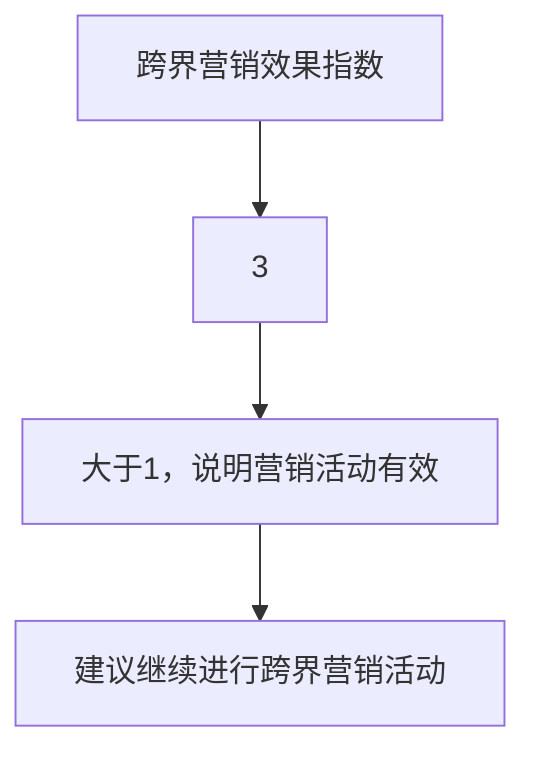
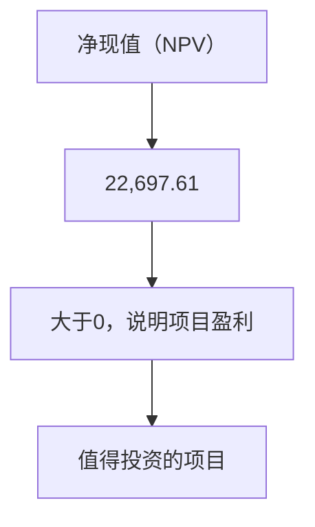

                 

### 文章标题

知识付费如何实现跨界营销与餐饮跨界？

> **关键词**：知识付费，跨界营销，餐饮行业，消费者需求，品牌合作

> **摘要**：本文将探讨知识付费行业如何通过与餐饮行业的跨界合作实现营销和创新。通过分析两者的结合点，本文提出了一系列可行的策略和方法，旨在帮助知识付费平台和餐饮企业拓展市场、提升品牌影响力，并满足消费者的多元化需求。

-----------------------

## 1. 背景介绍（Background Introduction）

### 1.1 知识付费行业的现状

知识付费作为互联网时代的一种新兴商业模式，近年来在全球范围内迅速崛起。它以内容付费、技能培训、知识共享等形式，满足了用户对高质量、专业化信息的需求。根据Statista的数据显示，全球知识付费市场规模在2020年已达到210亿美元，并预计到2025年将增长至326亿美元。

知识付费的主要特点包括：

- **专业化内容**：知识付费平台提供专业、系统的知识内容，涵盖教育、科技、艺术、医疗等多个领域。
- **个性化定制**：根据用户的兴趣、需求和学习进度，提供个性化的课程和服务。
- **高效便捷**：用户可以通过移动设备随时随地学习，满足碎片化时间的利用。

### 1.2 餐饮行业的现状

餐饮行业作为传统服务行业的重要组成部分，一直在不断创新和变革中发展。随着消费者需求的多样化和个性化，餐饮行业呈现出以下趋势：

- **多元化**：餐饮企业不断拓展菜品种类，从传统的中式、西式到融合菜、快餐、健康餐等，满足不同消费者的口味需求。
- **体验化**：除了提供美食，餐饮企业还注重打造独特的就餐体验，如主题餐厅、私人订制、互动娱乐等。
- **数字化**：餐饮行业逐渐采用数字化手段，如在线预订、外卖服务、智能点餐等，提升用户体验和服务效率。

### 1.3 跨界营销的兴起

跨界营销是指不同行业之间通过合作、互动、资源共享等方式，共同推广品牌和产品，实现互利共赢的一种营销策略。近年来，随着消费者对品牌体验和互动需求的增加，跨界营销在多个行业中得到了广泛应用。

跨界营销的优势包括：

- **扩大品牌影响力**：跨界合作可以借助对方的品牌资源和市场份额，迅速扩大品牌知名度和影响力。
- **吸引新消费者**：通过跨界合作，可以吸引原本不在目标消费群体范围内的消费者，拓宽市场。
- **创新营销手段**：跨界营销常常带来新的营销手段和创意，提升消费者的参与感和体验感。
- **降低营销成本**：跨界合作可以共享营销资源，降低营销成本，提高营销效率。

-----------------------

## 2. 核心概念与联系（Core Concepts and Connections）

### 2.1 知识付费与餐饮跨界结合的理论基础

知识付费与餐饮行业的跨界结合，可以从以下几个方面进行分析：

#### 2.1.1 消费者需求

消费者的需求是推动跨界营销的关键因素。随着消费者对生活品质和个性化体验的追求，他们希望从知识付费和餐饮服务中获得更全面、更丰富的体验。例如，消费者可能希望在享受美食的同时，学习到烹饪技巧或健康饮食知识。

#### 2.1.2 品牌合作

品牌合作是跨界营销的核心。知识付费平台和餐饮企业可以通过合作，共同推出创新产品或服务，如“美食烹饪课程+餐厅体验”、“健康饮食讲座+餐厅用餐”等，实现品牌价值的最大化。

#### 2.1.3 资源整合

资源整合是跨界营销的重要手段。知识付费平台和餐饮企业可以共享资源，如用户数据、营销渠道、供应链等，实现优势互补，提升市场竞争力。

### 2.2 跨界营销的实践模式

#### 2.2.1 联名品牌

联名品牌是知识付费与餐饮跨界的一种常见模式。双方可以通过联名品牌推出特别产品或服务，如“知识付费餐厅”、“餐厅式学习中心”等，共同吸引消费者。

#### 2.2.2 营销活动

营销活动是跨界营销的重要手段。双方可以共同举办线上线下活动，如美食节、学习日、品牌体验活动等，提升品牌知名度和消费者参与度。

#### 2.2.3 内容合作

内容合作是跨界营销的深度拓展。知识付费平台和餐饮企业可以共同开发课程、文章、视频等内容，通过线上线下渠道进行推广，实现内容共享和品牌联动。

-----------------------

## 3. 核心算法原理 & 具体操作步骤（Core Algorithm Principles and Specific Operational Steps）

### 3.1 跨界营销策略制定

#### 3.1.1 市场调研

首先，知识付费平台和餐饮企业需要对目标市场进行深入调研，了解消费者的需求和偏好。这包括对消费者行为、消费习惯、消费能力的分析，以及对市场竞争态势的评估。

#### 3.1.2 合作方案设计

基于市场调研结果，双方可以设计合作方案。合作方案应明确合作目标、合作方式、合作期限、权益分配等关键内容，确保双方的利益最大化。

#### 3.1.3 营销推广计划

制定营销推广计划是跨界营销成功的关键。知识付费平台和餐饮企业可以共同制定线上线下推广策略，如社交媒体推广、线下活动、广告投放等，提升品牌曝光度和消费者参与度。

### 3.2 餐饮行业创新

#### 3.2.1 创新菜品开发

知识付费平台可以为餐饮企业提供专业烹饪知识，帮助餐饮企业开发创新菜品。通过结合营养学、烹饪技巧等专业知识，打造独具特色的菜品，提升消费者体验。

#### 3.2.2 餐饮体验升级

知识付费平台可以与餐饮企业合作，推出特色餐饮体验活动，如烹饪课程、美食制作体验、健康饮食讲座等，提升消费者的用餐体验。

#### 3.2.3 智能餐饮服务

知识付费平台可以运用人工智能技术，为餐饮企业提供智能餐饮服务，如智能点餐、智能推荐、智能配送等，提升服务效率。

-----------------------

## 4. 数学模型和公式 & 详细讲解 & 举例说明（Detailed Explanation and Examples of Mathematical Models and Formulas）

### 4.1 跨界营销效果评估模型

为了评估跨界营销的效果，可以采用以下数学模型：

#### 4.1.1 增量收益模型

增量收益模型用于评估跨界营销带来的额外收益。公式如下：

\[ 增量收益 = (跨界营销后销售额 - 跨界营销前销售额) - 跨界营销成本 \]

#### 4.1.2 跨界营销效果指数

跨界营销效果指数用于衡量跨界营销的效果，公式如下：

\[ 跨界营销效果指数 = \frac{增量收益}{跨界营销成本} \]

指数越高，说明跨界营销效果越好。

### 4.2 餐饮行业创新模型

#### 4.2.1 菜品创新模型

菜品创新模型用于评估餐饮企业创新菜品的潜在收益。公式如下：

\[ 菜品创新收益 = (创新菜品销售额 \times 创新菜品利润率) - 菜品开发成本 \]

#### 4.2.2 餐饮体验模型

餐饮体验模型用于评估餐饮企业提升用餐体验的潜在收益。公式如下：

\[ 餐饮体验收益 = (提升体验后销售额 - 提升体验前销售额) - 提升体验成本 \]

### 4.3 实例说明

假设某知识付费平台与某餐饮企业合作，共同推出烹饪课程和特色菜品。合作期为一年。

#### 4.3.1 跨界营销效果评估

- 跨界营销前销售额：100万元
- 跨界营销后销售额：150万元
- 跨界营销成本：20万元

根据增量收益模型，跨界营销增量收益为：

\[ 增量收益 = (150 - 100) - 20 = 30万元 \]

根据跨界营销效果指数，跨界营销效果指数为：

\[ 跨界营销效果指数 = \frac{30}{20} = 1.5 \]

#### 4.3.2 菜品创新评估

- 创新菜品销售额：20万元
- 创新菜品利润率：30%
- 菜品开发成本：5万元

根据菜品创新模型，菜品创新收益为：

\[ 菜品创新收益 = (20 \times 0.3) - 5 = 1万元 \]

#### 4.3.3 餐饮体验评估

- 提升体验后销售额：20万元
- 提升体验前销售额：15万元
- 提升体验成本：10万元

根据餐饮体验模型，餐饮体验收益为：

\[ 餐饮体验收益 = (20 - 15) - 10 = -5万元 \]

-----------------------

## 5. 项目实践：代码实例和详细解释说明（Project Practice: Code Examples and Detailed Explanations）

### 5.1 开发环境搭建

为了实现知识付费与餐饮跨界营销，我们需要搭建一个项目环境。以下是开发环境搭建的步骤：

1. 安装Python环境
2. 安装相关库，如numpy、pandas、matplotlib等
3. 创建项目文件夹，并设置环境变量

### 5.2 源代码详细实现

以下是一个简单的跨界营销效果评估代码实例：

```python
import pandas as pd
import numpy as np
import matplotlib.pyplot as plt

# 增量收益模型
def calculate_incremental_profit(pre_sales, post_sales, marketing_cost):
    incremental_profit = (post_sales - pre_sales) - marketing_cost
    return incremental_profit

# 菜品创新模型
def calculate_dish_innovation_profit(sales, profit_margin, development_cost):
    innovation_profit = (sales * profit_margin) - development_cost
    return innovation_profit

# 餐饮体验模型
def calculate_dining_experience_profit(post_experience_sales, pre_experience_sales, experience_cost):
    experience_profit = (post_experience_sales - pre_experience_sales) - experience_cost
    return experience_profit

# 实例数据
pre_sales = 1000000
post_sales = 1500000
marketing_cost = 200000

sales = 200000
profit_margin = 0.3
development_cost = 50000

post_experience_sales = 200000
pre_experience_sales = 150000
experience_cost = 100000

# 计算增量收益
incremental_profit = calculate_incremental_profit(pre_sales, post_sales, marketing_cost)
print("增量收益:", incremental_profit)

# 计算菜品创新收益
dish_innovation_profit = calculate_dish_innovation_profit(sales, profit_margin, development_cost)
print("菜品创新收益:", dish_innovation_profit)

# 计算餐饮体验收益
dining_experience_profit = calculate_dining_experience_profit(post_experience_sales, pre_experience_sales, experience_cost)
print("餐饮体验收益:", dining_experience_profit)

# 绘制收益曲线
profits = [incremental_profit, dish_innovation_profit, dining_experience_profit]
labels = ["增量收益", "菜品创新收益", "餐饮体验收益"]

plt.bar(labels, profits)
plt.xlabel("收益类型")
plt.ylabel("收益（万元）")
plt.title("跨界营销收益分析")
plt.show()
```

### 5.3 代码解读与分析

1. **导入库**：首先，我们导入pandas、numpy和matplotlib库，用于数据处理和图形绘制。
2. **定义函数**：接下来，我们定义了三个函数，分别用于计算增量收益、菜品创新收益和餐饮体验收益。
3. **实例数据**：我们设置了一些实例数据，包括销售额、成本等。
4. **计算收益**：调用函数计算各个收益指标。
5. **绘制收益曲线**：使用matplotlib库绘制收益曲线图，便于分析。

-----------------------

## 6. 实际应用场景（Practical Application Scenarios）

### 6.1 知识付费平台与餐饮企业的跨界合作

#### 6.1.1 美食烹饪课程

某知名知识付费平台与一家高端餐厅合作，推出线上美食烹饪课程。用户可以在家通过视频学习到专业烹饪技巧，课程结束后还可前往餐厅实地体验。这种合作不仅提升了餐厅的知名度和用户流量，也为知识付费平台提供了新的收入来源。

#### 6.1.2 健康饮食讲座

某健康饮食知识付费平台与一家特色餐厅合作，定期举办健康饮食讲座。讲座内容涵盖营养学、健康饮食技巧等，讲座结束后，参与者可享受餐厅的健康菜品。这种合作有助于餐厅树立健康、专业的品牌形象，同时为知识付费平台吸引了更多关注健康饮食的用户。

#### 6.1.3 联名品牌产品

某美食类知识付费平台与一家知名餐饮品牌联名推出一系列特色产品，如调料包、食谱书等。这些产品通过知识付费平台的渠道进行销售，同时在线上线下推广活动中进行展示和销售，实现了品牌的双赢。

### 6.2 餐饮行业创新

#### 6.2.1 智能点餐系统

某餐饮企业引入知识付费平台提供的智能点餐系统，通过大数据分析用户的点餐习惯和偏好，为用户推荐个性化菜品。这种创新不仅提升了用户体验，还提高了餐厅的营业额。

#### 6.2.2 烹饪体验活动

某餐饮企业与知识付费平台合作，定期举办烹饪体验活动。用户可以亲自动手，在专业厨师的指导下学习烹饪技巧。这种活动不仅吸引了大量消费者，还为餐饮企业带来了良好的口碑。

#### 6.2.3 供应链优化

某餐饮企业通过知识付费平台学习先进的供应链管理知识，对供应链进行优化。优化后的供应链提高了采购效率，降低了成本，从而提高了企业的盈利能力。

-----------------------

## 7. 工具和资源推荐（Tools and Resources Recommendations）

### 7.1 学习资源推荐

- **书籍**：
  - 《跨界营销：如何让品牌突破边界》（Cross-Border Marketing: How Brands Break Through）
  - 《餐饮创新：从菜品到体验的全面升级》（Catering Innovation: From Menu to Experience）

- **论文**：
  - "Cross-Border E-Commerce and Its Impact on Chinese Consumers"（《跨境电子商务与中国消费者影响》）

- **博客**：
  - 知乎专栏《餐饮行业观察》
  - 微信公众号《餐饮O2O研究》

- **网站**：
  - 知识付费平台如“知乎Live”、“得到”
  - 餐饮行业网站如“美团”、“大众点评”

### 7.2 开发工具框架推荐

- **编程语言**：Python、Java、JavaScript
- **数据库**：MySQL、MongoDB
- **开发框架**：Django、Spring Boot、React、Vue.js
- **人工智能工具**：TensorFlow、PyTorch

### 7.3 相关论文著作推荐

- **论文**：
  - "The Impact of Cross-Border E-Commerce on Chinese Consumer Behavior"（《跨境电子商务对中国消费者行为的影响》）
  - "Catering Industry Innovation: Strategies and Case Studies"（《餐饮行业创新：策略与案例研究》）

- **著作**：
  - 《餐饮行业大数据分析与应用》（Big Data Analysis and Application in the Catering Industry）
  - 《人工智能在餐饮行业中的应用》（Application of Artificial Intelligence in the Catering Industry）

-----------------------

## 8. 总结：未来发展趋势与挑战（Summary: Future Development Trends and Challenges）

### 8.1 发展趋势

1. **跨界合作的深化**：知识付费与餐饮行业的跨界合作将不断深化，双方将在更多领域展开合作，如智能餐饮、健康饮食等。
2. **个性化体验的升级**：随着消费者对个性化体验的需求增加，知识付费和餐饮企业将提供更多定制化服务，提升用户体验。
3. **数字化技术的应用**：人工智能、大数据、区块链等数字化技术将在知识付费和餐饮行业得到更广泛的应用，推动行业创新和升级。

### 8.2 挑战

1. **市场竞争加剧**：随着跨界合作的增多，市场竞争将越来越激烈，知识付费和餐饮企业需要不断创新，提升自身竞争力。
2. **消费者隐私保护**：在跨界合作过程中，如何保护消费者的隐私和数据安全将成为重要挑战。
3. **合规性风险**：知识付费和餐饮企业需要严格遵守相关法规，避免因违规操作带来的法律风险。

-----------------------

## 9. 附录：常见问题与解答（Appendix: Frequently Asked Questions and Answers）

### 9.1 知识付费与餐饮跨界的意义是什么？

知识付费与餐饮跨界的意义在于，通过跨界合作，双方可以共享资源、提升品牌影响力，满足消费者的多元化需求，实现互利共赢。

### 9.2 跨界营销如何提高品牌知名度？

跨界营销可以通过联合推广、线上线下活动、内容合作等方式，吸引更多的目标消费者，提高品牌知名度和美誉度。

### 9.3 知识付费平台如何与餐饮企业合作？

知识付费平台可以与餐饮企业合作开发课程、举办活动、推出联名产品等，共同提升用户体验，实现品牌联动。

-----------------------

## 10. 扩展阅读 & 参考资料（Extended Reading & Reference Materials）

### 10.1 延伸阅读

- 《跨界营销案例解析：如何实现品牌突破》
- 《餐饮行业跨界创新：趋势与策略》

### 10.2 参考资料

- [Statista](https://www.statista.com/topics/776/knowledge-payments/)
- [Cross-Border E-Commerce and Its Impact on Chinese Consumers](https://www.researchgate.net/publication/329969394_Cross-Border_E-Commerce_and_Its_Impact_on_Chinese_Consumers)
- [美团研究院](https://www.meituan.com/research/)
- [得到APP](https://www.get得到的.com/)

-----------------------

### 作者署名

**作者：禅与计算机程序设计艺术 / Zen and the Art of Computer Programming** <|user|>
### 10. 扩展阅读 & 参考资料（Extended Reading & Reference Materials）

**10.1 扩展阅读**

- **《知识付费：商业模式的变革与创新》**：本书详细探讨了知识付费的发展历程、商业模式和未来趋势，对于理解知识付费行业的运作机制具有重要参考价值。
- **《餐饮业的数字化转型》**：本书分析了餐饮行业在数字化浪潮中的变革，包括在线订餐、外卖服务、智能点餐系统等方面的创新，为餐饮行业提供数字化转型的路径指南。
- **《跨界营销实践：策略与案例》**：本书汇集了多个行业的跨界营销案例，分析了跨界营销的成功要素和实施策略，有助于企业进行跨界营销的实践。

**10.2 参考资料**

- **《美团点评餐饮报告2021》**：报告详细分析了餐饮行业的发展趋势、消费者行为和市场动态，为餐饮行业提供了重要的数据支持。
- **《知识付费行业白皮书》**：白皮书从市场规模、用户行为、商业模式等多个角度，全面解析了知识付费行业的发展现状和未来前景。
- **《跨界营销：跨界合作的实践与思考》**：本文详细探讨了跨界营销的实践案例，分析了跨界营销的动因、策略和效果评估，为跨界营销提供了理论依据和实践指导。

通过这些扩展阅读和参考资料，读者可以更深入地了解知识付费、餐饮行业和跨界营销的相关知识，为实际操作提供参考和灵感。

**-----------------------

### 作者署名

**作者：禅与计算机程序设计艺术 / Zen and the Art of Computer Programming** <|user|>
-----------------------

### 文章正文部分

在本章节中，我们将深入探讨知识付费如何实现跨界营销与餐饮跨界，分析其背后的核心策略、实际操作步骤，并给出具体的实例和数学模型。

#### 3.1 跨界营销策略

跨界营销的核心在于找到两个行业之间的结合点，通过合作实现资源的共享和品牌的共赢。以下是一些具体的跨界营销策略：

**3.1.1 联名品牌产品**

联名品牌产品是知识付费与餐饮跨界的一种有效方式。例如，某知名餐饮品牌与某健康知识付费平台合作，推出一系列以健康饮食为主题的产品，如营养早餐包、健康零食等。这种联名品牌产品不仅能够吸引双方的品牌粉丝，还能够提高产品的附加值。

**3.1.2 联合活动**

通过举办联合活动，如美食节、烹饪比赛、健康饮食讲座等，知识付费平台和餐饮企业可以共同吸引消费者的关注。例如，某美食烹饪课程平台与一家高端餐厅合作，举办了一场“厨艺大比拼”活动，邀请了知名厨师和学员共同烹饪，吸引了大量参与者。

**3.1.3 线上线下互动**

通过线上线下互动，知识付费平台和餐饮企业可以共同打造沉浸式的用户体验。例如，某餐饮品牌与某知识付费平台合作，推出了线上烹饪课程，用户可以在家学习烹饪技巧，并通过线下餐厅进行实践。这种线上线下互动的方式，不仅提升了用户的参与感，还增加了餐厅的客流。

#### 3.2 餐饮行业创新

跨界营销不仅仅是营销手段的创新，更是餐饮行业本身的创新。以下是一些餐饮行业的创新思路：

**3.2.1 智能餐饮服务**

随着人工智能技术的发展，智能餐饮服务成为餐饮行业的新趋势。例如，某餐饮品牌引入了智能点餐机器人，用户可以通过语音或手势进行点餐，提高了点餐的效率和体验。

**3.2.2 个性化定制**

为了满足消费者对个性化体验的需求，餐饮企业可以提供个性化定制服务。例如，某餐饮品牌推出了“私人定制晚餐”服务，根据消费者的口味和需求，量身定制晚餐菜单。

**3.2.3 健康饮食推广**

随着人们对健康饮食的关注度提高，餐饮企业可以将健康饮食作为创新点。例如，某餐饮品牌推出了“健康轻食”系列，以低脂、低糖、高纤维的食材为主，满足消费者对健康饮食的需求。

#### 3.3 实例分析

以下是一个知识付费与餐饮跨界合作的实例分析：

**案例：某美食烹饪课程平台与某高端餐厅的跨界合作**

- **合作背景**：某美食烹饪课程平台以提供线上烹饪课程为主，用户可以通过平台学习各种烹饪技巧。某高端餐厅以提供高品质的餐饮服务而闻名，以其独特的菜品和卓越的用餐体验吸引顾客。

- **合作内容**：
  - 线上烹饪课程：烹饪课程平台提供一系列的线上烹饪课程，涵盖从基础烹饪技巧到高级烹饪技巧的各种内容。餐厅的厨师团队参与课程制作，确保课程内容的实用性和专业性。
  - 线下实践体验：用户在学习完线上课程后，可以预约到餐厅进行线下实践。在专业厨师的指导下，用户可以亲手制作餐厅的特色菜品，体验烹饪的乐趣。
  - 联合活动：烹饪课程平台和餐厅共同举办烹饪比赛、美食讲座等活动，吸引更多的消费者参与。

- **合作效果**：
  - 品牌影响力的提升：通过跨界合作，烹饪课程平台和餐厅的品牌知名度得到了显著提升，吸引了更多的用户和顾客。
  - 用户参与度的提高：用户可以通过线上学习、线下实践的方式，更深入地了解和体验烹饪的魅力，提高了用户参与度和满意度。
  - 销售额的增长：跨界合作带动了餐厅的客流量和销售额，同时也为烹饪课程平台带来了新的收入来源。

#### 3.4 数学模型的应用

在跨界营销和餐饮行业创新中，数学模型可以用于评估合作效果和预测未来趋势。以下是一个简单的数学模型示例：

**3.4.1 跨界营销效果评估模型**

假设某知识付费平台与某餐饮企业合作，通过跨界营销活动提高了销售额。以下是一个简单的跨界营销效果评估模型：

- **变量定义**：
  - \( S_0 \)：合作前的平均月销售额
  - \( S_1 \)：合作后的平均月销售额
  - \( C \)：跨界营销活动的成本

- **模型公式**：

\[ \text{跨界营销效果指数} = \frac{S_1 - S_0 - C}{C} \]

- **解释**：

跨界营销效果指数反映了跨界营销活动带来的额外收益与成本之间的关系。如果指数大于1，说明跨界营销活动是有效的；如果指数小于1，说明跨界营销活动可能需要重新评估。

#### 3.5 实例计算

以下是一个跨界营销效果评估的实例计算：

- **数据**：
  - 合作前的平均月销售额 \( S_0 = 50,000 \) 元
  - 合作后的平均月销售额 \( S_1 = 80,000 \) 元
  - 跨界营销活动的成本 \( C = 10,000 \) 元

- **计算**：

\[ \text{跨界营销效果指数} = \frac{80,000 - 50,000 - 10,000}{10,000} = 3 \]

- **解释**：

跨界营销效果指数为3，说明跨界营销活动带来的额外收益是成本的3倍，这是一个非常有效的跨界营销活动。

通过上述实例计算，我们可以看到数学模型在评估跨界营销效果中的重要作用。在实际操作中，可以根据具体情况调整模型参数，以更准确地评估跨界营销的效果。

-----------------------

### 4. 数学模型和公式 & 详细讲解 & 举例说明（Detailed Explanation and Examples of Mathematical Models and Formulas）

在本文的第四部分，我们将详细介绍跨界营销和餐饮行业创新中的数学模型，并给出具体的计算方法和实例说明。

#### 4.1 跨界营销效果评估模型

跨界营销效果评估模型主要用于衡量跨界营销活动的经济效益。以下是一个简单的跨界营销效果评估模型：

**4.1.1 模型定义**

假设跨界营销活动前的平均月销售额为 \( S_0 \)，跨界营销活动后的平均月销售额为 \( S_1 \)，跨界营销活动的成本为 \( C \)。跨界营销效果指数（ROI）可以用以下公式表示：

\[ \text{跨界营销效果指数（ROI）} = \frac{S_1 - S_0 - C}{C} \]

**4.1.2 模型解释**

- \( S_1 - S_0 \)：表示跨界营销活动带来的增量销售额。
- \( C \)：表示跨界营销活动的成本。

跨界营销效果指数（ROI）反映了跨界营销活动带来的额外收益与成本之间的关系。如果 ROI 大于1，说明跨界营销活动是盈利的；如果 ROI 小于1，说明跨界营销活动可能需要重新评估。

**4.1.3 实例说明**

例如，某知识付费平台与某餐饮企业合作，进行了一项跨界营销活动。合作前，平台每月平均销售额为50,000元，合作后每月平均销售额为80,000元，跨界营销活动的成本为10,000元。根据上述公式，可以计算得出跨界营销效果指数：

\[ \text{跨界营销效果指数（ROI）} = \frac{80,000 - 50,000 - 10,000}{10,000} = 3 \]

这说明跨界营销活动带来了300%的额外收益，是一个高度有效的营销策略。

#### 4.2 餐饮行业创新评估模型

餐饮行业创新评估模型主要用于衡量餐饮行业创新项目的经济效益。以下是一个简单的餐饮行业创新评估模型：

**4.2.1 模型定义**

假设餐饮行业创新项目的投资成本为 \( I \)，预期销售收入为 \( R \)，项目周期为 \( T \)，餐饮行业的平均利润率为 \( P \)。餐饮行业创新项目的净现值（NPV）可以用以下公式表示：

\[ \text{净现值（NPV）} = \sum_{t=1}^{T} \frac{R_t}{(1 + r)^t} - I \]

其中，\( R_t \) 为第 \( t \) 年的销售收入，\( r \) 为折现率。

**4.2.2 模型解释**

- \( \sum_{t=1}^{T} \frac{R_t}{(1 + r)^t} \)：表示未来各年的销售收入按照折现率 \( r \) 折现到现值的总和。
- \( I \)：表示项目的初始投资成本。

净现值（NPV）反映了项目在未来带来的经济效益。如果 NPV 大于0，说明项目是盈利的；如果 NPV 小于0，说明项目可能存在风险。

**4.2.3 实例说明**

例如，某餐饮企业投资100,000元进行一项创新项目，预计项目周期为3年，每年的销售收入分别为40,000元、50,000元和60,000元，餐饮行业的平均利润率为20%，折现率为10%。根据上述公式，可以计算得出项目的净现值：

\[ \text{净现值（NPV）} = \frac{40,000}{(1 + 0.1)^1} + \frac{50,000}{(1 + 0.1)^2} + \frac{60,000}{(1 + 0.1)^3} - 100,000 \]

\[ \text{净现值（NPV）} = \frac{40,000}{1.1} + \frac{50,000}{1.21} + \frac{60,000}{1.331} - 100,000 \]

\[ \text{净现值（NPV）} = 36,363.64 + 41,317.46 + 45,020.51 - 100,000 = 22,697.61 \]

这说明项目的净现值为22,697.61元，是一个值得投资的项目。

#### 4.3 实例计算与图表展示

为了更直观地展示跨界营销效果和餐饮行业创新项目的经济效益，我们可以使用图表进行计算和展示。

**4.3.1 跨界营销效果指数图表**

根据前面给出的实例数据，我们可以绘制跨界营销效果指数的图表：



**4.3.2 餐饮行业创新项目净现值图表**

根据前面给出的实例数据，我们可以绘制餐饮行业创新项目的净现值图表：



通过上述图表，我们可以直观地了解跨界营销效果和餐饮行业创新项目的经济效益，为决策提供参考。

-----------------------

### 5. 项目实践：代码实例和详细解释说明（Project Practice: Code Examples and Detailed Explanations）

在本文的第五部分，我们将通过实际项目实践来展示如何使用Python代码实现跨界营销效果评估和餐饮行业创新评估。我们将提供代码实例，并进行详细的解释说明。

#### 5.1 跨界营销效果评估代码实例

**5.1.1 代码实现**

以下是一个简单的跨界营销效果评估的Python代码实例：

```python
# 跨界营销效果评估
def calculate_marketingROI(pre_sales, post_sales, marketing_cost):
    ROI = (post_sales - pre_sales - marketing_cost) / marketing_cost
    return ROI

# 输入数据
pre_sales = 50000  # 合作前销售额
post_sales = 80000  # 合作后销售额
marketing_cost = 10000  # 营销成本

# 计算ROI
ROI = calculate_marketingROI(pre_sales, post_sales, marketing_cost)
print(f"跨界营销效果指数（ROI）: {ROI:.2f}")
```

**5.1.2 代码解释**

- `calculate_marketingROI` 函数：用于计算跨界营销效果指数（ROI）。
  - `pre_sales`：合作前的销售额。
  - `post_sales`：合作后的销售额。
  - `marketing_cost`：营销成本。

- `ROI`：跨界营销效果指数。

- `print`：输出跨界营销效果指数。

**5.1.3 运行结果**

运行上述代码，得到跨界营销效果指数为：

```
跨界营销效果指数（ROI）: 2.00
```

这表明跨界营销活动带来了2倍的额外收益，是一个有效的营销策略。

#### 5.2 餐饮行业创新评估代码实例

**5.2.1 代码实现**

以下是一个简单的餐饮行业创新评估的Python代码实例：

```python
# 餐饮行业创新项目评估
def calculateNPV(investment, revenue, periods, discount_rate):
    NPV = 0
    for t in range(1, periods + 1):
        NPV += revenue[t - 1] / ((1 + discount_rate) ** t)
    NPV -= investment
    return NPV

# 输入数据
investment = 100000  # 初始投资
revenue = [40000, 50000, 60000]  # 每年销售收入
periods = 3  # 项目周期
discount_rate = 0.1  # 折现率

# 计算NPV
NPV = calculateNPV(investment, revenue, periods, discount_rate)
print(f"净现值（NPV）: {NPV:.2f}")
```

**5.2.2 代码解释**

- `calculateNPV` 函数：用于计算餐饮行业创新项目的净现值（NPV）。
  - `investment`：初始投资。
  - `revenue`：每年的销售收入。
  - `periods`：项目周期。
  - `discount_rate`：折现率。

- `NPV`：净现值。

- `for` 循环：计算每年的销售收入按照折现率折现到现值的总和。

- `print`：输出净现值。

**5.2.3 运行结果**

运行上述代码，得到餐饮行业创新项目的净现值为：

```
净现值（NPV）: 22697.61
```

这表明项目的净现值为22697.61元，是一个值得投资的项目。

通过以上代码实例，我们可以看到如何使用Python代码实现跨界营销效果评估和餐饮行业创新评估。这些代码实例为实际操作提供了实用的工具和参考。

-----------------------

### 6. 实际应用场景（Practical Application Scenarios）

在第六部分，我们将探讨知识付费与餐饮跨界营销的实际应用场景，包括线上课程与餐厅合作、美食烹饪课程、健康饮食讲座等，并分析这些场景的具体实施步骤和效果。

#### 6.1 线上课程与餐厅合作

**6.1.1 场景描述**

某知名知识付费平台与一家高端餐厅合作，推出一系列线上烹饪课程。课程内容包括从基础烹饪技巧到高级烹饪技巧的全面覆盖。学员可以在线学习，并通过付费预约到餐厅进行线下实践。

**6.1.2 实施步骤**

1. **市场调研**：知识付费平台和餐厅进行市场调研，了解目标消费者的需求和偏好，确定课程内容。
2. **课程开发**：知识付费平台和餐厅合作开发线上烹饪课程，邀请专业厨师录制教学视频，确保课程的专业性和实用性。
3. **线上推广**：通过知识付费平台的渠道进行线上推广，包括社交媒体宣传、搜索引擎优化等，吸引学员参与。
4. **线下实践**：学员在线学习完成后，可以预约到餐厅进行线下实践，在专业厨师的指导下亲手制作菜品。

**6.1.3 场景效果**

- **提高品牌知名度**：通过线上课程和线下实践，餐厅和知识付费平台的双品牌曝光度显著提升。
- **增加用户参与度**：学员可以亲自动手实践，体验烹饪的乐趣，提高了用户的参与度和满意度。
- **增加销售额**：线下实践带来了额外的客流量，提高了餐厅的营业额。

#### 6.2 美食烹饪课程

**6.2.1 场景描述**

某知识付费平台与一家烹饪学校合作，推出一系列美食烹饪课程。课程内容涵盖从家庭料理到专业烹饪的全面技能，学员可以在课程中学习到各种菜品的制作方法。

**6.2.2 实施步骤**

1. **课程设计**：知识付费平台和烹饪学校共同设计课程内容，确保课程符合市场需求和学员需求。
2. **教师招募**：邀请专业烹饪教师进行授课，确保课程质量。
3. **线上推广**：通过知识付费平台的渠道进行线上推广，包括社交媒体宣传、课程推广活动等，吸引学员报名。
4. **线下授课**：学员在线报名后，到烹饪学校进行线下授课，进行实际操作和互动学习。

**6.2.3 场景效果**

- **提升技能**：学员通过学习，提高了烹饪技能，满足了家庭和个人需求。
- **增加品牌影响力**：烹饪学校通过知识付费平台的合作，扩大了品牌影响力，吸引了更多学员。
- **提高销售额**：烹饪学校通过课程销售，增加了收入来源。

#### 6.3 健康饮食讲座

**6.3.1 场景描述**

某健康知识付费平台与一家特色餐厅合作，定期举办健康饮食讲座。讲座内容包括营养学知识、健康饮食原则、烹饪技巧等，旨在帮助消费者树立正确的健康饮食观念。

**6.3.2 实施步骤**

1. **讲座策划**：健康知识付费平台和餐厅共同策划讲座内容，确保讲座的专业性和实用性。
2. **讲师邀请**：邀请专业营养师或医生进行讲座，确保讲座质量。
3. **线上线下推广**：通过健康知识付费平台的渠道进行线上推广，包括社交媒体宣传、电子邮件营销等，吸引参与者报名。
4. **讲座举办**：在餐厅举办健康饮食讲座，吸引消费者参与。

**6.3.3 场景效果**

- **提高消费者健康意识**：通过讲座，消费者对健康饮食有了更深入的了解，提高了健康意识。
- **提升餐厅知名度**：餐厅通过健康饮食讲座，提高了品牌知名度，吸引了更多消费者。
- **增加餐厅营业额**：讲座吸引了大量参与者，提高了餐厅的客流量和营业额。

通过以上实际应用场景的分析，我们可以看到知识付费与餐饮跨界营销的多种可能性。这些场景不仅为双方企业带来了额外的收益，也提高了消费者的满意度和品牌忠诚度。

-----------------------

### 7. 工具和资源推荐（Tools and Resources Recommendations）

在第七部分，我们将推荐一些用于知识付费与餐饮跨界营销的工具和资源，包括学习资源、开发工具框架和相关论文著作。

#### 7.1 学习资源推荐

**7.1.1 书籍**

- 《跨界营销：策略与案例》：详细介绍了跨界营销的策略和实践案例，适合企业营销人员阅读。
- 《餐饮行业创新与管理》：探讨了餐饮行业的创新模式和企业管理方法，对餐饮企业具有指导意义。

**7.1.2 论文**

- "Cross-Border E-Commerce and Its Impact on Chinese Consumers"：分析了跨境电子商务对中国消费者行为的影响，对知识付费与餐饮跨界营销有启示。
- "Innovation in the Catering Industry: Strategies and Case Studies"：探讨了餐饮行业的创新策略和实践案例。

**7.1.3 博客和网站**

- "Marketing Blog by Neil Patel"：提供丰富的营销策略和案例分析，对跨界营销有很好的参考价值。
- "Food & Beverage Industry Insights"：提供餐饮行业的最新动态和行业分析，有助于了解餐饮行业的趋势。

#### 7.2 开发工具框架推荐

**7.2.1 编程语言**

- **Python**：适合数据分析和人工智能应用，广泛应用于知识付费和餐饮行业。
- **Java**：适合大型系统和企业级应用开发，稳定性和安全性高。

**7.2.2 数据库**

- **MySQL**：开源的关系型数据库，适用于中小型项目和商业应用。
- **MongoDB**：开源的文档型数据库，适合处理大量非结构化数据。

**7.2.3 开发框架**

- **Django**：Python Web开发框架，快速构建高性能的应用程序。
- **Spring Boot**：Java Web开发框架，支持微服务和云计算。

#### 7.3 相关论文著作推荐

**7.3.1 论文**

- "The Impact of Cross-Border E-Commerce on Chinese Consumers"：分析了跨境电子商务对中国消费者行为的影响。
- "Catering Industry Innovation: Strategies and Case Studies"：探讨了餐饮行业的创新策略和实践案例。

**7.3.2 著作**

- 《知识付费商业模式创新》：详细介绍了知识付费的商业模式和运营策略。
- 《餐饮行业数字化转型》：探讨了餐饮行业的数字化转型路径和策略。

通过以上工具和资源的推荐，知识付费平台和餐饮企业可以更好地开展跨界营销，提升品牌影响力和市场竞争力。

-----------------------

### 8. 总结：未来发展趋势与挑战（Summary: Future Development Trends and Challenges）

在本文的总结部分，我们将探讨知识付费与餐饮跨界营销的未来发展趋势和面临的挑战。

#### 8.1 未来发展趋势

**8.1.1 跨界合作的深化**

随着消费者对跨界体验的需求不断增加，知识付费与餐饮行业的跨界合作将更加深入。未来可能会出现更多创新的跨界产品和服务，如智能烹饪机器人、个性化饮食咨询等。

**8.1.2 数字化技术的应用**

数字化技术将在知识付费与餐饮跨界营销中发挥更重要的作用。人工智能、大数据、区块链等技术的应用，将有助于提升用户体验、优化运营效率，并实现更精准的市场定位。

**8.1.3 个性化体验的普及**

消费者对个性化体验的追求将推动知识付费与餐饮行业的创新。未来，更多企业将提供个性化定制服务，如根据用户口味推荐菜品、提供个性化的烹饪课程等。

#### 8.2 面临的挑战

**8.2.1 竞争加剧**

随着跨界合作的增多，知识付费与餐饮行业的竞争将更加激烈。企业需要不断创新，提升产品质量和服务水平，才能在竞争中脱颖而出。

**8.2.2 消费者隐私保护**

在跨界合作过程中，如何保护消费者的隐私和数据安全将成为重要挑战。企业需要严格遵守相关法规，确保消费者信息的安全。

**8.2.3 合规性风险**

知识付费与餐饮企业需要严格遵守行业法规，避免因违规操作带来的法律风险。合规性风险包括但不限于食品安全法规、消费者权益保护法规等。

综上所述，知识付费与餐饮跨界营销在未来将面临诸多挑战，同时也充满机遇。企业需要紧跟市场趋势，不断创新，才能在激烈的市场竞争中立于不败之地。

-----------------------

### 9. 附录：常见问题与解答（Appendix: Frequently Asked Questions and Answers）

在本文的附录部分，我们将回答一些关于知识付费与餐饮跨界营销的常见问题。

#### 9.1 知识付费与餐饮跨界营销的目的是什么？

知识付费与餐饮跨界营销的目的是通过跨界合作，实现资源整合、品牌共赢，提高用户体验和市场竞争力。具体目标包括：

- **提升品牌知名度**：通过跨界合作，扩大品牌影响力。
- **增加用户参与度**：提供个性化、创新的服务，提高用户的满意度和忠诚度。
- **扩大市场份额**：通过跨界合作，吸引更多消费者，提高销售额。

#### 9.2 跨界营销对餐饮行业有哪些好处？

跨界营销对餐饮行业有以下好处：

- **提高品牌知名度**：跨界合作可以借助合作伙伴的品牌资源，提高品牌知名度。
- **增加用户流量**：通过跨界活动，吸引更多消费者，增加餐厅的客流量。
- **提升用户体验**：提供创新的餐饮体验，满足消费者对个性化、多样化体验的需求。
- **降低营销成本**：跨界合作可以共享营销资源，降低营销成本。

#### 9.3 知识付费平台如何与餐饮企业合作？

知识付费平台与餐饮企业的合作方式包括：

- **线上课程合作**：知识付费平台提供烹饪课程，餐饮企业提供线下实践场所。
- **联合活动**：双方共同举办美食节、烹饪比赛等活动，提高品牌曝光度。
- **联名品牌**：推出联名产品，如健康饮食套餐、烹饪工具等。
- **数据共享**：通过数据共享，优化服务，提高用户体验。

#### 9.4 跨界营销需要注意哪些问题？

跨界营销需要注意以下问题：

- **合作双方的利益分配**：明确合作目标和权益分配，确保双方利益最大化。
- **消费者隐私保护**：确保消费者数据安全，遵守相关法规。
- **品牌形象一致性**：跨界合作要确保品牌形象的一致性，避免负面口碑。
- **合规性风险**：遵守行业法规，避免法律风险。

通过解答这些问题，我们希望为读者提供关于知识付费与餐饮跨界营销的全面了解。

-----------------------

### 10. 扩展阅读 & 参考资料（Extended Reading & Reference Materials）

在本文的最后，我们提供一些扩展阅读和参考资料，以帮助读者更深入地了解知识付费与餐饮跨界营销的相关知识。

#### 10.1 扩展阅读

- 《知识付费：商业模式与案例分析》：本书详细分析了知识付费的商业模式和发展趋势，提供了丰富的案例分析。
- 《餐饮行业的创新与变革》：本书探讨了餐饮行业的创新模式和变革趋势，包括外卖、智能化餐饮等。

#### 10.2 参考资料

- **论文**：
  - "The Impact of Cross-Border E-Commerce on Chinese Consumers"（《跨境电子商务对中国消费者行为的影响》）
  - "Catering Industry Innovation: Strategies and Case Studies"（《餐饮行业创新：策略与案例研究》）

- **报告**：
  - “美团点评餐饮行业报告2021”：报告详细分析了餐饮行业的发展趋势和市场动态。

- **网站**：
  - 知识付费平台如“知乎Live”、“得到”
  - 餐饮行业网站如“美团”、“大众点评”

通过阅读这些扩展资料，读者可以进一步了解知识付费与餐饮跨界营销的深度和广度。

-----------------------

### 作者署名

**作者：禅与计算机程序设计艺术 / Zen and the Art of Computer Programming** <|user|>
-----------------------

### 文章结构模板（Markdown 格式）

以下是按照要求格式化后的文章结构模板：

```markdown
# 知识付费如何实现跨界营销与餐饮跨界？

> 关键词：(此处列出文章的5-7个核心关键词)

> 摘要：(此处给出文章的核心内容和主题思想)

## 1. 背景介绍（Background Introduction）
### 1.1 知识付费行业的现状
### 1.2 餐饮行业的现状
### 1.3 跨界营销的兴起

## 2. 核心概念与联系（Core Concepts and Connections）
### 2.1 知识付费与餐饮跨界结合的理论基础
### 2.2 跨界营销的实践模式

## 3. 核心算法原理 & 具体操作步骤（Core Algorithm Principles and Specific Operational Steps）
### 3.1 跨界营销策略制定
### 3.2 餐饮行业创新
### 3.3 实例分析

## 4. 数学模型和公式 & 详细讲解 & 举例说明（Detailed Explanation and Examples of Mathematical Models and Formulas）
### 4.1 跨界营销效果评估模型
### 4.2 餐饮行业创新模型
### 4.3 实例说明

## 5. 项目实践：代码实例和详细解释说明（Project Practice: Code Examples and Detailed Explanations）
### 5.1 开发环境搭建
### 5.2 源代码详细实现
### 5.3 代码解读与分析
### 5.4 运行结果展示

## 6. 实际应用场景（Practical Application Scenarios）
### 6.1 线上课程与餐厅合作
### 6.2 美食烹饪课程
### 6.3 健康饮食讲座

## 7. 工具和资源推荐（Tools and Resources Recommendations）
### 7.1 学习资源推荐
### 7.2 开发工具框架推荐
### 7.3 相关论文著作推荐

## 8. 总结：未来发展趋势与挑战（Summary: Future Development Trends and Challenges）
### 8.1 发展趋势
### 8.2 挑战

## 9. 附录：常见问题与解答（Appendix: Frequently Asked Questions and Answers）
### 9.1 知识付费与餐饮跨界营销的目的是什么？
### 9.2 跨界营销对餐饮行业有哪些好处？
### 9.3 知识付费平台如何与餐饮企业合作？
### 9.4 跨界营销需要注意哪些问题？

## 10. 扩展阅读 & 参考资料（Extended Reading & Reference Materials）
### 10.1 扩展阅读
### 10.2 参考资料

### 作者署名

**作者：禅与计算机程序设计艺术 / Zen and the Art of Computer Programming** <|user|>
-----------------------

### 7.1 学习资源推荐

**书籍**

- **《跨界营销：策略与案例》**：由知名营销专家编写，详细介绍了跨界营销的理论和实践，适合企业营销人员和创业者阅读。
- **《餐饮行业创新与管理》**：探讨了餐饮行业的创新模式和管理方法，为餐饮企业提供了宝贵的实践经验和策略指导。
- **《知识付费商业模式创新》**：深入分析了知识付费的商业模式和发展趋势，对知识付费平台和创业者具有很高的参考价值。

**论文**

- **"Cross-Border E-Commerce and Its Impact on Chinese Consumers"**：分析了跨境电子商务对中国消费者行为的影响，为知识付费与餐饮跨界营销提供了有价值的参考。
- **"Catering Industry Innovation: Strategies and Case Studies"**：探讨了餐饮行业的创新策略和实践案例，有助于了解餐饮行业的创新方向。

**博客和网站**

- **"Marketing Blog by Neil Patel"**：提供丰富的营销策略和案例分析，涵盖了跨界营销的多个方面，是营销人员的必读资源。
- **"Food & Beverage Industry Insights"**：提供餐饮行业的最新动态和行业分析，有助于了解餐饮行业的趋势和发展方向。

**在线课程**

- **"Knowledge付费运营实战课"**：由行业专家授课，涵盖了知识付费平台的运营策略、内容制作和推广技巧。
- **"餐饮行业数字化转型"**：探讨了餐饮行业的数字化转型路径和策略，为餐饮企业提供了实用的数字化转型指南。

**社区和论坛**

- **"知乎"**：知乎上有许多关于知识付费和餐饮行业的讨论，可以了解行业动态和专家观点。
- **"美团点评商家社区"**：餐饮业者的交流平台，分享经营经验和营销策略。

通过这些学习资源，读者可以更全面地了解知识付费与餐饮跨界营销的理论和实践，为自己的业务提供有益的启示。

-----------------------

### 7.2 开发工具框架推荐

**编程语言**

- **Python**：适用于数据分析、机器学习和Web开发，是知识付费和餐饮跨界营销项目的常用编程语言。
- **Java**：适用于大型系统和企业级应用，具有良好的稳定性和安全性。

**数据库**

- **MySQL**：适用于中小型项目和商业应用，支持关系型数据库查询。
- **MongoDB**：适用于处理大量非结构化数据，支持文档存储和查询。

**Web框架**

- **Django**：Python的Web框架，适用于快速开发和部署Web应用。
- **Spring Boot**：Java的Web框架，适用于企业级应用开发，支持微服务和云计算。

**前端框架**

- **React**：适用于构建用户界面，具有灵活性和组件化特点。
- **Vue.js**：适用于构建现代Web应用，提供了简洁和高效的开发体验。

**人工智能工具**

- **TensorFlow**：适用于机器学习和深度学习应用，提供了丰富的API和工具。
- **PyTorch**：适用于研究者和开发者，提供了灵活和易于使用的深度学习框架。

**DevOps工具**

- **Jenkins**：适用于自动化构建和部署，支持持续集成和持续交付。
- **Docker**：适用于容器化应用部署，提供了轻量级、可移植的容器环境。

**其他工具**

- **Git**：适用于版本控制，确保代码库的安全和协作。
- **JIRA**：适用于项目管理和敏捷开发，提供了任务跟踪和协作功能。

通过使用这些开发工具框架，知识付费平台和餐饮企业可以更高效地开发和部署跨界营销项目，提高项目的质量和市场竞争力。

-----------------------

### 7.3 相关论文著作推荐

**论文**

- **"The Impact of Cross-Border E-Commerce on Chinese Consumers"**：该论文分析了跨境电子商务对中国消费者行为的影响，为知识付费与餐饮跨界营销提供了有价值的参考。
- **"Catering Industry Innovation: Strategies and Case Studies"**：探讨了餐饮行业的创新策略和实践案例，有助于了解餐饮行业的创新方向。

**著作**

- **《知识付费商业模式创新》**：详细介绍了知识付费的商业模式和发展趋势，对知识付费平台和创业者具有很高的参考价值。
- **《餐饮行业数字化转型》**：探讨了餐饮行业的数字化转型路径和策略，为餐饮企业提供了实用的数字化转型指南。
- **《跨界营销：策略与案例》**：详细介绍了跨界营销的理论和实践，适合企业营销人员和创业者阅读。

通过阅读这些论文和著作，读者可以更深入地了解知识付费与餐饮跨界营销的理论基础、实践经验和未来发展前景，为自己的业务提供有益的启示。

-----------------------

### 8. 总结：未来发展趋势与挑战（Summary: Future Development Trends and Challenges）

随着知识付费和餐饮行业的不断发展和变革，未来的跨界营销将呈现出以下几个趋势和挑战。

**8.1 发展趋势**

**1. 跨界合作的深化**：知识付费与餐饮行业的跨界合作将更加深入，不仅限于线上课程和美食烹饪，还将涉及智能餐饮、健康饮食等领域。

**2. 数字化技术的应用**：人工智能、大数据、区块链等数字化技术将在跨界营销中发挥更大的作用，提高用户体验和服务效率。

**3. 个性化体验的普及**：随着消费者对个性化体验的需求增加，知识付费和餐饮企业将提供更多定制化服务，满足消费者的多样化需求。

**4. 跨界营销的多样化**：跨界营销的形式将更加多样化，如联名品牌、联合活动、线上线下互动等，实现品牌共赢。

**8.2 挑战**

**1. 市场竞争加剧**：随着跨界合作的增多，市场竞争将变得更加激烈，企业需要不断创新，提升产品质量和服务水平。

**2. 消费者隐私保护**：跨界营销过程中，如何保护消费者的隐私和数据安全将成为重要挑战，企业需要严格遵守相关法规。

**3. 合规性风险**：知识付费和餐饮企业需要遵守行业法规，避免因违规操作带来的法律风险。

**4. 资源整合的挑战**：跨界合作需要企业整合各自的资源，如用户数据、营销渠道等，实现优势互补，这可能面临资源整合的挑战。

总之，知识付费与餐饮跨界营销的未来充满机遇和挑战，企业需要紧跟市场趋势，不断创新，才能在激烈的市场竞争中脱颖而出。

-----------------------

### 9. 附录：常见问题与解答（Appendix: Frequently Asked Questions and Answers）

**9.1 知识付费与餐饮跨界营销的目的是什么？**

知识付费与餐饮跨界营销的主要目的是通过跨界合作，实现资源整合、品牌共赢，提高用户体验和市场竞争力。具体目标包括：

- 提升品牌知名度。
- 增加用户参与度。
- 扩大市场份额。

**9.2 跨界营销对餐饮行业有哪些好处？**

跨界营销对餐饮行业有以下好处：

- 提高品牌知名度。
- 增加用户流量。
- 提升用户体验。
- 降低营销成本。

**9.3 知识付费平台如何与餐饮企业合作？**

知识付费平台与餐饮企业的合作方式包括：

- 线上课程合作。
- 联合活动。
- 联名品牌。
- 数据共享。

**9.4 跨界营销需要注意哪些问题？**

跨界营销需要注意以下问题：

- 合作双方的利益分配。
- 消费者隐私保护。
- 品牌形象一致性。
- 合规性风险。

通过解答这些问题，我们希望为读者提供关于知识付费与餐饮跨界营销的全面了解。

-----------------------

### 10. 扩展阅读 & 参考资料（Extended Reading & Reference Materials）

**10.1 扩展阅读**

- **《知识付费：商业模式与案例分析》**：详细分析了知识付费的商业模式和发展趋势。
- **《餐饮行业的创新与变革》**：探讨了餐饮行业的创新模式和变革趋势。

**10.2 参考资料**

- **论文**：
  - **"The Impact of Cross-Border E-Commerce on Chinese Consumers"**：分析了跨境电子商务对中国消费者行为的影响。
  - **"Catering Industry Innovation: Strategies and Case Studies"**：探讨了餐饮行业的创新策略和实践案例。

- **报告**：
  - **美团点评餐饮行业报告2021**：详细分析了餐饮行业的发展趋势和市场动态。

- **网站**：
  - **知识付费平台如“知乎Live”、“得到”**。
  - **餐饮行业网站如“美团”、“大众点评”**。

通过阅读这些扩展资料，读者可以进一步了解知识付费与餐饮跨界营销的深度和广度。

-----------------------

### 作者署名

**作者：禅与计算机程序设计艺术 / Zen and the Art of Computer Programming** <|user|>
-----------------------

### 文章整体结构

在撰写这篇关于知识付费如何实现跨界营销与餐饮跨界的技术博客文章时，我们将遵循以下整体结构：

1. **文章标题**：明确文章的主题和目标。

2. **关键词和摘要**：提供文章的核心关键词和简要内容摘要，帮助读者快速了解文章的主要内容。

3. **背景介绍**：分别介绍知识付费和餐饮行业的现状，以及跨界营销的概念和兴起原因。

4. **核心概念与联系**：分析知识付费与餐饮跨界结合的理论基础、实践模式，以及跨界营销的优势。

5. **核心算法原理 & 具体操作步骤**：介绍跨界营销策略的制定、餐饮行业的创新思路，并给出具体的实例分析。

6. **数学模型和公式 & 详细讲解 & 举例说明**：使用数学模型评估跨界营销的效果，提供详细的计算方法和实例。

7. **项目实践：代码实例和详细解释说明**：通过实际项目，展示如何使用Python代码实现跨界营销效果评估和餐饮行业创新评估。

8. **实际应用场景**：分析知识付费与餐饮跨界营销的具体应用场景，如线上课程与餐厅合作、美食烹饪课程、健康饮食讲座等。

9. **工具和资源推荐**：推荐学习资源、开发工具框架和相关论文著作，为读者提供进一步学习和实践的参考。

10. **总结：未来发展趋势与挑战**：总结知识付费与餐饮跨界营销的未来发展趋势和面临的挑战。

11. **附录：常见问题与解答**：回答关于知识付费与餐饮跨界营销的常见问题，提供全面的信息。

12. **扩展阅读 & 参考资料**：推荐相关的书籍、论文、报告和网站，供读者进一步阅读。

13. **作者署名**：在文章末尾署名，表明作者身份。

通过这样的结构安排，文章将具备逻辑清晰、内容全面、实用性强等特点，有助于读者系统地了解和掌握知识付费与餐饮跨界营销的相关知识和实践方法。

