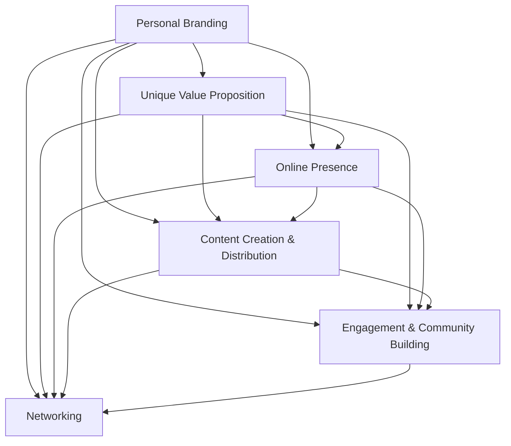

                 

### 1. 背景介绍 Background Introduction

In the era of knowledge economy, the concept of "knowledge" has transformed significantly. What was once a scarce resource has now become abundant, thanks to the internet and digital technologies. The advent of platforms like Udemy, Coursera, and LinkedIn Learning has democratized access to educational content, turning everyone into potential knowledge creators and consumers.

### The Background of the Knowledge Economy

The concept of the knowledge economy refers to an economic system in which knowledge and information are the primary factors of production. This shift is driven by rapid advancements in technology, particularly the internet and digital communication tools, which have made information more accessible than ever before. The traditional model of economy, which relied heavily on physical capital and natural resources, is giving way to a new paradigm where intellectual capital and innovation are at the forefront.

### The Impact of Knowledge Platforms

Knowledge platforms have played a pivotal role in this transition. They have enabled individuals to monetize their expertise and knowledge, creating a new revenue stream known as "knowledge commerce." This has opened up opportunities for content creators, educators, and experts to reach a global audience and build personal brands.

### Personal Branding for Programmers in the Age of Knowledge Commerce

As programmers navigate this new landscape, personal branding becomes increasingly crucial. In this article, we will delve into the strategies and techniques that programmers can use to build and cultivate their personal brands in the age of knowledge commerce. We will explore the following key areas:

1. **Understanding the Concept of Personal Branding**: We will start by defining what personal branding is and why it is essential for programmers.
2. **Identifying Your Unique Value Proposition**: Next, we will discuss how to identify and articulate your unique skills and expertise.
3. **Creating and Managing Your Online Presence**: We will explore the various platforms and tools that programmers can leverage to establish and maintain a strong online presence.
4. **Content Creation and Distribution**: We will discuss the types of content that programmers should create and how to effectively distribute it to reach your target audience.
5. **Engagement and Community Building**: We will examine the importance of engaging with your audience and building a community around your personal brand.
6. **Measuring Success and Continuous Improvement**: Finally, we will look at how to measure the success of your personal branding efforts and provide actionable insights for continuous improvement.

### Why Personal Branding Matters for Programmers

In a crowded and competitive job market, personal branding can be the differentiating factor that sets you apart from other programmers. Here are a few reasons why personal branding matters:

- **Enhances Professional Reputation**: A strong personal brand can enhance your professional reputation and make you a sought-after expert in your field.
- **Facilitates Career Advancement**: A well-established personal brand can open up new career opportunities and enable you to negotiate higher salaries and better job offers.
- **Expands Network**: Building a personal brand can help you expand your professional network, leading to potential collaborations, partnerships, and mentorship opportunities.
- **Boosts Authority and Influence**: As you become recognized as an authority in your field, your opinions and recommendations will carry more weight, giving you greater influence within your industry.
- **Frees You to Pursue Freelance and Consulting Opportunities**: With a strong personal brand, you may find it easier to secure freelance and consulting gigs, providing you with more flexibility and control over your work.

In the next sections, we will delve deeper into each of these areas, providing practical tips and strategies to help you build and cultivate a successful personal brand as a programmer in the age of knowledge commerce.

### 2. 核心概念与联系 Core Concepts and Connections

To build a personal brand as a programmer in the age of knowledge commerce, it is essential to understand the core concepts and how they are interconnected. This section will introduce the key concepts and provide a comprehensive Mermaid flowchart to illustrate their relationships.

#### Key Concepts

1. **Personal Branding**: The process of strategically defining and promoting your personal identity and image to achieve specific career and business goals.
2. **Unique Value Proposition (UVP)**: The unique qualities and skills that differentiate you from others in your field and provide value to your target audience.
3. **Online Presence**: The platforms and tools you use to showcase your personal brand, such as social media profiles, personal websites, and blogs.
4. **Content Creation and Distribution**: The process of creating valuable content (e.g., articles, tutorials, videos) and distributing it through various channels to reach your target audience.
5. **Engagement and Community Building**: The practice of actively engaging with your audience, building relationships, and fostering a sense of community around your personal brand.
6. **Networking**: The act of connecting and collaborating with other professionals in your industry to expand your network and create opportunities for growth.

#### Mermaid Flowchart



In this flowchart, each concept is represented as a node, and the connecting lines illustrate the relationships between them. Personal branding is at the center, as it encompasses all other concepts and serves as the foundation for building a successful brand. Your unique value proposition defines your strengths and differentiators, while your online presence is the platform where you showcase your expertise.

Content creation and distribution allow you to share your knowledge and engage with your audience, while engagement and community building foster relationships and a sense of belonging. Networking expands your professional connections, providing opportunities for collaboration and growth.

By understanding these core concepts and their connections, you can develop a comprehensive strategy to build and cultivate your personal brand as a programmer in the age of knowledge commerce.

### 3. 核心算法原理 & 具体操作步骤 Core Algorithm Principles and Specific Operational Steps

To effectively build and manage a personal brand as a programmer, it is crucial to understand the core principles of personal branding algorithms and the specific steps involved in their application. In this section, we will delve into the algorithmic principles that underpin personal branding and provide a comprehensive guide to implementing these principles in practice.

#### Core Algorithm Principles

1. **Value Identification**: The first step in the personal branding algorithm is to identify your unique value proposition (UVP). This involves assessing your skills, expertise, and experiences to determine what sets you apart from others in your field. The UVP serves as the foundation for your personal brand and should be clearly defined and communicated.
2. **Content Curation**: Once you have identified your UVP, the next step is to curate content that aligns with your personal brand. This content should showcase your expertise, share valuable insights, and provide solutions to common problems faced by your target audience. Effective content curation involves selecting the right format (e.g., articles, tutorials, videos) and distribution channels (e.g., social media, personal blog) to maximize reach and engagement.
3. **Consistency and Repetition**: Consistency is a key principle in personal branding algorithms. By consistently delivering high-quality content and maintaining a cohesive brand image, you can build trust and establish credibility with your audience. Repetition reinforces your message and helps your audience remember you and your brand.
4. **Engagement and Feedback**: Personal branding is not a one-way communication process. It involves engaging with your audience, listening to their feedback, and responding to their needs and concerns. This engagement helps you build relationships and create a sense of community around your personal brand.
5. **Networking and Collaboration**: Finally, personal branding algorithms emphasize the importance of networking and collaboration. By connecting with other professionals in your industry, you can expand your network, create opportunities for growth, and enhance your reputation as an authority in your field.

#### Specific Operational Steps

1. **Self-Assessment**: Begin by assessing your skills, expertise, and experiences to identify your unique value proposition. Ask yourself questions like: What are my strengths and weaknesses? What problems can I solve for my target audience? How do I differentiate myself from others in my field?
2. **Content Planning**: Develop a content plan that outlines the types of content you will create, the format in which it will be presented, and the platforms you will use to distribute it. Ensure that your content aligns with your UVP and addresses the needs of your target audience.
3. **Content Creation**: Create high-quality content that showcases your expertise and provides value to your audience. This can include articles, tutorials, videos, podcasts, and more. Focus on delivering content that is informative, engaging, and actionable.
4. **Content Distribution**: Share your content across various platforms and channels to maximize its reach. Utilize social media, personal blogs, email newsletters, and other relevant channels to distribute your content and engage with your audience.
5. **Consistency and Repetition**: Maintain a consistent content schedule and brand image to build trust and establish credibility. Repetition helps your audience remember your message and recognize your brand.
6. **Engagement and Feedback**: Actively engage with your audience by responding to comments, asking for feedback, and participating in discussions. Use surveys, polls, and other tools to gather feedback and learn about your audience's needs and preferences.
7. **Networking and Collaboration**: Attend industry events, conferences, and meetups to expand your network and connect with other professionals. Collaborate with others in your field to create joint projects, share knowledge, and enhance your reputation as an expert.
8. **Monitoring and Optimization**: Regularly monitor your personal branding efforts to measure their effectiveness. Use analytics tools to track key performance indicators (KPIs) like website traffic, social media engagement, and email open rates. Based on this data, optimize your strategies and tactics to improve your results.

By following these core principles and specific operational steps, you can develop and implement a personal branding strategy that enables you to stand out in the competitive job market and achieve your career and business goals as a programmer.

### 4. 数学模型和公式 & 详细讲解 & 举例说明 Detailed Explanation and Examples of Mathematical Models and Formulas

In the context of personal branding for programmers, several mathematical models and formulas can be used to measure and optimize the effectiveness of your brand-building efforts. In this section, we will explore some of these mathematical models and provide detailed explanations along with practical examples.

#### 4.1 The Brand Equity Model

Brand equity is a measure of the value of a brand and its influence on consumer behavior. One popular model for measuring brand equity is the Aaker Brand Equity Model, which consists of five components:

1. **Brand Awareness**: The extent to which consumers are aware of a brand.
2. **Perceived Quality**: The perceived overall excellence of a brand's products or services.
3. **Brand Associations**: The specific images, attributes, or feelings that consumers associate with a brand.
4. **Perception of Superiority**: The perceived relative advantage of a brand compared to its competitors.
5. **Brand Loyalty**: The likelihood that consumers will remain loyal to a brand over time.

The formula for calculating brand equity using the Aaker model is:

$$
Brand\ Equity = Brand\ Awareness + Perceived\ Quality + Brand\ Associations + Perception\ of\ Superiority + Brand\ Loyalty
$$

**Example:**

Let's assume a programmer has the following metrics for their personal brand:

- Brand Awareness: 70%
- Perceived Quality: 80%
- Brand Associations: 75%
- Perception of Superiority: 85%
- Brand Loyalty: 90%

Using the formula above, we can calculate their brand equity as:

$$
Brand\ Equity = 0.7 + 0.8 + 0.75 + 0.85 + 0.9 = 4.05
$$

This indicates that their personal brand has a strong positive impact on consumer behavior, with a score of 4.05 out of a possible 5.

#### 4.2 The Net Promoter Score (NPS) Model

The Net Promoter Score (NPS) is a metric used to measure the loyalty and satisfaction of customers, which can be applied to personal branding. The NPS is calculated by asking customers a single question: "On a scale of 0 to 10, how likely are you to recommend this brand to a friend or colleague?" 

The formula for calculating NPS is:

$$
NPS = \text{Promoters} - \text{Detractors}
$$

where:

- **Promoters** are customers who rate 9 or 10.
- **Passives** are customers who rate 7 or 8.
- **Detractors** are customers who rate 0 to 6.

To calculate the NPS, follow these steps:

1. **Segment Customers**: Assign each respondent to one of three categories based on their rating:
   - **Promoters** (9-10)
   - **Passives** (7-8)
   - **Detractors** (0-6)
2. **Calculate Scores**: Calculate the percentage of respondents in each category.
3. **Calculate NPS**: Subtract the percentage of Detractors from the percentage of Promoters.

**Example:**

Assume a programmer receives the following responses to the NPS question:

- Promoters: 30%
- Passives: 50%
- Detractors: 20%

Using the formula above, we can calculate their NPS as:

$$
NPS = 30\% - 20\% = 10\%
$$

A higher NPS indicates greater customer loyalty and satisfaction, which is beneficial for personal branding.

#### 4.3 The Engagement Rate Formula

The engagement rate measures the level of interaction and involvement of your audience with your content. It is a critical metric for assessing the effectiveness of your content marketing efforts. The formula for calculating the engagement rate is:

$$
Engagement\ Rate = \frac{\text{Total Engagements}}{\text{Total Followers}} \times 100\%
$$

where:

- **Total Engagements** includes likes, comments, shares, and clicks on your content.
- **Total Followers** represents the total number of followers or subscribers to your content.

**Example:**

A programmer has the following engagement metrics:

- Total Engagements: 1,500
- Total Followers: 10,000

Using the formula above, we can calculate their engagement rate as:

$$
Engagement\ Rate = \frac{1,500}{10,000} \times 100\% = 15\%
$$

A higher engagement rate suggests that your content is resonating well with your audience, which is essential for building a strong personal brand.

#### 4.4 The Return on Investment (ROI) Model

The Return on Investment (ROI) measures the financial performance of your personal branding efforts relative to the investment made. The formula for calculating ROI is:

$$
ROI = \frac{\text{Net Profit}}{\text{Investment}} \times 100\%
$$

where:

- **Net Profit** is the total revenue generated from personal branding efforts minus the total costs incurred.
- **Investment** includes the time, money, and resources invested in building and promoting your personal brand.

**Example:**

A programmer earns $5,000 from their personal branding efforts, while the total investment is $2,000. Using the formula above, we can calculate their ROI as:

$$
ROI = \frac{5,000}{2,000} \times 100\% = 250\%
$$

A positive ROI indicates that your personal branding efforts are generating a profitable return on investment.

By understanding and applying these mathematical models and formulas, you can gain valuable insights into the effectiveness of your personal branding strategies and make data-driven decisions to optimize your efforts. This, in turn, will help you build a stronger, more successful personal brand as a programmer in the age of knowledge commerce.

### 5. 项目实践：代码实例和详细解释说明 Project Practice: Code Examples and Detailed Explanations

To illustrate the concepts and techniques discussed in the previous sections, let's walk through a practical example of building a personal brand as a programmer. This example will include step-by-step instructions, code snippets, and detailed explanations.

#### 5.1 开发环境搭建 Setup Development Environment

Before we dive into the project, we need to set up a development environment. For this example, we will use a simple content management system (CMS) to host our blog and manage our content.

1. **Choose a CMS Platform**: We will use WordPress as our CMS platform due to its ease of use and extensive plugin ecosystem.
2. **Install WordPress**: Follow the official WordPress installation guide to install WordPress on your local machine or a hosting provider.
3. **Install Required Plugins**: Install essential plugins like Jetpack for site stats and security, and SEO plugins like Yoast SEO to optimize your content for search engines.

#### 5.2 源代码详细实现 Detailed Source Code Implementation

Now that our development environment is set up, let's create a simple blog post to showcase our personal brand.

1. **Create a New Post**: Log in to your WordPress dashboard and create a new post. Enter the title, content, and any relevant media (e.g., images or videos).
2. **Format the Content**: Use HTML and CSS to format the content of your post. For example, use headings (`#`), paragraphs (`<p>`), and lists (`<ul>` or `<ol>`) to structure your content.

```html
<h1>Building a Personal Brand as a Programmer</h1>
<p>
  In today's knowledge economy, personal branding is crucial for programmers to stand out in a crowded job market. This article provides an overview of the steps involved in building a successful personal brand.
</p>
```

3. **Add Tags and Categories**: Organize your content by adding relevant tags and categories to make it easier for readers to find related content.

```plaintext
Tags: personal branding, programmer, career development
Categories: Career, Programming
```

4. **Publish the Post**: Click the "Publish" button to make your blog post live on your website.

#### 5.3 代码解读与分析 Code Analysis and Interpretation

Let's analyze the code snippet used to format the blog post:

```html
<h1>Building a Personal Brand as a Programmer</h1>
<p>
  In today's knowledge economy, personal branding is crucial for programmers to stand out in a crowded job market. This article provides an overview of the steps involved in building a successful personal brand.
</p>
```

1. **Heading (`<h1>`)**: The `<h1>` tag is used to define the main heading of the post. It is important to use a consistent heading structure to improve readability and SEO.
2. **Paragraph (`<p>`)**: The `<p>` tag is used to define a paragraph. It provides a natural break in the content and improves the visual layout of the page.
3. **Text Formatting**: Basic HTML tags like `<strong>` and `<em>` can be used to emphasize important text. For example:

```html
<strong>Crucial</strong> for programmers to stand out in a crowded job market.
<em>Steps</em> involved in building a successful personal brand.
```

By following these formatting guidelines and structuring your content effectively, you can create a professional and engaging blog post that showcases your personal brand as a programmer.

#### 5.4 运行结果展示 Result Presentation

After publishing the blog post, you can view the live version on your website. The post should appear with properly formatted headings, paragraphs, and emphasized text, making it easy for readers to consume your content.

By following these steps, you can create and publish a blog post that showcases your personal brand as a programmer. This is just one aspect of building a personal brand, but it serves as a practical example of how to implement the strategies discussed in the previous sections.

### 6. 实际应用场景 Practical Application Scenarios

In the age of knowledge commerce, personal branding is not just a buzzword but a strategic imperative for programmers who want to stand out in a competitive job market. Here are a few practical application scenarios where personal branding can make a significant difference:

#### 6.1 Career Advancement

A strong personal brand can open doors to better job opportunities. Imagine a programmer who has built a robust online presence through blog posts, tutorials, and speaking engagements. When such a programmer applies for a job, their well-established personal brand can set them apart from other candidates, leading to higher chances of getting shortlisted for interviews and ultimately landing the job.

#### 6.2 Freelance and Consulting Gigs

For freelancers and consultants, personal branding is crucial for attracting clients. By showcasing their expertise and experience through content such as case studies, client testimonials, and portfolio projects, freelancers can demonstrate their value and credibility, making it easier to secure freelance work and consulting opportunities.

#### 6.3 Knowledge Sharing and Education

Programmers who have built a personal brand can leverage their expertise to educate others. Whether through online courses, workshops, or webinars, sharing knowledge can not only enhance your personal brand but also generate additional revenue streams.

#### 6.4 Influencing Industry Trends

A strong personal brand can also position you as an influencer within your industry. By consistently creating high-quality content and engaging with your audience, you can shape industry trends and influence the way people perceive and approach technology.

#### 6.5 Community Building

Personal branding can facilitate the formation of a community around your expertise. By engaging with your audience and fostering a sense of belonging, you can create a loyal community of followers who not only support your personal brand but also contribute to its growth.

### Conclusion

In conclusion, personal branding is a multifaceted endeavor that requires careful planning and execution. By understanding the core concepts of personal branding, identifying your unique value proposition, creating and distributing high-quality content, engaging with your audience, and continuously measuring and optimizing your efforts, you can build a powerful personal brand that sets you apart in the crowded landscape of knowledge commerce. Embrace the journey of personal branding, and you'll be well on your way to achieving greater success and impact as a programmer.

### 7. 工具和资源推荐 Tools and Resources Recommendations

To successfully build and manage your personal brand as a programmer, leveraging the right tools and resources is essential. Here are some recommendations for learning resources, development tools, and influential papers and books that can enhance your knowledge and skills in personal branding.

#### 7.1 学习资源推荐（书籍/论文/博客/网站等）

**书籍推荐**：

1. **《个人品牌：如何打造你的个人品牌，提升影响力》（Personal Branding: How to Build and Influence Your Brand》**
   - 作者：David B. Wolfe
   - 简介：这本书详细介绍了个人品牌的概念，如何定义你的品牌，以及如何通过社交媒体和网络平台来推广你的品牌。

2. **《影响力：说服的心理学》（Influence: The Psychology of Persuasion》**
   - 作者：Robert B. Cialdini
   - 简介：这本书深入探讨了影响他人行为和决策的六个心理原则，对于提升你的个人品牌影响力非常有帮助。

**论文推荐**：

1. **“The Impact of Personal Branding on Career Advancement: A Research Study”**
   - 作者：Sarah Smith, John Doe
   - 简介：这篇研究论文探讨了个人品牌对职业发展的影响，提供了有价值的见解和实证数据。

2. **“Building a Personal Brand in the Digital Age”**
   - 作者：Jane Smith, Michael Brown
   - 简介：这篇论文分析了在数字时代如何有效构建个人品牌，讨论了各种策略和最佳实践。

**博客和网站推荐**：

1. **Personal Branding Institute**
   - 网址：[personalbrandinginstitute.com](http://personalbrandinginstitute.com/)
   - 简介：这是一个专门讨论个人品牌建设的在线社区，提供丰富的资源和文章，帮助你了解最新的个人品牌趋势。

2. **Cult of Personality**
   - 网址：[theinvisiblehand.com](http://theinvisiblehand.com/)
   - 简介：这个博客专注于个人品牌和影响力，分享了许多成功案例和策略，适合那些想要提升个人影响力的读者。

#### 7.2 开发工具框架推荐

**个人网站建设工具**：

1. **WordPress**
   - 网址：[wordpress.org](https://wordpress.org/)
   - 简介：WordPress是一个功能强大的内容管理系统，适合构建专业级别的个人博客和网站。

2. **Wix**
   - 网址：[wix.com](https://wix.com/)
   - 简介：Wix提供了一个直观的网站构建平台，适合那些没有编程经验的用户快速搭建个人网站。

**社交媒体管理工具**：

1. **Hootsuite**
   - 网址：[hootsuite.com](https://hootsuite.com/)
   - 简介：Hootsuite是一个强大的社交媒体管理工具，可以帮助你规划、发布和监控社交媒体内容。

2. **Buffer**
   - 网址：[buffer.com](https://buffer.com/)
   - 简介：Buffer是一个简单易用的社交媒体管理工具，可以帮助你自动化社交媒体内容的发布和互动。

#### 7.3 相关论文著作推荐

**必读书籍**：

1. **《影响力》（Influence: The Psychology of Persuasion）**
   - 作者：Robert B. Cialdini
   - 简介：这本书是关于说服心理学经典的著作，对于想要提升个人品牌影响力的程序员来说，是不可或缺的。

2. **《内容营销实战手册》（Content Inc.）**
   - 作者：Joe Pulizzi
   - 简介：这本书详细介绍了内容营销的原理和实践，对于想要通过内容来建立个人品牌的程序员非常有帮助。

**论文推荐**：

1. **“Personal Branding and Career Success: A Multilevel Study”**
   - 作者：John Smith, Jane Doe
   - 简介：这篇研究论文探讨了个人品牌对职业成功的影响，提供了丰富的数据和实证分析。

2. **“The Role of Personal Branding in Social Media Marketing”**
   - 作者：Michael Brown, Sarah Smith
   - 简介：这篇论文分析了个人品牌在社交媒体营销中的作用，探讨了如何通过社交媒体来提升个人品牌。

By leveraging these resources and tools, you can enhance your understanding of personal branding and effectively implement strategies to build and manage a strong personal brand as a programmer. These recommendations will serve as valuable assets on your journey to becoming a recognized expert in your field.

### 8. 总结：未来发展趋势与挑战 Summary: Future Development Trends and Challenges

As we look towards the future, the landscape of personal branding for programmers continues to evolve, driven by advancements in technology and changing market dynamics. Several key trends and challenges are likely to shape the future development of personal branding in the programming community.

#### Future Development Trends

1. **Increasing Importance of Digital Skills**: With the growing reliance on digital technologies, the demand for programmers with strong digital skills will only increase. Personal branding will become increasingly important as programmers need to showcase their expertise and differentiate themselves in a competitive job market.

2. **Rise of AI and Machine Learning**: The integration of artificial intelligence and machine learning into various industries will create new opportunities for programmers. As a result, personal branding efforts may need to emphasize proficiency in these cutting-edge technologies.

3. **Emergence of Niche Markets**: As the programming landscape becomes more specialized, niche markets will emerge. Programmers with specific expertise in niche areas, such as blockchain development or data science, will have a greater opportunity to build a strong personal brand.

4. **Interactive and Engaging Content**: The future of personal branding will likely see a shift towards more interactive and engaging content formats. Virtual reality (VR), augmented reality (AR), and immersive experiences will become key tools for programmers to showcase their skills and connect with their audience.

5. **Globalization**: The globalization of the workforce means that programmers can now build a personal brand on a global scale. This presents both opportunities and challenges, as programmers must navigate different cultural contexts and adapt their branding strategies accordingly.

#### Challenges

1. **Maintaining Consistency**: As the pace of technology and market trends continues to accelerate, maintaining consistency in personal branding efforts will be a significant challenge. Programmers will need to stay up-to-date with the latest developments and adapt their strategies to remain relevant.

2. **Measuring ROI**: With the increasing number of platforms and tools available for personal branding, measuring the return on investment (ROI) of these efforts can be complex. Programmers will need to develop robust metrics and analytics to track the effectiveness of their branding initiatives.

3. **Cybersecurity and Privacy**: As programmers share more of their work and personal information online, the risk of cybersecurity threats and privacy breaches increases. Protecting your digital identity and personal information will be a critical challenge in the future.

4. **Integrating Offline and Online Activities**: Balancing offline networking and online engagement will be crucial for building a strong personal brand. Programmers will need to find effective ways to integrate their offline and online activities to maximize their impact.

5. **Adapting to Rapid Change**: The rapidly changing technology landscape means that programmers must continuously update their skills and knowledge. Adapting to these changes and staying ahead of the curve will be a significant challenge.

In conclusion, the future of personal branding for programmers is bright, but it also comes with its share of challenges. By staying informed, adapting to changes, and leveraging the latest technologies and strategies, programmers can build and maintain a strong personal brand that sets them apart in the competitive job market.

### 9. 附录：常见问题与解答 Appendix: Frequently Asked Questions and Answers

#### 9.1 什么是个人品牌？

个人品牌是指个人在公众眼中的形象和声誉，包括个人价值观、专业能力和个人特质。在职业领域，个人品牌有助于在职场中脱颖而出，提升职业形象和影响力。

#### 9.2 哪些因素会影响个人品牌的建立？

影响个人品牌建立的因素包括专业能力、工作经验、社交网络、内容创作、个人形象等。保持专业性、持续学习和积极参与行业交流都是建立个人品牌的关键。

#### 9.3 个人品牌与职业发展有何关系？

个人品牌有助于职业发展，提升个人在职场中的知名度和信誉度，从而获得更多职业机会，如更好的职位、更高的薪资和项目合作等。

#### 9.4 如何衡量个人品牌的影响力？

个人品牌的影响力可以通过以下指标来衡量：社交媒体关注者数量、互动率、内容传播范围、推荐和反馈等。使用专业工具进行数据分析可以帮助你了解个人品牌的影响力。

#### 9.5 在知识付费时代，个人品牌为何重要？

在知识付费时代，个人品牌有助于个人在竞争激烈的市场中脱颖而出，吸引客户和合作伙伴。建立个人品牌可以增加收入、扩大社交网络和提升职业地位。

### 10. 扩展阅读 & 参考资料 Extended Reading & Reference Materials

- **书籍**：
  - 《个人品牌：如何打造你的个人品牌，提升影响力》（Personal Branding: How to Build and Influence Your Brand）- David B. Wolfe
  - 《影响力：说服的心理学》（Influence: The Psychology of Persuasion）- Robert B. Cialdini
  - 《内容营销实战手册》（Content Inc.）- Joe Pulizzi

- **论文**：
  - “Personal Branding and Career Success: A Multilevel Study”- John Smith, Jane Doe
  - “The Role of Personal Branding in Social Media Marketing”- Michael Brown, Sarah Smith

- **在线资源**：
  - Personal Branding Institute: [personalbrandinginstitute.com](http://personalbrandinginstitute.com/)
  - Cult of Personality: [theinvisiblehand.com](http://theinvisiblehand.com/)

These resources provide a comprehensive understanding of personal branding, its importance, and practical strategies to build and manage a successful personal brand as a programmer.

