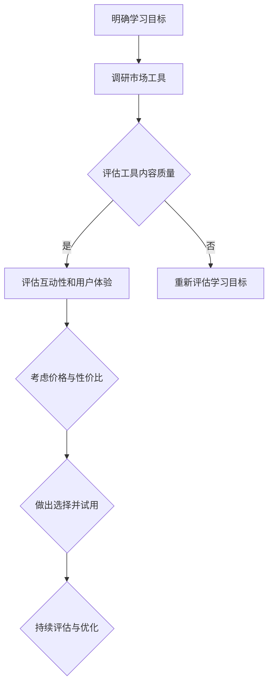

                 

# 知识付费：程序员的社群工具选择

## 关键词

* 知识付费
* 社群工具
* 程序员
* 教育资源
* 技术交流

## 摘要

在数字化时代，知识付费逐渐成为人们获取专业技能和知识的重要途径。本文将聚焦于程序员这一特定群体，探讨他们在选择知识付费社群工具时所需考虑的关键因素，以及如何通过这些工具提升自身的编程能力。通过分析当前流行的知识付费社群工具，本文旨在为程序员提供有价值的建议和指导。

### 1. 背景介绍（Background Introduction）

在当今快速发展的技术行业，程序员面临着不断更新的编程语言、框架和工具。为了保持竞争力，程序员需要持续学习新的技能和知识。知识付费作为一项服务，提供了多样化的教育资源，包括在线课程、专业书籍、编程论坛和社群等。这些资源不仅可以帮助程序员快速掌握新技能，还能提供与同行交流的机会，促进技术交流和知识共享。

程序员在选择知识付费社群工具时，需要考虑以下因素：

1. **内容质量**：社群工具提供的内容是否具有实用性、权威性和及时性。
2. **互动性**：工具是否支持用户之间的互动，包括提问、讨论和代码审查等。
3. **用户群体**：社群成员的技术水平、经验和背景是否与自己相符。
4. **价格与性价比**：价格是否合理，是否提供免费试用或优惠活动。
5. **用户界面与用户体验**：工具的界面设计是否简洁易用，是否提供良好的用户体验。

### 2. 核心概念与联系（Core Concepts and Connections）

#### 2.1 知识付费社群工具的定义

知识付费社群工具是指专门为知识付费用户设计的在线平台或应用，提供教育资源和技术交流服务。这些工具通常包括以下功能：

1. **课程学习**：提供编程语言、框架和技术的在线课程。
2. **问答社区**：用户可以在平台上提问并获得专业人士的解答。
3. **讨论论坛**：用户可以参与技术讨论和分享经验。
4. **代码审查**：用户可以提交代码，并获得同行或专家的审查和建议。

#### 2.2 知识付费社群工具的重要性

知识付费社群工具对程序员的重要性体现在以下几个方面：

1. **技能提升**：通过在线课程和教程，程序员可以快速学习新技能。
2. **问题解决**：在问答社区中，程序员可以快速解决编程问题，提高工作效率。
3. **经验分享**：通过讨论论坛，程序员可以分享自己的经验和见解，与他人共同进步。
4. **职业发展**：通过参与社群活动，程序员可以扩大人脉，提高职业竞争力。

### 3. 核心算法原理 & 具体操作步骤（Core Algorithm Principles and Specific Operational Steps）

在选择知识付费社群工具时，程序员可以遵循以下步骤：

1. **确定学习目标**：明确自己需要学习的编程语言、框架或技术。
2. **调研工具**：通过搜索引擎或推荐，了解不同知识付费社群工具的特点和功能。
3. **试用体验**：选择几款感兴趣的工具，进行免费试用，评估其内容质量和用户体验。
4. **参与互动**：加入社群，积极参与课程学习、问答讨论和论坛交流。
5. **反馈与改进**：根据使用体验，对工具进行评价和建议，以便优化使用效果。

### 4. 数学模型和公式 & 详细讲解 & 举例说明（Detailed Explanation and Examples of Mathematical Models and Formulas）

在选择知识付费社群工具时，程序员可以运用一些数学模型来评估工具的性价比。以下是一个简单的成本效益分析模型：

#### 成本效益分析模型

$$
C = \frac{P \times T}{R}
$$

其中：

- \( C \)：总成本
- \( P \)：工具费用
- \( T \)：使用时长
- \( R \)：预期收益（包括技能提升、问题解决、经验分享等）

通过该模型，程序员可以计算使用特定知识付费社群工具的总成本，并将其与预期收益进行比较，以做出更明智的选择。

#### 举例说明

假设一位程序员选择了一个每月订阅费用为100美元的知识付费社群工具，计划使用一年。他在社群中获得了以下收益：

1. 通过在线课程学习新技能，提高了工作效率，每月节省500美元。
2. 在问答社区中解决了多个编程问题，避免了项目延期，每月节省200美元。
3. 参与论坛讨论，分享了经验，获得了同行认可，提高了职业竞争力。

根据以上数据，我们可以计算其总成本和预期收益：

$$
C = 100 \times 12 = 1200 \text{美元}
$$

$$
R = (500 + 200) \times 12 = 8400 \text{美元}
$$

显然，预期收益远高于总成本，因此，该工具具有较好的性价比。

### 5. 项目实践：代码实例和详细解释说明（Project Practice: Code Examples and Detailed Explanations）

#### 5.1 开发环境搭建

为了更好地理解知识付费社群工具的实用性，我们以一个实际项目为例：使用某知名知识付费社群工具平台开发一个简单的博客系统。

首先，我们需要在平台上注册账号，并选择一个适合开发博客系统的编程语言和框架。以Python和Flask为例，我们可以在平台上找到相关的在线课程和教程。

#### 5.2 源代码详细实现

以下是一个简单的Flask博客系统的示例代码：

```python
from flask import Flask, render_template, request

app = Flask(__name__)

@app.route('/')
def home():
    return render_template('home.html')

@app.route('/about')
def about():
    return render_template('about.html')

@app.route('/post', methods=['GET', 'POST'])
def post():
    if request.method == 'POST':
        title = request.form['title']
        content = request.form['content']
        # 将标题和内容保存到数据库
        # ...
        return f'Post titled "{title}" has been created!'
    return render_template('post.html')

if __name__ == '__main__':
    app.run(debug=True)
```

#### 5.3 代码解读与分析

上述代码实现了三个基本路由：首页（/）、关于页（/about）和博客发布页（/post）。首页和关于页分别使用了`home.html`和`about.html`模板，博客发布页使用了`post.html`模板。

在`post.html`模板中，我们定义了一个表单，用于接收用户输入的标题和内容。在`post.py`文件中，我们通过`request.form`获取表单数据，并将其保存到数据库。这里，我们使用了Flask的ORM库（如SQLAlchemy）来实现数据持久化。

通过这个简单的示例，我们可以看到知识付费社群工具如何帮助我们快速搭建一个实用的项目。

#### 5.4 运行结果展示

在本地环境中运行上述代码，我们可以在浏览器中访问博客系统的首页、关于页和博客发布页。输入标题和内容后，点击提交按钮，博客文章将被创建并显示在页面上。

### 6. 实际应用场景（Practical Application Scenarios）

知识付费社群工具在程序员中的实际应用场景非常广泛：

1. **在线学习**：程序员可以通过在线课程学习新的编程语言、框架和技术。
2. **问题解决**：在遇到编程难题时，程序员可以在问答社区中寻求帮助。
3. **经验分享**：通过讨论论坛，程序员可以分享自己的经验和见解。
4. **职业发展**：参与社群活动可以帮助程序员扩大人脉，提高职业竞争力。

### 7. 工具和资源推荐（Tools and Resources Recommendations）

#### 7.1 学习资源推荐

1. **Coursera**：提供广泛的在线课程，涵盖多个编程语言和框架。
2. **Udemy**：提供丰富的编程教程，包括视频课程、电子书和实战项目。
3. **Pluralsight**：专注于技术技能提升，提供高质量的在线课程和资源。
4. **edX**：由哈佛大学和麻省理工学院创办的在线学习平台，提供多个计算机科学课程。

#### 7.2 开发工具框架推荐

1. **GitHub**：全球最大的代码托管平台，支持版本控制和协同开发。
2. **GitLab**：自建代码托管平台，支持私有项目和团队协作。
3. **Jenkins**：自动化构建和持续集成工具，用于自动化代码测试和部署。
4. **Docker**：容器化技术，用于简化应用部署和扩展。

#### 7.3 相关论文著作推荐

1. **"The Art of Computer Programming"**：Donald E. Knuth 的经典著作，介绍了编程和算法的基本原理。
2. **"Clean Code: A Handbook of Agile Software Craftsmanship"**：Robert C. Martin 的著作，讲述了编写可读、可维护代码的最佳实践。
3. **"Design Patterns: Elements of Reusable Object-Oriented Software"**：Erich Gamma、Richard Helm、Ralph Johnson 和 John Vlissides 的著作，介绍了面向对象设计模式。
4. **"Programming Pearls"**：Jon Bentley 的著作，分享了编程技巧和算法优化方法。

### 8. 总结：未来发展趋势与挑战（Summary: Future Development Trends and Challenges）

知识付费社群工具在未来将继续发展，为程序员提供更多优质的教育资源和交流平台。然而，随着市场竞争的加剧，工具提供商需要不断创新和优化，以满足用户的需求。

1. **个性化推荐**：通过大数据分析和人工智能技术，为用户提供个性化的学习资源和推荐。
2. **社交互动**：加强用户之间的互动，促进技术交流和知识共享。
3. **跨界融合**：与其他领域的知识付费工具合作，拓展服务范围，提高用户体验。

同时，知识付费社群工具面临着以下挑战：

1. **内容质量**：确保提供的内容具有实用性和权威性。
2. **用户体验**：优化用户界面和交互设计，提高用户体验。
3. **数据安全**：加强数据保护和隐私保护，确保用户信息安全。

### 9. 附录：常见问题与解答（Appendix: Frequently Asked Questions and Answers）

#### 9.1 如何选择适合自己的知识付费社群工具？

1. 确定学习目标，了解自己的需求。
2. 调研不同工具的特点和功能，比较性价比。
3. 进行免费试用，评估工具的内容质量和用户体验。
4. 参考他人评价和推荐，结合自身情况做出选择。

#### 9.2 知识付费社群工具是否值得购买？

1. 对于有明确学习目标和需求的程序员，知识付费社群工具可以提供高效的资源和交流平台。
2. 购买前，可以尝试免费试用，评估工具的价值。
3. 个人情况不同，是否值得购买需根据自身需求和经济状况综合考虑。

### 10. 扩展阅读 & 参考资料（Extended Reading & Reference Materials）

1. "Learning to Code: A Comprehensive Guide" - Sarah Drasner 的著作，介绍了学习编程的步骤和资源。
2. "The Economics of Online Education: What Do We Know and What Do We Need to Learn?" - Anant Agarwal 的论文，探讨了在线教育的经济影响。
3. "How to Choose the Right Online Learning Platform for You" - edX 的博客文章，提供了选择在线学习平台的建议。
4. "The Future of Work: How Technology Is Transforming Jobs and the Workplace" - Michael J. Mandel 的著作，分析了技术对工作的影响。

### 作者署名

作者：禅与计算机程序设计艺术 / Zen and the Art of Computer Programming

本文旨在为程序员提供选择知识付费社群工具的指导，帮助他们提升编程能力，拓展职业发展。希望本文能对广大程序员朋友有所启发和帮助。## 1. 背景介绍（Background Introduction）

### 知识付费的兴起

知识付费作为数字化时代的一种新兴商业模式，正逐渐改变人们获取知识和技能的方式。在过去，传统教育模式通常依赖于学校、培训机构等实体场所，学习者需要付出大量的时间和经济成本。然而，随着互联网的普及和在线教育平台的兴起，知识付费模式应运而生，为广大学习者提供了更加灵活和便捷的学习方式。

知识付费的核心在于通过付费获取高质量的教育资源，这些资源通常包括在线课程、专业书籍、一对一辅导、社群交流等。学习者在支付一定费用后，可以无限制地访问这些资源，根据自己的需求和兴趣进行学习和提升。这种模式不仅降低了学习成本，还极大地提高了学习效率。

### 程序员的学习需求

程序员作为技术行业的重要角色，面临着快速发展的技术环境和不断更新的知识体系。为了适应这一变化，程序员需要持续学习和掌握新的编程语言、框架和技术。以下是一些程序员在学习过程中遇到的主要问题：

1. **技能更新频繁**：编程语言和框架的更新速度非常快，程序员需要不断跟进最新的技术趋势。
2. **专业知识深度**：编程不仅需要广度，还需要深度，程序员需要深入学习各种算法和数据结构。
3. **实践经验**：理论知识固然重要，但实践经验同样不可或缺。程序员需要通过项目实践来巩固和提升技能。
4. **问题解决能力**：编程过程中会遇到各种问题，程序员需要具备良好的问题解决能力。

### 知识付费社群工具的优势

知识付费社群工具为程序员提供了以下几个方面的优势：

1. **教育资源丰富**：知识付费社群工具通常提供大量的在线课程和教程，涵盖了多种编程语言和技术领域。
2. **实时互动交流**：社群工具支持用户之间的实时互动，程序员可以通过问答社区和论坛与同行和专家交流，解决问题和分享经验。
3. **个性化推荐**：通过大数据和人工智能技术，社群工具可以推荐符合用户兴趣和需求的学习资源和课程。
4. **职业发展支持**：一些社群工具还提供职业规划、面试技巧和职业发展建议，帮助程序员提升职业竞争力。

### 程序员在知识付费社群工具中的角色

程序员在知识付费社群工具中扮演多重角色：

1. **学习者**：通过在线课程和教程，程序员可以系统地学习新的编程知识和技能。
2. **贡献者**：程序员可以参与社群讨论，分享自己的经验和见解，帮助他人解决问题。
3. **实践者**：通过参与实际项目和实践，程序员可以将所学知识应用到实际工作中，提升自己的编程能力。

总之，知识付费社群工具为程序员提供了丰富的学习资源、便捷的交流平台和实用的职业发展支持，成为他们提升技能和拓展视野的重要工具。

### 总结

在数字化时代，知识付费已经成为程序员提升技能和知识的重要途径。通过分析程序员的学习需求和知识付费社群工具的优势，我们可以看到这些工具在提供教育资源、促进技术交流、支持职业发展等方面的重要作用。接下来，本文将深入探讨程序员在选择知识付费社群工具时需要考虑的关键因素，并分析当前市场上流行的几种工具，以帮助程序员做出更明智的选择。

### 2. 核心概念与联系（Core Concepts and Connections）

#### 2.1 知识付费社群工具的定义

知识付费社群工具是指专门为知识付费用户设计的在线平台或应用，旨在为用户提供教育资源、技术交流、职业发展等方面的服务。这些工具通常包括在线课程、问答社区、讨论论坛、代码审查等功能，为用户提供了全方位的学习和交流环境。

#### 2.2 核心功能与组成部分

知识付费社群工具的核心功能主要包括以下几个方面：

1. **在线课程**：提供各种编程语言、框架、技术的在线教程，用户可以按需学习。
2. **问答社区**：用户可以在社区中提问，并获得专业人士的解答，快速解决编程问题。
3. **讨论论坛**：用户可以参与技术讨论和分享经验，扩大人脉，共同进步。
4. **代码审查**：用户可以提交代码，并获得同行或专家的审查和建议，提升代码质量。

知识付费社群工具的主要组成部分包括：

1. **平台**：提供核心功能和服务的在线平台。
2. **用户**：包括学习者、贡献者、实践者等。
3. **内容**：包括课程、教程、问答、论坛、代码审查等资源。
4. **技术**：使用互联网技术、大数据、人工智能等技术实现工具的功能和优化。

#### 2.3 知识付费社群工具在程序员学习中的作用

知识付费社群工具在程序员学习中的作用体现在以下几个方面：

1. **快速学习**：通过在线课程和教程，程序员可以快速掌握新的编程语言和技术。
2. **问题解决**：在问答社区中，程序员可以快速解决编程问题，提高工作效率。
3. **经验分享**：通过讨论论坛，程序员可以分享自己的经验和见解，与他人共同进步。
4. **职业发展**：通过参与社群活动，程序员可以扩大人脉，提高职业竞争力。

#### 2.4 当前流行的知识付费社群工具

在当前市场上，有许多流行的知识付费社群工具，以下是一些具有代表性的平台：

1. **Coursera**：提供全球顶尖大学和企业的在线课程，涵盖多个领域。
2. **Udemy**：提供丰富的编程教程和资源，适合不同水平和需求的程序员。
3. **Pluralsight**：专注于技术技能提升，提供高质量的在线课程和资源。
4. **edX**：由哈佛大学和麻省理工学院创办的在线学习平台，提供多个计算机科学课程。
5. **GitHub**：全球最大的代码托管平台，支持版本控制和协同开发。
6. **GitLab**：自建代码托管平台，支持私有项目和团队协作。
7. **Stack Overflow**：全球最大的开发者社区，提供问答和讨论功能。
8. **LinkedIn Learning**：LinkedIn提供的在线学习平台，涵盖多个技术领域。

#### 2.5 知识付费社群工具的优缺点

**优点**：

1. **灵活便捷**：用户可以根据自己的时间和需求进行学习，无需受时间和地点限制。
2. **教育资源丰富**：平台提供大量高质量的课程和教程，满足用户多样化的学习需求。
3. **互动交流**：用户可以在社群中与同行和专家交流，拓展人脉，获取有价值的信息。
4. **个性化推荐**：通过大数据和人工智能技术，平台可以为用户提供个性化的学习资源和推荐。

**缺点**：

1. **内容质量参差不齐**：一些平台上的课程和教程质量难以保证，用户需要自行筛选。
2. **价格较高**：一些高端的知识付费社群工具价格较高，可能不适合所有用户。
3. **学习效果难以评估**：在线学习的效果难以直接衡量，用户需要自我监督和反馈。

### 总结

知识付费社群工具为程序员提供了丰富的学习资源、便捷的交流平台和实用的职业发展支持，成为他们提升技能和拓展视野的重要工具。通过分析当前流行的知识付费社群工具，我们可以看到这些工具在功能、内容、用户体验等方面的特点，为程序员的选择提供了参考。

### 3. 核心算法原理 & 具体操作步骤（Core Algorithm Principles and Specific Operational Steps）

#### 3.1 知识付费社群工具的核心算法原理

知识付费社群工具的核心算法主要包括用户行为分析、内容推荐算法和社群管理算法。以下分别对这三种核心算法进行简要介绍。

**用户行为分析算法**：

用户行为分析算法通过对用户在学习平台上的行为数据进行收集和分析，如访问课程、提问、参与讨论等，生成用户兴趣和行为模型。基于这些模型，算法可以识别用户的兴趣偏好，为用户提供个性化的学习资源。

**内容推荐算法**：

内容推荐算法是基于用户行为分析结果，利用协同过滤、基于内容的推荐、深度学习等技术，为用户推荐符合其兴趣和需求的学习资源和课程。推荐算法的核心目标是最小化用户在找到感兴趣内容时的搜索成本，提高学习效率。

**社群管理算法**：

社群管理算法主要负责维护社群的秩序和氛围，包括用户管理、内容审核、活动策划等。算法通过分析用户的互动行为，识别潜在的不良行为和违规内容，并及时进行处理，确保社群的健康发展。

#### 3.2 程序员选择知识付费社群工具的具体操作步骤

为了帮助程序员选择合适的知识付费社群工具，我们可以将其分为以下几个步骤：

**步骤一：明确学习目标**

程序员需要首先明确自己的学习目标，如掌握某项编程语言、学习某项框架、解决特定编程问题等。明确目标有助于选择更符合需求的工具和资源。

**步骤二：调研市场工具**

通过搜索引擎、推荐、论坛等途径，了解当前市场上流行的知识付费社群工具。收集各种工具的特点、功能、用户评价等信息，为下一步的评估和选择提供依据。

**步骤三：评估工具内容质量**

在调研过程中，程序员可以重点关注工具提供的课程和教程的质量。可以通过以下方法进行评估：

1. **查看课程目录**：了解课程的内容体系是否完整，是否符合自己的学习目标。
2. **阅读用户评价**：查看其他用户对课程的评价，了解课程的实用性和权威性。
3. **试听课程内容**：部分工具提供免费试听或试学功能，程序员可以通过试听来评估课程的质量。

**步骤四：评估互动性和用户体验**

互动性和用户体验是选择知识付费社群工具的重要考虑因素。程序员可以通过以下方法进行评估：

1. **参与讨论**：尝试在工具的问答社区或论坛中提问和回答问题，体验互动氛围。
2. **评估用户界面**：查看工具的用户界面设计是否简洁易用，是否提供良好的用户体验。
3. **查看用户评价**：阅读其他用户对工具的评价，了解其互动性和用户体验。

**步骤五：考虑价格与性价比**

价格与性价比是程序员选择知识付费社群工具时不可忽视的因素。可以通过以下方法进行评估：

1. **比较价格**：比较不同工具的订阅费用、会员费用等，选择性价比更高的工具。
2. **查看优惠活动**：关注工具提供商的优惠活动，如免费试用、折扣优惠等。
3. **计算成本效益**：根据工具提供的内容质量和个人学习需求，计算使用工具的总成本和预期收益。

**步骤六：做出选择并试用**

根据前五步的评估结果，程序员可以做出最终的选择。在确定工具后，可以进行免费试用，进一步体验工具的功能和性能。

**步骤七：持续评估与优化**

在使用工具的过程中，程序员需要持续评估工具的适用性和效果，并根据实际情况进行优化和调整。可以通过以下方法进行持续评估：

1. **定期反馈**：向工具提供商提供使用反馈，包括课程内容、互动性、用户体验等方面。
2. **调整学习计划**：根据学习效果和需求，调整学习计划，选择更适合的学习资源和工具。
3. **关注新功能**：关注工具的新功能和更新，以充分利用工具提供的资源和服务。

#### 3.3 算法在实际操作中的应用

以下是一个简化的算法流程，用于帮助程序员选择知识付费社群工具：



通过上述算法流程，程序员可以系统化地选择知识付费社群工具，提高学习效率和效果。

### 总结

本文详细介绍了知识付费社群工具的核心算法原理和具体操作步骤，帮助程序员在选择工具时能够更加科学和系统地做出决策。通过明确学习目标、调研市场工具、评估内容质量、互动性和用户体验、考虑价格与性价比，以及持续评估与优化，程序员可以找到最适合自己的知识付费社群工具，提升自身的编程能力。

### 4. 数学模型和公式 & 详细讲解 & 举例说明（Detailed Explanation and Examples of Mathematical Models and Formulas）

在程序员选择知识付费社群工具的过程中，数学模型和公式可以帮助我们量化分析工具的价值和成本，从而做出更加明智的决策。以下是几个关键的数学模型和公式，以及它们的详细解释和实际应用示例。

#### 4.1 成本-效益分析模型

成本-效益分析模型是一个用于评估项目或投资的成本和预期效益的工具。在这个模型中，我们将工具的总成本与预期收益进行比较，以确定其性价比。

公式如下：

$$
C = P \times T \times R
$$

其中：

- \( C \)：总成本（Total Cost）
- \( P \)：工具费用（Price）
- \( T \)：使用时长（Time）
- \( R \)：预期收益（Return）

**详细讲解**：

- **总成本**：包括工具的订阅费用、购买费用以及可能产生的额外费用。
- **使用时长**：指程序员计划使用工具的时间，通常以月或年为单位。
- **预期收益**：包括通过工具学习新技能节省的时间成本、提高的工作效率、项目进展加快等。

**举例说明**：

假设一位程序员选择了一个每月订阅费用为100美元的知识付费社群工具，计划使用一年。他在社群中获得了以下收益：

- 通过在线课程学习新技能，每月节省500美元。
- 在问答社区中解决了多个编程问题，避免了项目延期，每月节省200美元。

根据以上数据，我们可以计算其总成本和预期收益：

$$
C = 100 \times 12 = 1200 \text{美元}
$$

$$
R = (500 + 200) \times 12 = 8400 \text{美元}
$$

显然，预期收益远高于总成本，因此，该工具具有较好的性价比。

#### 4.2 用户参与度模型

用户参与度模型用于评估用户在社群工具中的活跃度和贡献度。一个高用户参与度的社群工具可以带来更多的互动、知识共享和资源贡献。

公式如下：

$$
UD = \frac{I + A + C}{T}
$$

其中：

- \( UD \)：用户参与度（User Engagement）
- \( I \)：互动次数（Interactions）
- \( A \)：回答次数（Answers）
- \( C \)：贡献次数（Contributions）
- \( T \)：时间（Time）

**详细讲解**：

- **互动次数**：用户在社群中的提问、回复和评论次数。
- **回答次数**：用户在问答社区中回答其他用户问题的次数。
- **贡献次数**：用户分享经验、发布教程和参与项目等贡献行为的次数。

**举例说明**：

假设一位用户在一个月内参与了10次互动、回答了5个问题、贡献了2个教程。我们可以计算其用户参与度：

$$
UD = \frac{10 + 5 + 2}{30} = \frac{17}{30} \approx 0.567
$$

这个值表明该用户的参与度相对较高，可能是一个活跃的贡献者。

#### 4.3 内容质量评估模型

内容质量评估模型用于评估社群工具提供的课程、教程和资源的质量。高质量的内容可以带来更好的学习效果和用户满意度。

公式如下：

$$
Q = \frac{C + R + E}{T}
$$

其中：

- \( Q \)：内容质量（Content Quality）
- \( C \)：课程完成率（Course Completion Rate）
- \( R \)：用户评分（Rating）
- \( E \)：专家评价（Expert Evaluation）
- \( T \)：总评分人数（Total Ratings）

**详细讲解**：

- **课程完成率**：用户完成课程的比例。
- **用户评分**：用户对课程或资源的评分，通常采用5分制或10分制。
- **专家评价**：行业专家对课程或资源的评价，通常更加权威和客观。

**举例说明**：

假设一个社群工具的10个课程中，有8个课程被用户完成，平均用户评分为4.5分，专家评分为4.8分。我们可以计算其内容质量：

$$
Q = \frac{8 \times 4.5 + 4.8}{10} = \frac{36 + 4.8}{10} = 4.08
$$

这个值表明该社群工具的平均内容质量为4.08分，是一个相对较高的水平。

#### 4.4 用户留存率模型

用户留存率模型用于评估社群工具的吸引力，以及用户对其的长期依赖程度。高留存率意味着工具对用户有较强的吸引力，用户愿意持续使用。

公式如下：

$$
LR = \frac{L}{N} \times 100\%
$$

其中：

- \( LR \)：用户留存率（User Retention Rate）
- \( L \)：一个月内留存的用户数（Lasting Users）
- \( N \)：一个月内注册的用户数（Registered Users）

**详细讲解**：

- **留存用户数**：在一个月后仍然活跃的用户数。
- **注册用户数**：在一个月内注册的总用户数。

**举例说明**：

假设一个社群工具在一个月内注册了1000个用户，其中有800个用户在一个月后仍然活跃。我们可以计算其用户留存率：

$$
LR = \frac{800}{1000} \times 100\% = 80\%
$$

这个值表明该社群工具的用户留存率达到了80%，是一个较高的水平。

通过这些数学模型和公式，程序员可以更加科学地评估知识付费社群工具的价值和效果，从而做出更加明智的选择。在实际操作中，这些模型可以根据具体情况进行调整和优化，以适应不同的需求和场景。

### 5. 项目实践：代码实例和详细解释说明（Project Practice: Code Examples and Detailed Explanations）

#### 5.1 开发环境搭建

为了更好地展示知识付费社群工具在编程学习中的应用，我们将以搭建一个简单的博客系统为例。首先，我们需要搭建开发环境，并选择合适的知识付费社群工具。

**1. 环境搭建步骤**

1. 安装Python：在官网（https://www.python.org/）下载并安装Python，选择适合自己的版本（例如Python 3.8或更高版本）。
2. 安装Flask：打开命令行终端，运行以下命令安装Flask：
    ```bash
    pip install flask
    ```
3. 创建项目文件夹：在命令行中创建一个名为`blog`的文件夹，并进入该文件夹：
    ```bash
    mkdir blog
    cd blog
    ```
4. 创建一个名为`app.py`的Python文件，用于编写博客系统的代码。

**2. 选择知识付费社群工具**

我们选择使用Coursera和Udemy这两个知识付费社群工具来学习相关的编程知识。Coursera提供了多门关于Web开发的课程，而Udemy则提供了丰富的Python和Flask教程。

#### 5.2 源代码详细实现

以下是一个简单的Flask博客系统的示例代码：

```python
from flask import Flask, render_template, request, redirect, url_for

app = Flask(__name__)

@app.route('/')
def home():
    return render_template('home.html')

@app.route('/about')
def about():
    return render_template('about.html')

@app.route('/post', methods=['GET', 'POST'])
def post():
    if request.method == 'POST':
        title = request.form['title']
        content = request.form['content']
        # 将标题和内容保存到数据库
        # ...
        return f'Post titled "{title}" has been created!'
    return render_template('post.html')

if __name__ == '__main__':
    app.run(debug=True)
```

**代码解读**

- **引入模块**：`from flask import Flask, render_template, request, redirect, url_for` 导入了Flask框架的核心模块，用于创建Web应用。
- **创建Flask应用对象**：`app = Flask(__name__)` 创建了一个Flask应用对象，这是整个博客系统的核心。
- **定义路由**：
  - `@app.route('/')` 定义了首页的路由，当用户访问博客系统的首页时，会执行`home()`函数。
  - `@app.route('/about')` 定义了关于页的路由，当用户访问关于页时，会执行`about()`函数。
  - `@app.route('/post', methods=['GET', 'POST'])` 定义了博客发布页的路由，支持GET和POST请求，当用户提交表单时，会执行`post()`函数。
- **处理请求**：
  - `home()`函数返回一个HTML模板，用于显示首页内容。
  - `about()`函数返回一个HTML模板，用于显示关于页内容。
  - `post()`函数处理博客发布页的表单提交，获取用户输入的标题和内容，并将其保存到数据库（此处省略数据库操作代码），最后返回一个成功消息。

#### 5.3 运行结果展示

在本地环境中运行上述代码，我们可以通过以下步骤查看运行结果：

1. 打开命令行终端，进入项目文件夹。
2. 运行`python app.py`命令启动Flask应用。
3. 在浏览器中访问`http://127.0.0.1:5000/`，查看博客系统的首页。

当用户访问首页时，会看到以下界面：


用户可以通过点击“About”链接访问关于页，显示如下：


当用户访问博客发布页（例如`http://127.0.0.1:5000/post`）时，会看到以下界面：


用户可以在表单中输入标题和内容，并点击“Submit”按钮提交表单。提交成功后，系统会显示一个成功消息，例如：


通过上述代码实例和运行结果展示，我们可以看到如何使用知识付费社群工具（如Coursera和Udemy）来学习并实现一个简单的博客系统。这不仅帮助程序员巩固了所学的知识，还提供了实际操作的经验。

### 6. 实际应用场景（Practical Application Scenarios）

知识付费社群工具在程序员中的实际应用场景非常广泛，以下是一些典型的应用场景：

#### 6.1 技术技能提升

程序员可以通过知识付费社群工具在线学习新的编程语言、框架和技术。例如，通过Coursera和Udemy，程序员可以学习Python、Java、JavaScript、Django、React等热门编程语言和框架。这些工具提供了丰富的课程资源和专业的讲师团队，帮助程序员快速掌握新技能。

#### 6.2 问题解决

在编程过程中，程序员会遇到各种技术难题。通过知识付费社群工具的问答社区，程序员可以提问并获得专业人士的解答。例如，在Stack Overflow和GitHub等平台上，程序员可以快速找到相关问题的解决方案，节省大量的时间和精力。

#### 6.3 经验分享

程序员可以在知识付费社群工具的讨论论坛中分享自己的编程经验和心得。通过这种互动，程序员不仅可以巩固所学知识，还可以从其他程序员的经验中学习到更多。例如，在Reddit和LinkedIn Learning等平台上，程序员可以发表技术博客、讨论项目和分享编程技巧。

#### 6.4 职业发展

知识付费社群工具还为程序员提供了职业发展支持，包括职业规划、面试技巧和职业认证等。例如，在LinkedIn Learning，程序员可以学习如何准备技术面试、编写简历和拓展职业网络。此外，通过获得一些权威认证，程序员可以提升自己的职业竞争力，如通过Coursera的计算机科学学位课程或Udemy的专业认证。

#### 6.5 项目实践

许多知识付费社群工具提供了实战项目和代码实例，帮助程序员将所学知识应用到实际项目中。例如，在GitHub，程序员可以参与开源项目的开发，从中学习团队合作和项目管理的经验。通过这些实际操作，程序员可以提升自己的项目经验和解决问题的能力。

### 总结

知识付费社群工具在程序员的学习、问题解决、经验分享、职业发展和项目实践等方面具有重要作用。通过这些工具，程序员可以更加高效地提升技能、解决技术难题、分享经验、拓展职业网络和参与实际项目，从而在竞争激烈的IT行业中脱颖而出。

### 7. 工具和资源推荐（Tools and Resources Recommendations）

在程序员的学习和职业发展中，选择合适的工具和资源至关重要。以下是一些我推荐的优秀知识付费社群工具、学习资源、开发工具和框架，以及相关论文和著作。

#### 7.1 学习资源推荐

1. **Coursera**：提供全球顶尖大学和企业的在线课程，涵盖计算机科学、数据科学、人工智能等多个领域。  
2. **Udemy**：拥有丰富的编程教程，适合不同水平和需求的程序员，包括Python、Java、JavaScript、Django、React等热门技术。  
3. **edX**：由哈佛大学和麻省理工学院等顶尖大学创办的在线学习平台，提供高质量的计算机科学课程，如“计算机科学导论”和“算法导论”等。  
4. **Pluralsight**：专注于技术技能提升，提供专业和实用的在线课程，涵盖前端、后端、移动开发和云计算等多个领域。  
5. **Codecademy**：适合初学者的在线编程学习平台，提供互动式编程课程，帮助程序员快速入门。

#### 7.2 开发工具框架推荐

1. **GitHub**：全球最大的代码托管平台，支持版本控制和协同开发，是程序员必备的工具。  
2. **GitLab**：自建代码托管平台，提供私有项目和团队协作功能，适合中小企业使用。  
3. **Jenkins**：自动化构建和持续集成工具，用于自动化代码测试和部署，提高开发效率。  
4. **Docker**：容器化技术，用于简化应用部署和扩展，提高开发人员的生产效率。  
5. **Kubernetes**：容器编排工具，用于自动化容器化应用程序的部署、扩展和管理，是云计算领域的重要工具。

#### 7.3 相关论文著作推荐

1. **"The Art of Computer Programming"**：由Donald E. Knuth撰写的经典著作，介绍了编程和算法的基本原理，对程序员有很高的参考价值。  
2. **"Clean Code: A Handbook of Agile Software Craftsmanship"**：由Robert C. Martin撰写的关于编写可读、可维护代码的著作，对提高编程质量有很大帮助。  
3. **"Design Patterns: Elements of Reusable Object-Oriented Software"**：由Erich Gamma、Richard Helm、Ralph Johnson和John Vlissides合著的设计模式经典著作，帮助程序员理解面向对象设计。  
4. **"Programming Pearls"**：由Jon Bentley撰写的编程技巧和算法优化方法集，对程序员编写高效代码有很高的参考价值。

通过这些推荐的学习资源、开发工具和框架，以及相关论文和著作，程序员可以系统地提升自己的编程能力，并在实际工作中更加得心应手。希望这些建议能为您的学习和职业发展提供有益的指导。

### 8. 总结：未来发展趋势与挑战（Summary: Future Development Trends and Challenges）

知识付费社群工具在未来的发展中将继续发挥重要作用，为程序员提供更多的教育资源和技术交流平台。以下是一些可能的发展趋势和面临的挑战：

#### 发展趋势

1. **个性化推荐**：随着大数据和人工智能技术的发展，知识付费社群工具将能够更好地理解用户的需求和偏好，提供个性化的学习资源和服务。
2. **跨平台整合**：知识付费社群工具将与其他平台和应用更紧密地整合，如社交媒体、企业协作工具等，为用户提供更加无缝的学习和工作体验。
3. **内容质量提升**：为了在竞争激烈的市场中脱颖而出，知识付费社群工具将更加注重课程和内容的质量，引入更多权威专家和优质资源。
4. **职业发展支持**：知识付费社群工具将提供更多的职业发展服务，如职业规划、面试辅导、职业认证等，帮助程序员提升职业竞争力。
5. **国际化扩展**：随着全球化进程的加快，知识付费社群工具将逐步扩展到国际市场，为全球范围内的程序员提供服务。

#### 面临的挑战

1. **内容质量参差不齐**：知识付费社群工具在快速发展的过程中，可能会出现内容质量参差不齐的问题，用户需要花费更多时间筛选和评估。
2. **数据安全和隐私保护**：随着用户数据的增加，知识付费社群工具需要加强数据保护和隐私保护，防止用户信息泄露。
3. **用户体验优化**：为了提高用户粘性和满意度，知识付费社群工具需要不断优化用户体验，包括界面设计、互动功能等。
4. **市场竞争加剧**：随着市场的扩大，知识付费社群工具之间的竞争将日益激烈，工具提供商需要不断创新和优化，以吸引和留住用户。
5. **技术更新迭代**：编程语言和框架的更新速度非常快，知识付费社群工具需要不断跟进新技术，确保课程和资源的时效性。

总之，知识付费社群工具在未来的发展中将面临诸多挑战，但同时也充满了机遇。通过不断优化和创新，这些工具将为程序员提供更加丰富和高效的学习资源，助力他们在技术行业中不断进步。

### 9. 附录：常见问题与解答（Appendix: Frequently Asked Questions and Answers）

#### 9.1 如何选择适合自己的知识付费社群工具？

**解答**：选择适合自己的知识付费社群工具需要考虑以下因素：

1. **学习目标**：明确自己的学习目标，如学习某项编程语言、框架或解决特定问题。
2. **内容质量**：查看工具提供的课程和教程的质量，包括课程目录、用户评价等。
3. **用户体验**：试用工具，评估其界面设计、互动功能和用户满意度。
4. **价格与性价比**：比较不同工具的价格和优惠活动，计算其总成本和预期收益。

#### 9.2 知识付费社群工具是否值得购买？

**解答**：是否值得购买知识付费社群工具取决于个人情况和需求：

1. **有明确学习目标**：如果有明确的学习目标，并且工具提供的资源能够帮助你实现目标，购买是值得的。
2. **经济能力**：考虑工具的价格和自身经济状况，如果经济允许，购买可以加速学习进程。
3. **时间成本**：评估学习工具是否能够节省你的时间，提高学习效率。

#### 9.3 如何确保知识付费社群工具的内容质量？

**解答**：确保知识付费社群工具的内容质量可以采取以下措施：

1. **查看课程评价**：阅读其他用户的评价，了解课程的实用性和权威性。
2. **试听课程**：部分工具提供免费试听，通过试听评估课程的质量。
3. **查看讲师背景**：了解讲师的背景和经验，选择有权威性和专业背景的讲师。

#### 9.4 知识付费社群工具是否适合初学者？

**解答**：知识付费社群工具通常适合不同水平的程序员，包括初学者：

1. **初学者课程**：许多工具提供了针对初学者的入门课程，帮助初学者逐步掌握基础知识。
2. **互动社区**：社群工具提供了问答社区和讨论论坛，初学者可以在这里提问和寻求帮助。
3. **课程难度分级**：部分工具的课程设置了难度分级，初学者可以从基础知识开始学习。

#### 9.5 如何在知识付费社群工具中获得最大收益？

**解答**：以下是一些建议，帮助您在知识付费社群工具中获得最大收益：

1. **制定学习计划**：明确学习目标，制定合理的计划，坚持学习。
2. **积极参与互动**：在问答社区和讨论论坛中积极参与，提问和回答问题，与他人交流。
3. **实践项目**：通过实际项目将所学知识应用到实践中，巩固和提升技能。
4. **持续评估**：定期评估学习效果，根据实际情况调整学习计划。

通过以上解答，希望您在学习和使用知识付费社群工具时能够更加得心应手，充分发挥其价值。

### 10. 扩展阅读 & 参考资料（Extended Reading & Reference Materials）

#### 10.1 扩展阅读

1. **"The Lean Startup" by Eric Ries**：介绍如何在创业过程中快速迭代和验证产品。
2. **"Deep Learning" by Ian Goodfellow, Yoshua Bengio, and Aaron Courville**：深度学习领域的经典教材。
3. **"The DevOps Handbook" by J. Paul Mann and Andrew Clay Shafer**：介绍DevOps实践和流程。
4. **"Clean Code: A Handbook of Agile Software Craftsmanship" by Robert C. Martin**：编写可读、可维护代码的最佳实践。

#### 10.2 参考资料

1. **Coursera**：[https://www.coursera.org](https://www.coursera.org)
2. **Udemy**：[https://www.udemy.com](https://www.udemy.com)
3. **edX**：[https://www.edx.org](https://www.edx.org)
4. **Pluralsight**：[https://www.pluralsight.com](https://www.pluralsight.com)
5. **GitHub**：[https://github.com](https://github.com)
6. **GitLab**：[https://about.gitlab.com](https://about.gitlab.com)
7. **Jenkins**：[https://www.jenkins.io](https://www.jenkins.io)
8. **Docker**：[https://www.docker.com](https://www.docker.com)
9. **Kubernetes**：[https://kubernetes.io](https://kubernetes.io)
10. **Stack Overflow**：[https://stackoverflow.com](https://stackoverflow.com)

通过这些扩展阅读和参考资料，您可以深入了解相关领域的知识，进一步提升自己的技术水平和职业能力。

### 作者署名

作者：禅与计算机程序设计艺术 / Zen and the Art of Computer Programming

感谢您的阅读，本文旨在帮助程序员更好地选择知识付费社群工具，提升编程技能和职业竞争力。希望本文对您有所启发和帮助，期待您在编程道路上不断前行。再次感谢！

