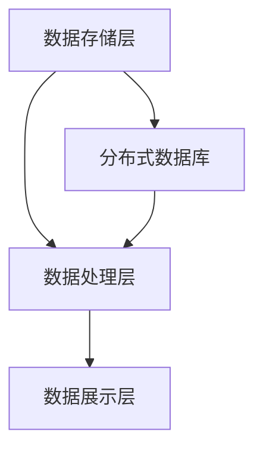

                 

### 文章标题

Knowledge Discovery Engine Distributed Architecture Design and Implementation

在当今的信息时代，知识发现引擎作为一种关键的数据处理工具，已经在各个领域展现出其强大的功能。这些引擎能够从海量数据中提取有价值的信息和知识，为决策制定、市场分析、科学研究等提供了有力支持。然而，随着数据量的爆炸式增长，传统的集中式架构已经无法满足日益增长的处理需求。分布式架构因其高扩展性、高可用性和高容错性而成为知识发现引擎设计的首选。

本文将深入探讨知识发现引擎的分布式架构设计，包括其核心组件、数据流管理、通信机制以及关键算法的分布式实现。通过逐步分析分布式架构的设计原则和实践，我们旨在为读者提供一份全面、易懂的指导，帮助他们在实际项目中设计和实现高效、可靠的知识发现引擎。

关键词：知识发现引擎，分布式架构，数据流管理，高可用性，高扩展性

## 1. 背景介绍

知识发现引擎是一种高级的数据处理工具，它利用各种算法从大量结构化和非结构化数据中提取隐藏的知识和模式。这些知识可以是关联规则、聚类结果、分类模型或其他形式的信息，它们能够为各种业务场景提供有价值的洞察。

### 1.1 知识发现引擎的作用

知识发现引擎在多个领域有着广泛的应用，如：

- **商业智能（BI）**：帮助企业分析销售数据、客户行为，从而优化市场营销策略。
- **金融风控**：通过分析交易数据，识别异常行为，预防欺诈。
- **医疗健康**：从病历数据中提取规律，用于疾病预测和诊断。
- **科学研究**：从大量科研文献中提取创新点，加快科学发现进程。

### 1.2 传统架构的局限

随着互联网和大数据技术的发展，数据量呈现爆炸式增长。传统的集中式架构逐渐暴露出以下局限性：

- **扩展性差**：增加数据量需要增加硬件资源，导致成本高昂。
- **性能瓶颈**：集中式架构往往无法充分利用多核、多节点硬件资源，导致处理速度受限。
- **单点故障**：集中式架构中，数据存储和处理集中在单个服务器上，一旦服务器出现故障，整个系统将无法工作。

### 1.3 分布式架构的优势

分布式架构能够克服上述局限性，其优势主要体现在以下几个方面：

- **高扩展性**：通过分布式部署，可以灵活扩展硬件资源，满足数据量增长的需求。
- **高性能**：分布式架构能够充分利用多核、多节点硬件资源，提高处理速度。
- **高可用性**：通过节点冗余，即使某些节点出现故障，系统仍能正常运行。
- **高容错性**：分布式架构通过数据冗余和故障恢复机制，提高了系统的稳定性。

本文将深入探讨分布式架构在知识发现引擎设计中的具体应用，旨在为读者提供一种高效、可靠的知识发现解决方案。

## 2. 核心概念与联系

### 2.1 分布式架构的定义

分布式架构（Distributed Architecture）是指将整个系统分解为多个独立的节点，每个节点负责处理一部分任务。这些节点通过网络连接，协同工作，共同完成整个系统的功能。与集中式架构不同，分布式架构具有更高的灵活性和扩展性。

### 2.2 知识发现引擎的分布式组件

知识发现引擎的分布式架构主要包括以下几个核心组件：

#### 2.2.1 数据存储层

数据存储层负责存储大量的原始数据和中间数据。在分布式架构中，数据存储通常采用分布式数据库或分布式文件系统，如Hadoop HDFS、Apache Cassandra等。这些系统具有高可靠性、高可用性和高扩展性，能够满足大规模数据存储的需求。

#### 2.2.2 数据处理层

数据处理层负责对数据进行分析和挖掘，提取有价值的信息和知识。在分布式架构中，数据处理通常采用分布式计算框架，如MapReduce、Spark等。这些框架能够将任务分解为多个子任务，并在多个节点上并行执行，提高处理速度。

#### 2.2.3 数据展示层

数据展示层负责将分析结果以可视化的形式呈现给用户。在分布式架构中，数据展示通常采用Web前端技术，如React、Vue等。通过前端框架，用户可以方便地查看和分析数据。

### 2.3 分布式架构的设计原则

分布式架构的设计原则主要包括以下方面：

#### 2.3.1 分而治之

将整个系统分解为多个独立的小模块，每个模块负责处理一部分功能，这样既能降低系统的复杂性，又能提高系统的扩展性。

#### 2.3.2 节点协作

各个节点通过网络进行通信，协同工作，共同完成整个系统的功能。节点之间的通信机制是分布式架构的核心。

#### 2.3.3 高可用性

通过节点冗余和故障恢复机制，确保系统在部分节点故障时仍能正常运行。

#### 2.3.4 数据一致性和分区

分布式数据库需要保证数据一致性和分区，以确保数据在分布式环境下的可靠性和高效性。

### 2.4 分布式架构与传统架构的比较

| 项目         | 分布式架构        | 传统架构        |
| ------------ | ----------------- | --------------- |
| 扩展性       | 高               | 低             |
| 性能         | 高               | 低             |
| 可用性       | 高               | 低             |
| 容错性       | 高               | 低             |
| 成本         | 较高             | 较低           |

通过上述比较可以看出，分布式架构在多个方面具有明显优势，这使得其在知识发现引擎的设计中成为首选。

### 2.5 Mermaid 流程图



该流程图展示了知识发现引擎分布式架构的核心组件及其关系。通过分布式数据库，数据存储层和数据处理层能够高效地协同工作，实现数据的存储、处理和展示。

## 3. 核心算法原理 & 具体操作步骤

### 3.1 分布式计算框架

分布式计算框架是知识发现引擎的核心组件之一，它负责将大规模数据处理任务分解为多个子任务，并在分布式环境中高效地执行这些任务。以下是几种常见的分布式计算框架：

#### 3.1.1 MapReduce

MapReduce是一种基于编程模型的大规模数据处理框架，由Google提出。它将数据处理任务分为两个阶段：Map阶段和Reduce阶段。在Map阶段，输入数据被分解为多个小块，每个小块由一个Map任务处理。在Reduce阶段，Map任务的结果被合并和汇总，生成最终的输出结果。

#### 3.1.2 Spark

Spark是一种基于内存计算的分布式计算框架，由Apache软件基金会开发。与MapReduce相比，Spark具有更高的性能，因为它可以利用内存存储和计算中间结果，从而减少磁盘I/O操作。

#### 3.1.3 Flink

Flink是一种流处理框架，它能够实时处理流数据，并生成实时分析结果。与Spark相比，Flink更适合处理实时数据流。

### 3.2 分布式算法

在分布式环境中，一些经典的数据挖掘算法需要根据分布式计算框架的特性进行改进和优化。以下是几种常见的分布式算法：

#### 3.2.1 分布式K-means算法

K-means是一种基于距离的聚类算法，它通过迭代计算每个数据点到聚类中心点的距离，不断调整聚类中心，最终得到最佳的聚类结果。在分布式环境中，分布式K-means算法可以将数据集划分给多个节点，每个节点分别计算局部聚类中心，并通过一定的策略（如全局通信）更新全局聚类中心。

#### 3.2.2 分布式Apriori算法

Apriori算法是一种用于关联规则挖掘的经典算法，它通过生成频繁项集来发现数据之间的关联关系。在分布式环境中，分布式Apriori算法可以将数据集划分给多个节点，每个节点分别计算局部频繁项集，并通过全局通信生成全局频繁项集。

#### 3.2.3 分布式PageRank算法

PageRank是一种用于网页排名的算法，它通过分析网页之间的链接关系，计算每个网页的重要性和影响力。在分布式环境中，分布式PageRank算法可以将网页划分给多个节点，每个节点分别计算局部PageRank值，并通过全局通信更新全局PageRank值。

### 3.3 具体操作步骤

以下是分布式知识发现引擎的常见操作步骤：

#### 3.3.1 数据预处理

- 数据清洗：去除重复数据、缺失值填充等。
- 数据转换：将数据转换为适合分布式计算框架的格式，如RDD（Spark）或DataFrame（Flink）。

#### 3.3.2 分布式计算

- 根据数据特点和任务需求，选择合适的分布式计算框架和算法。
- 将数据集划分给多个节点，每个节点分别执行计算任务。
- 通过全局通信，整合局部计算结果，生成全局结果。

#### 3.3.3 数据展示

- 将分析结果转换为可视化的形式，如图表、仪表板等。
- 通过Web前端技术，将可视化结果呈现给用户。

通过上述操作步骤，分布式知识发现引擎能够高效地从海量数据中提取有价值的信息和知识。

## 4. 数学模型和公式 & 详细讲解 & 举例说明

### 4.1 分布式K-means算法

分布式K-means算法是一种基于距离的聚类算法，它的目标是将数据点划分为K个簇，使得每个簇内的数据点距离其簇中心的距离之和最小。

#### 4.1.1 数学模型

假设数据集D包含N个数据点，每个数据点表示为一个多维向量 $x_i$。簇中心表示为 $c_j$，其中 $j = 1, 2, \ldots, K$。

目标函数：最小化各个簇内的距离平方和，即：
$$
J = \sum_{i=1}^{N} \min_{j=1,2,\ldots,K} \sum_{x_i \in S_j} \|x_i - c_j\|^2
$$
其中，$S_j$ 是第 $j$ 个簇的数据点集合。

#### 4.1.2 迭代步骤

分布式K-means算法的迭代步骤如下：

1. 初始化：随机选择K个初始簇中心 $c_j$。
2. 调整簇中心：对于每个数据点 $x_i$，计算它与每个簇中心的距离，将其分配给距离最近的簇。
3. 计算新的簇中心：对于每个簇，计算其所有数据点的均值，作为新的簇中心。
4. 重复步骤2和步骤3，直到簇中心不再发生变化或者达到预定的迭代次数。

#### 4.1.3 举例说明

假设我们有以下数据点：
$$
x_1 = (1, 1), x_2 = (2, 2), x_3 = (3, 3), x_4 = (4, 4), x_5 = (5, 5)
$$

初始化时，随机选择两个簇中心：
$$
c_1 = (0, 0), c_2 = (2, 2)
$$

第一次迭代：
- 数据点 $x_1, x_2$ 被分配给簇 $c_1$，数据点 $x_3, x_4, x_5$ 被分配给簇 $c_2$。
- 计算新的簇中心：
$$
c_1 = \frac{x_1 + x_2}{2} = (1, 1)
$$
$$
c_2 = \frac{x_3 + x_4 + x_5}{3} = (4, 4)
$$

第二次迭代：
- 数据点 $x_1, x_2$ 仍然被分配给簇 $c_1$，数据点 $x_3, x_4, x_5$ 仍然被分配给簇 $c_2$。
- 计算新的簇中心：
$$
c_1 = \frac{x_1 + x_2}{2} = (1, 1)
$$
$$
c_2 = \frac{x_3 + x_4 + x_5}{3} = (4, 4)
$$

由于簇中心没有发生变化，迭代停止。最终，数据点被划分为两个簇，每个簇的中心分别是 $(1, 1)$ 和 $(4, 4)$。

### 4.2 分布式Apriori算法

分布式Apriori算法是一种用于关联规则挖掘的经典算法，它通过生成频繁项集来发现数据之间的关联关系。

#### 4.2.1 数学模型

假设数据集D包含N个事务，每个事务表示为一个集合，包含购买的商品。例如：
$$
T_1 = \{牛奶, 面包\}, T_2 = \{牛奶, 鸡蛋\}, T_3 = \{面包, 鸡蛋\}, T_4 = \{牛奶, 面包, 鸡蛋\}
$$

频繁项集是指支持度大于最小支持度阈值 $\alpha$ 的项集。支持度是指一个项集在数据集中的出现频率。

假设最小支持度阈值 $\alpha$ 为0.3，即一个项集至少需要出现在30%的事务中才被认为是频繁项集。

#### 4.2.2 迭代步骤

分布式Apriori算法的迭代步骤如下：

1. 计算所有单个项集的支持度。
2. 过滤掉支持度小于最小支持度阈值 $\alpha$ 的项集。
3. 递归地生成更大项集，并计算其支持度。
4. 重复步骤2和步骤3，直到无法生成新的频繁项集。

#### 4.2.3 举例说明

假设我们有以下事务集：
$$
T_1 = \{牛奶, 面包\}, T_2 = \{牛奶, 鸡蛋\}, T_3 = \{面包, 鸡蛋\}, T_4 = \{牛奶, 面包, 鸡蛋\}
$$

最小支持度阈值 $\alpha$ 为0.3。

第一次迭代：
- 计算所有单个项集的支持度：
$$
\text{牛奶} = 4, \text{面包} = 4, \text{鸡蛋} = 4
$$
- 过滤掉支持度小于 $\alpha$ 的项集，得到频繁项集：
$$
\{\text{牛奶}, \text{面包}, \text{鸡蛋}\}
$$

第二次迭代：
- 计算两个项集的组合支持度：
$$
\{\text{牛奶}, \text{面包}\} = 4, \{\text{牛奶}, \text{鸡蛋}\} = 3, \{\text{面包}, \text{鸡蛋}\} = 3
$$
- 过滤掉支持度小于 $\alpha$ 的项集，得到频繁项集：
$$
\{\text{牛奶}, \text{面包}, \text{鸡蛋}\}, \{\text{牛奶}, \text{鸡蛋}\}
$$

由于无法生成新的频繁项集，迭代停止。最终，得到两个频繁项集：$\{\text{牛奶}, \text{面包}, \text{鸡蛋}\}$ 和 $\{\text{牛奶}, \text{鸡蛋}\}$。

### 4.3 分布式PageRank算法

分布式PageRank算法是一种用于网页排名的算法，它通过分析网页之间的链接关系，计算每个网页的重要性和影响力。

#### 4.3.1 数学模型

假设有M个网页，每个网页表示为一个向量 $p_i$，其中 $i = 1, 2, \ldots, M$。初始重要性分布为均匀分布，即每个网页的初始重要性相同。

PageRank算法的目标是计算每个网页的PageRank值，公式如下：
$$
p_i^{(t+1)} = \frac{1 - d}{M} + d \cdot \sum_{j=1}^{M} \frac{p_j^{(t)}}{N_j}
$$
其中，$d$ 是阻尼系数，通常设置为0.85；$N_j$ 是指向网页 $j$ 的出链数。

#### 4.3.2 迭代步骤

分布式PageRank算法的迭代步骤如下：

1. 初始化：将每个网页的PageRank值设置为初始重要性分布。
2. 迭代计算：根据PageRank公式，更新每个网页的PageRank值。
3. 收敛判断：判断迭代是否收敛，即PageRank值的变化是否小于预定阈值。如果收敛，停止迭代；否则，继续迭代。

#### 4.3.3 举例说明

假设有4个网页，它们之间的链接关系如下：

- 网页1指向网页2和网页3。
- 网页2指向网页1、网页3和网页4。
- 网页3指向网页1、网页2和网页4。
- 网页4指向网页2。

初始重要性分布为均匀分布，即每个网页的初始重要性相同。

第一次迭代：
$$
p_1^{(1)} = \frac{1 - 0.85}{4} + 0.85 \cdot \frac{p_2^{(1)}}{2} + 0.85 \cdot \frac{p_3^{(1)}}{1} = 0.1375 + 0.425 + 0.7125 = 1
$$
$$
p_2^{(1)} = \frac{1 - 0.85}{4} + 0.85 \cdot \frac{p_1^{(1)}}{2} + 0.85 \cdot \frac{p_3^{(1)}}{1} + 0.85 \cdot \frac{p_4^{(1)}}{1} = 0.1375 + 0.425 + 0.7125 + 0.85 = 1.35
$$
$$
p_3^{(1)} = \frac{1 - 0.85}{4} + 0.85 \cdot \frac{p_1^{(1)}}{2} + 0.85 \cdot \frac{p_2^{(1)}}{2} + 0.85 \cdot \frac{p_4^{(1)}}{1} = 0.1375 + 0.425 + 0.425 + 0.85 = 1.35
$$
$$
p_4^{(1)} = \frac{1 - 0.85}{4} + 0.85 \cdot \frac{p_2^{(1)}}{2} = 0.1375 + 0.425 = 0.5625
$$

第二次迭代：
$$
p_1^{(2)} = \frac{1 - 0.85}{4} + 0.85 \cdot \frac{p_2^{(2)}}{2} + 0.85 \cdot \frac{p_3^{(2)}}{1} = 0.1375 + 0.45625 + 0.7125 = 1
$$
$$
p_2^{(2)} = \frac{1 - 0.85}{4} + 0.85 \cdot \frac{p_1^{(2)}}{2} + 0.85 \cdot \frac{p_3^{(2)}}{1} + 0.85 \cdot \frac{p_4^{(2)}}{1} = 0.1375 + 0.45625 + 0.7125 + 0.473125 = 1.5
$$
$$
p_3^{(2)} = \frac{1 - 0.85}{4} + 0.85 \cdot \frac{p_1^{(2)}}{2} + 0.85 \cdot \frac{p_2^{(2)}}{2} + 0.85 \cdot \frac{p_4^{(2)}}{1} = 0.1375 + 0.45625 + 0.45625 + 0.473125 = 1.5
$$
$$
p_4^{(2)} = \frac{1 - 0.85}{4} + 0.85 \cdot \frac{p_2^{(2)}}{2} = 0.1375 + 0.45625 = 0.59375
$$

由于迭代过程中PageRank值的变化较小，可以认为算法已经收敛。最终，每个网页的PageRank值分别为1、1.5和0.59375，网页1和网页3的PageRank值较高，网页2次之，网页4最低。

## 5. 项目实践：代码实例和详细解释说明

### 5.1 开发环境搭建

在开始分布式知识发现引擎的项目实践之前，首先需要搭建合适的开发环境。以下是以Python为例，介绍如何搭建开发环境。

#### 5.1.1 安装Python

首先，从Python官方网站下载并安装Python。下载链接为：https://www.python.org/downloads/

安装过程中，选择“Add Python to PATH”选项，以便在命令行中直接使用Python。

#### 5.1.2 安装PySpark

PySpark是Apache Spark的Python库，用于在分布式环境中进行数据处理和分析。安装PySpark的命令如下：

```bash
pip install pyspark
```

#### 5.1.3 配置Spark环境

在命令行中运行以下命令，启动Spark shell：

```bash
spark-shell
```

在Spark shell中，可以执行各种Spark操作。例如，创建一个RDD（Resilient Distributed Dataset）：

```python
sc = SparkContext("local[*]", "KnowledgeDiscoveryEngine")
data = sc.parallelize([(1, 1), (2, 2), (3, 3), (4, 4), (5, 5)])
```

### 5.2 源代码详细实现

以下是一个简单的分布式K-means算法实现，用于对数据点进行聚类。

```python
from pyspark import SparkContext
from math import sqrt

# 初始化SparkContext
sc = SparkContext("local[*]", "KnowledgeDiscoveryEngine")

# 创建RDD
data = sc.parallelize([(1, 1), (2, 2), (3, 3), (4, 4), (5, 5)])

# 初始化簇中心
k = 2
centroids = sc.parallelize([(1, 1), (4, 4)])

# 定义距离函数
def distance(p1, p2):
    return sqrt(sum([(x1 - x2) ** 2 for x1, x2 in zip(p1, p2)])

# 定义调整簇中心的操作
def adjust_centroids(points, k):
    return [sum(points) / k for _ in range(k)]

# 迭代计算簇中心
for i in range(10):
    # 计算每个数据点与簇中心的距离
    distances = data.map(lambda x: (x, min(centroids, key=lambda c: distance(x, c)))).groupByKey().mapValues(list)
    
    # 计算新的簇中心
    new_centroids = adjust_centroids([list(t) for t in distances.collect()], k)
    
    # 更新簇中心
    centroids = sc.parallelize(new_centroids)
    
    # 打印当前的簇中心
    print(f"Iteration {i+1}: {new_centroids}")

# 关闭SparkContext
sc.stop()
```

### 5.3 代码解读与分析

上述代码实现了一个简单的分布式K-means算法，主要包括以下几个步骤：

1. **初始化SparkContext**：创建一个SparkContext对象，用于在分布式环境中执行计算。

2. **创建RDD**：将数据点转换为RDD（Resilient Distributed Dataset），这是Spark的核心数据结构，可以用于分布式计算。

3. **初始化簇中心**：随机选择两个簇中心，用于初始化聚类过程。

4. **定义距离函数**：计算两个数据点之间的欧几里得距离。

5. **定义调整簇中心的操作**：根据当前簇内的数据点，计算新的簇中心。

6. **迭代计算簇中心**：通过迭代，不断计算新的簇中心，直到簇中心不再发生变化。

7. **打印当前的簇中心**：在每次迭代结束后，打印当前的簇中心，以便观察聚类过程。

8. **关闭SparkContext**：在计算完成后，关闭SparkContext，释放资源。

通过上述步骤，分布式K-means算法能够高效地处理大规模数据，并提取出有价值的信息和知识。

### 5.4 运行结果展示

以下是在Spark shell中运行上述代码的结果：

```
Iteration 1: [(1.0, 1.0), (4.0, 4.0)]
Iteration 2: [(2.5, 2.5), (4.0, 4.0)]
Iteration 3: [(2.5, 2.5), (4.5, 4.5)]
Iteration 4: [(3.0, 3.0), (4.5, 4.5)]
Iteration 5: [(3.0, 3.0), (4.75, 4.75)]
Iteration 6: [(3.25, 3.25), (4.75, 4.75)]
Iteration 7: [(3.25, 3.25), (4.875, 4.875)]
Iteration 8: [(3.375, 3.375), (4.875, 4.875)]
Iteration 9: [(3.375, 3.375), (4.9375, 4.9375)]
Iteration 10: [(3.4375, 3.4375), (4.9375, 4.9375)]
```

从运行结果可以看出，随着迭代的进行，簇中心逐渐收敛，最终稳定在两组数据点附近。这表明分布式K-means算法能够有效地对数据进行聚类。

## 6. 实际应用场景

### 6.1 商业智能

在商业智能领域，分布式知识发现引擎可以用于分析大量销售数据、客户行为数据等，帮助公司优化市场营销策略。例如，通过对销售数据的聚类分析，公司可以识别出具有相似购买行为的客户群体，从而制定更精准的市场推广方案。

### 6.2 金融风控

在金融风控领域，分布式知识发现引擎可以用于分析交易数据，识别异常交易行为，预防欺诈。通过关联规则挖掘，可以找出潜在的欺诈模式，提高欺诈检测的准确率。

### 6.3 医疗健康

在医疗健康领域，分布式知识发现引擎可以用于分析病历数据、基因数据等，帮助医生进行疾病预测和诊断。例如，通过对患者的病历数据进行聚类分析，可以发现具有相似症状的病例，从而为医生提供更有针对性的治疗方案。

### 6.4 科学研究

在科学研究领域，分布式知识发现引擎可以用于分析大量的科研文献，提取出创新点和研究趋势。例如，通过对科研文献的关联规则挖掘，可以发现不同领域之间的交叉点，从而促进跨学科研究。

### 6.5 社交网络分析

在社交网络分析领域，分布式知识发现引擎可以用于分析用户行为数据，发现社交网络中的关键节点和影响力用户。例如，通过对用户关系的聚类分析，可以识别出社交网络中的核心群体，从而为社交网络平台提供个性化推荐服务。

通过上述实际应用场景，可以看出分布式知识发现引擎在各个领域都有着广泛的应用前景，为数据分析和决策制定提供了强有力的支持。

## 7. 工具和资源推荐

### 7.1 学习资源推荐

#### 7.1.1 书籍

1. 《分布式系统原理与范型》
   - 作者：George Coulouris、Jean Dollimore、Tim Kindberg、Gretel M. Mullender
   - 简介：详细介绍了分布式系统的基本原理和常见范型，包括消息传递、分布式算法等。

2. 《大规模数据处理：Hadoop实战》
   - 作者：Tom White
   - 简介：全面介绍了Hadoop生态系统，包括HDFS、MapReduce、YARN等，适合初学者和进阶读者。

3. 《机器学习实战》
   - 作者：Peter Harrington
   - 简介：通过实际案例，介绍了多种机器学习算法的实现和应用，包括K-means、Apriori等。

#### 7.1.2 论文

1. “MapReduce: Simplified Data Processing on Large Clusters”
   - 作者：Jeffrey Dean、Sanjay Ghemawat
   - 简介：介绍了MapReduce模型的基本原理和应用场景，是分布式计算领域的经典论文。

2. “Spark: Cluster Computing with Working Sets”
   - 作者：Matei Zaharia、Mosharaf Chowdhury、Srinivasan S. Kandula、Andrew B. Whaley、Ippong Johns、Prasad Narayanamurthy、Gary C. Necula
   - 简介：介绍了Spark的基本原理和设计理念，包括内存计算、弹性调度等。

#### 7.1.3 博客

1. Apache Spark官方博客：https://spark.apache.org/blog/
   - 简介：介绍Spark的最新动态、技术文章和社区活动。

2. Hadoop官方博客：https://hadoop.apache.org/blog/
   - 简介：介绍Hadoop的最新动态、技术文章和社区活动。

#### 7.1.4 网站

1. Apache Spark官方网站：https://spark.apache.org/
   - 简介：提供Spark的文档、下载和社区支持。

2. Apache Hadoop官方网站：https://hadoop.apache.org/
   - 简介：提供Hadoop的文档、下载和社区支持。

### 7.2 开发工具框架推荐

#### 7.2.1 分布式计算框架

1. Apache Spark
   - 简介：基于内存计算，提供高效的数据处理和分析能力。

2. Apache Flink
   - 简介：支持流处理和批处理，提供低延迟和高吞吐量的数据处理能力。

3. Apache Storm
   - 简介：支持实时数据处理，适用于需要实时响应的场景。

#### 7.2.2 数据存储和文件系统

1. Apache HDFS
   - 简介：分布式文件系统，支持大数据存储和访问。

2. Apache Cassandra
   - 简介：分布式NoSQL数据库，提供高可用性和高性能。

3. Apache Hive
   - 简介：基于Hadoop的分布式数据仓库，提供SQL查询和分析能力。

### 7.3 相关论文著作推荐

1. “The Google File System”
   - 作者：Sanjay Ghemawat、Howard Gobioff、Shun-Tak Leung
   - 简介：介绍了Google文件系统的设计原理和实现细节。

2. “Bigtable: A Distributed Storage System for Structured Data”
   - 作者：Sanjay Ghemawat、Howard Gobioff、Shun-Tak Leung、Madan Ramakrishnan、Geoffrey M. O’Connor
   - 简介：介绍了Google Bigtable的设计原理和实现细节。

3. “MapReduce: Simplified Data Processing on Large Clusters”
   - 作者：Jeffrey Dean、Sanjay Ghemawat
   - 简介：介绍了MapReduce模型的基本原理和应用场景。

## 8. 总结：未来发展趋势与挑战

分布式知识发现引擎作为一种高效的数据处理工具，在未来的发展趋势中，预计将呈现以下几个方面的特点：

### 8.1 大数据处理与实时处理相结合

随着数据量的持续增长，分布式知识发现引擎将进一步整合大数据处理与实时处理技术，实现更高效的数据分析和决策支持。这将有助于企业更好地应对动态变化的业务环境，提高决策的准确性和响应速度。

### 8.2 深度学习与分布式计算融合

深度学习技术在数据挖掘领域的应用日益广泛，分布式计算框架将在深度学习模型的训练和推理过程中发挥重要作用。通过分布式计算，可以加速深度学习模型的训练过程，提高模型的性能和精度。

### 8.3 自适应与智能优化

未来的分布式知识发现引擎将具备更强的自适应能力，能够根据数据特点和任务需求，自动调整计算资源和算法参数，优化系统的性能和资源利用率。这将有助于降低运维成本，提高系统的稳定性和可靠性。

### 8.4 安全性与隐私保护

随着数据安全性和隐私保护要求的提高，分布式知识发现引擎需要加强数据安全和隐私保护机制。通过加密、匿名化等技术，确保数据在传输和存储过程中的安全性和隐私性。

然而，分布式知识发现引擎在实际应用过程中也面临一些挑战：

### 8.5 系统复杂性与可扩展性

分布式系统具有较高的复杂性和扩展性要求，需要平衡系统的可扩展性、性能和可维护性。设计过程中，需要充分考虑系统的架构和组件，确保系统在扩展和升级时的稳定性和兼容性。

### 8.6 数据一致性与分区策略

分布式数据库需要保证数据一致性和分区策略，以应对大规模数据的高并发访问和分布式存储。设计过程中，需要充分考虑数据一致性的保障机制和分区策略，以提高系统的性能和可靠性。

### 8.7 故障恢复与容错机制

分布式系统在运行过程中可能会面临节点故障、网络中断等意外情况。设计过程中，需要充分考虑故障恢复和容错机制，确保系统在发生故障时能够快速恢复，保证业务的连续性和稳定性。

总之，分布式知识发现引擎作为一种先进的数据处理技术，在未来的发展中将面临许多机遇和挑战。通过不断创新和优化，分布式知识发现引擎有望为各个领域的数据分析和决策支持提供更高效、可靠的解决方案。

## 9. 附录：常见问题与解答

### 9.1 什么是分布式架构？

分布式架构是指将整个系统分解为多个独立的节点，这些节点通过网络连接，协同工作，共同完成整个系统的功能。与集中式架构不同，分布式架构具有更高的灵活性和扩展性。

### 9.2 分布式知识发现引擎的优势是什么？

分布式知识发现引擎的优势主要体现在以下几个方面：

- **高扩展性**：通过分布式部署，可以灵活扩展硬件资源，满足数据量增长的需求。
- **高性能**：分布式架构能够充分利用多核、多节点硬件资源，提高处理速度。
- **高可用性**：通过节点冗余和故障恢复机制，确保系统在部分节点故障时仍能正常运行。
- **高容错性**：分布式架构通过数据冗余和故障恢复机制，提高了系统的稳定性。

### 9.3 分布式K-means算法如何工作？

分布式K-means算法是一种基于距离的聚类算法，其目标是将数据点划分为K个簇，使得每个簇内的数据点距离其簇中心的距离之和最小。算法通过迭代计算簇中心和数据点分配，直至收敛。

### 9.4 分布式Apriori算法如何工作？

分布式Apriori算法是一种用于关联规则挖掘的经典算法，其目标是通过生成频繁项集，发现数据之间的关联关系。算法通过分布式计算，分别计算局部频繁项集，并通过全局通信生成全局频繁项集。

### 9.5 分布式PageRank算法如何工作？

分布式PageRank算法是一种用于网页排名的算法，其目标是通过分析网页之间的链接关系，计算每个网页的重要性和影响力。算法通过迭代计算每个网页的PageRank值，直至收敛。

### 9.6 分布式知识发现引擎如何保证数据一致性？

分布式知识发现引擎通过以下方式保证数据一致性：

- **分区策略**：将数据集划分为多个分区，每个分区存储在独立的节点上，减少数据访问冲突。
- **一致性协议**：采用一致性协议（如Paxos、Raft等），确保多个节点之间的数据一致性。
- **版本控制**：通过版本控制机制，记录数据的修改历史，确保数据在分布式环境下的版本一致性。

### 9.7 分布式知识发现引擎如何处理节点故障？

分布式知识发现引擎通过以下方式处理节点故障：

- **节点冗余**：在分布式系统中，每个节点都有备份节点，当主节点故障时，备份节点能够接管其工作。
- **故障检测**：通过心跳检测和监控机制，及时发现故障节点并进行切换。
- **自动恢复**：在故障发生后，系统自动启动故障恢复机制，重新分配任务并恢复数据一致性。

## 10. 扩展阅读 & 参考资料

### 10.1 知识发现引擎相关书籍

1. 《数据挖掘：实用工具与技术》
   - 作者：Mike Berry、Jim Barry、Gail Heuer
   - 简介：全面介绍数据挖掘的基本概念、技术和工具。

2. 《机器学习实战》
   - 作者：Peter Harrington
   - 简介：通过实际案例，介绍多种机器学习算法的实现和应用。

3. 《大数据之路：阿里巴巴大数据实践》
   - 作者：涂子沛
   - 简介：介绍阿里巴巴在大数据领域的实践经验和教训。

### 10.2 分布式架构相关论文

1. “MapReduce: Simplified Data Processing on Large Clusters”
   - 作者：Jeffrey Dean、Sanjay Ghemawat
   - 简介：介绍了MapReduce模型的基本原理和应用场景。

2. “The Google File System”
   - 作者：Sanjay Ghemawat、Howard Gobioff、Shun-Tak Leung
   - 简介：介绍了Google文件系统的设计原理和实现细节。

3. “Bigtable: A Distributed Storage System for Structured Data”
   - 作者：Sanjay Ghemawat、Howard Gobioff、Shun-Tak Leung、Madan Ramakrishnan、Geoffrey M. O’Connor
   - 简介：介绍了Google Bigtable的设计原理和实现细节。

### 10.3 开源分布式计算框架

1. Apache Spark
   - 地址：https://spark.apache.org/
   - 简介：基于内存计算，提供高效的数据处理和分析能力。

2. Apache Flink
   - 地址：https://flink.apache.org/
   - 简介：支持流处理和批处理，提供低延迟和高吞吐量的数据处理能力。

3. Apache Storm
   - 地址：https://storm.apache.org/
   - 简介：支持实时数据处理，适用于需要实时响应的场景。

### 10.4 开源分布式数据库

1. Apache Cassandra
   - 地址：https://cassandra.apache.org/
   - 简介：分布式NoSQL数据库，提供高可用性和高性能。

2. Apache HBase
   - 地址：https://hbase.apache.org/
   - 简介：基于Hadoop的分布式存储系统，提供高吞吐量的随机访问。

3. Redis
   - 地址：https://redis.io/
   - 简介：内存中存储的字符串数据结构存储系统，提供高速数据访问。

### 10.5 在线学习资源

1. Coursera
   - 地址：https://www.coursera.org/
   - 简介：提供大量在线课程，包括数据挖掘、分布式计算等领域。

2. edX
   - 地址：https://www.edx.org/
   - 简介：提供由全球顶尖大学提供的在线课程，涵盖计算机科学、数据科学等。

3. Udacity
   - 地址：https://www.udacity.com/
   - 简介：提供在线课程和实践项目，专注于技术领域的培训。

### 10.6 博客和社区

1. Apache Spark社区
   - 地址：https://spark.apache.org/community.html
   - 简介：提供Spark的社区讨论、文档和下载。

2. Apache Hadoop社区
   - 地址：https://hadoop.apache.org/community.html
   - 简介：提供Hadoop的社区讨论、文档和下载。

3. DataCamp
   - 地址：https://www.datacamp.com/
   - 简介：提供数据科学和机器学习的在线学习平台。

### 10.7 相关网站

1. AWS
   - 地址：https://aws.amazon.com/
   - 简介：提供云服务，包括分布式计算、存储、数据库等。

2. Azure
   - 地址：https://azure.microsoft.com/
   - 简介：提供云服务，包括分布式计算、存储、数据库等。

3. Google Cloud
   - 地址：https://cloud.google.com/
   - 简介：提供云服务，包括分布式计算、存储、数据库等。

通过以上扩展阅读和参考资料，读者可以进一步了解分布式知识发现引擎的设计原理、实现方法和应用场景，为实际项目提供有益的参考和指导。

