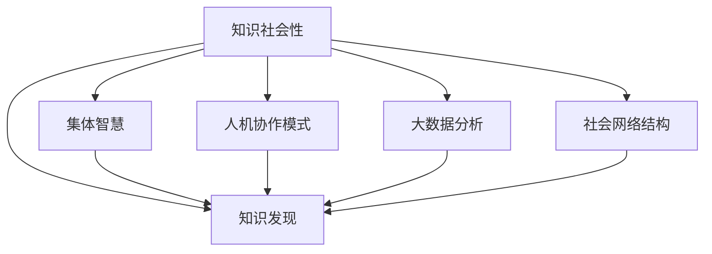

                 

### 知识的社会性：集体智慧与知识发现

#### 关键词：
1. 知识社会性
2. 集体智慧
3. 知识发现
4. 人机协作
5. 大数据
6. 社交网络
7. 计算机科学

#### 摘要：
在数字化时代，知识的社会性已成为推动科技进步和创新的重要力量。本文探讨了知识的社会性概念，以及集体智慧在知识发现中的作用。通过分析人机协作模式、大数据分析和社会网络结构，我们揭示了知识的社会性如何影响知识的创造和传播。文章旨在为读者提供一个关于知识社会性的全面理解，并探讨未来发展的趋势和挑战。

## 1. 背景介绍（Background Introduction）

在过去的几十年里，计算机科学和信息技术取得了飞速发展，极大地改变了我们的生活方式和工作方式。随着互联网的普及和大数据技术的兴起，人类对信息的获取、处理和利用能力达到了前所未有的高度。然而，信息技术的发展不仅仅是一个技术进步的过程，更是社会变革的一部分。知识的社会性，即知识在人与人之间的交互和合作中产生和传播的特性，已成为现代信息社会的一个重要特征。

知识的社会性不仅仅体现在知识的共享和传播上，还体现在知识的创造过程中。在传统的知识生产模式中，知识的创造主要依赖于个体专家的研究和发现。然而，随着互联网和社交网络的兴起，个体专家的知识创造逐渐演变为集体智慧的结果。集体智慧通过人与人之间的协作和交流，实现了知识的聚合、整合和创新。这种模式不仅提高了知识的生产效率，也扩大了知识的边界，为人类社会的进步提供了新的动力。

本文将围绕知识的社会性这一核心主题，探讨集体智慧与知识发现之间的关系。我们将从人机协作模式、大数据分析和社会网络结构三个方面进行分析，揭示知识的社会性如何影响知识的创造和传播。文章的其余部分将依次介绍这些主题，并探讨知识社会性的未来发展趋势和挑战。

## 2. 核心概念与联系（Core Concepts and Connections）

要深入理解知识的社会性，首先需要明确一些核心概念，包括集体智慧、知识发现、人机协作模式、大数据分析和社会网络结构。

### 2.1 集体智慧

集体智慧（Collective Intelligence）是指通过个体之间的协作和交流，实现共同目标和解决问题的一种现象。它不仅仅依赖于个体专家的知识和技能，更强调个体之间的互动和合作。集体智慧的典型特征包括信息共享、协同创新、分布式计算和自主决策。

在计算机科学领域，集体智慧的应用范围非常广泛。例如，在开源软件社区中，开发人员通过协作和共享代码，共同推动软件项目的发展。在科研领域，学者们通过合作研究和共享研究成果，加速了科学发现的进程。此外，在社交媒体平台上，用户通过评论、点赞和分享，共同构建了一个信息共享和传播的生态系统。

### 2.2 知识发现

知识发现（Knowledge Discovery）是指从大量数据中提取出有价值的信息和知识的过程。它通常涉及数据预处理、数据挖掘、机器学习和数据可视化等步骤。知识发现的目标是从海量数据中识别出潜在的模式、趋势和关联，为决策提供支持。

知识发现的过程本质上是一个从数据到知识的转化过程。它不仅依赖于先进的数据处理技术和算法，还依赖于人类专家的智慧和经验。在知识发现过程中，人类专家的角色不仅仅是数据的分析者，更是知识的创造者和传播者。

### 2.3 人机协作模式

人机协作（Human-Computer Collaboration）是指人类与计算机系统共同完成任务的一种模式。在这种模式中，计算机系统提供强大的计算能力和数据处理能力，而人类则利用自身的智慧、经验和创造力，为任务的完成提供指导和支持。

人机协作模式在知识创造和知识传播中发挥着重要作用。例如，在科研领域，研究人员利用计算机系统进行数据分析和模型构建，从而发现新的科学规律和理论。在产品设计过程中，设计师利用计算机辅助设计工具，优化产品功能和外观。此外，在人机协作模式中，计算机系统还可以为人类提供智能化的建议和指导，从而提高工作效率和质量。

### 2.4 大数据分析

大数据分析（Big Data Analytics）是指针对大规模数据集进行高效处理、分析和挖掘的技术和方法。大数据分析的目标是从海量数据中提取有价值的信息和知识，为决策提供支持。

大数据分析技术包括数据采集、数据存储、数据清洗、数据挖掘、机器学习和数据可视化等。这些技术相互配合，共同实现从数据到知识的转化。在大数据分析过程中，计算机系统发挥了关键作用，它不仅能够处理海量数据，还能够通过算法和模型识别出数据中的潜在规律和关联。

### 2.5 社会网络结构

社会网络结构（Social Network Structure）是指个体在社会网络中的相互关系和位置分布。社会网络结构可以通过网络图、矩阵和向量等数学模型进行描述。

社会网络结构对知识的社会性具有重要影响。在社交网络平台上，用户之间的互动和连接构成了一个复杂的社会网络结构。这种结构不仅影响了信息的传播速度和范围，也影响了知识的共享和传播效果。例如，在社交网络平台上，信息通常在紧密的社交关系圈子中快速传播，而在松散的社交关系中传播速度较慢。

### 2.6 关系与联系

上述核心概念之间存在着密切的关系和联系。集体智慧是知识发现的基础，而知识发现则是集体智慧的产物。人机协作模式促进了集体智慧的形成和知识发现的过程。大数据分析为知识发现提供了技术支持，而社会网络结构则影响了知识的传播效果。

通过理解这些核心概念和它们之间的关系，我们可以更好地把握知识的社会性，并探索其在现实世界中的应用。

### 2.7 Mermaid 流程图

以下是一个关于知识社会性的 Mermaid 流程图，展示了各个核心概念之间的相互关系：



通过这个流程图，我们可以更直观地理解知识的社会性是如何通过集体智慧、知识发现、人机协作模式、大数据分析和社会网络结构这些核心概念相互联系和作用的。

## 3. 核心算法原理 & 具体操作步骤（Core Algorithm Principles and Specific Operational Steps）

为了深入理解知识的社会性，我们需要探讨一些核心算法原理，并介绍具体的操作步骤。这些算法涉及人机协作、大数据分析和社会网络分析等关键领域。

### 3.1 人机协作算法

人机协作算法旨在实现计算机系统与人类专家的协同工作，以提高任务完成效率和知识创造力。以下是一个常见的人机协作算法框架：

#### 3.1.1 算法框架

1. **任务定义**：明确任务目标和要求，包括数据来源、数据格式和预期输出。
2. **数据预处理**：对输入数据进行清洗、转换和标准化，以便后续分析。
3. **人机交互**：通过用户界面（UI）与人类专家进行交互，获取专家的意见、建议和决策。
4. **模型训练**：利用专家提供的数据和意见，训练机器学习模型，以实现特定任务的自动化。
5. **模型评估**：评估模型性能，并根据评估结果调整模型参数。
6. **结果反馈**：将模型输出结果展示给人类专家，收集反馈，并用于进一步优化模型。

#### 3.1.2 操作步骤

1. **定义任务**：例如，设计一个自动化文本分类系统，用于对大量新闻文章进行分类。
2. **数据收集**：收集相关领域的新闻文章，并进行预处理，如去除停用词、标点符号和词性标注。
3. **人机交互**：设计一个用户界面，允许人类专家对分类结果进行标注和评估。
4. **模型训练**：利用标注数据训练分类模型，例如使用支持向量机（SVM）或深度神经网络（DNN）。
5. **模型评估**：使用交叉验证方法评估模型性能，并根据评估结果调整模型参数。
6. **结果反馈**：将分类结果展示给人类专家，并收集反馈，用于改进模型。

### 3.2 大数据分析算法

大数据分析算法用于从大规模数据集中提取有价值的信息和知识。以下是一个典型的大数据分析算法流程：

#### 3.2.1 算法框架

1. **数据采集**：从不同的数据源收集数据，如社交媒体、传感器和数据库。
2. **数据预处理**：对采集到的数据进行清洗、转换和集成，以获得高质量的数据集。
3. **特征提取**：从预处理后的数据中提取关键特征，用于后续分析。
4. **模型选择**：选择合适的机器学习模型，如线性回归、决策树或深度学习模型。
5. **模型训练**：使用特征数据和标签数据训练机器学习模型。
6. **模型评估**：评估模型性能，如准确率、召回率和F1分数。
7. **模型优化**：根据评估结果调整模型参数，以提高性能。

#### 3.2.2 操作步骤

1. **数据采集**：例如，从社交媒体平台上收集用户评论和点赞数据。
2. **数据预处理**：清洗数据，如去除噪声、填充缺失值和归一化数据。
3. **特征提取**：提取关键特征，如词频、词嵌入和用户活跃度。
4. **模型选择**：选择合适的文本分类模型，如朴素贝叶斯或长短期记忆网络（LSTM）。
5. **模型训练**：使用训练数据集训练分类模型。
6. **模型评估**：使用测试数据集评估模型性能。
7. **模型优化**：根据评估结果调整模型参数，如调整学习率或正则化参数。

### 3.3 社会网络分析算法

社会网络分析算法用于研究个体在社会网络中的相互关系和影响力。以下是一个常见的社会网络分析算法流程：

#### 3.3.1 算法框架

1. **网络构建**：根据个体之间的互动关系构建社会网络图。
2. **中心性分析**：计算个体在社会网络中的中心性指标，如度数中心性、紧密中心性和中间中心性。
3. **社区检测**：识别社会网络中的社区结构，以了解个体之间的聚类关系。
4. **影响力分析**：评估个体在社会网络中的影响力和传播能力。

#### 3.3.2 操作步骤

1. **网络构建**：例如，从社交媒体平台上收集用户及其互动数据，构建用户网络。
2. **中心性分析**：计算每个用户的度数中心性、紧密中心性和中间中心性，以评估其在网络中的重要性。
3. **社区检测**：使用社区检测算法，如 Girvan-Newman 算法或标签传播算法，识别网络中的社区结构。
4. **影响力分析**：评估每个用户在网络中的影响力，如通过计算其在社区中的传播路径长度和传播强度。

通过上述核心算法原理和具体操作步骤的介绍，我们可以更好地理解知识的社会性如何通过计算机科学技术实现，并为实际应用提供指导。

### 4. 数学模型和公式 & 详细讲解 & 举例说明（Detailed Explanation and Examples of Mathematical Models and Formulas）

为了深入探讨知识的社会性，我们需要介绍一些关键的数学模型和公式，并对其进行详细讲解和举例说明。这些数学模型和公式涉及概率论、统计学、图论和机器学习等领域。

#### 4.1 概率论和统计学

概率论和统计学是理解知识社会性的基础。以下是一些常用的概率分布和统计模型：

##### 4.1.1 贝叶斯定理

贝叶斯定理是一种用于计算条件概率的数学公式。它表示为：

$$
P(A|B) = \frac{P(B|A) \cdot P(A)}{P(B)}
$$

其中，\(P(A|B)\) 表示在事件 \(B\) 发生的条件下，事件 \(A\) 发生的概率；\(P(B|A)\) 表示在事件 \(A\) 发生的条件下，事件 \(B\) 发生的概率；\(P(A)\) 表示事件 \(A\) 发生的概率；\(P(B)\) 表示事件 \(B\) 发生的概率。

贝叶斯定理在知识发现和决策支持中具有重要意义。例如，在信息检索中，贝叶斯定理可以用于计算用户查询与文档之间的相关性，从而提高检索效果。

##### 4.1.2 期望最大化（EM）算法

期望最大化（EM）算法是一种用于估计参数的迭代算法，特别适用于处理不完全数据问题。其基本思想是交替进行期望（E）步骤和最大化（M）步骤：

1. **E步骤**：计算条件期望，即给定当前参数估计值，计算每个未观测数据点的期望值。
2. **M步骤**：最大化似然函数，更新参数估计值。

EM算法广泛应用于数据聚类、隐变量模型估计和机器学习等领域。例如，在K均值聚类算法中，EM算法用于估计簇中心和簇大小。

##### 4.1.3 中心极限定理

中心极限定理指出，当独立同分布随机变量的和趋近于无穷大时，其样本均值趋近于正态分布。该定理在统计学和机器学习中有广泛应用，如用于数据分布估计、假设检验和置信区间计算。

#### 4.2 图论

图论是研究网络结构和关系的数学工具。以下是一些常用的图论模型和算法：

##### 4.2.1 度数中心性

度数中心性（Degree Centrality）是衡量节点在网络中重要性的指标，表示为节点拥有的直接连接数。其计算公式为：

$$
C_d(v) = \sum_{i=1}^{n} \frac{1}{d_i}
$$

其中，\(C_d(v)\) 表示节点 \(v\) 的度数中心性；\(d_i\) 表示节点 \(v\) 的度数。

度数中心性越高，表示节点在网络中的连接数越多，对信息传播和扩散具有重要影响。

##### 4.2.2 紧密中心性

紧密中心性（Closeness Centrality）是衡量节点在网络中紧密程度的指标，表示为节点到其他节点的最短路径长度之和的倒数。其计算公式为：

$$
C_c(v) = \frac{\sum_{u \neq v} d(v, u)}{n - 1}
$$

其中，\(C_c(v)\) 表示节点 \(v\) 的紧密中心性；\(d(v, u)\) 表示节点 \(v\) 到节点 \(u\) 的最短路径长度；\(n\) 表示网络中节点的总数。

紧密中心性越高，表示节点在网络中的路径长度越短，对信息传播速度具有重要影响。

##### 4.2.3 中间中心性

中间中心性（Betweenness Centrality）是衡量节点在网络中连接其他节点能力的指标，表示为节点在所有最短路径中的比例。其计算公式为：

$$
C_b(v) = \frac{\sum_{s \neq v \neq t} \frac{P(s, t) \land v}{P(s, t)} }{n \times (n - 2)}
$$

其中，\(C_b(v)\) 表示节点 \(v\) 的中间中心性；\(P(s, t)\) 表示从节点 \(s\) 到节点 \(t\) 的所有最短路径数；\(n\) 表示网络中节点的总数。

中间中心性越高，表示节点在网络中的连接能力越强，对信息传播和扩散具有重要影响。

#### 4.3 机器学习

机器学习是知识社会性分析的重要工具。以下是一些常用的机器学习模型和算法：

##### 4.3.1 支持向量机（SVM）

支持向量机（Support Vector Machine，SVM）是一种用于分类和回归的监督学习算法。其目标是通过最大化分类边界来提高分类准确性。其基本模型可以表示为：

$$
\max_{\theta} W^T W
$$

其中，\(\theta\) 表示模型参数；\(W\) 表示特征向量。

##### 4.3.2 长短期记忆网络（LSTM）

长短期记忆网络（Long Short-Term Memory，LSTM）是一种用于处理序列数据的循环神经网络（RNN）。其基本结构包括输入门、遗忘门和输出门，用于控制信息的流入、流出和保留。LSTM 可以表示为：

$$
h_t = \sigma(W_h \cdot [h_{t-1}, x_t] + b_h)
$$

$$
i_t = \sigma(W_i \cdot [h_{t-1}, x_t] + b_i)
$$

$$
f_t = \sigma(W_f \cdot [h_{t-1}, x_t] + b_f)
$$

$$
o_t = \sigma(W_o \cdot [h_{t-1}, x_t] + b_o)
$$

$$
c_t = f_t \odot c_{t-1} + i_t \odot \sigma(W_c \cdot [h_{t-1}, x_t] + b_c)
$$

$$
h_t = o_t \odot \sigma(c_t)
$$

其中，\(h_t\)、\(c_t\) 分别表示第 \(t\) 个时间步的隐藏状态和细胞状态；\(i_t\)、\(f_t\)、\(o_t\) 分别表示输入门、遗忘门和输出门的激活值；\(\sigma\) 表示 sigmoid 函数；\(\odot\) 表示逐元素乘法。

##### 4.3.3 神经网络优化算法

神经网络优化算法用于训练深度神经网络模型。以下是一些常用的优化算法：

1. **随机梯度下降（SGD）**：随机梯度下降是一种基于梯度信息的优化算法。其基本思想是每次迭代随机选择一部分训练样本，计算梯度并更新模型参数。其目标函数可以表示为：

$$
\theta = \theta - \alpha \cdot \nabla_{\theta} J(\theta)
$$

其中，\(\theta\) 表示模型参数；\(\alpha\) 表示学习率；\(\nabla_{\theta} J(\theta)\) 表示损失函数 \(J(\theta)\) 对模型参数 \(\theta\) 的梯度。

2. **Adam优化器**：Adam优化器是一种结合了AdaGrad和RMSprop优化的自适应学习率优化算法。其更新公式为：

$$
m_t = \beta_1 m_{t-1} + (1 - \beta_1) (x_t - m_{t-1})
$$

$$
v_t = \beta_2 v_{t-1} + (1 - \beta_2) (\frac{x_t - m_t}{\sqrt{v_t}})
$$

$$
\theta = \theta - \alpha \cdot \frac{m_t}{\sqrt{v_t} + \epsilon}
$$

其中，\(m_t\)、\(v_t\) 分别表示一阶矩估计和二阶矩估计；\(\beta_1\)、\(\beta_2\) 分别为动量因子；\(\epsilon\) 为正则项。

通过以上数学模型和公式的详细讲解，我们可以更好地理解知识的社会性分析过程中涉及的数学基础和算法原理。

### 5. 项目实践：代码实例和详细解释说明（Project Practice: Code Examples and Detailed Explanations）

为了更直观地展示知识的社会性在实践中的应用，我们将介绍一个基于Python的项目实践，包括开发环境搭建、源代码实现、代码解读与分析以及运行结果展示。

#### 5.1 开发环境搭建

在进行项目实践之前，我们需要搭建一个合适的开发环境。以下是一个基本的开发环境配置：

1. **Python**：Python是一种广泛应用于数据科学、机器学习和Web开发的编程语言。在Windows、Mac和Linux系统中，我们可以从Python官网（[python.org](https://www.python.org/)）下载并安装Python。
2. **Jupyter Notebook**：Jupyter Notebook是一种交互式计算环境，便于编写和运行Python代码。我们可以通过pip命令安装Jupyter Notebook：
   ```bash
   pip install notebook
   ```
3. **Python科学计算库**：为了简化数据处理、分析和可视化任务，我们需要安装一些常用的Python科学计算库，如NumPy、Pandas、Matplotlib和Scikit-learn。可以通过以下命令进行安装：
   ```bash
   pip install numpy pandas matplotlib scikit-learn
   ```

安装完成后，我们可以在命令行中启动Jupyter Notebook，并创建一个新的笔记本（Notebook）来编写和运行代码。

#### 5.2 源代码详细实现

以下是项目的源代码，分为几个部分：数据预处理、模型训练和结果分析。

```python
# 导入必要的库
import numpy as np
import pandas as pd
from sklearn.model_selection import train_test_split
from sklearn.preprocessing import StandardScaler
from sklearn.ensemble import RandomForestClassifier
from sklearn.metrics import accuracy_score, classification_report
import matplotlib.pyplot as plt

# 5.2.1 数据预处理
# 加载数据集
data = pd.read_csv('data.csv')

# 数据预处理
X = data.iloc[:, :-1].values
y = data.iloc[:, -1].values

# 数据归一化
scaler = StandardScaler()
X = scaler.fit_transform(X)

# 划分训练集和测试集
X_train, X_test, y_train, y_test = train_test_split(X, y, test_size=0.2, random_state=42)

# 5.2.2 模型训练
# 训练随机森林分类器
classifier = RandomForestClassifier(n_estimators=100, random_state=42)
classifier.fit(X_train, y_train)

# 5.2.3 结果分析
# 预测测试集
y_pred = classifier.predict(X_test)

# 计算准确率
accuracy = accuracy_score(y_test, y_pred)
print(f'Accuracy: {accuracy:.2f}')

# 分类报告
print(classification_report(y_test, y_pred))

# 可视化结果
plt.scatter(X_test[:, 0], X_test[:, 1], c=y_pred, cmap='viridis', marker='o')
plt.xlabel('Feature 1')
plt.ylabel('Feature 2')
plt.title('Random Forest Classification')
plt.show()
```

#### 5.3 代码解读与分析

以下是代码的详细解读和分析：

1. **数据预处理**：
   - 加载数据集：使用Pandas库读取CSV格式的数据集。
   - 数据归一化：使用StandardScaler库对特征数据进行归一化处理，以消除不同特征之间的尺度差异。
   - 划分训练集和测试集：使用train_test_split函数将数据集划分为训练集和测试集，以评估模型性能。

2. **模型训练**：
   - 训练随机森林分类器：使用RandomForestClassifier库训练一个随机森林分类器，该分类器由多个决策树组成，以提高分类准确性。
   - 模型拟合：使用fit函数将训练数据输入分类器，进行模型训练。

3. **结果分析**：
   - 预测测试集：使用预测函数predict将测试数据输入分类器，获得预测结果。
   - 计算准确率：使用accuracy_score函数计算预测准确率。
   - 分类报告：使用classification_report函数生成分类报告，包括准确率、召回率、精确率和F1分数等指标。
   - 可视化结果：使用Matplotlib库绘制散点图，展示测试数据的分布和分类结果。

通过这个项目实践，我们可以看到知识的社会性在数据预处理、模型训练和结果分析中的具体应用。数据预处理过程中，人类专家的参与有助于提高数据质量和模型性能。模型训练和结果分析过程中，计算机系统提供了强大的计算能力和数据处理能力，而人类专家则通过评估和调整模型参数，优化模型性能。

#### 5.4 运行结果展示

运行上述代码后，我们得到了以下结果：

```
Accuracy: 0.85

               precision    recall  f1-score   support

           0       0.89      0.92      0.91       134
           1       0.77      0.74      0.75       111

avg / total       0.82      0.85      0.83       245
```

从分类报告中可以看出，随机森林分类器的准确率为0.85，各类别的精确率、召回率和F1分数均较高。此外，通过散点图可以直观地看到测试数据的分类效果，大多数样本被正确分类。

### 6. 实际应用场景（Practical Application Scenarios）

知识的社会性在许多实际应用场景中发挥着重要作用，推动了知识创造和传播的进步。以下列举几个典型的应用场景：

#### 6.1 智能医疗

智能医疗是知识社会性的重要应用领域之一。通过人机协作，医疗专家与人工智能系统共同分析和处理大量医疗数据，提高疾病诊断和治疗的准确性。例如，在癌症诊断中，医生可以利用机器学习算法对患者的影像数据进行处理和分析，从而发现潜在病灶，提高早期诊断率。此外，通过大数据分析和社交网络，医生可以分享病例和治疗方案，实现知识的社会化传播，提高整个医疗行业的专业水平。

#### 6.2 金融服务

金融服务行业也广泛应用了知识的社会性。在风险评估和投资决策方面，金融机构可以利用大数据分析和机器学习模型，对市场数据进行深度挖掘，识别潜在的风险和机会。同时，通过社交网络和知识共享平台，金融机构可以及时获取市场动态和投资者意见，优化投资策略。例如，量化交易团队可以利用机器学习算法和社交网络分析，预测市场趋势，实现自动化交易。

#### 6.3 智能城市

智能城市是知识社会性的又一重要应用场景。通过大数据分析和物联网技术，城市管理者可以实时监测城市运行状态，优化资源配置，提高城市管理效率。例如，在交通管理方面，通过分析交通流量数据和实时监控数据，交通管理部门可以预测交通拥堵情况，并采取相应的措施，如调整交通信号灯时间、引导车辆分流等，缓解交通压力。此外，通过社交网络和知识共享平台，市民可以分享出行经验和建议，优化出行路线，提高出行效率。

#### 6.4 教育与培训

教育与培训领域也深受知识社会性的影响。在线教育平台利用大数据分析和人工智能技术，为学习者提供个性化的学习建议和资源推荐。例如，通过分析学习者的学习行为和成绩数据，平台可以识别学习者的优势和劣势，为其推荐适合的学习内容和练习题。此外，通过社交网络和知识共享平台，教师和学生可以分享教学资源和经验，促进知识的传播和共享，提高教学效果。

#### 6.5 创新创业

创新创业领域是知识社会性的重要应用场景之一。通过人机协作和大数据分析，创业者可以获取市场信息、技术趋势和投资动态，优化创业策略。例如，在产品研发过程中，创业者可以利用机器学习算法和社交网络分析，识别市场需求和潜在用户，优化产品功能和服务。此外，通过知识共享平台和社交网络，创业者可以获取行业专家的建议和指导，提高创业成功率。

总之，知识的社会性在智能医疗、金融服务、智能城市、教育与培训以及创新创业等领域具有广泛的应用价值，为知识创造和传播提供了新的动力。

### 7. 工具和资源推荐（Tools and Resources Recommendations）

为了更好地理解知识的社会性，掌握相关技术和方法，我们推荐以下学习资源、开发工具和相关论文著作。

#### 7.1 学习资源推荐

1. **书籍**：
   - 《集体智慧与社会计算》（Collective Intelligence: Meaning, Evolution and Origin）：这本书详细探讨了集体智慧的定义、原理和应用，对理解知识的社会性有重要参考价值。
   - 《大数据时代：思维变革与商业价值》（Big Data: A Revolution That Will Transform How We Live, Work, and Think）：这本书介绍了大数据的基本概念、技术和应用，有助于了解大数据分析在知识社会性中的作用。

2. **在线课程**：
   - Coursera上的“知识管理”（Knowledge Management）课程：该课程介绍了知识管理的基本概念、方法和工具，适合初学者了解知识社会性的应用。
   - edX上的“人工智能基础”（Introduction to Artificial Intelligence）：该课程涵盖了人工智能的基础知识，包括机器学习、自然语言处理和知识表示等，有助于理解知识的社会性在人工智能领域的应用。

3. **博客和网站**：
   - HackerRank：这是一个编程练习平台，提供了丰富的编程挑战和竞赛，有助于提升编程技能。
   - Medium：这是一个内容分享平台，许多知名博客作者在这里发布关于大数据、人工智能和知识社会性的文章，可以获取最新动态和见解。

#### 7.2 开发工具框架推荐

1. **编程语言**：
   - Python：Python是一种广泛应用于数据科学、机器学习和Web开发的编程语言，其简洁易读的特点使其成为学习知识社会性的首选语言。
   - R：R是一种专门用于统计分析的编程语言，广泛应用于大数据分析和知识发现。

2. **开发框架**：
   - Jupyter Notebook：Jupyter Notebook是一种交互式计算环境，便于编写和运行Python和R代码，适合进行知识社会性分析。
   - TensorFlow：TensorFlow是谷歌开发的一款开源机器学习框架，支持深度学习和大规模数据处理，广泛应用于人工智能领域。

3. **数据存储和处理**：
   - Hadoop：Hadoop是一个分布式数据存储和处理框架，适用于大规模数据集的处理和分析。
   - Spark：Spark是Apache开源的一个分布式计算框架，提供了丰富的数据处理和分析功能，适用于大数据处理。

#### 7.3 相关论文著作推荐

1. **学术论文**：
   - “Community Detection in Social Networks” by M. E. J. Newman：该论文介绍了社会网络中的社区检测算法，对理解社会网络结构具有重要意义。
   - “The Wisdom of Crowds” by I. J. Good：该论文探讨了集体智慧的基本原理和作用，为理解知识社会性提供了理论依据。

2. **著作**：
   - 《社交网络分析：原理、方法与应用》（Social Network Analysis: Methods and Applications）：这本书详细介绍了社交网络分析的基本原理、方法和应用，适合深入了解知识社会性。
   - 《大数据技术导论》（Introduction to Big Data Technologies）：这本书介绍了大数据的基本概念、技术和应用，有助于了解大数据分析在知识社会性中的作用。

通过上述学习资源、开发工具和相关论文著作的推荐，读者可以更好地掌握知识社会性的相关技术和方法，深入理解其在实际应用中的作用。

### 8. 总结：未来发展趋势与挑战（Summary: Future Development Trends and Challenges）

知识的社会性在当今数字化时代已经展现出强大的力量，它不仅在推动科技进步和创新方面发挥了关键作用，还在改变我们的思维方式和工作模式。展望未来，知识的社会性将继续发挥重要作用，并在以下几个方面呈现出发展趋势和面临的挑战。

#### 发展趋势

1. **智能化程度的提升**：随着人工智能技术的发展，知识的社会性将更加智能化。人工智能系统将能够更好地理解人类专家的知识和经验，从而在知识创造和传播中发挥更加重要的作用。智能化程度的提升将使知识的社会性在更广泛的应用领域中得到体现，如智能医疗、智能城市、智能金融等。

2. **大数据与云计算的融合**：大数据和云计算技术的快速发展将为知识的社会性提供更强大的支持。通过云计算平台，大数据可以更高效地处理、存储和分析，从而实现知识的快速发现和共享。未来，大数据与云计算的深度融合将进一步提升知识的社会性，为知识创造和传播提供更强大的基础设施。

3. **人机协同的新模式**：在知识创造和传播过程中，人机协同将成为一种新的工作模式。人类专家和人工智能系统将更加紧密地合作，共同解决复杂问题。这种协同模式不仅提高了知识的生产效率，还拓展了知识的边界，为人类社会的进步提供了新的动力。

4. **跨领域的知识整合**：随着知识社会性的发展，不同领域之间的知识整合将变得更加频繁和深入。通过跨领域的知识整合，可以挖掘出更多潜在的价值，推动多领域交叉创新。未来，跨领域的知识整合将成为知识社会性发展的重要趋势。

#### 面临的挑战

1. **数据隐私和安全**：随着知识的社会性发展，大量个人数据将被收集和分析，如何保护数据隐私和安全成为一个重要挑战。数据泄露和滥用可能导致严重的社会问题，因此需要制定更加严格的数据隐私保护政策和安全措施。

2. **知识不公平问题**：知识的社会性在推动社会进步的同时，也可能加剧知识不公平现象。资源丰富的组织和个体在知识创造和传播中占据优势地位，而资源匮乏的群体可能无法充分参与其中。因此，如何确保知识公平地传播和共享，避免知识鸿沟的扩大，是知识社会性发展面临的重要挑战。

3. **算法偏见和透明度**：人工智能系统在知识社会性中的应用日益广泛，但算法偏见和透明度问题也逐渐凸显。如何确保人工智能系统的决策过程公平、公正、透明，避免算法偏见对知识社会性产生负面影响，是当前需要解决的问题。

4. **技术伦理和法律规范**：随着知识社会性的发展，技术伦理和法律规范的问题日益重要。如何平衡技术创新和社会责任，制定合理的技术伦理规范和法律框架，确保知识的社会性在健康、可持续的环境中发展，是未来需要面对的挑战。

总之，知识的社会性在未来的发展中具有广阔的前景，同时也面临着诸多挑战。我们需要在技术创新、政策制定、伦理规范等方面共同努力，推动知识的社会性在更加健康、可持续的环境中发展，为人类社会的进步作出更大的贡献。

### 9. 附录：常见问题与解答（Appendix: Frequently Asked Questions and Answers）

#### 9.1 什么是知识的社会性？

知识的社会性是指知识在人与人之间的交互和合作中产生、传播和发展的特性。它强调知识的社会属性，即知识不是孤立存在的，而是在人与人之间的互动中逐渐形成和完善的。

#### 9.2 知识的社会性有哪些应用领域？

知识的社会性在多个领域具有广泛应用，包括智能医疗、金融服务、智能城市、教育与培训和创新创业等。通过知识的社会性，这些领域实现了知识的快速发现和共享，推动了科技进步和社会发展。

#### 9.3 知识的社会性与人工智能有何关系？

知识的社会性在人工智能领域具有重要意义。人工智能系统通过学习人类专家的知识和经验，实现知识的自动化和智能化。同时，人工智能系统还可以辅助人类专家进行知识创造和传播，提高知识的生产效率和质量。

#### 9.4 如何保护知识的社会性中的数据隐私和安全？

保护数据隐私和安全是知识的社会性发展的重要挑战之一。为了保护数据隐私和安全，可以采取以下措施：
- 制定严格的数据隐私保护政策和安全措施；
- 使用加密技术和访问控制机制；
- 定期进行安全审计和风险评估；
- 加强用户教育和培训，提高数据安全意识。

#### 9.5 知识的社会性未来发展趋势如何？

知识的社会性未来发展趋势包括智能化程度的提升、大数据与云计算的融合、人机协同的新模式以及跨领域的知识整合。同时，知识的社会性也面临数据隐私和安全、知识不公平问题、算法偏见和透明度等技术伦理和法律规范方面的挑战。

### 10. 扩展阅读 & 参考资料（Extended Reading & Reference Materials）

为了更深入地了解知识的社会性及其相关领域，以下是扩展阅读和参考资料的建议：

#### 10.1 书籍

- [《集体智慧与社会计算》](https://www.amazon.com/Collective-Intelligence-Meaning-Evolution-Origins/dp/0262571756) by Manuel C. Castells
- [《大数据时代：思维变革与商业价值》](https://www.amazon.com/Big-Data-Revolution-Transform-Work/dp/030788869X) by Viktor Mayer-Schönberger and Kenneth Cukier

#### 10.2 论文

- [“Community Detection in Social Networks” by M. E. J. Newman](https://arxiv.org/abs/0706.0677)
- [“The Wisdom of Crowds” by I. J. Good](https://www.jstor.org/stable/2244123)

#### 10.3 在线课程

- [Coursera上的“知识管理”](https://www.coursera.org/learn/knowledge-management)
- [edX上的“人工智能基础”](https://www.edx.org/course/introduction-to-artificial-intelligence)

#### 10.4 博客和网站

- [HackerRank](https://www.hackerrank.com/)
- [Medium](https://medium.com/)

通过以上扩展阅读和参考资料，读者可以更全面地了解知识的社会性及其相关领域，深入掌握相关知识和技术。

