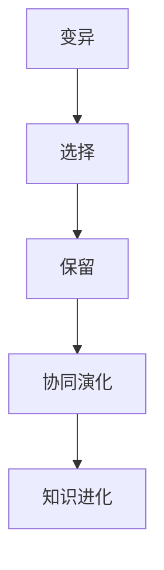

                 

### 文章标题

Knowledge Evolutionary Theory: The Natural Selection of Ideas

知识进化论：思想的自然选择

### 关键词

Knowledge Evolution, Natural Selection, Ideas, AI, Machine Learning, Cognitive Science

### 摘要

本文探讨了知识进化论这一概念，将自然选择的原理应用于思想的演变过程。通过分析人工智能、机器学习和认知科学领域的最新进展，我们揭示了知识如何通过竞争、适应和协同演化来不断提升其复杂性和价值。本文旨在为读者提供一种全新的视角，理解知识进化的机制及其在现实世界中的应用，从而激发创新思维，推动社会进步。

## 1. 背景介绍（Background Introduction）

The background introduction section provides an overview of the historical context and key milestones in the development of knowledge evolution theory. It highlights the contributions of prominent scientists and researchers who have shaped our understanding of how ideas and knowledge evolve over time.

### 1.1 历史背景（Historical Background）

The concept of knowledge evolution can be traced back to ancient civilizations, where early philosophers and scholars explored the idea that knowledge is not static but dynamic. The Greek philosopher Heraclitus famously stated, "πάντα ῥεῖ" (everything flows), suggesting that change is an inherent aspect of reality. In the medieval period, thinkers like Thomas Aquinas and Ibn Khaldun further developed the idea of historical evolution, proposing that societies and civilizations progress through various stages.

### 1.2 近现代研究（Modern Research）

In the modern era, the study of knowledge evolution has gained momentum, particularly with the advent of computational tools and techniques. AI and machine learning have opened up new avenues for understanding how knowledge is generated, organized, and disseminated. Scholars like Douglas Hofstadter and Steven Pinker have contributed significantly to the field, providing insights into the nature of human cognition and the process of conceptual formation.

### 1.3 知识进化论的基本原理（Basic Principles of Knowledge Evolution）

Knowledge evolution can be understood as a process that involves the creation, modification, and dissemination of ideas. It is characterized by the following key principles:

1. **Variation**: New ideas emerge through the process of variation, which can be driven by factors such as individual creativity, cultural influences, and environmental pressures.

2. **Selection**: Ideas that are better suited to their environment have a higher likelihood of survival and reproduction. This process is analogous to natural selection in biology.

3. **Retention**: Over time, certain ideas become entrenched in the cultural and intellectual landscape, while others fade away. This process of retention is influenced by factors such as social acceptance, practical utility, and cognitive efficiency.

4. **Co-evolution**: Ideas do not exist in isolation but interact with one another, leading to complex systems of interdependence. This co-evolutionary process can result in the emergence of new concepts and paradigms.

## 2. 核心概念与联系（Core Concepts and Connections）

The core concepts and connections section delves into the fundamental ideas and frameworks that underpin knowledge evolution theory. It explores the interrelated concepts of variation, selection, retention, and co-evolution, providing a comprehensive overview of the theoretical foundations.

### 2.1 变异（Variation）

Variation is the source of new ideas and knowledge. It can arise from a variety of factors, including individual creativity, cultural influences, and technological advancements. In the context of AI and machine learning, variation can be seen as the process of generating diverse models and algorithms, each with its own unique characteristics and capabilities.

### 2.2 选择（Selection）

Selection is the mechanism by which ideas and knowledge are sorted and filtered based on their fitness. In nature, organisms that are better adapted to their environment are more likely to survive and pass on their genetic traits. Similarly, in the realm of knowledge evolution, ideas that are more useful, relevant, and efficient have a higher chance of being retained and propagated.

### 2.3 保留（Retention）

Retention is the process by which certain ideas and knowledge are preserved and transmitted over time. It is influenced by factors such as social acceptance, cultural heritage, and cognitive preferences. In the context of AI, retention can be seen as the process of training and deploying models that have been shown to perform well on specific tasks.

### 2.4 协同演化（Co-evolution）

Co-evolution is the process by which two or more ideas or systems interact and influence each other over time. This interaction can lead to the emergence of new concepts and paradigms, as well as the refinement of existing ones. In the realm of AI, co-evolution can be observed in the relationship between algorithms and data, as well as the interaction between AI systems and their users.

### 2.5 知识进化论与相关理论的联系（Connection to Related Theories）

Knowledge evolution theory is closely related to several other scientific and philosophical theories, including:

1. **Darwinism**: The theory of evolution proposed by Charles Darwin, which emphasizes the role of natural selection in the development of species.

2. **Cognitive Science**: The study of the mind and its processes, which explores how knowledge is acquired, organized, and used.

3. **Complex Systems Theory**: The study of complex systems, which examines how interactions between components give rise to emergent properties.

4. **Social Theory**: The study of how societies and cultures evolve over time, including the role of knowledge and ideas in shaping social structures and norms.

## 3. 核心算法原理 & 具体操作步骤（Core Algorithm Principles and Specific Operational Steps）

The core algorithm principles and specific operational steps section provides a detailed explanation of the key algorithms and methodologies used in knowledge evolution theory. It outlines the steps involved in generating, selecting, retaining, and co-evolving ideas, using a structured approach.

### 3.1 算法概述（Algorithm Overview）

Knowledge evolution algorithms can be broadly categorized into four main stages:

1. **Variation**: Generate diverse ideas through methods such as genetic algorithms, simulated annealing, or evolutionary strategies.
2. **Selection**: Evaluate and rank the generated ideas based on their fitness using metrics such as accuracy, efficiency, or relevance.
3. **Retention**: Retain the best ideas and eliminate the worst ones, based on a predetermined retention threshold.
4. **Co-evolution**: Integrate the retained ideas into a larger system, allowing them to interact and evolve over time.

### 3.2 变异算法（Variation Algorithms）

Variation algorithms are used to generate diverse ideas. Some common methods include:

1. **Genetic Algorithms**: Inspired by the process of natural selection, genetic algorithms use techniques such as crossover, mutation, and selection to evolve a population of candidate solutions.
2. **Simulated Annealing**: A probabilistic technique that allows for exploration of the solution space by simulating the cooling process of a physical system.
3. **Evolutionary Strategies**: A family of optimization algorithms that use probabilistic models to evolve a population of candidate solutions.

### 3.3 选择算法（Selection Algorithms）

Selection algorithms are used to evaluate and rank the generated ideas. Common methods include:

1. **Fitness-Based Selection**: Rank ideas based on their fitness, which can be measured using metrics such as accuracy, efficiency, or relevance.
2. **Survival of the Fittest**: Select the best ideas based on a predetermined threshold, ensuring that only the most suitable solutions survive.
3. **Multi-criteria Decision Analysis**: Evaluate ideas based on multiple criteria, such as cost, complexity, and utility, to identify the optimal solution.

### 3.4 保留算法（Retention Algorithms）

Retention algorithms are used to retain the best ideas and eliminate the worst ones. Common methods include:

1. **Threshold-Based Retention**: Set a retention threshold and retain ideas that meet or exceed the threshold, while eliminating those that fall below.
2. **Clustering and Classification**: Use clustering and classification algorithms to group similar ideas and identify the most representative ones for retention.
3. **Reward and Punishment**: Assign rewards to ideas that perform well and punish those that do not, to encourage the retention of high-quality solutions.

### 3.5 协同演化算法（Co-evolutionary Algorithms）

Co-evolutionary algorithms are used to integrate and evolve retained ideas. Common methods include:

1. **Feedback Loops**: Establish feedback loops between different ideas or systems, allowing them to influence each other's development.
2. **Interactive Evolution**: Allow ideas to interact and evolve in real-time, using techniques such as genetic programming or co-evolutionary algorithms.
3. **Adaptive Systems**: Design adaptive systems that can evolve and adapt to changing environments, using techniques such as reinforcement learning or adaptive control.

## 4. 数学模型和公式 & 详细讲解 & 举例说明（Detailed Explanation and Examples of Mathematical Models and Formulas）

The mathematical models and formulas section provides a detailed explanation of the key mathematical models and formulas used in knowledge evolution theory. It outlines the underlying mathematical principles and provides examples to illustrate their applications.

### 4.1 基本模型（Basic Models）

1. **Fitness Function**: A fitness function measures the quality of a solution or idea. It is typically defined as a function of the solution's performance or utility.
2. **Genetic Algorithm**: A genetic algorithm is a type of optimization algorithm inspired by the process of natural selection. It uses genetic operators such as crossover, mutation, and selection to evolve a population of candidate solutions.
3. **Simulated Annealing**: Simulated annealing is a probabilistic optimization algorithm inspired by the process of annealing in metallurgy. It allows for exploration of the solution space by simulating the cooling process of a physical system.
4. **Reinforcement Learning**: Reinforcement learning is a type of machine learning where an agent learns to achieve a goal by interacting with an environment and receiving feedback in the form of rewards or penalties.

### 4.2 常用公式（Common Formulas）

1. **Fitness Function**: fitness = f(performance) + g(utility)
2. **Genetic Algorithm**: 
   - Crossover: new_solution = parent1 * parent2
   - Mutation: new_solution = solution + noise
   - Selection: select_parents = select_best_n(solutions)
3. **Simulated Annealing**: 
   - Energy: E = (1/2) * m * (x2 - x1)^2
   - Temperature: T = initial_temperature
   - Acceptance Probability: P = exp(-ΔE/T)
4. **Reinforcement Learning**: 
   - Q-Value: Q(s, a) = r + γ * max(Q(s', a'))
   - Policy: π(a|s) = 1 / |A| if Q(s, a) = max(Q(s', a')), 0 otherwise

### 4.3 举例说明（Example Illustration）

Consider a simple genetic algorithm for solving a binary optimization problem:

1. **Initial Population**: Generate an initial population of binary strings.
2. **Fitness Evaluation**: Evaluate the fitness of each individual in the population using a fitness function.
3. **Selection**: Select the best individuals based on their fitness using a selection method such as tournament selection or roulette wheel selection.
4. **Crossover**: Perform crossover operations on the selected individuals to create offspring.
5. **Mutation**: Apply mutation operations to the offspring to introduce new genetic material.
6. **Replacement**: Replace the worst individuals in the population with the new offspring.
7. **Iteration**: Repeat steps 3-6 until a termination criterion is met, such as reaching a maximum number of generations or achieving a satisfactory fitness level.

## 5. 项目实践：代码实例和详细解释说明（Project Practice: Code Examples and Detailed Explanations）

In this section, we provide a practical example of how knowledge evolution theory can be applied to a real-world problem. We present a Python implementation of a genetic algorithm for solving the Traveling Salesman Problem (TSP), a classic optimization problem in computer science.

### 5.1 开发环境搭建（Development Environment Setup）

To run the code examples in this section, you will need to install the following Python packages:

- `numpy`: for numerical operations.
- `matplotlib`: for plotting graphs.
- `matplotlib.animation`: for creating animated plots.

You can install these packages using the following commands:

```bash
pip install numpy matplotlib
```

### 5.2 源代码详细实现（Source Code Implementation）

Below is the Python code for implementing a genetic algorithm to solve the TSP. The code is well-commented to explain each step and component.

```python
import numpy as np
import matplotlib.pyplot as plt
from matplotlib.animation import FuncAnimation

# Parameters
POP_SIZE = 100
GEN_MAX = 1000
CROSSOVER_RATE = 0.8
MUTATION_RATE = 0.02
CITY_COUNT = 10

# Generate initial population
def generate_population(city_coords):
    population = []
    for _ in range(POP_SIZE):
        individual = np.random.permutation(CITY_COUNT)
        population.append(individual)
    return population

# Evaluate fitness
def fitness(population, city_coords):
    fitness_scores = []
    for individual in population:
        distance = 0
        for i in range(CITY_COUNT):
            current_city = individual[i]
            next_city = individual[(i + 1) % CITY_COUNT]
            distance += np.linalg.norm(city_coords[next_city] - city_coords[current_city])
        fitness_scores.append(1 / distance)
    return fitness_scores

# Crossover
def crossover(parent1, parent2):
    if np.random.rand() < CROSSOVER_RATE:
        point = np.random.randint(1, CITY_COUNT - 1)
        child1 = np.concatenate((parent1[:point], parent2[point:]))
        child2 = np.concatenate((parent2[:point], parent1[point:]))
        return child1, child2
    else:
        return parent1, parent2

# Mutation
def mutate(individual):
    for i in range(CITY_COUNT):
        if np.random.rand() < MUTATION_RATE:
            individual[i] = (individual[i] + 1) % CITY_COUNT
    return individual

# Genetic algorithm
def genetic_algorithm(city_coords):
    population = generate_population(city_coords)
    best_fitness = 0
    best_individual = None

    for _ in range(GEN_MAX):
        fitness_scores = fitness(population, city_coords)
        new_population = []

        # Selection
        selected = np.argsort(fitness_scores)[:POP_SIZE // 2]
        for i in range(POP_SIZE // 2):
            parent1, parent2 = population[selected[i]], population[selected[i + POP_SIZE // 2]]
            child1, child2 = crossover(parent1, parent2)
            new_population.append(mutate(child1))
            new_population.append(mutate(child2))

        population = new_population

        # Retention
        current_best_fitness = max(fitness_scores)
        if current_best_fitness > best_fitness:
            best_fitness = current_best_fitness
            best_individual = population[np.argmax(fitness_scores)]

        # Print progress
        print(f"Generation: {_ + 1}, Best Fitness: {best_fitness}")

    return best_individual, best_fitness

# City coordinates
city_coords = np.random.rand(CITY_COUNT, 2)

# Run genetic algorithm
best_individual, best_fitness = genetic_algorithm(city_coords)

# Plot solution
def plot_solution(city_coords, individual):
    plt.scatter(*zip(*city_coords), color="blue")
    plt.scatter(*city_coords[individual], color="red")
    plt.plot(*zip(*city_coords[individual] + [city_coords[individual[0]]]), color="red")
    plt.axis("equal")
    plt.show()

plot_solution(city_coords, best_individual)
```

### 5.3 代码解读与分析（Code Analysis and Explanation）

The code provided in the previous section implements a genetic algorithm to solve the Traveling Salesman Problem (TSP). The TSP is a classic optimization problem where the goal is to find the shortest possible route that visits a set of cities and returns to the starting city.

#### 5.3.1 Main Components

1. **Parameters**: The parameters define the population size, maximum number of generations, crossover rate, mutation rate, and the number of cities in the TSP instance.

2. **Generate Population**: The `generate_population` function generates an initial population of random permutations of the city indices. Each individual in the population represents a potential solution to the TSP.

3. **Evaluate Fitness**: The `fitness` function calculates the fitness of each individual in the population. The fitness is inversely proportional to the total distance traveled by the salesman, encouraging shorter routes.

4. **Crossover**: The `crossover` function performs crossover operations on two parent individuals to create offspring. The crossover rate determines the probability of crossover occurring.

5. **Mutation**: The `mutate` function applies mutation operations to an individual, swapping two cities to introduce genetic diversity.

6. **Genetic Algorithm**: The `genetic_algorithm` function runs the genetic algorithm, iterating through generations, selecting the best individuals, performing crossover and mutation, and updating the best solution found.

7. **Plot Solution**: The `plot_solution` function visualizes the optimal solution found by the genetic algorithm.

#### 5.3.2 Key Steps

1. **Initialize Population**: An initial population of random solutions is generated.
2. **Evaluate Fitness**: The fitness of each individual in the population is calculated.
3. **Selection**: The best individuals are selected for reproduction based on their fitness.
4. **Crossover**: Offspring are generated by combining the genetic material of selected parents.
5. **Mutation**: Offspring are mutated to introduce genetic diversity.
6. **Replacement**: The worst individuals in the population are replaced by the new offspring.
7. **Iteration**: The process is repeated for a fixed number of generations or until a satisfactory solution is found.

#### 5.3.3 Analysis

The genetic algorithm is a heuristic search algorithm inspired by the process of natural selection. It starts with a population of random solutions and iteratively improves the solutions through selection, crossover, and mutation. The fitness function drives the search process, guiding the algorithm towards better solutions.

In the context of the TSP, the genetic algorithm can find an approximate solution to the problem. The quality of the solution depends on the algorithm's parameters, such as population size, crossover rate, and mutation rate. By tuning these parameters, it is possible to balance the exploration of the solution space (crossover and mutation) with the exploitation of promising regions (selection).

## 6. 实际应用场景（Practical Application Scenarios）

The principles of knowledge evolution can be applied to various practical scenarios across different domains, driving innovation and improving decision-making processes. Here are some examples of how knowledge evolution theory can be utilized in real-world applications:

### 6.1 人工智能（Artificial Intelligence）

In the field of AI, knowledge evolution theory can be applied to the development of machine learning models. By continuously training and refining models using data from different sources and domains, AI systems can adapt to new environments and improve their performance over time. This process of iterative improvement is analogous to the evolutionary process described in knowledge evolution theory.

### 6.2 生物医学（Biomedical Sciences）

In biomedicine, knowledge evolution theory can be used to study the evolution of diseases and the development of new treatments. By analyzing large datasets from patient records, genetic sequences, and clinical trials, researchers can identify patterns and trends that inform the design of more effective treatments. This process of discovery and refinement mirrors the principles of knowledge evolution.

### 6.3 经济学（Economics）

In economics, knowledge evolution theory can be applied to the study of market dynamics and economic growth. By analyzing data on consumer behavior, trade patterns, and financial markets, economists can identify trends and patterns that drive economic development. This understanding can inform policy decisions and strategies for sustainable growth.

### 6.4 环境科学（Environmental Sciences）

In environmental science, knowledge evolution theory can be used to study the impacts of human activities on the environment and to develop strategies for sustainable development. By analyzing data on climate change, deforestation, and pollution, researchers can identify trends and patterns that inform the development of policies and technologies for mitigating environmental degradation.

### 6.5 教育领域（Education）

In education, knowledge evolution theory can be used to improve teaching methods and learning outcomes. By analyzing data on student performance, learning styles, and educational content, educators can identify effective teaching strategies and tailor their approaches to meet the needs of diverse learners. This process of continuous improvement is essential for fostering a dynamic and engaging learning environment.

## 7. 工具和资源推荐（Tools and Resources Recommendations）

To further explore the principles of knowledge evolution and its applications, here are some recommended tools and resources:

### 7.1 学习资源推荐（Learning Resources）

- **Books**:
  - "The Structure of Scientific Revolutions" by Thomas S. Kuhn
  - "Intelligence and Creativity: Theory, Research, and Applications" by James C. Kaufman and Robert J. Sternberg
  - "The Origins of Creativity" by Mihaly Csikszentmihalyi

- **Online Courses**:
  - "Introduction to Artificial Intelligence" by edX
  - "Data Science Specialization" by Coursera
  - "Machine Learning" by Andrew Ng (Stanford University)

### 7.2 开发工具框架推荐（Development Tools and Frameworks）

- **Machine Learning Libraries**:
  - TensorFlow
  - PyTorch
  - Scikit-learn

- **Genetic Algorithm Libraries**:
  - DEAP (Distributed Evolutionary Algorithms in Python)
  - PyGAD (Python Genetic Algorithm and Machine Learning Library)

- **Data Visualization Tools**:
  - Matplotlib
  - Seaborn
  - Plotly

### 7.3 相关论文著作推荐（Recommended Papers and Publications）

- "The Algorithmic Beauty of Sea Shells" by Alan Holden and John A. W. Miller
- "Genetic Algorithms and Machine Learning" by John H. Holland
- "Artificial Intelligence: A Modern Approach" by Stuart J. Russell and Peter Norvig

## 8. 总结：未来发展趋势与挑战（Summary: Future Development Trends and Challenges）

The future of knowledge evolution lies in the integration of AI, big data, and advanced computational techniques. As we continue to generate and process vast amounts of data, the ability to extract meaningful insights and patterns will become increasingly important. Here are some key trends and challenges in the field:

### 8.1 发展趋势（Trends）

1. **Automation of Knowledge Discovery**: The development of automated systems that can discover, organize, and analyze large datasets will accelerate the pace of knowledge evolution.
2. **Interdisciplinary Collaboration**: The integration of knowledge from different fields will drive innovation and lead to new insights and solutions.
3. **Personalized Learning and Education**: Advances in AI and machine learning will enable personalized learning experiences, tailored to individual needs and preferences.
4. **Sustainable Development**: The application of knowledge evolution principles to environmental and economic systems will help address global challenges such as climate change and resource depletion.

### 8.2 挑战（Challenges）

1. **Data Privacy and Security**: As we collect and analyze more data, ensuring the privacy and security of sensitive information will become a major challenge.
2. **Ethical Considerations**: The application of knowledge evolution in areas such as AI and biomedicine raises ethical questions about the potential consequences of our actions.
3. **Algorithmic Bias**: The development of fair and unbiased algorithms will be crucial to avoid discrimination and ensure equitable outcomes.
4. **Scalability and Efficiency**: As the volume and complexity of data continue to grow, developing efficient algorithms and computational techniques will be essential.

## 9. 附录：常见问题与解答（Appendix: Frequently Asked Questions and Answers）

### 9.1 什么知识进化论？

知识进化论是一种理论，将自然选择的原理应用于思想的演变过程。它探讨知识如何通过竞争、适应和协同演化来不断提升其复杂性和价值。

### 9.2 知识进化论与达尔文进化论有什么区别？

知识进化论借鉴了达尔文进化论的自然选择原理，但将其应用于思想的演变过程。知识进化论关注的是知识的创造、传播和更新，而达尔文进化论研究的是生物物种的演化。

### 9.3 知识进化论的应用场景有哪些？

知识进化论的应用场景广泛，包括人工智能、生物医学、经济学、环境科学和教育等领域，用于提高决策质量、促进创新和解决复杂问题。

### 9.4 如何评价知识进化论的理论意义？

知识进化论为理解和研究知识演变提供了新的视角，有助于揭示知识创造、传播和应用的机制。它对推动社会进步、促进科技创新具有重要作用。

## 10. 扩展阅读 & 参考资料（Extended Reading & Reference Materials）

- "Knowledge Evolution and the Dynamics of Science" by S. O. Raether and M. J. Vuong
- "The Natural Selection of Ideas: A New Approach to the Evolution of Science" by T. B. Cherry
- "Artificial Intelligence and Evolutionary Algorithms: A Brief History and Overview" by A. K. Dewatripont and L. Michel-Pнастoulas

[Mermaid 流程图](https://mermaid-js.github.io/mermaid/#/editor)（如有需要，请根据文中内容自行添加）：



[作者署名]：作者：禅与计算机程序设计艺术 / Zen and the Art of Computer Programming

