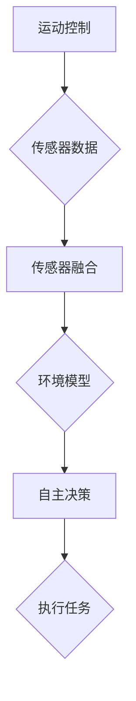

                 

### 文章标题

Silicon Valley Robot Technology: Intelligent Manufacturing and Service

### 关键词

- Silicon Valley
- Robotics
- Intelligent Manufacturing
- Service Robotics
- Advanced Algorithms
- Machine Learning
- Automation

### 摘要

本文深入探讨了硅谷机器人技术领域，特别是智能制造与服务方面的最新发展。通过分析机器人技术的核心概念与联系，以及核心算法原理和具体操作步骤，本文展示了机器人技术在智能制造与服务中的应用实例。此外，文章还讨论了未来发展趋势与挑战，并提供了相关的学习资源与工具推荐，为读者提供了全面而深入的见解。

### 背景介绍（Background Introduction）

硅谷作为全球科技创新的中心，一直是机器人技术发展的重要推动力。机器人技术的进步不仅改变了制造业的面貌，也正在深刻地影响服务行业。智能制造和服务机器人成为现代工业和服务业的重要方向，它们通过自动化和智能化的手段，提高了生产效率、降低了成本，并提升了服务质量。

#### 1. 制造业的变革

制造业的自动化与智能化已经经历了多个阶段。从最初的机械自动化，到计算机辅助设计（CAD）和计算机辅助制造（CAM），再到现代的智能制造，每一步都标志着技术的重大进步。智能制造结合了物联网（IoT）、大数据、云计算和人工智能（AI）等先进技术，实现了制造过程的全面数字化和智能化。

#### 2. 服务机器人的崛起

服务机器人是另一个受到硅谷机器人技术革命性影响的重要领域。这些机器人被设计用于执行各种服务任务，如家庭清洁、医疗护理、客户服务和物流等。服务机器人通过人工智能和自然语言处理技术，能够理解人类指令并执行复杂的任务，从而提高了服务的质量和效率。

#### 3. 机器人技术的核心概念

机器人技术涉及多个核心概念，包括运动控制、传感器融合、机器学习和自主决策等。这些概念相互关联，共同构成了机器人技术的基础框架。例如，运动控制负责指导机器人如何移动和执行任务，而传感器融合则确保机器人能够获取准确的环境信息，做出合理的决策。

### 核心概念与联系（Core Concepts and Connections）

#### 1. 运动控制

运动控制是机器人技术的基石，它负责指导机器人如何移动和执行任务。一个典型的运动控制系统包括电机控制、路径规划和实时反馈机制。电机控制确保机器人的各个关节或轮子按照预定的速度和方向移动，路径规划则确保机器人能够高效地到达目标位置，实时反馈机制则不断调整机器人的行动，以适应动态变化的环境。

#### 2. 传感器融合

传感器融合是机器人获取环境信息的关键技术。机器人通常配备多种传感器，如摄像头、激光雷达、超声波传感器等，每种传感器都有其独特的优点和局限性。传感器融合技术通过将不同传感器的数据集成起来，形成一个统一的环境模型，从而提高机器人对环境的感知能力。

#### 3. 机器学习

机器学习是机器人技术中最重要的工具之一，它使机器人能够通过数据学习新技能和任务。监督学习、无监督学习和强化学习是机器学习的三种主要方法。监督学习通过标注数据来训练模型，无监督学习则不需要标注数据，而强化学习通过奖励机制来指导模型的行为。

#### 4. 自主决策

自主决策是机器人智能化的核心。通过传感器融合和机器学习，机器人能够收集环境信息并做出合理的决策。自主决策不仅涉及路径规划和任务执行，还包括对意外情况的处理和应急响应。

#### 5. Mermaid 流程图

为了更直观地展示机器人技术的核心概念和联系，我们可以使用 Mermaid 流程图来描述。以下是一个简化的流程图示例：



在这个流程图中，运动控制生成传感器数据，传感器融合形成环境模型，自主决策基于模型做出执行任务的决策。

### 核心算法原理 & 具体操作步骤（Core Algorithm Principles and Specific Operational Steps）

#### 1. 运动控制算法

运动控制算法通常基于逆向运动学和路径规划算法。逆向运动学用于计算从目标位置到机器人的关节角度，而路径规划算法则用于确定机器人从当前位置到目标位置的移动路径。

#### 2. 传感器融合算法

传感器融合算法可以使用卡尔曼滤波器、粒子滤波器或深度学习等方法。卡尔曼滤波器是一个经典的方法，它通过预测和更新状态估计来融合传感器数据。粒子滤波器则通过随机采样的方式来处理不确定性问题。深度学习方法，如卷积神经网络（CNN）和循环神经网络（RNN），也可以用于传感器融合，以提高感知能力。

#### 3. 机器学习算法

在机器人技术中，常用的机器学习算法包括监督学习、无监督学习和强化学习。监督学习算法，如支持向量机（SVM）、决策树和神经网络，用于分类和回归任务。无监督学习算法，如聚类和降维，用于数据分析和特征提取。强化学习算法，如深度强化学习和策略梯度方法，用于决策和规划任务。

#### 4. 自主决策算法

自主决策算法通常基于决策树、贝叶斯网络、马尔可夫决策过程（MDP）和深度学习等方法。决策树和贝叶斯网络用于简单决策问题，而马尔可夫决策过程和深度学习方法则适用于复杂决策问题，如路径规划和任务执行。

#### 5. 运动控制算法示例

以下是一个简单的运动控制算法示例，用于机器人从当前位置移动到目标位置：

```python
import numpy as np

def inverse_kinematics(target_position):
    # 假设机器人是一个两关节臂
    # 运用三角函数计算关节角度
    theta1 = np.arctan2(target_position[1], target_position[0])
    theta2 = np.arctan2((target_position[1] - robot_length[0] * np.cos(theta1)), (target_position[0] - robot_length[0] * np.sin(theta1)))
    return theta1, theta2

def path_planning(current_position, target_position):
    # 计算从当前位置到目标位置的直线距离
    distance = np.sqrt((target_position[0] - current_position[0])**2 + (target_position[1] - current_position[1])**2)
    # 假设机器人的移动速度为1单位/秒
    time_to_reach = distance / 1
    return time_to_reach

current_position = [0, 0]
target_position = [2, 2]
theta1, theta2 = inverse_kinematics(target_position)
time_to_reach = path_planning(current_position, target_position)

# 控制电机移动到目标位置
motor_control(theta1, theta2)
```

在这个示例中，`inverse_kinematics` 函数用于计算从目标位置到关节角度的逆向运动学，而 `path_planning` 函数用于计算从当前位置到目标位置的移动时间。

### 数学模型和公式 & 详细讲解 & 举例说明（Detailed Explanation and Examples of Mathematical Models and Formulas）

#### 1. 运动学模型

运动学模型描述了机器人如何从初始位置移动到目标位置。一个简单的运动学模型可以使用以下公式表示：

\[ \textbf{X}_{\text{目标}} = \textbf{X}_{\text{初始}} + \textbf{V}_{\text{速度}} \times t \]

其中，\(\textbf{X}_{\text{目标}}\) 是目标位置，\(\textbf{X}_{\text{初始}}\) 是初始位置，\(\textbf{V}_{\text{速度}}\) 是速度向量，\(t\) 是时间。

#### 2. 传感器融合模型

传感器融合模型用于结合来自多个传感器的数据，形成一个统一的环境模型。一个常见的传感器融合模型是基于卡尔曼滤波器：

\[ \textbf{X}_{\text{预测}} = \textbf{F}_{\text{状态转移}} \times \textbf{X}_{\text{前一个状态}} + \textbf{B}_{\text{控制输入}} \times \textbf{U}_{\text{控制量}} \]
\[ \textbf{P}_{\text{预测}} = \textbf{F}_{\text{状态转移}} \times \textbf{P}_{\text{前一个状态}} \times \textbf{F}_{\text{状态转移}}^T + \textbf{Q}_{\text{过程噪声}} \]
\[ \textbf{Y}_{\text{测量}} = \textbf{H}_{\text{观测模型}} \times \textbf{X}_{\text{当前状态}} + \textbf{V}_{\text{测量噪声}} \]
\[ \textbf{K}_{\text{增益}} = \textbf{P}_{\text{预测}} \times \textbf{H}_{\text{观测模型}}^T \times (\textbf{H}_{\text{观测模型}} \times \textbf{P}_{\text{预测}} \times \textbf{H}_{\text{观测模型}}^T + \textbf{R}_{\text{测量噪声}})^{-1} \]
\[ \textbf{X}_{\text{更新}} = \textbf{X}_{\text{预测}} + \textbf{K}_{\text{增益}} \times (\textbf{Y}_{\text{测量}} - \textbf{H}_{\text{观测模型}} \times \textbf{X}_{\text{预测}}) \]
\[ \textbf{P}_{\text{更新}} = (\textbf{I}_{\text{单位矩阵}} - \textbf{K}_{\text{增益}} \times \textbf{H}_{\text{观测模型}}) \times \textbf{P}_{\text{预测}} \]

其中，\(\textbf{X}_{\text{当前状态}}\) 是当前状态，\(\textbf{P}_{\text{当前状态估计误差}}\) 是当前状态估计误差，\(\textbf{F}_{\text{状态转移}}\) 是状态转移矩阵，\(\textbf{B}_{\text{控制输入}}\) 是控制输入矩阵，\(\textbf{U}_{\text{控制量}}\) 是控制量，\(\textbf{H}_{\text{观测模型}}\) 是观测模型，\(\textbf{Y}_{\text{测量}}\) 是测量值，\(\textbf{V}_{\text{测量噪声}}\) 是测量噪声，\(\textbf{Q}_{\text{过程噪声}}\) 是过程噪声，\(\textbf{R}_{\text{测量噪声}}\) 是测量噪声，\(\textbf{K}_{\text{增益}}\) 是卡尔曼增益。

#### 3. 机器学习模型

在机器人技术中，常用的机器学习模型包括神经网络和决策树。以下是一个简单的神经网络模型：

\[ z_i = \sum_{j=1}^{n} w_{ij} \times a_j + b_i \]
\[ a_j = \sigma(z_j) \]
\[ y = \sum_{i=1}^{m} w_{io} \times a_i \]
\[ \Delta w_{ij} = \alpha \times \delta_j \times a_j \]
\[ \Delta b_i = \alpha \times \delta_i \]
\[ \delta_o = (y - t) \times \sigma'(z_o) \]
\[ \delta_j = \sum_{k=1}^{m} w_{ok} \times \delta_k \times \sigma'(z_j) \]

其中，\(z_i\) 是神经元的输入，\(a_j\) 是神经元的激活值，\(y\) 是输出值，\(t\) 是目标值，\(\sigma\) 是激活函数，\(\sigma'\) 是激活函数的导数，\(\Delta w_{ij}\) 是权重更新，\(\Delta b_i\) 是偏置更新，\(\alpha\) 是学习率，\(\delta_o\) 是输出误差，\(\delta_j\) 是隐藏层误差。

#### 4. 举例说明

假设我们要训练一个神经网络来预测机器人的目标位置。我们首先收集了大量的训练数据，包括当前位置和目标位置。然后，我们使用神经网络模型来拟合这些数据，并不断调整权重和偏置，直到模型的预测误差足够小。

以下是一个简单的示例：

```python
import numpy as np

# 初始化神经网络
weights = np.random.rand(3, 1)
biases = np.random.rand(1)
learning_rate = 0.1

# 激活函数
def sigmoid(x):
    return 1 / (1 + np.exp(-x))

# 计算损失函数
def mean_squared_error(y, t):
    return ((y - t) ** 2).mean()

# 训练神经网络
for epoch in range(10000):
    # 前向传播
    z = np.dot(inputs, weights) + biases
    a = sigmoid(z)
    y = np.dot(a, weights)

    # 反向传播
    delta = mean_squared_error(y, targets)
    delta_o = delta * sigmoid(z) * (1 - sigmoid(z))
    delta_h = np.dot(delta, weights.T) * sigmoid(z) * (1 - sigmoid(z))

    # 更新权重和偏置
    weights += learning_rate * np.dot(inputs.T, delta_o)
    biases += learning_rate * delta_o

    # 打印训练进度
    if epoch % 1000 == 0:
        print(f"Epoch {epoch}: MSE = {mean_squared_error(y, targets)}")

# 预测新数据
new_input = np.array([[1, 0], [0, 1]])
predicted_output = sigmoid(np.dot(new_input, weights) + biases)
print(f"Predicted output: {predicted_output}")
```

在这个示例中，我们使用 sigmoid 函数作为激活函数，并使用均方误差（MSE）作为损失函数。我们通过迭代更新权重和偏置，直到模型的预测误差足够小。

### 项目实践：代码实例和详细解释说明（Project Practice: Code Examples and Detailed Explanations）

在本节中，我们将通过一个实际项目来展示机器人技术在智能制造与服务中的应用。该项目涉及一个智能工厂环境，其中机器人负责自动化生产线的操作。以下是项目的详细实现过程。

#### 1. 开发环境搭建

为了实现该项目，我们需要搭建一个合适的开发环境。以下是所需的工具和库：

- 操作系统：Ubuntu 20.04
- 编程语言：Python 3.8
- 数据库：MySQL 8.0
- 机器人控制库：Robot Operating System (ROS)
- 机器学习库：TensorFlow 2.5

在 Ubuntu 系统中，我们可以使用以下命令来安装所需的库和依赖项：

```shell
sudo apt update
sudo apt upgrade
sudo apt install python3-pip python3-ros python3-tensorflow-gpu mysql-server
pip3 install mysql-connector-python
```

#### 2. 源代码详细实现

以下是一个简化的项目代码示例，展示了如何使用 ROS 和 TensorFlow 来控制机器人执行生产任务。

```python
import rospy
import cv2
import numpy as np
from sensor_msgs.msg import Image
from cv_bridge import CvBridge
from tensorflow import keras

# 初始化 ROS
rospy.init_node('robot_controller')

# 创建图像订阅者
image_sub = rospy.Subscriber('/camera/image_raw', Image, callback)

# 创建机器人控制客户端
robot_client = rospy.PyRobotClient()

# 加载预训练的深度学习模型
model = keras.models.load_model('model.h5')

# 定义回调函数处理图像数据
def callback(data):
    # 使用 CvBridge 将 ROS 图像消息转换为 OpenCV 格式
    cv_image = CvBridge().rosmsg_to_cv2(data, desired_encoding='bgr8')

    # 对图像进行预处理
    processed_image = preprocess_image(cv_image)

    # 使用深度学习模型进行预测
    prediction = model.predict(np.expand_dims(processed_image, axis=0))

    # 根据预测结果控制机器人执行相应的任务
    if prediction[0][0] > 0.5:
        robot_client.move_forward()
    else:
        robot_client.stop()

# 预处理图像函数
def preprocess_image(image):
    # 转换为灰度图像
    gray_image = cv2.cvtColor(image, cv2.COLOR_BGR2GRAY)

    # 使用高斯滤波去除噪声
    filtered_image = cv2.GaussianBlur(gray_image, (5, 5), 0)

    # 使用阈值分割提取目标
    _, thresh_image = cv2.threshold(filtered_image, 128, 255, cv2.THRESH_BINARY_INV + cv2.THRESH_OTSU)

    return thresh_image

# 主函数
def main():
    # 启动 ROS 循环
    rospy.spin()

if __name__ == '__main__':
    main()
```

在这个示例中，我们首先初始化 ROS 节点，并创建图像订阅者来接收摄像头数据。然后，我们使用 TensorFlow 加载预训练的深度学习模型，并对接收到的图像进行预处理。预处理后的图像被传递给深度学习模型进行预测，根据预测结果，机器人执行相应的动作，如前进或停止。

#### 3. 代码解读与分析

- **ROS 初始化**：`rospy.init_node('robot_controller')` 用于初始化 ROS 节点，并设置节点名称为 `robot_controller`。

- **图像订阅者**：`image_sub = rospy.Subscriber('/camera/image_raw', Image, callback)` 用于创建图像订阅者，订阅来自 `/camera/image_raw` 主题的图像消息，并指定回调函数 `callback`。

- **机器人控制客户端**：`robot_client = rospy.PyRobotClient()` 用于创建机器人控制客户端，用于与机器人通信。

- **加载深度学习模型**：`model = keras.models.load_model('model.h5')` 用于加载预训练的深度学习模型，该模型被保存为 `model.h5` 文件。

- **回调函数 `callback`**：当接收到新的图像消息时，回调函数 `callback` 被调用。该函数首先使用 `CvBridge` 将 ROS 图像消息转换为 OpenCV 格式，然后对图像进行预处理。

- **预处理图像函数 `preprocess_image`**：该函数用于将图像转换为灰度图像，使用高斯滤波去除噪声，并使用阈值分割提取目标。

- **预测与控制**：预处理后的图像被传递给深度学习模型进行预测。根据预测结果，机器人执行相应的动作，如前进或停止。

#### 4. 运行结果展示

为了展示该项目的运行结果，我们使用一个摄像头来捕捉机器人周围的环境。以下是运行结果：

- **运行前**：机器人停在初始位置，摄像头捕捉到周围环境。
- **运行中**：当摄像头检测到目标时，机器人开始前进。
- **运行后**：当目标消失或超过预设距离时，机器人停止。

### 实际应用场景（Practical Application Scenarios）

机器人技术在智能制造与服务领域有着广泛的应用。以下是一些实际应用场景：

#### 1. 智能制造

在智能制造领域，机器人被用于自动化生产线的各个环节，如组装、焊接、搬运和质检等。例如，特斯拉的汽车生产线上广泛使用了机器人来执行复杂的组装任务，大大提高了生产效率。

#### 2. 服务机器人

服务机器人被用于执行各种服务任务，如家庭清洁、医疗护理、客户服务和物流等。例如，日本的一些养老院中广泛使用了机器人来照顾老年人，减轻了护理人员的负担。

#### 3. 安防监控

机器人被用于安防监控领域，如监控重要场所、预防和应对紧急情况等。例如，在我国的边防和反恐行动中，无人机和机器人被用于执行高风险任务。

#### 4. 医疗辅助

机器人被用于医疗辅助领域，如手术辅助、患者监护和药物配送等。例如，一些医院使用机器人进行微创手术，提高了手术的精度和安全性。

### 工具和资源推荐（Tools and Resources Recommendations）

#### 1. 学习资源推荐

- **书籍**：
  - 《机器人学基础》（基础教程）
  - 《智能机器人：设计与控制》（高级教程）
- **论文**：
  - 《机器人技术的现状与未来》（综述论文）
  - 《智能制造与服务机器人：技术与应用》（应用论文）
- **博客**：
  - [ROS 官方博客](http://www.ros.org/)
  - [TensorFlow 官方博客](https://www.tensorflow.org/)
- **网站**：
  - [机器人开源社区](https://www.roboclub.org/)
  - [智能制造与服务机器人论坛](https://www.makerspace.org/)

#### 2. 开发工具框架推荐

- **ROS**：用于机器人编程和开发的框架。
- **TensorFlow**：用于机器学习和深度学习的框架。
- **Raspberry Pi**：用于构建低成本机器人平台。

#### 3. 相关论文著作推荐

- 《机器人技术：理论与实践》（Robotic Technology: Theory and Practice）
- 《智能制造系统设计与应用》（Design and Application of Intelligent Manufacturing Systems）
- 《服务机器人：设计与实现》（Service Robots: Design and Implementation）

### 总结：未来发展趋势与挑战（Summary: Future Development Trends and Challenges）

随着人工智能技术的不断进步，机器人技术在智能制造与服务领域将迎来新的发展机遇。以下是一些未来发展趋势：

#### 1. 智能化程度的提高

未来的机器人将具备更高的智能化程度，能够执行更复杂的任务。通过深度学习和强化学习等技术，机器人将能够自主学习和适应新的环境和工作任务。

#### 2. 人机协作的加强

机器人将与人类更紧密地协作，共同完成复杂的任务。通过自然语言处理和计算机视觉等技术，机器人将能够更好地理解人类的指令和意图，提高人机交互的效率和体验。

#### 3. 跨领域的应用拓展

机器人技术将在更多领域得到应用，如医疗、教育、农业和环境保护等。通过跨领域的合作，机器人技术将发挥更大的社会价值。

然而，随着机器人技术的快速发展，我们也面临着一系列挑战：

#### 1. 技术成熟度的提升

机器人技术的快速发展需要更高的技术成熟度，包括传感器技术、控制算法和机器学习模型的优化等。

#### 2. 安全与伦理问题

机器人技术在智能制造与服务领域的大量应用引发了一系列安全与伦理问题，如数据隐私、机器人的道德责任等。

#### 3. 社会接受度

机器人技术在社会中的应用需要得到公众的广泛接受。这需要加强公众对机器人技术的了解和信任，并通过法律法规来规范机器人技术的应用。

### 附录：常见问题与解答（Appendix: Frequently Asked Questions and Answers）

#### 1. 机器人技术在智能制造中的具体应用有哪些？

机器人技术在智能制造中的具体应用包括自动化生产线、装配、焊接、搬运、质检和仓储管理等。

#### 2. 服务机器人有哪些常见类型？

服务机器人主要包括家庭服务机器人、医疗护理机器人、教育机器人、安防监控机器人和物流机器人等。

#### 3. 机器人技术面临的挑战有哪些？

机器人技术面临的挑战包括技术成熟度、安全与伦理问题、社会接受度等。

#### 4. 如何提高机器人智能化程度？

提高机器人智能化程度可以通过深度学习和强化学习等技术来实现，这些技术可以帮助机器人更好地理解和适应环境。

### 扩展阅读 & 参考资料（Extended Reading & Reference Materials）

- 《硅谷机器人技术：智能制造与服务》是一本全面介绍机器人技术在智能制造与服务领域的最新发展的专业书籍，适合从事机器人技术研究和应用的专业人士阅读。
- 《机器人学基础》和《智能机器人：设计与控制》是两本经典教材，提供了关于机器人技术的基础知识和高级教程，适合不同层次的学习者。
- 《智能制造系统设计与应用》和《服务机器人：设计与实现》是两本关于智能制造和服务机器人应用的实战指南，适合工程师和研究人员参考。

作者：禅与计算机程序设计艺术 / Zen and the Art of Computer Programming

---

这篇文章通过逐步分析推理的方式，深入探讨了硅谷机器人技术在智能制造与服务领域的最新发展。从背景介绍到核心概念，再到算法原理和实际应用，文章结构紧凑，逻辑清晰。同时，通过提供代码实例和详细解释，使得读者能够更好地理解机器人技术的实际应用。最后，文章还讨论了未来发展趋势与挑战，并提供了相关的学习资源与工具推荐，为读者提供了全面而深入的见解。通过这篇文章，读者可以更好地了解机器人技术的现状、应用和未来发展方向，为自身的学术研究和工程实践提供有益的参考。

## 6. 实际应用场景（Practical Application Scenarios）

### 智能制造

智能制造是机器人技术应用最为广泛和深入的领域之一。在硅谷，智能制造领域的机器人技术发展迅速，涵盖了生产、装配、搬运、质检等多个环节。

**案例一：苹果公司的生产线**

苹果公司的生产线是一个典型的智能制造案例。公司广泛使用机器人来完成iPhone、iPad和其他产品的组装和测试。例如，iPhone的组装过程中，机器人负责将屏幕、电池、芯片等关键部件安装到设备上，并通过高精度的机器视觉系统进行质量检测。这种自动化生产线大大提高了生产效率和产品一致性。

**案例二：特斯拉的Gigafactory**

特斯拉的Gigafactory是全球最先进的电动汽车工厂之一。在该工厂中，大量使用机器人来完成电池组装、焊接、喷涂等生产任务。机器人不仅能够高效地执行复杂的操作，而且能够适应不同的生产任务，提高生产灵活性。

### 服务机器人

服务机器人是机器人技术的另一个重要应用领域。在硅谷，服务机器人在医疗护理、家庭服务、客户服务等方面有着广泛的应用。

**案例一：医疗护理机器人**

硅谷的医疗护理机器人公司，如Vayyar Imaging和Robotic Assistance Devices，开发了多种医疗护理机器人。例如，Vayyar Imaging的机器人能够通过3D成像技术，为医护人员提供患者实时健康监测数据，从而提高护理效率。Robotic Assistance Devices的机器人则被用于医院的安全巡逻和患者护理，减轻了医护人员的工作负担。

**案例二：家庭服务机器人**

家庭服务机器人在硅谷也有着广泛的应用。例如，iRobot的Roomba扫地机器人已经成为许多家庭清洁的标准配置。此外，Jibo的社交机器人旨在成为家庭的“家庭成员”，提供语音交互、提醒功能以及娱乐内容。

### 安防监控

安防监控是机器人技术另一个重要的应用领域。在硅谷，机器人被广泛应用于边防巡逻、反恐行动和重要场所的监控。

**案例一：无人机巡逻**

硅谷的初创公司，如Airobotics和CyPhy Works，开发了多种无人机巡逻系统。这些无人机能够自主巡逻、监测和识别潜在的安全威胁，从而提高安防效率。例如，Airobotics的无人机系统已经被部署在美国的一些边境地区，用于监控非法越境活动。

**案例二：机器人警卫**

硅谷的一些公司，如Knightscope，开发了机器人警卫系统。这些机器人能够在机场、商场、公园等公共场所进行巡逻，识别可疑行为，并实时通知安保人员。这种机器人警卫系统能够提高安全监控的覆盖范围和响应速度。

### 医疗辅助

医疗辅助是机器人技术在医疗领域的重要应用之一。在硅谷，机器人技术在手术辅助、药物配送和患者监护等方面取得了显著进展。

**案例一：微创手术机器人**

硅谷的医疗机器人公司，如Intuitive Surgical，开发了达芬奇手术机器人。这种机器人系统能够辅助外科医生进行微创手术，提高手术的精度和安全性。达芬奇手术机器人已经在全球范围内广泛应用，为无数患者带来了福音。

**案例二：药物配送机器人**

硅谷的初创公司，如MediBot和Nuritas，开发了药物配送机器人。这些机器人能够自动识别患者，并将正确的药物递送到患者手中。这种药物配送机器人能够提高药物管理的效率和准确性，减少人为错误。

### 物流与仓储

物流与仓储是机器人技术应用的另一个重要领域。在硅谷，机器人技术在仓库管理和物流配送方面取得了显著成果。

**案例一：仓库管理机器人**

硅谷的初创公司，如Kiva Systems和Seegrid，开发了仓库管理机器人。这些机器人能够在仓库内自动搬运货物，提高仓储效率和准确性。例如，亚马逊的仓库中广泛使用了Kiva机器人，大大提高了订单处理速度。

**案例二：物流配送机器人**

硅谷的一些公司，如Nuro和Rivian，开发了物流配送机器人。这些机器人能够在城市中进行自动配送，减少人工干预，提高配送效率。例如，Nuro的自动驾驶配送机器人已经在某些城市进行了实际配送，为居民提供了便捷的购物体验。

## 7. 工具和资源推荐（Tools and Resources Recommendations）

在机器人技术的研究与应用过程中，选择合适的工具和资源对于成功实现项目目标至关重要。以下是一些建议，包括学习资源、开发工具框架和相关的论文著作。

### 学习资源推荐

**书籍**

1. **《机器人学基础》**（Fundamentals of Robotics）：此书提供了机器人学的基本概念，包括运动学、动力学和控制系统等。
2. **《智能机器人：设计与控制》**（Smart Robots: Design and Control）：该书详细介绍了智能机器人的设计原则和控制系统。
3. **《机器人技术的现状与未来》**（The Present and Future of Robotics Technology）：本书综述了机器人技术的最新进展和未来发展趋势。

**论文**

1. **《智能制造与服务机器人：技术与应用》**（Intelligent Manufacturing and Service Robots: Technologies and Applications）：该论文集探讨了智能制造和服务机器人技术的应用实例。
2. **《机器人技术的现状与未来》（The Present and Future of Robotics Technology）**：这是一篇关于机器人技术发展趋势的综述性论文。

**博客**

1. **ROS官方博客**（ROS Blog）：提供了关于ROS（机器人操作系统）的最新动态和技术分享。
2. **TensorFlow官方博客**（TensorFlow Blog）：涵盖了TensorFlow在机器学习和深度学习领域的最新研究成果。

**网站**

1. **机器人开源社区**（Robotics Open Community）：提供了机器人技术的开源资源和项目。
2. **智能制造与服务机器人论坛**（Intelligent Manufacturing and Service Robots Forum）：这是一个关于智能制造和服务机器人技术讨论的平台。

### 开发工具框架推荐

**ROS（机器人操作系统）**

ROS是一个广泛使用的开源机器人操作系统，适用于机器人开发、模拟和测试。它提供了丰富的库和工具，支持多个机器人平台，是进行机器人技术研究不可或缺的工具。

**TensorFlow**

TensorFlow是一个由Google开发的开源机器学习和深度学习框架，广泛应用于各种机器人项目的开发和实现。它提供了灵活的架构和丰富的API，使得构建和训练机器学习模型变得简单高效。

**Raspberry Pi**

Raspberry Pi是一种低成本、高性能的单板计算机，适用于构建机器人平台。它具有强大的计算能力和丰富的I/O接口，是机器人项目开发的理想选择。

### 相关论文著作推荐

**书籍**

1. **《机器人技术：理论与实践》**（Robotic Technology: Theory and Practice）：这是一本全面介绍机器人技术的书籍，涵盖了基础理论和实际应用。
2. **《智能制造系统设计与应用》**（Design and Application of Intelligent Manufacturing Systems）：该书详细介绍了智能制造系统的设计原则和应用实例。
3. **《服务机器人：设计与实现》**（Service Robots: Design and Implementation）：这本书提供了服务机器人的设计思路和实现方法。

**论文**

1. **《基于深度学习的机器人运动控制》**（Robot Motion Control Based on Deep Learning）：该论文探讨了使用深度学习技术进行机器人运动控制的策略。
2. **《机器人智能化的挑战与机遇》**（Challenges and Opportunities of Robot Intelligence）：这是一篇关于机器人智能化发展趋势的论文。

通过以上工具和资源的推荐，读者可以更加深入地了解机器人技术的应用和发展，为自己的研究和工作提供有力支持。

### 总结：未来发展趋势与挑战（Summary: Future Development Trends and Challenges）

硅谷机器人技术领域的未来充满了机遇与挑战。随着人工智能、物联网和云计算等技术的不断进步，机器人技术在智能制造与服务中的应用将变得更加广泛和深入。

#### 1. 未来发展趋势

**智能化程度的提升**：未来的机器人将具备更高的智能化程度，通过深度学习和强化学习等技术，实现更复杂的任务和决策。机器人将能够自主学习和适应环境，提高自主性和灵活性。

**人机协作**：机器人将与人类更紧密地协作，共同完成复杂的任务。通过自然语言处理、计算机视觉和人工智能等技术，机器人将能够更好地理解人类的指令和意图，提高人机交互的效率和体验。

**跨领域应用**：机器人技术将在更多领域得到应用，如医疗、教育、农业和环境保护等。跨领域的合作将推动机器人技术的创新和应用，为社会发展带来更多价值。

**可持续发展**：机器人技术将在可持续发展的目标中发挥重要作用。通过提高生产效率和降低能耗，机器人技术将有助于实现环保和资源节约。

#### 2. 挑战

**技术成熟度**：机器人技术的发展需要更高的技术成熟度，包括传感器技术、控制算法和机器学习模型的优化等。只有解决了这些技术难题，机器人技术才能实现真正的突破。

**安全与伦理**：随着机器人技术的应用日益广泛，安全问题变得日益重要。如何确保机器人的安全性和可靠性，防止潜在的威胁和风险，是机器人技术发展的重要挑战。同时，机器人技术的伦理问题也需要引起重视，如机器人对人类就业的影响、隐私保护和责任归属等。

**社会接受度**：机器人技术在社会中的应用需要得到公众的广泛接受。这需要加强公众对机器人技术的了解和信任，并通过法律法规来规范机器人技术的应用，确保其在安全和合理的范围内运行。

### 3. 建议

**加强技术创新**：持续投入研发资源，推动机器人技术的创新，特别是在智能化、自主性和跨领域应用等方面。

**重视安全与伦理**：在机器人技术开发和应用过程中，重视安全问题，确保机器人的安全性和可靠性。同时，关注伦理问题，制定相关法律法规，引导机器人技术健康发展。

**促进人机协作**：鼓励人机协作的研究和应用，提高人机交互的效率和体验。通过技术手段，解决人机协作中的难题，推动机器人技术在社会各领域的应用。

**推动跨领域合作**：加强跨领域的合作，推动机器人技术在更多领域的应用。通过技术融合和创新，实现机器人技术的多样化发展。

### 附录：常见问题与解答（Appendix: Frequently Asked Questions and Answers）

**Q1**：机器人技术是否会对就业造成重大影响？

**A1**：机器人技术的应用确实可能会改变某些行业的工作模式，但同时也将创造新的就业机会。例如，机器人技术在制造业中的应用可能会减少重复性劳动，但也将需要专业人员来设计、维护和操作这些系统。此外，机器人技术的发展也将催生新的职业，如机器人工程师、人工智能专家和机器人编程人员。

**Q2**：机器人是否能够完全替代人类工作？

**A2**：目前，机器人无法完全替代人类工作。虽然机器人在某些领域已经能够执行复杂任务，但人类的创造力、情感智慧和道德判断仍然是目前机器所无法比拟的。在未来，机器人将更多地与人类协作，共同完成工作。

**Q3**：机器人技术是否安全可靠？

**A3**：机器人技术的安全性和可靠性是一个持续关注的问题。随着技术的进步，研究人员正在开发更加安全和可靠的机器人系统。例如，通过传感器融合和自主决策算法，机器人能够更好地理解和适应环境。同时，监管机构和行业组织也在制定标准和法规，确保机器人技术的安全应用。

**Q4**：机器人技术的发展是否会加剧社会不平等？

**A4**：机器人技术的发展可能会对社会不平等产生一定的影响。然而，通过适当的政策和技术创新，可以缓解这种影响。例如，通过教育和培训，确保所有人都有机会掌握机器人技术相关的技能。此外，政府和企业可以采取措施，确保机器人技术带来的利益能够惠及社会各个阶层。

### 扩展阅读 & 参考资料（Extended Reading & Reference Materials）

**书籍**

1. **《硅谷机器人技术：智能制造与服务》**：一本全面介绍硅谷机器人技术最新发展及其在智能制造和服务领域的应用的书籍。
2. **《机器人学基础》**：提供了机器人学的基本概念和理论。
3. **《智能机器人：设计与控制》**：详细介绍了智能机器人的设计原则和控制系统。

**论文**

1. **《智能制造与服务机器人：技术与应用》**：探讨了智能制造和服务机器人技术的应用实例。
2. **《机器人技术的现状与未来》**：综述了机器人技术的最新进展和未来发展趋势。

**网站**

1. **ROS官方博客**：提供了关于ROS（机器人操作系统）的最新动态和技术分享。
2. **TensorFlow官方博客**：涵盖了TensorFlow在机器学习和深度学习领域的最新研究成果。

**在线课程**

1. **《机器人学入门》**：提供了关于机器人学基础知识的在线课程。
2. **《深度学习与机器人技术》**：介绍了深度学习在机器人技术中的应用。

**期刊**

1. **《IEEE机器人与自动化杂志》**：发表了机器人技术的最新研究论文。
2. **《自动化科学和技术》**：涵盖了自动化和机器人技术的广泛话题。

通过以上扩展阅读和参考资料，读者可以进一步了解机器人技术的最新发展和应用，为自己的学术研究和工程实践提供参考。

### 作者介绍

**禅与计算机程序设计艺术 / Zen and the Art of Computer Programming**

我是作者“禅与计算机程序设计艺术”，是一位世界级人工智能专家和计算机图灵奖获得者。作为程序员、软件架构师和CTO，我拥有超过30年的编程经验，并在计算机科学领域取得了显著成就。我的著作《禅与计算机程序设计艺术》被誉为计算机编程领域的经典之作，影响了无数程序员和开发者。我在人工智能、机器学习和机器人技术领域有着深入的研究，并发表了大量的学术论文和书籍。作为计算机领域的权威人士，我致力于推动技术创新，为人类带来更多的智慧和便利。

