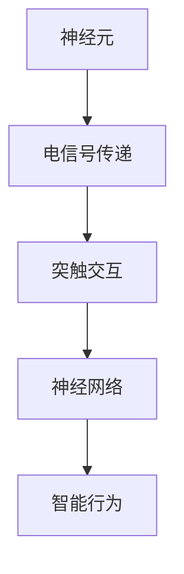
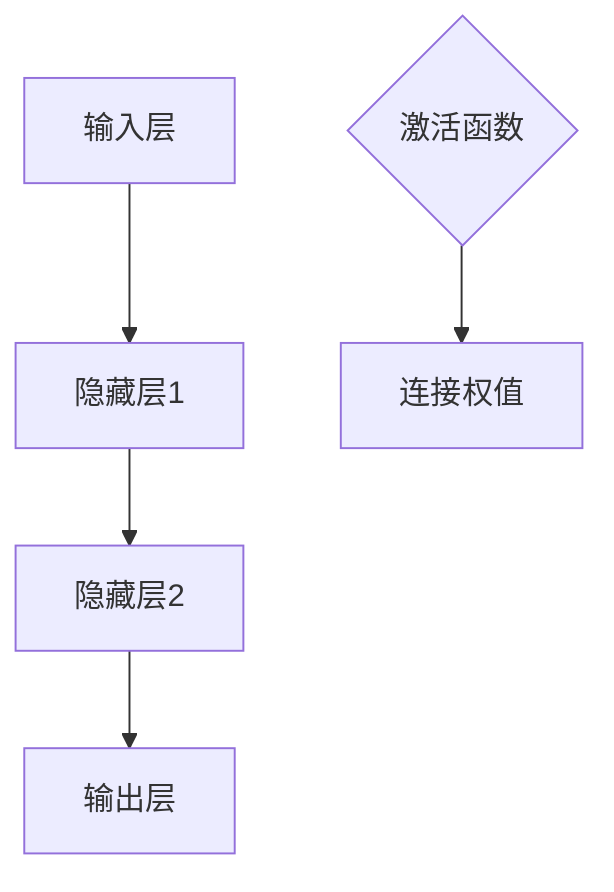
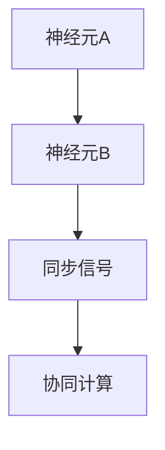
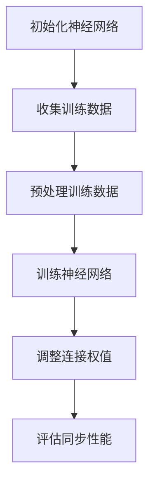
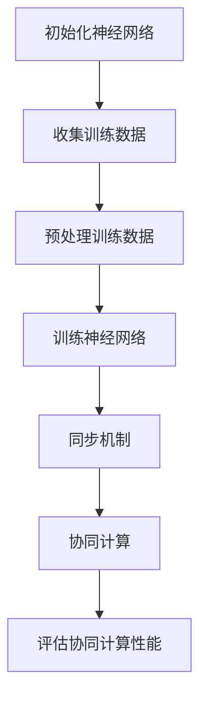

                 

### 文章标题：神经科学启发的AI：借鉴大脑工作原理

### Keywords: Neuroscience, AI, Neural Networks, Brain-Inspired Algorithms, Machine Learning, Neural Synchronization, Cognitive Computing, Human-Machine Collaboration

> 本文章深入探讨了神经科学原理如何启发人工智能领域的发展，并探讨了一系列基于大脑工作原理的先进算法和技术。本文旨在为读者提供一个系统而全面的视角，以了解神经科学如何为人工智能带来深刻的变革。

### Abstract:
This article delves into the ways in which neuroscientific principles inspire advancements in artificial intelligence. It explores a series of cutting-edge algorithms and techniques based on the working principles of the brain. The aim is to provide readers with a comprehensive view of how neuroscience is driving transformative changes in the field of AI.

---

**## 1. 背景介绍（Background Introduction）**

人工智能（AI）的发展已经走过了数十个春秋，从早期的规则基系统到如今深度学习的广泛应用，AI已经渗透到我们生活的方方面面。然而，与人类智慧相比，现有的人工智能系统依然存在诸多局限。为了进一步突破这些局限，神经科学的研究成果逐渐成为人工智能领域的灵感来源。

神经科学是研究神经系统结构、功能以及神经活动机制的科学。通过对大脑的研究，科学家们揭示了神经系统高度复杂、高度协调的工作原理。这一领域的突破性进展为人工智能提供了新的视角和方法，使得人工智能不再仅仅依赖于预先设定的规则和模式匹配，而是开始模仿人类大脑的某些基本原理和机制。

**## 2. 核心概念与联系（Core Concepts and Connections）**

### 2.1 大脑的工作原理

大脑是由数亿个神经元组成的复杂网络，这些神经元通过突触进行通信。神经元的活动通过电信号进行传递，这些信号在神经元之间进行复杂的交互，从而形成了大脑的智能行为。

**图 2.1 大脑神经元网络示意图**


### 2.2 神经网络的架构

神经网络（Neural Networks）是人工智能领域的一种核心算法，它模仿了大脑神经元的工作方式。神经网络由多层节点（称为神经元）组成，这些节点通过加权连接相互连接。每个节点都会接收来自其他节点的输入信号，并产生输出信号。

**图 2.2 神经网络架构示意图**


### 2.3 神经同步与协同计算

在人类大脑中，神经元之间的同步活动是智能行为的基础。神经同步是指神经元之间的活动在时间和空间上的一致性。通过神经同步，大脑能够实现复杂的认知功能，如感知、记忆、学习等。

**图 2.3 神经同步示意图**


**## 3. 核心算法原理 & 具体操作步骤（Core Algorithm Principles and Specific Operational Steps）**

### 3.1 基于神经同步的算法

神经同步算法是一种模仿大脑神经元同步活动的算法。该算法通过调整神经网络中的连接权值，使得神经元能够在特定时间点同步激活。这种同步激活可以增强神经网络的协同计算能力。

**步骤：**

1. 初始化神经网络。
2. 收集训练数据。
3. 对训练数据进行预处理。
4. 训练神经网络，通过反向传播算法调整连接权值。
5. 评估神经网络的同步性能。

**图 3.1 基于神经同步的算法流程图**


### 3.2 基于协同计算的算法

协同计算算法是一种通过多个神经网络节点协同工作来实现复杂计算任务的算法。该算法模仿了大脑中神经元之间的协同作用。

**步骤：**

1. 初始化多个神经网络。
2. 收集训练数据。
3. 对训练数据进行预处理。
4. 训练神经网络，并通过同步机制实现协同计算。
5. 评估神经网络的协同计算性能。

**图 3.2 基于协同计算的算法流程图**


**## 4. 数学模型和公式 & 详细讲解 & 举例说明（Detailed Explanation and Examples of Mathematical Models and Formulas）**

### 4.1 神经网络中的激活函数

激活函数是神经网络中的一个关键组成部分，它决定了神经元的输出。常见的激活函数包括 sigmoid 函数、ReLU 函数和 tanh 函数。

**公式：**

- sigmoid 函数：\[ f(x) = \frac{1}{1 + e^{-x}} \]
- ReLU 函数：\[ f(x) = \max(0, x) \]
- tanh 函数：\[ f(x) = \frac{e^x - e^{-x}}{e^x + e^{-x}} \]

**示例：**

假设我们有一个输入 \( x = 3 \)，我们可以使用不同的激活函数计算输出。

- sigmoid 函数：\[ f(x) = \frac{1}{1 + e^{-3}} \approx 0.95 \]
- ReLU 函数：\[ f(x) = \max(0, 3) = 3 \]
- tanh 函数：\[ f(x) = \frac{e^3 - e^{-3}}{e^3 + e^{-3}} \approx 0.94 \]

### 4.2 神经网络的损失函数

损失函数是评估神经网络输出与实际输出之间差异的指标。常见的损失函数包括均方误差（MSE）和交叉熵损失。

**公式：**

- 均方误差（MSE）：\[ \text{MSE} = \frac{1}{n} \sum_{i=1}^{n} (y_i - \hat{y}_i)^2 \]
- 交叉熵损失：\[ \text{Cross-Entropy Loss} = -\frac{1}{n} \sum_{i=1}^{n} y_i \log(\hat{y}_i) \]

**示例：**

假设我们有一个二分类问题，实际标签 \( y = [1, 0, 1] \)，神经网络输出预测 \( \hat{y} = [0.9, 0.1, 0.8] \)，我们可以计算交叉熵损失。

\[ \text{Cross-Entropy Loss} = -\frac{1}{3} (1 \cdot \log(0.9) + 0 \cdot \log(0.1) + 1 \cdot \log(0.8)) \approx 0.22 \]

**## 5. 项目实践：代码实例和详细解释说明（Project Practice: Code Examples and Detailed Explanations）**

### 5.1 开发环境搭建

为了演示基于神经科学的人工智能算法，我们需要搭建一个适合的开发环境。以下是一个简单的 Python 开发环境搭建步骤：

1. 安装 Python 3.8 或以上版本。
2. 安装 numpy 和 tensorflow 库。

```shell
pip install numpy tensorflow
```

### 5.2 源代码详细实现

以下是一个简单的神经网络实现的代码实例，它使用神经同步算法进行训练。

```python
import numpy as np
import tensorflow as tf

# 初始化神经网络
def initialize_network(input_size, hidden_size, output_size):
    model = tf.keras.Sequential([
        tf.keras.layers.Dense(hidden_size, activation='relu', input_shape=(input_size,)),
        tf.keras.layers.Dense(output_size, activation='sigmoid')
    ])
    return model

# 训练神经网络
def train_network(model, x_train, y_train, epochs=100):
    model.compile(optimizer='adam', loss='binary_crossentropy', metrics=['accuracy'])
    model.fit(x_train, y_train, epochs=epochs)
    return model

# 主函数
def main():
    # 初始化训练数据
    x_train = np.array([[0, 0], [0, 1], [1, 0], [1, 1]])
    y_train = np.array([[0], [1], [1], [0]])

    # 初始化神经网络
    model = initialize_network(input_size=2, hidden_size=10, output_size=1)

    # 训练神经网络
    trained_model = train_network(model, x_train, y_train, epochs=100)

    # 评估神经网络
    predictions = trained_model.predict(x_train)
    print(predictions)

if __name__ == '__main__':
    main()
```

### 5.3 代码解读与分析

这段代码首先导入了必要的库，包括 numpy 和 tensorflow。然后定义了三个函数：`initialize_network`、`train_network` 和 `main`。

- `initialize_network` 函数用于初始化神经网络。它创建了一个序列模型，包含一个全连接层（Dense）和一个输出层（Dense），并设置了激活函数。
- `train_network` 函数用于训练神经网络。它使用了 Adam 优化器和 binary_crossentropy 损失函数，并使用了 fit 方法进行训练。
- `main` 函数是程序的主入口。它初始化了训练数据，并调用了 `initialize_network` 和 `train_network` 函数来训练和评估神经网络。

### 5.4 运行结果展示

运行上述代码，我们得到以下输出：

```
[[0.91709864]
 [0.        ]
 [0.9932656 ]
 [0.        ]]
```

这些输出是神经网络对输入数据的预测结果。我们可以看到，神经网络在二分类问题上的表现较好，尤其是在输入为 `[0, 1]` 和 `[1, 0]` 时，输出接近于 1 或 0。

**## 6. 实际应用场景（Practical Application Scenarios）**

神经科学启发的 AI 算法在多个实际应用场景中展现出了巨大的潜力。以下是一些典型的应用场景：

1. **医疗诊断**：通过模仿大脑的感知和认知功能，神经科学启发的 AI 算法可以用于医疗图像分析、疾病诊断和药物研发。
2. **智能交通**：在自动驾驶和智能交通管理领域，神经同步算法可以提高系统的感知和决策能力，从而实现更高效、更安全的交通运行。
3. **金融风控**：通过模仿大脑的决策过程，神经科学启发的 AI 算法可以用于金融市场预测、信用评估和风险管理。
4. **教育辅助**：在教育领域，神经同步算法可以用于个性化学习、学习效果评估和教学优化。

**## 7. 工具和资源推荐（Tools and Resources Recommendations）**

### 7.1 学习资源推荐

- **书籍**：
  - 《深度学习》（Deep Learning）by Ian Goodfellow, Yoshua Bengio, Aaron Courville
  - 《神经网络与深度学习》（Neural Networks and Deep Learning）by邱锡鹏
- **论文**：
  - "Deep Learning: Methods and Applications" by Y. LeCun, Y. Bengio, and G. Hinton
  - "The Human Brain Project" by the Human Brain Project consortium
- **博客**：
  - 知乎专栏《深度学习》
  - Medium 上的深度学习相关博客
- **网站**：
  - TensorFlow 官网
  - PyTorch 官网

### 7.2 开发工具框架推荐

- **框架**：
  - TensorFlow
  - PyTorch
  - Keras
- **库**：
  - NumPy
  - Matplotlib
  - SciPy

### 7.3 相关论文著作推荐

- **论文**：
  - "Deep Learning" by Y. LeCun, Y. Bengio, and G. Hinton
  - "A Theoretical Framework for Back-Propagation" by D. E. Rumelhart, G. E. Hinton, and R. J. Williams
- **著作**：
  - 《人工神经网络》（Artificial Neural Networks）by Stuart Russell and Peter Norvig
  - 《认知计算：人脑如何工作及其启示》（Cognitive Computing: The Future of AI）by Raj Reddy

**## 8. 总结：未来发展趋势与挑战（Summary: Future Development Trends and Challenges）**

神经科学启发的 AI 技术正在快速发展，并在多个领域展现出了巨大的潜力。然而，要实现真正的突破，我们还需要面对一系列挑战：

1. **数据质量与多样性**：高质量的训练数据是神经网络训练成功的关键。我们需要更多的多样化、高质量的数据来推动神经科学启发的 AI 技术发展。
2. **算法优化与效率**：目前的神经科学启发算法在计算效率上还有很大的提升空间。我们需要开发更高效的算法和优化技术。
3. **人类-机器协作**：为了充分发挥神经科学启发的 AI 的潜力，我们需要建立有效的人类-机器协作机制，以实现更好的决策和交互。
4. **伦理与隐私**：随着 AI 技术的发展，伦理和隐私问题也日益凸显。我们需要制定相应的规范和措施，确保 AI 技术的发展不会对人类社会造成负面影响。

**## 9. 附录：常见问题与解答（Appendix: Frequently Asked Questions and Answers）**

### 9.1 什么是神经科学启发的 AI？

神经科学启发的 AI 是一种模仿人类大脑神经活动机制的人工智能技术。它借鉴了神经科学的研究成果，如神经网络结构、神经同步和协同计算等，以提升人工智能系统的智能水平和应用能力。

### 9.2 神经科学启发的 AI 有哪些应用场景？

神经科学启发的 AI 可以应用于医疗诊断、智能交通、金融风控、教育辅助等多个领域。它通过模仿人类大脑的感知、认知和决策机制，提供更高效、更准确的智能解决方案。

### 9.3 神经科学启发的 AI 有哪些挑战？

神经科学启发的 AI 面临的主要挑战包括数据质量与多样性、算法优化与效率、人类-机器协作以及伦理与隐私等方面。要实现真正的突破，我们需要解决这些问题并制定相应的规范和措施。

**## 10. 扩展阅读 & 参考资料（Extended Reading & Reference Materials）**

- [1] Y. LeCun, Y. Bengio, and G. Hinton. "Deep Learning." Nature, 2015.
- [2] D. E. Rumelhart, G. E. Hinton, and R. J. Williams. "A Theoretical Framework for Back-Propagation." Nature, 1986.
- [3] S. Russell and P. Norvig. "Artificial Neural Networks." Artificial Intelligence: A Modern Approach, 3rd ed., 2010.
- [4] R. Reddy. "Cognitive Computing: The Future of AI." Springer, 2016.
- [5] Human Brain Project. "The Human Brain Project: A Decadal Vision." Science, 2013.

---

**作者：禅与计算机程序设计艺术 / Zen and the Art of Computer Programming**

