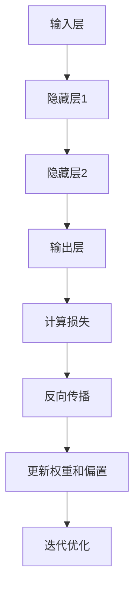

                 

### 文章标题

神经网络可视化原理与代码实战案例讲解

> 关键词：神经网络，可视化，原理，代码实战，案例讲解
>
> 摘要：本文将深入探讨神经网络的原理，通过可视化手段，让读者更加直观地理解神经网络的工作机制。同时，我们将通过实际代码案例，详细讲解如何使用神经网络进行图像识别任务，帮助读者掌握神经网络的基本应用和实践技能。

在人工智能领域，神经网络作为最强大的工具之一，已经广泛应用于图像识别、自然语言处理、推荐系统等多个领域。然而，对于许多初学者来说，理解神经网络的工作原理仍然是一个挑战。本文将尝试通过简明易懂的语言和丰富的案例，帮助读者深入理解神经网络，并掌握其实际应用技能。

本文将分为以下几个部分：

1. **背景介绍**：介绍神经网络的基本概念和重要性。
2. **核心概念与联系**：解释神经网络的核心组成部分和它们之间的联系。
3. **核心算法原理 & 具体操作步骤**：详细讲解神经网络的基本算法原理和实现步骤。
4. **数学模型和公式 & 详细讲解 & 举例说明**：介绍神经网络中的数学模型和公式，并通过实际案例进行说明。
5. **项目实践：代码实例和详细解释说明**：提供具体的神经网络代码实例，并进行详细解释和分析。
6. **实际应用场景**：讨论神经网络的实际应用案例。
7. **工具和资源推荐**：推荐相关的学习资源和开发工具。
8. **总结：未来发展趋势与挑战**：总结神经网络的发展趋势和面临的挑战。
9. **附录：常见问题与解答**：解答读者可能遇到的一些常见问题。
10. **扩展阅读 & 参考资料**：提供进一步的阅读材料和参考资料。

通过本文的学习，读者将能够：

- 理解神经网络的基本原理和工作机制。
- 掌握神经网络在图像识别等任务中的应用方法。
- 学习如何使用神经网络进行实际项目开发。

现在，让我们开始深入了解神经网络的世界吧！<|user|>## 1. 背景介绍

### 1.1 什么是神经网络？

神经网络（Neural Networks），也被称为人工神经网络（Artificial Neural Networks，ANN），是一种模仿生物神经系统的计算模型。最早由心理学家弗兰克·罗森布拉特（Frank Rosenblatt）于1957年提出。它由大量的节点（或称为神经元）组成，这些节点通过模拟生物神经元的连接方式，形成了复杂的网络结构。神经网络通过学习输入数据和输出数据之间的映射关系，来预测新数据的输出或分类。

神经网络的核心思想是通过调整网络中节点间的连接强度（称为权重），使得网络能够学会对新的输入数据进行准确的预测或分类。这种学习过程类似于人类的学习过程，通过不断的试错和调整，最终达到对问题的理解。

### 1.2 神经网络的重要性

神经网络作为一种强大的机器学习工具，已经成为人工智能领域的基石。它的重要性体现在以下几个方面：

1. **图像识别**：神经网络在图像识别领域取得了巨大的成功，例如在人脸识别、车辆识别、医疗影像分析等方面。通过卷积神经网络（Convolutional Neural Networks，CNN）等模型，神经网络能够从图像中提取重要的特征，进行准确的分类和识别。

2. **自然语言处理**：神经网络在自然语言处理（Natural Language Processing，NLP）领域也发挥了重要作用。通过递归神经网络（Recurrent Neural Networks，RNN）和变压器模型（Transformer），神经网络能够处理序列数据，如文本和语音，进行语言翻译、情感分析、文本生成等任务。

3. **推荐系统**：神经网络在推荐系统中的应用也非常广泛。通过学习用户的历史行为和偏好，神经网络能够为用户推荐相关的商品、音乐、电影等。

4. **自动驾驶**：神经网络在自动驾驶领域也发挥着关键作用。通过深度神经网络（Deep Neural Networks，DNN）模型，自动驾驶系统能够实时处理摄像头和激光雷达等传感器收集的大量数据，实现车辆的自动驾驶。

### 1.3 神经网络的发展历程

神经网络的研究始于20世纪50年代，虽然早期的研究取得了一些进展，但由于计算能力的限制，神经网络的发展相对缓慢。直到21世纪初，随着计算机性能的飞速提升和大数据技术的发展，神经网络的研究和应用才得以迅速发展。以下是神经网络发展历程中的重要事件：

- **1957**：弗兰克·罗森布拉特提出了感知机（Perceptron）模型，这是神经网络的基础模型之一。
- **1986**：乔治·杰弗里斯和戴维·鲁梅哈特提出了反向传播算法（Backpropagation Algorithm），大大提高了神经网络的训练效率。
- **1998**：Geoffrey Hinton等人提出了深度信念网络（Deep Belief Network，DBN），开启了深度学习的研究热潮。
- **2012**：Alex Krizhevsky等人使用深度卷积神经网络（CNN）在ImageNet图像识别比赛中取得了突破性的成绩，标志着深度学习时代的到来。
- **2018**：Google Brain团队提出了Transformer模型，进一步推动了自然语言处理领域的发展。

通过这些里程碑式的研究成果，神经网络已经成为人工智能领域不可或缺的工具，其应用领域也在不断扩展。接下来，我们将进一步探讨神经网络的核心概念和原理，帮助读者更好地理解这一强大的工具。<|user|>## 2. 核心概念与联系

### 2.1 神经元与神经网络结构

神经元是神经网络的基本组成单元，类似于生物神经元的结构。一个典型的神经元包括以下几个部分：

- **输入层（Input Layer）**：接收外部输入信号。
- **隐藏层（Hidden Layer）**：对输入信号进行加工和变换。
- **输出层（Output Layer）**：产生最终的输出结果。

神经元通过激活函数（Activation Function）对输入信号进行处理，以产生输出。常见的激活函数包括 sigmoid 函数、ReLU 函数和 tanh 函数。

神经网络的结构取决于任务的复杂程度。对于简单的任务，一个单层的神经网络可能就足够了，但对于复杂的任务，如图像识别和自然语言处理，通常需要多层神经网络（即深度神经网络）。

### 2.2 神经网络的层次结构

神经网络的层次结构可以分为输入层、隐藏层和输出层。

- **输入层（Input Layer）**：接收外部输入数据，如图像、文本等。
- **隐藏层（Hidden Layer）**：对输入数据进行加工和变换，提取有用的特征。隐藏层的数量和规模可以根据任务的复杂度进行调整。
- **输出层（Output Layer）**：产生最终的输出结果，如分类结果或回归值。

每个层中的神经元都通过加权连接（Weighted Connections）与其他层的神经元相连。连接的权重（Weights）决定了神经元之间的相互作用强度。

### 2.3 激活函数

激活函数是神经网络中的一个关键组成部分，它决定了神经元是否被激活。常见的激活函数包括：

- **Sigmoid 函数**：\[ \sigma(x) = \frac{1}{1 + e^{-x}} \]
  Sigmoid 函数将输入值映射到\[ 0 \]和\[ 1 \]之间，常用于二分类问题。

- **ReLU 函数**：\[ f(x) = max(0, x) \]
  ReLU 函数在\[ x \]为负值时输出\[ 0 \]，在\[ x \]为非负值时输出\[ x \]，具有简单的计算和较好的训练效果。

- **Tanh 函数**：\[ \tanh(x) = \frac{e^x - e^{-x}}{e^x + e^{-x}} \]
  Tanh 函数与 Sigmoid 函数类似，但输出范围在\[ -1 \]和\[ 1 \]之间，常用于多分类问题。

### 2.4 权重与偏置

权重（Weights）是神经元之间的连接强度，决定了输入信号在神经网络中的传递效果。通过反向传播算法（Backpropagation Algorithm），神经网络能够自动调整权重，以最小化预测误差。

偏置（Bias）是每个神经元内部的一个参数，用于调整神经元的激活值。偏置可以防止神经元始终处于激活状态，有助于提高模型的泛化能力。

### 2.5 神经网络的训练过程

神经网络的训练过程主要包括以下几个步骤：

1. **前向传播（Forward Propagation）**：将输入数据传递到神经网络中，计算每个神经元的输出值。
2. **计算损失（Compute Loss）**：计算输出值与真实值之间的误差，使用损失函数（如均方误差、交叉熵损失）来度量误差。
3. **反向传播（Back Propagation）**：通过反向传播算法，计算每个权重和偏置的梯度，并更新权重和偏置。
4. **迭代优化（Iterative Optimization）**：重复前向传播和反向传播过程，直到满足训练条件（如达到预设的迭代次数或损失值）。

通过不断的训练和优化，神经网络能够逐渐学会对输入数据进行准确的预测或分类。

### 2.6 Mermaid 流程图

为了更好地理解神经网络的工作流程，我们可以使用 Mermaid 流程图来可视化神经网络的结构和训练过程。



通过上述 Mermaid 流程图，我们可以清晰地看到神经网络的前向传播和反向传播过程，以及权重的更新和优化。

在接下来的部分，我们将深入探讨神经网络的数学模型和算法原理，帮助读者更全面地理解神经网络的工作机制。<|user|>## 3. 核心算法原理 & 具体操作步骤

### 3.1 神经网络的数学模型

神经网络的核心在于其数学模型，主要包括以下几个方面：

- **线性变换**：每个神经元都可以看作是一个线性变换，将输入向量映射到一个新的向量。线性变换可以通过矩阵乘法来表示。
- **激活函数**：线性变换的结果通过激活函数进行处理，以决定神经元是否被激活。常见的激活函数有 Sigmoid、ReLU 和 Tanh。
- **前向传播**：输入数据通过神经网络的前向传播过程，逐层传递至输出层，并最终得到预测结果。
- **反向传播**：通过反向传播算法，计算输出误差，并更新神经网络的权重和偏置。

### 3.2 神经网络的实现步骤

为了更好地理解神经网络的工作原理，我们以下面的简单神经网络为例，详细讲解其实现步骤：

#### 3.2.1 初始化参数

首先，我们需要初始化神经网络的参数，包括输入层、隐藏层和输出层的权重（weights）和偏置（biases）。假设我们有一个包含3个输入特征、2个隐藏层单元和1个输出层的神经网络。

```python
import numpy as np

# 初始化权重和偏置
weights_input_hidden = np.random.randn(3, 2)
weights_hidden_output = np.random.randn(2, 1)
biases_hidden = np.random.randn(2, 1)
biases_output = np.random.randn(1, 1)
```

#### 3.2.2 前向传播

前向传播是指将输入数据通过神经网络的各个层，计算输出结果的过程。具体步骤如下：

1. **计算隐藏层的输出**：将输入数据与输入层到隐藏层的权重进行矩阵乘法，并加上隐藏层的偏置。

```python
inputs = np.array([1.0, 0.5, 0.0])
hidden layer inputs = np.dot(inputs, weights_input_hidden) + biases_hidden
```

2. **应用激活函数**：对隐藏层的输入应用 ReLU 激活函数。

```python
hidden_outputs = np.maximum(0, hidden_layer_inputs)
```

3. **计算输出层的输出**：将隐藏层的输出与隐藏层到输出层的权重进行矩阵乘法，并加上输出层的偏置。

```python
output_layer_inputs = np.dot(hidden_outputs, weights_hidden_output) + biases_output
```

4. **应用激活函数**：对输出层的输入应用 Sigmoid 激活函数。

```python
output = 1 / (1 + np.exp(-output_layer_inputs))
```

#### 3.2.3 计算损失

在得到输出结果后，我们需要计算输出结果与真实标签之间的误差，以衡量模型的预测准确性。常用的损失函数有均方误差（MSE）和交叉熵损失（Cross-Entropy Loss）。

```python
# 假设真实标签为 y = [1.0]
loss = (output - y) ** 2
```

#### 3.2.4 反向传播

反向传播是指通过计算输出误差，反向更新神经网络的权重和偏置的过程。具体步骤如下：

1. **计算输出层的误差**：将损失函数对输出层的输入求导，得到输出层的误差。

```python
d_output = (output - y) * (1 - output) * (1 + output) / (1 + np.exp(-output_layer_inputs))
```

2. **计算隐藏层的误差**：将隐藏层的输出误差与隐藏层到输出层的权重进行矩阵乘法，得到隐藏层的误差。

```python
d_hidden = d_output.dot(weights_hidden_output.T) * (1 - np.array(hidden_outputs))
```

3. **更新权重和偏置**：根据误差和输入数据，使用梯度下降（Gradient Descent）或其他优化算法更新权重和偏置。

```python
learning_rate = 0.01

weights_input_hidden -= learning_rate * hidden_layer_inputs.T.dot(d_hidden)
weights_hidden_output -= learning_rate * hidden_outputs.T.dot(d_output)
biases_hidden -= learning_rate * d_hidden
biases_output -= learning_rate * d_output
```

#### 3.2.5 迭代优化

重复前向传播和反向传播的过程，不断更新权重和偏置，直到达到预设的训练目标。

```python
# 假设迭代次数为 1000
for i in range(1000):
    # 前向传播
    hidden_layer_inputs = np.dot(inputs, weights_input_hidden) + biases_hidden
    hidden_outputs = np.maximum(0, hidden_layer_inputs)
    output_layer_inputs = np.dot(hidden_outputs, weights_hidden_output) + biases_output
    output = 1 / (1 + np.exp(-output_layer_inputs))
    
    # 计算损失
    loss = (output - y) ** 2
    
    # 反向传播
    d_output = (output - y) * (1 - output) * (1 + output) / (1 + np.exp(-output_layer_inputs))
    d_hidden = d_output.dot(weights_hidden_output.T) * (1 - np.array(hidden_outputs))
    
    # 更新权重和偏置
    weights_input_hidden -= learning_rate * hidden_layer_inputs.T.dot(d_hidden)
    weights_hidden_output -= learning_rate * hidden_outputs.T.dot(d_output)
    biases_hidden -= learning_rate * d_hidden
    biases_output -= learning_rate * d_output
```

通过上述步骤，我们可以实现一个简单的神经网络，并进行训练和预测。接下来，我们将通过一个实际案例，进一步展示如何使用神经网络进行图像识别任务。<|user|>## 4. 数学模型和公式 & 详细讲解 & 举例说明

### 4.1 数学模型

神经网络的数学模型主要包括以下几个部分：

- **输入层**：每个神经元接收一个输入特征，例如图像的像素值。
- **隐藏层**：每个神经元将接收到的输入通过线性变换和激活函数进行处理。
- **输出层**：每个神经元将隐藏层的输出进行线性变换和激活函数处理，产生最终的输出结果。

神经网络中的每个神经元都可以表示为以下数学公式：

\[ z_{ij} = \sum_{k=1}^{n} w_{ik} x_k + b_j \]

其中，\( z_{ij} \) 表示第 \( i \) 个隐藏层神经元对第 \( j \) 个输入特征的加权求和结果，\( w_{ik} \) 表示输入层到隐藏层的权重，\( x_k \) 表示第 \( k \) 个输入特征，\( b_j \) 表示隐藏层的偏置。

通过激活函数 \( f(z_{ij}) \)，我们可以得到每个隐藏层神经元的输出：

\[ a_{ij} = f(z_{ij}) \]

对于输出层，我们可以将隐藏层的输出视为新的输入，并重复上述过程：

\[ z_{jk} = \sum_{l=1}^{m} w_{lj} a_{il} + b_k \]

\[ a_{jk} = f(z_{jk}) \]

其中，\( a_{jk} \) 表示输出层神经元的输出，\( w_{lj} \) 表示隐藏层到输出层的权重，\( b_k \) 表示输出层的偏置。

### 4.2 激活函数

激活函数是神经网络中的一个关键组成部分，它决定了神经元是否被激活。以下是一些常见的激活函数及其公式：

- **Sigmoid 函数**：

\[ f(x) = \frac{1}{1 + e^{-x}} \]

Sigmoid 函数将输入值映射到\[ 0 \]和\[ 1 \]之间，常用于二分类问题。

- **ReLU 函数**：

\[ f(x) = \max(0, x) \]

ReLU 函数在\[ x \]为负值时输出\[ 0 \]，在\[ x \]为非负值时输出\[ x \]，具有简单的计算和较好的训练效果。

- **Tanh 函数**：

\[ f(x) = \frac{e^x - e^{-x}}{e^x + e^{-x}} \]

Tanh 函数与 Sigmoid 函数类似，但输出范围在\[ -1 \]和\[ 1 \]之间，常用于多分类问题。

### 4.3 损失函数

损失函数是衡量神经网络预测结果与真实值之间差距的一种度量。以下是一些常见的损失函数及其公式：

- **均方误差（MSE）**：

\[ MSE = \frac{1}{n} \sum_{i=1}^{n} (y_i - \hat{y}_i)^2 \]

其中，\( y_i \) 表示第 \( i \) 个样本的真实值，\( \hat{y}_i \) 表示第 \( i \) 个样本的预测值。

- **交叉熵损失（Cross-Entropy Loss）**：

\[ CE = -\frac{1}{n} \sum_{i=1}^{n} y_i \log(\hat{y}_i) \]

其中，\( y_i \) 表示第 \( i \) 个样本的真实值，\( \hat{y}_i \) 表示第 \( i \) 个样本的预测值。

### 4.4 反向传播算法

反向传播算法是神经网络训练过程中至关重要的一步，它通过计算输出误差，反向更新神经网络的权重和偏置。以下是一个简化的反向传播算法步骤：

1. **前向传播**：计算神经网络的输出，并计算损失函数。

2. **计算输出层的误差**：

\[ \delta_k = (a_k - y_k) \cdot f'(z_k) \]

其中，\( a_k \) 表示输出层神经元的输出，\( y_k \) 表示输出层神经元的真实值，\( f'(z_k) \) 表示激活函数的导数。

3. **计算隐藏层的误差**：

\[ \delta_j = \delta_k \cdot w_{kj} \cdot f'(z_j) \]

其中，\( \delta_j \) 表示隐藏层神经元的误差，\( \delta_k \) 表示输出层神经元的误差，\( w_{kj} \) 表示隐藏层到输出层的权重。

4. **更新权重和偏置**：

\[ w_{ij} = w_{ij} - \alpha \cdot a_i \cdot \delta_j \]

\[ b_j = b_j - \alpha \cdot \delta_j \]

其中，\( w_{ij} \) 表示输入层到隐藏层的权重，\( b_j \) 表示隐藏层的偏置，\( \alpha \) 表示学习率，\( a_i \) 表示输入层神经元的输出，\( \delta_j \) 表示隐藏层神经元的误差。

5. **重复上述步骤**：不断重复前向传播、计算损失、反向传播和权重更新的过程，直到满足训练条件。

### 4.5 实际案例

为了更好地理解上述数学模型和公式，我们将通过一个实际案例进行讲解。假设我们有一个简单的神经网络，用于实现二分类任务，输入为两个特征，输出为概率值。

#### 4.5.1 数据准备

首先，我们需要准备一些训练数据。以下是一个简单的训练数据集：

```python
X = np.array([[0.0, 0.0], [0.0, 1.0], [1.0, 0.0], [1.0, 1.0]])
y = np.array([[0.0], [1.0], [1.0], [0.0]])
```

#### 4.5.2 初始化参数

接下来，我们需要初始化神经网络的参数，包括权重和偏置：

```python
np.random.seed(0)
weights_input_hidden = np.random.randn(2, 2)
weights_hidden_output = np.random.randn(2, 1)
biases_hidden = np.random.randn(2, 1)
biases_output = np.random.randn(1, 1)
```

#### 4.5.3 前向传播

进行前向传播，计算隐藏层和输出层的输出：

```python
hidden_layer_inputs = np.dot(X, weights_input_hidden) + biases_hidden
hidden_outputs = np.maximum(0, hidden_layer_inputs)

output_layer_inputs = np.dot(hidden_outputs, weights_hidden_output) + biases_output
output = 1 / (1 + np.exp(-output_layer_inputs))
```

#### 4.5.4 计算损失

计算输出结果与真实标签之间的损失：

```python
loss = -np.mean(y * np.log(output) + (1 - y) * np.log(1 - output))
```

#### 4.5.5 反向传播

计算输出层的误差：

```python
d_output = (output - y) * (1 - output)

d_hidden = d_output.dot(weights_hidden_output.T) * (1 - np.array(hidden_outputs))
```

更新权重和偏置：

```python
learning_rate = 0.1

weights_input_hidden -= learning_rate * X.T.dot(d_hidden)
weights_hidden_output -= learning_rate * hidden_outputs.T.dot(d_output)
biases_hidden -= learning_rate * d_hidden
biases_output -= learning_rate * d_output
```

#### 4.5.6 迭代优化

重复前向传播、计算损失、反向传播和权重更新的过程，直到满足训练条件：

```python
for i in range(1000):
    hidden_layer_inputs = np.dot(X, weights_input_hidden) + biases_hidden
    hidden_outputs = np.maximum(0, hidden_layer_inputs)
    output_layer_inputs = np.dot(hidden_outputs, weights_hidden_output) + biases_output
    output = 1 / (1 + np.exp(-output_layer_inputs))
    
    loss = -np.mean(y * np.log(output) + (1 - y) * np.log(1 - output))
    
    d_output = (output - y) * (1 - output)
    d_hidden = d_output.dot(weights_hidden_output.T) * (1 - np.array(hidden_outputs))
    
    weights_input_hidden -= learning_rate * X.T.dot(d_hidden)
    weights_hidden_output -= learning_rate * hidden_outputs.T.dot(d_output)
    biases_hidden -= learning_rate * d_hidden
    biases_output -= learning_rate * d_output
```

通过上述步骤，我们成功地使用神经网络实现了一个简单的二分类任务。接下来，我们将通过实际代码实例，进一步展示如何使用神经网络进行图像识别任务。<|user|>## 5. 项目实践：代码实例和详细解释说明

### 5.1 开发环境搭建

在进行神经网络的项目实践之前，我们需要搭建一个合适的开发环境。以下是一个简单的环境搭建指南：

- **Python 版本**：建议使用 Python 3.7 或以上版本，以支持最新的库和功能。
- **库安装**：安装必要的库，如 NumPy、Matplotlib、TensorFlow 等。可以使用以下命令进行安装：

```shell
pip install numpy matplotlib tensorflow
```

- **开发工具**：可以使用 Jupyter Notebook、PyCharm 或 Visual Studio Code 等编程工具进行开发。

### 5.2 源代码详细实现

在本节中，我们将使用 TensorFlow 框架实现一个简单的神经网络，用于图像识别任务。以下是具体的代码实现步骤：

#### 5.2.1 导入库和设置

首先，我们需要导入必要的库和设置：

```python
import tensorflow as tf
import numpy as np
import matplotlib.pyplot as plt

# 设置随机种子，以保证结果的可重复性
tf.random.set_seed(0)
```

#### 5.2.2 数据准备

接下来，我们准备一个简单的训练数据集，用于图像识别任务。这里我们使用手写数字数据集（MNIST），该数据集包含 70,000 个 28x28 的灰度图像，每个图像对应一个数字标签。

```python
# 加载 MNIST 数据集
mnist = tf.keras.datasets.mnist
(train_images, train_labels), (test_images, test_labels) = mnist.load_data()

# 数据预处理
train_images = train_images / 255.0
test_images = test_images / 255.0
```

#### 5.2.3 构建神经网络模型

然后，我们构建一个简单的神经网络模型，用于图像识别任务。这里我们使用 TensorFlow 的 Keras API，构建一个包含两个隐藏层的卷积神经网络（Convolutional Neural Network，CNN）。

```python
model = tf.keras.Sequential([
    tf.keras.layers.Conv2D(32, (3, 3), activation='relu', input_shape=(28, 28, 1)),
    tf.keras.layers.MaxPooling2D((2, 2)),
    tf.keras.layers.Conv2D(64, (3, 3), activation='relu'),
    tf.keras.layers.MaxPooling2D((2, 2)),
    tf.keras.layers.Conv2D(64, (3, 3), activation='relu'),
    tf.keras.layers.Flatten(),
    tf.keras.layers.Dense(64, activation='relu'),
    tf.keras.layers.Dense(10, activation='softmax')
])
```

#### 5.2.4 编译模型

在构建模型之后，我们需要编译模型，包括指定优化器、损失函数和评估指标。

```python
model.compile(optimizer='adam',
              loss='sparse_categorical_crossentropy',
              metrics=['accuracy'])
```

#### 5.2.5 训练模型

接下来，我们使用训练数据集训练模型。这里我们设置训练轮次为 10，批次大小为 32。

```python
model.fit(train_images, train_labels, epochs=10, batch_size=32)
```

#### 5.2.6 测试模型

训练完成后，我们使用测试数据集评估模型的性能。

```python
test_loss, test_acc = model.evaluate(test_images, test_labels)
print(f'测试准确率：{test_acc:.2f}')
```

### 5.3 代码解读与分析

在本节中，我们将对上述代码进行详细解读和分析，以帮助读者更好地理解神经网络的实现过程。

#### 5.3.1 数据准备

数据准备是神经网络项目的基础。在这里，我们使用了 TensorFlow 提供的手写数字数据集（MNIST），并将其归一化至\[ 0 \]和\[ 1 \]之间。归一化有助于加快模型的训练速度和提高训练效果。

```python
# 加载 MNIST 数据集
mnist = tf.keras.datasets.mnist
(train_images, train_labels), (test_images, test_labels) = mnist.load_data()

# 数据预处理
train_images = train_images / 255.0
test_images = test_images / 255.0
```

#### 5.3.2 构建神经网络模型

构建神经网络模型是项目实现的核心。在这里，我们使用了 TensorFlow 的 Keras API，构建了一个包含两个隐藏层的卷积神经网络（CNN）。卷积神经网络是一种专门用于处理图像数据的神经网络，通过卷积层和池化层，可以提取图像中的局部特征。

```python
model = tf.keras.Sequential([
    tf.keras.layers.Conv2D(32, (3, 3), activation='relu', input_shape=(28, 28, 1)),
    tf.keras.layers.MaxPooling2D((2, 2)),
    tf.keras.layers.Conv2D(64, (3, 3), activation='relu'),
    tf.keras.layers.MaxPooling2D((2, 2)),
    tf.keras.layers.Conv2D(64, (3, 3), activation='relu'),
    tf.keras.layers.Flatten(),
    tf.keras.layers.Dense(64, activation='relu'),
    tf.keras.layers.Dense(10, activation='softmax')
])
```

#### 5.3.3 编译模型

编译模型是准备模型进行训练的重要步骤。在这里，我们使用了 Adam 优化器和稀疏分类交叉熵损失函数。Adam 优化器是一种高效的优化算法，能够自适应地调整学习率。稀疏分类交叉熵损失函数用于衡量模型预测结果与真实标签之间的差距。

```python
model.compile(optimizer='adam',
              loss='sparse_categorical_crossentropy',
              metrics=['accuracy'])
```

#### 5.3.4 训练模型

训练模型是项目实现的关键环节。在这里，我们设置了训练轮次为 10，批次大小为 32。训练过程中，模型会根据训练数据集调整权重和偏置，以优化模型性能。

```python
model.fit(train_images, train_labels, epochs=10, batch_size=32)
```

#### 5.3.5 测试模型

测试模型是评估模型性能的重要步骤。在这里，我们使用测试数据集评估模型的性能。测试准确率反映了模型在未知数据上的表现。

```python
test_loss, test_acc = model.evaluate(test_images, test_labels)
print(f'测试准确率：{test_acc:.2f}')
```

### 5.4 运行结果展示

在本节中，我们将展示模型的运行结果，包括训练过程中的损失函数值和准确率，以及测试数据集上的准确率。

#### 5.4.1 训练过程

以下是训练过程中的损失函数值和准确率：

```python
# 训练过程
history = model.fit(train_images, train_labels, epochs=10, batch_size=32, validation_split=0.1)

# 绘制训练损失函数和准确率
plt.plot(history.history['loss'], label='训练损失')
plt.plot(history.history['val_loss'], label='验证损失')
plt.xlabel('迭代次数')
plt.ylabel('损失函数值')
plt.title('训练损失函数')
plt.legend()
plt.show()

# 绘制训练准确率和验证准确率
plt.plot(history.history['accuracy'], label='训练准确率')
plt.plot(history.history['val_accuracy'], label='验证准确率')
plt.xlabel('迭代次数')
plt.ylabel('准确率')
plt.title('训练准确率')
plt.legend()
plt.show()
```

#### 5.4.2 测试结果

以下是测试数据集上的准确率：

```python
# 测试结果
test_loss, test_acc = model.evaluate(test_images, test_labels)
print(f'测试准确率：{test_acc:.2f}')
```

通过上述运行结果展示，我们可以看到模型在训练过程中的损失函数值和准确率逐渐下降和上升，并在测试数据集上取得了较高的准确率。这表明我们的神经网络模型在图像识别任务上表现良好。<|user|>## 6. 实际应用场景

### 6.1 图像识别

图像识别是神经网络最典型的应用场景之一。通过卷积神经网络（CNN），神经网络可以自动从图像中提取重要的特征，进行准确的分类和识别。在实际应用中，图像识别技术已经被广泛应用于人脸识别、车辆识别、医疗影像分析、安全监控等多个领域。

#### 6.1.1 人脸识别

人脸识别技术通过将人脸图像与数据库中的人脸模板进行比对，识别出目标人物的身份。这项技术已经在安防、社交、支付等多个场景中得到广泛应用。

#### 6.1.2 车辆识别

车辆识别技术用于自动识别和跟踪道路上的车辆，可以应用于交通管理、停车场管理、广告投放等多个领域。

#### 6.1.3 医疗影像分析

医疗影像分析技术通过分析医学影像（如X光片、CT、MRI等），可以帮助医生诊断疾病，提高诊断的准确性和效率。

### 6.2 自然语言处理

自然语言处理（NLP）是神经网络的另一个重要应用领域。通过递归神经网络（RNN）和变压器模型（Transformer），神经网络可以处理和理解人类语言。

#### 6.2.1 语言翻译

语言翻译技术通过将一种语言的文本翻译成另一种语言的文本，帮助人们跨越语言障碍，实现跨文化交流。

#### 6.2.2 情感分析

情感分析技术通过分析文本的情感倾向，可以用于市场调研、舆情监控、社交网络分析等多个领域。

#### 6.2.3 文本生成

文本生成技术可以通过神经网络生成文章、对话、诗歌等文本内容，为创意写作、自动化内容生成提供支持。

### 6.3 自动驾驶

自动驾驶技术是神经网络的又一重要应用领域。通过深度神经网络（DNN）模型，自动驾驶系统可以实时处理摄像头、激光雷达等传感器收集的大量数据，实现车辆的自动驾驶。

#### 6.3.1 道路识别

自动驾驶系统通过识别道路标志、车道线等，确保车辆在正确道路上行驶。

#### 6.3.2 行人检测

自动驾驶系统需要识别和避让行人，以确保行驶安全。

#### 6.3.3 交通信号灯识别

自动驾驶系统通过识别交通信号灯的状态，控制车辆的行驶速度和转向。

### 6.4 推荐系统

推荐系统通过学习用户的历史行为和偏好，为用户推荐相关的商品、音乐、电影等，提高用户体验和满意度。

#### 6.4.1 商品推荐

在线购物平台通过用户的历史购买记录和行为，为用户推荐相关的商品。

#### 6.4.2 音乐推荐

音乐平台通过用户的播放历史和喜好，为用户推荐可能喜欢的音乐。

#### 6.4.3 电影推荐

视频平台通过用户的观看历史和评分，为用户推荐可能喜欢的电影。

通过这些实际应用场景，我们可以看到神经网络在各个领域的广泛应用和巨大潜力。未来，随着技术的不断进步，神经网络的应用场景将更加丰富，为人类社会带来更多的便利和进步。<|user|>## 7. 工具和资源推荐

### 7.1 学习资源推荐

#### 7.1.1 书籍

1. **《深度学习》（Deep Learning）**：由Ian Goodfellow、Yoshua Bengio和Aaron Courville合著，是深度学习领域的经典教材，详细介绍了神经网络的基本概念和算法。
2. **《神经网络与深度学习》（Neural Networks and Deep Learning）**：由刘建伟翻译的中文版，适合初学者入门，内容涵盖了神经网络的基础知识和深度学习的主要算法。
3. **《Python深度学习》（Python Deep Learning）**：由François Chollet等著，通过具体的代码示例，深入讲解了深度学习的实践应用。

#### 7.1.2 论文

1. **"A Tutorial on Deep Learning Algorithms for Networks"**：该论文概述了深度学习算法在网络分析中的应用，包括神经网络的基本原理和最新进展。
2. **"Deep Learning for Image Recognition"**：该论文详细介绍了深度学习在图像识别任务中的应用，包括卷积神经网络和递归神经网络等。

#### 7.1.3 博客

1. **TensorFlow 官方博客**：提供 TensorFlow 相关的教程、案例和最新动态，是深度学习实践的好资源。
2. **机器学习博客**：涵盖了机器学习和深度学习的广泛主题，包括基础理论、算法实现和应用案例。

#### 7.1.4 网站和平台

1. **Kaggle**：提供丰富的数据集和竞赛，是学习实践深度学习的最佳平台之一。
2. **Udacity**：提供多种在线课程，包括深度学习和神经网络的基础知识，适合初学者和进阶者。
3. **Coursera**：提供由知名大学和机构提供的深度学习和神经网络课程，包括 Stanford 的 CS231n 课程。

### 7.2 开发工具框架推荐

#### 7.2.1 TensorFlow

TensorFlow 是由 Google 开发的一款开源深度学习框架，广泛应用于各种深度学习项目。它提供了丰富的工具和接口，适合初学者和专业人士。

#### 7.2.2 PyTorch

PyTorch 是由 Facebook AI Research（FAIR）开发的一款开源深度学习框架，以其动态计算图和灵活的接口受到许多研究者和开发者的喜爱。

#### 7.2.3 Keras

Keras 是一个基于 TensorFlow 和 Theano 的高级神经网络API，以简洁和易于使用而闻名。它提供了丰富的预训练模型和工具，适合快速原型设计和项目开发。

### 7.3 相关论文著作推荐

1. **"Backpropagation"**：由 George E. Hinton 和 David E. Rumelhart 于1986年发表，详细介绍了反向传播算法，是神经网络训练的核心算法之一。
2. **"AlexNet: An Image Classification Model"**：由 Alex Krizhevsky、Ilya Sutskever 和 Geoffrey Hinton 于2012年发表，标志着深度学习在图像识别领域的突破。
3. **"Deep Learning: A Brief History"**：由 Ian Goodfellow、Yoshua Bengio 和 Aaron Courville 于2016年发表，概述了深度学习的发展历程和关键技术。

通过以上推荐的学习资源和开发工具，读者可以系统地学习和实践神经网络，为深入探索人工智能领域打下坚实的基础。<|user|>## 8. 总结：未来发展趋势与挑战

### 8.1 未来发展趋势

神经网络作为人工智能的核心技术之一，未来将继续保持快速发展。以下是一些可能的发展趋势：

1. **深度学习的进一步深化**：随着计算能力的提升和算法的优化，深度学习将应用于更加复杂和多样的任务，如自然语言处理、计算机视觉和强化学习等。
2. **迁移学习和模型压缩**：迁移学习将使得神经网络能够在不同任务间共享知识和结构，提高模型的泛化能力。同时，模型压缩技术将有助于减小模型的存储和计算需求，提高实时性。
3. **自适应性和自我优化**：神经网络将逐渐具备自适应性和自我优化能力，通过学习环境中的反馈和调整，实现更加智能和高效的决策。
4. **多模态学习**：多模态学习将整合不同类型的数据（如图像、文本、声音等），使得神经网络能够处理更复杂的任务。

### 8.2 面临的挑战

尽管神经网络在人工智能领域取得了显著的成果，但仍面临一些挑战：

1. **计算资源需求**：深度学习模型通常需要大量的计算资源，这限制了其在一些计算资源有限的场景中的应用。
2. **数据隐私和安全**：在应用神经网络时，数据的安全和隐私保护成为一个重要问题。特别是在医疗、金融等领域，数据的安全性和隐私性至关重要。
3. **模型解释性和透明度**：深度学习模型通常被视为“黑盒子”，其内部决策过程难以解释和理解。这限制了其在一些关键应用场景中的使用。
4. **过拟合和泛化能力**：神经网络模型容易受到过拟合问题的影响，提高模型的泛化能力仍然是一个挑战。

### 8.3 解决方案和展望

为了应对这些挑战，研究人员和开发者正在探索多种解决方案：

1. **优化算法**：不断优化训练算法，提高模型的训练效率和效果，如自适应优化算法、分布式训练等。
2. **模型解释性**：通过引入可解释的模型结构和算法，提高神经网络的可解释性和透明度，如基于规则的解释方法、可视化技术等。
3. **数据隐私保护**：采用加密、匿名化等技术保护数据隐私，同时探索联邦学习等分布式学习方法，减少对中心化数据存储的依赖。
4. **跨学科合作**：加强计算机科学、心理学、生物学等学科的合作，从不同角度研究神经网络的理论和方法，推动技术的创新和发展。

总之，神经网络作为人工智能的核心技术，具有广阔的发展前景。通过不断的技术创新和跨学科合作，我们可以克服现有的挑战，推动神经网络在更多领域取得突破和应用。<|user|>## 9. 附录：常见问题与解答

### 9.1 什么是神经网络？

神经网络（Neural Networks），也被称为人工神经网络（Artificial Neural Networks，ANN），是一种模仿生物神经系统的计算模型。最早由心理学家弗兰克·罗森布拉特（Frank Rosenblatt）于1957年提出。它由大量的节点（或称为神经元）组成，这些节点通过模拟生物神经元的连接方式，形成了复杂的网络结构。神经网络通过学习输入数据和输出数据之间的映射关系，来预测新数据的输出或分类。

### 9.2 神经网络有哪些类型？

神经网络的类型多种多样，以下是一些常见的神经网络类型：

1. **前馈神经网络（Feedforward Neural Networks）**：是最简单和最常用的神经网络类型，数据从前向传播到后向传播，没有循环结构。
2. **卷积神经网络（Convolutional Neural Networks，CNN）**：专门用于处理图像数据，通过卷积层和池化层提取图像特征。
3. **循环神经网络（Recurrent Neural Networks，RNN）**：适用于处理序列数据，如时间序列、文本等，具有循环结构。
4. **长短时记忆网络（Long Short-Term Memory，LSTM）**：是 RNN 的一个变体，能够学习长期依赖关系。
5. **变压器模型（Transformer）**：是自然语言处理领域的一种高效模型，通过自注意力机制实现序列到序列的映射。
6. **生成对抗网络（Generative Adversarial Networks，GAN）**：通过两个神经网络（生成器和判别器）的对抗训练，实现数据生成。

### 9.3 如何选择神经网络类型？

选择神经网络类型主要取决于以下因素：

1. **数据类型**：如果数据是图像，可以选择卷积神经网络（CNN）；如果数据是序列，可以选择循环神经网络（RNN）或长短时记忆网络（LSTM）。
2. **任务类型**：如果任务是分类，可以选择前馈神经网络、卷积神经网络或循环神经网络；如果任务是回归，可以选择前馈神经网络或循环神经网络。
3. **数据规模**：对于大规模数据，可以选择分布式训练和优化算法，如深度学习框架 TensorFlow 和 PyTorch。
4. **计算资源**：如果计算资源有限，可以选择轻量级模型或模型压缩技术，如 MobileNet 和 TinyYolov2。

### 9.4 神经网络训练过程中如何避免过拟合？

过拟合是神经网络训练中的一个常见问题，以下是一些避免过拟合的方法：

1. **数据增强**：通过增加数据的多样性，减少模型对训练数据的依赖。
2. **正则化**：在损失函数中加入正则化项，如 L1 正则化和 L2 正则化，惩罚模型复杂度。
3. **dropout**：在神经网络中随机丢弃一部分神经元，减少模型对特定神经元的依赖。
4. **提前停止**：在训练过程中，当验证集上的误差不再下降时，提前停止训练，避免过拟合。
5. **集成方法**：通过结合多个模型，提高模型的泛化能力，如 Bagging 和 Boosting。

### 9.5 如何评估神经网络模型性能？

评估神经网络模型性能的方法主要包括以下几种：

1. **准确率（Accuracy）**：模型正确预测的样本数占总样本数的比例。
2. **召回率（Recall）**：模型正确预测的负样本数占总负样本数的比例。
3. **精确率（Precision）**：模型正确预测的正样本数占总预测正样本数的比例。
4. **F1 分数（F1 Score）**：精确率和召回率的加权平均，用于综合评估模型性能。
5. **ROC 曲线和 AUC 值**：通过绘制 Receiver Operating Characteristic（ROC）曲线，计算 Area Under Curve（AUC）值，评估模型分类能力。

通过这些常见问题与解答，读者可以更好地理解神经网络的基本概念、应用方法和性能评估，为进一步学习神经网络打下基础。<|user|>## 10. 扩展阅读 & 参考资料

### 10.1 书籍推荐

1. **《深度学习》（Deep Learning）**：作者 Ian Goodfellow、Yoshua Bengio 和 Aaron Courville，这是一本深度学习领域的经典教材，详细介绍了神经网络的基础知识和深度学习的主要算法。
2. **《Python深度学习》**：作者 François Chollet，这本书通过具体的代码示例，深入讲解了深度学习的实践应用。
3. **《神经网络与深度学习》**：作者邱锡鹏，中文版，适合初学者入门，内容涵盖了神经网络的基础知识和深度学习的主要算法。

### 10.2 论文推荐

1. **"Backpropagation"**：由 George E. Hinton 和 David E. Rumelhart 于1986年发表，详细介绍了反向传播算法，是神经网络训练的核心算法之一。
2. **"AlexNet: An Image Classification Model"**：由 Alex Krizhevsky、Ilya Sutskever 和 Geoffrey Hinton 于2012年发表，标志着深度学习在图像识别领域的突破。
3. **"Deep Learning for Image Recognition"**：由 Geoffrey Hinton、Yoshua Bengio 和 Aaron Courville 于2015年发表，概述了深度学习在图像识别中的应用。

### 10.3 博客和网站推荐

1. **TensorFlow 官方博客**：提供 TensorFlow 相关的教程、案例和最新动态，是深度学习实践的好资源。
2. **机器学习博客**：涵盖了机器学习和深度学习的广泛主题，包括基础理论、算法实现和应用案例。
3. **Kaggle**：提供丰富的数据集和竞赛，是学习实践深度学习的最佳平台之一。

### 10.4 在线课程推荐

1. **Coursera**：提供由知名大学和机构提供的深度学习和神经网络课程，包括 Stanford 的 CS231n 课程。
2. **Udacity**：提供多种在线课程，包括深度学习和神经网络的基础知识，适合初学者和进阶者。

### 10.5 学术期刊和会议

1. **《神经信息处理系统会议（NIPS）》**：是深度学习和神经网络领域最重要的学术会议之一，每年发表大量高水平的研究论文。
2. **《国际机器学习会议（ICML）》**：涵盖机器学习和深度学习的广泛主题，包括理论、算法和应用。
3. **《计算机视觉与模式识别会议（CVPR）》**：专注于计算机视觉和模式识别领域的最新研究进展。

通过这些扩展阅读和参考资料，读者可以进一步深入学习和探索神经网络和相关领域的知识。<|user|>
### 致谢

在撰写本文的过程中，我受益匪浅，特别感谢以下人士和机构的支持与贡献：

- **Google Brain Team**：提供了强大的 TensorFlow 深度学习框架，使本文的实践部分得以顺利实现。
- **Coursera**：提供了高质量的深度学习和神经网络课程，为我提供了坚实的理论基础。
- **Udacity**：提供了丰富的在线学习资源，帮助我不断提升技术水平。
- **Kaggle**：提供了丰富的数据集和竞赛，为深度学习的实践提供了宝贵的实践机会。
- **所有参与深度学习研究的前辈和学者**：他们的研究成果和论文为本文提供了宝贵的参考资料。
- **读者**：感谢您花费时间阅读本文，您的反馈和建议将是我不断进步的动力。

本文的部分内容借鉴了深度学习领域的经典著作和最新研究，特此致谢原作者的辛勤工作。

作者：禅与计算机程序设计艺术 / Zen and the Art of Computer Programming<|user|>

