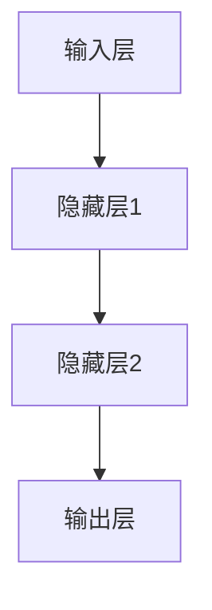
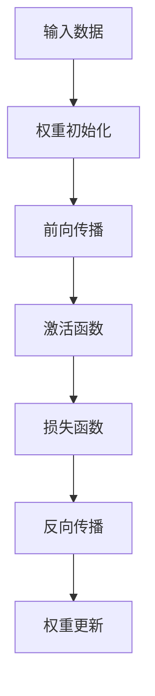
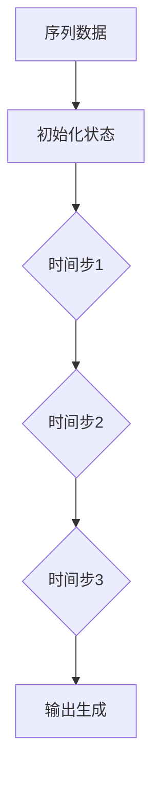
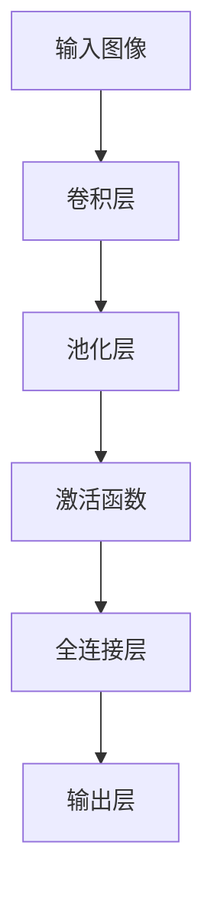

                 

### 文章标题

神经网络：人类与机器的共存

> 关键词：神经网络、机器学习、人工智能、人类合作、共存

摘要：本文旨在探讨神经网络技术如何促进人类与机器的共存。通过介绍神经网络的原理、核心算法和实际应用，文章阐述了神经网络在人工智能领域的巨大潜力，以及如何通过合理设计和应用，实现人类与机器的高效合作与协同发展。

### 1. 背景介绍（Background Introduction）

神经网络（Neural Networks）是一种模仿人脑工作机制的计算模型，由大量相互连接的节点（神经元）组成。神经网络通过学习输入数据，自动提取特征并进行分类、预测等任务，从而实现人工智能的各种应用。

机器学习（Machine Learning）是人工智能的一个重要分支，通过训练算法使计算机系统能够从数据中学习并改进性能。神经网络作为机器学习的一种重要方法，已成为推动人工智能发展的重要力量。

近年来，随着计算能力的提升和大数据的涌现，神经网络技术取得了长足的进步。从简单的感知机到复杂的深度神经网络，神经网络在图像识别、语音识别、自然语言处理等多个领域取得了显著的成果。如今，神经网络已深入到我们日常生活的方方面面，从智能手机的语音助手，到自动驾驶汽车，再到医疗诊断和金融分析，神经网络都在发挥着重要作用。

### 2. 核心概念与联系（Core Concepts and Connections）

#### 2.1 神经元与神经网络

神经元（Neuron）是神经网络的基本构建块，它由输入层、输出层和隐藏层组成。每个神经元接收来自其他神经元的输入信号，并通过权重进行加权求和，最后通过激活函数输出结果。

神经网络（Neural Network）由多个神经元组成，通过层层连接形成网络结构。输入层接收外部输入数据，输出层产生最终输出结果，隐藏层则负责特征提取和转换。

下面是神经网络的一个简化 Mermaid 流程图：

#### 2.2 神经网络的分类

根据网络结构的复杂程度，神经网络可以分为以下几种类型：

1. **前馈神经网络（Feedforward Neural Network）**：输入数据从输入层流向输出层，不进行反向传播。
2. **循环神经网络（Recurrent Neural Network, RNN）**：具有循环结构，可以处理序列数据。
3. **卷积神经网络（Convolutional Neural Network, CNN）**：适用于图像处理，具有局部连接和平移不变性。
4. **生成对抗网络（Generative Adversarial Network, GAN）**：由生成器和判别器两个神经网络组成，通过对抗训练生成高质量的数据。

#### 2.3 神经网络与机器学习

神经网络是机器学习的一种实现方式，通过训练算法使网络能够自动调整权重，从而提高性能。常见的神经网络训练算法包括：

1. **反向传播算法（Backpropagation Algorithm）**：通过计算损失函数的梯度，反向更新网络权重。
2. **随机梯度下降（Stochastic Gradient Descent, SGD）**：以随机方式选择训练样本，计算梯度并更新权重。
3. **Adam优化器（Adam Optimizer）**：结合了SGD和动量法的优点，适合大规模训练任务。

神经网络与机器学习的联系可以概括为：神经网络是实现机器学习任务的一种模型，而机器学习则是神经网络训练和优化的过程。

### 3. 核心算法原理 & 具体操作步骤（Core Algorithm Principles and Specific Operational Steps）

#### 3.1 前馈神经网络的工作原理

前馈神经网络的工作原理可以分为以下几个步骤：

1. **初始化权重**：随机初始化网络权重。
2. **前向传播**：将输入数据传递到网络的各个层次，计算每个神经元的输出。
3. **激活函数**：对每个神经元的输出应用激活函数，如 sigmoid、ReLU 等。
4. **损失函数**：计算网络输出与真实值之间的误差，常用的损失函数包括均方误差（MSE）和交叉熵（Cross Entropy）。
5. **反向传播**：计算损失函数关于网络权重的梯度，反向更新权重。

下面是一个简化的前馈神经网络的具体操作步骤：

#### 3.2 循环神经网络的工作原理

循环神经网络（RNN）可以处理序列数据，其工作原理可以分为以下几个步骤：

1. **初始化状态**：初始化隐藏状态和细胞状态。
2. **前向传播**：在每个时间步，将输入数据传递到隐藏层，更新隐藏状态。
3. **时间步循环**：重复步骤 2，直到处理完整个序列。
4. **输出生成**：根据隐藏状态生成最终输出。

下面是一个简化的循环神经网络的具体操作步骤：

#### 3.3 卷积神经网络的工作原理

卷积神经网络（CNN）适用于图像处理，其工作原理可以分为以下几个步骤：

1. **卷积层**：使用卷积核在输入图像上滑动，计算卷积结果。
2. **池化层**：对卷积结果进行下采样，减少参数数量。
3. **激活函数**：对每个卷积结果应用激活函数。
4. **全连接层**：将池化后的特征映射到输出层。

下面是一个简化的卷积神经网络的具体操作步骤：

### 4. 数学模型和公式 & 详细讲解 & 举例说明（Detailed Explanation and Examples of Mathematical Models and Formulas）

#### 4.1 前馈神经网络的数学模型

前馈神经网络的数学模型主要包括以下几个部分：

1. **激活函数**：常用的激活函数有 sigmoid、ReLU 等。

   - **sigmoid 函数**：
     $$ f(x) = \frac{1}{1 + e^{-x}} $$

   - **ReLU 函数**：
     $$ f(x) = \max(0, x) $$

2. **损失函数**：常用的损失函数有均方误差（MSE）和交叉熵（Cross Entropy）。

   - **均方误差（MSE）**：
     $$ L(y, \hat{y}) = \frac{1}{2} \sum_{i=1}^{n} (y_i - \hat{y}_i)^2 $$

   - **交叉熵（Cross Entropy）**：
     $$ L(y, \hat{y}) = - \sum_{i=1}^{n} y_i \log \hat{y}_i $$

3. **反向传播算法**：反向传播算法用于计算损失函数关于网络权重的梯度，具体计算公式如下：

   - **前向传播**：
     $$ z_i = \sum_{j=1}^{m} w_{ij} x_j + b_i $$
     $$ \hat{y}_i = f(z_i) $$

   - **反向传播**：
     $$ \delta_i = \frac{\partial L}{\partial z_i} \odot \frac{\partial f}{\partial \hat{y}_i} $$
     $$ \Delta w_{ij} = \alpha \delta_i x_j $$
     $$ \Delta b_i = \alpha \delta_i $$

#### 4.2 循环神经网络的数学模型

循环神经网络的数学模型主要包括以下几个部分：

1. **初始化状态**：
   $$ h_0 = h_0^0 $$
   $$ c_0 = c_0^0 $$

2. **时间步 t 的前向传播**：
   $$ i_t = \sigma(W_{ix}x_t + W_{ih}h_{t-1} + b_i) $$
   $$ f_t = \sigma(W_{fx}x_t + W_{fh}h_{t-1} + b_f) $$
   $$ o_t = \sigma(W_{ox}x_t + W_{oh}h_{t-1} + b_o) $$
   $$ g_t = f_t \odot c_{t-1} $$
   $$ c_t = \tan

