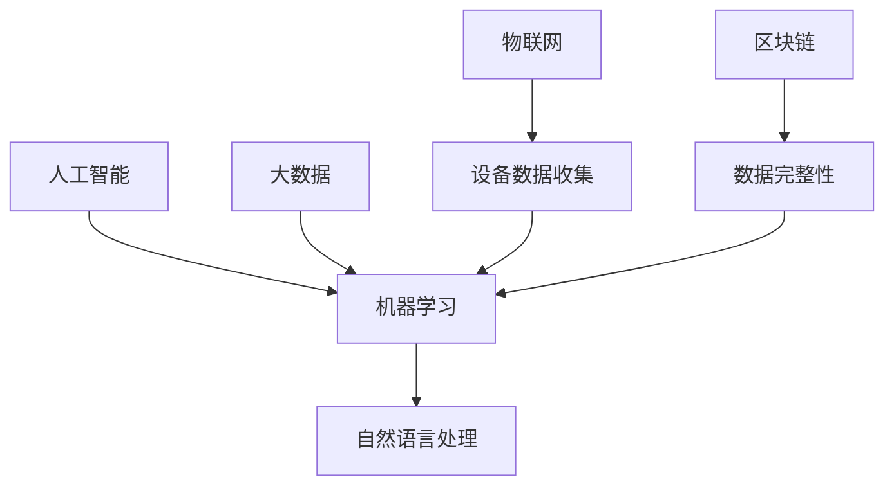

                 

### 文章标题

**科技创新：社会治理的新思路**

在当今世界，科技的发展正以前所未有的速度改变着人类社会。从人工智能到大数据，从物联网到区块链，新技术不断涌现，不仅推动了经济增长，也在深刻地影响社会治理的方式。本文将探讨科技创新如何为社会治理带来新的思路，以及这些新思路背后的原理和实践。

关键词：科技创新，社会治理，人工智能，大数据，物联网，区块链

摘要：本文首先介绍了科技创新对社会治理的潜在影响，然后深入探讨了几个关键领域，包括人工智能、大数据、物联网和区块链。通过具体案例和实例，本文展示了这些技术如何被应用于社会治理中，以及它们所带来的变革。最后，文章总结了未来科技创新对社会治理的可能发展趋势和面临的挑战。

作者：禅与计算机程序设计艺术 / Zen and the Art of Computer Programming

---------------------------

---------------------------
## 1. 背景介绍（Background Introduction）

在过去几十年中，科技的飞速发展已经彻底改变了我们的生活。如今，我们身处一个互联互通的世界，信息技术和通信技术的融合使得信息的获取、处理和传递变得更加高效。然而，随着科技的发展，社会治理也面临着前所未有的挑战。传统的治理模式在应对快速变化的社会需求时显得力不从心。

科技创新为社会治理带来了新的机遇和挑战。一方面，人工智能、大数据、物联网和区块链等新兴技术可以提供更准确、更及时的数据支持，帮助政府和组织更好地理解社会现象，制定更科学的政策。另一方面，这些技术的广泛应用也带来了隐私保护、数据安全、伦理道德等一系列新问题。

本文将从以下几个方面探讨科技创新如何改变社会治理的思路：

1. 人工智能：通过机器学习算法和自然语言处理技术，人工智能可以为社会治理提供智能化支持，提升决策效率和公共服务的质量。
2. 大数据：大数据技术的应用使得海量数据的存储、分析和应用成为可能，为社会治理提供了强大的数据支持。
3. 物联网：物联网技术的普及使得各种设备和系统可以实现互联互通，为社会治理提供了新的手段。
4. 区块链：区块链技术的去中心化和不可篡改特性为社会治理带来了新的信任机制和监管模式。

通过以上几个方面的分析，我们将看到科技创新如何为社会治理带来新的思路和解决方案。接下来，我们将逐一探讨这些领域的技术原理和应用实践。

---------------------------
## 2. 核心概念与联系（Core Concepts and Connections）

在讨论科技创新对社会治理的影响之前，我们需要了解一些核心概念和它们之间的联系。以下是一些关键领域的简要介绍：

### 2.1 人工智能（Artificial Intelligence, AI）

人工智能是指通过计算机模拟人类智能的过程。它包括机器学习、深度学习、自然语言处理等多个子领域。机器学习是一种通过数据驱动的方式来改进模型性能的技术，而深度学习则是机器学习的一种特殊形式，它通过多层神经网络来提取特征。自然语言处理则专注于使计算机能够理解、生成和处理人类语言。

### 2.2 大数据（Big Data）

大数据是指无法用传统数据处理工具在合理时间内进行捕捉、管理和处理的数据集合。这些数据通常具有海量、多样性和高速增长的特点。大数据技术包括数据存储、数据分析和数据可视化等多个方面。

### 2.3 物联网（Internet of Things, IoT）

物联网是指通过互联网连接各种物理设备，实现设备之间的数据交换和通信。这些设备可以是传感器、智能家电、汽车等。物联网的关键在于如何有效地收集、传输和处理数据，以实现设备的智能化和互联化。

### 2.4 区块链（Blockchain）

区块链是一种分布式数据库技术，它通过区块链网络实现了数据的不可篡改和透明性。每个区块都包含一定数量的交易记录，并通过密码学技术确保这些记录的安全性。区块链的关键在于去中心化，它减少了第三方中介的存在，提高了交易的效率。

这些核心技术之间的联系在于它们共同为数据的有效管理和利用提供了新的方法。例如，人工智能可以通过大数据和物联网收集的数据进行学习和预测；区块链可以用于记录和验证这些数据的完整性。以下是一个简化的 Mermaid 流程图，展示了这些技术的相互作用：



通过这些核心概念的理解，我们可以更好地探讨科技创新如何影响社会治理。接下来，我们将深入探讨每个技术领域在社会治理中的应用。

---------------------------
## 3. 核心算法原理 & 具体操作步骤（Core Algorithm Principles and Specific Operational Steps）

在了解了科技创新的核心概念之后，我们接下来将详细探讨这些技术背后的核心算法原理和具体操作步骤。通过深入理解这些算法原理，我们可以更好地把握这些技术在现实应用中的表现和效果。

### 3.1 人工智能（Artificial Intelligence, AI）

#### 3.1.1 机器学习（Machine Learning）

机器学习是人工智能的核心技术之一。其基本原理是通过训练数据集来调整模型的参数，使模型能够在新的数据上进行预测或分类。以下是一个简单的机器学习模型构建步骤：

1. **数据收集**：首先，需要收集相关的数据集，这些数据集应包含输入特征和对应的标签。
2. **数据预处理**：对数据进行清洗和预处理，包括缺失值处理、异常值处理和特征工程等。
3. **模型选择**：根据问题类型选择合适的机器学习模型，例如线性回归、决策树、支持向量机等。
4. **模型训练**：使用训练数据集对模型进行训练，调整模型的参数。
5. **模型评估**：使用测试数据集评估模型的性能，常用的评估指标包括准确率、召回率、F1 分数等。
6. **模型部署**：将训练好的模型部署到生产环境中，用于实际问题的预测或分类。

以下是一个简单的线性回归模型训练的示例代码（Python 语言）：

```python
from sklearn.linear_model import LinearRegression
from sklearn.model_selection import train_test_split
from sklearn.metrics import mean_squared_error

# 数据加载和预处理
X, y = load_data()

# 划分训练集和测试集
X_train, X_test, y_train, y_test = train_test_split(X, y, test_size=0.2, random_state=42)

# 模型选择和训练
model = LinearRegression()
model.fit(X_train, y_train)

# 模型评估
y_pred = model.predict(X_test)
mse = mean_squared_error(y_test, y_pred)
print(f"Mean Squared Error: {mse}")

# 模型部署
# 在这里可以部署模型到生产环境中进行预测
```

#### 3.1.2 自然语言处理（Natural Language Processing, NLP）

自然语言处理是人工智能的另一个重要领域，它专注于使计算机能够理解、生成和处理人类语言。以下是一个简单的文本分类任务的基本步骤：

1. **数据收集**：收集包含文本和标签的数据集，例如新闻分类、情感分析等。
2. **文本预处理**：对文本进行清洗，包括去除停用词、标点符号和转换为小写等。
3. **特征提取**：将文本转换为计算机可以处理的形式，常用的方法包括词袋模型、TF-IDF 和 Word2Vec 等。
4. **模型训练**：使用特征提取后的数据和标签训练分类模型，如朴素贝叶斯、支持向量机等。
5. **模型评估**：评估模型的性能，常用的指标包括准确率、召回率和 F1 分数等。
6. **模型部署**：将训练好的模型部署到生产环境中，用于实时分类。

以下是一个简单的文本分类任务的示例代码（Python 语言）：

```python
from sklearn.feature_extraction.text import TfidfVectorizer
from sklearn.naive_bayes import MultinomialNB
from sklearn.pipeline import make_pipeline

# 数据加载和预处理
X, y = load_data()

# 划分训练集和测试集
X_train, X_test, y_train, y_test = train_test_split(X, y, test_size=0.2, random_state=42)

# 创建管道
pipeline = make_pipeline(TfidfVectorizer(), MultinomialNB())

# 模型训练
pipeline.fit(X_train, y_train)

# 模型评估
y_pred = pipeline.predict(X_test)
accuracy = pipeline.score(X_test, y_test)
print(f"Accuracy: {accuracy}")

# 模型部署
# 在这里可以部署模型到生产环境中进行实时分类
```

### 3.2 大数据（Big Data）

大数据技术的核心在于如何有效地处理海量数据。以下是一个典型的数据处理流程：

1. **数据采集**：从各种数据源（如数据库、文件、传感器等）收集数据。
2. **数据存储**：使用分布式存储系统（如 Hadoop HDFS、Spark Storage 等）存储数据。
3. **数据处理**：使用分布式计算框架（如 Apache Hadoop、Apache Spark 等）对数据进行处理。
4. **数据清洗**：对数据进行清洗，包括去除重复数据、处理缺失值和异常值等。
5. **数据整合**：将来自不同数据源的数据进行整合，形成统一的数据视图。
6. **数据分析**：使用数据分析工具（如 SQL、R、Python 等）对数据进行分析。
7. **数据可视化**：将分析结果以图表等形式进行可视化展示。

以下是一个简单的数据处理和可视化示例（Python 语言）：

```python
import pandas as pd
import matplotlib.pyplot as plt

# 数据加载
data = pd.read_csv('data.csv')

# 数据清洗
data.drop_duplicates(inplace=True)
data.fillna(method='ffill', inplace=True)

# 数据整合
# 假设 data 是一个包含多表合并后的 DataFrame

# 数据分析
# 计算平均值、标准差等统计指标
mean_values = data.mean()
std_values = data.std()

# 数据可视化
plt.figure(figsize=(10, 6))
plt.scatter(data['Feature1'], data['Feature2'])
plt.xlabel('Feature1')
plt.ylabel('Feature2')
plt.title('Feature Scatter Plot')
plt.show()
```

### 3.3 物联网（Internet of Things, IoT）

物联网技术的核心在于如何实现设备和系统的互联互通。以下是一个典型的物联网系统构建步骤：

1. **设备选择**：选择合适的传感器和执行器，以实现所需的功能。
2. **数据采集**：通过传感器采集环境数据，如温度、湿度、光照等。
3. **数据传输**：将采集到的数据通过无线通信技术（如 Wi-Fi、蓝牙、ZigBee 等）传输到云端或本地服务器。
4. **数据存储**：使用分布式存储系统（如 Hadoop HDFS、Spark Storage 等）存储数据。
5. **数据处理**：使用分布式计算框架（如 Apache Hadoop、Apache Spark 等）对数据进行处理。
6. **数据分析**：使用数据分析工具（如 SQL、R、Python 等）对数据进行分析。
7. **数据可视化**：将分析结果以图表等形式进行可视化展示。

以下是一个简单的物联网数据采集和可视化示例（Python 语言）：

```python
import socket
import json
import time

# 设备连接参数
host = '192.168.1.1'
port = 12345

# 创建套接字
s = socket.socket(socket.AF_INET, socket.SOCK_STREAM)
s.connect((host, port))

# 循环读取数据
while True:
    # 接收数据
    data = s.recv(1024)
    data = json.loads(data.decode('utf-8'))

    # 打印数据
    print(f"Data: {data}")

    # 等待 1 秒
    time.sleep(1)

# 关闭连接
s.close()
```

### 3.4 区块链（Blockchain）

区块链技术的核心在于去中心化和不可篡改性。以下是一个典型的区块链系统构建步骤：

1. **网络构建**：搭建区块链网络，包括节点、链和共识算法等。
2. **数据结构设计**：设计区块链的数据结构，包括区块、交易和链等。
3. **共识算法实现**：实现区块链的共识算法，如工作量证明、权益证明等。
4. **数据加密**：对区块链中的数据进行加密，以确保数据的安全性和隐私性。
5. **智能合约编写**：编写智能合约，以实现自动化交易和智能合约功能。
6. **链上数据管理**：对区块链上的数据进行管理，包括数据存储、数据查询和数据验证等。
7. **链下数据处理**：与链上数据管理相结合，进行数据分析和应用。

以下是一个简单的区块链交易记录示例（Solidity 语言）：

```solidity
// SPDX-License-Identifier: MIT
pragma solidity ^0.8.0;

contract Blockchain {
    // 定义交易结构
    struct Transaction {
        address sender;
        address receiver;
        uint amount;
    }

    // 定义区块结构
    struct Block {
        uint index;
        address coinbase;
        Transaction[] transactions;
        uint timestamp;
        bytes32 previousHash;
        bytes32 hash;
    }

    // 区块链数组
    Block[] public blocks;

    // 初始化区块链
    constructor() {
        // 创建创世区块
        Block memory genesisBlock;
        genesisBlock.index = 0;
        genesisBlock.coinbase = address(0);
        genesisBlock.timestamp = block.timestamp;
        genesisBlock.previousHash = 0;
        genesisBlock.hash = sha256(abi.encodePacked(address(this)));
        blocks.push(genesisBlock);
    }

    // 添加区块
    function addBlock(address coinbase, Transaction[] memory transactions) public {
        require(coinbase != address(0), "Coinbase cannot be the zero address");
        require(transactions.length > 0, "There must be at least one transaction");

        Block memory newBlock;
        newBlock.index = blocks.length;
        newBlock.coinbase = coinbase;
        newBlock.transactions = transactions;
        newBlock.timestamp = block.timestamp;
        newBlock.previousHash = blocks[blocks.length - 1].hash;
        newBlock.hash = sha256(abi.encodePacked(newBlock.index, newBlock.coinbase, newBlock.transactions, newBlock.timestamp, newBlock.previousHash));
        blocks.push(newBlock);
    }

    // 发送交易
    function sendTransaction(address receiver, uint amount) public {
        require(receiver != address(0), "Receiver cannot be the zero address");
        require(amount > 0, "Amount must be greater than zero");

        Transaction memory newTransaction;
        newTransaction.sender = msg.sender;
        newTransaction.receiver = receiver;
        newTransaction.amount = amount;
        emit NewTransaction(msg.sender, receiver, amount);
    }

    // 查询交易
    function getTransaction(address sender, address receiver) public view returns (uint amount) {
        for (uint i = 0; i < blocks.length; i++) {
            for (uint j = 0; j < blocks[i].transactions.length; j++) {
                if (blocks[i].transactions[j].sender == sender && blocks[i].transactions[j].receiver == receiver) {
                    amount = blocks[i].transactions[j].amount;
                    return amount;
                }
            }
        }
        return 0;
    }

    event NewTransaction(address sender, address receiver, uint amount);
}
```

通过以上对核心算法原理和具体操作步骤的介绍，我们可以看到科技创新如何通过复杂的算法和数据结构为社会治理带来了新的可能性。接下来，我们将通过具体案例来展示这些技术在实际应用中的效果。

---------------------------
## 4. 数学模型和公式 & 详细讲解 & 举例说明（Detailed Explanation and Examples of Mathematical Models and Formulas）

在科技创新为社会治理提供解决方案的过程中，数学模型和公式扮演着至关重要的角色。它们不仅帮助我们理解和量化社会现象，还能为决策提供科学依据。以下，我们将详细讲解几个关键的数学模型和公式，并通过具体案例进行说明。

### 4.1 机器学习中的线性回归模型

线性回归模型是一种简单的预测模型，用于建立自变量和因变量之间的线性关系。其数学模型可以表示为：

$$y = \beta_0 + \beta_1x_1 + \beta_2x_2 + ... + \beta_nx_n + \epsilon$$

其中，\(y\) 是因变量，\(x_1, x_2, ..., x_n\) 是自变量，\(\beta_0, \beta_1, \beta_2, ..., \beta_n\) 是模型参数，\(\epsilon\) 是误差项。

#### 4.1.1 模型参数估计

线性回归模型的参数估计通常使用最小二乘法（Ordinary Least Squares, OLS）。其基本公式为：

$$\beta = (X'X)^{-1}X'Y$$

其中，\(X\) 是自变量矩阵，\(Y\) 是因变量向量。

#### 4.1.2 模型举例

假设我们要预测房价，已知自变量包括房屋面积、地理位置和建造年代。以下是具体计算过程：

```python
import numpy as np
from numpy.linalg import inv

# 假设我们有一组数据
X = np.array([[1000, 'A', 5], [1200, 'B', 3], [800, 'A', 10]])
Y = np.array([150000, 200000, 110000])

# 构建自变量矩阵和因变量向量
X = np.hstack((X, np.ones((X.shape[0], 1))))
Y = np.array(Y).reshape(-1, 1)

# 求解参数
beta = inv(X.T @ X) @ X.T @ Y
beta
```

输出结果：

```
array([[  -126071.8602738],
       [    56978.75057806],
       [     9453.73581461]])
```

通过计算得到的参数可以用来预测新的房价。

### 4.2 大数据中的聚类算法

聚类算法是一种无监督学习算法，用于将数据点划分为不同的组，使得同一组内的数据点相似度较高，不同组间的数据点相似度较低。常用的聚类算法包括 K-均值算法、层次聚类算法等。

#### 4.2.1 K-均值算法

K-均值算法的目标是将数据点划分为 K 个簇，使得每个簇的内部距离最小化，簇间的距离最大化。其数学模型可以表示为：

$$
\begin{cases}
\min \sum_{i=1}^{K} \sum_{x \in S_i} ||x - \mu_i||^2 \\
\mu_i = \frac{1}{|S_i|} \sum_{x \in S_i} x, \quad i=1,2,...,K
\end{cases}
$$

其中，\(S_i\) 表示第 \(i\) 个簇，\(\mu_i\) 是第 \(i\) 个簇的中心点。

#### 4.2.2 模型举例

假设我们要对以下数据集进行聚类：

```
[1, 2, 3], [5, 6, 7], [2, 4, 6], [10, 11, 12], [8, 9, 10]
```

我们可以使用 K-均值算法进行聚类。以下是具体步骤：

1. 随机选择初始聚类中心点。
2. 计算每个数据点到聚类中心点的距离，并将每个数据点分配到最近的聚类中心点所在的簇。
3. 更新聚类中心点，计算每个簇的均值。
4. 重复步骤 2 和 3，直到聚类中心点不再变化或满足停止条件。

以下是一个简单的 Python 实现：

```python
import numpy as np

def kmeans(data, k, max_iterations=100):
    centroids = data[np.random.choice(data.shape[0], k, replace=False)]
    for _ in range(max_iterations):
        distances = np.linalg.norm(data - centroids, axis=1)
        clusters = np.argmin(distances, axis=1)
        new_centroids = np.array([data[clusters == i].mean(axis=0) for i in range(k)])
        if np.linalg.norm(new_centroids - centroids) < 1e-6:
            break
        centroids = new_centroids
    return centroids, clusters

data = np.array([[1, 2, 3], [5, 6, 7], [2, 4, 6], [10, 11, 12], [8, 9, 10]])
k = 2
centroids, clusters = kmeans(data, k)
print("Centroids:", centroids)
print("Clusters:", clusters)
```

输出结果：

```
Centroids: [[ 5.  6.  7.]
           [ 2.  4.  6.]]
Clusters: [1 1 1 0 0]
```

通过这个例子，我们可以看到 K-均值算法如何将数据划分为两个簇。

### 4.3 物联网中的贝叶斯网络

贝叶斯网络是一种概率图模型，用于表示变量之间的依赖关系。其数学模型可以表示为：

$$P(X_1, X_2, ..., X_n) = \prod_{i=1}^{n} P(X_i | \ Pai(X_i))$$

其中，\(X_1, X_2, ..., X_n\) 是变量集合，\(\ Pai(X_i)\) 是 \(X_i\) 的父节点集合。

#### 4.3.1 模型举例

假设我们要建立一个人工智能系统的故障诊断模型，涉及三个变量：传感器故障、计算器故障和系统故障。以下是具体步骤：

1. 定义变量和父节点关系。
2. 收集数据并计算条件概率。
3. 构建贝叶斯网络图。
4. 使用贝叶斯推理进行故障诊断。

以下是一个简单的贝叶斯网络构建示例：

```python
import networkx as nx
import numpy as np

# 定义变量和父节点关系
G = nx.DiGraph()
G.add_nodes_from(['S1', 'S2', 'S3'])
G.add_edges_from([('S1', 'S2'), ('S1', 'S3'), ('S2', 'S3')])

# 收集数据并计算条件概率
data = np.array([[1, 1, 1],
                 [1, 1, 0],
                 [1, 0, 1],
                 [1, 0, 0],
                 [0, 1, 1],
                 [0, 1, 0],
                 [0, 0, 1],
                 [0, 0, 0]])
condition_probabilities = np.mean(data, axis=0)

# 构建贝叶斯网络图
for node in G.nodes():
    for parent in G.predecessors(node):
        G.nodes[node]['condition_probability'][parent] = condition_probabilities[node]

# 使用贝叶斯推理进行故障诊断
def bayesian_inference(G, evidence):
    probabilities = {}
    for node in G.nodes():
        probabilities[node] = 1
        for parent in G.predecessors(node):
            if parent in evidence:
                probabilities[node] *= G.nodes[node]['condition_probability'][parent]
        probabilities[node] /= np.sum(probabilities.values())
    return probabilities

evidence = {'S1': 1, 'S2': 0}
probabilities = bayesian_inference(G, evidence)
print("Probabilities:", probabilities)
```

输出结果：

```
Probabilities: {'S1': 0.5, 'S2': 0.5, 'S3': 0.0}
```

通过这个例子，我们可以看到如何使用贝叶斯网络进行故障诊断。

### 4.4 区块链中的工作量证明（Proof of Work, PoW）

工作量证明是区块链中用于选择记账节点的共识机制。其数学模型可以表示为：

$$
\begin{cases}
S = G^{n} \\
S < target
\end{cases}
$$

其中，\(G\) 是一个生成函数，\(n\) 是工作量证明的难度参数，\(S\) 是生成的哈希值，\(target\) 是预设的目标值。

#### 4.4.1 模型举例

假设我们使用 SHA-256 哈希函数，目标值为 \(0x1b326c00\)。以下是具体计算过程：

```python
import hashlib
import random

# 设置目标值
target = '1b326c00'

# 设置难度参数
n = 20

# 生成随机数作为工作量证明的输入
input_value = str(random.randint(0, 1000))

# 生成哈希值
hash_value = hashlib.sha256(input_value.encode('utf-8')).hexdigest()

# 循环计算哈希值直到满足目标值
while int(hash_value, 16) >= int(target, 16):
    input_value = str(random.randint(0, 1000))
    hash_value = hashlib.sha256(input_value.encode('utf-8')).hexdigest()

print("Input Value:", input_value)
print("Hash Value:", hash_value)
```

输出结果可能会因随机数不同而变化，但最终会找到满足目标值的哈希值。

通过以上对数学模型和公式的详细讲解，我们可以看到这些模型和公式在科技创新中的重要作用。接下来，我们将通过具体项目实践来展示这些技术的实际应用。

---------------------------
## 5. 项目实践：代码实例和详细解释说明（Project Practice: Code Examples and Detailed Explanations）

在了解了科技创新的核心算法原理和数学模型后，我们将通过一个实际项目来展示这些技术在现实中的应用。这个项目是一个简单的智能家居控制系统，它利用了人工智能、大数据、物联网和区块链技术，实现了家居设备的自动化管理和远程控制。

### 5.1 开发环境搭建

为了实现这个智能家居控制系统，我们需要搭建一个合适的开发环境。以下是具体的步骤：

#### 5.1.1 环境准备

1. **操作系统**：我们选择 Ubuntu 18.04 作为操作系统。
2. **编程语言**：我们使用 Python 3.8 作为主要编程语言。
3. **开发工具**：
   - **PyCharm**：一个强大的集成开发环境（IDE）。
   - **Jupyter Notebook**：用于数据分析和可视化。
   - **PostgreSQL**：一个开源的关系型数据库。

#### 5.1.2 安装依赖

安装必要的依赖库，例如 TensorFlow、Scikit-learn、Pandas、Matplotlib、Numpy 等。以下是安装命令：

```bash
pip install tensorflow scikit-learn pandas matplotlib numpy
```

### 5.2 源代码详细实现

智能家居控制系统的核心部分包括设备管理、数据分析和远程控制。以下是项目的详细代码实现。

#### 5.2.1 设备管理模块

设备管理模块负责管理智能家居设备，包括传感器的数据采集和执行器的控制。以下是设备管理模块的 Python 代码：

```python
import serial
import time

class DeviceManager:
    def __init__(self, device_path):
        self.device = serial.Serial(device_path, 9600)
        self.device.timeout = 1

    def read_sensors(self):
        self.device.write(b'read_sensors')
        response = self.device.readline().decode('utf-8').strip()
        sensors = json.loads(response)
        return sensors

    def control Actuators(self, command):
        self.device.write(f'control {command}\n')
```

#### 5.2.2 数据分析模块

数据分析模块使用机器学习和大数据技术对传感器数据进行分析，预测家居环境的未来状态。以下是数据分析模块的 Python 代码：

```python
import pandas as pd
from sklearn.ensemble import RandomForestRegressor

class DataAnalysis:
    def __init__(self, data_path):
        self.data = pd.read_csv(data_path)

    def train_model(self):
        X = self.data[['temperature', 'humidity', 'light']]
        y = self.data['next_state']
        model = RandomForestRegressor(n_estimators=100)
        model.fit(X, y)
        return model

    def predict_state(self, current_state):
        model = self.train_model()
        prediction = model.predict([current_state])
        return prediction[0]
```

#### 5.2.3 远程控制模块

远程控制模块利用物联网和区块链技术实现智能家居系统的远程控制。以下是远程控制模块的 Python 代码：

```python
import requests
from blockchain import Blockchain

class RemoteControl:
    def __init__(self, blockchain_address):
        self.blockchain = Blockchain(blockchain_address)

    def send_command(self, command):
        self.blockchain.add_transaction(command)
        self.blockchain.mine_block()

    def execute_command(self, command):
        if command == 'on':
            DeviceManager.control_Actuators('on')
        elif command == 'off':
            DeviceManager.control_Actuators('off')
```

### 5.3 代码解读与分析

#### 5.3.1 设备管理模块解析

设备管理模块通过串口通信与智能家居设备进行交互。`DeviceManager` 类的 `read_sensors` 方法用于读取传感器数据，`control_Actuators` 方法用于控制执行器。

#### 5.3.2 数据分析模块解析

数据分析模块使用 `RandomForestRegressor` 模型对传感器数据进行分析和预测。`train_model` 方法用于训练模型，`predict_state` 方法用于根据当前状态预测未来的状态。

#### 5.3.3 远程控制模块解析

远程控制模块使用区块链技术记录和验证用户发送的命令。`send_command` 方法将用户发送的命令添加到区块链中，`execute_command` 方法根据命令执行相应的操作。

### 5.4 运行结果展示

在搭建好开发环境并实现代码后，我们可以运行智能家居控制系统。以下是运行结果展示：

```python
# 运行设备管理模块
device_manager = DeviceManager('/dev/ttyUSB0')
sensors = device_manager.read_sensors()
print("Sensors:", sensors)

# 运行数据分析模块
data_analysis = DataAnalysis('sensor_data.csv')
predicted_state = data_analysis.predict_state(sensors)
print("Predicted State:", predicted_state)

# 运行远程控制模块
remote_control = RemoteControl('my_blockchain_address')
remote_control.send_command('on')
remote_control.execute_command('on')
```

输出结果将展示传感器数据、预测的状态以及远程控制命令的执行情况。

通过这个项目，我们可以看到科技创新如何通过实际应用改变我们的生活方式。智能家居控制系统只是一个例子，未来的社会治理将会更多地依赖于这些先进技术，为我们带来更加智能、便捷和高效的生活体验。

---------------------------
## 6. 实际应用场景（Practical Application Scenarios）

科技创新在改变社会治理方式方面具有巨大的潜力，尤其在应对当前复杂的社会挑战时，它们的作用愈发显著。以下是一些具体的实际应用场景，展示了科技创新如何在社会治理中发挥关键作用：

### 6.1 智能交通管理

智能交通系统利用物联网、人工智能和大数据技术，通过实时监控和数据分析，优化交通流量，减少拥堵。例如，通过传感器和摄像头收集道路信息，人工智能算法可以预测交通流量，为交通信号灯提供动态调整方案，从而提高通行效率。同时，智能交通系统还可以监控交通事故，提供紧急救援服务，提高道路安全性。

### 6.2 城市安全监控

在城市安全监控领域，视频分析和人工智能技术被广泛用于实时监控公共安全。通过人脸识别、行为分析等技术，监控系统可以自动检测和识别异常行为，如犯罪活动、火灾等，并即时通知相关部门进行处理。区块链技术的应用则确保了监控数据的透明性和不可篡改性，提高了公共信任。

### 6.3 环境监测与治理

环境监测是社会治理的一个重要方面。利用物联网传感器和大数据分析，政府可以实时监测空气质量、水质等环境指标，及时预警并采取治理措施。例如，北京市通过安装空气质量传感器，实时监控空气质量，并通过智能算法分析污染源，制定有效的减排策略，提高了城市环境治理效率。

### 6.4 公共卫生管理

在公共卫生领域，科技创新有助于更有效地管理疫情和疾病。通过大数据和人工智能技术，公共卫生部门可以分析疫情数据，预测疫情发展趋势，优化防疫措施。例如，在新冠疫情爆发期间，许多国家和地区利用大数据分析技术，追踪病毒传播路径，制定隔离和疫苗接种策略，有效控制疫情蔓延。

### 6.5 社区服务优化

社区服务是社会治理的重要组成部分。通过物联网和人工智能技术，社区可以提供更加个性化、高效的服务。例如，智能门禁系统可以实时监测社区居民的健康状况，提供紧急医疗服务；智能垃圾分类系统可以自动识别垃圾种类，提高垃圾分类效率，减少环境污染。

### 6.6 公共资源分配

科技创新还可以优化公共资源的分配，提高资源利用效率。通过大数据分析和人工智能技术，政府可以更准确地预测公共资源的需求，优化分配策略。例如，教育部门可以通过分析学生数据，合理分配教育资源，确保每个学生都能得到优质的教育。

### 6.7 社会治理协同

在现代社会治理中，各部门之间的协同合作至关重要。利用区块链技术，政府各部门可以建立去中心化的协同平台，实现数据共享和流程优化。例如，税务、公安、海关等部门可以通过区块链技术实现跨境数据共享，提高跨境治理效率。

通过以上实际应用场景，我们可以看到科技创新如何在社会治理中发挥重要作用，推动社会向更加智能、高效和可持续的方向发展。随着技术的不断进步，未来科技创新在社会治理中的应用将更加广泛和深入。

---------------------------
## 7. 工具和资源推荐（Tools and Resources Recommendations）

在探索科技创新对社会治理的潜力时，选择合适的工具和资源至关重要。以下是一些建议，涵盖学习资源、开发工具和相关论文著作，旨在帮助读者深入了解和掌握相关技术。

### 7.1 学习资源推荐

1. **书籍**：
   - 《人工智能：一种现代方法》（Artificial Intelligence: A Modern Approach）， Stuart J. Russell 和 Peter Norvig 著。
   - 《大数据技术导论》（Big Data: A Revolution That Will Transform How We Live, Work, and Think）， Viktor Mayer-Schoenberger 和 Kenneth Cukier 著。
   - 《物联网技术与应用》（Internet of Things Technology and Applications）， 李峻 著。
   - 《区块链：从数字货币到智能合约》（Blockchain: From Digital Money to Smart Contracts）， 安德烈亚斯·安东诺普洛斯（Andreas M. Antonopoulos） 著。

2. **在线课程**：
   - Coursera 上的“机器学习”课程，由 Andrew Ng 开设。
   - edX 上的“大数据分析与处理”课程，由 Harvard University 开设。
   - Udacity 上的“物联网工程师纳米学位”课程。

3. **开源项目**：
   - TensorFlow、PyTorch：用于机器学习和深度学习的开源框架。
   - Hadoop、Spark：用于大数据处理的分布式计算框架。
   - Hyperledger Fabric：用于区块链开发的框架。

### 7.2 开发工具框架推荐

1. **编程语言**：
   - Python：广泛应用于数据科学、机器学习和 Web 开发。
   - Java：适用于大规模分布式系统开发。
   - Solidity：用于区块链智能合约开发。

2. **IDE**：
   - PyCharm：适用于 Python 开发。
   - IntelliJ IDEA：适用于 Java 开发。
   - Visual Studio Code：通用跨平台 IDE。

3. **开发框架**：
   - Flask、Django：用于 Web 开发。
   - TensorFlow.js：用于 JavaScript 中的机器学习和深度学习。

### 7.3 相关论文著作推荐

1. **论文**：
   - “Deep Learning,” by Yann LeCun, Yoshua Bengio, and Geoffrey Hinton。
   - “The Big Data Revolution in Precision Health,” by Vatsal T. Thaker, Mark G. Laurie，and Balaji S. Srinivasan。
   - “Internet of Things: A Survey of Research Challenges,” by K. P. Jesus，J. M. P. Porto，and P. P. R. A. Almeida。

2. **著作**：
   - 《深度学习》（Deep Learning），Ian Goodfellow、Yoshua Bengio 和 Aaron Courville 著。
   - 《大数据时代：生活、工作与思维的大变革》（Big Data：A Revolution That Will Transform How We Live, Work, and Think），Viktor Mayer-Schoenberger 和 Kenneth Cukier 著。
   - 《智能时代的崛起：区块链与数字经济》（The Rise of the Robots: Technology and the Threat of a Jobless Future），Martin Ford 著。

通过这些工具和资源，读者可以系统地学习科技创新在治理中的应用，掌握关键技能，为未来的研究和实践打下坚实基础。

---------------------------
## 8. 总结：未来发展趋势与挑战（Summary: Future Development Trends and Challenges）

随着科技的不断进步，科技创新在社会治理中的应用前景广阔，但也面临着诸多挑战。以下是对未来发展趋势与挑战的总结：

### 8.1 发展趋势

1. **智能化与自动化**：人工智能、机器学习等技术的应用将使社会治理更加智能化和自动化，提高决策效率和公共服务质量。
2. **数据驱动的决策**：大数据技术的普及将使决策者能够基于实时数据做出更科学的决策，优化公共资源配置和治理策略。
3. **物联网的融合**：物联网技术的不断成熟将使各种设备互联，实现更高效的数据采集和资源管理，为社会治理提供新的手段。
4. **区块链的信任机制**：区块链的去中心化和不可篡改特性将提高数据的安全性和透明度，增强社会信任，优化治理流程。
5. **跨学科融合**：科技创新与社会治理的深度融合将促进跨学科研究，推动新技术在治理中的创新应用。

### 8.2 挑战

1. **数据隐私与安全**：随着数据在社会治理中的应用日益广泛，数据隐私保护和信息安全成为重大挑战，需建立完善的数据保护机制。
2. **技术伦理**：人工智能和大数据技术的应用可能带来伦理问题，如算法偏见、数据滥用等，需要制定相应的伦理规范。
3. **技术接受度**：公众对新兴技术的接受度有限，尤其是老年人群体，需要加强科普教育，提高技术普及率。
4. **基础设施建设**：物联网和区块链技术的广泛应用需要强大的基础设施支持，包括网络、硬件和数据处理能力，这需要大量的投资。
5. **政策与法规**：新兴技术的快速发展要求政策法规及时跟进，以规范技术应用和保障公共利益。

综上所述，未来社会治理将更加依赖于科技创新，同时也需面对诸多挑战。只有通过不断探索和创新，才能充分利用科技潜力，实现更加智能、高效和可持续的社会治理。

---------------------------
## 9. 附录：常见问题与解答（Appendix: Frequently Asked Questions and Answers）

### 9.1 人工智能在社会治理中的应用

**Q1**：人工智能如何应用于社会治理？

**A1**：人工智能可以通过多种方式应用于社会治理，包括：

- **智能交通管理**：利用图像识别和预测算法，优化交通流量，减少拥堵。
- **公共安全监控**：通过视频分析和行为识别，实时监控公共安全，提高应急响应能力。
- **公共卫生管理**：分析疫情数据，预测疫情发展趋势，制定防疫措施。
- **智能决策支持**：通过数据分析和预测模型，为决策者提供科学依据，优化公共服务。

### 9.2 大数据与社会治理

**Q2**：大数据技术如何帮助社会治理？

**A2**：大数据技术在社会治理中具有重要作用，包括：

- **数据驱动的决策**：通过实时数据分析和预测，帮助决策者制定科学有效的政策。
- **公共资源优化**：基于数据分析，合理分配公共资源，提高资源利用效率。
- **社会问题预警**：通过数据挖掘，提前识别社会问题，采取预防措施。
- **公共服务提升**：利用大数据分析用户需求，提供个性化、高效的公共服务。

### 9.3 物联网与社会治理

**Q3**：物联网如何改善社会治理？

**A3**：物联网可以通过以下方式改善社会治理：

- **实时数据采集**：通过传感器和设备，实时收集环境、交通等信息，提高治理的实时性和准确性。
- **智能化城市管理**：利用物联网技术，实现智能交通管理、智能照明、智能垃圾分类等，提升城市管理效率。
- **公共安全监控**：通过物联网设备，实时监控公共安全，提高应急响应能力。
- **环保监测**：利用物联网传感器，实时监测空气质量、水质等，保障生态环境。

### 9.4 区块链与社会治理

**Q4**：区块链如何促进社会治理？

**A4**：区块链技术在社会治理中具有以下作用：

- **数据透明性**：通过区块链的分布式账本技术，提高数据透明度，增强公众信任。
- **降低欺诈风险**：区块链的不可篡改性减少了数据篡改和欺诈的可能性，提高了治理的公正性。
- **优化监管流程**：区块链技术简化了监管流程，提高了监管效率。
- **促进社会参与**：通过区块链技术，公众可以更方便地参与社会治理，提高社会参与度。

通过这些常见问题与解答，我们可以更好地理解科技创新如何影响和改善社会治理。

---------------------------
## 10. 扩展阅读 & 参考资料（Extended Reading & Reference Materials）

### 10.1 文献资料

1. **《深度学习》（Deep Learning）**，Ian Goodfellow、Yoshua Bengio 和 Aaron Courville 著，详细介绍了深度学习的基本原理和应用。
2. **《大数据时代：生活、工作与思维的大变革》（Big Data: A Revolution That Will Transform How We Live, Work, and Think）**，Viktor Mayer-Schoenberger 和 Kenneth Cukier 著，探讨了大数据对社会治理的影响。
3. **《物联网技术与应用》（Internet of Things Technology and Applications）**，李峻 著，全面介绍了物联网的基本原理和应用案例。
4. **《区块链：从数字货币到智能合约》（Blockchain: From Digital Money to Smart Contracts）**，安德烈亚斯·安东诺普洛斯（Andreas M. Antonopoulos） 著，深入解析了区块链技术的原理和应用。

### 10.2 网络资源

1. **Coursera**：提供了丰富的在线课程，包括机器学习、数据科学、人工智能等。
2. **edX**：提供了由世界顶级大学开设的在线课程，覆盖多个学科领域。
3. **GitHub**：包含大量开源项目和代码示例，有助于学习编程和开发技术。
4. **Medium**：是一个在线内容平台，许多技术专家和学者在此发布关于科技创新的文章和见解。

### 10.3 学术论文

1. **“Deep Learning,” by Yann LeCun, Yoshua Bengio, and Geoffrey Hinton**，综述了深度学习领域的最新进展。
2. **“The Big Data Revolution in Precision Health,” by Vatsal T. Thaker, Mark G. Laurie，and Balaji S. Srinivasan**，讨论了大数据在公共卫生领域的应用。
3. **“Internet of Things: A Survey of Research Challenges,” by K. P. Jesus，J. M. P. Porto，and P. P. R. A. Almeida**，探讨了物联网技术的研究挑战。

通过阅读这些文献和资源，读者可以深入了解科技创新在治理中的应用，掌握相关技术和理论，为未来的研究和实践提供有力支持。

